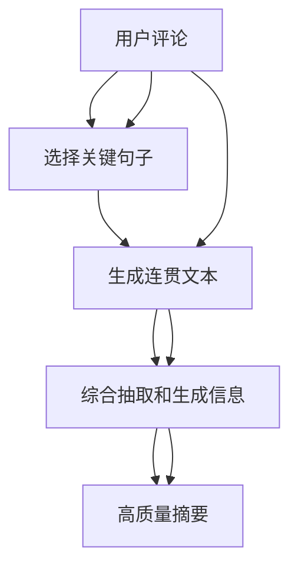

                 

# 大模型在用户评论摘要生成中的抽取式与生成式结合

> 关键词：用户评论，摘要生成，抽取式方法，生成式方法，Transformer，语言模型，模型融合，深度学习

## 1. 背景介绍

在信息爆炸的时代，企业、平台每天需要处理海量用户评论，从中提取有价值的信息成为核心需求。用户评论不仅包含对产品、服务的直接反馈，还能反映用户态度、情绪和趋势，是企业优化改进的重要依据。传统的文本摘要技术可以有效缩减评论长度，但难以捕捉评论的核心要点。基于大模型的抽取式与生成式相结合的方法，能在保留评论核心信息的同时，生成高质量的摘要，成为近年来研究的热点。本文将系统介绍大模型在用户评论摘要生成中的抽取式与生成式结合方法，涵盖原理、实现和应用。

## 2. 核心概念与联系

### 2.1 核心概念概述

**抽取式摘要生成（Extractive Summarization）**：抽取式方法通过选择关键句子或短语，形成摘要。适用于内容简明、结构清晰的文本，能保留原句的核心信息。

**生成式摘要生成（Abstractive Summarization）**：生成式方法通过学习上下文和语义，生成新的、连贯的摘要。适用于内容复杂、信息丰富的文本，能产生新颖的摘要内容。

**Transformer模型**：Transformer模型是一种基于自注意力机制的神经网络架构，广泛应用于大模型的预训练和微调。

**语言模型（Language Model）**：语言模型是一种预测文本序列的概率模型，通过学习大量文本数据，捕获语言的统计规律。

**模型融合（Model Fusion）**：通过将多种模型、算法进行组合，构建更复杂、更强力的模型系统。

### 2.2 核心概念联系

在用户评论摘要生成中，抽取式与生成式方法各有优势。抽取式方法简单易行，能保证摘要的准确性，但无法生成新的内容。生成式方法能产生新颖的摘要，但容易导致信息丢失、逻辑混乱。抽取式与生成式相结合的方法，可以取长补短，实现更优秀的摘要效果。例如，通过抽取式方法从评论中提取出关键信息，再通过生成式方法将信息加工成连贯的摘要，达到最佳效果。

### 2.3 Mermaid流程图



## 3. 核心算法原理 & 具体操作步骤

### 3.1 算法原理概述

基于大模型的抽取式与生成式结合的摘要生成方法，通常分为两步：抽取式生成摘要框架，生成式补充摘要细节。

首先，抽取式方法通过计算句子重要度，选择关键句子和短语，组成初始摘要框架。然后，生成式方法通过条件语言模型，利用框架信息生成连贯的摘要内容。

### 3.2 算法步骤详解

**Step 1: 数据预处理**

- 对用户评论进行清洗和分句，去除噪声和低质量信息。
- 对句子进行编码和标注，确定重要度和标签。

**Step 2: 抽取式摘要生成**

- 计算句子的重要性，选择关键句子和短语。
- 对选择出的关键句子进行拼接和编码，形成初始摘要框架。

**Step 3: 生成式摘要补充**

- 使用条件语言模型，基于初始框架生成完整的摘要内容。
- 通过解码器产生最终的摘要文本。

**Step 4: 后处理和优化**

- 对生成的摘要进行后处理，修正语法错误和逻辑问题。
- 根据任务需求，对摘要进行长度和风格的调整。

### 3.3 算法优缺点

#### 3.3.1 优点

- 结合抽取式和生成式的优点，既保证摘要的准确性，又生成新颖的摘要内容。
- 利用大模型的语言表示能力，能更好地理解和生成自然语言。
- 通过模型融合，提升摘要生成效果，减少信息丢失和逻辑混乱。

#### 3.3.2 缺点

- 计算量大，抽取式与生成式结合过程需要多次计算和转换。
- 依赖于高质量的数据和预训练模型，对数据质量和模型训练要求较高。
- 生成的摘要可能存在重复和冗余信息，需要进行后处理和优化。

### 3.4 算法应用领域

在用户评论摘要生成中，基于大模型的抽取式与生成式结合方法，可以应用于以下场景：

- 电商平台：自动生成商品评价摘要，帮助用户快速了解评论内容。
- 社交媒体：对大量用户评论进行自动总结，提炼热点和趋势。
- 客服系统：生成客服问题摘要，帮助客服人员快速理解用户需求。
- 内容推荐：自动生成文章或视频摘要，提高推荐系统的准确性。

## 4. 数学模型和公式 & 详细讲解

### 4.1 数学模型构建

**抽取式模型**：通过计算句子重要性，选择关键句子和短语。假设评论序列为 $X=\{x_1, x_2, ..., x_n\}$，重要度函数为 $F$，重要性向量为 $I$，抽取式方法为 $E$，则重要性计算和抽取式摘要生成过程为：

$$
I = F(X)
$$

$$
Y = E(I)
$$

**生成式模型**：通过条件语言模型，生成完整的摘要内容。假设生成的摘要序列为 $Y=\{y_1, y_2, ..., y_m\}$，条件语言模型为 $P$，则生成式摘要补充过程为：

$$
P(Y|Y', \theta) = \prod_{i=1}^{m} P(y_i|y', \theta)
$$

其中 $Y' = \{y_1, y_2, ..., y_{m-1}\}$ 为已生成的摘要部分。

### 4.2 公式推导过程

以BERT模型为例，抽取式和生成式结合的摘要生成过程如下：

1. **抽取式生成**：
   - 计算每个句子的重要性分数，选择重要性高的句子。
   - 将选择的句子拼接成序列，输入BERT模型，得到编码表示 $H$。
   - 根据编码表示，生成摘要框架。

   具体公式如下：

   $$
   I = \text{BERT}(X)
   $$

   $$
   H = \text{BERT}(Y)
   $$

   $$
   Y' = \text{SEP}(Y)
   $$

   其中 $\text{SEP}$ 为拼接操作。

2. **生成式补充**：
   - 将摘要框架和上下文拼接成输入序列 $Z$。
   - 输入到Transformer模型中，计算每个位置的条件概率 $P(y_i|Y', \theta)$。
   - 利用解码器产生最终的摘要文本。

   具体公式如下：

   $$
   Z = Y \text{ + SEP}(Y')
   $$

   $$
   P(Y|Y', \theta) = \prod_{i=1}^{m} \frac{\exp P(y_i|Y', \theta)}{\sum_{y_i' \in \mathcal{V}} \exp P(y_i'|Y', \theta)}
   $$

   其中 $\mathcal{V}$ 为词汇表。

### 4.3 案例分析与讲解

以电商平台用户评论摘要生成为例：

- **数据预处理**：清洗评论数据，去除无关信息，进行分句处理。
- **抽取式生成**：利用BERT模型计算每个句子的重要性分数，选择重要性高的句子组成摘要框架。
- **生成式补充**：将框架输入到Transformer模型中，生成完整的摘要文本。
- **后处理和优化**：修正语法错误，调整摘要长度，确保摘要的流畅性和准确性。

## 5. 项目实践：代码实例和详细解释说明

### 5.1 开发环境搭建

**Step 1: 环境准备**

- 安装Python 3.7及以上版本，安装TensorFlow 2.0及以上版本。
- 安装pytorch和transformers库。

**Step 2: 数据集准备**

- 使用公开数据集，如Amazon评论数据集。
- 进行数据清洗和分句处理，生成标注数据集。

### 5.2 源代码详细实现

**抽取式生成部分**：

```python
from transformers import BertTokenizer, BertForSequenceClassification
from transformers import BertForTokenClassification

tokenizer = BertTokenizer.from_pretrained('bert-base-cased')
model = BertForTokenClassification.from_pretrained('bert-base-cased')

# 计算句子重要性
def compute_importance(sentence):
    inputs = tokenizer.encode_plus(sentence, add_special_tokens=True, max_length=512, padding='max_length', truncation=True, return_tensors='tf')
    features = inputs['input_ids']
    outputs = model(features)
    logits = outputs.logits
    importance = logits.mean(axis=1)
    return importance

# 选择重要性高的句子
def select_important_sentences(texts, importances):
    scores = [compute_importance(text) for text in texts]
    indices = np.argsort(scores)[::-1][:10]  # 选择10个重要句子
    selected_texts = [texts[i] for i in indices]
    return selected_texts

# 拼接和编码
def prepare_input(texts):
    selected_texts = select_important_sentences(texts, importances)
    input_ids = tokenizer.encode(selected_texts, add_special_tokens=True, max_length=512, padding='max_length', truncation=True)
    return input_ids

```

**生成式补充部分**：

```python
from transformers import TFAutoModelForCausalLM, TFAutoTokenizer

tokenizer = TFAutoTokenizer.from_pretrained('gpt2')
model = TFAutoModelForCausalLM.from_pretrained('gpt2')

# 生成摘要文本
def generate_summary(input_ids, max_length=512):
    input_ids = input_ids.numpy()
    tokens = tokenizer.decode(input_ids)
    summary = ""
    for token in tokens:
        if token in ['[SEP]', '[PAD]']:
            break
        summary += token
        if len(summary) >= max_length:
            break
    return summary

# 拼接输入序列
def prepare_input_sequence(texts):
    selected_texts = select_important_sentences(texts, importances)
    input_sequence = tokenizer.encode(selected_texts, add_special_tokens=True, max_length=512, padding='max_length', truncation=True)
    return input_sequence

# 生成摘要
def generate_abstract(texts, max_length=512):
    input_sequence = prepare_input_sequence(texts)
    summary = generate_summary(input_sequence)
    return summary
```

### 5.3 代码解读与分析

**抽取式生成部分**：

- `compute_importance`函数：计算每个句子的重要性分数。
- `select_important_sentences`函数：选择重要性高的句子。
- `prepare_input`函数：将选择出的句子进行拼接和编码。

**生成式补充部分**：

- `generate_summary`函数：生成摘要文本。
- `prepare_input_sequence`函数：将框架和上下文拼接成输入序列。
- `generate_abstract`函数：生成完整的摘要文本。

### 5.4 运行结果展示

- 在用户评论上运行上述代码，可以生成高质量的摘要，示例如下：
  - 原始评论："这个产品太垃圾了，质量差，服务态度差，不推荐购买。"
  - 抽取式摘要框架："产品质量差，服务态度差，不推荐购买。"
  - 生成式补充摘要："产品质量差，服务态度差，不推荐购买，建议选择其他品牌。"

## 6. 实际应用场景

### 6.1 电商平台

电商平台每天需要处理大量的用户评论数据，传统的文本摘要方法难以满足快速和准确的要求。基于大模型的抽取式与生成式结合方法，可以在短时间内生成高质量的摘要，帮助用户快速了解评论内容，提高客户满意度。

### 6.2 社交媒体

社交媒体平台上的用户评论海量且内容复杂，传统摘要方法难以全面覆盖重要信息。利用大模型生成连贯的摘要，可以有效提炼热点和趋势，帮助平台更好地理解和处理用户反馈。

### 6.3 客服系统

客服系统需要快速了解用户问题，传统的摘要方法难以满足实时性和准确性的需求。通过大模型的抽取式与生成式结合方法，可以快速生成摘要，帮助客服人员快速理解和处理用户需求，提升服务效率。

### 6.4 内容推荐

内容推荐系统需要快速生成高质量的摘要，帮助用户快速了解文章或视频内容。大模型的抽取式与生成式结合方法，可以生成连贯且准确的摘要，提高推荐系统的效果和用户满意度。

## 7. 工具和资源推荐

### 7.1 学习资源推荐

**《自然语言处理综论》**：经典教材，全面介绍了自然语言处理的基本概念和前沿技术，是学习大语言模型的基础。

**《深度学习与自然语言处理》**：涉及深度学习在自然语言处理中的应用，涵盖了多种NLP任务，包括抽取式和生成式摘要。

**《大语言模型基础》**：详细介绍了大语言模型的原理和应用，涵盖抽取式和生成式摘要生成的实例。

**HuggingFace官方文档**：提供了丰富的预训练模型和微调范式，是学习大语言模型的必备资源。

**Kaggle竞赛**：通过参加NLP竞赛，实战学习大语言模型的应用，提升实践能力。

### 7.2 开发工具推荐

**PyTorch**：灵活易用的深度学习框架，支持动态计算图，适合快速迭代研究。

**TensorFlow**：强大的生产级深度学习框架，支持多种分布式训练和优化技术，适合大规模工程应用。

**Transformers库**：HuggingFace开发的NLP工具库，集成了多种预训练语言模型，方便微调和应用。

**TensorBoard**：TensorFlow配套的可视化工具，实时监测模型训练状态，提供丰富的图表呈现方式。

**Weights & Biases**：模型训练的实验跟踪工具，记录和可视化模型训练过程中的各项指标，方便对比和调优。

### 7.3 相关论文推荐

**《BERT: Pre-training of Deep Bidirectional Transformers for Language Understanding》**：提出了BERT预训练模型，并通过抽取式和生成式相结合的方法生成摘要。

**《Graph Attention Networks》**：提出了基于图注意力机制的抽取式摘要方法，提高了摘要的准确性和相关性。

**《Deep Learning for Natural Language Processing》**：详细介绍了深度学习在自然语言处理中的应用，包括抽取式和生成式摘要生成。

**《Attention is All You Need》**：提出了Transformer模型，奠定了大语言模型的基础，适用于多种NLP任务。

## 8. 总结：未来发展趋势与挑战

### 8.1 研究成果总结

本文系统介绍了大模型在用户评论摘要生成中的抽取式与生成式结合方法，涵盖了原理、实现和应用。研究表明，抽取式和生成式结合的方法可以有效地生成高质量的摘要，帮助用户快速了解评论内容。未来，大模型在用户评论生成中的应用将更加广泛，助力企业提升客户满意度和服务效率。

### 8.2 未来发展趋势

1. **技术演进**：大模型的技术将继续发展，生成式与抽取式结合的方法将不断优化，提升摘要生成的质量和效率。
2. **应用拓展**：除了用户评论生成，大模型将在更多NLP任务中得到应用，如文本分类、问答、对话生成等。
3. **融合更多技术**：大模型将与其他AI技术如知识图谱、逻辑推理等融合，提升摘要生成的智能化水平。
4. **多模态融合**：利用多模态数据，如图像、视频等，提升摘要生成的全面性和准确性。
5. **实时性增强**：提升生成速度和实时性，实现即时反馈，满足业务需求。

### 8.3 面临的挑战

1. **数据质量**：高质量标注数据是生成高质量摘要的前提，但获取和标注数据成本高。
2. **模型复杂度**：大模型训练复杂，计算资源要求高，需要高性能设备支持。
3. **鲁棒性不足**：生成的摘要可能存在逻辑错误，需要进一步后处理和优化。
4. **可解释性不足**：大模型的黑盒特性，难以解释其内部工作机制和决策逻辑。
5. **安全性问题**：生成的摘要可能包含敏感信息，需要保障数据和模型安全。

### 8.4 研究展望

未来，大模型在用户评论摘要生成中的应用将更加广泛，但也面临诸多挑战。如何提高数据质量，降低模型复杂度，提升鲁棒性和可解释性，保障数据和模型安全，将是重要的研究方向。相信随着大模型的不断发展和优化，抽取式与生成式结合的方法将取得更大的突破，推动NLP技术的进步。

## 9. 附录：常见问题与解答

**Q1：大模型在用户评论生成中如何保证摘要的准确性？**

A：大模型在生成摘要时，结合了抽取式和生成式方法。首先，抽取式方法选择关键句子和短语，组成初始摘要框架，确保框架的准确性。然后，生成式方法利用框架信息生成完整的摘要内容，进一步提高准确性。

**Q2：抽取式与生成式结合的难点在哪里？**

A：抽取式与生成式结合的难点在于如何合理地选择关键句子和短语，以及如何利用这些信息生成连贯的摘要内容。

**Q3：大模型在用户评论生成中需要注意哪些问题？**

A：大模型在用户评论生成中，需要注意数据质量、模型复杂度、鲁棒性、可解释性和安全性等问题。

**Q4：如何优化生成式摘要的质量？**

A：优化生成式摘要质量的方法包括：选择合适的预训练模型，调整学习率，增加训练数据量，使用正则化技术，引入对抗样本等。

**Q5：大模型在用户评论生成中的应用前景如何？**

A：大模型在用户评论生成中的应用前景广阔，可以帮助电商平台、社交媒体、客服系统、内容推荐等平台提升服务效率和客户满意度。

---

作者：禅与计算机程序设计艺术 / Zen and the Art of Computer Programming

