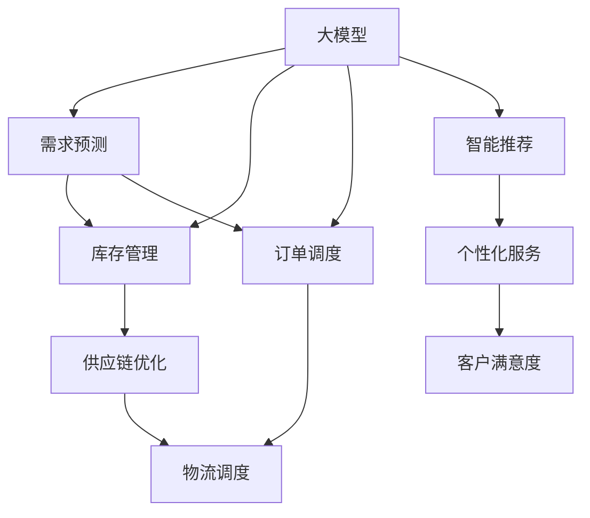

                 

# 大模型在电商平台供应链优化中的应用

> 关键词：大模型,电商平台,供应链优化,智能推荐,预测分析,需求管理,订单调度,模型评估

## 1. 背景介绍

### 1.1 问题由来

随着电商平台的迅猛发展，供应链的复杂度和不确定性也日益增加。传统基于规则的供应链管理系统，难以灵活应对市场波动、需求变化、突发事件等诸多挑战，急需引入智能技术进行优化和升级。大模型作为新一代人工智能技术的代表，其强大的学习能力和泛化能力，为供应链优化提供了新的可能性。

大模型在供应链优化中的应用，包括需求预测、库存管理、订单调度、智能推荐等诸多方面。通过引入大模型，电商平台能够实现对数据的深度挖掘和智能决策，提高运营效率，降低成本，提升客户满意度。

### 1.2 问题核心关键点

大模型在供应链优化中的核心关键点包括：
- 数据的多模态融合：供应链数据涵盖订单、库存、物流、财务等多个维度，需通过大模型进行多模态融合，统一处理和分析。
- 需求的动态预测：利用大模型进行需求预测，提前掌握市场动向，减少库存积压和缺货现象。
- 智能推荐与个性化服务：通过大模型分析用户行为，提供个性化推荐，提升用户体验和转化率。
- 订单调度的优化：利用大模型优化订单调度方案，实现快速响应和高效配送。
- 模型的评估与优化：需对大模型的预测效果进行定期评估，通过反馈不断优化模型。

### 1.3 问题研究意义

大模型在电商平台供应链优化中的应用，对于提升供应链管理效率、降低运营成本、提升客户体验具有重要意义：

1. 数据驱动决策：通过大模型对海量数据进行深度学习，帮助决策者理解市场动态，做出更为科学的决策。
2. 智能优化供应链：利用大模型优化库存管理、订单调度和物流配送等环节，提高供应链效率。
3. 个性化用户体验：通过智能推荐，提升用户粘性和购买转化率，增加平台收益。
4. 成本节约：优化库存和物流调度，减少不必要的库存和物流费用，降低平台运营成本。
5. 数据安全与隐私保护：大模型训练需注意数据隐私保护，避免敏感数据泄露，保障平台和用户数据安全。

## 2. 核心概念与联系

### 2.1 核心概念概述

为更好地理解大模型在供应链优化中的应用，本节将介绍几个密切相关的核心概念：

- 大模型(Large Model)：以自回归(如GPT)或自编码(如BERT)模型为代表的大规模预训练语言模型。通过在大规模无标签文本语料上进行预训练，学习通用的语言表示，具备强大的语言理解和生成能力。
- 供应链管理(Supply Chain Management, SCM)：从采购、生产、库存、配送等环节，实现对商品流、信息流、资金流的全面管理和优化。
- 需求预测(Demand Forecasting)：利用历史数据和市场趋势，预测未来某一时间段内商品的需求量，辅助库存管理和订单调度。
- 库存管理(Inventory Management)：对商品库存进行实时监控和优化，减少库存积压和缺货现象。
- 订单调度(Order Scheduling)：通过优化订单调度和物流路径，提高配送效率和客户满意度。
- 智能推荐(Intelligent Recommendation)：根据用户行为和历史数据，推荐用户可能感兴趣的商品，提升用户体验和转化率。
- 模型评估(Model Evaluation)：通过设定合适的评估指标和评估方法，对大模型的预测效果进行定期评估和优化。

这些核心概念之间的逻辑关系可以通过以下Mermaid流程图来展示：



这个流程图展示了大模型与供应链管理各环节的联系：

1. 大模型通过需求预测、库存管理、订单调度和智能推荐等任务，提升供应链管理效率。
2. 通过优化需求预测，提高库存管理、订单调度和物流调度的准确性。
3. 通过智能推荐，提升个性化服务水平，增强客户粘性和满意度。

## 3. 核心算法原理 & 具体操作步骤
### 3.1 算法原理概述

大模型在电商平台供应链优化中的应用，核心在于利用大模型进行需求预测、库存管理、订单调度和智能推荐等任务的优化。其核心思想是：将电商平台的数据视为一种特殊的文本数据，通过大模型学习其特征和规律，输出预测结果和优化方案。

形式化地，假设电商平台的数据集为 $D=\{(x_i,y_i)\}_{i=1}^N$，其中 $x_i$ 表示电商平台的历史数据（如订单、库存、物流等），$y_i$ 表示电商平台的目标（如需求预测、库存管理等）。则优化目标是最小化预测误差：

$$
\min_{\theta} \sum_{i=1}^N \ell(y_i,f_{\theta}(x_i))
$$

其中 $f_{\theta}(x_i)$ 为利用大模型 $M_{\theta}$ 预测的输出结果，$\ell$ 为损失函数（如均方误差、交叉熵等）。

### 3.2 算法步骤详解

基于大模型在电商平台供应链优化中的应用，本节将详细讲解具体的操作步骤：

**Step 1: 数据准备与预处理**
- 收集电商平台的历史数据，包括订单、库存、物流、财务等各个维度的数据。
- 清洗数据，处理缺失值、异常值等，保证数据质量。
- 将多模态数据融合为统一的文本数据，如将订单数据转换为文本格式。

**Step 2: 模型训练与预测**
- 选择合适的预训练语言模型 $M_{\theta}$ 作为初始化参数，如BERT、GPT等。
- 根据具体任务，设计合适的训练数据集和输出格式，构建损失函数。
- 使用大模型训练数据集，优化模型参数。
- 使用训练好的模型对新数据进行预测，输出优化结果。

**Step 3: 优化与评估**
- 根据预测结果和实际数据，评估模型的效果。
- 根据评估结果，调整模型参数和训练策略，提高预测准确性。
- 定期进行模型更新，以应对市场变化和需求波动。

**Step 4: 部署与应用**
- 将训练好的模型部署到电商平台的供应链管理系统中。
- 根据模型的预测结果，自动调整库存、优化订单调度和物流配送。
- 提供智能推荐服务，提升用户粘性和满意度。
- 定期收集用户反馈和行为数据，持续优化模型。

### 3.3 算法优缺点

大模型在电商平台供应链优化中的应用，具有以下优点：
1. 强大的学习能力：大模型能够学习海量数据中的复杂模式，预测能力强。
2. 高泛化能力：大模型泛化能力强，能够应对多种不同类型的市场变化。
3. 灵活性高：大模型可以适应不同电商平台的业务需求，进行个性化优化。
4. 降低运营成本：通过优化库存和物流，降低运营成本。
5. 提升客户体验：通过个性化推荐和智能调度，提升客户满意度和购买转化率。

同时，该方法也存在一些缺点：
1. 数据依赖度高：模型训练和预测需要大量高质量的数据，数据获取难度大。
2. 计算资源消耗大：大模型的计算和存储空间消耗大，成本较高。
3. 模型的可解释性差：大模型难以解释其预测过程，需要依赖反馈不断优化。
4. 模型的稳定性和鲁棒性不足：大模型可能存在过拟合和泛化差的问题。
5. 模型的部署难度大：模型训练和预测需要高性能计算资源，部署难度较大。

尽管存在这些缺点，但就目前而言，大模型在电商平台供应链优化中的应用仍具有很大的优势。未来相关研究的重点在于如何进一步降低计算资源消耗，提高模型的稳定性和鲁棒性，增强模型的可解释性，确保模型的安全性和合规性。

### 3.4 算法应用领域

大模型在电商平台供应链优化中的应用，已经在多个领域取得了显著成效，例如：

- 需求预测：利用大模型对未来需求进行预测，提前掌握市场趋势，优化库存管理。
- 库存管理：通过大模型对库存数据进行分析和优化，减少库存积压和缺货现象。
- 订单调度：利用大模型优化订单调度和物流配送，提升配送效率和客户满意度。
- 智能推荐：通过大模型对用户行为进行分析和推荐，提升用户粘性和购买转化率。

除了上述这些经典应用外，大模型还被创新性地应用到更多场景中，如供应链风险管理、个性化定价、供应链网络优化等，为电商平台的运营提供了更强大的支持。

## 4. 数学模型和公式 & 详细讲解  
### 4.1 数学模型构建

本节将使用数学语言对大模型在电商平台供应链优化中的应用进行更加严格的刻画。

记电商平台的数据集为 $D=\{(x_i,y_i)\}_{i=1}^N$，其中 $x_i$ 表示电商平台的历史数据，$y_i$ 表示电商平台的目标。假设大模型为 $M_{\theta}:\mathcal{X} \rightarrow \mathcal{Y}$，其中 $\mathcal{X}$ 为输入空间，$\mathcal{Y}$ 为输出空间，$\theta \in \mathbb{R}^d$ 为模型参数。

定义模型 $M_{\theta}$ 在数据样本 $(x,y)$ 上的损失函数为 $\ell(M_{\theta}(x),y)$，则在数据集 $D$ 上的经验风险为：

$$
\mathcal{L}(\theta) = \frac{1}{N} \sum_{i=1}^N \ell(M_{\theta}(x_i),y_i)
$$

微调的优化目标是最小化经验风险，即找到最优参数：

$$
\theta^* = \mathop{\arg\min}_{\theta} \mathcal{L}(\theta)
$$

在实践中，我们通常使用基于梯度的优化算法（如SGD、Adam等）来近似求解上述最优化问题。设 $\eta$ 为学习率，$\lambda$ 为正则化系数，则参数的更新公式为：

$$
\theta \leftarrow \theta - \eta \nabla_{\theta}\mathcal{L}(\theta) - \eta\lambda\theta
$$

其中 $\nabla_{\theta}\mathcal{L}(\theta)$ 为损失函数对参数 $\theta$ 的梯度，可通过反向传播算法高效计算。

### 4.2 公式推导过程

以下我们以需求预测任务为例，推导线性回归模型的损失函数及其梯度的计算公式。

假设模型 $M_{\theta}$ 在输入 $x$ 上的输出为 $\hat{y}=M_{\theta}(x)$，表示预测的需求量。真实标签 $y \in \mathbb{R}$。则线性回归模型的损失函数定义为：

$$
\ell(M_{\theta}(x),y) = (y-\hat{y})^2
$$

将其代入经验风险公式，得：

$$
\mathcal{L}(\theta) = \frac{1}{N} \sum_{i=1}^N (y_i-M_{\theta}(x_i))^2
$$

根据链式法则，损失函数对参数 $\theta_k$ 的梯度为：

$$
\frac{\partial \mathcal{L}(\theta)}{\partial \theta_k} = \frac{1}{N} \sum_{i=1}^N -2(y_i-M_{\theta}(x_i)) \frac{\partial M_{\theta}(x_i)}{\partial \theta_k}
$$

其中 $\frac{\partial M_{\theta}(x_i)}{\partial \theta_k}$ 可进一步递归展开，利用自动微分技术完成计算。

在得到损失函数的梯度后，即可带入参数更新公式，完成模型的迭代优化。重复上述过程直至收敛，最终得到适应电商供应链优化任务的最优模型参数 $\theta^*$。

## 5. 项目实践：代码实例和详细解释说明
### 5.1 开发环境搭建

在进行供应链优化任务的大模型实践前，我们需要准备好开发环境。以下是使用Python进行PyTorch开发的环境配置流程：

1. 安装Anaconda：从官网下载并安装Anaconda，用于创建独立的Python环境。

2. 创建并激活虚拟环境：
```bash
conda create -n pytorch-env python=3.8 
conda activate pytorch-env
```

3. 安装PyTorch：根据CUDA版本，从官网获取对应的安装命令。例如：
```bash
conda install pytorch torchvision torchaudio cudatoolkit=11.1 -c pytorch -c conda-forge
```

4. 安装Transformer库：
```bash
pip install transformers
```

5. 安装各类工具包：
```bash
pip install numpy pandas scikit-learn matplotlib tqdm jupyter notebook ipython
```

完成上述步骤后，即可在`pytorch-env`环境中开始微调实践。

### 5.2 源代码详细实现

下面我们以电商平台的需求预测任务为例，给出使用Transformers库对BERT模型进行微调的PyTorch代码实现。

首先，定义需求预测任务的数据处理函数：

```python
from transformers import BertTokenizer
from torch.utils.data import Dataset
import torch

class DemandDataset(Dataset):
    def __init__(self, features, tokenizer, max_len=128):
        self.features = features
        self.tokenizer = tokenizer
        self.max_len = max_len
        
    def __len__(self):
        return len(self.features)
    
    def __getitem__(self, item):
        data = self.features[item]
        labels = data['target']
        
        encoding = self.tokenizer(data['text'], return_tensors='pt', max_length=self.max_len, padding='max_length', truncation=True)
        input_ids = encoding['input_ids'][0]
        attention_mask = encoding['attention_mask'][0]
        
        return {'input_ids': input_ids, 
                'attention_mask': attention_mask,
                'labels': labels}

# 定义标签与id的映射
tag2id = {'low': 0, 'normal': 1, 'high': 2}
id2tag = {v: k for k, v in tag2id.items()}

# 创建dataset
tokenizer = BertTokenizer.from_pretrained('bert-base-cased')

train_dataset = DemandDataset(train_features, tokenizer)
dev_dataset = DemandDataset(dev_features, tokenizer)
test_dataset = DemandDataset(test_features, tokenizer)
```

然后，定义模型和优化器：

```python
from transformers import BertForRegression
from torch.optim import AdamW

model = BertForRegression.from_pretrained('bert-base-cased')

optimizer = AdamW(model.parameters(), lr=2e-5)
```

接着，定义训练和评估函数：

```python
from torch.utils.data import DataLoader
from tqdm import tqdm
from sklearn.metrics import mean_squared_error

device = torch.device('cuda') if torch.cuda.is_available() else torch.device('cpu')
model.to(device)

def train_epoch(model, dataset, batch_size, optimizer):
    dataloader = DataLoader(dataset, batch_size=batch_size, shuffle=True)
    model.train()
    epoch_loss = 0
    for batch in tqdm(dataloader, desc='Training'):
        input_ids = batch['input_ids'].to(device)
        attention_mask = batch['attention_mask'].to(device)
        labels = batch['labels'].to(device)
        model.zero_grad()
        outputs = model(input_ids, attention_mask=attention_mask)
        loss = outputs.loss
        epoch_loss += loss.item()
        loss.backward()
        optimizer.step()
    return epoch_loss / len(dataloader)

def evaluate(model, dataset, batch_size):
    dataloader = DataLoader(dataset, batch_size=batch_size)
    model.eval()
    preds, labels = [], []
    with torch.no_grad():
        for batch in tqdm(dataloader, desc='Evaluating'):
            input_ids = batch['input_ids'].to(device)
            attention_mask = batch['attention_mask'].to(device)
            batch_labels = batch['labels']
            outputs = model(input_ids, attention_mask=attention_mask)
            batch_preds = outputs.predictions.argmax(dim=1).to('cpu').tolist()
            batch_labels = batch_labels.to('cpu').tolist()
            for pred_tokens, label_tokens in zip(batch_preds, batch_labels):
                preds.append(pred_tokens[:len(label_tokens)])
                labels.append(label_tokens)
                
    mse = mean_squared_error(labels, preds)
    return mse
```

最后，启动训练流程并在测试集上评估：

```python
epochs = 5
batch_size = 16

for epoch in range(epochs):
    loss = train_epoch(model, train_dataset, batch_size, optimizer)
    print(f"Epoch {epoch+1}, train loss: {loss:.3f}")
    
    print(f"Epoch {epoch+1}, dev MSE:")
    mse = evaluate(model, dev_dataset, batch_size)
    print(f"{mse:.3f}")
    
print("Test MSE:")
mse = evaluate(model, test_dataset, batch_size)
print(f"{mse:.3f}")
```

以上就是使用PyTorch对BERT进行需求预测任务的完整代码实现。可以看到，得益于Transformer库的强大封装，我们可以用相对简洁的代码完成BERT模型的加载和微调。

### 5.3 代码解读与分析

让我们再详细解读一下关键代码的实现细节：

**DemandDataset类**：
- `__init__`方法：初始化特征数据、分词器等关键组件。
- `__len__`方法：返回数据集的样本数量。
- `__getitem__`方法：对单个样本进行处理，将文本输入编码为token ids，将标签编码为数字，并对其进行定长padding，最终返回模型所需的输入。

**tag2id和id2tag字典**：
- 定义了标签与数字id之间的映射关系，用于将token-wise的预测结果解码回真实的标签。

**训练和评估函数**：
- 使用PyTorch的DataLoader对数据集进行批次化加载，供模型训练和推理使用。
- 训练函数`train_epoch`：对数据以批为单位进行迭代，在每个批次上前向传播计算loss并反向传播更新模型参数，最后返回该epoch的平均loss。
- 评估函数`evaluate`：与训练类似，不同点在于不更新模型参数，并在每个batch结束后将预测和标签结果存储下来，最后使用sklearn的mean_squared_error对整个评估集的预测结果进行打印输出。

**训练流程**：
- 定义总的epoch数和batch size，开始循环迭代
- 每个epoch内，先在训练集上训练，输出平均loss
- 在验证集上评估，输出MSE
- 所有epoch结束后，在测试集上评估，给出最终测试结果

可以看到，PyTorch配合Transformer库使得BERT微调的需求预测任务代码实现变得简洁高效。开发者可以将更多精力放在数据处理、模型改进等高层逻辑上，而不必过多关注底层的实现细节。

当然，工业级的系统实现还需考虑更多因素，如模型的保存和部署、超参数的自动搜索、更灵活的任务适配层等。但核心的微调范式基本与此类似。

## 6. 实际应用场景
### 6.1 智能仓库管理

基于大模型的电商平台供应链优化，可以广泛应用于智能仓库管理系统的构建。传统仓库管理依赖于人工经验，效率低下且容易出错。而使用大模型进行需求预测和库存管理，可以实时掌握库存状态，自动生成补货和出货方案，提升仓库运营效率。

在技术实现上，可以收集仓库的历史数据，如订单量、商品销量、库存量等，将其作为监督数据，在此基础上对预训练大模型进行微调。微调后的模型能够自动预测未来的订单需求，优化库存管理，减少库存积压和缺货现象。

### 6.2 订单调度和物流优化

通过大模型的预测和优化能力，电商平台的订单调度和物流优化也可以显著提升。传统订单调度和物流路径依赖于规则和经验，难以灵活应对市场需求的变化。而利用大模型进行订单调度和路径优化，可以实时计算最优调度方案，提升配送效率和客户满意度。

具体而言，可以收集订单的历史数据、物流公司的实时运输数据，结合天气、交通等外部因素，构建大模型的输入数据集。在此基础上，利用大模型进行订单调度和路径优化，自动生成最优的配送方案。

### 6.3 个性化营销

通过大模型对用户行为进行分析和预测，电商平台的个性化营销策略也能得到显著提升。传统营销策略往往难以精准识别用户的真实需求，导致营销效果不佳。而利用大模型进行个性化推荐，可以精确把握用户兴趣，提升用户体验和转化率。

具体而言，可以收集用户的历史行为数据，如浏览记录、购买记录、搜索记录等，构建用户画像。在此基础上，利用大模型对用户行为进行分析和预测，推荐用户可能感兴趣的商品，提升用户粘性和购买转化率。

### 6.4 未来应用展望

随着大模型和供应链优化方法的不断发展，基于大模型的大数据优化技术将在更多领域得到应用，为传统行业带来变革性影响。

在智慧物流领域，基于大模型的物流管理、运输优化、路径规划等技术，将提升物流行业的自动化和智能化水平，构建更高效、安全的物流体系。

在智能制造领域，利用大模型进行需求预测、库存管理、生产调度等优化，将提升制造企业的生产效率和产品质量。

在智慧城市治理中，大模型可以应用于城市事件监测、舆情分析、应急指挥等环节，提高城市管理的自动化和智能化水平，构建更安全、高效的未来城市。

此外，在零售、金融、医疗等多个行业，基于大模型的供应链优化技术也将不断涌现，为各行各业带来新的技术突破。相信随着技术的日益成熟，大模型在供应链优化领域的应用将更加广泛，推动各行各业的数字化转型升级。

## 7. 工具和资源推荐
### 7.1 学习资源推荐

为了帮助开发者系统掌握大模型在电商平台供应链优化中的应用，这里推荐一些优质的学习资源：

1. 《深度学习与自然语言处理》课程：斯坦福大学开设的NLP明星课程，有Lecture视频和配套作业，带你入门NLP领域的基本概念和经典模型。

2. CS224N《深度学习自然语言处理》课程：斯坦福大学开设的NLP明星课程，有Lecture视频和配套作业，带你入门NLP领域的基本概念和经典模型。

3. 《Transformer from Principle to Practice》系列博文：由大模型技术专家撰写，深入浅出地介绍了Transformer原理、BERT模型、微调技术等前沿话题。

4. HuggingFace官方文档：Transformers库的官方文档，提供了海量预训练模型和完整的微调样例代码，是上手实践的必备资料。

5. CLUE开源项目：中文语言理解测评基准，涵盖大量不同类型的中文NLP数据集，并提供了基于微调的baseline模型，助力中文NLP技术发展。

通过对这些资源的学习实践，相信你一定能够快速掌握大模型在电商平台供应链优化中的应用，并用于解决实际的供应链问题。
###  7.2 开发工具推荐

高效的开发离不开优秀的工具支持。以下是几款用于大模型在电商平台供应链优化任务开发的常用工具：

1. PyTorch：基于Python的开源深度学习框架，灵活动态的计算图，适合快速迭代研究。大部分预训练语言模型都有PyTorch版本的实现。

2. TensorFlow：由Google主导开发的开源深度学习框架，生产部署方便，适合大规模工程应用。同样有丰富的预训练语言模型资源。

3. Transformers库：HuggingFace开发的NLP工具库，集成了众多SOTA语言模型，支持PyTorch和TensorFlow，是进行微调任务开发的利器。

4. Weights & Biases：模型训练的实验跟踪工具，可以记录和可视化模型训练过程中的各项指标，方便对比和调优。与主流深度学习框架无缝集成。

5. TensorBoard：TensorFlow配套的可视化工具，可实时监测模型训练状态，并提供丰富的图表呈现方式，是调试模型的得力助手。

6. Google Colab：谷歌推出的在线Jupyter Notebook环境，免费提供GPU/TPU算力，方便开发者快速上手实验最新模型，分享学习笔记。

合理利用这些工具，可以显著提升大模型在电商平台供应链优化任务中的开发效率，加快创新迭代的步伐。

### 7.3 相关论文推荐

大模型在电商平台供应链优化中的应用，源于学界的持续研究。以下是几篇奠基性的相关论文，推荐阅读：

1. Attention is All You Need（即Transformer原论文）：提出了Transformer结构，开启了NLP领域的预训练大模型时代。

2. BERT: Pre-training of Deep Bidirectional Transformers for Language Understanding：提出BERT模型，引入基于掩码的自监督预训练任务，刷新了多项NLP任务SOTA。

3. Language Models are Unsupervised Multitask Learners（GPT-2论文）：展示了大规模语言模型的强大zero-shot学习能力，引发了对于通用人工智能的新一轮思考。

4. Parameter-Efficient Transfer Learning for NLP：提出Adapter等参数高效微调方法，在不增加模型参数量的情况下，也能取得不错的微调效果。

5. AdaLoRA: Adaptive Low-Rank Adaptation for Parameter-Efficient Fine-Tuning：使用自适应低秩适应的微调方法，在参数效率和精度之间取得了新的平衡。

这些论文代表了大模型在电商平台供应链优化中的应用发展脉络。通过学习这些前沿成果，可以帮助研究者把握学科前进方向，激发更多的创新灵感。

## 8. 总结：未来发展趋势与挑战

### 8.1 总结

本文对大模型在电商平台供应链优化中的应用进行了全面系统的介绍。首先阐述了大模型和供应链优化技术的研究背景和意义，明确了大模型在供应链优化中的核心价值。其次，从原理到实践，详细讲解了需求预测、库存管理、订单调度和智能推荐等任务的数学模型和算法步骤，给出了完整的代码实现。同时，本文还广泛探讨了微调模型在智能仓库管理、订单调度和物流优化、个性化营销等供应链场景中的应用，展示了微调技术在供应链优化中的广阔前景。

通过本文的系统梳理，可以看到，大模型在电商平台供应链优化中的应用已经取得了显著成效，显著提升了供应链管理效率和客户满意度。未来，伴随大模型和微调方法的持续演进，相信供应链优化技术将进一步深入发展和优化。

### 8.2 未来发展趋势

展望未来，大模型在电商平台供应链优化中的应用将呈现以下几个发展趋势：

1. 模型规模持续增大。随着算力成本的下降和数据规模的扩张，预训练语言模型的参数量还将持续增长。超大规模语言模型蕴含的丰富语言知识，有望支撑更加复杂多变的供应链优化需求。

2. 微调方法日趋多样。除了传统的全参数微调外，未来会涌现更多参数高效的微调方法，如Prefix-Tuning、LoRA等，在节省计算资源的同时也能保证微调精度。

3. 持续学习成为常态。随着数据分布的不断变化，微调模型也需要持续学习新知识以保持性能。如何在不遗忘原有知识的同时，高效吸收新样本信息，将成为重要的研究课题。

4. 标注样本需求降低。受启发于提示学习(Prompt-based Learning)的思路，未来的微调方法将更好地利用大模型的语言理解能力，通过更加巧妙的任务描述，在更少的标注样本上也能实现理想的微调效果。

5. 多模态微调崛起。当前的微调主要聚焦于纯文本数据，未来会进一步拓展到图像、视频、语音等多模态数据微调。多模态信息的融合，将显著提升供应链系统的建模能力和预测效果。

6. 模型通用性增强。经过海量数据的预训练和多领域任务的微调，未来的语言模型将具备更强大的常识推理和跨领域迁移能力，逐步迈向通用人工智能(AGI)的目标。

以上趋势凸显了大模型在电商平台供应链优化中的广阔前景。这些方向的探索发展，必将进一步提升供应链管理效率、降低运营成本、提升客户体验，为电商平台的运营提供更强大的技术支持。

### 8.3 面临的挑战

尽管大模型在电商平台供应链优化中的应用已经取得了瞩目成就，但在迈向更加智能化、普适化应用的过程中，它仍面临着诸多挑战：

1. 数据依赖度高。模型训练和预测需要大量高质量的数据，数据获取难度大。如何构建和维护高质量的数据集，将是一大难题。

2. 计算资源消耗大。大模型的计算和存储空间消耗大，成本较高。如何降低计算成本，优化模型结构，提高模型效率，将是重要的优化方向。

3. 模型的可解释性差。大模型难以解释其预测过程，需要依赖反馈不断优化。如何增强模型的可解释性，确保模型的决策逻辑透明可控，将是一大挑战。

4. 模型的稳定性和鲁棒性不足。大模型可能存在过拟合和泛化差的问题。如何提高模型的稳定性和鲁棒性，避免灾难性遗忘，还需要更多理论和实践的积累。

5. 模型的部署难度大。模型训练和预测需要高性能计算资源，部署难度较大。如何降低部署难度，优化模型性能，将是大模型在电商平台供应链优化中的重要课题。

6. 数据隐私和安全问题。大模型训练需注意数据隐私保护，避免敏感数据泄露，保障平台和用户数据安全。如何确保数据隐私和安全，将是重要的研究课题。

尽管存在这些挑战，但就目前而言，大模型在电商平台供应链优化中的应用仍具有很大的优势。未来相关研究的重点在于如何进一步降低计算资源消耗，提高模型的稳定性和鲁棒性，增强模型的可解释性，确保模型的安全性和合规性。

### 8.4 研究展望

面向未来，大模型在电商平台供应链优化中的研究需要在以下几个方面寻求新的突破：

1. 探索无监督和半监督微调方法。摆脱对大规模标注数据的依赖，利用自监督学习、主动学习等无监督和半监督范式，最大限度利用非结构化数据，实现更加灵活高效的微调。

2. 研究参数高效和计算高效的微调范式。开发更加参数高效的微调方法，在固定大部分预训练参数的同时，只更新极少量的任务相关参数。同时优化微调模型的计算图，减少前向传播和反向传播的资源消耗，实现更加轻量级、实时性的部署。

3. 融合因果和对比学习范式。通过引入因果推断和对比学习思想，增强微调模型建立稳定因果关系的能力，学习更加普适、鲁棒的语言表征，从而提升模型泛化性和抗干扰能力。

4. 引入更多先验知识。将符号化的先验知识，如知识图谱、逻辑规则等，与神经网络模型进行巧妙融合，引导微调过程学习更准确、合理的语言模型。同时加强不同模态数据的整合，实现视觉、语音等多模态信息与文本信息的协同建模。

5. 结合因果分析和博弈论工具。将因果分析方法引入微调模型，识别出模型决策的关键特征，增强输出解释的因果性和逻辑性。借助博弈论工具刻画人机交互过程，主动探索并规避模型的脆弱点，提高系统稳定性。

6. 纳入伦理道德约束。在模型训练目标中引入伦理导向的评估指标，过滤和惩罚有偏见、有害的输出倾向。同时加强人工干预和审核，建立模型行为的监管机制，确保输出符合人类价值观和伦理道德。

这些研究方向的探索，必将引领大模型在电商平台供应链优化技术迈向更高的台阶，为构建安全、可靠、可解释、可控的智能系统铺平道路。面向未来，大模型在电商平台供应链优化技术还需要与其他人工智能技术进行更深入的融合，如知识表示、因果推理、强化学习等，多路径协同发力，共同推动自然语言理解和智能交互系统的进步。只有勇于创新、敢于突破，才能不断拓展语言模型的边界，让智能技术更好地造福人类社会。

## 9. 附录：常见问题与解答

**Q1：电商平台大模型微调是否适用于所有供应链优化任务？**

A: 电商平台大模型微调在大多数供应链优化任务上都能取得不错的效果，特别是对于数据量较小的任务。但对于一些特定领域的任务，如医药、法律等，仅仅依靠通用语料预训练的模型可能难以很好地适应。此时需要在特定领域语料上进一步预训练，再进行微调，才能获得理想效果。此外，对于一些需要时效性、个性化很强的任务，如需求预测、智能推荐等，微调方法也需要针对性的改进优化。

**Q2：如何选择合适的学习率？**

A: 微调的学习率一般要比预训练时小1-2个数量级，如果使用过大的学习率，容易破坏预训练权重，导致过拟合。一般建议从1e-5开始调参，逐步减小学习率，直至收敛。也可以使用warmup策略，在开始阶段使用较小的学习率，再逐渐过渡到预设值。需要注意的是，不同的优化器(如AdamW、Adafactor等)以及不同的学习率调度策略，可能需要设置不同的学习率阈值。

**Q3：电商平台大模型微调会遇到哪些资源瓶颈？**

A: 目前主流的预训练大模型动辄以亿计的参数规模，对算力、内存、存储都提出了很高的要求。GPU/TPU等高性能设备是必不可少的，但即便如此，超大批次的训练和推理也可能遇到显存不足的问题。因此需要采用一些资源优化技术，如梯度积累、混合精度训练、模型并行等，来突破硬件瓶颈。同时，模型的存储和读取也可能占用大量时间和空间，需要采用模型压缩、稀疏化存储等方法进行优化。

**Q4：如何缓解电商平台的过拟合问题？**

A: 过拟合是微调面临的主要挑战，尤其是在标注数据不足的情况下。常见的缓解策略包括：
1. 数据增强：通过回译、近义替换等方式扩充训练集
2. 正则化：使用L2正则、Dropout、Early Stopping等避免过拟合
3. 对抗训练：引入对抗样本，提高模型鲁棒性
4. 参数高效微调：只调整少量参数(如Adapter、Prefix等)，减小过拟合风险
5. 多模型集成：训练多个微调模型，取平均输出，抑制过拟合

这些策略往往需要根据具体任务和数据特点进行灵活组合。只有在数据、模型、训练、推理等各环节进行全面优化，才能最大限度地发挥大模型微调的威力。

**Q5：电商平台大模型微调在部署时需要注意哪些问题？**

A: 将微调模型转化为实际应用，还需要考虑以下因素：
1. 模型裁剪：去除不必要的层和参数，减小模型尺寸，加快推理速度
2. 量化加速：将浮点模型转为定点模型，压缩存储空间，提高计算效率
3. 服务化封装：将模型封装为标准化服务接口，便于集成调用
4. 弹性伸缩：根据请求流量动态调整资源配置，平衡服务质量和成本
5. 监控告警：实时采集系统指标，设置异常告警阈值，确保服务稳定性
6. 安全防护：采用访问鉴权、数据脱敏等措施，保障数据和模型安全

大模型在电商平台供应链优化中的应用，对于提升供应链管理效率、降低运营成本、提升客户体验具有重要意义。然而，在实际部署时，还需要考虑模型的效率、安全、稳定性等多方面因素，确保模型能够稳定可靠地运行。

