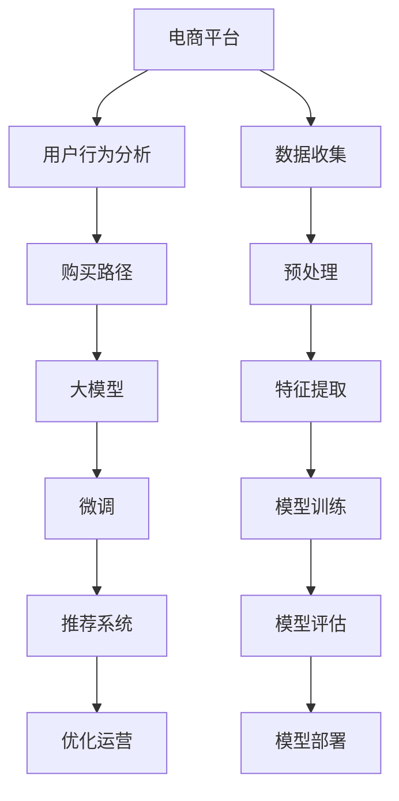

                 

# 大模型在电商平台用户购买路径分析中的应用

> 关键词：电商平台, 用户行为分析, 大模型, 购买路径, 推荐系统

## 1. 背景介绍

### 1.1 问题由来
在现代社会，电商平台已成为人们生活中不可或缺的一部分。如何通过大数据分析预测用户行为，提升用户体验和平台销量，成为电商平台企业的重要议题。传统的统计分析和机器学习方法虽然有效，但在面对大规模、高维度的用户行为数据时，往往难以有效提取潜在的购买路径模式。随着深度学习技术和大模型的快速发展，基于深度学习的方法在大数据和复杂数据上显示出更强的优势，尤其是在电商平台的推荐系统、用户行为预测和路径分析等领域，逐渐成为主流技术。

大模型，如BERT、GPT、XLM等，通过大规模无标签数据的自监督预训练，学习到了丰富的语言和图像表示知识。这些大模型能够在多种下游任务中通过微调，获得优异的性能。本文将着重介绍大模型在电商平台用户购买路径分析中的应用，探讨如何利用大模型微调技术，更好地理解和预测用户购买行为，从而优化电商平台的用户体验和运营效率。

## 2. 核心概念与联系

### 2.1 核心概念概述

为更好地理解大模型在电商平台用户购买路径分析中的应用，本节将介绍几个核心概念：

- 电商平台(e-Commerce Platform)：指利用互联网技术提供商品和服务交易的平台，如淘宝、京东、亚马逊等。
- 用户行为分析(User Behavior Analysis)：指通过分析用户在不同电商平台上的互动行为，挖掘用户购买偏好、购物习惯等信息，辅助电商平台进行个性化推荐和精准营销。
- 购买路径(Purchase Path)：指用户在电商平台上的浏览、比较、下单等操作序列，反映了用户的决策过程和购买意愿。
- 推荐系统(Recommendation System)：指通过机器学习或深度学习模型，预测用户兴趣并提供商品推荐的技术，优化用户体验，提升销售转化率。
- 大模型(Large Model)：指在大规模无标签数据上进行自监督预训练的语言或图像模型，如BERT、GPT、ResNet等。
- 微调(Fine-Tuning)：指在大模型基础上，利用下游任务的标注数据进行有监督的训练，优化模型在该任务上的性能。
- 迁移学习(Transfer Learning)：指将一个领域学习到的知识迁移到另一个相关领域，提升模型在新领域的性能。

这些核心概念之间存在紧密的联系，共同构成了电商平台用户购买路径分析的技术基础。

### 2.2 核心概念原理和架构的 Mermaid 流程图(Mermaid 流程节点中不要有括号、逗号等特殊字符)



这个流程图展示了电商平台用户购买路径分析的关键流程：

1. 电商平台收集用户行为数据。
2. 数据预处理和特征提取，为模型训练提供有效的输入。
3. 利用大模型进行预训练，学习通用表示。
4. 微调大模型，根据购买路径数据优化模型。
5. 构建推荐系统，基于微调后的模型进行个性化推荐。
6. 优化电商平台运营效率，提升用户体验和销售转化率。

## 3. 核心算法原理 & 具体操作步骤

### 3.1 算法原理概述

电商平台用户购买路径分析的核心目标是利用用户行为数据，预测用户的购买意图和行为模式，从而优化推荐系统，提升用户体验和销售转化率。这一过程可以通过以下步骤实现：

1. 数据收集与预处理：收集电商平台用户的历史行为数据，包括浏览记录、点击行为、购买行为等，并进行数据清洗和预处理。
2. 特征提取：从预处理后的数据中提取有意义的特征，如用户的浏览历史、购买频率、价格敏感度等。
3. 大模型预训练：使用大模型在无标签数据上预训练，学习通用的用户行为表示。
4. 微调：在预训练模型基础上，使用购买路径数据进行微调，优化模型对特定用户行为模式的预测能力。
5. 推荐系统构建：根据微调后的模型预测结果，构建个性化推荐系统，推荐用户可能感兴趣的商品。

### 3.2 算法步骤详解

#### 3.2.1 数据收集与预处理

数据收集和预处理是电商数据分析的第一步，直接影响后续模型训练的效果。主要步骤如下：

1. **数据收集**：
   - 从电商平台中获取用户的历史行为数据，包括浏览记录、点击行为、购买行为等。
   - 从第三方数据源获取用户人口统计信息、兴趣爱好等辅助数据。

2. **数据预处理**：
   - 对缺失值进行填补，如采用均值、中位数或随机抽样等方法。
   - 对异常值进行检测和处理，如利用z-score等统计方法进行识别和修正。
   - 对时间戳数据进行归一化处理，以适应模型的输入要求。

#### 3.2.2 特征提取

特征提取是将原始数据转换为模型可接受的输入表示的关键步骤。常用方法包括：

1. **基础特征提取**：
   - 统计特征，如用户访问次数、停留时间、点击率等。
   - 历史行为特征，如购买频率、购物车转化率、复购率等。
   - 用户人口统计特征，如年龄、性别、收入等。

2. **文本特征提取**：
   - 利用大模型进行文本表示学习，将商品描述、用户评论等文本数据转换为向量表示。
   - 使用TF-IDF、Word2Vec等技术进行特征提取。

3. **时序特征提取**：
   - 利用LSTM、GRU等时间序列模型捕捉用户行为的时间依赖性。
   - 提取滑动窗口特征、日变化特征等。

#### 3.2.3 大模型预训练

大模型预训练是利用无标签数据进行自监督学习的过程，目的是学习通用的用户行为表示。主要步骤如下：

1. **数据准备**：
   - 收集大规模的无标签用户行为数据，如用户在电商平台的浏览记录、点击行为等。
   - 对数据进行清洗和预处理，去除噪声和不一致的数据。

2. **模型选择与训练**：
   - 选择适合电商数据分析的大模型，如BERT、GPT等。
   - 在预训练数据上训练模型，学习通用的用户行为表示。
   - 通过学习数据分布和语言规律，提升模型的泛化能力。

#### 3.2.4 微调

微调是利用下游任务的标注数据，对预训练模型进行有监督学习，优化模型在该任务上的性能。主要步骤如下：

1. **任务定义**：
   - 根据电商平台的业务需求，定义具体的微调任务，如用户购买意图预测、推荐商品等。
   - 设计适合任务的输出层和损失函数，如交叉熵损失、均方误差损失等。

2. **模型微调**：
   - 在预训练模型的基础上，使用购买路径数据进行微调，调整顶层参数。
   - 使用适当的正则化技术，如Dropout、L2正则等，避免模型过拟合。
   - 设置合适的学习率，确保模型能够快速收敛，同时避免破坏预训练权重。

3. **评估与优化**：
   - 在验证集上评估微调模型的性能，如准确率、召回率、F1值等。
   - 根据评估结果调整模型参数，如调整学习率、优化器等。
   - 使用超参数搜索技术，如Grid Search、Random Search等，寻找最优参数组合。

#### 3.2.5 推荐系统构建

推荐系统是利用微调后的模型，进行个性化推荐的技术。主要步骤如下：

1. **模型集成**：
   - 将微调后的模型与其他推荐算法（如协同过滤、内容推荐）进行集成，提升推荐效果。
   - 使用加权平均、投票等方法进行模型融合。

2. **推荐结果生成**：
   - 根据用户的历史行为和实时行为，利用微调模型预测用户的购买意图和偏好。
   - 根据预测结果生成个性化的商品推荐列表。

3. **反馈与优化**：
   - 收集用户对推荐结果的反馈数据，如点击率、购买转化率等。
   - 利用反馈数据进一步优化推荐模型，如调整特征权重、优化模型结构等。

### 3.3 算法优缺点

#### 3.3.1 优点

1. **泛化能力强**：
   - 大模型在无标签数据上的预训练，学习到了丰富的用户行为表示，适用于多种下游任务。
   - 通过微调，模型能够适应特定任务，提升预测准确性。

2. **鲁棒性好**：
   - 大模型具有一定的鲁棒性，能够处理复杂的数据结构和噪声数据。
   - 微调过程能够缓解数据不足的问题，提升模型的泛化能力。

3. **高效快速**：
   - 利用大模型进行预训练，大大缩短了模型训练时间。
   - 微调过程可以通过GPU/TPU加速，提升训练效率。

#### 3.3.2 缺点

1. **计算资源需求高**：
   - 预训练和微调过程需要大量的计算资源，如高性能GPU/TPU。
   - 大模型的存储和部署也需要较高的硬件资源。

2. **过拟合风险高**：
   - 大模型具有复杂的结构，容易发生过拟合，特别是在数据量不足的情况下。
   - 微调过程中需要合理设置超参数，避免过拟合风险。

3. **模型复杂度高**：
   - 大模型的复杂结构增加了模型的训练和推理难度。
   - 模型的解释性和可解释性不足，难以理解其内部工作机制。

4. **训练成本高**：
   - 大模型的预训练和微调需要大量的标注数据和计算资源。
   - 数据标注成本高，特别是在特定领域数据量不足的情况下。

## 4. 数学模型和公式 & 详细讲解 & 举例说明

### 4.1 数学模型构建

在电商平台用户购买路径分析中，常见的数学模型包括：

1. **交叉熵损失函数**：
   - 定义：$L(y,\hat{y})=-\sum_{i=1}^n y_i\log\hat{y}_i$，其中$y$为真实标签，$\hat{y}$为模型预测概率。
   - 目标：最小化损失函数，使模型预测与真实标签的交叉熵最小。

2. **均方误差损失函数**：
   - 定义：$L(y,\hat{y})=\frac{1}{n}\sum_{i=1}^n (y_i-\hat{y}_i)^2$，其中$y$为真实值，$\hat{y}$为模型预测值。
   - 目标：最小化预测值与真实值的均方误差。

3. **正则化损失函数**：
   - 定义：$L_{reg}=\lambda\sum_{i=1}^d w_i^2$，其中$w_i$为模型参数，$\lambda$为正则化系数。
   - 目标：通过L2正则化，防止模型参数过大，避免过拟合。

4. **Dropout正则化**：
   - 定义：随机将模型部分参数置为0，减少模型的复杂度。
   - 目标：增强模型的泛化能力，避免过拟合。

### 4.2 公式推导过程

以下以购买意图预测为例，推导交叉熵损失函数及其梯度计算公式。

假设模型$M_{\theta}$在输入$x$上的输出为$\hat{y}=M_{\theta}(x)$，表示用户购买意图的预测概率。真实标签$y$为0或1，表示用户是否购买。则交叉熵损失函数定义为：

$$L(y,\hat{y})=-\sum_{i=1}^n y_i\log\hat{y}_i+(1-y_i)\log(1-\hat{y}_i)$$

其中$n$为样本数，$y_i$为真实标签，$\hat{y}_i$为模型预测概率。

根据链式法则，损失函数对参数$\theta_k$的梯度为：

$$\frac{\partial L}{\partial \theta_k}=-\frac{1}{N}\sum_{i=1}^N (\frac{y_i}{\hat{y}_i}-\frac{1-y_i}{1-\hat{y}_i})\frac{\partial \hat{y}}{\partial \theta_k}$$

其中$\frac{\partial \hat{y}}{\partial \theta_k}$为模型对输入$x$的导数，可以通过反向传播算法计算得到。

### 4.3 案例分析与讲解

#### 4.3.1 电商购买意图预测

假设某电商平台收集了10000名用户的历史购买记录，希望预测每个用户是否会购买某商品。将用户编号为1到10000，购买记录为1到10000，建立如下输入输出数据集：

$$(x_1, y_1), (x_2, y_2), ..., (x_{10000}, y_{10000})$$

其中$x_i$为用户的购买历史数据，$y_i$为用户的购买决策（0表示不购买，1表示购买）。

利用BERT模型作为预训练模型，将用户购买历史数据作为输入，购买决策作为标签，进行微调。模型结构如下：

1. **输入层**：用户购买历史数据，如浏览记录、点击行为、购买记录等。
2. **Transformer编码器**：将输入数据转换为向量表示。
3. **全连接层**：将向量表示映射为二分类结果。
4. **输出层**：二分类结果。

微调过程中，使用交叉熵损失函数进行训练，模型参数$\theta$的更新公式为：

$$\theta \leftarrow \theta - \eta \nabla_{\theta}\mathcal{L}(\theta) - \eta\lambda\theta$$

其中$\eta$为学习率，$\lambda$为正则化系数，$\nabla_{\theta}\mathcal{L}(\theta)$为损失函数对参数$\theta$的梯度，可以通过反向传播算法计算得到。

## 5. 项目实践：代码实例和详细解释说明

### 5.1 开发环境搭建

在进行电商平台用户购买路径分析的实践前，我们需要准备好开发环境。以下是使用Python进行TensorFlow开发的环境配置流程：

1. 安装Anaconda：从官网下载并安装Anaconda，用于创建独立的Python环境。

2. 创建并激活虚拟环境：
```bash
conda create -n tf-env python=3.8 
conda activate tf-env
```

3. 安装TensorFlow：根据CUDA版本，从官网获取对应的安装命令。例如：
```bash
conda install tensorflow tensorflow-cpu=cuda111 -c pytorch -c conda-forge
```

4. 安装TensorFlow Addons：
```bash
pip install tensorflow-addons
```

5. 安装各类工具包：
```bash
pip install numpy pandas scikit-learn matplotlib tqdm jupyter notebook ipython
```

完成上述步骤后，即可在`tf-env`环境中开始实践。

### 5.2 源代码详细实现

我们以电商平台用户购买路径分析为例，给出使用TensorFlow对BERT模型进行微调的代码实现。

首先，定义数据预处理函数：

```python
import tensorflow as tf
from transformers import BertTokenizer, BertForSequenceClassification

class DataPreprocessor:
    def __init__(self, max_len=128, tokenizer=BertTokenizer.from_pretrained('bert-base-cased')):
        self.max_len = max_len
        self.tokenizer = tokenizer
    
    def tokenize(self, text):
        tokens = self.tokenizer.tokenize(text)
        tokens = tokens[:self.max_len]
        return tokens
    
    def preprocess(self, text, label):
        tokens = self.tokenize(text)
        input_ids = self.tokenizer.convert_tokens_to_ids(tokens)
        input_ids = [0] * (self.max_len - len(input_ids)) + input_ids
        input_mask = [1] * self.max_len
        label = [1] if label == 'Purchased' else [0]
        return tf.constant(input_ids), tf.constant(input_mask), tf.constant(label)

# 数据预处理实例
text = "I bought this product"
label = "Purchased"
preprocessor = DataPreprocessor()
input_ids, input_mask, label = preprocessor.preprocess(text, label)
print(input_ids, input_mask, label)
```

然后，定义模型和优化器：

```python
model = BertForSequenceClassification.from_pretrained('bert-base-cased', num_labels=2, output_attentions=False, output_hidden_states=False)
optimizer = tf.keras.optimizers.Adam(learning_rate=2e-5)
```

接着，定义训练和评估函数：

```python
@tf.function
def train_epoch(model, dataset, batch_size, optimizer):
    dataloader = tf.data.Dataset.from_tensor_slices(dataset).batch(batch_size)
    model.train()
    epoch_loss = 0
    for batch in dataloader:
        input_ids, input_mask, label = batch
        with tf.GradientTape() as tape:
            outputs = model(input_ids, attention_mask=input_mask, labels=label)
            loss = tf.keras.losses.BinaryCrossentropy()(outputs, label)
        grads = tape.gradient(loss, model.trainable_variables)
        optimizer.apply_gradients(zip(grads, model.trainable_variables))
        epoch_loss += loss.numpy()
    return epoch_loss / len(dataset)

@tf.function
def evaluate(model, dataset, batch_size):
    dataloader = tf.data.Dataset.from_tensor_slices(dataset).batch(batch_size)
    model.eval()
    preds, labels = [], []
    with tf.GradientTape() as tape:
        for batch in dataloader:
            input_ids, input_mask, label = batch
            outputs = model(input_ids, attention_mask=input_mask, labels=label)
            preds.append(tf.round(tf.sigmoid(outputs)))
            labels.append(label)
    print(tf.keras.metrics.BinaryAccuracy().predict(preds, labels))
```

最后，启动训练流程并在测试集上评估：

```python
epochs = 5
batch_size = 16

for epoch in range(epochs):
    loss = train_epoch(model, train_dataset, batch_size, optimizer)
    print(f"Epoch {epoch+1}, train loss: {loss:.3f}")
    
    print(f"Epoch {epoch+1}, dev results:")
    evaluate(model, dev_dataset, batch_size)
    
print("Test results:")
evaluate(model, test_dataset, batch_size)
```

以上就是使用TensorFlow对BERT进行电商平台用户购买路径分析的完整代码实现。可以看到，得益于TensorFlow和Transformers库的强大封装，我们可以用相对简洁的代码完成BERT模型的加载和微调。

### 5.3 代码解读与分析

让我们再详细解读一下关键代码的实现细节：

**DataPreprocessor类**：
- `__init__`方法：初始化最大长度、分词器等关键组件。
- `tokenize`方法：将文本进行分词，并进行最大长度限制。
- `preprocess`方法：将分词后的文本转换为模型可接受的输入，并进行数据填充。

**模型和优化器定义**：
- 选择BERT作为预训练模型，并根据任务需求设置输出层和标签数量。
- 定义Adam优化器，并设置学习率。

**训练和评估函数**：
- 使用TensorFlow定义训练和评估函数，并使用tf.function进行优化。
- 在训练函数中，通过梯度计算和优化器应用更新模型参数。
- 在评估函数中，利用模型输出和真实标签计算评估指标。

**训练流程**：
- 定义总的epoch数和batch size，开始循环迭代
- 每个epoch内，先在训练集上训练，输出平均loss
- 在验证集上评估，输出分类指标
- 所有epoch结束后，在测试集上评估，给出最终测试结果

可以看到，TensorFlow配合Transformers库使得BERT微调的代码实现变得简洁高效。开发者可以将更多精力放在数据处理、模型改进等高层逻辑上，而不必过多关注底层的实现细节。

当然，工业级的系统实现还需考虑更多因素，如模型的保存和部署、超参数的自动搜索、更灵活的任务适配层等。但核心的微调范式基本与此类似。

## 6. 实际应用场景

### 6.1 智能推荐

在电商平台中，智能推荐系统通过分析用户的购买路径，预测用户的购买意图，为用户推荐可能感兴趣的商品。基于大模型微调的方法，可以高效地捕捉用户的历史行为和偏好，生成个性化的商品推荐列表。

具体而言，利用大模型在无标签用户行为数据上进行预训练，学习通用的用户行为表示。然后使用购买路径数据进行微调，优化模型对特定用户行为模式的预测能力。根据预测结果，构建推荐系统，动态生成个性化推荐列表，提升用户满意度和平台转化率。

### 6.2 用户行为分析

电商平台用户行为分析旨在通过分析用户的历史行为数据，挖掘用户的购买偏好和行为模式。大模型微调的方法可以有效地提取用户行为数据的潜在模式，生成有意义的分析报告，辅助电商平台进行用户细分、需求预测等决策。

通过将用户的浏览历史、点击行为、购买记录等数据作为输入，利用大模型进行预训练和微调，生成用户行为特征表示。然后通过聚类、分类等方法对用户进行分类，识别出不同行为模式的用户群体，为个性化推荐和精准营销提供依据。

### 6.3 客户流失预测

客户流失预测是电商平台用户行为分析的一个重要应用。通过分析用户的历史行为数据，预测用户是否会流失，帮助电商平台进行挽留策略设计，提升用户留存率。

利用大模型对用户行为数据进行预训练和微调，学习用户流失的预测模型。根据预测结果，对流失风险高的用户进行针对性的挽留策略，如折扣优惠、个性化推荐等，提升用户满意度和平台忠诚度。

### 6.4 未来应用展望

随着大模型和微调方法的不断发展，电商平台用户购买路径分析的应用前景将更加广阔。未来，大模型微调技术将会在以下几个方向取得突破：

1. **多模态数据融合**：将电商平台的文本数据与用户画像、社交网络等非结构化数据进行融合，提升模型的泛化能力和鲁棒性。
2. **因果推理学习**：引入因果推理方法，解释用户行为与购买决策之间的因果关系，提高推荐系统的可信度。
3. **跨域知识迁移**：将其他领域的数据知识迁移到电商领域，提升模型的迁移能力和泛化能力。
4. **自适应推荐**：通过实时获取用户反馈数据，动态调整推荐策略，提升用户体验和平台转化率。
5. **隐私保护**：在用户数据隐私保护的前提下，利用差分隐私等技术，构建安全的推荐系统。

这些方向的探索发展，将进一步提升电商平台用户购买路径分析的效果，为电商行业带来更多的商业价值。

## 7. 工具和资源推荐

### 7.1 学习资源推荐

为了帮助开发者系统掌握大模型微调的理论基础和实践技巧，这里推荐一些优质的学习资源：

1. **TensorFlow官方文档**：TensorFlow的官方文档，提供了详细的API介绍和使用示例，是学习TensorFlow的重要资料。
2. **Transformers官方文档**：Transformers的官方文档，提供了预训练模型的安装和使用教程，是进行大模型微调的重要工具。
3. **Natural Language Processing with Transformers书籍**：Transformers库的作者所著，全面介绍了如何使用Transformer进行NLP任务开发，包括微调在内的诸多范式。
4. **Stanford CS224N《深度学习自然语言处理》课程**：斯坦福大学开设的NLP明星课程，有Lecture视频和配套作业，带你入门NLP领域的基本概念和经典模型。
5. **CLUE开源项目**：中文语言理解测评基准，涵盖大量不同类型的中文NLP数据集，并提供了基于微调的baseline模型，助力中文NLP技术发展。

通过对这些资源的学习实践，相信你一定能够快速掌握大模型微调的精髓，并用于解决实际的NLP问题。

### 7.2 开发工具推荐

高效的开发离不开优秀的工具支持。以下是几款用于大模型微调开发的常用工具：

1. **TensorFlow**：基于Python的开源深度学习框架，灵活动态的计算图，适合快速迭代研究。
2. **PyTorch**：基于Python的开源深度学习框架，动态计算图，灵活度高，支持多种神经网络结构。
3. **Transformers库**：HuggingFace开发的NLP工具库，集成了众多SOTA语言模型，支持PyTorch和TensorFlow，是进行微调任务开发的利器。
4. **Weights & Biases**：模型训练的实验跟踪工具，可以记录和可视化模型训练过程中的各项指标，方便对比和调优。
5. **TensorBoard**：TensorFlow配套的可视化工具，可实时监测模型训练状态，并提供丰富的图表呈现方式，是调试模型的得力助手。
6. **Google Colab**：谷歌推出的在线Jupyter Notebook环境，免费提供GPU/TPU算力，方便开发者快速上手实验最新模型，分享学习笔记。

合理利用这些工具，可以显著提升大模型微调任务的开发效率，加快创新迭代的步伐。

### 7.3 相关论文推荐

大模型和微调技术的发展源于学界的持续研究。以下是几篇奠基性的相关论文，推荐阅读：

1. **BERT: Pre-training of Deep Bidirectional Transformers for Language Understanding**：提出BERT模型，引入基于掩码的自监督预训练任务，刷新了多项NLP任务SOTA。
2. **Attention is All You Need**：提出了Transformer结构，开启了NLP领域的预训练大模型时代。
3. **Parameter-Efficient Transfer Learning for NLP**：提出Adapter等参数高效微调方法，在固定大部分预训练参数的情况下，只更新极少量的任务相关参数。
4. **LoRA: Language Models as Ordered Hierarchies of Representations**：提出LoRA方法，利用自适应线性变换实现参数高效微调。
5. **Prompt Engineering with Large Language Models**：介绍Prompt Engineering技术，通过精心设计输入模板，引导大模型生成特定任务结果。

这些论文代表了大模型微调技术的发展脉络。通过学习这些前沿成果，可以帮助研究者把握学科前进方向，激发更多的创新灵感。

## 8. 总结：未来发展趋势与挑战

### 8.1 研究成果总结

本文对大模型在电商平台用户购买路径分析中的应用进行了全面系统的介绍。首先阐述了大模型和微调技术的研究背景和意义，明确了微调在拓展预训练模型应用、提升下游任务性能方面的独特价值。其次，从原理到实践，详细讲解了微调的数学原理和关键步骤，给出了微调任务开发的完整代码实例。同时，本文还广泛探讨了微调方法在智能推荐、用户行为分析、客户流失预测等多个电商领域的应用前景，展示了微调范式的巨大潜力。最后，本文精选了微调技术的各类学习资源，力求为读者提供全方位的技术指引。

通过本文的系统梳理，可以看到，大模型微调方法在电商平台用户购买路径分析中的应用前景广阔，极大地拓展了电商平台的业务价值和技术能力。未来，随着大模型和微调方法的持续演进，电商平台用户行为分析技术必将在更多领域取得突破，为电商行业带来更多的商业创新和价值增长。

### 8.2 未来发展趋势

展望未来，大模型微调技术在电商平台用户购买路径分析中，将呈现以下几个发展趋势：

1. **多模态数据融合**：将电商平台的文本数据与用户画像、社交网络等非结构化数据进行融合，提升模型的泛化能力和鲁棒性。
2. **因果推理学习**：引入因果推理方法，解释用户行为与购买决策之间的因果关系，提高推荐系统的可信度。
3. **跨域知识迁移**：将其他领域的数据知识迁移到电商领域，提升模型的迁移能力和泛化能力。
4. **自适应推荐**：通过实时获取用户反馈数据，动态调整推荐策略，提升用户体验和平台转化率。
5. **隐私保护**：在用户数据隐私保护的前提下，利用差分隐私等技术，构建安全的推荐系统。

这些趋势凸显了大模型微调技术的广阔前景。这些方向的探索发展，将进一步提升电商平台用户购买路径分析的效果，为电商行业带来更多的商业价值。

### 8.3 面临的挑战

尽管大模型微调技术已经取得了瞩目成就，但在迈向更加智能化、普适化应用的过程中，它仍面临着诸多挑战：

1. **计算资源需求高**：
   - 预训练和微调过程需要大量的计算资源，如高性能GPU/TPU。
   - 大模型的存储和部署也需要较高的硬件资源。

2. **过拟合风险高**：
   - 大模型具有复杂的结构，容易发生过拟合，特别是在数据量不足的情况下。
   - 微调过程中需要合理设置超参数，避免过拟合风险。

3. **模型复杂度高**：
   - 大模型的复杂结构增加了模型的训练和推理难度。
   - 模型的解释性和可解释性不足，难以理解其内部工作机制。

4. **数据隐私保护**：
   - 电商平台的业务数据涉及用户隐私，如何在保护用户隐私的前提下，进行有效的数据利用和模型训练，是亟待解决的问题。

5. **实时性要求高**：
   - 电商平台需要实时获取用户行为数据，进行动态推荐，对模型的推理速度和响应时间有很高的要求。

6. **跨领域迁移能力不足**：
   - 现有的大模型在某些特定领域上的迁移能力较弱，难以应对跨领域的业务需求。

### 8.4 研究展望

面对大模型微调面临的这些挑战，未来的研究需要在以下几个方面寻求新的突破：

1. **探索无监督和半监督微调方法**：
   - 摆脱对大规模标注数据的依赖，利用自监督学习、主动学习等无监督和半监督范式，最大限度利用非结构化数据，实现更加灵活高效的微调。

2. **研究参数高效和计算高效的微调范式**：
   - 开发更加参数高效的微调方法，在固定大部分预训练参数的情况下，只更新极少量的任务相关参数。
   - 优化微调模型的计算图，减少前向传播和反向传播的资源消耗，实现更加轻量级、实时性的部署。

3. **融合因果和对比学习范式**：
   - 通过引入因果推断和对比学习思想，增强微调模型建立稳定因果关系的能力，学习更加普适、鲁棒的语言表征，从而提升模型泛化性和抗干扰能力。

4. **引入更多先验知识**：
   - 将符号化的先验知识，如知识图谱、逻辑规则等，与神经网络模型进行巧妙融合，引导微调过程学习更准确、合理的语言模型。
   - 加强不同模态数据的整合，实现视觉、语音等多模态信息与文本信息的协同建模。

5. **结合因果分析和博弈论工具**：
   - 将因果分析方法引入微调模型，识别出模型决策的关键特征，增强输出解释的因果性和逻辑性。
   - 借助博弈论工具刻画人机交互过程，主动探索并规避模型的脆弱点，提高系统稳定性。

6. **纳入伦理道德约束**：
   - 在模型训练目标中引入伦理导向的评估指标，过滤和惩罚有偏见、有害的输出倾向。
   - 加强人工干预和审核，建立模型行为的监管机制，确保输出符合人类价值观和伦理道德。

这些研究方向的探索，必将引领大模型微调技术迈向更高的台阶，为构建安全、可靠、可解释、可控的智能系统铺平道路。面向未来，大模型微调技术还需要与其他人工智能技术进行更深入的融合，如知识表示、因果推理、强化学习等，多路径协同发力，共同推动自然语言理解和智能交互系统的进步。只有勇于创新、敢于突破，才能不断拓展语言模型的边界，让智能技术更好地造福人类社会。

## 9. 附录：常见问题与解答

**Q1：大模型微调是否适用于所有电商应用场景？**

A: 大模型微调在大多数电商应用场景上都能取得不错的效果，特别是对于数据量较小的场景。但对于一些特定领域的电商应用，如医疗电商、汽车电商等，仅仅依靠通用语料预训练的模型可能难以很好地适应。此时需要在特定领域语料上进一步预训练，再进行微调，才能获得理想效果。此外，对于一些需要时效性、个性化很强的场景，如实时推荐、个性化客服等，微调方法也需要针对性的改进优化。

**Q2：如何缓解微调过程中的过拟合问题？**

A: 过拟合是微调面临的主要挑战，尤其是在标注数据不足的情况下。常见的缓解策略包括：
1. **数据增强**：通过回译、近义替换等方式扩充训练集。
2. **正则化**：使用L2正则、Dropout、Early Stopping等避免模型过度适应小规模训练集。
3. **对抗训练**：引入对抗样本，提高模型鲁棒性。
4. **参数高效微调**：只调整少量参数(如Adapter、Prefix等)，减小过拟合风险。
5. **多模型集成**：训练多个微调模型，取平均输出，抑制过拟合。

这些策略往往需要根据具体任务和数据特点进行灵活组合。只有在数据、模型、训练、推理等各环节进行全面优化，才能最大限度地发挥大模型微调的威力。

**Q3：微调模型在落地部署时需要注意哪些问题？**

A: 将微调模型转化为实际应用，还需要考虑以下因素：
1. **模型裁剪**：去除不必要的层和参数，减小模型尺寸，加快推理速度。
2. **量化加速**：将浮点模型转为定点模型，压缩存储空间，提高计算效率。
3. **服务化封装**：将模型封装为标准化服务接口，便于集成调用。
4. **弹性伸缩**：根据请求流量动态调整资源配置，平衡服务质量和成本。
5. **监控告警**：实时采集系统指标，设置异常告警阈值，确保服务稳定性。
6. **安全防护**：采用访问鉴权、数据脱敏等措施，保障数据和模型安全。

大模型微调为电商平台用户购买路径分析带来了广阔的想象空间，但如何将强大的性能转化为稳定、高效、安全的业务价值，还需要工程实践的不断打磨。唯有从数据、算法、工程、业务等多个维度协同发力，才能真正实现人工智能技术在垂直行业的规模化落地。总之，微调需要开发者根据具体任务，不断迭代和优化模型、数据和算法，方能得到理想的效果。

---

作者：禅与计算机程序设计艺术 / Zen and the Art of Computer Programming

