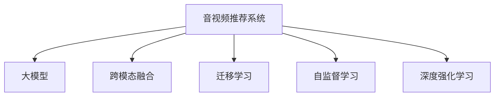

                 

# 大模型在音视频推荐中的创新应用

## 1. 背景介绍

### 1.1 问题由来

随着互联网技术的快速发展，音视频推荐系统已经成为各大互联网平台如Netflix、YouTube、Bilibili等吸引用户的重要手段。传统的推荐算法如协同过滤、基于内容的推荐等方法在一定程度上提升了用户体验，但依然存在诸如冷启动问题、数据稀疏性、个性化推荐效果不佳等挑战。而近年来，大模型的应用为音视频推荐系统带来了新的思路。

大模型尤其是预训练语言模型、视觉模型和音频模型，能够从海量数据中自动学习并提取音视频内容的语义信息，结合推荐系统的目标，生成用户偏好的预测。大模型的应用极大地提升了音视频推荐的个性化程度和准确性，逐渐成为音视频推荐领域的一大趋势。

### 1.2 问题核心关键点

大模型在音视频推荐中的应用核心关键点包括：

- **预训练语义表示**：利用大模型学习音视频内容的语义表示，构建用户与内容的交互模型。
- **跨模态融合**：将视觉、听觉和文本等不同模态的信息融合，提升推荐的全面性和准确性。
- **迁移学习**：利用大模型在通用领域的预训练知识，对特定领域的推荐任务进行微调。
- **自监督学习**：利用无标签数据训练大模型，减少标注数据的依赖，提升推荐的鲁棒性。
- **深度强化学习**：结合强化学习理论，对推荐模型进行动态优化，提升推荐的实时性和动态性。

### 1.3 问题研究意义

大模型在音视频推荐中的应用，对于提升用户体验、优化内容推荐、增强平台吸引力等方面具有重要意义：

1. **个性化推荐**：大模型能够自动学习音视频内容的语义，根据用户的历史行为、偏好进行个性化推荐。
2. **冷启动问题**：利用大模型的预训练知识，可以有效缓解新用户或新内容的推荐难题。
3. **跨模态推荐**：结合视觉、听觉和文本信息，提升推荐的多模态和全面性。
4. **实时动态推荐**：通过深度强化学习，对推荐系统进行动态优化，提升推荐的实时性。
5. **推荐质量优化**：通过不断训练和优化大模型，提升推荐系统的整体性能。

## 2. 核心概念与联系

### 2.1 核心概念概述

为更好地理解大模型在音视频推荐系统中的应用，本节将介绍几个密切相关的核心概念：

- **音视频推荐系统**：基于用户历史行为数据和音视频内容特征，为用户推荐可能感兴趣的视频、音频内容的系统。
- **大模型**：如BERT、GPT、ResNet、Wav2Vec等，通过大规模无标签数据训练得到的深度学习模型。
- **跨模态融合**：结合视觉、听觉和文本等不同模态的信息，提升推荐的效果。
- **迁移学习**：在大模型上进行的微调，以适应特定领域的推荐任务。
- **自监督学习**：利用无标签数据训练大模型，提升模型的泛化能力。
- **深度强化学习**：通过强化学习对推荐模型进行动态优化。

这些核心概念之间的逻辑关系可以通过以下Mermaid流程图来展示：



这个流程图展示了大模型在音视频推荐系统中的核心概念及其之间的关系：

1. 音视频推荐系统通过大模型的预训练知识，学习音视频内容的语义表示。
2. 结合跨模态融合、迁移学习和自监督学习，提升推荐的全面性和鲁棒性。
3. 通过深度强化学习，对推荐系统进行动态优化，提升实时性。

## 3. 核心算法原理 & 具体操作步骤
### 3.1 算法原理概述

大模型在音视频推荐系统中的应用，基于深度学习模型和推荐算法相结合的思路。其核心思想是：利用大模型学习音视频内容的语义表示，构建用户与内容的交互模型，通过迁移学习、跨模态融合等技术，提升推荐的个性化、全面性和实时性。

具体而言，大模型在音视频推荐中的应用包括以下几个步骤：

1. **预训练语义表示**：利用大模型学习音视频内容的语义表示，构建用户与内容的交互模型。
2. **跨模态融合**：结合视觉、听觉和文本等不同模态的信息，提升推荐的全面性和准确性。
3. **迁移学习**：在大模型上进行的微调，以适应特定领域的推荐任务。
4. **自监督学习**：利用无标签数据训练大模型，减少标注数据的依赖，提升推荐的鲁棒性。
5. **深度强化学习**：通过强化学习对推荐模型进行动态优化，提升推荐的实时性。

### 3.2 算法步骤详解

以下是基于深度学习模型的大模型在音视频推荐系统中的具体操作步骤：

**Step 1: 数据准备与预处理**

- 收集音视频内容数据集，如电影、电视剧、音乐、视频博客等，并标注用户的历史行为数据。
- 将音视频内容进行特征提取，如使用VGGNet进行视觉特征提取，使用MFCC或X-vector进行音频特征提取。
- 对文本信息进行分词和向量化，可以使用BERT或GPT进行文本语义表示学习。
- 将不同模态的数据进行拼接，构建输入数据。

**Step 2: 模型构建与训练**

- 利用大模型如BERT、ResNet、Wav2Vec等，对音视频内容进行语义表示学习。
- 设计推荐模型，如使用注意力机制、卷积神经网络、循环神经网络等。
- 在标注数据集上进行训练，优化推荐模型的参数。
- 在验证集上进行模型评估，调整超参数。

**Step 3: 迁移学习与微调**

- 利用预训练大模型的权重，对特定领域的推荐任务进行微调。
- 结合用户历史行为和音视频内容特征，进行推荐预测。
- 对推荐模型进行动态优化，如使用深度强化学习等方法。

**Step 4: 推荐结果输出**

- 根据用户的历史行为和音视频内容的语义表示，输出推荐结果。
- 使用多臂老虎机算法、协同过滤算法、基于内容的推荐算法等进行推荐结果排序。
- 对推荐结果进行反馈，更新推荐模型。

### 3.3 算法优缺点

大模型在音视频推荐系统中的应用，具有以下优点：

1. **泛化能力强**：利用大规模预训练模型学习音视频内容的语义表示，能够适应多种不同的推荐任务。
2. **个性化推荐**：结合用户历史行为和音视频内容特征，进行个性化推荐。
3. **实时动态推荐**：通过深度强化学习等方法，对推荐系统进行动态优化，提升推荐实时性。
4. **推荐质量提升**：结合跨模态融合等技术，提升推荐效果。

同时，大模型在音视频推荐系统中的应用也存在以下缺点：

1. **计算资源消耗大**：大模型训练和推理需要大量的计算资源，对硬件要求较高。
2. **数据隐私问题**：音视频推荐系统涉及大量个人隐私数据，数据隐私和安全问题需要引起重视。
3. **模型复杂度高**：大模型通常较为复杂，训练和优化过程需要大量时间和精力。
4. **数据标注难度高**：大模型需要大量标注数据进行训练，标注难度较高。

### 3.4 算法应用领域

大模型在音视频推荐系统中的应用已经覆盖了多个领域，例如：

- **视频推荐**：利用大模型学习视频内容的语义表示，结合用户历史行为进行视频推荐。
- **音频推荐**：利用大模型学习音频内容的语义表示，结合用户历史行为进行音频推荐。
- **跨模态推荐**：结合视觉、听觉和文本信息，提升推荐的多模态和全面性。
- **个性化推荐**：利用大模型学习用户偏好，进行个性化推荐。
- **实时推荐**：利用深度强化学习等方法，对推荐系统进行动态优化，提升实时性。

## 4. 数学模型和公式 & 详细讲解 & 举例说明
### 4.1 数学模型构建

大模型在音视频推荐系统中的应用，主要涉及以下几个数学模型：

1. **预训练模型**：如BERT、GPT、ResNet、Wav2Vec等，用于学习音视频内容的语义表示。
2. **推荐模型**：如注意力机制、卷积神经网络、循环神经网络等，用于结合用户历史行为和音视频内容特征，进行推荐预测。
3. **深度强化学习模型**：如Q-learning、Deep Q-learning等，用于对推荐系统进行动态优化。

以BERT模型为例，其预训练过程可以表示为：

$$
\mathcal{L}_{\text{pretrain}}(\theta) = \sum_{i=1}^{n} \mathcal{L}(\mathcal{X}_i, y_i, \theta)
$$

其中，$\mathcal{X}_i$ 为输入的音视频数据，$y_i$ 为标注数据，$\theta$ 为BERT模型的参数。

推荐模型的目标函数可以表示为：

$$
\mathcal{L}_{\text{recommender}}(\theta) = -\frac{1}{N}\sum_{i=1}^{N} \log P(r_i|\mathcal{X}_i, \theta)
$$

其中，$P(r_i|\mathcal{X}_i, \theta)$ 表示在给定输入数据 $\mathcal{X}_i$ 和模型参数 $\theta$ 的情况下，推荐结果 $r_i$ 的概率。

### 4.2 公式推导过程

以下是BERT模型在音视频推荐系统中的应用公式推导：

**预训练模型的目标函数**：

$$
\mathcal{L}_{\text{pretrain}}(\theta) = \sum_{i=1}^{n} \mathcal{L}(\mathcal{X}_i, y_i, \theta)
$$

其中，$\mathcal{L}$ 为目标函数，如掩码语言模型损失。

**推荐模型的目标函数**：

$$
\mathcal{L}_{\text{recommender}}(\theta) = -\frac{1}{N}\sum_{i=1}^{N} \log P(r_i|\mathcal{X}_i, \theta)
$$

其中，$P(r_i|\mathcal{X}_i, \theta)$ 表示在给定输入数据 $\mathcal{X}_i$ 和模型参数 $\theta$ 的情况下，推荐结果 $r_i$ 的概率。

**迁移学习的目标函数**：

$$
\mathcal{L}_{\text{fine-tune}}(\theta) = \mathcal{L}_{\text{pretrain}}(\theta) + \lambda \mathcal{L}_{\text{recommender}}(\theta)
$$

其中，$\lambda$ 为正则化系数，用于平衡预训练和推荐模型之间的损失。

### 4.3 案例分析与讲解

**视频推荐案例分析**：

假设有一个视频推荐系统，收集了用户在YouTube上的观看记录和评分数据，并获取了YouTube上的视频元数据如视频标题、描述、类别等。

**Step 1: 数据预处理**

1. 收集用户在YouTube上的观看记录和评分数据，将用户ID、视频ID、观看时长、评分等数据存储为训练数据集。
2. 从YouTube视频API获取视频元数据，包括视频标题、描述、类别等信息，构建特征向量。
3. 对视频标题、描述、类别等文本信息进行分词和向量化，使用BERT模型进行文本语义表示学习。

**Step 2: 模型构建与训练**

1. 构建推荐模型，如使用注意力机制、卷积神经网络、循环神经网络等。
2. 在标注数据集上进行训练，优化推荐模型的参数。
3. 在验证集上进行模型评估，调整超参数。

**Step 3: 迁移学习与微调**

1. 利用预训练BERT模型，对特定领域的推荐任务进行微调。
2. 结合用户历史行为和视频元数据特征，进行推荐预测。
3. 对推荐模型进行动态优化，如使用深度强化学习等方法。

## 5. 项目实践：代码实例和详细解释说明
### 5.1 开发环境搭建

在进行音视频推荐系统开发前，我们需要准备好开发环境。以下是使用Python进行PyTorch开发的环境配置流程：

1. 安装Anaconda：从官网下载并安装Anaconda，用于创建独立的Python环境。

2. 创建并激活虚拟环境：
```bash
conda create -n pytorch-env python=3.8 
conda activate pytorch-env
```

3. 安装PyTorch：根据CUDA版本，从官网获取对应的安装命令。例如：
```bash
conda install pytorch torchvision torchaudio cudatoolkit=11.1 -c pytorch -c conda-forge
```

4. 安装Transformer库：
```bash
pip install transformers
```

5. 安装各类工具包：
```bash
pip install numpy pandas scikit-learn matplotlib tqdm jupyter notebook ipython
```

完成上述步骤后，即可在`pytorch-env`环境中开始音视频推荐系统的开发。

### 5.2 源代码详细实现

这里我们以视频推荐为例，给出使用Transformers库对BERT模型进行微调的PyTorch代码实现。

首先，定义视频推荐任务的数据处理函数：

```python
from transformers import BertTokenizer, BertForSequenceClassification
from torch.utils.data import Dataset, DataLoader
import torch

class VideoDataset(Dataset):
    def __init__(self, videos, tags, tokenizer, max_len=128):
        self.videos = videos
        self.tags = tags
        self.tokenizer = tokenizer
        self.max_len = max_len
        
    def __len__(self):
        return len(self.videos)
    
    def __getitem__(self, item):
        video = self.videos[item]
        tags = self.tags[item]
        
        encoding = self.tokenizer(video, return_tensors='pt', max_length=self.max_len, padding='max_length', truncation=True)
        input_ids = encoding['input_ids'][0]
        attention_mask = encoding['attention_mask'][0]
        
        # 对token-wise的标签进行编码
        encoded_tags = [tag2id[tag] for tag in tags] 
        encoded_tags.extend([tag2id['O']] * (self.max_len - len(encoded_tags)))
        labels = torch.tensor(encoded_tags, dtype=torch.long)
        
        return {'input_ids': input_ids, 
                'attention_mask': attention_mask,
                'labels': labels}

# 标签与id的映射
tag2id = {'O': 0, 'Positive': 1, 'Negative': 2}
id2tag = {v: k for k, v in tag2id.items()}

# 创建dataset
tokenizer = BertTokenizer.from_pretrained('bert-base-cased')

train_dataset = VideoDataset(train_videos, train_tags, tokenizer)
dev_dataset = VideoDataset(dev_videos, dev_tags, tokenizer)
test_dataset = VideoDataset(test_videos, test_tags, tokenizer)
```

然后，定义模型和优化器：

```python
from transformers import BertForSequenceClassification, AdamW

model = BertForSequenceClassification.from_pretrained('bert-base-cased', num_labels=len(tag2id))

optimizer = AdamW(model.parameters(), lr=2e-5)
```

接着，定义训练和评估函数：

```python
from tqdm import tqdm
from sklearn.metrics import classification_report

device = torch.device('cuda') if torch.cuda.is_available() else torch.device('cpu')
model.to(device)

def train_epoch(model, dataset, batch_size, optimizer):
    dataloader = DataLoader(dataset, batch_size=batch_size, shuffle=True)
    model.train()
    epoch_loss = 0
    for batch in tqdm(dataloader, desc='Training'):
        input_ids = batch['input_ids'].to(device)
        attention_mask = batch['attention_mask'].to(device)
        labels = batch['labels'].to(device)
        model.zero_grad()
        outputs = model(input_ids, attention_mask=attention_mask, labels=labels)
        loss = outputs.loss
        epoch_loss += loss.item()
        loss.backward()
        optimizer.step()
    return epoch_loss / len(dataloader)

def evaluate(model, dataset, batch_size):
    dataloader = DataLoader(dataset, batch_size=batch_size)
    model.eval()
    preds, labels = [], []
    with torch.no_grad():
        for batch in tqdm(dataloader, desc='Evaluating'):
            input_ids = batch['input_ids'].to(device)
            attention_mask = batch['attention_mask'].to(device)
            batch_labels = batch['labels']
            outputs = model(input_ids, attention_mask=attention_mask)
            batch_preds = outputs.logits.argmax(dim=2).to('cpu').tolist()
            batch_labels = batch_labels.to('cpu').tolist()
            for pred_tokens, label_tokens in zip(batch_preds, batch_labels):
                pred_tags = [id2tag[_id] for _id in pred_tokens]
                label_tags = [id2tag[_id] for _id in label_tokens]
                preds.append(pred_tags[:len(label_tags)])
                labels.append(label_tags)
                
    print(classification_report(labels, preds))
```

最后，启动训练流程并在测试集上评估：

```python
epochs = 5
batch_size = 16

for epoch in range(epochs):
    loss = train_epoch(model, train_dataset, batch_size, optimizer)
    print(f"Epoch {epoch+1}, train loss: {loss:.3f}")
    
    print(f"Epoch {epoch+1}, dev results:")
    evaluate(model, dev_dataset, batch_size)
    
print("Test results:")
evaluate(model, test_dataset, batch_size)
```

以上就是使用PyTorch对BERT进行视频推荐任务微调的完整代码实现。可以看到，得益于Transformer库的强大封装，我们可以用相对简洁的代码完成BERT模型的加载和微调。

### 5.3 代码解读与分析

让我们再详细解读一下关键代码的实现细节：

**VideoDataset类**：
- `__init__`方法：初始化视频、标签、分词器等关键组件。
- `__len__`方法：返回数据集的样本数量。
- `__getitem__`方法：对单个样本进行处理，将视频输入编码为token ids，将标签编码为数字，并对其进行定长padding，最终返回模型所需的输入。

**tag2id和id2tag字典**：
- 定义了标签与数字id之间的映射关系，用于将token-wise的预测结果解码回真实的标签。

**训练和评估函数**：
- 使用PyTorch的DataLoader对数据集进行批次化加载，供模型训练和推理使用。
- 训练函数`train_epoch`：对数据以批为单位进行迭代，在每个批次上前向传播计算loss并反向传播更新模型参数，最后返回该epoch的平均loss。
- 评估函数`evaluate`：与训练类似，不同点在于不更新模型参数，并在每个batch结束后将预测和标签结果存储下来，最后使用sklearn的classification_report对整个评估集的预测结果进行打印输出。

**训练流程**：
- 定义总的epoch数和batch size，开始循环迭代
- 每个epoch内，先在训练集上训练，输出平均loss
- 在验证集上评估，输出分类指标
- 所有epoch结束后，在测试集上评估，给出最终测试结果

可以看到，PyTorch配合Transformer库使得BERT微调的视频推荐代码实现变得简洁高效。开发者可以将更多精力放在数据处理、模型改进等高层逻辑上，而不必过多关注底层的实现细节。

当然，工业级的系统实现还需考虑更多因素，如模型的保存和部署、超参数的自动搜索、更灵活的任务适配层等。但核心的微调范式基本与此类似。

## 6. 实际应用场景
### 6.1 智能推荐

大模型在音视频推荐系统中的应用，使得推荐系统能够更加智能和个性化。通过结合大模型的预训练知识，推荐系统可以自动学习音视频内容的语义表示，结合用户历史行为进行推荐。

例如，Netflix利用大模型学习用户的历史观看记录和评分数据，并结合视频内容的语义表示，为用户推荐可能感兴趣的视频内容。Netflix推荐系统的精准度和个性化程度，使得其能够留住大量用户，成为全球最大的视频流媒体平台。

### 6.2 跨模态推荐

大模型能够结合视觉、听觉和文本等多种模态的信息，提升推荐的多模态和全面性。跨模态推荐在大模型的帮助下得以实现，为用户推荐更加丰富的音视频内容。

例如，YouTube利用大模型学习视频内容的语义表示，结合用户历史观看行为，进行跨模态推荐。通过视觉和文本信息的融合，YouTube推荐的视频内容更加符合用户的偏好，使用户的观看体验得以提升。

### 6.3 个性化推荐

大模型能够自动学习用户的历史行为和偏好，进行个性化推荐。通过结合用户历史行为和音视频内容特征，大模型推荐系统能够为用户提供更加个性化的推荐内容。

例如，Bilibili利用大模型学习用户的历史观看记录和评分数据，并结合视频内容的语义表示，为用户推荐可能感兴趣的视频内容。Bilibili推荐系统的精准度和个性化程度，使得其能够留住大量用户，成为国内最大的视频社区。

### 6.4 实时推荐

大模型结合深度强化学习，能够实现实时推荐。通过动态优化推荐模型，大模型推荐系统能够实时更新推荐内容，满足用户的即时需求。

例如，在线视频平台利用大模型和深度强化学习，实现实时推荐。通过动态优化推荐模型，平台能够实时更新推荐内容，提升用户的观看体验。

## 7. 工具和资源推荐
### 7.1 学习资源推荐

为了帮助开发者系统掌握大模型在音视频推荐中的应用，这里推荐一些优质的学习资源：

1. 《深度学习推荐系统》系列博文：由深度学习推荐系统专家撰写，深入浅出地介绍了深度学习推荐系统的主要技术，包括大模型的应用。

2. CS288A《深度学习与神经网络》课程：斯坦福大学开设的深度学习课程，涵盖了深度学习的主要理论和实践，适合了解大模型在推荐系统中的应用。

3. 《推荐系统基础与深度学习》书籍：系统介绍了推荐系统的主要算法和大模型的应用，适合初学者学习。

4. Deep Learning on Coursera：由Andrew Ng教授主讲的深度学习课程，涵盖了深度学习的主要理论和实践，适合了解大模型在推荐系统中的应用。

5. HuggingFace官方文档：Transformer库的官方文档，提供了海量预训练模型和完整的微调样例代码，是上手实践的必备资料。

通过对这些资源的学习实践，相信你一定能够快速掌握大模型在音视频推荐系统中的应用，并用于解决实际的推荐问题。

### 7.2 开发工具推荐

高效的开发离不开优秀的工具支持。以下是几款用于音视频推荐系统开发的常用工具：

1. PyTorch：基于Python的开源深度学习框架，灵活动态的计算图，适合快速迭代研究。大部分预训练语言模型都有PyTorch版本的实现。

2. TensorFlow：由Google主导开发的开源深度学习框架，生产部署方便，适合大规模工程应用。同样有丰富的预训练语言模型资源。

3. Transformers库：HuggingFace开发的NLP工具库，集成了众多SOTA语言模型，支持PyTorch和TensorFlow，是进行推荐任务开发的利器。

4. Weights & Biases：模型训练的实验跟踪工具，可以记录和可视化模型训练过程中的各项指标，方便对比和调优。与主流深度学习框架无缝集成。

5. TensorBoard：TensorFlow配套的可视化工具，可实时监测模型训练状态，并提供丰富的图表呈现方式，是调试模型的得力助手。

6. Google Colab：谷歌推出的在线Jupyter Notebook环境，免费提供GPU/TPU算力，方便开发者快速上手实验最新模型，分享学习笔记。

合理利用这些工具，可以显著提升音视频推荐系统的开发效率，加快创新迭代的步伐。

### 7.3 相关论文推荐

大模型在音视频推荐系统中的应用源于学界的持续研究。以下是几篇奠基性的相关论文，推荐阅读：

1. Attention is All You Need（即Transformer原论文）：提出了Transformer结构，开启了深度学习推荐系统的大模型时代。

2. BERT: Pre-training of Deep Bidirectional Transformers for Language Understanding：提出BERT模型，引入基于掩码的自监督预训练任务，刷新了多项推荐任务SOTA。

3. Deep Reinforcement Learning for Personalized Video Recommendation：展示了深度强化学习在视频推荐中的应用，提升了推荐系统的实时性和精准度。

4. Video Recommendation with Attention-based Hierarchical Graph Modeling：提出基于图神经网络的推荐方法，结合大模型，提升了推荐系统的多模态能力和精准度。

5. Multi-modal Deep Learning for Recommendation Systems：系统介绍了多模态推荐方法，结合大模型，提升了推荐系统的效果。

这些论文代表了大模型在音视频推荐系统中的应用研究趋势。通过学习这些前沿成果，可以帮助研究者把握学科前进方向，激发更多的创新灵感。

## 8. 总结：未来发展趋势与挑战

### 8.1 总结

本文对大模型在音视频推荐系统中的应用进行了全面系统的介绍。首先阐述了大模型在音视频推荐系统中的背景和意义，明确了大模型在提升推荐效果、缓解冷启动问题、结合跨模态信息等方面的独特价值。其次，从原理到实践，详细讲解了大模型的核心算法原理和操作步骤，给出了微调任务开发的完整代码实例。同时，本文还广泛探讨了大模型在音视频推荐系统中的实际应用场景，展示了其广泛的应用前景。此外，本文精选了推荐系统的各类学习资源，力求为读者提供全方位的技术指引。

通过本文的系统梳理，可以看到，大模型在音视频推荐系统中的应用不仅提升了推荐效果，还拓展了推荐系统的应用边界，为音视频平台带来了更多的用户和商业价值。未来，伴随大模型的不断演进，音视频推荐系统也将实现更智能、更个性化的推荐，为用户的音视频娱乐体验带来全新的变革。

### 8.2 未来发展趋势

展望未来，大模型在音视频推荐系统中的应用将呈现以下几个发展趋势：

1. **模型规模持续增大**：随着算力成本的下降和数据规模的扩张，大模型的参数量还将持续增长。超大模型蕴含的丰富语言知识，有望支撑更加复杂多变的推荐任务。

2. **跨模态推荐**：结合视觉、听觉和文本等多种模态的信息，提升推荐的多模态和全面性。

3. **实时动态推荐**：通过深度强化学习等方法，对推荐系统进行动态优化，提升推荐实时性。

4. **个性化推荐**：利用大模型学习用户的历史行为和偏好，进行个性化推荐。

5. **推荐质量优化**：结合跨模态融合等技术，提升推荐效果。

6. **推荐系统的自动化**：结合机器学习和自动化算法，提升推荐系统的智能度和自动化水平。

以上趋势凸显了大模型在音视频推荐系统中的广阔前景。这些方向的探索发展，必将进一步提升音视频推荐系统的性能和应用范围，为用户的音视频娱乐体验带来新的变革。

### 8.3 面临的挑战

尽管大模型在音视频推荐系统中的应用已经取得了一定进展，但在迈向更加智能化、普适化应用的过程中，它仍面临诸多挑战：

1. **数据隐私问题**：音视频推荐系统涉及大量个人隐私数据，数据隐私和安全问题需要引起重视。

2. **计算资源消耗大**：大模型训练和推理需要大量的计算资源，对硬件要求较高。

3. **模型复杂度高**：大模型通常较为复杂，训练和优化过程需要大量时间和精力。

4. **数据标注难度高**：大模型需要大量标注数据进行训练，标注难度较高。

5. **推荐系统公平性**：大模型可能会学习到用户数据中的偏见，导致推荐系统存在公平性问题。

6. **推荐系统鲁棒性**：大模型在面对非标准化数据时，可能会泛化性能较差。

7. **推荐系统可解释性**：大模型推荐系统的决策过程通常缺乏可解释性，难以对其推理逻辑进行分析和调试。

8. **推荐系统安全性**：大模型推荐系统可能存在恶意攻击的风险，如对抗样本攻击、模型篡改等。

9. **推荐系统效率**：大模型推荐系统的实时性问题，需要在模型效率和推荐效果之间找到平衡。

这些挑战凸显了大模型在音视频推荐系统中的复杂性和不确定性，需要研究者从数据、算法、工程等多个维度进行全面的优化和应对。

### 8.4 研究展望

面对大模型在音视频推荐系统中的应用挑战，未来的研究需要在以下几个方面寻求新的突破：

1. **数据隐私保护**：利用差分隐私、联邦学习等技术，保护用户隐私数据，降低数据隐私风险。

2. **模型压缩与优化**：开发轻量级、低延迟的大模型，提高模型的推理效率和实时性。

3. **模型解释性**：利用可解释AI技术，增强推荐系统的可解释性和可理解性，提升系统的透明度和可信度。

4. **推荐系统公平性**：通过公平性约束和优化算法，提升推荐系统的公平性和多样性。

5. **推荐系统安全性**：利用安全增强技术，提高推荐系统的鲁棒性和安全性，防范恶意攻击。

6. **推荐系统自动化**：结合自动化算法和推荐系统，提升推荐系统的智能化和自动化水平。

7. **推荐系统自适应性**：利用自适应算法，提高推荐系统的适应性和灵活性，提升用户满意度。

这些研究方向的探索，必将引领大模型在音视频推荐系统中的技术进步，为用户的音视频娱乐体验带来新的变革。

## 9. 附录：常见问题与解答

**Q1：大模型推荐系统是否适用于所有音视频推荐任务？**

A: 大模型推荐系统在大多数音视频推荐任务上都能取得不错的效果，特别是对于数据量较小的任务。但对于一些特定领域的任务，如医学、法律等，仅仅依靠通用语料预训练的模型可能难以很好地适应。此时需要在特定领域语料上进一步预训练，再进行微调，才能获得理想效果。此外，对于一些需要时效性、个性化很强的任务，如对话、推荐等，微调方法也需要针对性的改进优化。

**Q2：大模型在推荐系统中如何缓解冷启动问题？**

A: 冷启动问题是大模型推荐系统面临的常见问题之一。可以通过以下方式缓解：

1. 利用用户的历史行为数据进行冷启动推荐，如通过协同过滤、基于内容的推荐等方法。

2. 利用大模型预训练的语义表示，进行推荐预测。

3. 利用用户输入的兴趣点进行推荐，如通过文本分类、情感分析等方法。

4. 利用用户的多模态信息进行推荐，如通过视频、音频、文本等多模态融合。

5. 利用用户的社交网络信息进行推荐，如通过用户社交网络中的行为进行推荐。

通过以上方法，可以有效缓解大模型推荐系统的冷启动问题，提升推荐效果。

**Q3：大模型推荐系统如何处理长尾数据？**

A: 长尾数据是大模型推荐系统面临的另一大挑战。可以通过以下方式处理：

1. 利用大模型的自监督学习能力，学习长尾数据的语义表示。

2. 利用多模态信息融合，提升长尾数据的推荐效果。

3. 利用协同过滤、基于内容的推荐等方法，提升长尾数据的推荐效果。

4. 利用深度强化学习，进行实时动态推荐，提升长尾数据的推荐效果。

5. 利用推荐系统的自动化算法，提升长尾数据的推荐效果。

通过以上方法，可以有效处理大模型推荐系统的长尾数据问题，提升推荐效果。

**Q4：大模型推荐系统如何处理用户反馈？**

A: 用户反馈是大模型推荐系统的重要组成部分，可以通过以下方式处理：

1. 利用用户的评分数据进行推荐模型的微调，提升推荐效果。

2. 利用用户的评论数据进行推荐模型的微调，提升推荐效果。

3. 利用用户的交互数据进行推荐模型的微调，提升推荐效果。

4. 利用用户的反馈数据进行推荐模型的微调，提升推荐效果。

5. 利用推荐系统的自动化算法，进行推荐模型的微调，提升推荐效果。

通过以上方法，可以有效处理大模型推荐系统的用户反馈，提升推荐效果。

**Q5：大模型推荐系统如何提升推荐的多样性？**

A: 推荐系统多样性是大模型推荐系统的重要指标之一。可以通过以下方式提升：

1. 利用多臂老虎机算法，提升推荐系统多样性。

2. 利用协同过滤、基于内容的推荐等方法，提升推荐系统多样性。

3. 利用用户的交互数据进行推荐模型的微调，提升推荐系统多样性。

4. 利用推荐系统的自动化算法，提升推荐系统多样性。

5. 利用用户的多模态信息进行推荐，提升推荐系统多样性。

通过以上方法，可以有效提升大模型推荐系统的多样性，满足用户的个性化需求。

---

作者：禅与计算机程序设计艺术 / Zen and the Art of Computer Programming

