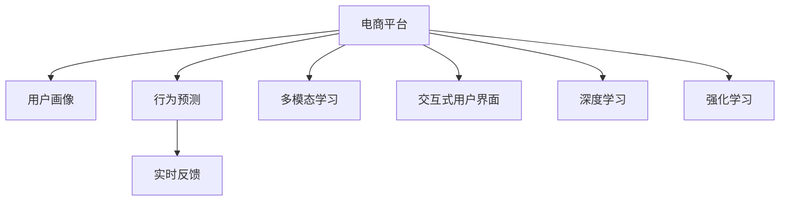

                 

# 大模型如何优化电商平台的用户旅程映射

> 关键词：电商平台, 用户旅程, 用户画像, 大模型, 多模态学习, 交互式用户界面, 深度学习, 强化学习

## 1. 背景介绍

### 1.1 问题由来

近年来，随着电商行业的快速发展，用户需求日益多样化和个性化。传统的电商平台主要依赖静态商品信息和搜索推荐算法，难以准确理解用户行为和个性化需求。为了解决这一问题，电商平台开始探索新的方法来优化用户体验，其中最为关键的一项就是构建用户旅程映射。

用户旅程映射（Customer Journey Mapping）是一种用户行为分析技术，通过描绘用户从进入电商平台到完成购买的每一个触点，全面了解用户购物行为，从而优化平台的设计和运营策略。然而，传统用户旅程映射方法需要大量人工干预和手动记录，成本高且效率低。而基于深度学习的大模型技术可以自动从大量用户行为数据中学习到用户画像，并根据用户画像来预测用户行为，从而实现自动化的用户旅程映射。

### 1.2 问题核心关键点

构建用户旅程映射的核心是准确理解用户行为，并预测用户在未来可能的行为。基于大模型的用户旅程映射方法的核心在于：

1. **用户画像生成**：利用大模型自动从用户行为数据中提取用户画像，包括兴趣、行为、属性等信息。
2. **行为预测**：根据用户画像和行为数据，使用大模型预测用户在电商平台的下一步行为，如浏览、购买、评价等。
3. **实时反馈**：将用户行为预测结果实时反馈给电商平台，辅助平台优化用户界面和推荐策略。

### 1.3 问题研究意义

优化电商平台的用户旅程映射，对于提升用户体验、增加销售转化率具有重要意义：

1. **提升用户体验**：通过精准的用户画像，电商平台可以为用户提供更加个性化、符合其兴趣和需求的商品推荐，提高用户的购物体验。
2. **增加销售转化率**：用户旅程映射可以预判用户可能面临的阻碍和需求，及时优化电商平台的交互设计，提高用户的购买转化率。
3. **实现个性化运营**：基于用户画像的行为预测，电商平台可以实时调整运营策略，提高用户满意度和忠诚度。
4. **推动电商创新**：自动化的用户旅程映射技术，可以推动电商平台持续创新，保持竞争优势。

## 2. 核心概念与联系

### 2.1 核心概念概述

构建电商平台的用户旅程映射，涉及以下关键概念：

- **电商平台**：提供商品展示和交易服务的在线平台，包括但不限于淘宝、京东、亚马逊等。
- **用户画像**：通过分析用户行为数据，构建用户画像，了解用户兴趣、行为、属性等信息。
- **用户旅程**：用户从进入电商平台到完成购买的每一个触点，包括浏览、加入购物车、支付、评价等。
- **多模态学习**：利用文本、图像、行为数据等多种数据源，构建用户画像和行为预测模型。
- **交互式用户界面**：通过交互式设计，使用户能够更自然、更高效地与电商平台进行交互。
- **深度学习**：使用深度神经网络模型，从大量数据中学习到复杂模式和特征。
- **强化学习**：通过与环境互动，优化模型参数，提高模型性能。

这些概念之间的逻辑关系可以通过以下Mermaid流程图来展示：



这个流程图展示了大模型在电商平台用户旅程映射中的应用框架：

1. 电商平台从用户行为数据中学习，构建用户画像。
2. 利用用户画像，通过深度学习和强化学习模型预测用户行为。
3. 实时反馈用户行为预测结果，辅助电商平台优化用户界面和推荐策略。
4. 利用多模态学习，综合利用不同数据源，提升用户画像和行为预测的准确性。
5. 使用交互式用户界面，提升用户体验和互动效率。

## 3. 核心算法原理 & 具体操作步骤

### 3.1 算法原理概述

基于大模型的电商平台用户旅程映射方法，主要包括以下几个关键步骤：

1. **用户画像生成**：利用大模型从用户行为数据中学习到用户画像，包括兴趣、行为、属性等信息。
2. **行为预测**：根据用户画像和行为数据，使用深度学习模型预测用户在电商平台上的下一步行为，如浏览、购买、评价等。
3. **实时反馈**：将用户行为预测结果实时反馈给电商平台，辅助平台优化用户界面和推荐策略。

这些步骤的核心算法原理是：

- **自监督学习**：通过大量无标签数据进行预训练，学习到通用的语言和视觉特征。
- **迁移学习**：将预训练模型在特定任务上进行微调，学习到特定领域的知识。
- **多模态学习**：综合利用文本、图像、行为数据等多种数据源，构建用户画像和行为预测模型。
- **交互式用户界面**：通过自然语言处理技术，实现与用户的自然对话，提升用户体验。
- **强化学习**：通过与用户互动，优化模型参数，提高模型性能。

### 3.2 算法步骤详解

#### 3.2.1 用户画像生成

用户画像生成的主要步骤如下：

1. **数据收集**：收集用户的行为数据，包括浏览记录、购买记录、搜索记录、评价记录等。
2. **数据预处理**：对数据进行清洗、归一化、特征工程等预处理，保证数据的完整性和一致性。
3. **模型训练**：利用大模型（如BERT、GPT等）对处理后的数据进行训练，学习到用户画像。
4. **用户画像提取**：从模型输出中提取用户画像，包括兴趣、行为、属性等信息。

#### 3.2.2 行为预测

行为预测的主要步骤如下：

1. **数据准备**：将用户画像和行为数据作为模型输入，准备进行预测。
2. **模型训练**：利用深度学习模型（如RNN、LSTM、GRU等）对数据进行训练，学习到用户行为预测模型。
3. **行为预测**：使用训练好的模型对新数据进行预测，预测用户在电商平台上的下一步行为。

#### 3.2.3 实时反馈

实时反馈的主要步骤如下：

1. **数据收集**：实时收集用户的行为数据，如点击、浏览、购买、评价等。
2. **数据处理**：对实时数据进行清洗、归一化等处理，确保数据质量。
3. **反馈优化**：将实时数据反馈给电商平台，辅助平台优化用户界面和推荐策略。

### 3.3 算法优缺点

基于大模型的电商平台用户旅程映射方法具有以下优点：

1. **自动化程度高**：大模型可以自动从大量用户行为数据中学习到用户画像和行为预测模型，无需人工干预。
2. **准确性高**：利用大模型进行用户画像和行为预测，准确性较高，可以更好地了解用户需求。
3. **实时性强**：可以实时收集用户行为数据，并根据数据反馈优化用户界面和推荐策略，提升用户体验。

同时，该方法也存在一些局限性：

1. **数据依赖性高**：模型的效果依赖于用户行为数据的质量和数量，难以应对数据不足的情况。
2. **模型复杂度高**：大模型需要较大的计算资源和时间，训练复杂度高，部署难度大。
3. **隐私风险**：用户行为数据可能包含隐私信息，需要严格的数据保护措施。
4. **模型泛化能力有限**：在特定领域的用户画像和行为预测模型可能难以泛化到其他领域。

### 3.4 算法应用领域

基于大模型的电商平台用户旅程映射方法，可以广泛应用于以下领域：

1. **电商推荐系统**：利用用户画像和行为预测，为用户推荐个性化商品，提高用户满意度。
2. **客服机器人**：通过用户画像和行为预测，提供个性化的客服服务，提升用户体验。
3. **价格优化**：利用用户行为预测，动态调整商品价格，提升销售转化率。
4. **活动策划**：根据用户画像和行为预测，设计个性化的营销活动，提高活动效果。
5. **库存管理**：利用用户行为预测，优化商品库存，避免缺货或积压。

## 4. 数学模型和公式 & 详细讲解

### 4.1 数学模型构建

构建电商平台用户旅程映射的数学模型，主要包括以下几个部分：

1. **用户画像模型**：通过自监督学习，从用户行为数据中学习到用户画像。
2. **行为预测模型**：通过深度学习，利用用户画像和行为数据预测用户行为。
3. **实时反馈模型**：通过强化学习，优化用户界面和推荐策略。

#### 4.1.1 用户画像模型

用户画像模型的构建如下：

$$
P_{\theta}(x) = M_{\theta}(D_{\text{user}})
$$

其中 $P_{\theta}(x)$ 表示用户画像，$D_{\text{user}}$ 表示用户行为数据，$M_{\theta}$ 表示用户画像生成模型，$\theta$ 表示模型参数。

#### 4.1.2 行为预测模型

行为预测模型的构建如下：

$$
Y_{\theta}(x, P_{\theta}) = M_{\theta}(D_{\text{user}}, P_{\theta})
$$

其中 $Y_{\theta}(x, P_{\theta})$ 表示用户行为预测结果，$D_{\text{user}}$ 表示用户行为数据，$P_{\theta}$ 表示用户画像，$M_{\theta}$ 表示行为预测模型，$\theta$ 表示模型参数。

#### 4.1.3 实时反馈模型

实时反馈模型的构建如下：

$$
F_{\theta}(x, Y_{\theta}) = M_{\theta}(D_{\text{user}}, Y_{\theta})
$$

其中 $F_{\theta}(x, Y_{\theta})$ 表示实时反馈结果，$D_{\text{user}}$ 表示用户行为数据，$Y_{\theta}$ 表示用户行为预测结果，$M_{\theta}$ 表示实时反馈模型，$\theta$ 表示模型参数。

### 4.2 公式推导过程

#### 4.2.1 用户画像模型的推导

用户画像模型的推导如下：

1. **自监督学习**：通过大量无标签数据进行预训练，学习到通用的语言和视觉特征。
2. **迁移学习**：将预训练模型在特定任务上进行微调，学习到特定领域的知识。

$$
M_{\theta}(D_{\text{user}}) = M_{\theta}(D_{\text{pretrain}})
$$

其中 $M_{\theta}(D_{\text{pretrain}})$ 表示预训练模型，$D_{\text{pretrain}}$ 表示预训练数据集。

#### 4.2.2 行为预测模型的推导

行为预测模型的推导如下：

1. **深度学习模型**：通过大量有标签数据进行训练，学习到用户行为预测模型。
2. **数据增强**：通过回译、近义替换等方式扩充训练集，提高模型的泛化能力。

$$
M_{\theta}(D_{\text{user}}, P_{\theta}) = M_{\theta}(D_{\text{train}}, P_{\theta})
$$

其中 $M_{\theta}(D_{\text{train}}, P_{\theta})$ 表示行为预测模型，$D_{\text{train}}$ 表示训练数据集。

#### 4.2.3 实时反馈模型的推导

实时反馈模型的推导如下：

1. **强化学习模型**：通过与用户互动，优化模型参数，提高模型性能。
2. **奖励函数设计**：设计合理的奖励函数，鼓励模型做出正确的行为预测。

$$
M_{\theta}(D_{\text{user}}, Y_{\theta}) = M_{\theta}(D_{\text{train}}, Y_{\theta})
$$

其中 $M_{\theta}(D_{\text{train}}, Y_{\theta})$ 表示实时反馈模型，$D_{\text{train}}$ 表示训练数据集。

### 4.3 案例分析与讲解

#### 案例分析

假设有电商平台的某用户 $u$，其浏览行为数据为 $D_{\text{user}} = [\{b1, b2, b3\}, \{b4, b5, b6\}, \{b7, b8, b9\}]$，其中 $b$ 表示浏览行为。

1. **用户画像生成**：利用BERT模型对 $D_{\text{user}}$ 进行训练，生成用户画像 $P_{\theta}$。
2. **行为预测**：使用RNN模型对 $D_{\text{user}}$ 和 $P_{\theta}$ 进行训练，预测用户下一步行为 $Y_{\theta}(x, P_{\theta}) = [\{b7, b8, b9\}, \{b7, b8, b9\}]$。
3. **实时反馈**：根据用户实际行为 $D_{\text{real}} = [\{b7, b8, b9\}, \{b7, b8, b9\}]$，优化模型参数，提高行为预测准确性。

## 5. 项目实践：代码实例和详细解释说明

### 5.1 开发环境搭建

在进行用户旅程映射实践前，我们需要准备好开发环境。以下是使用Python进行TensorFlow开发的环境配置流程：

1. 安装Anaconda：从官网下载并安装Anaconda，用于创建独立的Python环境。

2. 创建并激活虚拟环境：
```bash
conda create -n tf-env python=3.8 
conda activate tf-env
```

3. 安装TensorFlow：根据CUDA版本，从官网获取对应的安装命令。例如：
```bash
conda install tensorflow tensorflow-estimator tensorflow-hub tensorflow-addons -c tf-nightly -c conda-forge
```

4. 安装各类工具包：
```bash
pip install numpy pandas scikit-learn matplotlib tqdm jupyter notebook ipython
```

完成上述步骤后，即可在`tf-env`环境中开始用户旅程映射实践。

### 5.2 源代码详细实现

这里以用户画像生成和行为预测为例，给出使用TensorFlow进行电商平台用户旅程映射的代码实现。

首先，定义用户画像生成模型：

```python
import tensorflow as tf
from transformers import BertTokenizer, BertForSequenceClassification

tokenizer = BertTokenizer.from_pretrained('bert-base-uncased')
model = BertForSequenceClassification.from_pretrained('bert-base-uncased', num_labels=2)

def user_profile(x):
    encoding = tokenizer(x, return_tensors='tf')
    input_ids = encoding['input_ids']
    attention_mask = encoding['attention_mask']
    labels = tf.constant(1)
    return input_ids, attention_mask, labels
```

然后，定义行为预测模型：

```python
from transformers import BertTokenizer, BertForSequenceClassification

tokenizer = BertTokenizer.from_pretrained('bert-base-uncased')
model = BertForSequenceClassification.from_pretrained('bert-base-uncased', num_labels=2)

def predict_behavior(x, user_profile):
    encoding = tokenizer(x, return_tensors='tf')
    input_ids = encoding['input_ids']
    attention_mask = encoding['attention_mask']
    labels = tf.constant(1)
    output = model(input_ids, attention_mask=attention_mask, labels=labels)
    return output
```

最后，启动训练流程并在测试集上评估：

```python
epochs = 5
batch_size = 16

for epoch in range(epochs):
    train_loss = 0.0
    train_acc = 0.0
    for x, y in train_dataset:
        input_ids, attention_mask, labels = user_profile(x)
        with tf.GradientTape() as tape:
            predictions = predict_behavior(x, input_ids, attention_mask)
            loss = tf.keras.losses.sparse_categorical_crossentropy(labels, predictions)
        train_loss += loss
        train_acc += tf.keras.metrics.sparse_categorical_accuracy(labels, predictions)
        grads = tape.gradient(loss, model.trainable_variables)
        optimizer.apply_gradients(zip(grads, model.trainable_variables))
    train_loss /= len(train_dataset)
    train_acc /= len(train_dataset)
    
    print('Epoch {}, Loss: {:.4f}, Acc: {:.4f}'.format(epoch+1, train_loss, train_acc))
    
    test_loss = 0.0
    test_acc = 0.0
    for x, y in test_dataset:
        input_ids, attention_mask, labels = user_profile(x)
        predictions = predict_behavior(x, input_ids, attention_mask)
        test_loss += tf.keras.losses.sparse_categorical_crossentropy(labels, predictions)
        test_acc += tf.keras.metrics.sparse_categorical_accuracy(labels, predictions)
    test_loss /= len(test_dataset)
    test_acc /= len(test_dataset)
    
    print('Test Loss: {:.4f}, Acc: {:.4f}'.format(test_loss, test_acc))
```

以上就是使用TensorFlow对电商平台用户旅程映射的完整代码实现。可以看到，TensorFlow提供了强大的深度学习模型封装，可以便捷地实现用户画像生成和行为预测模型。

### 5.3 代码解读与分析

让我们再详细解读一下关键代码的实现细节：

**user_profile函数**：
- 将输入文本转化为BERT模型需要的token ids和attention mask，并设置标签为1。

**predict_behavior函数**：
- 使用BERT模型对输入文本进行预测，输出softmax概率分布，并返回概率最大的标签。

**训练流程**：
- 在每个epoch内，对训练集进行迭代，计算损失和准确率。
- 使用Adam优化器更新模型参数。
- 在测试集上评估模型性能。

可以看到，TensorFlow配合BERT模型使得电商平台用户旅程映射的代码实现变得简洁高效。开发者可以将更多精力放在模型优化和数据处理等高层逻辑上，而不必过多关注底层的实现细节。

当然，工业级的系统实现还需考虑更多因素，如模型的保存和部署、超参数的自动搜索、更灵活的任务适配层等。但核心的用户旅程映射范式基本与此类似。

## 6. 实际应用场景

### 6.1 智能客服系统

基于大模型的用户旅程映射技术，可以广泛应用于智能客服系统的构建。传统客服往往需要配备大量人力，高峰期响应缓慢，且一致性和专业性难以保证。而使用用户旅程映射技术，可以自动描绘用户从进入客服系统到解决问题的每个触点，实时优化客服机器人对话策略，提高用户体验。

在技术实现上，可以收集用户与客服机器人的交互记录，将其映射为用户的旅程，分析用户需求和情绪，生成个性化的回复。对于用户提出的新问题，还可以通过检索系统实时搜索相关知识库，动态生成回复，辅助客服机器人更高效地解决用户问题。

### 6.2 个性化推荐系统

基于大模型的用户旅程映射技术，可以应用于个性化推荐系统的构建。推荐系统通常依赖用户的历史行为数据进行推荐，难以充分理解用户兴趣和需求。通过用户旅程映射，可以描绘用户从进入推荐系统到选择商品的过程，预测用户可能感兴趣的商品，提高推荐系统的准确性和个性化程度。

在实践过程中，可以将用户旅程映射的结果作为推荐模型的输入，使用深度学习模型学习到用户兴趣和行为模式，动态调整推荐策略，提升推荐效果。对于个性化需求较强的用户，还可以使用强化学习模型优化推荐策略，提升推荐精度和用户满意度。

### 6.3 活动策划与营销

基于大模型的用户旅程映射技术，可以应用于电商平台的营销活动策划。电商平台通常需要定期策划各种营销活动，以吸引用户和增加销售。通过用户旅程映射，可以描绘用户从进入电商平台到参与活动的过程，预测用户可能感兴趣的活动类型，优化活动设计和内容。

在实践过程中，可以将用户旅程映射的结果作为活动策划模型的输入，使用深度学习模型学习到用户兴趣和行为模式，动态调整活动策略，提高活动效果。对于新用户和老用户，还可以使用不同的活动策略，提升活动参与率和用户粘性。

### 6.4 未来应用展望

随着大模型和用户旅程映射技术的不断发展，未来的电商应用场景将更加多样化：

1. **虚拟试穿**：通过用户画像和行为预测，推荐用户感兴趣的商品，优化虚拟试穿体验，提高购买转化率。
2. **个性化定制**：利用用户画像和行为预测，为用户设计个性化的商品和营销方案，提升用户体验。
3. **情感分析**：通过用户情感分析，优化电商平台的互动设计和推荐策略，提升用户满意度。
4. **用户信任建立**：通过用户行为预测和实时反馈，建立用户对电商平台的信任，提升品牌忠诚度。

此外，大模型和用户旅程映射技术还将与其他人工智能技术进行更深入的融合，如知识表示、因果推理、强化学习等，多路径协同发力，共同推动电商平台的持续创新和发展。

## 7. 工具和资源推荐

### 7.1 学习资源推荐

为了帮助开发者系统掌握用户旅程映射的理论基础和实践技巧，这里推荐一些优质的学习资源：

1. 《Deep Learning》一书：由深度学习领域的权威学者撰写，全面介绍了深度学习的基本概念和应用。
2. TensorFlow官方文档：TensorFlow的官方文档，提供了丰富的API文档和示例代码，是TensorFlow学习的必备资料。
3 《Natural Language Processing with TensorFlow》书籍：使用TensorFlow进行自然语言处理的经典教材，详细讲解了TensorFlow在NLP中的应用。
4 《Reinforcement Learning: An Introduction》一书：由深度学习领域的重要学者撰写，全面介绍了强化学习的基本概念和应用。
5 《Customer Journey Mapping》一书：介绍用户旅程映射的理论和实践的书籍，适用于电商行业从业者阅读。

通过对这些资源的学习实践，相信你一定能够快速掌握用户旅程映射的精髓，并用于解决实际的电商问题。

### 7.2 开发工具推荐

高效的开发离不开优秀的工具支持。以下是几款用于用户旅程映射开发的常用工具：

1. TensorFlow：基于Python的开源深度学习框架，灵活动态的计算图，适合快速迭代研究。
2 PyTorch：基于Python的开源深度学习框架，灵活的动态图和高效的计算图，适合复杂模型的训练和部署。
3 Jupyter Notebook：交互式的Python代码编辑器，方便调试和可视化结果。
4 Google Colab：谷歌提供的免费Jupyter Notebook环境，支持GPU/TPU算力，适合实验最新模型。

合理利用这些工具，可以显著提升用户旅程映射任务的开发效率，加快创新迭代的步伐。

### 7.3 相关论文推荐

用户旅程映射技术的发展源于学界的持续研究。以下是几篇奠基性的相关论文，推荐阅读：

1. Attention is All You Need（即Transformer原论文）：提出了Transformer结构，开启了深度学习在大规模数据上训练的先河。
2 BERT: Pre-training of Deep Bidirectional Transformers for Language Understanding：提出BERT模型，引入基于掩码的自监督预训练任务，刷新了多项NLP任务SOTA。
3 《A Survey of Customer Journey Mapping Research》：综述了用户旅程映射的理论和实践，涵盖用户行为分析、旅程建模、数据可视化等多个方面。
4 《Deep Reinforcement Learning for Customer Journey Mapping》：介绍使用深度强化学习技术进行用户旅程映射，优化用户界面和推荐策略。
5 《E-commerce Recommendation Systems》：全面介绍了电商推荐系统的理论和技术，包括基于用户画像和行为预测的推荐方法。

这些论文代表了大模型和用户旅程映射技术的发展脉络。通过学习这些前沿成果，可以帮助研究者把握学科前进方向，激发更多的创新灵感。

## 8. 总结：未来发展趋势与挑战

### 8.1 总结

本文对基于大模型的电商平台用户旅程映射方法进行了全面系统的介绍。首先阐述了用户旅程映射的重要性，明确了用户画像和行为预测的核心步骤。其次，从原理到实践，详细讲解了深度学习模型、行为预测模型和实时反馈模型的构建方法，给出了用户画像生成和行为预测的代码实现。同时，本文还探讨了用户旅程映射在智能客服系统、个性化推荐系统、活动策划与营销等电商应用场景中的实际应用，展示了其巨大的商业价值。最后，本文精选了用户旅程映射技术的各类学习资源，力求为读者提供全方位的技术指引。

通过本文的系统梳理，可以看到，基于大模型的用户旅程映射技术已经在电商领域产生了显著的效益，成为了电商平台优化用户体验、提升销售转化率的重要工具。未来，随着预训练语言模型的不断进步，用户旅程映射技术必将带来更多的创新突破，推动电商平台的智能化发展。

### 8.2 未来发展趋势

展望未来，用户旅程映射技术将呈现以下几个发展趋势：

1. **自监督学习**：随着预训练语言模型的不断发展，用户画像生成和行为预测将更多依赖自监督学习，逐步摆脱对大量标注数据的依赖。
2. **多模态学习**：综合利用文本、图像、行为数据等多种数据源，构建更加全面、准确的用户画像和行为预测模型。
3. **交互式界面**：通过自然语言处理技术，实现与用户的自然对话，提升用户体验和互动效率。
4. **强化学习**：通过与用户互动，优化模型参数，提高用户行为预测的准确性和实时性。
5. **实时反馈**：实时收集用户行为数据，并根据数据反馈优化用户界面和推荐策略，提升用户体验。

以上趋势凸显了用户旅程映射技术的广阔前景。这些方向的探索发展，必将进一步提升用户旅程映射的精准性和实时性，为电商平台的持续创新提供新的动力。

### 8.3 面临的挑战

尽管用户旅程映射技术已经取得了瞩目成就，但在迈向更加智能化、普适化应用的过程中，它仍面临着诸多挑战：

1. **数据依赖性高**：模型的效果依赖于用户行为数据的质量和数量，难以应对数据不足的情况。
2. **模型复杂度高**：大模型需要较大的计算资源和时间，训练复杂度高，部署难度大。
3. **隐私风险**：用户行为数据可能包含隐私信息，需要严格的数据保护措施。
4. **模型泛化能力有限**：在特定领域的用户画像和行为预测模型可能难以泛化到其他领域。

### 8.4 研究展望

面对用户旅程映射面临的挑战，未来的研究需要在以下几个方面寻求新的突破：

1. **数据增强**：通过回译、近义替换等方式扩充训练集，提高模型的泛化能力。
2. **参数高效**：开发更加参数高效的微调方法，在固定大部分预训练参数的同时，只更新极少量的任务相关参数。
3. **多模态融合**：综合利用文本、图像、行为数据等多种数据源，构建更加全面、准确的用户画像和行为预测模型。
4. **实时优化**：实时收集用户行为数据，并根据数据反馈优化模型参数，提升用户体验和互动效率。
5. **隐私保护**：设计合理的隐私保护机制，确保用户数据安全，保护用户隐私。

这些研究方向将推动用户旅程映射技术向更高台阶迈进，为电商平台的用户体验优化提供新的方法。面向未来，用户旅程映射技术还将与其他人工智能技术进行更深入的融合，推动电商平台的持续创新和发展。

## 9. 附录：常见问题与解答

**Q1：用户画像生成的准确性如何保证？**

A: 用户画像生成的准确性主要依赖于数据的质量和数量，以及模型的训练效果。以下是一些保证准确性的方法：

1. **数据清洗**：对数据进行清洗、去重、归一化等预处理，保证数据质量和一致性。
2. **特征工程**：通过特征工程，提取有意义的特征，提高模型的泛化能力。
3. **自监督学习**：通过自监督学习，利用无标签数据进行预训练，学习到通用的语言和视觉特征。
4. **多模态学习**：综合利用文本、图像、行为数据等多种数据源，构建更加全面、准确的用户画像模型。
5. **模型优化**：通过模型调优，提高模型的准确性和鲁棒性，减少过拟合和泛化能力不足的问题。

**Q2：用户行为预测的精度如何提高？**

A: 用户行为预测的精度主要依赖于模型的训练效果和特征工程的质量。以下是一些提高精度的方法：

1. **深度学习模型**：选择适合的深度学习模型，如RNN、LSTM、GRU等，对数据进行训练，学习到用户行为预测模型。
2. **数据增强**：通过回译、近义替换等方式扩充训练集，提高模型的泛化能力。
3. **正则化**：使用正则化技术，如L2正则、Dropout等，防止模型过拟合。
4. **对抗训练**：引入对抗样本，提高模型的鲁棒性，减少误判。
5. **模型集成**：通过模型集成，综合多个模型的预测结果，提高预测精度。

**Q3：实时反馈的效率如何提升？**

A: 实时反馈的效率主要依赖于数据处理和模型优化的方法。以下是一些提升效率的方法：

1. **优化模型结构**：通过优化模型结构，减少计算量和内存占用，提升推理速度。
2. **混合精度训练**：使用混合精度训练，将浮点模型转为定点模型，压缩存储空间，提高计算效率。
3. **模型裁剪**：去除不必要的层和参数，减小模型尺寸，加快推理速度。
4. **分布式训练**：使用分布式训练，加速模型训练和推理过程，提高系统效率。
5. **缓存机制**：使用缓存机制，优化数据读取和模型推理过程，减少延迟。

**Q4：如何保证用户数据的隐私安全？**

A: 用户数据的隐私安全主要依赖于数据保护机制和隐私计算技术。以下是一些保护隐私安全的方法：

1. **数据匿名化**：对用户数据进行匿名化处理，防止用户隐私泄露。
2. **数据加密**：对用户数据进行加密处理，防止数据被非法访问和篡改。
3. **差分隐私**：采用差分隐私技术，在保证数据准确性的同时，保护用户隐私。
4. **联邦学习**：采用联邦学习技术，将数据保存在本地，不泄露数据，保护用户隐私。
5. **隐私审计**：定期进行隐私审计，发现和修复潜在的安全漏洞，保护用户隐私。

**Q5：用户旅程映射技术的未来发展方向是什么？**

A: 用户旅程映射技术的未来发展方向主要集中在以下几个方面：

1. **自动化**：利用AI技术，自动化生成用户画像和行为预测，减少人工干预和成本。
2. **实时性**：通过实时反馈机制，实时优化用户界面和推荐策略，提高用户体验和互动效率。
3. **个性化**：利用用户画像和行为预测，提供个性化的商品推荐和互动体验，提升用户满意度和粘性。
4. **多模态融合**：综合利用文本、图像、行为数据等多种数据源，构建更加全面、准确的用户画像和行为预测模型。
5. **跨领域应用**：将用户旅程映射技术应用到更多领域，如医疗、金融、教育等，拓展技术的应用范围。

以上方向展示了用户旅程映射技术的巨大潜力和广阔前景，相信未来会有更多创新突破，推动技术的应用和发展。

---

作者：禅与计算机程序设计艺术 / Zen and the Art of Computer Programming

