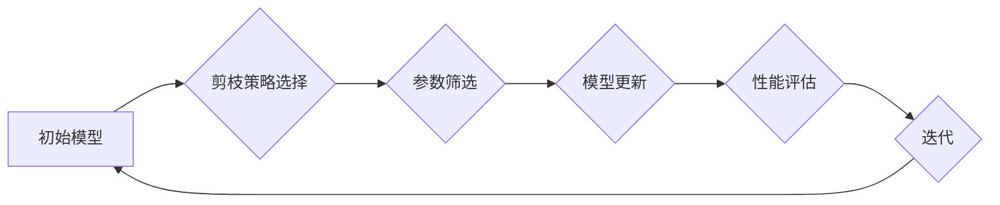

> 深度强化学习，剪枝技术，模型压缩，参数量，训练效率，性能优化

## 1. 背景介绍

深度强化学习 (Deep Reinforcement Learning, DRL) 近年来取得了显著进展，在游戏、机器人控制、自动驾驶等领域展现出强大的应用潜力。然而，DRL模型通常具有参数量庞大、训练时间长、计算资源消耗高等特点，这限制了其在实际应用中的推广。

剪枝技术 (Pruning) 作为一种模型压缩方法，通过移除冗余或不重要的模型参数，有效减小模型规模，提升训练效率和推理速度，同时保持模型性能。在DRL领域，剪枝技术被广泛应用于强化学习算法的优化，以解决模型规模过大带来的挑战。

## 2. 核心概念与联系

**2.1 深度强化学习**

DRL 结合了深度学习和强化学习的优势，通过深度神经网络学习策略，在环境中进行交互，并通过奖励信号不断优化策略，最终达到目标。

**2.2 剪枝技术**

剪枝技术通过移除模型参数，例如权重或神经元，从而减小模型规模。常见的剪枝方法包括：

* **结构剪枝 (Structural Pruning):** 移除整个神经元或连接，改变模型结构。
* **权重剪枝 (Weight Pruning):** 移除部分权重，保留重要权重。

**2.3 剪枝技术与DRL的联系**

在DRL中，剪枝技术可以应用于以下方面：

* **模型压缩:** 减小模型规模，降低存储和计算成本。
* **训练效率提升:** 减少训练参数数量，加速训练速度。
* **性能优化:** 通过移除冗余参数，提高模型泛化能力。

**2.4 剪枝技术流程图**



## 3. 核心算法原理 & 具体操作步骤

**3.1 算法原理概述**

剪枝算法的基本原理是通过移除模型中不重要的参数，从而减小模型规模，同时保持模型性能。常用的剪枝策略包括：

* **阈值剪枝 (Threshold Pruning):** 根据参数绝对值或重要性分数设置阈值，移除低于阈值的权重。
* **随机剪枝 (Random Pruning):** 随机移除一部分权重，通常用于结构剪枝。
* **梯度剪枝 (Gradient Pruning):** 根据参数梯度大小进行剪枝，移除梯度较小的权重。

**3.2 算法步骤详解**

1. **初始化模型:** 选择一个预训练的DRL模型作为初始模型。
2. **选择剪枝策略:** 根据模型结构和任务需求选择合适的剪枝策略。
3. **参数筛选:** 根据剪枝策略，筛选出需要移除的参数。
4. **模型更新:** 移除筛选出的参数，更新模型结构。
5. **性能评估:** 使用测试集评估剪枝后的模型性能。
6. **迭代:** 重复步骤3-5，直到达到预设的剪枝比例或性能目标。

**3.3 算法优缺点**

**优点:**

* 模型压缩: 显着减小模型规模，降低存储和计算成本。
* 训练效率提升: 减少训练参数数量，加速训练速度。
* 性能优化: 通过移除冗余参数，提高模型泛化能力。

**缺点:**

* 性能损失: 过度剪枝可能导致模型性能下降。
* 剪枝策略选择: 需要根据模型和任务选择合适的剪枝策略。
* 恢复困难: 剪枝后的模型难以恢复到原始模型。

**3.4 算法应用领域**

剪枝技术广泛应用于以下领域:

* **移动设备:** 压缩模型大小，降低设备资源消耗。
* **嵌入式系统:** 优化模型性能，满足实时性要求。
* **边缘计算:** 降低模型部署成本，提高边缘计算效率。

## 4. 数学模型和公式 & 详细讲解 & 举例说明

**4.1 数学模型构建**

假设一个深度神经网络模型包含 $N$ 个参数，记为 $\theta = \{\theta_1, \theta_2, ..., \theta_N\}$. 模型的目标是学习最优参数 $\theta^*$，使得模型在给定输入 $x$ 时，输出的预测值 $y$ 与真实值 $y^*$ 的误差最小。

**4.2 公式推导过程**

常用的损失函数为均方误差 (MSE):

$$
L(\theta) = \frac{1}{N} \sum_{i=1}^{N} (y_i - y_i^*)^2
$$

其中，$y_i$ 为模型预测值，$y_i^*$ 为真实值。

目标是找到最优参数 $\theta^*$，使得损失函数最小化:

$$
\theta^* = \arg \min_{\theta} L(\theta)
$$

**4.3 案例分析与讲解**

假设我们使用梯度下降算法优化模型参数。梯度下降算法的基本原理是通过计算损失函数对参数的梯度，沿着梯度负方向更新参数，从而逐渐逼近最优参数。

更新公式为:

$$
\theta_{t+1} = \theta_t - \eta \nabla L(\theta_t)
$$

其中，$\eta$ 为学习率，$\nabla L(\theta_t)$ 为损失函数对参数 $\theta_t$ 的梯度。

## 5. 项目实践：代码实例和详细解释说明

**5.1 开发环境搭建**

* Python 3.7+
* TensorFlow 2.0+
* PyTorch 1.0+

**5.2 源代码详细实现**

```python
import tensorflow as tf

# 定义一个简单的深度神经网络模型
model = tf.keras.models.Sequential([
    tf.keras.layers.Dense(128, activation='relu', input_shape=(784,)),
    tf.keras.layers.Dense(10, activation='softmax')
])

# 编译模型
model.compile(optimizer='adam',
              loss='sparse_categorical_crossentropy',
              metrics=['accuracy'])

# 加载 MNIST 数据集
(x_train, y_train), (x_test, y_test) = tf.keras.datasets.mnist.load_data()

# 数据预处理
x_train = x_train.reshape(-1, 784).astype('float32') / 255
x_test = x_test.reshape(-1, 784).astype('float32') / 255

# 剪枝操作
# 使用阈值剪枝策略，移除参数绝对值小于 0.1 的权重
for layer in model.layers:
    if isinstance(layer, tf.keras.layers.Dense):
        weights = layer.get_weights()[0]
        threshold = 0.1
        weights = tf.where(tf.abs(weights) > threshold, weights, 0.0)
        layer.set_weights([weights, layer.get_weights()[1]])

# 训练模型
model.fit(x_train, y_train, epochs=10)

# 评估模型性能
loss, accuracy = model.evaluate(x_test, y_test)
print('Test Loss:', loss)
print('Test Accuracy:', accuracy)
```

**5.3 代码解读与分析**

* 代码首先定义了一个简单的深度神经网络模型，并使用 Adam 优化器和交叉熵损失函数进行训练。
* 然后，代码使用阈值剪枝策略，移除参数绝对值小于 0.1 的权重。
* 最后，代码训练剪枝后的模型，并评估其性能。

**5.4 运行结果展示**

运行结果会显示剪枝后的模型的测试损失和准确率。

## 6. 实际应用场景

**6.1 游戏领域**

* 压缩游戏模型，降低游戏资源消耗，提高游戏运行流畅度。
* 优化游戏 AI，提高游戏 AI 的决策效率和反应速度。

**6.2 机器人控制领域**

* 压缩机器人控制模型，降低机器人控制成本，提高机器人控制效率。
* 优化机器人决策，提高机器人控制的鲁棒性和适应性。

**6.3 自动驾驶领域**

* 压缩自动驾驶模型，降低自动驾驶系统的计算成本，提高自动驾驶系统的实时性。
* 优化自动驾驶决策，提高自动驾驶系统的安全性。

**6.4 未来应用展望**

随着深度强化学习技术的不断发展，剪枝技术在DRL领域的应用前景广阔。未来，剪枝技术将更加智能化、自动化，并与其他模型压缩技术相结合，进一步提升DRL模型的效率和性能。

## 7. 工具和资源推荐

**7.1 学习资源推荐**

* **论文:**
    * "Pruning Filters for Efficient ConvNets"
    * "Lottery Ticket Hypothesis: Finding Sparse, Trainable Neural Networks"
    * "Deep Compression: Compressing Deep Neural Networks with Pruning, Trained Quantization and Huffman Coding"
* **博客:**
    * https://towardsdatascience.com/
    * https://machinelearningmastery.com/

**7.2 开发工具推荐**

* **TensorFlow:** https://www.tensorflow.org/
* **PyTorch:** https://pytorch.org/

**7.3 相关论文推荐**

* "Pruning Filters for Efficient ConvNets"
* "Lottery Ticket Hypothesis: Finding Sparse, Trainable Neural Networks"
* "Deep Compression: Compressing Deep Neural Networks with Pruning, Trained Quantization and Huffman Coding"

## 8. 总结：未来发展趋势与挑战

**8.1 研究成果总结**

剪枝技术在DRL领域取得了显著进展，有效减小了模型规模，提高了训练效率和性能。

**8.2 未来发展趋势**

* **自动化剪枝:** 自动化剪枝策略，无需人工干预，提高剪枝效率。
* **联合剪枝:** 将剪枝与其他模型压缩技术结合，实现更有效的模型压缩。
* **动态剪枝:** 根据任务需求动态调整剪枝比例，提高模型适应性。

**8.3 面临的挑战**

* **剪枝策略选择:** 不同任务和模型结构需要选择不同的剪枝策略。
* **性能损失:** 过度剪枝可能导致模型性能下降。
* **恢复困难:** 剪枝后的模型难以恢复到原始模型。

**8.4 研究展望**

未来，剪枝技术将继续发展，并与其他深度学习技术相结合，推动DRL技术的进步。


## 9. 附录：常见问题与解答

**9.1 什么是剪枝技术？**

剪枝技术是一种模型压缩方法，通过移除模型中不重要的参数，从而减小模型规模，提高训练效率和推理速度。

**9.2 剪枝技术有哪些类型？**

常见的剪枝类型包括结构剪枝和权重剪枝。

**9.3 剪枝技术有哪些优点？**

剪枝技术的优点包括模型压缩、训练效率提升和性能优化。

**9.4 剪枝技术有哪些缺点？**

剪枝技术的缺点包括性能损失、剪枝策略选择和恢复困难。


作者：禅与计算机程序设计艺术 / Zen and the Art of Computer Programming 
<end_of_turn>