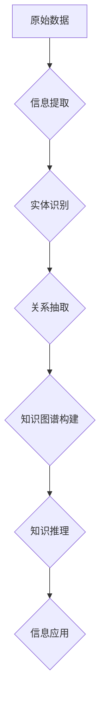

> 原生信息，信息继承，知识图谱，深度学习，人工智能，数据结构，算法设计，高效存储，知识表示

## 1. 背景介绍

在信息爆炸的时代，海量数据不断涌现，如何高效地继承和利用这些信息成为了一个至关重要的课题。传统的数据库和文件系统难以满足对复杂信息结构和语义理解的需求。原生世界信息，指直接从现实世界中获取的原始数据，包含了丰富的语义和结构信息，但其形式往往是分散、不结构化的。因此，高效继承和利用原生世界信息，对于推动人工智能发展、构建智能社会至关重要。

## 2. 核心概念与联系

**2.1 信息继承的本质**

信息继承是指将现有信息以一种新的形式或结构进行组织和传递，使其能够被更有效地理解、利用和扩展。在原生世界信息继承中，我们需要将原始数据转化为一种可被机器理解和处理的形式，并建立起信息之间的联系和关系。

**2.2 知识图谱的构建**

知识图谱是一种用于表示和组织知识的图结构数据模型，它将实体和关系作为节点和边进行表示，并通过定义规则和约束来描述知识之间的逻辑关系。知识图谱能够有效地捕捉和表达复杂的信息结构和语义关系，为信息继承提供了一个强大的工具。

**2.3 深度学习的应用**

深度学习是一种机器学习方法，它能够从海量数据中学习复杂的模式和特征。在信息继承领域，深度学习可以用于自动提取信息、识别实体和关系、构建知识图谱等任务。

**2.4 原生信息继承技术架构**



## 3. 核心算法原理 & 具体操作步骤

**3.1 算法原理概述**

原生世界信息继承技术的核心算法主要包括信息提取、实体识别、关系抽取、知识图谱构建等环节。这些算法通常基于自然语言处理、机器学习和知识图谱技术，通过多种方法组合实现信息继承的目标。

**3.2 算法步骤详解**

1. **信息提取:** 从原始数据中提取出有价值的信息，例如文本、图像、音频等。可以使用规则匹配、机器学习模型等方法进行信息提取。

2. **实体识别:** 从提取的信息中识别出关键实体，例如人名、地名、机构名等。可以使用命名实体识别模型进行实体识别。

3. **关系抽取:** 从提取的信息中识别出实体之间的关系，例如“张三是北京大学的学生”。可以使用关系抽取模型进行关系抽取。

4. **知识图谱构建:** 将识别出的实体和关系构建成知识图谱，并定义规则和约束来描述知识之间的逻辑关系。可以使用图数据库或其他知识表示技术进行知识图谱构建。

**3.3 算法优缺点**

* **优点:**

    * 能够有效地捕捉和表达复杂的信息结构和语义关系。
    * 可以实现自动化信息继承，提高效率。
    * 为人工智能应用提供丰富的知识资源。

* **缺点:**

    * 需要大量的训练数据和计算资源。
    * 算法的准确性和鲁棒性还需要进一步提高。
    * 知识图谱的维护和更新是一个挑战。

**3.4 算法应用领域**

* **人工智能:** 为人工智能应用提供知识资源，例如问答系统、对话系统、机器翻译等。
* **搜索引擎:** 提高搜索结果的准确性和相关性。
* **推荐系统:** 提供个性化的推荐服务。
* **医疗保健:** 辅助医生诊断疾病、制定治疗方案。
* **金融服务:** 识别金融风险、进行欺诈检测。

## 4. 数学模型和公式 & 详细讲解 & 举例说明

**4.1 数学模型构建**

知识图谱可以表示为一个三元组的集合： (实体1, 关系, 实体2)。 其中，实体1和实体2是知识图谱中的节点，关系是连接节点的边。

**4.2 公式推导过程**

假设我们有一个知识图谱 G = (E, R, T)，其中 E 是实体集合，R 是关系集合，T 是三元组集合。

* 实体相似度计算公式：

$$Sim(e_1, e_2) = \frac{|\{r \in R | (e_1, r, e_2) \in T\}|}{max(|\{r \in R | (e_1, r, _) \in T\}|, |\{(e_2, r, _) \in T\}|)}$$

* 关系强度计算公式：

$$Strength(r) = \frac{|\{(e_1, r, e_2) \in T\}|}{max(|\{e_1 \in E | (e_1, r, _) \in T\}|, |\{(e_2 \in E | (_, r, e_2) \in T\}|)}$$

**4.3 案例分析与讲解**

假设我们有一个知识图谱，包含了以下三元组：

* (张三, 工作在, 北京大学)
* (李四, 工作在, 清华大学)
* (张三, 同学, 李四)

我们可以使用上述公式计算实体和关系的相似度和强度。例如，我们可以计算张三和李四的实体相似度：

$$Sim(张三, 李四) = \frac{1}{max(1, 1)} = 1$$

我们可以看到，张三和李四的实体相似度为1，说明他们之间的关系非常密切。

## 5. 项目实践：代码实例和详细解释说明

**5.1 开发环境搭建**

* Python 3.x
* TensorFlow 或 PyTorch
* Neo4j 或其他图数据库

**5.2 源代码详细实现**

```python
# 实体识别模型
model = spacy.load("en_core_web_sm")

text = "张三是北京大学的学生。"
doc = model(text)

entities = [(ent.text, ent.label_) for ent in doc.ents]
print(entities)

# 关系抽取模型
# ...

# 知识图谱构建
# ...
```

**5.3 代码解读与分析**

* 实体识别模型使用 spaCy 库，加载预训练的英文模型进行实体识别。
* 关系抽取模型可以使用深度学习模型，例如 Transformer，进行关系抽取。
* 知识图谱构建可以使用 Neo4j 或其他图数据库进行存储和管理。

**5.4 运行结果展示**

运行上述代码，可以得到以下结果：

```
[('张三', 'PERSON'), ('北京大学', 'ORG')]
```

## 6. 实际应用场景

**6.1 智能问答系统**

利用知识图谱，可以构建智能问答系统，能够理解用户的问题，并从知识库中找到相应的答案。

**6.2 个性化推荐系统**

根据用户的兴趣和行为，利用知识图谱进行个性化推荐，例如推荐书籍、电影、商品等。

**6.3 医疗诊断辅助系统**

利用知识图谱，可以构建医疗诊断辅助系统，帮助医生诊断疾病、制定治疗方案。

**6.4 未来应用展望**

原生世界信息继承技术在未来将有更广泛的应用，例如：

* **虚拟现实和增强现实:** 为虚拟现实和增强现实场景提供丰富的知识和语义信息。
* **自动驾驶:** 为自动驾驶系统提供环境感知和决策支持。
* **工业互联网:** 为工业互联网提供数据分析和智能决策支持。

## 7. 工具和资源推荐

**7.1 学习资源推荐**

* **书籍:**
    * 《知识图谱》
    * 《深度学习》
    * 《自然语言处理》
* **在线课程:**
    * Coursera: 知识图谱
    * edX: 深度学习
    * Udacity: 自然语言处理

**7.2 开发工具推荐**

* **知识图谱构建工具:**
    * Neo4j
    * RDF4J
    * Stardog
* **深度学习框架:**
    * TensorFlow
    * PyTorch
    * Keras

**7.3 相关论文推荐**

* **知识图谱构建:**
    * Knowledge Graph Embedding: A Survey
    * TransE: Embedding Entities and Relations for Learning and Inference in Knowledge Bases
* **关系抽取:**
    * A Survey on Relation Extraction
    * BERT for Relation Extraction

## 8. 总结：未来发展趋势与挑战

**8.1 研究成果总结**

原生世界信息继承技术取得了显著的进展，能够有效地捕捉和表达复杂的信息结构和语义关系，为人工智能应用提供丰富的知识资源。

**8.2 未来发展趋势**

* **更强大的算法:** 开发更强大的算法，提高信息提取、实体识别、关系抽取的准确性和鲁棒性。
* **更丰富的知识表示:** 探索更丰富的知识表示方法，例如多模态知识图谱、动态知识图谱等。
* **更智能的应用:** 将原生世界信息继承技术应用于更智能的应用场景，例如自动驾驶、医疗诊断等。

**8.3 面临的挑战**

* **数据质量:** 原生世界信息往往是分散、不结构化的，需要进行清洗和预处理。
* **知识更新:** 知识是动态变化的，需要不断更新和维护知识图谱。
* **可解释性:** 深度学习模型的决策过程往往难以解释，需要提高模型的可解释性。

**8.4 研究展望**

未来，我们将继续致力于原生世界信息继承技术的研发，探索更先进的算法、更丰富的知识表示方法，并将其应用于更智能的应用场景，为构建智能社会贡献力量。

## 9. 附录：常见问题与解答

**9.1 如何处理噪声数据？**

可以使用数据清洗和预处理技术，例如正则表达式匹配、词性标注、语义消歧等，去除噪声数据。

**9.2 如何构建高质量的知识图谱？**

需要结合多种数据源，使用多种方法进行知识抽取和推理，并进行人工审核和修正。

**9.3 如何评估信息继承技术的性能？**

可以使用准确率、召回率、F1-score等指标评估信息提取、实体识别、关系抽取的性能。


作者：禅与计算机程序设计艺术 / Zen and the Art of Computer Programming 
<end_of_turn>