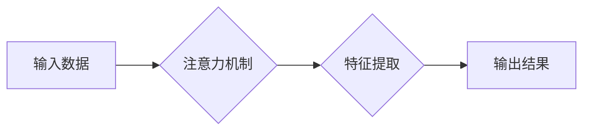

> 人工智能，专注力，深度学习，机器学习，认知科学，注意力机制，未来趋势

## 1. 背景介绍

我们正处在一个人工智能（AI）飞速发展的时代。从自动驾驶汽车到个性化医疗，AI正在深刻地改变着我们的生活。然而，这种快速发展也带来了新的挑战，其中之一就是如何保持专注力。

在信息爆炸的时代，我们每天都被各种信息轰炸，注意力被不断地分散。AI技术的进步，例如个性化推荐算法和社交媒体的推送机制，更是加剧了这种现象。在这种情况下，保持专注力变得尤为重要，因为它直接关系到我们的学习、工作和生活质量。

## 2. 核心概念与联系

**2.1  专注力的本质**

专注力是指我们能够将注意力集中在特定目标或任务上，并排除干扰的能力。它是一个复杂的心理过程，涉及到多个大脑区域的协同工作，包括前额叶皮层、注意网络和执行功能系统。

**2.2  AI与专注力的关系**

AI技术本身并没有直接影响我们的专注力，但它却改变了我们与信息的交互方式，从而间接地影响了我们的注意力。

* **信息过载:** AI驱动的个性化推荐算法和社交媒体推送机制会根据我们的兴趣和行为模式，不断地推送大量信息，导致信息过载，分散我们的注意力。
* **碎片化信息:** AI技术使得信息变得更加碎片化，我们更容易被短视频、新闻推送等碎片化的信息吸引，难以集中注意力进行深度思考。
* **虚拟现实与增强现实:** AI驱动的虚拟现实和增强现实技术，虽然可以带来沉浸式的体验，但也可能让人更容易沉迷其中，难以从虚拟世界中抽离出来。

**2.3  注意力机制**

注意力机制是近年来深度学习领域的重要突破，它能够帮助模型模拟人类的注意力机制，专注于输入数据中最重要的部分。

**Mermaid 流程图**



## 3. 核心算法原理 & 具体操作步骤

**3.1  算法原理概述**

注意力机制的核心思想是，在处理信息时，我们并不总是关注所有信息，而是会根据任务需求和上下文，选择性地关注某些重要信息。

注意力机制通过学习一个“注意力权重”，来分配不同输入数据的重要性。这些权重可以表示为一个概率分布，其中权重高的部分代表着模型关注的重点。

**3.2  算法步骤详解**

1. **计算注意力权重:** 首先，需要计算每个输入数据点的注意力权重。这通常可以通过一个注意力函数来实现，该函数会根据输入数据和上下文信息，计算每个数据点的注意力得分。
2. **加权求和:** 将注意力权重与输入数据相乘，然后进行加权求和，得到一个新的表示向量。这个向量包含了输入数据中重要信息的综合信息。
3. **后续处理:** 将加权求和后的向量作为后续处理的输入，例如用于分类、预测或生成文本等任务。

**3.3  算法优缺点**

**优点:**

* 可以有效地提高模型的性能，尤其是在处理长序列数据时。
* 可以帮助模型理解输入数据的语义关系，并关注重要的信息。
* 可以解释模型的决策过程，提高模型的可解释性。

**缺点:**

* 计算复杂度较高，训练时间较长。
* 需要大量的训练数据才能达到最佳效果。

**3.4  算法应用领域**

注意力机制在许多领域都有广泛的应用，例如：

* **自然语言处理:** 机器翻译、文本摘要、问答系统等。
* **计算机视觉:** 图像识别、目标检测、图像 Captioning 等。
* **语音识别:** 语音转文本、语音合成等。

## 4. 数学模型和公式 & 详细讲解 & 举例说明

**4.1  数学模型构建**

注意力机制的数学模型通常基于以下公式：

$$
\text{Attention}(Q, K, V) = \text{softmax}\left(\frac{Q K^T}{\sqrt{d_k}}\right) V
$$

其中：

* $Q$：查询矩阵，表示模型想要关注的信息。
* $K$：键矩阵，表示输入数据的每个元素。
* $V$：值矩阵，表示输入数据的每个元素对应的特征向量。
* $d_k$：键向量的维度。
* $\text{softmax}$：softmax函数，用于将注意力权重归一化到一个概率分布。

**4.2  公式推导过程**

注意力机制的公式推导过程可以分为以下几个步骤：

1. 计算查询矩阵 $Q$ 和键矩阵 $K$ 的点积，得到一个得分矩阵。
2. 对得分矩阵进行归一化，得到注意力权重矩阵。
3. 将注意力权重矩阵与值矩阵 $V$ 进行加权求和，得到最终的输出向量。

**4.3  案例分析与讲解**

例如，在机器翻译任务中，查询矩阵 $Q$ 表示目标语言的词嵌入，键矩阵 $K$ 表示源语言的词嵌入，值矩阵 $V$ 表示源语言的词嵌入对应的特征向量。

注意力机制可以帮助模型关注源语言中与目标语言词语相关的关键信息，从而提高翻译的准确性。

## 5. 项目实践：代码实例和详细解释说明

**5.1  开发环境搭建**

* Python 3.7+
* TensorFlow 2.0+
* PyTorch 1.0+

**5.2  源代码详细实现**

```python
import tensorflow as tf

# 定义注意力机制
def attention_layer(query, key, value, mask=None):
    # 计算注意力权重
    scores = tf.matmul(query, key, transpose_b=True) / tf.math.sqrt(tf.cast(key.shape[-1], tf.float32))
    if mask is not None:
        scores += (mask * -1e9)
    attention_weights = tf.nn.softmax(scores, axis=-1)
    # 加权求和
    context_vector = tf.matmul(attention_weights, value)
    return context_vector, attention_weights

# 示例代码
query = tf.random.normal([1, 5, 64])
key = tf.random.normal([1, 10, 64])
value = tf.random.normal([1, 10, 128])

context_vector, attention_weights = attention_layer(query, key, value)
print(context_vector.shape)
print(attention_weights.shape)
```

**5.3  代码解读与分析**

* `attention_layer` 函数定义了注意力机制的计算过程。
* `scores` 计算了查询矩阵和键矩阵的点积，并进行归一化。
* `attention_weights` 使用 softmax 函数将得分矩阵转换为注意力权重矩阵。
* `context_vector` 通过加权求和得到最终的输出向量。

**5.4  运行结果展示**

运行上述代码，会输出 `context_vector` 和 `attention_weights` 的形状。

## 6. 实际应用场景

**6.1  个性化推荐系统**

注意力机制可以帮助推荐系统更好地理解用户的兴趣偏好，并推荐更相关的商品或内容。

**6.2  机器翻译**

注意力机制可以帮助机器翻译模型关注源语言中与目标语言词语相关的关键信息，从而提高翻译的准确性。

**6.3  医疗诊断**

注意力机制可以帮助医疗诊断系统关注病人的关键症状和检查结果，提高诊断的准确性。

**6.4  未来应用展望**

注意力机制在未来将有更广泛的应用，例如：

* **自动驾驶:** 注意力机制可以帮助自动驾驶系统关注道路上的关键信息，提高驾驶安全。
* **机器人交互:** 注意力机制可以帮助机器人更好地理解人类的语言和行为，提高人机交互的自然性和流畅性。
* **教育:** 注意力机制可以帮助教育系统个性化学习，提高学生的学习效率。

## 7. 工具和资源推荐

**7.1  学习资源推荐**

* **论文:**
    * "Attention Is All You Need"
    * "BERT: Pre-training of Deep Bidirectional Transformers for Language Understanding"
* **博客:**
    * Jay Alammar's Blog
    * Distill.pub

**7.2  开发工具推荐**

* **TensorFlow:** https://www.tensorflow.org/
* **PyTorch:** https://pytorch.org/

**7.3  相关论文推荐**

* "Attention Is All You Need"
* "BERT: Pre-training of Deep Bidirectional Transformers for Language Understanding"
* "Transformer-XL: Attentive Language Models Beyond a Fixed-Length Context"

## 8. 总结：未来发展趋势与挑战

**8.1  研究成果总结**

近年来，注意力机制在人工智能领域取得了显著的进展，并在许多任务中取得了优异的性能。

**8.2  未来发展趋势**

未来，注意力机制的研究将朝着以下几个方向发展：

* **更有效的注意力机制:** 研究更有效的注意力机制，例如自注意力机制、多头注意力机制等。
* **可解释性更高的注意力机制:** 研究可解释性更高的注意力机制，以便更好地理解模型的决策过程。
* **跨模态注意力机制:** 研究跨模态注意力机制，例如文本-图像注意力机制、文本-音频注意力机制等。

**8.3  面临的挑战**

注意力机制也面临着一些挑战，例如：

* **计算复杂度:** 某些注意力机制的计算复杂度较高，难以在资源有限的设备上运行。
* **数据依赖性:** 注意力机制通常需要大量的训练数据才能达到最佳效果。
* **可解释性:** 一些注意力机制的决策过程难以解释，这可能会影响模型的信任度。

**8.4  研究展望**

尽管面临着一些挑战，但注意力机制仍然是一个非常有前景的研究方向。相信随着研究的深入，注意力机制将会有更广泛的应用，并为人工智能的发展做出更大的贡献。

## 9. 附录：常见问题与解答

**9.1  Q: 注意力机制和深度学习有什么关系？**

**A:** 注意力机制是一种深度学习中的重要技术，它可以帮助模型模拟人类的注意力机制，并提高模型的性能。

**9.2  Q: 注意力机制有哪些应用场景？**

**A:** 注意力机制在许多领域都有广泛的应用，例如自然语言处理、计算机视觉、语音识别等。

**9.3  Q: 如何选择合适的注意力机制？**

**A:** 选择合适的注意力机制需要根据具体的应用场景和任务需求来决定。


作者：禅与计算机程序设计艺术 / Zen and the Art of Computer Programming 
<end_of_turn>