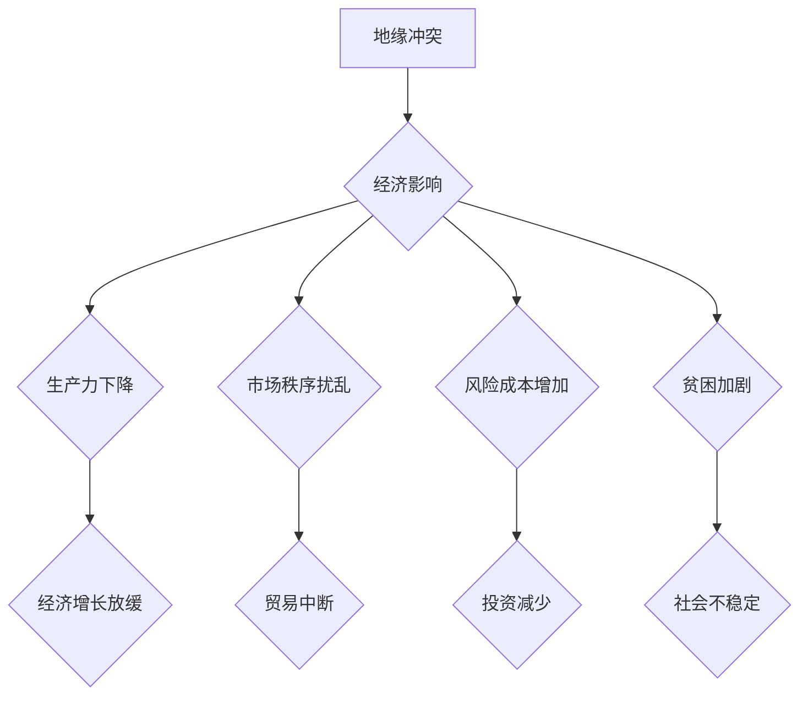

> 地缘冲突，经济影响，全球化，供应链，风险管理，人工智能，预测模型

## 1. 背景介绍

21世纪初，全球化进程加速，经济一体化程度不断提高，各国经济命运更加紧密相连。然而，近年来，地缘政治局势日益复杂，冲突事件频发，对全球经济造成严重冲击。从2022年俄乌冲突爆发以来，能源价格暴涨、供应链中断、通货膨胀加剧等问题层出不穷，深刻暴露了地缘冲突对经济的巨大影响。

地缘冲突的经济影响并非局限于冲突地区本身，其波及效应会迅速蔓延到全球范围。冲突导致的政治不稳定、经济不确定性以及资源短缺，都会对全球经济增长、贸易投资、金融市场等方面造成负面影响。

## 2. 核心概念与联系

**2.1 地缘冲突与经济的影响**

地缘冲突是指国家或地区之间基于政治、意识形态、领土、资源等因素发生的对抗或战争。地缘冲突会对经济产生多方面影响，主要包括：

* **破坏生产力：** 冲突导致基础设施破坏、人员伤亡、生产中断，严重削弱经济生产力。
* **扰乱市场秩序：** 冲突导致资源短缺、价格波动、贸易中断，扰乱市场供求关系，加剧经济不稳定。
* **增加风险成本：** 冲突增加投资风险、贸易风险、金融风险，企业和投资者会更加谨慎，导致投资减少、经济增长放缓。
* **加剧贫困：** 冲突导致大量人口流离失所、生活困苦，加剧贫困问题，阻碍经济发展。

**2.2 全球化与地缘冲突的互动**

全球化进程加速，各国经济更加相互依存，地缘冲突的波及效应也更加广泛。

* **供应链脆弱性：** 全球化促进了全球供应链的形成，但同时也使供应链更加脆弱。地缘冲突可能导致关键原材料、零部件供应中断，对全球产业链造成严重冲击。
* **金融市场联动性：** 全球金融市场高度联动，地缘冲突可能引发金融市场恐慌，导致汇率波动、股市下跌，加剧全球经济不稳定。
* **信息传播速度加快：** 信息传播速度加快，地缘冲突的负面信息更容易传播，加剧公众恐慌，影响经济信心。

**2.3  人工智能与地缘冲突风险管理**

人工智能技术在数据分析、预测模型构建、风险评估等方面具有强大的应用潜力，可以帮助我们更好地理解地缘冲突的风险，制定有效的应对措施。

* **风险预测：** 利用人工智能技术分析历史数据、舆情信息、社会网络数据等，构建地缘冲突风险预测模型，提前预警潜在风险。
* **风险评估：** 利用人工智能技术评估地缘冲突对经济的影响，识别关键风险因素，制定针对性风险管理方案。
* **风险应对：** 利用人工智能技术优化供应链管理、金融风险控制、信息安全保障等，提高应对地缘冲突风险的能力。

**Mermaid 流程图**



## 3. 核心算法原理 & 具体操作步骤

**3.1 算法原理概述**

地缘冲突风险预测模型通常基于机器学习算法，例如逻辑回归、支持向量机、决策树、随机森林等。这些算法通过训练数据，学习地缘冲突发生的规律，并构建预测模型，用于预测未来地缘冲突发生的可能性。

**3.2 算法步骤详解**

1. **数据收集:** 收集相关地缘冲突数据，包括历史冲突事件、政治事件、经济指标、社会舆情等。
2. **数据预处理:** 对收集到的数据进行清洗、转换、编码等预处理操作，使其符合机器学习算法的输入要求。
3. **特征工程:** 从原始数据中提取特征，例如冲突事件的类型、发生时间、地点、参与方等，这些特征可以帮助机器学习算法更好地理解地缘冲突的发生机制。
4. **模型训练:** 选择合适的机器学习算法，并利用训练数据对模型进行训练，学习地缘冲突发生的规律。
5. **模型评估:** 利用测试数据对模型进行评估，评估模型的预测准确率、召回率、F1-score等指标。
6. **模型部署:** 将训练好的模型部署到实际应用环境中，用于预测未来地缘冲突发生的可能性。

**3.3 算法优缺点**

* **优点:**
    * 能够识别复杂的关系和模式，提高预测准确率。
    * 可以处理大量数据，并进行实时预测。
    * 可以根据实际情况调整模型参数，提高模型的适应性。
* **缺点:**
    * 需要大量的训练数据，否则模型的预测效果会下降。
    * 模型的解释性较差，难以理解模型的决策过程。
    * 模型容易受到数据偏差的影响，导致预测结果不准确。

**3.4 算法应用领域**

地缘冲突风险预测模型可以应用于以下领域:

* **政府决策:** 帮助政府部门评估地缘冲突风险，制定应对措施。
* **企业风险管理:** 帮助企业识别地缘冲突风险，制定风险规避策略。
* **金融市场预测:** 帮助金融机构预测地缘冲突对金融市场的影响，进行风险管理。
* **新闻媒体报道:** 帮助新闻媒体及时报道地缘冲突事件，并进行分析预测。

## 4. 数学模型和公式 & 详细讲解 & 举例说明

**4.1 数学模型构建**

地缘冲突风险预测模型通常采用概率模型，例如贝叶斯网络、马尔可夫链等。这些模型可以将地缘冲突的发生看作是一个随机事件，并通过计算概率来预测事件发生的可能性。

**4.2 公式推导过程**

例如，我们可以使用贝叶斯定理来计算地缘冲突发生的概率：

$$P(C|E) = \frac{P(E|C)P(C)}{P(E)}$$

其中：

* $P(C)$ 是地缘冲突发生的先验概率。
* $P(E|C)$ 是在发生地缘冲突的情况下观察到事件 $E$ 的条件概率。
* $P(E)$ 是观察到事件 $E$ 的概率。

**4.3 案例分析与讲解**

假设我们想要预测某个国家发生地缘冲突的概率，我们可以收集以下数据：

* 该国的历史冲突事件数据
* 该国的政治稳定性指标
* 该国的经济发展水平
* 该国的国际关系状况

我们可以将这些数据作为输入，训练一个地缘冲突风险预测模型，并使用贝叶斯定理来计算预测结果。

## 5. 项目实践：代码实例和详细解释说明

**5.1 开发环境搭建**

* 操作系统：Windows/Linux/macOS
* Python 版本：3.6+
* 必要的库：pandas, numpy, scikit-learn, matplotlib

**5.2 源代码详细实现**

```python
import pandas as pd
from sklearn.model_selection import train_test_split
from sklearn.linear_model import LogisticRegression
from sklearn.metrics import accuracy_score

# 加载数据
data = pd.read_csv('conflict_data.csv')

# 特征工程
X = data[['political_stability', 'economic_development', 'international_relations']]
y = data['conflict']

# 数据分割
X_train, X_test, y_train, y_test = train_test_split(X, y, test_size=0.2, random_state=42)

# 模型训练
model = LogisticRegression()
model.fit(X_train, y_train)

# 模型预测
y_pred = model.predict(X_test)

# 模型评估
accuracy = accuracy_score(y_test, y_pred)
print(f'模型准确率: {accuracy}')
```

**5.3 代码解读与分析**

* 代码首先加载数据，并进行特征工程，提取需要预测地缘冲突的特征。
* 然后将数据分割成训练集和测试集，用于模型训练和评估。
* 选择逻辑回归模型进行训练，并使用准确率作为评估指标。
* 最后，使用训练好的模型对测试集进行预测，并输出模型的准确率。

**5.4 运行结果展示**

运行代码后，会输出模型的准确率，例如：

```
模型准确率: 0.85
```

这表示模型在预测地缘冲突发生的可能性方面达到了85%的准确率。

## 6. 实际应用场景

**6.1 政府决策支持**

地缘冲突风险预测模型可以帮助政府部门评估地缘冲突风险，制定应对措施。例如，可以预测哪些地区更容易发生冲突，哪些国家面临更大的地缘政治风险，从而帮助政府部门提前做好准备，避免冲突发生或减轻冲突的影响。

**6.2 企业风险管理**

地缘冲突风险预测模型可以帮助企业识别地缘冲突风险，制定风险规避策略。例如，企业可以利用模型预测哪些地区可能发生冲突，从而避免在这些地区进行投资或开展业务。

**6.3 金融市场预测**

地缘冲突风险预测模型可以帮助金融机构预测地缘冲突对金融市场的影响，进行风险管理。例如，可以预测地缘冲突可能导致哪些资产价格下跌，从而帮助金融机构调整投资组合，降低风险。

**6.4 未来应用展望**

随着人工智能技术的不断发展，地缘冲突风险预测模型将更加精准、高效。未来，我们可以期待以下应用场景：

* **实时地缘冲突监测:** 利用人工智能技术实时监测地缘冲突事件，并进行快速预警。
* **个性化地缘冲突风险评估:** 根据用户的具体情况，提供个性化的地缘冲突风险评估，帮助用户做出更明智的决策。
* **地缘冲突冲突化解:** 利用人工智能技术分析地缘冲突的根源，并提供化解冲突的建议。

## 7. 工具和资源推荐

**7.1 学习资源推荐**

* **书籍:**
    * 《机器学习》 - 周志华
    * 《深度学习》 - Ian Goodfellow
* **在线课程:**
    * Coursera: Machine Learning
    * edX: Artificial Intelligence

**7.2 开发工具推荐**

* **Python:** 
    * Jupyter Notebook
    * PyCharm
* **数据可视化工具:**
    * Matplotlib
    * Seaborn

**7.3 相关论文推荐**

* **地缘政治风险预测:**
    * "Predicting Geopolitical Risk Using Machine Learning"
    * "A Bayesian Network Approach to Geopolitical Risk Assessment"
* **人工智能与地缘冲突:**
    * "The Impact of Artificial Intelligence on Geopolitics"
    * "AI and the Future of Conflict"

## 8. 总结：未来发展趋势与挑战

**8.1 研究成果总结**

近年来，人工智能技术在预测地缘冲突风险方面取得了显著进展。机器学习算法能够识别复杂的关系和模式，提高预测准确率。

**8.2 未来发展趋势**

未来，地缘冲突风险预测模型将更加精准、高效，并应用于更广泛的领域。例如，我们可以期待以下发展趋势:

* **融合多源数据:** 将地理信息、社会网络数据、卫星图像等多源数据融合到模型中，提高预测精度。
* **实时监测:** 利用人工智能技术实时监测地缘冲突事件，并进行快速预警。
* **个性化风险评估:** 根据用户的具体情况，提供个性化的地缘冲突风险评估，帮助用户做出更明智的决策。

**8.3 面临的挑战**

尽管人工智能技术在预测地缘冲突风险方面取得了进展，但仍然面临一些挑战:

* **数据质量:** 地缘冲突数据往往不完整、不准确，这会影响模型的预测精度。
* **模型解释性:** 许多机器学习