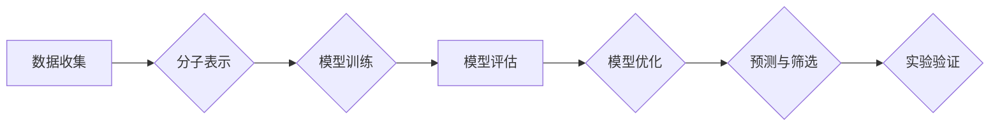

> 深度学习，药物设计，分子模拟，机器学习，人工智能，药物发现，虚拟筛选

## 1. 背景介绍

药物研发是一个漫长而复杂的流程，通常需要花费十年时间和数十亿美元。传统药物设计方法依赖于化学合成和生物学实验，效率低下且成本高昂。近年来，深度学习等人工智能技术在药物设计领域取得了突破性进展，为加速药物研发提供了新的思路和方法。

深度学习是一种基于人工神经网络的机器学习方法，能够从海量数据中学习复杂的模式和关系。在药物设计领域，深度学习可以用于多种任务，例如：

* **虚拟筛选**: 利用深度学习模型预测化合物与靶标蛋白的结合亲和力，筛选出潜在的药物候选物。
* **分子性质预测**: 利用深度学习模型预测化合物的物理化学性质，例如溶解度、生物利用度等。
* **药物靶标识别**: 利用深度学习模型识别疾病相关的靶标蛋白。
* **药物组合优化**: 利用深度学习模型优化药物组合，提高疗效并降低副作用。

## 2. 核心概念与联系

### 2.1 深度学习在药物设计中的应用

深度学习在药物设计中的应用主要基于以下核心概念：

* **分子表示**: 将分子结构转换为机器可理解的数字表示，例如 SMILES 字符串、分子图谱等。
* **神经网络架构**: 选择合适的深度学习模型架构，例如卷积神经网络 (CNN)、循环神经网络 (RNN) 等，用于处理分子数据。
* **训练数据**: 使用大量的分子数据进行模型训练，例如化合物结构、活性数据、蛋白质结构等。
* **性能评估**: 使用标准的指标评估模型性能，例如准确率、AUC 等。

### 2.2 深度学习药物设计流程



## 3. 核心算法原理 & 具体操作步骤

### 3.1 算法原理概述

深度学习在药物设计中的核心算法主要包括：

* **卷积神经网络 (CNN)**: CNN 擅长处理图像数据，可以有效地提取分子结构中的特征。
* **循环神经网络 (RNN)**: RNN 擅长处理序列数据，可以学习分子结构的顺序信息。
* **图神经网络 (GNN)**: GNN 擅长处理图数据，可以学习分子结构的拓扑信息。

### 3.2 算法步骤详解

**以 CNN 为例，详细说明其在药物设计中的应用步骤：**

1. **数据预处理**: 将分子结构转换为 CNN 可理解的格式，例如分子图谱。
2. **特征提取**: 使用 CNN 的卷积层和池化层提取分子结构的特征。
3. **分类或回归**: 使用 CNN 的全连接层进行分类或回归，预测化合物的活性或结合亲和力。
4. **模型训练**: 使用训练数据训练 CNN 模型，优化模型参数。
5. **模型评估**: 使用测试数据评估模型性能，例如准确率、AUC 等。

### 3.3 算法优缺点

**CNN 算法的优缺点：**

* **优点**: 能够有效地提取分子结构的特征，具有较高的预测精度。
* **缺点**: 对数据量要求较高，训练时间较长。

### 3.4 算法应用领域

CNN 算法在药物设计领域广泛应用，例如：

* **虚拟筛选**: 筛选出潜在的药物候选物。
* **药物靶标识别**: 识别疾病相关的靶标蛋白。
* **药物组合优化**: 优化药物组合，提高疗效并降低副作用。

## 4. 数学模型和公式 & 详细讲解 & 举例说明

### 4.1 数学模型构建

在深度学习药物设计中，常用的数学模型包括：

* **损失函数**: 用于衡量模型预测结果与真实值的差异。常用的损失函数包括均方误差 (MSE)、交叉熵损失 (Cross-Entropy Loss) 等。
* **优化算法**: 用于更新模型参数，使模型损失函数最小化。常用的优化算法包括梯度下降 (Gradient Descent)、Adam 算法等。

### 4.2 公式推导过程

**以均方误差 (MSE) 为例，推导其公式：**

假设模型预测值 $y_i$，真实值 $t_i$，则 MSE 定义为：

$$MSE = \frac{1}{N} \sum_{i=1}^{N} (y_i - t_i)^2$$

其中，N 为样本数量。

### 4.3 案例分析与讲解

**以虚拟筛选为例，解释 MSE 在药物设计中的应用：**

在虚拟筛选中，模型需要预测化合物与靶标蛋白的结合亲和力。可以使用 MSE 作为损失函数，训练模型预测化合物与靶标蛋白的结合亲和力。训练完成后，可以使用模型预测未知化合物的结合亲和力，并筛选出结合亲和力最高的化合物作为潜在的药物候选物。

## 5. 项目实践：代码实例和详细解释说明

### 5.1 开发环境搭建

* **操作系统**: Ubuntu 20.04
* **编程语言**: Python 3.7
* **深度学习框架**: TensorFlow 2.0
* **其他依赖**: numpy, pandas, matplotlib 等

### 5.2 源代码详细实现

```python
import tensorflow as tf

# 定义模型结构
model = tf.keras.Sequential([
    tf.keras.layers.Conv2D(32, (3, 3), activation='relu', input_shape=(28, 28, 1)),
    tf.keras.layers.MaxPooling2D((2, 2)),
    tf.keras.layers.Conv2D(64, (3, 3), activation='relu'),
    tf.keras.layers.MaxPooling2D((2, 2)),
    tf.keras.layers.Flatten(),
    tf.keras.layers.Dense(10, activation='softmax')
])

# 定义损失函数和优化器
model.compile(loss='sparse_categorical_crossentropy',
              optimizer='adam',
              metrics=['accuracy'])

# 训练模型
model.fit(x_train, y_train, epochs=10)

# 评估模型
loss, accuracy = model.evaluate(x_test, y_test)
print('Test loss:', loss)
print('Test accuracy:', accuracy)
```

### 5.3 代码解读与分析

* **模型结构**: 该代码定义了一个简单的 CNN 模型，包含两个卷积层、两个池化层和一个全连接层。
* **损失函数**: 使用了交叉熵损失函数，用于分类任务。
* **优化器**: 使用了 Adam 优化器，用于更新模型参数。
* **训练过程**: 使用训练数据训练模型，并设置训练轮数为 10。
* **评估过程**: 使用测试数据评估模型性能，并打印测试损失和准确率。

### 5.4 运行结果展示

运行代码后，会输出模型的测试损失和准确率。

## 6. 实际应用场景

### 6.1 药物发现

深度学习在药物发现领域具有广泛的应用场景，例如：

* **虚拟筛选**: 利用深度学习模型筛选出潜在的药物候选物。
* **靶标识别**: 利用深度学习模型识别疾病相关的靶标蛋白。
* **药物组合优化**: 利用深度学习模型优化药物组合，提高疗效并降低副作用。

### 6.2 药物设计

深度学习在药物设计领域可以帮助科学家设计更有效的药物，例如：

* **分子优化**: 利用深度学习模型优化药物分子结构，提高其活性或降低其毒性。
* **药物递送**: 利用深度学习模型设计更有效的药物递送系统。

### 6.3 药物安全性评估

深度学习可以用于评估药物的安全性，例如：

* **预测药物毒性**: 利用深度学习模型预测药物的毒性。
* **识别药物相互作用**: 利用深度学习模型识别药物之间的相互作用。

### 6.4 未来应用展望

未来，深度学习在药物设计领域将有更广泛的应用，例如：

* **个性化药物**: 利用深度学习模型设计个性化的药物，针对个体患者的基因和疾病特征。
* **人工智能驱动的药物研发**: 利用人工智能技术加速药物研发流程，缩短药物上市时间。

## 7. 工具和资源推荐

### 7.1 学习资源推荐

* **书籍**:
    * Deep Learning for Drug Discovery
    * Artificial Intelligence in Drug Discovery
* **在线课程**:
    * Coursera: Deep Learning Specialization
    * Udacity: Deep Learning Nanodegree

### 7.2 开发工具推荐

* **深度学习框架**: TensorFlow, PyTorch, Keras
* **分子数据处理工具**: RDKit, Open Babel
* **云计算平台**: Google Cloud Platform, Amazon Web Services

### 7.3 相关论文推荐

* **Nature**: Deep learning for drug discovery
* **Science**: Artificial intelligence in drug discovery
* **Cell**: Machine learning in drug discovery

## 8. 总结：未来发展趋势与挑战

### 8.1 研究成果总结

深度学习在药物设计领域取得了显著的进展，为加速药物研发提供了新的思路和方法。

### 8.2 未来发展趋势

未来，深度学习在药物设计领域将继续发展，主要趋势包括：

* **模型复杂度提升**: 开发更复杂、更强大的深度学习模型，例如 Transformer、Graph Neural Networks 等。
* **数据规模扩大**: 收集和整合更多的数据，例如蛋白质结构、药物相互作用等，为模型训练提供更丰富的样本。
* **跨学科融合**: 深度学习与其他学科，例如生物学、化学、药理学等，进行更深入的融合，推动药物设计领域的发展。

### 8.3 面临的挑战

深度学习在药物设计领域也面临一些挑战，例如：

* **数据质量**: 药物设计数据往往存在噪声和偏差，需要进行有效的数据清洗和预处理。
* **模型解释性**: 深度学习模型的决策过程往往难以解释，需要开发更可解释的模型。
* **伦理问题**: 深度学习在药物设计领域的应用需要考虑伦理问题，例如数据隐私、算法偏见等。

### 8.4 研究展望

未来，需要继续加强对深度学习在药物设计领域的应用研究，解决上述挑战，推动深度学习技术在药物研发领域的广泛应用。

## 9. 附录：常见问题与解答

### 9.1 如何选择合适的深度学习模型？

选择合适的深度学习模型需要根据具体任务和数据特点进行选择。例如，对于分子结构的分类任务，可以使用 CNN 或 GNN 模型；对于分子性质的预测任务，可以使用 RNN 或 Transformer 模型。

### 9.2 如何处理药物设计数据？

药物设计数据往往存在噪声和偏差，需要进行有效的数据清洗和预处理。例如，需要去除重复数据、缺失值和异常值，并进行数据标准化和归一化。

### 9.3 如何评估深度学习模型的性能？

可以使用标准的指标评估深度学习模型的性能，例如准确率、AUC、F1-score 等。

### 9.4 深度学习在药物设计领域有哪些伦理问题？

深度学习在药物设计领域的应用需要考虑伦理问题，例如数据隐私、算法偏见等。需要制定相应的伦理规范和监管机制，确保深度学习技术在药物研发领域的应用安全、有效和公平。


作者：禅与计算机程序设计艺术 / Zen and the Art of Computer Programming 
<end_of_turn>