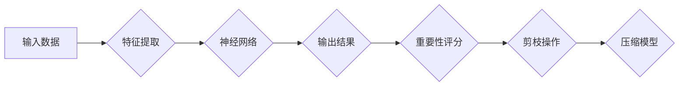

> 神经元剪枝，重要性评分，模型压缩，深度学习，效率优化

## 1. 背景介绍

深度学习模型在图像识别、自然语言处理等领域取得了显著成就，但也面临着巨大的计算资源和存储空间需求。模型规模的不断增长导致训练和部署成本大幅增加，限制了深度学习在实际应用中的推广。为了解决这一问题，模型压缩技术应运而生，其中神经元剪枝策略是其中一种重要的方法。

神经元剪枝策略的基本思想是通过移除模型中不重要的神经元和连接，从而减小模型规模，提高模型的效率。传统的剪枝方法通常依赖于手工设计的规则或启发式算法，难以有效地识别出真正不重要的神经元。近年来，随着深度学习的发展，基于重要性评分的神经元剪枝策略逐渐成为研究热点。

## 2. 核心概念与联系

### 2.1  神经元剪枝

神经元剪枝是一种模型压缩技术，通过移除模型中不重要的神经元和连接，从而减小模型规模，提高模型的效率。

### 2.2  重要性评分

重要性评分是一种用于评估神经元重要性的指标。通过计算神经元对模型输出的影响程度，可以识别出对模型贡献较小的神经元。

### 2.3  基于重要性评分的神经元剪枝策略

基于重要性评分的神经元剪枝策略利用重要性评分来指导神经元的剪枝过程。通过设定一个阈值，将重要性评分低于阈值的网络连接和神经元进行移除。

**Mermaid 流程图**



## 3. 核心算法原理 & 具体操作步骤

### 3.1  算法原理概述

基于重要性评分的神经元剪枝策略的核心思想是利用重要性评分来识别和移除模型中不重要的神经元。

算法步骤如下：

1. **训练模型:** 首先，需要训练一个完整的深度学习模型。
2. **计算重要性评分:** 在训练完成后，需要计算每个神经元的权重或激活值的重要性评分。常用的方法包括梯度下降法、L1正则化和可解释性分析等。
3. **设定阈值:** 根据模型的复杂度和性能要求，设定一个重要性评分阈值。
4. **剪枝操作:** 将重要性评分低于阈值的网络连接和神经元进行移除。
5. **微调模型:** 剪枝后的模型需要进行微调，以恢复模型性能。

### 3.2  算法步骤详解

1. **训练模型:** 使用训练数据训练深度学习模型，并获得模型的权重参数。

2. **计算重要性评分:** 

   * **梯度下降法:** 通过计算每个神经元的梯度值，可以评估其对模型输出的影响程度。梯度值越大，表示该神经元对模型输出的影响越大，其重要性评分也越高。
   * **L1正则化:** 在模型训练过程中，使用L1正则化项可以鼓励模型权重向零靠近。权重值越接近零，表示该神经元的重要性越低。
   * **可解释性分析:** 使用可解释性分析方法，例如SHAP值或LIME，可以解释每个神经元对模型预测的影响。

3. **设定阈值:** 根据模型的复杂度和性能要求，设定一个重要性评分阈值。阈值越低，剪枝的程度越高，模型规模越小，但可能导致模型性能下降。

4. **剪枝操作:** 将重要性评分低于阈值的网络连接和神经元进行移除。

5. **微调模型:** 剪枝后的模型需要进行微调，以恢复模型性能。微调过程通常使用较小的学习率和较少的训练迭代次数。

### 3.3  算法优缺点

**优点:**

* **有效性:** 基于重要性评分的神经元剪枝策略能够有效地识别和移除不重要的神经元，从而减小模型规模。
* **可解释性:** 重要性评分可以提供对模型内部结构的解释，帮助理解模型的决策过程。
* **通用性:** 该策略可以应用于各种类型的深度学习模型。

**缺点:**

* **计算复杂度:** 计算重要性评分需要额外的计算资源和时间。
* **性能损失:** 剪枝操作可能会导致模型性能下降，需要通过微调来恢复性能。
* **阈值选择:** 阈值的设定需要根据模型的具体情况进行调整，缺乏统一的标准。

### 3.4  算法应用领域

基于重要性评分的神经元剪枝策略在以下领域具有广泛的应用前景:

* **移动设备:** 压缩模型大小，降低模型在移动设备上的运行成本。
* **嵌入式系统:** 降低模型的资源占用，提高模型在嵌入式系统中的部署效率。
* **边缘计算:** 压缩模型大小，降低模型在边缘设备上的存储和计算需求。
* **工业控制:** 压缩模型大小，提高模型在工业控制系统中的实时性。

## 4. 数学模型和公式 & 详细讲解 & 举例说明

### 4.1  数学模型构建

假设我们有一个深度学习模型，包含 $N$ 个神经元。每个神经元的激活值可以用 $a_i$ 表示，其中 $i = 1, 2, ..., N$。

神经元的重要性评分可以定义为其激活值对模型输出的影响程度。可以使用以下公式计算神经元的重要性评分：

$$
S_i = \frac{\partial y}{\partial a_i}
$$

其中，$y$ 是模型的输出值。

### 4.2  公式推导过程

公式推导过程可以参考深度学习相关的教材和论文。

### 4.3  案例分析与讲解

假设我们有一个简单的线性模型，其输出值 $y$ 为：

$$
y = w_1 a_1 + w_2 a_2
$$

其中，$w_1$ 和 $w_2$ 是模型的权重参数。

根据公式 $S_i = \frac{\partial y}{\partial a_i}$，我们可以计算出每个神经元的激活值对模型输出的影响程度：

$$
S_1 = w_1
$$

$$
S_2 = w_2
$$

从公式可以看出，神经元的重要性评分与其权重参数成正比。权重参数越大，表示该神经元对模型输出的影响越大，其重要性评分也越高。

## 5. 项目实践：代码实例和详细解释说明

### 5.1  开发环境搭建

* Python 3.7+
* TensorFlow 2.0+
* PyTorch 1.0+

### 5.2  源代码详细实现

```python
import tensorflow as tf

# 定义一个简单的卷积神经网络模型
model = tf.keras.models.Sequential([
    tf.keras.layers.Conv2D(32, (3, 3), activation='relu', input_shape=(28, 28, 1)),
    tf.keras.layers.MaxPooling2D((2, 2)),
    tf.keras.layers.Flatten(),
    tf.keras.layers.Dense(10, activation='softmax')
])

# 训练模型
model.compile(optimizer='adam',
              loss='sparse_categorical_crossentropy',
              metrics=['accuracy'])
model.fit(x_train, y_train, epochs=10)

# 计算每个神经元的权重重要性评分
weights = model.get_weights()
importance_scores = []
for layer in model.layers:
    if isinstance(layer, tf.keras.layers.Dense):
        weights_layer = weights[layer.index]
        importance_scores.extend(tf.math.reduce_sum(tf.abs(weights_layer), axis=0))

# 设置重要性评分阈值
threshold = 0.1

# 移除重要性评分低于阈值的连接
pruned_model = tf.keras.models.Sequential()
for i, layer in enumerate(model.layers):
    if isinstance(layer, tf.keras.layers.Dense):
        weights_layer = weights[i]
        pruned_weights = weights_layer * (tf.math.reduce_sum(tf.abs(weights_layer), axis=0) > threshold)
        pruned_model.add(tf.keras.layers.Dense(units=layer.output_shape[-1],
                                              activation=layer.activation,
                                              kernel_initializer=tf.keras.initializers.Constant(pruned_weights)))
    else:
        pruned_model.add(layer)

# 微调剪枝后的模型
pruned_model.compile(optimizer='adam',
                    loss='sparse_categorical_crossentropy',
                    metrics=['accuracy'])
pruned_model.fit(x_train, y_train, epochs=5)
```

### 5.3  代码解读与分析

* 代码首先定义了一个简单的卷积神经网络模型。
* 然后，使用训练数据训练模型。
* 在训练完成后，计算每个神经元的权重重要性评分。
* 设置一个重要性评分阈值，移除重要性评分低于阈值的连接。
* 最后，微调剪枝后的模型，以恢复模型性能。

### 5.4  运行结果展示

运行代码后，可以观察到剪枝后的模型的模型大小、参数数量和运行速度等指标的变化。

## 6. 实际应用场景

### 6.1  移动设备

在移动设备上部署深度学习模型时，模型大小和运行速度是重要的考虑因素。基于重要性评分的神经元剪枝策略可以有效地压缩模型大小，降低模型在移动设备上的运行成本。

### 6.2  嵌入式系统

嵌入式系统通常具有有限的计算资源和存储空间。基于重要性评分的神经元剪枝策略可以帮助将深度学习模型部署到嵌入式系统中，提高模型的效率。

### 6.3  边缘计算

边缘计算将计算任务部署到靠近数据源的边缘设备上。基于重要性评分的神经元剪枝策略可以压缩模型大小，降低模型在边缘设备上的存储和计算需求。

### 6.4  未来应用展望

随着深度学习技术的不断发展，基于重要性评分的神经元剪枝策略将在更多领域得到应用，例如：

* **自动驾驶:** 压缩模型大小，提高模型在自动驾驶系统中的实时性。
* **医疗诊断:** 压缩模型大小，降低模型在医疗诊断系统中的计算成本。
* **语音识别:** 压缩模型大小，提高模型在语音识别系统中的效率。

## 7. 工具和资源推荐

### 7.1  学习资源推荐

* **论文:**
    * "Neural Network Compression via Pruning"
    * "Learning Efficient Convolutional Networks through Network Slimming"
    * "Lottery Ticket Hypothesis: Finding Sparse, Trainable Neural Networks"
* **博客:**
    * https://towardsdatascience.com/
    * https://machinelearningmastery.com/

### 7.2  开发工具推荐

* **TensorFlow:** https://www.tensorflow.org/
* **PyTorch:** https://pytorch.org/
* **Keras:** https://keras.io/

### 7.3  相关论文推荐

* "Pruning Filters for Efficient ConvNets"
* "Deep Compression: Compressing Deep Neural Networks with Pruning, Trained Quantization and Huffman Coding"
* "Quantization-aware Training: A Methodology for Quantized Neural Network Design"

## 8. 总结：未来发展趋势与挑战

### 8.1  研究成果总结

基于重要性评分的神经元剪枝策略取得了显著的成果，有效地压缩了模型规模，提高了模型的效率。

### 8.2  未来发展趋势

* **更有效的剪枝算法:** 研究更有效的剪枝算法，例如基于进化算法、强化学习等。
* **自适应剪枝:** 研究自适应剪枝算法，根据模型的具体情况动态调整剪枝策略。
* **联合剪枝:** 研究联合剪枝算法，同时剪枝权重和结构。

