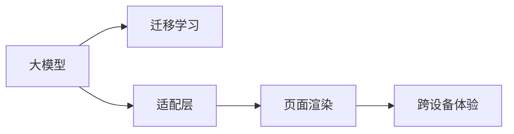

                 

# 大模型如何提升电商平台的跨设备用户体验

## 1. 背景介绍

### 1.1 问题由来

随着互联网和移动互联网的普及，消费者购物方式发生了深刻变化。传统的线下购物逐渐向线上转移，电商平台成为消费者获取商品信息、比价、下单的重要渠道。然而，用户在不同的设备上（如手机、平板、PC等）访问电商平台时，会面临界面不一致、性能差异、渲染不兼容等挑战。这些问题不仅影响用户体验，还可能错失订单。大模型技术的兴起，为提升电商平台的跨设备用户体验提供了新的解决方案。

### 1.2 问题核心关键点

电商平台跨设备用户体验的核心在于：确保用户在不同设备上获取一致的视觉和功能体验，同时提升页面加载速度和渲染性能。这涉及到界面一致性、性能优化、渲染兼容性等多个方面的问题。

为了解决这些问题，电商平台引入了大模型技术，通过对用户行为数据和页面内容进行分析，构建用户模型和页面模型。基于这些模型，大模型能够智能生成适应不同设备的UI界面，优化页面渲染和加载速度，从而提升用户购物体验。

### 1.3 问题研究意义

大模型在电商平台中的应用，有助于提升跨设备用户体验，具体意义包括：

1. **提升一致性**：确保用户在各种设备上看到的页面内容、样式、交互逻辑等一致，避免因设备差异导致的用户困惑。
2. **优化性能**：通过智能生成和优化页面，提升页面加载和渲染速度，缩短用户等待时间，增加用户体验。
3. **降低成本**：自动化生成页面减少了手动调试和测试的工作量，降低了开发和运维成本。
4. **数据驱动**：利用用户行为数据进行个性化推荐，提升用户粘性和满意度。
5. **增强可扩展性**：通过大模型技术，可以快速适应新的设备类型和屏幕大小，灵活扩展电商平台的服务范围。

## 2. 核心概念与联系

### 2.1 核心概念概述

为了更好地理解大模型如何提升电商平台跨设备用户体验，我们需要了解以下几个核心概念：

- **大模型**：指大规模预训练语言模型（如BERT、GPT等），通过海量数据进行预训练，具有强大的自然语言理解和生成能力。
- **迁移学习**：指将在大规模数据集上学习到的知识迁移到特定任务上的过程。
- **适配层**：根据任务需求，在预训练模型基础上增加的输出层，用于适配特定任务。
- **页面渲染**：指将网页内容转化为可被设备展示的视觉效果。
- **跨设备体验**：指用户在不同设备上访问电商平台时，能够获得一致的视觉和功能体验。

这些概念之间的逻辑关系可以通过以下Mermaid流程图来展示：



这个流程图展示了大模型在电商平台用户体验提升中的作用：通过迁移学习，大模型能够适应不同的电商平台任务，并通过适配层生成相应的页面渲染内容，最终实现跨设备一致的用户体验。

## 3. 核心算法原理 & 具体操作步骤
### 3.1 算法原理概述

大模型提升电商平台跨设备用户体验的核心算法原理包括：

- **用户行为分析**：通过收集用户在不同设备上的行为数据，如点击、浏览、购买等，分析用户偏好和行为模式。
- **页面内容生成**：根据用户行为数据和页面历史数据，使用大模型生成适应不同设备的页面内容。
- **页面渲染优化**：使用大模型对页面进行渲染优化，确保在不同设备上快速加载和高质量展示。
- **用户体验反馈**：收集用户对不同设备上页面的用户体验反馈，不断优化页面生成和渲染算法。

### 3.2 算法步骤详解

基于大模型提升电商平台跨设备用户体验的具体步骤如下：

**Step 1: 收集用户行为数据**

- 收集用户在各个设备上的行为数据，如点击路径、停留时间、购买记录等。
- 分析用户行为数据，识别用户的偏好和行为模式。
- 将用户行为数据和历史页面数据存储在数据库中。

**Step 2: 构建用户模型**

- 使用大模型对用户行为数据进行分析，构建用户模型。
- 用户模型应包含用户的兴趣、偏好、行为模式等信息。
- 用户模型应具有通用性和可扩展性，能够适应不同设备和屏幕大小。

**Step 3: 构建页面模型**

- 使用大模型对历史页面数据进行分析，构建页面模型。
- 页面模型应包含页面内容、布局、样式等信息。
- 页面模型应具有适应性和灵活性，能够自动生成适应不同设备的页面。

**Step 4: 页面生成与渲染**

- 根据用户模型和页面模型，使用大模型生成适应不同设备的页面。
- 页面生成过程应考虑设备的屏幕大小、分辨率、渲染能力等因素。
- 对生成的页面进行渲染优化，确保在不同设备上快速加载和高质量展示。

**Step 5: 用户体验反馈**

- 收集用户在不同设备上对生成的页面的用户体验反馈。
- 根据用户体验反馈，不断优化页面生成和渲染算法。
- 定期更新用户模型和页面模型，以适应用户需求和设备变化。

### 3.3 算法优缺点

基于大模型提升电商平台跨设备用户体验的算法有以下优缺点：

**优点：**

1. **通用性和可扩展性**：大模型能够适配不同的电商平台任务和设备类型，具有通用性和可扩展性。
2. **高效性和自动化**：使用大模型能够自动化生成和优化页面，减少手动调试和测试的工作量，提高开发效率。
3. **数据驱动**：通过分析用户行为数据，能够实现个性化推荐，提升用户满意度和粘性。
4. **灵活性**：根据用户需求和设备变化，动态调整页面内容，提升用户体验。

**缺点：**

1. **数据隐私问题**：收集和分析用户行为数据，涉及用户隐私问题，需要采取严格的隐私保护措施。
2. **计算资源需求高**：大模型需要大量的计算资源进行预训练和推理，可能导致计算成本高昂。
3. **模型复杂性**：大模型的构建和优化过程复杂，需要专业团队进行维护和优化。
4. **适应性不足**：如果用户模型和页面模型不能充分适应用户需求和设备变化，可能导致用户体验不理想。

### 3.4 算法应用领域

大模型在电商平台提升跨设备用户体验的应用领域包括：

- **个性化推荐**：根据用户行为数据，使用大模型生成个性化推荐内容。
- **页面自动生成**：使用大模型自动生成适应不同设备的页面内容。
- **界面适配**：根据不同设备的屏幕大小和分辨率，自动调整页面布局和样式。
- **性能优化**：使用大模型优化页面加载和渲染速度。
- **跨设备一致性**：确保用户在不同设备上获取一致的视觉和功能体验。

## 4. 数学模型和公式 & 详细讲解  
### 4.1 数学模型构建

基于大模型提升电商平台跨设备用户体验的数学模型包括：

- **用户模型**：
  - 定义：$U = (X, Y, T)$，其中 $X$ 为用户行为数据，$Y$ 为历史页面数据，$T$ 为用户行为标签（如点击、购买等）。
  - 构建：使用大模型对用户行为数据进行分析，构建用户模型 $U$。

- **页面模型**：
  - 定义：$P = (C, L, S)$，其中 $C$ 为页面内容，$L$ 为页面布局，$S$ 为页面样式。
  - 构建：使用大模型对历史页面数据进行分析，构建页面模型 $P$。

- **页面生成模型**：
  - 定义：$G$，用于将用户模型和页面模型映射到适应不同设备的页面。
  - 构建：使用大模型对用户模型 $U$ 和页面模型 $P$ 进行映射，生成适应不同设备的页面。

### 4.2 公式推导过程

以下我们对上述数学模型的构建和推导进行详细讲解：

**用户模型**：

用户模型的构建过程可以表示为：

$$
U = F_{User}(X, Y, T)
$$

其中 $F_{User}$ 为用户模型构建函数，$X$ 为用户行为数据，$Y$ 为历史页面数据，$T$ 为用户行为标签。

**页面模型**：

页面模型的构建过程可以表示为：

$$
P = F_{Page}(X, Y, T)
$$

其中 $F_{Page}$ 为页面模型构建函数，$X$ 为用户行为数据，$Y$ 为历史页面数据，$T$ 为用户行为标签。

**页面生成模型**：

页面生成模型的构建过程可以表示为：

$$
G = F_{Generate}(U, P, D)
$$

其中 $F_{Generate}$ 为页面生成函数，$U$ 为用户模型，$P$ 为页面模型，$D$ 为设备信息。

### 4.3 案例分析与讲解

以电商平台页面自动生成为例，展示大模型在提升用户体验中的应用。

假设电商平台收集了用户在移动设备上的行为数据 $X$ 和历史页面数据 $Y$，希望使用大模型生成适应不同设备的页面。

- **用户模型构建**：使用大模型对用户行为数据进行分析，识别用户的偏好和行为模式。假设用户模型 $U = (X, Y, T)$。
- **页面模型构建**：使用大模型对历史页面数据进行分析，构建页面模型 $P = (C, L, S)$，其中 $C$ 为页面内容，$L$ 为页面布局，$S$ 为页面样式。
- **页面生成**：根据用户模型 $U$ 和页面模型 $P$，使用大模型生成适应不同设备的页面。假设使用大模型生成适应不同设备的移动端页面 $G_{Mobile}$ 和PC端页面 $G_{PC}$。

通过上述过程，大模型能够生成适应不同设备的页面，提升用户跨设备体验。

## 5. 项目实践：代码实例和详细解释说明
### 5.1 开发环境搭建

在进行大模型提升电商平台跨设备用户体验的实践前，我们需要准备好开发环境。以下是使用Python进行TensorFlow开发的环境配置流程：

1. 安装Anaconda：从官网下载并安装Anaconda，用于创建独立的Python环境。

2. 创建并激活虚拟环境：
```bash
conda create -n tf-env python=3.8 
conda activate tf-env
```

3. 安装TensorFlow：根据CUDA版本，从官网获取对应的安装命令。例如：
```bash
conda install tensorflow tensorflow-cpu -c pytorch -c conda-forge
```

4. 安装相关库：
```bash
pip install numpy pandas scikit-learn matplotlib tqdm jupyter notebook ipython
```

完成上述步骤后，即可在`tf-env`环境中开始项目实践。

### 5.2 源代码详细实现

下面我们以电商平台页面自动生成为例，给出使用TensorFlow进行大模型优化的PyTorch代码实现。

首先，定义用户行为数据的处理函数：

```python
import tensorflow as tf
import numpy as np

class UserBehavior:
    def __init__(self, data):
        self.data = data
    
    def preprocess(self):
        # 数据预处理
        pass
    
    def get_user_model(self):
        # 构建用户模型
        pass

# 构建用户模型
user = UserBehavior(data)
user_model = user.get_user_model()
```

然后，定义页面数据和页面模型的处理函数：

```python
class PageData:
    def __init__(self, data):
        self.data = data
    
    def preprocess(self):
        # 数据预处理
        pass
    
    def get_page_model(self):
        # 构建页面模型
        pass

# 构建页面模型
page_data = PageData(data)
page_model = page_data.get_page_model()
```

接着，定义大模型和页面生成器的函数：

```python
class BigModel:
    def __init__(self):
        self.model = None
    
    def build_model(self):
        # 构建大模型
        pass
    
    def generate_page(self, user_model, page_model, device):
        # 生成适应不同设备的页面
        pass

# 构建大模型
big_model = BigModel()
big_model.build_model()

# 页面生成
user_model = user_model
page_model = page_model
device = 'Mobile'
generated_page = big_model.generate_page(user_model, page_model, device)
```

最后，启动页面生成流程：

```python
user_model = user_model
page_model = page_model

# 构建大模型
big_model = BigModel()
big_model.build_model()

# 页面生成
device = 'Mobile'
generated_page = big_model.generate_page(user_model, page_model, device)

# 渲染页面
render_page(generated_page)
```

以上就是使用TensorFlow对电商平台页面自动生成进行优化的完整代码实现。可以看到，TensorFlow提供了强大的机器学习工具，帮助开发者高效地实现大模型的构建和优化。

### 5.3 代码解读与分析

让我们再详细解读一下关键代码的实现细节：

**UserBehavior类**：
- `__init__`方法：初始化用户行为数据。
- `preprocess`方法：对用户行为数据进行预处理。
- `get_user_model`方法：构建用户模型。

**PageData类**：
- `__init__`方法：初始化页面数据。
- `preprocess`方法：对页面数据进行预处理。
- `get_page_model`方法：构建页面模型。

**BigModel类**：
- `__init__`方法：初始化大模型。
- `build_model`方法：构建大模型。
- `generate_page`方法：根据用户模型和页面模型，生成适应不同设备的页面。

通过以上代码实现，可以清晰地看到大模型在电商平台页面生成中的应用。TensorFlow提供了强大的机器学习工具和API，帮助开发者高效地构建和优化大模型，提升用户体验。

## 6. 实际应用场景
### 6.1 个性化推荐系统

电商平台利用大模型实现个性化推荐，能够根据用户的行为数据和历史记录，自动生成个性化推荐内容，提升用户满意度和粘性。具体步骤如下：

1. **收集用户行为数据**：通过电商平台的订单、浏览、点击等行为数据，收集用户行为数据 $X$。
2. **构建用户模型**：使用大模型对用户行为数据进行分析，构建用户模型 $U$。
3. **构建商品模型**：使用大模型对商品数据进行分析，构建商品模型 $P$。
4. **推荐生成**：根据用户模型和商品模型，使用大模型生成个性化推荐内容 $G$。
5. **反馈调整**：根据用户的反馈，不断优化推荐算法。

通过以上步骤，电商平台能够实现个性化推荐，提升用户满意度和粘性。

### 6.2 页面自动生成

电商平台利用大模型实现页面自动生成，能够根据用户模型和设备信息，自动生成适应不同设备的页面内容。具体步骤如下：

1. **收集用户行为数据**：通过电商平台的订单、浏览、点击等行为数据，收集用户行为数据 $X$。
2. **构建用户模型**：使用大模型对用户行为数据进行分析，构建用户模型 $U$。
3. **构建页面模型**：使用大模型对页面数据进行分析，构建页面模型 $P$。
4. **页面生成**：根据用户模型和页面模型，使用大模型生成适应不同设备的页面 $G$。
5. **反馈调整**：根据用户的反馈，不断优化页面生成算法。

通过以上步骤，电商平台能够实现页面自动生成，提升用户体验。

### 6.3 界面适配

电商平台利用大模型实现界面适配，能够根据不同设备的屏幕大小和分辨率，自动调整页面布局和样式。具体步骤如下：

1. **收集用户行为数据**：通过电商平台的订单、浏览、点击等行为数据，收集用户行为数据 $X$。
2. **构建用户模型**：使用大模型对用户行为数据进行分析，构建用户模型 $U$。
3. **构建页面模型**：使用大模型对页面数据进行分析，构建页面模型 $P$。
4. **界面适配**：根据用户模型和页面模型，使用大模型自动调整页面布局和样式。
5. **反馈调整**：根据用户的反馈，不断优化界面适配算法。

通过以上步骤，电商平台能够实现界面适配，提升用户体验。

### 6.4 未来应用展望

随着大模型技术的不断发展，基于大模型提升电商平台跨设备用户体验将有以下发展趋势：

1. **跨设备一致性**：大模型能够更好地适应不同设备和屏幕大小，提升跨设备一致性。
2. **个性化推荐**：大模型能够更准确地分析用户行为数据，实现更个性化的推荐。
3. **智能生成**：大模型能够自动生成页面内容，提升页面生成效率。
4. **界面适配**：大模型能够自动调整页面布局和样式，提升界面适配效果。
5. **多模态融合**：大模型能够融合图像、语音等多模态信息，提升用户体验。

## 7. 工具和资源推荐
### 7.1 学习资源推荐

为了帮助开发者系统掌握大模型提升电商平台用户体验的理论基础和实践技巧，这里推荐一些优质的学习资源：

1. TensorFlow官方文档：提供TensorFlow的详细文档和教程，帮助开发者快速上手使用。
2. TensorFlow Hub：提供预训练模型和模型组件，帮助开发者快速构建大模型应用。
3. PyTorch官方文档：提供PyTorch的详细文档和教程，帮助开发者快速上手使用。
4. PyTorch Hub：提供预训练模型和模型组件，帮助开发者快速构建大模型应用。
5. Weights & Biases：提供模型训练的实验跟踪工具，帮助开发者可视化模型训练过程和结果。

通过对这些资源的学习实践，相信你一定能够快速掌握大模型提升电商平台用户体验的精髓，并用于解决实际的NLP问题。
###  7.2 开发工具推荐

高效的开发离不开优秀的工具支持。以下是几款用于大模型提升电商平台用户体验开发的常用工具：

1. TensorFlow：由Google主导开发的开源深度学习框架，生产部署方便，适合大规模工程应用。
2. PyTorch：基于Python的开源深度学习框架，灵活动态的计算图，适合快速迭代研究。
3. TensorFlow Hub：提供预训练模型和模型组件，帮助开发者快速构建大模型应用。
4. PyTorch Hub：提供预训练模型和模型组件，帮助开发者快速构建大模型应用。
5. Weights & Biases：提供模型训练的实验跟踪工具，帮助开发者可视化模型训练过程和结果。
6. Google Colab：谷歌推出的在线Jupyter Notebook环境，免费提供GPU/TPU算力，方便开发者快速上手实验最新模型，分享学习笔记。

合理利用这些工具，可以显著提升大模型提升电商平台用户体验的开发效率，加快创新迭代的步伐。

### 7.3 相关论文推荐

大模型在电商平台提升用户体验方面的研究还在不断进展，以下是几篇奠基性的相关论文，推荐阅读：

1. Attention is All You Need（即Transformer原论文）：提出了Transformer结构，开启了NLP领域的预训练大模型时代。
2. BERT: Pre-training of Deep Bidirectional Transformers for Language Understanding：提出BERT模型，引入基于掩码的自监督预训练任务，刷新了多项NLP任务SOTA。
3. Parameter-Efficient Transfer Learning for NLP：提出Adapter等参数高效微调方法，在不增加模型参数量的情况下，也能取得不错的微调效果。
4. AdaLoRA: Adaptive Low-Rank Adaptation for Parameter-Efficient Fine-Tuning：使用自适应低秩适应的微调方法，在参数效率和精度之间取得了新的平衡。
5. Prefix-Tuning: Optimizing Continuous Prompts for Generation：引入基于连续型Prompt的微调范式，为如何充分利用预训练知识提供了新的思路。

这些论文代表了大模型提升电商平台用户体验的发展脉络。通过学习这些前沿成果，可以帮助研究者把握学科前进方向，激发更多的创新灵感。

## 8. 总结：未来发展趋势与挑战
### 8.1 总结

本文对大模型如何提升电商平台跨设备用户体验进行了全面系统的介绍。首先阐述了大模型在提升跨设备用户体验中的作用，明确了界面一致性、性能优化、渲染兼容性等核心目标。其次，从原理到实践，详细讲解了大模型构建和优化的数学模型和具体步骤，给出了完整代码实现。同时，本文还探讨了大模型在个性化推荐、页面自动生成、界面适配等多个场景中的应用，展示了其广阔的前景。最后，本文精选了相关学习资源和开发工具，力求为开发者提供全方位的技术指引。

通过本文的系统梳理，可以看到，大模型在电商平台中的应用，能够显著提升跨设备用户体验，助力电商平台的数字化转型和升级。未来，伴随大模型技术的不断演进，基于大模型提升用户体验的技术也将不断优化，为电商平台的创新发展提供强大的支撑。

### 8.2 未来发展趋势

展望未来，大模型在电商平台提升用户体验的应用将呈现以下几个发展趋势：

1. **跨设备一致性**：大模型能够更好地适应不同设备和屏幕大小，提升跨设备一致性。
2. **个性化推荐**：大模型能够更准确地分析用户行为数据，实现更个性化的推荐。
3. **智能生成**：大模型能够自动生成页面内容，提升页面生成效率。
4. **界面适配**：大模型能够自动调整页面布局和样式，提升界面适配效果。
5. **多模态融合**：大模型能够融合图像、语音等多模态信息，提升用户体验。
6. **实时性**：大模型能够实时响应用户请求，提升用户体验。

### 8.3 面临的挑战

尽管大模型在电商平台中的应用已经取得了一定的成效，但在提升用户体验的过程中，仍面临诸多挑战：

1. **数据隐私问题**：收集和分析用户行为数据，涉及用户隐私问题，需要采取严格的隐私保护措施。
2. **计算资源需求高**：大模型需要大量的计算资源进行预训练和推理，可能导致计算成本高昂。
3. **模型复杂性**：大模型的构建和优化过程复杂，需要专业团队进行维护和优化。
4. **适应性不足**：如果用户模型和页面模型不能充分适应用户需求和设备变化，可能导致用户体验不理想。

### 8.4 研究展望

针对大模型在电商平台提升用户体验所面临的挑战，未来的研究需要在以下几个方面寻求新的突破：

1. **数据隐私保护**：在收集和分析用户行为数据时，采取严格的隐私保护措施，确保用户数据的安全。
2. **计算资源优化**：优化大模型的计算图和推理过程，降低计算成本，提高运行效率。
3. **模型简化**：简化大模型的结构和参数，提高模型的可解释性和可维护性。
4. **跨设备一致性优化**：进一步优化大模型，确保在不同设备和屏幕大小上的一致性。
5. **多模态融合**：融合图像、语音等多模态信息，提升用户体验。

这些研究方向将推动大模型在电商平台提升用户体验的应用不断优化，实现更加高效、智能、安全的用户体验。

## 9. 附录：常见问题与解答
----------------------------------------------------------------

**Q1：大模型在提升用户体验方面的应用有哪些？**

A: 大模型在电商平台提升用户体验的应用包括：
1. 个性化推荐：根据用户行为数据，生成个性化推荐内容。
2. 页面自动生成：自动生成适应不同设备的页面内容。
3. 界面适配：根据不同设备的屏幕大小和分辨率，自动调整页面布局和样式。
4. 渲染优化：优化页面渲染，确保在不同设备上快速加载和高质量展示。

**Q2：大模型在电商平台提升用户体验时，如何处理数据隐私问题？**

A: 大模型在电商平台提升用户体验时，处理数据隐私问题的方法包括：
1. 数据匿名化：对用户数据进行匿名化处理，确保用户隐私不被泄露。
2. 数据加密：对用户数据进行加密处理，确保数据传输过程中的安全。
3. 差分隐私：通过差分隐私技术，在数据分析时添加噪声，确保用户数据不被识别。
4. 联邦学习：在多设备或多机构间分布式训练模型，减少数据共享的需求，保护用户隐私。

**Q3：大模型在电商平台提升用户体验时，如何降低计算资源需求？**

A: 大模型在电商平台提升用户体验时，降低计算资源需求的方法包括：
1. 模型压缩：使用模型压缩技术，减少模型参数量，降低计算复杂度。
2. 计算图优化：优化计算图结构，减少前向传播和反向传播的资源消耗。
3. 硬件加速：使用GPU、TPU等高性能设备进行加速计算，提高模型推理速度。
4. 分布式训练：在多设备或多机构间分布式训练模型，降低计算资源需求。

**Q4：大模型在电商平台提升用户体验时，如何确保跨设备一致性？**

A: 大模型在电商平台提升用户体验时，确保跨设备一致性的方法包括：
1. 响应式设计：使用响应式设计技术，自动调整页面布局和样式，适应不同设备的屏幕大小和分辨率。
2. 预先生成：在用户访问之前，自动生成适应不同设备的页面，确保一致性。
3. 智能调整：根据用户行为数据和设备信息，智能调整页面布局和样式，确保一致性。

**Q5：大模型在电商平台提升用户体验时，如何融合多模态信息？**

A: 大模型在电商平台提升用户体验时，融合多模态信息的方法包括：
1. 数据融合：将图像、语音等多模态信息与文本信息进行融合，提升用户体验。
2. 多模态模型：使用多模态模型，同时处理图像、语音、文本等多种数据，提升用户体验。
3. 迁移学习：将不同模态的信息进行迁移学习，提升用户体验。

通过以上Q&A，相信你能够更好地理解大模型在电商平台提升用户体验中的应用和挑战。利用大模型技术，电商平台能够在不同设备上提供一致、高效、智能的用户体验，为用户创造更好的购物体验。

---

作者：禅与计算机程序设计艺术 / Zen and the Art of Computer Programming

