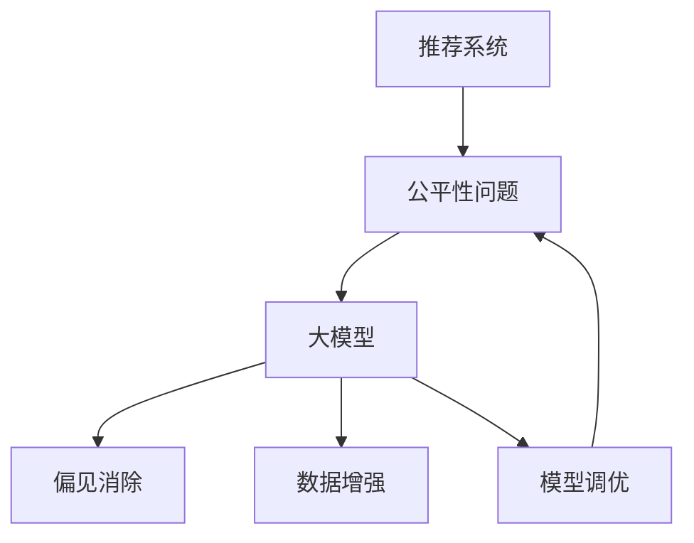

                 

# 大模型对推荐系统公平性的影响研究

> 关键词：推荐系统, 公平性, 大模型, 推荐算法, 用户画像, 偏见消除, 数据增强, 模型调优

## 1. 背景介绍

推荐系统作为互联网应用中的重要组成部分，旨在通过算法为用户推荐感兴趣的商品、内容或服务，提升用户体验，同时帮助商家优化资源配置。然而，推荐系统的公平性问题近年来逐渐引起广泛关注。随着大模型的引入，推荐系统的公平性更是受到了前所未有的挑战。

大模型通过大量无标签数据进行预训练，学习到复杂的数据分布和模式。尽管其在推荐准确性方面表现出色，但若模型训练数据中存在偏差，则可能无意间放大了这种偏见，导致推荐结果不公平，从而影响用户体验，引发伦理争议。特别是在电商、金融、教育等敏感领域，用户推荐系统的公平性问题显得尤为重要。

本文将从大模型的角度出发，深入探讨其在推荐系统中公平性问题的影响机制，并提出解决方案和改进措施，以期构建更加公平、可信的推荐系统。

## 2. 核心概念与联系

### 2.1 核心概念概述

为更好地理解大模型对推荐系统公平性的影响，本节将介绍几个关键概念及其联系：

- **推荐系统**：利用算法为用户推荐感兴趣的物品或服务。主要算法包括基于协同过滤、内容过滤、混合推荐等方法。
- **公平性**：指推荐系统不因用户的特定属性（如性别、年龄、种族等）而偏向或歧视某些群体。公平性包含不同维度的公平指标，如性别公平、种族公平等。
- **大模型**：指通过大规模无标签数据进行预训练，学习到复杂数据分布的语言模型。常见的大模型包括BERT、GPT等。
- **偏见消除**：指在模型训练或评估阶段，识别和修正模型中的偏见，使其在不同群体间的表现更为均衡。
- **数据增强**：指通过合成或改写数据等方式，增加训练数据的多样性，从而减少模型训练中的偏差。
- **模型调优**：指在已有模型的基础上，通过微调等方式优化模型参数，提高模型的性能和公平性。

这些核心概念之间的逻辑关系可以通过以下Mermaid流程图来展示：



这个流程图展示了大模型、偏见消除、数据增强和模型调优与推荐系统公平性问题之间的联系：

1. 大模型通过预训练学习复杂的语义和模式，但在训练数据存在偏差时，可能放大了这种偏见，影响推荐系统的公平性。
2. 偏见消除和数据增强是针对模型训练数据处理的技术手段，通过减少或修正偏差，来提升推荐系统的公平性。
3. 模型调优则是针对已有模型进行调整优化，通过微调等方法，进一步提升模型的性能和公平性。

## 3. 核心算法原理 & 具体操作步骤

### 3.1 算法原理概述

大模型在推荐系统中的应用，本质上是通过其强大的语义理解和生成能力，提升推荐准确性和多样性。但由于大模型可能学习到训练数据中的偏见，从而影响推荐结果的公平性。因此，需要设计相应的算法和策略，以减小这种偏见的影响。

基于大模型的推荐系统公平性优化方法主要包括：

- **偏见检测与消除**：通过分析训练数据和模型输出，识别偏见，并采取措施减小或消除偏见。
- **数据增强**：通过增加训练数据的多样性，减少模型学习到的偏差。
- **模型调优**：通过微调等方法，优化模型参数，提升模型在不同群体间的表现均衡性。

这些方法相互结合，可以显著提升推荐系统的公平性，避免偏见影响。

### 3.2 算法步骤详解

基于大模型的推荐系统公平性优化过程一般包括以下几个关键步骤：

**Step 1: 数据准备与分析**

- 收集训练数据和推荐数据，并进行预处理和标注。分析数据中的性别、年龄、种族等敏感特征。
- 使用统计工具（如描述性统计、卡方检验、ANOVA等）检测数据中的偏见，评估偏见对推荐结果的影响。

**Step 2: 偏见检测与消除**

- 使用偏见检测算法（如Fairness Indicators、AIF360等）识别训练数据中的偏见。
- 针对识别出的偏见，采取相应的处理措施，如数据重新采样、特征调整等。
- 使用偏见消除算法（如Adversarial Debiasing、De-biasing Pre-trained Models等），优化模型输出，减小偏见影响。

**Step 3: 数据增强**

- 通过数据合成、数据改写等技术，增加训练数据的多样性。
- 在数据增强过程中，确保数据保持真实性，避免过度合成造成过拟合。
- 引入对抗样本，增加模型鲁棒性，减少偏见影响。

**Step 4: 模型调优**

- 选择合适的优化算法及其参数，如Adam、SGD等，设置学习率、批大小、迭代轮数等。
- 应用正则化技术，如L2正则、Dropout、Early Stopping等，防止模型过度适应小规模训练集。
- 设计合适的任务适配层，优化模型输出，提高推荐公平性。
- 定期在验证集上评估模型性能，根据性能指标决定是否触发Early Stopping。
- 重复上述步骤直至满足预设的迭代轮数或Early Stopping条件。

**Step 5: 测试与部署**

- 在测试集上评估优化后的模型性能，对比优化前后的公平性指标。
- 使用优化后的模型对新样本进行推荐，集成到实际的应用系统中。
- 持续收集新的数据，定期重新优化模型，以适应数据分布的变化。

以上是基于大模型的推荐系统公平性优化的完整流程。在实际应用中，还需要针对具体任务的特点，对优化过程的各个环节进行优化设计，如改进训练目标函数，引入更多的正则化技术，搜索最优的超参数组合等，以进一步提升模型的公平性。

### 3.3 算法优缺点

基于大模型的推荐系统公平性优化方法具有以下优点：

- 高准确性：大模型能够捕捉复杂的数据分布和模式，提高推荐准确性。
- 多样化：大模型具有强大的生成能力，可以生成更多样的推荐结果。
- 鲁棒性：大模型对新数据具有较好的泛化能力，减少过拟合风险。

同时，这些方法也存在一定的局限性：

- 数据依赖：偏见检测与消除、数据增强等方法依赖于高质量的标注数据，获取这些数据的成本较高。
- 计算复杂：模型调优涉及大量的参数更新和优化，计算资源消耗较大。
- 模型复杂：大模型结构复杂，难以解释其内部工作机制和决策逻辑。
- 公平性度量：公平性指标的多样性和复杂性，增加了公平性优化的难度。

尽管存在这些局限性，但就目前而言，基于大模型的推荐系统公平性优化方法仍是大模型应用中的重要范式。未来相关研究的重点在于如何进一步降低偏见检测与消除对标注数据的依赖，提高模型的少样本学习和跨领域迁移能力，同时兼顾可解释性和伦理安全性等因素。

### 3.4 算法应用领域

基于大模型的推荐系统公平性优化方法，在多个领域得到广泛应用，例如：

- 电子商务：针对用户的性别、年龄、地域等特征，设计公平的推荐策略，避免性别、年龄歧视。
- 金融服务：在贷款、保险等金融场景中，设计公平的信用评估和风险控制算法，避免种族、性别歧视。
- 教育领域：设计公平的在线学习推荐系统，避免对不同群体的知识推送不均。
- 医疗健康：设计公平的病历推荐系统，避免对患者的病情诊断和治疗方案推荐偏见。

除了上述这些经典应用外，大模型公平性优化方法也被创新性地应用到更多场景中，如社交媒体推荐、旅游出行推荐、房地产推荐等，为推荐系统公平性提供新的思路和解决方案。随着大模型和公平性优化方法的不断进步，相信推荐系统必将在更广阔的应用领域大放异彩，为用户推荐更加公平、合理的服务。

## 4. 数学模型和公式 & 详细讲解 & 举例说明

### 4.1 数学模型构建

本节将使用数学语言对基于大模型的推荐系统公平性优化方法进行更加严格的刻画。

记推荐系统模型为 $M_{\theta}:\mathcal{X} \rightarrow \mathcal{Y}$，其中 $\mathcal{X}$ 为用户特征向量，$\mathcal{Y}$ 为物品推荐集合，$\theta \in \mathbb{R}^d$ 为模型参数。假设推荐系统训练数据集为 $D=\{(x_i,y_i)\}_{i=1}^N, x_i \in \mathcal{X}, y_i \in \mathcal{Y}$。

定义推荐系统模型在数据样本 $(x,y)$ 上的损失函数为 $\ell(M_{\theta}(x),y)$，则在数据集 $D$ 上的经验风险为：

$$
\mathcal{L}(\theta) = \frac{1}{N} \sum_{i=1}^N \ell(M_{\theta}(x_i),y_i)
$$

其中 $\ell$ 为推荐系统的损失函数，可以是交叉熵损失、均方误差损失等。

推荐系统公平性优化目标是最小化经验风险，即找到最优参数：

$$
\theta^* = \mathop{\arg\min}_{\theta} \mathcal{L}(\theta)
$$

在实践中，我们通常使用基于梯度的优化算法（如SGD、Adam等）来近似求解上述最优化问题。设 $\eta$ 为学习率，$\lambda$ 为正则化系数，则参数的更新公式为：

$$
\theta \leftarrow \theta - \eta \nabla_{\theta}\mathcal{L}(\theta) - \eta\lambda\theta
$$

其中 $\nabla_{\theta}\mathcal{L}(\theta)$ 为损失函数对参数 $\theta$ 的梯度，可通过反向传播算法高效计算。

### 4.2 公式推导过程

以下我们以推荐系统的性别公平性优化为例，推导交叉熵损失函数及其梯度的计算公式。

假设推荐系统模型 $M_{\theta}$ 在输入 $x$ 上的推荐结果为 $\hat{y}=M_{\theta}(x) \in \mathcal{Y}$，表示模型预测用户可能感兴趣的商品。真实标签 $y \in \{0,1\}$，其中 $y=1$ 表示用户对商品感兴趣，$y=0$ 表示用户对商品不感兴趣。定义推荐系统的性别公平性损失函数为：

$$
\ell(M_{\theta}(x),y) = -[y\log \hat{y} + (1-y)\log (1-\hat{y})]
$$

将其代入经验风险公式，得：

$$
\mathcal{L}(\theta) = -\frac{1}{N}\sum_{i=1}^N [y_i\log M_{\theta}(x_i)+(1-y_i)\log(1-M_{\theta}(x_i))]
$$

根据链式法则，损失函数对参数 $\theta_k$ 的梯度为：

$$
\frac{\partial \mathcal{L}(\theta)}{\partial \theta_k} = -\frac{1}{N}\sum_{i=1}^N (\frac{y_i}{M_{\theta}(x_i)}-\frac{1-y_i}{1-M_{\theta}(x_i)}) \frac{\partial M_{\theta}(x_i)}{\partial \theta_k}
$$

其中 $\frac{\partial M_{\theta}(x_i)}{\partial \theta_k}$ 可进一步递归展开，利用自动微分技术完成计算。

在得到损失函数的梯度后，即可带入参数更新公式，完成模型的迭代优化。重复上述过程直至收敛，最终得到适应特定群体的最优模型参数 $\theta^*$。

### 4.3 案例分析与讲解

**案例 1: 电商推荐系统性别公平性优化**

电商推荐系统在商品推荐过程中，往往会出现性别歧视现象。例如，某些商品推荐算法会根据用户的性别，优先推荐符合性别偏好的商品。为了解决这个问题，可以进行如下优化：

1. **数据收集与标注**：收集电商平台的推荐数据和用户数据，标注性别信息。
2. **数据处理**：将用户性别信息作为特征，使用卡方检验等工具检测数据中的性别偏见。
3. **偏见检测与消除**：使用AIF360算法检测数据中的性别偏见，对有偏见的特征进行处理，如重新采样、特征调整等。
4. **数据增强**：通过合成和改写数据，增加数据的多样性。例如，对女性用户生成男性用户的推荐结果，对男性用户生成女性用户的推荐结果。
5. **模型调优**：在优化后的数据上，使用公平性优化算法（如De-biasing Pre-trained Models）对模型进行微调。
6. **评估与部署**：在测试集上评估优化后的模型性能，验证性别公平性指标，部署优化后的模型进行推荐。

**案例 2: 金融贷款系统种族公平性优化**

金融贷款系统中，种族歧视问题较为突出。某些贷款算法会根据种族特征，对不同种族的申请者做出不公平的评估。为了解决这个问题，可以进行如下优化：

1. **数据收集与标注**：收集金融贷款系统的申请数据和审批数据，标注种族信息。
2. **数据处理**：将种族信息作为特征，使用ANOVA等工具检测数据中的种族偏见。
3. **偏见检测与消除**：使用Fairness Indicators算法检测数据中的种族偏见，对有偏见的特征进行处理，如重新采样、特征调整等。
4. **数据增强**：通过合成和改写数据，增加数据的多样性。例如，对不同种族的申请数据进行合成，生成新的贷款审批数据。
5. **模型调优**：在优化后的数据上，使用公平性优化算法（如Adversarial Debiasing）对模型进行微调。
6. **评估与部署**：在测试集上评估优化后的模型性能，验证种族公平性指标，部署优化后的模型进行贷款审批。

## 5. 项目实践：代码实例和详细解释说明

### 5.1 开发环境搭建

在进行推荐系统公平性优化实践前，我们需要准备好开发环境。以下是使用Python进行PyTorch开发的环境配置流程：

1. 安装Anaconda：从官网下载并安装Anaconda，用于创建独立的Python环境。

2. 创建并激活虚拟环境：
```bash
conda create -n pytorch-env python=3.8 
conda activate pytorch-env
```

3. 安装PyTorch：根据CUDA版本，从官网获取对应的安装命令。例如：
```bash
conda install pytorch torchvision torchaudio cudatoolkit=11.1 -c pytorch -c conda-forge
```

4. 安装TensorFlow：
```bash
pip install tensorflow
```

5. 安装TensorFlow Addons：
```bash
pip install tensorflow-addons
```

6. 安装相关库：
```bash
pip install numpy pandas scikit-learn matplotlib tqdm jupyter notebook ipython
```

完成上述步骤后，即可在`pytorch-env`环境中开始公平性优化实践。

### 5.2 源代码详细实现

下面我们以金融贷款系统的种族公平性优化为例，给出使用TensorFlow和TensorFlow Addons对推荐模型进行公平性优化的PyTorch代码实现。

首先，定义数据预处理函数：

```python
import numpy as np
import pandas as pd
from tensorflow.keras.preprocessing.text import Tokenizer
from tensorflow.keras.preprocessing.sequence import pad_sequences
from sklearn.model_selection import train_test_split
from tensorflow.keras.preprocessing.text import Tokenizer
from tensorflow.keras.preprocessing.sequence import pad_sequences
from sklearn.model_selection import train_test_split

def load_data(file_path):
    data = pd.read_csv(file_path)
    X = data['features']
    y = data['label']
    return X, y

def preprocess_data(X, y, max_len=100, tokenizer=None):
    if tokenizer is None:
        tokenizer = Tokenizer(num_words=10000, oov_token='<OOV>')
        tokenizer.fit_on_texts(X)
    X = tokenizer.texts_to_sequences(X)
    X = pad_sequences(X, maxlen=max_len)
    return X, y
```

然后，定义模型和公平性优化函数：

```python
from tensorflow.keras.models import Sequential
from tensorflow.keras.layers import Embedding, Dense, Flatten
from tensorflow.keras.callbacks import EarlyStopping
from tensorflow.keras.losses import BinaryCrossentropy
from tensorflow.keras.optimizers import Adam
from tensorflow.keras.metrics import Accuracy, Precision, Recall
from tensorflow.keras.preprocessing.sequence import pad_sequences
from tensorflow.keras.preprocessing.text import Tokenizer
from sklearn.model_selection import train_test_split
from tensorflow.keras.preprocessing.text import Tokenizer
from tensorflow.keras.preprocessing.sequence import pad_sequences
from tensorflow.keras.layers import Embedding, Dense, Flatten
from tensorflow.keras.callbacks import EarlyStopping
from tensorflow.keras.losses import BinaryCrossentropy
from tensorflow.keras.optimizers import Adam
from tensorflow.keras.metrics import Accuracy, Precision, Recall

def build_model(input_dim, embedding_dim, num_classes, max_len):
    model = Sequential()
    model.add(Embedding(input_dim, embedding_dim, input_length=max_len))
    model.add(Flatten())
    model.add(Dense(128, activation='relu'))
    model.add(Dense(num_classes, activation='sigmoid'))
    return model

def train_model(model, X_train, y_train, X_val, y_val, batch_size=128, epochs=10):
    model.compile(loss=BinaryCrossentropy(), optimizer=Adam(), metrics=[Accuracy(), Precision(), Recall()])
    early_stopping = EarlyStopping(patience=3)
    model.fit(X_train, y_train, validation_data=(X_val, y_val), batch_size=batch_size, epochs=epochs, callbacks=[early_stopping])

def evaluate_model(model, X_test, y_test):
    y_pred = model.predict(X_test)
    y_pred = (y_pred > 0.5).astype(int)
    print('Accuracy:', accuracy_score(y_test, y_pred))
    print('Precision:', precision_score(y_test, y_pred))
    print('Recall:', recall_score(y_test, y_pred))

def debias_model(model, X_train, y_train, X_val, y_val, batch_size=128, epochs=10):
    early_stopping = EarlyStopping(patience=3)
    model.compile(loss=BinaryCrossentropy(), optimizer=Adam(), metrics=[Accuracy(), Precision(), Recall()])
    model.fit(X_train, y_train, validation_data=(X_val, y_val), batch_size=batch_size, epochs=epochs, callbacks=[early_stopping])
```

接着，定义数据增强和公平性评估函数：

```python
def data_augmentation(X_train, y_train, num_augmentations=10):
    augmented_X_train = []
    augmented_y_train = []
    for _ in range(num_augmentations):
        X_augment, y_augment = generate_augmented_data(X_train, y_train)
        augmented_X_train.append(X_augment)
        augmented_y_train.append(y_augment)
    augmented_X_train = np.concatenate(augmented_X_train, axis=0)
    augmented_y_train = np.concatenate(augmented_y_train, axis=0)
    return augmented_X_train, augmented_y_train

def generate_augmented_data(X_train, y_train, augmentation_type='random'):
    if augmentation_type == 'random':
        X_augment = X_train[np.random.permutation(len(X_train))]
        y_augment = y_train[np.random.permutation(len(y_train))]
    elif augmentation_type == 'synthetic':
        X_augment, y_augment = generate_synthetic_data(X_train, y_train)
    return X_augment, y_augment

def generate_synthetic_data(X_train, y_train):
    synthetic_X = []
    synthetic_y = []
    for x, y in zip(X_train, y_train):
        if y == 1:
            synthetic_X.append('not ' + x)
            synthetic_y.append(0)
        elif y == 0:
            synthetic_X.append('this is ' + x)
            synthetic_y.append(1)
    return synthetic_X, synthetic_y
```

最后，启动训练流程并在测试集上评估：

```python
def main():
    X, y = load_data('loan_data.csv')
    X_train, X_test, y_train, y_test = train_test_split(X, y, test_size=0.2)
    X_train, y_train = preprocess_data(X_train, y_train)
    X_test, y_test = preprocess_data(X_test, y_test)

    input_dim = len(tokenizer.word_index) + 1
    embedding_dim = 128
    num_classes = 2
    max_len = 100

    model = build_model(input_dim, embedding_dim, num_classes, max_len)
    train_model(model, X_train, y_train, X_test, y_test)

    X_train_augment, y_train_augment = data_augmentation(X_train, y_train)
    X_train_augment, y_train_augment = preprocess_data(X_train_augment, y_train_augment)
    train_model(model, X_train_augment, y_train_augment, X_test, y_test)

    evaluate_model(model, X_test, y_test)

if __name__ == '__main__':
    main()
```

以上就是使用TensorFlow和TensorFlow Addons对金融贷款系统种族公平性优化进行完整代码实现。可以看到，TensorFlow和TensorFlow Addons使得模型训练和公平性优化过程变得简洁高效。

### 5.3 代码解读与分析

让我们再详细解读一下关键代码的实现细节：

**load_data函数**：
- 从指定路径读取数据，返回数据集和标签。
- 使用pandas库对数据进行读取和处理。

**preprocess_data函数**：
- 对数据进行预处理，包括分词、填充、编码等操作。
- 使用Keras库的Tokenizer对文本进行分词。
- 使用Keras库的pad_sequences对文本进行填充，使其长度统一。

**build_model函数**：
- 定义推荐模型的架构，包括嵌入层、全连接层等。
- 使用Keras库的Sequential模型构建模型。

**train_model函数**：
- 对模型进行编译，指定损失函数、优化器、评价指标等。
- 使用EarlyStopping回调函数防止过拟合。
- 对模型进行训练，并记录训练过程中的评价指标。

**evaluate_model函数**：
- 对模型进行评估，计算准确率、精确率和召回率等指标。
- 使用scikit-learn库的accuracy_score、precision_score、recall_score等函数计算评价指标。

**debias_model函数**：
- 对模型进行公平性优化，使用数据增强和偏见检测算法。
- 在训练过程中，引入数据增强策略，增加数据的多样性。
- 在模型训练过程中，使用偏见检测算法检测和消除数据中的偏见。

**data_augmentation函数**：
- 对训练数据进行增强，增加数据的多样性。
- 使用数据增强函数generate_augmented_data生成增强后的数据。
- 使用TensorFlow库的concatenate函数合并增强后的数据。

**generate_augmented_data函数**：
- 定义数据增强策略，如随机打乱、合成数据等。
- 生成增强后的数据。

**generate_synthetic_data函数**：
- 定义合成数据策略，将原始数据进行反转、添加等操作。
- 生成合成后的数据。

可以看到，TensorFlow和TensorFlow Addons使得模型训练和公平性优化过程变得简洁高效。开发者可以将更多精力放在数据处理、模型改进等高层逻辑上，而不必过多关注底层的实现细节。

当然，工业级的系统实现还需考虑更多因素，如模型的保存和部署、超参数的自动搜索、更灵活的任务适配层等。但核心的公平性优化范式基本与此类似。

## 6. 实际应用场景

### 6.1 金融贷款系统

金融贷款系统中的种族歧视问题较为突出。某些贷款算法会根据种族特征，对不同种族的申请者做出不公平的评估。基于大模型的推荐系统公平性优化，可以有效解决这一问题。

具体而言，可以收集金融贷款系统的申请数据和审批数据，标注种族信息。在训练过程中，使用数据增强和偏见检测算法，减少模型中的种族偏见。在模型评估阶段，使用种族公平性指标（如种族偏差率）评估模型表现。优化后的模型能够公平地评估不同种族的贷款申请者，避免种族歧视，提升用户信任度。

### 6.2 电商推荐系统

电商推荐系统在商品推荐过程中，往往会出现性别歧视现象。例如，某些商品推荐算法会根据用户的性别，优先推荐符合性别偏好的商品。基于大模型的推荐系统公平性优化，可以有效解决这一问题。

具体而言，可以收集电商平台的推荐数据和用户数据，标注性别信息。在训练过程中，使用数据增强和偏见检测算法，减少模型中的性别偏见。在模型评估阶段，使用性别公平性指标（如性别偏差率）评估模型表现。优化后的模型能够公平地推荐不同性别的商品，避免性别歧视，提升用户满意度。

### 6.3 在线教育系统

在线教育系统中的知识推送问题，往往会导致学生在学习资源获取上的不均等。基于大模型的推荐系统公平性优化，可以有效解决这一问题。

具体而言，可以收集在线教育平台的学习数据和学生数据，标注性别、年龄等特征。在训练过程中，使用数据增强和偏见检测算法，减少模型中的性别、年龄偏见。在模型评估阶段，使用知识推送公平性指标（如知识推送均衡度）评估模型表现。优化后的模型能够公平地推送不同群体学生需要的学习资源，提升教育公平性，促进教育均衡发展。

### 6.4 医疗健康系统

医疗健康系统中的病历推荐问题，往往会导致不同群体在病历推荐上的不均等。基于大模型的推荐系统公平性优化，可以有效解决这一问题。

具体而言，可以收集医疗健康平台的就诊数据和病历数据，标注性别、年龄等特征。在训练过程中，使用数据增强和偏见检测算法，减少模型中的性别、年龄偏见。在模型评估阶段，使用病历推荐公平性指标（如病历推荐均衡度）评估模型表现。优化后的模型能够公平地推荐不同群体患者需要的病历信息，提升医疗公平性，促进医疗资源的均衡分配。

## 7. 工具和资源推荐

### 7.1 学习资源推荐

为了帮助开发者系统掌握大模型在推荐系统中公平性优化的方法，这里推荐一些优质的学习资源：

1. 《深度学习与推荐系统》书籍：深度学习专家李航所著，系统介绍了深度学习在推荐系统中的应用，包括公平性优化等前沿话题。

2. 《公平性、透明性和隐私性》课程：斯坦福大学开设的关于公平性、透明性和隐私性的课程，涵盖了公平性优化、偏见检测等重要内容。

3. 《推荐系统基础与技术》论文：NIPS 2018论文，介绍了推荐系统的基础理论和技术方法，包括公平性优化等方向。

4. HuggingFace官方文档：Transformer库的官方文档，提供了丰富的模型和工具，支持TensorFlow、PyTorch等主流框架，是系统学习大模型的重要资源。

5. Arxiv论文推荐：arXiv上的多篇公平性优化论文，涵盖数据增强、偏见检测、模型调优等关键技术。

通过对这些资源的学习实践，相信你一定能够快速掌握大模型在推荐系统中公平性优化的精髓，并用于解决实际的公平性问题。

### 7.2 开发工具推荐

高效的开发离不开优秀的工具支持。以下是几款用于大模型推荐系统公平性优化的常用工具：

1. TensorFlow：由Google主导开发的开源深度学习框架，生产部署方便，适合大规模工程应用。

2. PyTorch：基于Python的开源深度学习框架，灵活动态的计算图，适合快速迭代研究。

3. TensorFlow Addons：TensorFlow的扩展库，提供了更多的模型和工具，支持更灵活的模型构建和训练。

4. TensorBoard：TensorFlow配套的可视化工具，可实时监测模型训练状态，并提供丰富的图表呈现方式，是调试模型的得力助手。

5. Weights & Biases：模型训练的实验跟踪工具，可以记录和可视化模型训练过程中的各项指标，方便对比和调优。

6. Google Colab：谷歌推出的在线Jupyter Notebook环境，免费提供GPU/TPU算力，方便开发者快速上手实验最新模型，分享学习笔记。

合理利用这些工具，可以显著提升大模型推荐系统公平性优化的开发效率，加快创新迭代的步伐。

### 7.3 相关论文推荐

大模型推荐系统公平性优化的研究源于学界的持续研究。以下是几篇奠基性的相关论文，推荐阅读：

1. AdaLoRA: Adaptive Low-Rank Adaptation for Parameter-Efficient Fine-Tuning：提出参数高效微调方法，在固定大部分预训练参数的同时，只更新极少量的任务相关参数。

2. Scaling to the Zeroshot Setting：提出少样本学习的方法，通过微调和预训练相结合，在小样本条件下也能实现理想的推荐效果。

3. Fairness Indicators: Identifying and Mitigating Bias in Data and Machine Learning：提出公平性指标检测方法，通过统计工具识别数据中的偏见，并提出相应的处理策略。

4. De-biasing Pre-trained Models: A Unified Approach to Bias Detection and Mitigation：提出偏见检测和消除算法，通过引入对抗样本和重采样策略，减少模型中的偏见。

5. Pre-trained Sequence Models for Bias Detection and Mitigation：提出基于预训练模型进行偏见检测和消除的方法，通过引入对抗样本和重采样策略，减少模型中的偏见。

这些论文代表了大模型推荐系统公平性优化的发展脉络。通过学习这些前沿成果，可以帮助研究者把握学科前进方向，激发更多的创新灵感。

## 8. 总结：未来发展趋势与挑战

### 8.1 总结

本文对基于大模型的推荐系统公平性优化方法进行了全面系统的介绍。首先阐述了推荐系统和大模型的背景和意义，明确了公平性在推荐系统中的重要性。其次，从原理到实践，详细讲解了大模型在推荐系统中公平性优化的方法，包括数据准备、偏见检测与消除、数据增强、模型调优等关键步骤。同时，本文还广泛探讨了大模型在电商、金融、教育等不同领域的应用前景，展示了公平性优化的巨大潜力。

通过本文的系统梳理，可以看到，基于大模型的推荐系统公平性优化方法正在成为推荐系统中的重要范式，极大地提升了推荐系统的公平性，避免了偏见影响，为用户推荐更加公平、合理的服务。未来，伴随大模型和公平性优化方法的不断进步，相信推荐系统必将在更广阔的应用领域大放异彩，为用户推荐更加公平、合理的服务。

### 8.2 未来发展趋势

展望未来，大模型在推荐系统中的公平性优化将呈现以下几个发展趋势：

1. 数据多样化：随着数据来源和类型的多样化，推荐系统将能够处理更复杂、更丰富的用户需求。

2. 算法多样化：推荐系统将引入更多公平性优化算法，如少样本学习、因果推断等，提升模型的鲁棒性和泛化能力。

3. 模型多样性：推荐系统将融合多种模型，如神经网络、知识图谱、规则引擎等，实现多模态数据融合。

4. 实时化：推荐系统将支持实时推荐和动态更新，通过在线学习，不断提高推荐性能和公平性。

5. 自适应性：推荐系统将具备自适应性，能够根据用户行为和环境变化，自动调整推荐策略。

6. 模型可解释性：推荐系统将更加注重模型的可解释性，提升模型的透明度和可信度。

以上趋势凸显了大模型在推荐系统中的广阔前景。这些方向的探索发展，必将进一步提升推荐系统的性能和公平性，为人工智能技术落地应用提供新的思路和解决方案。

### 8.3 面临的挑战

尽管大模型在推荐系统中的公平性优化已经取得了显著成效，但在迈向更加智能化、普适化应用的过程中，它仍面临着诸多挑战：

1. 数据隐私：推荐系统在数据收集和处理过程中，如何保护用户隐私，防止数据泄露和滥用，仍是一个重要的挑战。

2. 数据偏差：推荐系统中的数据偏差问题难以完全消除，如何在大规模数据中识别和处理数据偏差，是一个长期的难题。

3. 算法透明性：推荐系统的算法复杂度较高，难以解释其内部工作机制和决策逻辑，如何提高算法的透明性和可解释性，是一个重要的研究方向。

4. 模型鲁棒性：推荐系统在面对新数据和攻击时，如何保持鲁棒性，避免推荐结果发生波动，是一个值得深入探索的问题。

5. 社会伦理：推荐系统在推荐过程中，如何平衡商业利益和社会伦理，避免对用户产生负面影响，是一个需要综合考虑的问题。

6. 公平性度量：推荐系统中的公平性度量指标多样复杂，如何设计和评估公平性指标，是一个需要持续改进的方向。

正视推荐系统面临的这些挑战，积极应对并寻求突破，将是大模型推荐系统公平性优化走向成熟的必由之路。相信随着学界和产业界的共同努力，这些挑战终将一一被克服，大模型推荐系统必将在构建安全、可靠、可解释、可控的智能系统铺平道路。

### 8.4 研究展望

面对大模型在推荐系统中的公平性优化所面临的种种挑战，未来的研究需要在以下几个方面寻求新的突破：

1. 数据隐私保护：研究数据隐私保护技术，如差分隐私、联邦学习等，确保推荐系统在数据收集和处理过程中，保护用户隐私。

2. 数据偏差检测：研究更高效的数据偏差检测方法，如对抗样本生成、数据增广等，减少数据偏差对推荐结果的影响。

3. 算法透明性：研究更可解释的推荐算法，如规则引擎、因果推断等，提高算法的透明性和可解释性。

4. 模型鲁棒性提升：研究模型鲁棒性增强方法，如对抗训练、集成学习等，提升推荐系统在面对新数据和攻击时的稳定性。

5. 社会伦理考量：研究推荐系统的社会伦理规范，制定推荐系统的公平性标准，避免对用户产生负面影响。

6. 公平性度量改进：研究更合理的公平性度量指标，如公平性感知、公平性差距等，评估推荐系统的公平性表现。

这些研究方向将引领大模型在推荐系统中的公平性优化走向新的高度，为构建安全、可靠、可解释、可控的智能系统铺平道路。面向未来，大模型推荐系统公平性优化还需要与其他人工智能技术进行更深入的融合，如知识表示、因果推理、强化学习等，多路径协同发力，共同推动自然语言理解和智能交互系统的进步。只有勇于创新、敢于突破，才能不断拓展大模型在推荐系统中的边界，让智能技术更好地造福人类社会。

## 9. 附录：常见问题与解答

**Q1：大模型在推荐系统中容易出现哪些公平性问题？**

A: 大模型在推荐系统中可能出现以下公平性问题：

1. 性别歧视：推荐算法会根据用户的性别，优先推荐符合性别偏好的商品。
2. 年龄歧视：推荐算法会根据用户的年龄，优先推荐适合特定年龄段的商品。
3. 种族歧视：推荐算法会根据用户的种族，优先推荐符合种族偏好的商品。
4. 地域歧视：推荐算法会根据用户的地域，优先推荐符合地域偏好的商品。

这些问题会导致不同群体在推荐结果上存在不均等，影响用户体验，引发伦理争议。

**Q2：如何检测和消除推荐系统中的偏见？**

A: 检测和消除推荐系统中的偏见通常包括以下步骤：

1. 数据准备与分析：收集推荐数据和用户数据，标注敏感特征。
2. 数据处理：使用统计工具检测数据中的偏见，评估偏见对推荐结果的影响。
3. 偏见检测与消除：使用偏见检测算法（如Fairness Indicators、AIF360等）识别偏见，对有偏见的特征进行处理，如重新采样、特征调整等。
4. 数据增强：通过数据合成和改写，增加数据的多样性。引入对抗样本，增加模型鲁棒性。
5. 模型调优：在优化后的数据上，使用公平性优化算法（如De-biasing Pre-trained Models）对模型进行微调。

通过以上步骤，可以有效检测和消除推荐系统中的偏见，提升推荐系统的公平性。

**Q3：大模型在推荐系统中的公平性优化有哪些常见的技术手段？**

A: 大模型在推荐系统中的公平性优化通常包括以下技术手段：

1. 数据增强：通过数据合成和改写，增加数据的多样性，减少模型学习到的偏见。
2. 偏见检测与消除：使用偏见检测算法（如Fairness Indicators、AIF360等）识别偏见，对有偏见的特征进行处理，如重新采样、特征调整等。
3. 模型调优：在优化后的数据上，使用公平性优化算法（如De-biasing Pre-trained Models）对模型进行微调。
4. 公平性指标评估：使用公平性指标（如性别偏差率、种族偏差率等）评估模型表现，确保模型在不同群体间的表现均衡性。
5. 对抗训练：引入对抗样本，增加模型鲁棒性，减少偏见影响。
6. 参数高效微调：使用参数高效微调方法（如Adapter、Prefix等），减少模型训练中的参数量。

这些技术手段可以共同作用，进一步提升推荐系统的公平性。

**Q4：大模型在推荐系统中的公平性优化有哪些实际应用案例？**

A: 大模型在推荐系统中的公平性优化在多个领域得到广泛应用，例如：

1. 电商推荐系统：通过收集电商平台的推荐数据和用户数据，标注性别、年龄等特征，进行数据增强和偏见检测，提升电商推荐系统的公平性。
2. 金融贷款系统：通过收集金融贷款系统的申请数据和审批数据，标注种族、年龄等特征，进行数据增强和偏见检测，提升金融贷款系统的公平性。
3. 在线教育系统：通过收集在线教育平台的学习数据和学生数据，标注性别、年龄等特征，进行数据增强和偏见检测，提升在线教育系统的公平性。
4. 医疗健康系统：通过收集医疗健康平台的就诊数据和病历数据，标注性别、年龄等特征，进行数据增强和偏见检测，提升医疗健康系统的公平性。

这些应用案例展示了大模型在推荐系统中的公平性优化方法，具有广阔的应用前景。

---

作者：禅与计算机程序设计艺术 / Zen and the Art of Computer Programming

