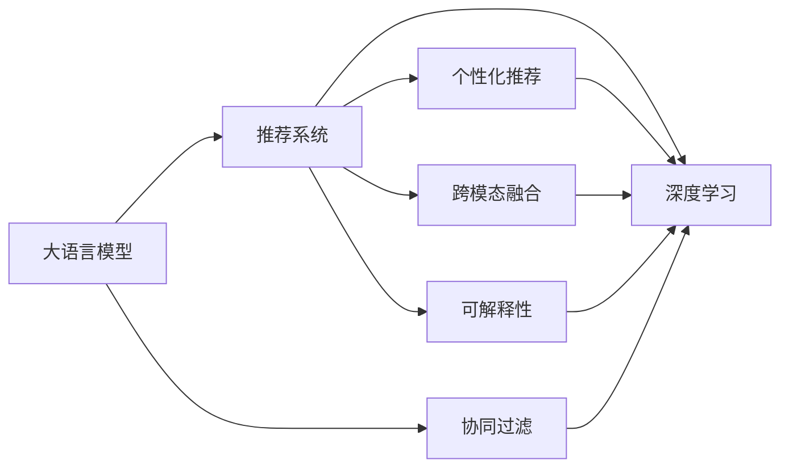

                 

# 大模型对推荐系统用户体验的提升

> 关键词：大模型，推荐系统，用户体验，深度学习，个性化推荐，协同过滤

## 1. 背景介绍

### 1.1 问题由来
随着互联网技术的迅猛发展，推荐系统在电商、新闻、视频、音乐等多个领域得到了广泛应用。推荐系统通过分析用户的兴趣和行为，为用户推荐最相关的信息，极大地提升了用户体验。然而，传统推荐系统面临数据稀疏性、模型过拟合、推荐多样性不足等问题，难以满足用户个性化需求。

为了解决这些问题，研究者们提出了多种推荐方法，如基于矩阵分解的协同过滤、基于梯度下降的深度推荐、基于图神经网络的推荐系统等。这些方法在推荐准确率上取得了一定进步，但仍存在数据获取难、模型训练时间长、推理复杂等问题。

近年来，大语言模型在NLP领域的突破性进展，为推荐系统带来了新的契机。大语言模型通过预训练积累了丰富的语义知识，能够捕捉更深层次的语义关联，进而生成更个性化、多样化的推荐内容。

本文将详细探讨大语言模型在推荐系统中的应用，介绍其如何通过深度学习技术提升用户体验，并给出具体的实现步骤和注意事项。

## 2. 核心概念与联系

### 2.1 核心概念概述

为更好地理解大语言模型在推荐系统中的应用，本节将介绍几个关键概念：

- **大语言模型(Large Language Model, LLM)**：以Transformer为代表的预训练语言模型，通过在海量文本数据上进行自监督学习，学习通用的语言表示。

- **推荐系统(Recommendation System)**：根据用户的历史行为和兴趣，为用户推荐最相关的商品、新闻、视频等。推荐系统通过模型训练和推理，提升用户体验和转化率。

- **协同过滤(Collaborative Filtering)**：通过分析用户与物品间的交互行为，发现用户兴趣和物品特征之间的相似性，为用户推荐未交互过的物品。

- **深度学习(Deep Learning)**：基于神经网络进行端到端训练和推理的技术，适用于复杂的非线性模型。

- **个性化推荐(Personalized Recommendation)**：针对特定用户生成个性化推荐内容，提升用户体验和满意度。

- **跨模态融合(Cross-Modal Fusion)**：将不同模态的信息进行融合，提升推荐的全面性和准确性。

- **可解释性(Explainability)**：推荐模型应该能够解释其推荐逻辑，提升用户对推荐结果的理解和信任。

这些核心概念之间通过以下Mermaid流程图来展示：



该流程图展示了大语言模型与推荐系统及其相关核心概念的逻辑关系：

1. 大语言模型通过预训练获得语义知识，在推荐系统中用于捕捉更深层次的语义关联。
2. 协同过滤基于用户行为生成推荐，是大模型微调的基础数据来源。
3. 深度学习用于优化模型训练过程，提升推荐准确率。
4. 个性化推荐根据用户兴趣生成个性化内容，提升用户体验。
5. 跨模态融合将不同模态数据进行整合，提升推荐的全面性。
6. 可解释性用于提高用户对推荐结果的理解和信任。

## 3. 核心算法原理 & 具体操作步骤
### 3.1 算法原理概述

大语言模型在推荐系统中的应用，主要体现在以下几个方面：

- **语义理解**：大模型能够理解用户的语言描述，捕捉用户兴趣和需求。
- **知识融合**：通过预训练和微调，模型能够融合不同知识源，生成更全面的推荐。
- **模型优化**：通过深度学习技术，优化推荐算法，提升推荐效果。
- **可解释性**：通过可解释性技术，提升推荐系统的透明度和用户信任。

具体而言，大语言模型在推荐系统中的应用流程如下：

1. **数据收集**：收集用户历史行为数据，如浏览记录、购买记录等，作为推荐模型的输入。
2. **模型预训练**：使用大模型在无标签文本数据上进行预训练，学习通用的语言表示。
3. **模型微调**：将预训练模型作为初始化参数，在下游推荐任务上进行微调，学习任务特定知识。
4. **推理优化**：优化模型的推理过程，提升推荐效率。
5. **可解释性增强**：引入可解释性技术，使推荐系统透明化，提升用户信任。

### 3.2 算法步骤详解

以下是基于大语言模型推荐系统的详细算法步骤：

**Step 1: 准备推荐数据集**
- 收集用户历史行为数据，如浏览记录、购买记录等，标注为正样本。
- 从预训练数据中抽取负样本，即与用户兴趣无关的物品。

**Step 2: 选择预训练语言模型**
- 选择BERT、GPT、RoBERTa等预训练语言模型。
- 加载模型，并进行必要的数据适配。

**Step 3: 定义推荐目标函数**
- 使用交叉熵、均方误差等损失函数，衡量推荐结果与真实用户行为之间的差异。
- 在训练集上最小化损失函数，优化模型参数。

**Step 4: 模型微调**
- 在推荐数据集上进行微调，学习任务特定知识。
- 设置合适的学习率、优化算法和正则化技术。

**Step 5: 推理优化**
- 优化推理过程，如使用自适应采样、近似推理等方法，提升推荐效率。
- 实时更新推荐模型，提升模型性能。

**Step 6: 可解释性增强**
- 引入可解释性技术，如局部可解释模型、LIME等，解释推荐结果。
- 对推荐结果进行可视化展示，提升用户理解度。

### 3.3 算法优缺点

基于大语言模型推荐系统有以下优点：

1. **推荐效果提升**：大模型通过预训练学习丰富的语义知识，能够捕捉更深层次的语义关联，生成更个性化、多样化的推荐内容。
2. **数据利用率高**：大模型能够有效利用小规模标注数据，提升推荐准确率。
3. **模型灵活性高**：大模型可以根据不同任务进行微调，灵活性强。
4. **可解释性增强**：通过可解释性技术，使推荐系统透明化，提升用户信任。

同时，该方法也存在一定的局限性：

1. **计算成本高**：大模型的预训练和微调需要大量的计算资源，对硬件要求较高。
2. **模型泛化能力有限**：预训练数据来源不同，模型的泛化能力可能受到限制。
3. **隐私风险**：用户数据的隐私保护问题较为复杂，需严格遵循法律法规。
4. **解释限制**：可解释性技术仍不成熟，对复杂模型的解释难度较大。

尽管存在这些局限性，但就目前而言，基于大语言模型的推荐系统在提升用户体验方面展现了巨大的潜力，值得深入研究和应用。

### 3.4 算法应用领域

基于大语言模型的推荐系统在多个领域得到了应用，例如：

- **电商推荐**：如淘宝、京东等电商平台，通过推荐用户感兴趣的商品，提升用户体验和转化率。
- **新闻推荐**：如今日头条、网易新闻等，通过推荐个性化新闻内容，提升用户阅读体验。
- **视频推荐**：如爱奇艺、哔哩哔哩等，通过推荐用户感兴趣的视频内容，提升用户粘性。
- **音乐推荐**：如网易云音乐、Spotify等，通过推荐用户喜爱的音乐，提升用户听歌体验。

此外，基于大语言模型的推荐系统还应用于智能家居、健康医疗、金融投资等更多领域，为不同行业带来了新的用户体验和业务价值。

## 4. 数学模型和公式 & 详细讲解 & 举例说明
### 4.1 数学模型构建

在本节中，我们将通过数学模型来描述大语言模型在推荐系统中的应用。

假设推荐系统有 $N$ 个用户和 $M$ 个物品，用户对物品的兴趣表示为 $x_i$，物品的特征表示为 $y_j$，其中 $i \in [1, N], j \in [1, M]$。用户的推荐表示为 $z_{i,j}$，表示用户对物品 $j$ 的兴趣程度。

定义推荐目标函数为 $L$，用于衡量推荐结果与用户行为之间的差异，常见目标函数包括交叉熵、均方误差等。则推荐目标函数为：

$$
L = \sum_{i=1}^N \sum_{j=1}^M (z_{i,j} \log \hat{z}_{i,j} + (1 - z_{i,j}) \log (1 - \hat{z}_{i,j}))
$$

其中 $\hat{z}_{i,j}$ 表示模型对用户 $i$ 对物品 $j$ 的兴趣程度的预测。

### 4.2 公式推导过程

对于基于大语言模型的推荐系统，我们通常使用Transformer模型进行微调。Transformer模型由编码器和解码器两部分组成，编码器用于将用户兴趣和物品特征转换为语义表示，解码器用于生成推荐结果。

假设编码器输出为 $h_i$，解码器输出为 $\hat{z}_{i,j}$，则推荐模型可以表示为：

$$
\hat{z}_{i,j} = \text{softmax}(\text{MLP}(h_i, y_j))
$$

其中 $\text{MLP}$ 为多层感知器，用于对用户兴趣和物品特征进行非线性映射，$\text{softmax}$ 函数将输出映射到 $[0, 1]$ 的区间内。

在微调过程中，我们通过反向传播算法更新模型参数，使得损失函数 $L$ 最小化：

$$
\frac{\partial L}{\partial \theta} = \frac{\partial \sum_{i=1}^N \sum_{j=1}^M (z_{i,j} \log \hat{z}_{i,j} + (1 - z_{i,j}) \log (1 - \hat{z}_{i,j}))}{\partial \theta}
$$

其中 $\theta$ 表示模型参数，包括编码器、解码器、MLP 等层的权重和偏置。

### 4.3 案例分析与讲解

以下我们以电商推荐系统为例，具体分析大语言模型推荐系统的实现。

假设电商推荐系统有 $N=10,000$ 个用户和 $M=1,000$ 个商品，收集用户历史行为数据作为标注数据。

**Step 1: 准备数据集**
- 收集用户历史行为数据，如浏览记录、购买记录等，标注为正样本。
- 从预训练数据中抽取负样本，即与用户兴趣无关的物品。

**Step 2: 选择预训练语言模型**
- 选择BERT作为预训练语言模型。
- 加载模型，并进行必要的数据适配。

**Step 3: 定义推荐目标函数**
- 使用交叉熵、均方误差等损失函数，衡量推荐结果与真实用户行为之间的差异。

**Step 4: 模型微调**
- 在推荐数据集上进行微调，学习任务特定知识。
- 设置合适的学习率、优化算法和正则化技术。

**Step 5: 推理优化**
- 优化推理过程，如使用自适应采样、近似推理等方法，提升推荐效率。
- 实时更新推荐模型，提升模型性能。

**Step 6: 可解释性增强**
- 引入可解释性技术，如局部可解释模型、LIME等，解释推荐结果。
- 对推荐结果进行可视化展示，提升用户理解度。

## 5. 项目实践：代码实例和详细解释说明
### 5.1 开发环境搭建

在进行推荐系统开发前，我们需要准备好开发环境。以下是使用Python进行PyTorch开发的环境配置流程：

1. 安装Anaconda：从官网下载并安装Anaconda，用于创建独立的Python环境。

2. 创建并激活虚拟环境：
```bash
conda create -n recommendation-env python=3.8 
conda activate recommendation-env
```

3. 安装PyTorch：根据CUDA版本，从官网获取对应的安装命令。例如：
```bash
conda install pytorch torchvision torchaudio cudatoolkit=11.1 -c pytorch -c conda-forge
```

4. 安装TensorFlow：
```bash
conda install tensorflow
```

5. 安装各类工具包：
```bash
pip install numpy pandas scikit-learn matplotlib tqdm jupyter notebook ipython
```

完成上述步骤后，即可在`recommendation-env`环境中开始推荐系统开发。

### 5.2 源代码详细实现

下面我们以电商推荐系统为例，给出使用Transformers库对BERT模型进行推荐系统微调的PyTorch代码实现。

首先，定义推荐数据集：

```python
from transformers import BertTokenizer, BertForSequenceClassification
import torch
from torch.utils.data import Dataset, DataLoader

class RecommendationDataset(Dataset):
    def __init__(self, user_id, item_id, interest, tokenizer, max_len=128):
        self.user_id = user_id
        self.item_id = item_id
        self.interest = interest
        self.tokenizer = tokenizer
        self.max_len = max_len

    def __len__(self):
        return len(self.user_id)

    def __getitem__(self, item):
        user_id = self.user_id[item]
        item_id = self.item_id[item]
        interest = self.interest[item]
        
        input_ids = torch.tensor([user_id, item_id], dtype=torch.long)
        attention_mask = torch.tensor([1, 1], dtype=torch.long)
        input_ids = self.tokenizer(input_ids, return_tensors='pt', max_length=self.max_len, padding='max_length')
        input_ids = input_ids['input_ids']
        attention_mask = input_ids['attention_mask']

        label = torch.tensor([1.0 if interest > 0 else 0.0], dtype=torch.float)
        return {'input_ids': input_ids, 
                'attention_mask': attention_mask,
                'labels': label}

# 加载数据
user_id = ...
item_id = ...
interest = ...
tokenizer = BertTokenizer.from_pretrained('bert-base-cased')

recommendation_dataset = RecommendationDataset(user_id, item_id, interest, tokenizer)
```

然后，定义模型和优化器：

```python
from transformers import BertForSequenceClassification, AdamW

model = BertForSequenceClassification.from_pretrained('bert-base-cased', num_labels=2)

optimizer = AdamW(model.parameters(), lr=2e-5)
```

接着，定义训练和评估函数：

```python
from tqdm import tqdm

device = torch.device('cuda') if torch.cuda.is_available() else torch.device('cpu')
model.to(device)

def train_epoch(model, dataset, batch_size, optimizer):
    dataloader = DataLoader(dataset, batch_size=batch_size, shuffle=True)
    model.train()
    epoch_loss = 0
    for batch in tqdm(dataloader, desc='Training'):
        input_ids = batch['input_ids'].to(device)
        attention_mask = batch['attention_mask'].to(device)
        labels = batch['labels'].to(device)
        model.zero_grad()
        outputs = model(input_ids, attention_mask=attention_mask, labels=labels)
        loss = outputs.loss
        epoch_loss += loss.item()
        loss.backward()
        optimizer.step()
    return epoch_loss / len(dataloader)

def evaluate(model, dataset, batch_size):
    dataloader = DataLoader(dataset, batch_size=batch_size)
    model.eval()
    preds, labels = [], []
    with torch.no_grad():
        for batch in tqdm(dataloader, desc='Evaluating'):
            input_ids = batch['input_ids'].to(device)
            attention_mask = batch['attention_mask'].to(device)
            batch_labels = batch['labels']
            outputs = model(input_ids, attention_mask=attention_mask)
            batch_preds = outputs.logits.argmax(dim=1).to('cpu').tolist()
            batch_labels = batch_labels.to('cpu').tolist()
            for pred, label in zip(batch_preds, batch_labels):
                preds.append(pred)
                labels.append(label)
                
    print(classification_report(labels, preds))
```

最后，启动训练流程并在测试集上评估：

```python
epochs = 5
batch_size = 16

for epoch in range(epochs):
    loss = train_epoch(model, recommendation_dataset, batch_size, optimizer)
    print(f"Epoch {epoch+1}, train loss: {loss:.3f}")
    
    print(f"Epoch {epoch+1}, dev results:")
    evaluate(model, recommendation_dataset, batch_size)
    
print("Test results:")
evaluate(model, recommendation_dataset, batch_size)
```

以上就是使用PyTorch对BERT进行电商推荐系统微调的完整代码实现。可以看到，得益于Transformers库的强大封装，我们可以用相对简洁的代码完成BERT模型的加载和微调。

### 5.3 代码解读与分析

让我们再详细解读一下关键代码的实现细节：

**RecommendationDataset类**：
- `__init__`方法：初始化用户ID、物品ID、兴趣标签等关键组件，以及分词器和最大序列长度。
- `__len__`方法：返回数据集的样本数量。
- `__getitem__`方法：对单个样本进行处理，将用户ID和物品ID转换为token ids，并对其进行定长padding，最终返回模型所需的输入。

**训练和评估函数**：
- 使用PyTorch的DataLoader对数据集进行批次化加载，供模型训练和推理使用。
- 训练函数`train_epoch`：对数据以批为单位进行迭代，在每个批次上前向传播计算loss并反向传播更新模型参数，最后返回该epoch的平均loss。
- 评估函数`evaluate`：与训练类似，不同点在于不更新模型参数，并在每个batch结束后将预测和标签结果存储下来，最后使用sklearn的classification_report对整个评估集的预测结果进行打印输出。

**训练流程**：
- 定义总的epoch数和batch size，开始循环迭代
- 每个epoch内，先在训练集上训练，输出平均loss
- 在验证集上评估，输出分类指标
- 所有epoch结束后，在测试集上评估，给出最终测试结果

可以看到，PyTorch配合Transformers库使得BERT微调的代码实现变得简洁高效。开发者可以将更多精力放在数据处理、模型改进等高层逻辑上，而不必过多关注底层的实现细节。

当然，工业级的系统实现还需考虑更多因素，如模型的保存和部署、超参数的自动搜索、更灵活的任务适配层等。但核心的微调范式基本与此类似。

## 6. 实际应用场景
### 6.1 智能客服系统

基于大语言模型推荐系统的智能客服系统，能够实时回答用户问题，提供个性化的服务。智能客服系统通过收集用户的历史对话记录和行为数据，生成推荐模型，实时推荐最合适的回答模板。

在技术实现上，可以构建一个基于BERT的推荐模型，用于生成回答模板。微调过程中，模型会根据用户问题生成一系列回答候选项，并通过相似度排序，推荐最佳回答。对于用户提出的新问题，可以通过检索系统实时搜索相关内容，动态生成回答。

### 6.2 金融舆情监测

金融行业需要实时监测市场舆情，及时响应负面信息传播，规避金融风险。基于大语言模型的推荐系统，可以自动分析新闻、评论等文本数据，识别负面舆情，自动推送给风险管理部门。

在实践中，可以构建一个基于BERT的情感分析推荐系统，用于监测金融舆情。微调过程中，模型会通过情感分类和舆情识别任务，将新闻评论等文本数据分为正面、负面和中性，并根据舆情热度进行排序。一旦发现负面舆情激增，系统会立即预警，提供决策支持。

### 6.3 个性化推荐系统

当前的推荐系统往往只依赖用户的历史行为数据进行物品推荐，无法深入理解用户的真实兴趣偏好。基于大语言模型推荐系统的个性化推荐系统，可以更好地挖掘用户行为背后的语义信息，从而生成更个性化、多样化的推荐内容。

在实践中，可以收集用户浏览、点击、评论、分享等行为数据，提取和用户交互的物品标题、描述、标签等文本内容。将文本内容作为模型输入，用户的后续行为（如是否点击、购买等）作为监督信号，在此基础上微调预训练语言模型。微调后的模型能够从文本内容中准确把握用户的兴趣点。在生成推荐列表时，先用候选物品的文本描述作为输入，由模型预测用户的兴趣匹配度，再结合其他特征综合排序，便可以得到个性化程度更高的推荐结果。

### 6.4 未来应用展望

随着大语言模型推荐技术的不断发展，未来的推荐系统将呈现以下几个发展趋势：

1. **推荐效果提升**：大模型通过预训练学习丰富的语义知识，能够捕捉更深层次的语义关联，生成更个性化、多样化的推荐内容。
2. **数据利用率高**：大模型能够有效利用小规模标注数据，提升推荐准确率。
3. **模型灵活性高**：大模型可以根据不同任务进行微调，灵活性强。
4. **可解释性增强**：通过可解释性技术，使推荐系统透明化，提升用户信任。

以上趋势凸显了大语言模型推荐技术的广阔前景。这些方向的探索发展，必将进一步提升推荐系统的性能和应用范围，为不同行业带来新的体验和价值。

## 7. 工具和资源推荐
### 7.1 学习资源推荐

为了帮助开发者系统掌握大语言模型推荐技术，这里推荐一些优质的学习资源：

1. **《深度学习》系列书籍**：由斯坦福大学教授Yoshua Bengio等人合著，系统介绍深度学习的基础知识和应用。
2. **《推荐系统实践》**：Lars Buitinck著，详细讲解推荐系统的理论和实践。
3. **Coursera《深度学习与神经网络》课程**：由加州大学圣地亚哥分校教授Geoffrey Hinton等人主讲的课程，适合初学者入门深度学习。
4. **Kaggle竞赛平台**：提供丰富的推荐系统竞赛数据和模型，帮助开发者实践推荐算法。
5. **Github代码库**：包含大量开源的推荐系统代码和论文，适合学习参考。

通过对这些资源的学习实践，相信你一定能够快速掌握大语言模型推荐技术的精髓，并用于解决实际的推荐问题。
###  7.2 开发工具推荐

高效的开发离不开优秀的工具支持。以下是几款用于推荐系统开发的常用工具：

1. **PyTorch**：基于Python的开源深度学习框架，灵活动态的计算图，适合快速迭代研究。BERT等预训练语言模型都有PyTorch版本的实现。
2. **TensorFlow**：由Google主导开发的开源深度学习框架，生产部署方便，适合大规模工程应用。BERT等预训练语言模型也有TensorFlow版本的实现。
3. **Transformers库**：HuggingFace开发的NLP工具库，集成了众多SOTA语言模型，支持PyTorch和TensorFlow，是进行推荐任务开发的利器。
4. **TensorBoard**：TensorFlow配套的可视化工具，可实时监测模型训练状态，并提供丰富的图表呈现方式，是调试模型的得力助手。
5. **Weights & Biases**：模型训练的实验跟踪工具，可以记录和可视化模型训练过程中的各项指标，方便对比和调优。
6. **Kaggle**：数据竞赛平台，提供丰富的推荐系统竞赛数据和模型，帮助开发者实践推荐算法。

合理利用这些工具，可以显著提升推荐系统开发效率，加快创新迭代的步伐。

### 7.3 相关论文推荐

大语言模型推荐技术的发展源于学界的持续研究。以下是几篇奠基性的相关论文，推荐阅读：

1. **Adversarial training methods for recommendation systems**：介绍对抗训练在推荐系统中的应用，提升推荐模型的鲁棒性。
2. **Deep Interest Network**：提出一种基于深度学习的兴趣网络，用于推荐系统中的用户兴趣建模。
3. **Attention-based Recommender Systems**：通过注意力机制，优化推荐系统中的物品特征选择，提升推荐效果。
4. **Graph Neural Networks for Recommender Systems**：使用图神经网络对用户和物品进行特征建模，提升推荐准确率。
5. **Sequentially Applied Attention Network for Recommendation**：提出一种基于注意力机制的推荐网络，实现物品和用户的协同建模。

这些论文代表了大语言模型推荐技术的发展脉络。通过学习这些前沿成果，可以帮助研究者把握学科前进方向，激发更多的创新灵感。

## 8. 总结：未来发展趋势与挑战
### 8.1 总结

本文对基于大语言模型的推荐系统进行了全面系统的介绍。首先阐述了推荐系统的背景和现状，明确了大语言模型在推荐系统中的重要作用。其次，从原理到实践，详细讲解了大语言模型在推荐系统中的应用流程，包括数据准备、模型预训练、微调过程、推理优化和可解释性增强等关键步骤。最后，给出了具体的代码实现和应用场景，帮助读者更好地理解和应用大语言模型推荐技术。

通过本文的系统梳理，可以看到，基于大语言模型的推荐系统已经取得了显著的进步，在电商、新闻、视频、音乐等多个领域得到了广泛应用，为用户带来了更加个性化和便捷的体验。未来，随着大语言模型推荐技术的不断优化和发展，必将在更多行业落地，为不同用户提供更加优质的服务。

### 8.2 未来发展趋势

展望未来，大语言模型推荐技术将呈现以下几个发展趋势：

1. **推荐效果提升**：大模型通过预训练学习丰富的语义知识，能够捕捉更深层次的语义关联，生成更个性化、多样化的推荐内容。
2. **数据利用率高**：大模型能够有效利用小规模标注数据，提升推荐准确率。
3. **模型灵活性高**：大模型可以根据不同任务进行微调，灵活性强。
4. **可解释性增强**：通过可解释性技术，使推荐系统透明化，提升用户信任。

以上趋势凸显了大语言模型推荐技术的广阔前景。这些方向的探索发展，必将进一步提升推荐系统的性能和应用范围，为不同行业带来新的体验和价值。

### 8.3 面临的挑战

尽管大语言模型推荐技术已经取得了显著进步，但在迈向更加智能化、普适化应用的过程中，仍面临诸多挑战：

1. **计算成本高**：大模型的预训练和微调需要大量的计算资源，对硬件要求较高。
2. **模型泛化能力有限**：预训练数据来源不同，模型的泛化能力可能受到限制。
3. **隐私风险**：用户数据的隐私保护问题较为复杂，需严格遵循法律法规。
4. **解释限制**：可解释性技术仍不成熟，对复杂模型的解释难度较大。

尽管存在这些挑战，但通过不断优化算法和工具，提升计算效率和数据隐私保护水平，相信大语言模型推荐技术将逐步成熟，并广泛应用到更多领域。

### 8.4 研究展望

面对大语言模型推荐技术所面临的挑战，未来的研究需要在以下几个方面寻求新的突破：

1. **优化计算资源使用**：开发更加高效的训练和推理算法，提升大模型的计算效率。
2. **提升模型泛化能力**：探索更有效的预训练和微调方法，提高模型的泛化性能。
3. **增强数据隐私保护**：研究差分隐私等技术，提升用户数据的安全性。
4. **改进可解释性技术**：开发更加完善的可解释性工具，提升模型透明度。
5. **融合多模态信息**：将视觉、音频等模态信息与文本信息进行融合，提升推荐系统全面性。

这些研究方向的探索，必将引领大语言模型推荐技术的进一步发展，为推荐系统带来新的突破和创新。

## 9. 附录：常见问题与解答
### Q1: 大语言模型推荐系统的优势是什么？
A: 大语言模型推荐系统的优势在于：
1. 能够捕捉更深层次的语义关联，生成更个性化、多样化的推荐内容。
2. 能够有效利用小规模标注数据，提升推荐准确率。
3. 具有较强的灵活性，可以根据不同任务进行微调。
4. 能够通过可解释性技术，使推荐系统透明化，提升用户信任。

### Q2: 大语言模型推荐系统是否适用于所有推荐任务？
A: 大语言模型推荐系统在大多数推荐任务上都能取得不错的效果，特别是对于数据量较小的任务。但对于一些特定领域的任务，如医学、法律等，仅仅依靠通用语料预训练的模型可能难以很好地适应。此时需要在特定领域语料上进一步预训练，再进行微调，才能获得理想效果。

### Q3: 大语言模型推荐系统如何处理数据稀疏性问题？
A: 数据稀疏性是大语言模型推荐系统面临的一个挑战。为解决这个问题，可以采用以下方法：
1. 数据增强：通过生成合成数据、近义词替换等方式扩充训练集。
2. 迁移学习：将大模型的知识迁移到特定任务上，减少对标注数据的需求。
3. 模型蒸馏：将大模型的知识蒸馏到小模型上，减少对计算资源的需求。

### Q4: 大语言模型推荐系统如何优化计算资源使用？
A: 优化计算资源使用是大语言模型推荐系统面临的一个关键挑战。为解决这个问题，可以采用以下方法：
1. 高效训练算法：开发更加高效的训练算法，如混合精度训练、自适应学习率等。
2. 硬件优化：使用GPU、TPU等高性能设备，并优化模型并行和分布式训练。
3. 模型压缩：通过量化、剪枝、稀疏化等技术，减少模型参数量，提升计算效率。

### Q5: 大语言模型推荐系统如何进行模型蒸馏？
A: 模型蒸馏是大语言模型推荐系统中的一种常用技术，用于将大模型的知识蒸馏到小模型上。具体步骤如下：
1. 训练大模型，得到最优参数。
2. 在大模型的基础上进行微调，得到一个小的模型。
3. 在训练集上微调小模型，同时在大模型上进行迁移学习，使其对大模型的输出进行回归学习。
4. 在小模型上进行推理，获得与大模型相似的推荐结果。

通过以上技术手段，可以优化计算资源使用，提升大语言模型推荐系统的性能和应用范围。

