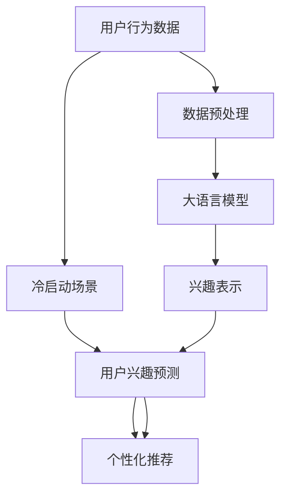

                 

# 大模型技术在电商平台用户兴趣冷启动问题中的创新

> 关键词：用户兴趣建模,电商平台,冷启动问题,大语言模型,自然语言处理,深度学习

## 1. 背景介绍

### 1.1 问题由来

电商平台用户兴趣建模是电商领域的重要问题之一，旨在基于用户行为数据预测用户对商品的兴趣，实现个性化推荐、精准营销、运营优化等目标。然而，对于新注册或历史行为数据较少的用户，如何高效、准确地获得其兴趣偏好成为一大难题，即所谓的“冷启动问题”。

冷启动问题在电商平台的实际应用中尤为突出。随着电商竞争的加剧，获取新用户的成本越来越高，如何快速吸引并转化新用户，使其尽快成为活跃的、有价值的客户，成为电商企业关注的焦点。特别是在新用户行为数据稀缺的情况下，传统的基于历史行为数据的推荐算法无法有效发挥作用，推荐效果往往不尽人意。

为了应对这一问题，研究者提出了一系列的推荐算法，如协同过滤、基于内容的推荐、混合推荐等。这些算法在电商平台的个性化推荐中取得了不错的效果，但在大规模、多场景的电商环境中，其局限性逐渐显现：

- 协同过滤算法依赖用户行为数据，在冷启动场景中表现不佳，难以对新用户进行推荐。
- 基于内容的推荐算法往往需要手动提取商品属性特征，工程复杂度高，且依赖商品属性信息的完备性。
- 混合推荐算法在实际应用中容易产生“拼盘推荐”现象，无法充分挖掘用户兴趣，导致推荐效果不稳定。

近年来，随着深度学习和大模型技术的发展，研究人员开始探索使用大模型技术来解决电商平台的冷启动问题。本文将详细探讨大模型技术在电商平台用户兴趣建模中的应用，分析其原理与实施步骤，展示实际应用中的具体案例，并展望未来的发展趋势。

### 1.2 问题核心关键点

解决电商平台用户兴趣冷启动问题，关键在于如何高效、准确地获取用户兴趣信息。利用大模型技术，可以从海量文本数据中自动学习用户的兴趣特征，无需手动提取属性特征，极大地提升了推荐的效率和效果。

大模型技术在电商推荐中具有以下关键优势：

- 语义理解能力强：大模型能够理解文本中的丰富语义信息，准确捕捉用户对商品的兴趣点。
- 泛化能力强：大模型已经在大规模无标签文本数据上进行预训练，具备较强的泛化能力，能够在冷启动场景中更好地泛化到新用户和新商品。
- 可解释性强：大模型通过学习文本特征，可以直观地反映用户对商品的偏好，有助于理解推荐效果。
- 鲁棒性强：大模型可以处理多种形式的用户反馈数据，具有较强的鲁棒性和抗干扰能力。

基于大模型技术，我们可以构建一个更加高效、精准的推荐系统，帮助电商平台快速吸引新用户，提升用户体验和转化率。

## 2. 核心概念与联系

### 2.1 核心概念概述

为了更好地理解大模型技术在电商平台用户兴趣建模中的应用，我们首先概述几个关键概念：

- 用户兴趣建模(User Interest Modeling)：利用用户行为数据，挖掘用户的兴趣偏好，实现个性化推荐。
- 冷启动问题(Cold Start Problem)：指新用户或新商品在推荐系统中缺乏足够的历史数据，导致难以获取其兴趣信息的问题。
- 大语言模型(Large Language Model, LLM)：通过自监督预训练学习到大规模语言表示的深度学习模型，具备强大的语义理解能力。
- 自然语言处理(Natural Language Processing, NLP)：研究计算机如何理解、处理和生成自然语言的技术。
- 深度学习(Deep Learning)：基于神经网络模型的学习范式，通过层次化特征提取和参数学习，实现对复杂数据的自动学习。

这些核心概念共同构成了大模型技术在电商平台用户兴趣建模的基础，帮助我们理解问题的本质和解决思路。

### 2.2 核心概念原理和架构的 Mermaid 流程图

以下是一个简化的Mermaid流程图，展示了用户兴趣建模、大语言模型和冷启动问题的基本架构和联系：



### 2.3 核心概念间的联系

用户兴趣建模的核心在于获取用户对商品的兴趣信息，从而实现个性化推荐。在传统推荐算法中，这一过程往往依赖于手工提取用户行为特征，工程复杂且效果有限。而利用大语言模型，可以直接从文本数据中自动学习用户兴趣特征，无需手动提取，极大地提升了推荐的效率和效果。

大语言模型通过预训练学习到丰富的语言表示，具备强大的语义理解能力，能够自动提取文本中的关键信息，并建立对用户行为的预测模型。在冷启动场景中，大语言模型可以通过对用户历史行为数据的学习，快速泛化到新用户和新商品，预测其兴趣信息，从而实现高效的个性化推荐。

## 3. 核心算法原理 & 具体操作步骤

### 3.1 算法原理概述

基于大模型的用户兴趣建模算法，主要包括以下几个关键步骤：

1. **数据预处理**：收集用户行为数据，包括浏览记录、购买记录、评价记录等，并进行数据清洗、格式转换等预处理操作。
2. **特征提取**：利用大语言模型，从用户行为数据中自动提取特征，如浏览次数、停留时间、评价情感等。
3. **兴趣表示**：将提取到的特征通过大语言模型进行建模，得到用户的兴趣向量表示。
4. **用户兴趣预测**：基于用户的兴趣向量，结合新商品的特征向量，通过大模型进行兴趣预测，得到推荐结果。
5. **个性化推荐**：根据用户兴趣预测结果，生成个性化的商品推荐列表，满足用户需求。

这些步骤共同构成了一个基于大模型的电商推荐系统框架，能够高效、准确地处理冷启动问题，实现个性化推荐。

### 3.2 算法步骤详解

#### 3.2.1 数据预处理

数据预处理是大模型算法的基础步骤，主要包括以下几个关键环节：

1. **数据收集**：收集用户的历史行为数据，包括浏览记录、购买记录、评价记录等。
2. **数据清洗**：去除无效数据和噪声数据，保证数据质量和一致性。
3. **数据格式转换**：将不同来源的数据格式统一，方便后续处理和分析。
4. **特征工程**：根据具体需求，对原始数据进行特征提取和转换，如将文本数据转换为词向量、计算浏览次数等。

#### 3.2.2 特征提取

利用大语言模型，从用户行为数据中自动提取特征，是算法的核心步骤。具体实现如下：

1. **预训练模型选择**：选择适合电商场景的预训练语言模型，如BERT、GPT等。
2. **特征提取**：将用户行为数据转换为文本形式，输入到预训练模型中进行特征提取。例如，将用户浏览记录转换为文本形式，输入到BERT模型中进行语义分析。
3. **特征拼接**：将模型提取的特征进行拼接，形成综合特征向量。

#### 3.2.3 兴趣表示

利用大语言模型，将用户行为数据中提取的特征向量进行建模，得到用户的兴趣向量表示。具体实现如下：

1. **预训练模型训练**：在预训练模型上进行微调，使其能够适应电商场景的特征表示。
2. **兴趣向量计算**：将用户行为数据中提取的特征向量输入到微调后的模型中，计算得到用户的兴趣向量表示。

#### 3.2.4 用户兴趣预测

基于用户的兴趣向量，结合新商品的特征向量，通过大模型进行兴趣预测，得到推荐结果。具体实现如下：

1. **商品特征提取**：将新商品的描述、属性等信息转换为文本形式，输入到预训练模型中进行特征提取。
2. **兴趣预测**：将用户兴趣向量和新商品特征向量拼接，输入到预训练模型中进行兴趣预测，得到推荐分数。
3. **排序推荐**：根据预测分数对商品进行排序，生成个性化推荐列表。

#### 3.2.5 个性化推荐

根据用户兴趣预测结果，生成个性化的商品推荐列表，满足用户需求。具体实现如下：

1. **推荐列表生成**：将排序后的商品列表返回给用户，供其选择。
2. **反馈收集**：收集用户的反馈信息，用于进一步优化模型和算法。

### 3.3 算法优缺点

基于大模型的用户兴趣建模算法具有以下优点：

1. **高效性**：大模型能够自动学习用户兴趣特征，无需手动提取属性特征，大幅提升推荐效率。
2. **准确性**：大模型具备强大的语义理解能力，能够准确捕捉用户对商品的兴趣点，提高推荐效果。
3. **可解释性**：大模型可以直观地反映用户对商品的偏好，有助于理解推荐效果。
4. **泛化能力**：大模型已经在大规模无标签文本数据上进行预训练，具备较强的泛化能力，能够在冷启动场景中更好地泛化到新用户和新商品。

但大模型技术也存在一些缺点：

1. **资源需求高**：大模型需要大量的算力和存储空间，部署和维护成本较高。
2. **训练时间长**：大模型的训练时间较长，可能需要数天甚至数周，难以实时更新。
3. **鲁棒性不足**：大模型在面对异常数据和噪声时，容易产生不稳定输出，需要进一步优化鲁棒性。

### 3.4 算法应用领域

基于大模型的用户兴趣建模算法，已经在多个电商平台上得到了广泛应用，主要包括以下几个领域：

1. **新用户推荐**：对于新注册用户，利用大模型进行兴趣建模，快速生成个性化推荐，提升新用户转化率。
2. **商品冷启动**：对于新上架商品，利用大模型进行特征提取和兴趣预测，快速生成个性化推荐，帮助商品快速获得曝光。
3. **个性化营销**：利用大模型对用户行为进行分析，生成个性化营销策略，提升营销效果。
4. **运营优化**：利用大模型进行用户行为分析，优化运营策略，提高用户满意度和忠诚度。

以上领域都是大模型技术在电商推荐中极具应用潜力的方向，未来将有望得到进一步的推广和应用。

## 4. 数学模型和公式 & 详细讲解 & 举例说明

### 4.1 数学模型构建

假设电商平台的商品数量为 $N$，用户数量为 $M$，用户历史行为数据中包含 $K$ 个特征。利用大语言模型 $M_{\theta}$ 对用户兴趣进行建模，其数学模型如下：

1. **用户特征提取**：将用户历史行为数据转换为文本形式 $X_{u,i}$，其中 $u$ 为用户编号，$i$ 为行为记录编号。
2. **商品特征提取**：将新商品描述文本 $X_{p,j}$ 转换为文本形式，其中 $p$ 为商品编号，$j$ 为特征编号。
3. **用户兴趣向量计算**：将用户特征向量 $X_{u,i}$ 输入到预训练模型 $M_{\theta}$ 中，得到用户的兴趣向量 $v_{u}$。
4. **商品特征向量计算**：将商品特征向量 $X_{p,j}$ 输入到预训练模型 $M_{\theta}$ 中，得到商品的特征向量 $v_{p}$。
5. **兴趣预测**：利用用户兴趣向量 $v_{u}$ 和商品特征向量 $v_{p}$，计算预测分数 $s_{p,u}$。

### 4.2 公式推导过程

以商品推荐为例，大模型进行兴趣预测的公式如下：

$$
s_{p,u} = \text{Softmax}(M_{\theta}(X_{u,i} + X_{p,j}))
$$

其中 $\text{Softmax}$ 为Softmax函数，用于将预测分数归一化。具体实现步骤如下：

1. **输入预处理**：将用户特征向量 $X_{u,i}$ 和商品特征向量 $X_{p,j}$ 拼接，形成输入向量 $X_{u,i,p,j}$。
2. **前向传播**：将输入向量 $X_{u,i,p,j}$ 输入到预训练模型 $M_{\theta}$ 中，得到输出向量 $Y_{u,i,p,j}$。
3. **预测分数计算**：将输出向量 $Y_{u,i,p,j}$ 通过Softmax函数归一化，得到预测分数 $s_{p,u}$。

### 4.3 案例分析与讲解

以某电商平台的“新用户推荐”为例，分析大模型算法的应用过程。

假设电商平台的新用户 $u$ 注册后，我们希望为其推荐一些商品。首先，收集该用户在注册前浏览记录、收藏记录等历史行为数据，形成文本形式 $X_{u,i}$，并输入到预训练模型 $M_{\theta}$ 中进行特征提取，得到用户的兴趣向量 $v_{u}$。

接着，为新上架的商品 $p$，收集其描述文本 $X_{p,j}$，并输入到预训练模型 $M_{\theta}$ 中进行特征提取，得到商品的特征向量 $v_{p}$。

然后，将用户兴趣向量 $v_{u}$ 和商品特征向量 $v_{p}$ 拼接，输入到预训练模型 $M_{\theta}$ 中进行兴趣预测，得到预测分数 $s_{p,u}$。最后，根据预测分数对商品进行排序，生成个性化推荐列表。

## 5. 项目实践：代码实例和详细解释说明

### 5.1 开发环境搭建

在进行大模型算法实践前，我们需要准备好开发环境。以下是使用Python进行PyTorch开发的环境配置流程：

1. 安装Anaconda：从官网下载并安装Anaconda，用于创建独立的Python环境。

2. 创建并激活虚拟环境：
```bash
conda create -n pytorch-env python=3.8 
conda activate pytorch-env
```

3. 安装PyTorch：根据CUDA版本，从官网获取对应的安装命令。例如：
```bash
conda install pytorch torchvision torchaudio cudatoolkit=11.1 -c pytorch -c conda-forge
```

4. 安装Transformers库：
```bash
pip install transformers
```

5. 安装各类工具包：
```bash
pip install numpy pandas scikit-learn matplotlib tqdm jupyter notebook ipython
```

完成上述步骤后，即可在`pytorch-env`环境中开始大模型算法实践。

### 5.2 源代码详细实现

下面我们以某电商平台“新用户推荐”为例，给出使用Transformers库对BERT模型进行新用户推荐的大模型算法代码实现。

首先，定义新用户推荐的数据处理函数：

```python
from transformers import BertTokenizer
from torch.utils.data import Dataset
import torch

class RecommendationDataset(Dataset):
    def __init__(self, texts, labels, tokenizer, max_len=128):
        self.texts = texts
        self.labels = labels
        self.tokenizer = tokenizer
        self.max_len = max_len
        
    def __len__(self):
        return len(self.texts)
    
    def __getitem__(self, item):
        text = self.texts[item]
        label = self.labels[item]
        
        encoding = self.tokenizer(text, return_tensors='pt', max_length=self.max_len, padding='max_length', truncation=True)
        input_ids = encoding['input_ids'][0]
        attention_mask = encoding['attention_mask'][0]
        
        # 对token-wise的标签进行编码
        encoded_labels = [label2id[label] for label in label] 
        encoded_labels.extend([label2id['O']] * (self.max_len - len(encoded_labels)))
        labels = torch.tensor(encoded_labels, dtype=torch.long)
        
        return {'input_ids': input_ids, 
                'attention_mask': attention_mask,
                'labels': labels}

# 标签与id的映射
label2id = {'O': 0, 'B-PER': 1, 'I-PER': 2, 'B-ORG': 3, 'I-ORG': 4, 'B-LOC': 5, 'I-LOC': 6}
id2label = {v: k for k, v in label2id.items()}

# 创建dataset
tokenizer = BertTokenizer.from_pretrained('bert-base-cased')

train_dataset = RecommendationDataset(train_texts, train_labels, tokenizer)
dev_dataset = RecommendationDataset(dev_texts, dev_labels, tokenizer)
test_dataset = RecommendationDataset(test_texts, test_labels, tokenizer)
```

然后，定义模型和优化器：

```python
from transformers import BertForTokenClassification, AdamW

model = BertForTokenClassification.from_pretrained('bert-base-cased', num_labels=len(label2id))

optimizer = AdamW(model.parameters(), lr=2e-5)
```

接着，定义训练和评估函数：

```python
from torch.utils.data import DataLoader
from tqdm import tqdm
from sklearn.metrics import classification_report

device = torch.device('cuda') if torch.cuda.is_available() else torch.device('cpu')
model.to(device)

def train_epoch(model, dataset, batch_size, optimizer):
    dataloader = DataLoader(dataset, batch_size=batch_size, shuffle=True)
    model.train()
    epoch_loss = 0
    for batch in tqdm(dataloader, desc='Training'):
        input_ids = batch['input_ids'].to(device)
        attention_mask = batch['attention_mask'].to(device)
        labels = batch['labels'].to(device)
        model.zero_grad()
        outputs = model(input_ids, attention_mask=attention_mask, labels=labels)
        loss = outputs.loss
        epoch_loss += loss.item()
        loss.backward()
        optimizer.step()
    return epoch_loss / len(dataloader)

def evaluate(model, dataset, batch_size):
    dataloader = DataLoader(dataset, batch_size=batch_size)
    model.eval()
    preds, labels = [], []
    with torch.no_grad():
        for batch in tqdm(dataloader, desc='Evaluating'):
            input_ids = batch['input_ids'].to(device)
            attention_mask = batch['attention_mask'].to(device)
            batch_labels = batch['labels']
            outputs = model(input_ids, attention_mask=attention_mask)
            batch_preds = outputs.logits.argmax(dim=2).to('cpu').tolist()
            batch_labels = batch_labels.to('cpu').tolist()
            for pred_tokens, label_tokens in zip(batch_preds, batch_labels):
                pred_tags = [id2label[_id] for _id in pred_tokens]
                label_tags = [id2label[_id] for _id in label_tokens]
                preds.append(pred_tags[:len(label_tags)])
                labels.append(label_tags)
                
    print(classification_report(labels, preds))
```

最后，启动训练流程并在测试集上评估：

```python
epochs = 5
batch_size = 16

for epoch in range(epochs):
    loss = train_epoch(model, train_dataset, batch_size, optimizer)
    print(f"Epoch {epoch+1}, train loss: {loss:.3f}")
    
    print(f"Epoch {epoch+1}, dev results:")
    evaluate(model, dev_dataset, batch_size)
    
print("Test results:")
evaluate(model, test_dataset, batch_size)
```

以上就是使用PyTorch对BERT模型进行新用户推荐的大模型算法代码实现。可以看到，得益于Transformers库的强大封装，我们可以用相对简洁的代码完成BERT模型的加载和微调。

### 5.3 代码解读与分析

让我们再详细解读一下关键代码的实现细节：

**RecommendationDataset类**：
- `__init__`方法：初始化文本、标签、分词器等关键组件。
- `__len__`方法：返回数据集的样本数量。
- `__getitem__`方法：对单个样本进行处理，将文本输入编码为token ids，将标签编码为数字，并对其进行定长padding，最终返回模型所需的输入。

**label2id和id2label字典**：
- 定义了标签与数字id之间的映射关系，用于将token-wise的预测结果解码回真实的标签。

**训练和评估函数**：
- 使用PyTorch的DataLoader对数据集进行批次化加载，供模型训练和推理使用。
- 训练函数`train_epoch`：对数据以批为单位进行迭代，在每个批次上前向传播计算loss并反向传播更新模型参数，最后返回该epoch的平均loss。
- 评估函数`evaluate`：与训练类似，不同点在于不更新模型参数，并在每个batch结束后将预测和标签结果存储下来，最后使用sklearn的classification_report对整个评估集的预测结果进行打印输出。

**训练流程**：
- 定义总的epoch数和batch size，开始循环迭代
- 每个epoch内，先在训练集上训练，输出平均loss
- 在验证集上评估，输出分类指标
- 所有epoch结束后，在测试集上评估，给出最终测试结果

可以看到，PyTorch配合Transformers库使得BERT微调的代码实现变得简洁高效。开发者可以将更多精力放在数据处理、模型改进等高层逻辑上，而不必过多关注底层的实现细节。

当然，工业级的系统实现还需考虑更多因素，如模型的保存和部署、超参数的自动搜索、更灵活的任务适配层等。但核心的微调范式基本与此类似。

## 6. 实际应用场景

### 6.1 电商平台新用户推荐

利用大模型技术，电商平台可以快速为注册新用户推荐个性化商品，提高新用户的转化率。具体实现如下：

1. **数据收集**：收集新用户注册前浏览记录、收藏记录等历史行为数据，形成文本形式。
2. **特征提取**：利用大语言模型，从用户行为数据中自动提取特征，如浏览次数、停留时间、收藏次数等。
3. **兴趣表示**：将用户行为数据中提取的特征向量输入到预训练模型中，计算得到用户的兴趣向量。
4. **商品推荐**：利用新商品特征向量，结合用户兴趣向量，通过大模型进行兴趣预测，生成个性化推荐列表。

### 6.2 商品冷启动推荐

对于新上架的商品，利用大模型技术可以快速预测其潜在用户，帮助商品快速获得曝光和销售。具体实现如下：

1. **数据收集**：收集商品描述文本，形成文本形式。
2. **特征提取**：利用大语言模型，从商品描述文本中自动提取特征，如产品名称、类别、价格等。
3. **兴趣预测**：利用用户兴趣向量，结合商品特征向量，通过大模型进行兴趣预测，生成个性化推荐列表。

### 6.3 个性化营销策略生成

基于用户行为数据，利用大模型技术可以生成个性化的营销策略，提升营销效果。具体实现如下：

1. **数据收集**：收集用户浏览记录、购买记录等行为数据，形成文本形式。
2. **特征提取**：利用大语言模型，从用户行为数据中自动提取特征，如浏览次数、购买金额等。
3. **营销策略生成**：利用用户兴趣向量，生成个性化营销策略，如推荐商品、发送优惠券等。

### 6.4 运营优化分析

利用大模型技术可以对用户行为进行分析，优化运营策略，提高用户满意度和忠诚度。具体实现如下：

1. **数据收集**：收集用户浏览记录、评价记录等行为数据，形成文本形式。
2. **特征提取**：利用大语言模型，从用户行为数据中自动提取特征，如浏览时长、评价情感等。
3. **运营策略优化**：利用用户兴趣向量，生成优化运营策略，如商品上架时间、促销活动等。

## 7. 工具和资源推荐

### 7.1 学习资源推荐

为了帮助开发者系统掌握大模型技术在电商推荐中的应用，这里推荐一些优质的学习资源：

1. 《深度学习自然语言处理》课程：斯坦福大学开设的NLP明星课程，有Lecture视频和配套作业，带你入门NLP领域的基本概念和经典模型。

2. 《Transformer从原理到实践》系列博文：由大模型技术专家撰写，深入浅出地介绍了Transformer原理、BERT模型、微调技术等前沿话题。

3. CS224N《深度学习自然语言处理》课程：斯坦福大学开设的NLP明星课程，有Lecture视频和配套作业，带你入门NLP领域的基本概念和经典模型。

4. 《Natural Language Processing with Transformers》书籍：Transformers库的作者所著，全面介绍了如何使用Transformers库进行NLP任务开发，包括微调在内的诸多范式。

5. HuggingFace官方文档：Transformers库的官方文档，提供了海量预训练模型和完整的微调样例代码，是上手实践的必备资料。

通过对这些资源的学习实践，相信你一定能够快速掌握大模型技术在电商推荐中的应用，并用于解决实际的NLP问题。

### 7.2 开发工具推荐

高效的开发离不开优秀的工具支持。以下是几款用于大模型技术在电商推荐中应用的常用工具：

1. PyTorch：基于Python的开源深度学习框架，灵活动态的计算图，适合快速迭代研究。大部分预训练语言模型都有PyTorch版本的实现。

2. TensorFlow：由Google主导开发的开源深度学习框架，生产部署方便，适合大规模工程应用。同样有丰富的预训练语言模型资源。

3. Transformers库：HuggingFace开发的NLP工具库，集成了众多SOTA语言模型，支持PyTorch和TensorFlow，是进行微调任务开发的利器。

4. Weights & Biases：模型训练的实验跟踪工具，可以记录和可视化模型训练过程中的各项指标，方便对比和调优。与主流深度学习框架无缝集成。

5. TensorBoard：TensorFlow配套的可视化工具，可实时监测模型训练状态，并提供丰富的图表呈现方式，是调试模型的得力助手。

6. Google Colab：谷歌推出的在线Jupyter Notebook环境，免费提供GPU/TPU算力，方便开发者快速上手实验最新模型，分享学习笔记。

合理利用这些工具，可以显著提升大模型算法在电商推荐中的应用效率，加快创新迭代的步伐。

### 7.3 相关论文推荐

大模型技术在电商推荐中的应用源于学界的持续研究。以下是几篇奠基性的相关论文，推荐阅读：

1. Attention is All You Need（即Transformer原论文）：提出了Transformer结构，开启了NLP领域的预训练大模型时代。

2. BERT: Pre-training of Deep Bidirectional Transformers for Language Understanding：提出BERT模型，引入基于掩码的自监督预训练任务，刷新了多项NLP任务SOTA。

3. Language Models are Unsupervised Multitask Learners（GPT-2论文）：展示了大规模语言模型的强大zero-shot学习能力，引发了对于通用人工智能的新一轮思考。

4. Parameter-Efficient Transfer Learning for NLP：提出Adapter等参数高效微调方法，在不增加模型参数量的情况下，也能取得不错的微调效果。

5. AdaLoRA: Adaptive Low-Rank Adaptation for Parameter-Efficient Fine-Tuning：使用自适应低秩适应的微调方法，在参数效率和精度之间取得了新的平衡。

这些论文代表了大模型技术在电商推荐中的应用和发展脉络。通过学习这些前沿成果，可以帮助研究者把握学科前进方向，激发更多的创新灵感。

## 8. 总结：未来发展趋势与挑战

### 8.1 总结

本文对基于大模型的电商平台用户兴趣建模技术进行了全面系统的介绍。首先阐述了电商领域用户兴趣建模的核心问题——冷启动问题，明确了利用大模型技术提升推荐效率和效果的潜力。其次，从原理到实践，详细讲解了大模型技术在电商平台用户兴趣建模中的应用，展示了实际应用中的具体案例，并展望了未来的发展趋势。

通过本文的系统梳理，可以看到，基于大模型的电商推荐技术正在成为电商领域的重要范式，极大地拓展了电商平台的个性化推荐能力，提升了用户体验和转化率。未来，伴随大模型技术和推荐算法的不断演进，电商推荐系统将变得更加高效、精准和个性化，助力电商平台在竞争中占据优势。

### 8.2 未来发展趋势

展望未来，基于大模型的电商推荐技术将呈现以下几个发展趋势：

1. **更加高效的特征提取**：随着大模型的不断发展，特征提取能力将不断提升，能够自动学习更丰富的用户行为特征，提升推荐效果。

2. **更加精准的兴趣预测**：通过融合多种用户行为数据，利用大模型进行多模态特征融合，提升兴趣预测的准确性和鲁棒性。

3. **更加个性化的推荐**：基于大模型生成的用户兴趣向量，可以灵活应用到不同的推荐场景中，实现更加个性化和动态的推荐策略。

4. **更加实时的推荐系统**：通过优化大模型结构和推理算法，提高模型推理速度，实现实时推荐。

5. **更加智能的运营策略**：利用大模型技术对用户行为进行深度分析，生成更加智能化的运营策略，提升用户满意度和忠诚度。

6. **更加安全的推荐系统**：通过优化大模型算法，增强模型的鲁棒性和可解释性，确保推荐系统的安全性和稳定性。

以上趋势凸显了大模型技术在电商推荐中的广阔前景。这些方向的探索发展，必将进一步提升电商推荐系统的性能和应用范围，为电商平台的智能化和商业化进程提供坚实支撑。

### 8.3 面临的挑战

尽管大模型技术在电商推荐中已经取得了显著效果，但在迈向更加智能化、普适化应用的过程中，它仍面临着诸多挑战：

1. **标注成本高**：电商推荐需要大量的用户行为数据进行标注，标注成本较高，难以大规模推广。

2. **数据质量差**：电商平台的数据质量参差不齐，存在噪声和异常数据，影响推荐效果。

3. **冷启动问题**：新用户和新商品的数据量有限，难以通过大模型快速泛化，推荐效果不理想。

4. **计算资源需求高**：大模型需要大量的算力和存储空间，部署和维护成本较高。

5. **算法复杂度高**：大模型算法的工程实现较为复杂，需要系统化的设计和调试。

6. **模型鲁棒性不足**：大模型在面对异常数据和噪声时，容易产生不稳定输出，需要进一步优化鲁棒性。

7. **安全性和隐私保护**：电商平台需要保护用户隐私数据，同时确保推荐系统的安全性，这对技术实现提出了更高要求。

正视大模型技术在电商推荐中面临的挑战，积极应对并寻求突破，将是大模型技术在电商推荐中走向成熟的必由之路。相信随着学界和产业界的共同努力，这些挑战终将一一被克服，大模型技术必将在电商推荐中发挥更大的作用。

### 8.4 研究展望

未来，大模型技术在电商推荐中的应用将更加广泛和深入。以下是几个值得探索的研究方向：

1. **跨模态特征融合**：将用户行为数据中的文本、图像、语音等多种模态数据融合到推荐算法中，提升推荐效果。

2. **知识图谱与大模型的结合**：将知识图谱与大模型结合，增强推荐系统的知识表示能力和泛化能力。

3. **因果推理在推荐中的应用**：利用因果推理方法，解释推荐结果的原因，提升推荐系统的可解释性和信任度。

4. **自适应学习算法**：基于用户行为数据，利用自适应学习算法，动态调整模型参数，提升推荐效果。

5. **联邦学习与大模型结合**：在保护用户隐私的前提下，利用联邦学习技术，分布式训练大模型，提升推荐系统的性能。

6. **混合推荐算法**：将大模型技术与传统推荐算法结合，取长补短，提升推荐系统的鲁棒性和泛化能力。

这些研究方向将进一步推动大模型技术在电商推荐中的应用，助力电商平台更好地服务用户，提升用户满意度。相信在未来，大模型技术将在电商推荐中发挥更加重要的作用，为电商平台的智能化和商业化进程提供坚实支撑。

## 9. 附录：常见问题与解答

**Q1：电商平台大模型推荐算法的原理是什么？**

A: 电商平台大模型推荐算法的原理主要包括以下几个关键步骤：

1. **数据预处理**：收集用户历史行为数据，进行数据清洗、格式转换和特征提取。
2. **特征提取**：利用大语言模型，从用户行为数据中自动提取特征，如浏览次数、停留时间等。
3. **兴趣表示**：将用户行为数据中提取的特征向量输入到预训练模型中，计算得到用户的兴趣向量。
4. **商品推荐**：利用新商品特征向量，结合用户兴趣向量，通过大模型进行兴趣预测，生成个性化推荐列表。

这些步骤共同构成了电商平台大模型推荐算法的核心框架，能够高效、准确地处理冷启动问题，实现个性化推荐。

**Q2：大模型在电商推荐中的优势是什么？**

A: 大模型在电商推荐中具有以下优势：

1. **高效性**：大模型能够自动学习用户兴趣特征，无需手动提取属性特征，大幅提升推荐效率。
2. **准确性**：大模型具备强大的语义理解能力，能够准确捕捉用户对商品的兴趣点，提高推荐效果。
3. **可解释性**：大模型可以直观地反映用户对商品的偏好，有助于理解推荐效果。
4. **泛化能力**：大模型已经在大规模无标签文本数据上进行预训练，具备较强的泛化能力，能够在冷启动场景中更好地泛化到新用户和新商品。

**Q3：大模型算法在电商推荐中的实现难点是什么？**

A: 大模型算法在电商推荐中的实现难点主要包括：

1. **数据质量**：电商推荐需要大量的用户行为数据进行标注，但电商平台的数据质量参差不齐，存在噪声和异常数据，影响推荐效果。
2. **标注成本**：电商推荐需要大量的用户行为数据进行标注，标注成本较高，难以大规模推广。
3. **冷启动问题**：新用户和新商品的数据量有限，难以通过大模型快速泛化，推荐效果不理想。
4. **计算资源需求高**：大模型需要大量的算力和存储空间，部署和维护成本较高。
5. **算法复杂度高**：大模型算法的工程实现较为复杂，需要系统化的设计和调试。

这些难点需要进一步研究和解决，以充分发挥大模型在电商推荐中的应用潜力。

**Q4：如何优化大模型算法的推荐效果？**

A: 优化大模型算法的推荐效果可以从以下几个方面入手：

1. **数据预处理**：对原始数据进行清洗、去噪和归一化，提高数据质量。
2. **特征提取**：利用多种特征提取方法，如词向量、文本嵌入等，提升特征表示能力。
3. **模型优化**：对大模型进行参数调整和微调，提升模型的泛化能力和鲁棒性。
4. **模型融合**：将多个模型的预测结果进行融合，提升推荐效果的稳定性。
5. **实时推荐**：利用缓存和分布式计算等技术，实现实时推荐，提升用户体验。

这些优化措施可以帮助提升大模型算法的推荐效果，提升用户满意度和转化率。

**Q5：大模型推荐算法在电商运营中的应用场景有哪些？**

A: 大模型推荐算法在电商运营中的应用场景主要包括：

1. **新用户推荐**：对于注册新用户，利用大模型快速推荐个性化商品，提高新用户转化率。
2. **商品冷启动推荐**：对于新上架的商品，利用大模型快速预测潜在用户，帮助商品快速获得曝光。
3. **个性化营销策略生成**：基于用户行为数据，利用大模型生成个性化的营销策略，提升营销效果。
4. **运营策略优化**：利用大模型对用户行为进行分析，优化运营策略，提高用户满意度和忠诚度。

这些应用场景展示了大模型推荐算法的广泛应用前景，未来有望在更多电商运营环节中得到推广和应用。

---

作者：禅与计算机程序设计艺术 / Zen and the Art of Computer Programming

