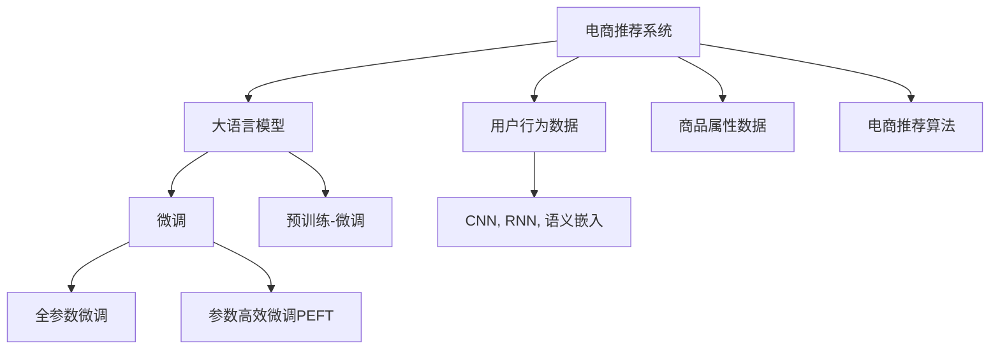

                 

# 大模型技术如何革新电商个性化推荐

> 关键词：大语言模型, 深度推荐系统, 模型微调, 个性化推荐, 自适应学习, 电商场景, 智能零售

## 1. 背景介绍

### 1.1 问题由来
随着互联网技术的发展，电商行业已经迈入移动互联网时代，日益激烈的市场竞争对个性化推荐系统的要求越来越高。电商个性化推荐系统通过分析用户行为数据，预测用户对商品的可能偏好，为用户推荐个性化的商品，从而提高用户体验和电商平台的转化率。传统的推荐系统通常依赖于协同过滤、基于内容的推荐等算法，但这些方法对数据量和多样性要求较高，难以在大规模电商数据中取得理想的效果。

近年来，大语言模型技术在自然语言处理领域的快速发展，为电商个性化推荐系统带来了新的发展机遇。通过将预训练语言模型引入推荐系统中，可以充分利用模型对大规模文本数据的强大理解能力，结合用户行为数据，实现更加准确、个性化的商品推荐。本文将系统介绍基于大模型技术的电商个性化推荐系统，分析其在电商推荐场景中的应用效果和优化策略。

### 1.2 问题核心关键点
大模型在电商推荐中的核心价值在于：
- **文本理解能力**：预训练语言模型能够从商品描述、用户评论等文本数据中提取出丰富的语义信息。
- **个性化推荐**：通过分析用户输入的语言，预训练模型能够准确把握用户的兴趣偏好。
- **泛化能力**：在大规模文本数据的预训练下，语言模型具备较强的泛化能力，能够适应多样化的电商数据。
- **计算效率**：一些大模型能够采用参数高效微调，减少计算资源占用，提高推荐效率。

在电商推荐中，大模型的优势在于能够从文本数据中提取更加精准的特征，从而实现更加个性化、多样化的商品推荐。下面将具体探讨大语言模型在电商推荐中的工作原理和优化策略。

## 2. 核心概念与联系

### 2.1 核心概念概述

为更好地理解大语言模型在电商推荐中的应用，本节将介绍几个密切相关的核心概念：

- **电商推荐系统(Recommendation System in E-Commerce)**：基于用户行为数据和商品属性信息，推荐用户可能感兴趣的商品的系统。传统推荐系统依赖于协同过滤、基于内容的推荐等算法，但在大规模电商数据下表现有限。
- **大语言模型(Large Language Model, LLM)**：如BERT、GPT等大模型，通过大规模无标签文本数据预训练，学习到丰富的语言知识和常识。在电商推荐中，大模型可以从商品描述、用户评论等文本数据中提取语义信息。
- **微调(Fine-Tuning)**：在大模型基础上，使用电商推荐数据集对模型进行有监督优化，提升模型在电商场景中的性能。
- **预训练-微调(Pre-training and Fine-Tuning)**：先在大规模无标签文本数据上进行预训练，再在特定任务数据集上进行微调，提升模型在该任务上的表现。
- **参数高效微调(Parameter-Efficient Fine-Tuning, PEFT)**：在微调过程中只更新少量模型参数，固定大部分预训练权重不变，减少计算资源占用。
- **自适应学习(Adaptive Learning)**：根据电商推荐数据集的特征和分布，动态调整模型参数和超参数，适应不同的推荐场景。

这些核心概念之间的逻辑关系可以通过以下Mermaid流程图来展示：



这个流程图展示了电商推荐系统中大语言模型的作用：

1. 电商推荐系统收集用户行为数据和商品属性信息，预处理为适合大语言模型输入的格式。
2. 大语言模型从电商推荐系统的输入中提取语义信息。
3. 对提取的信息进行微调，以适应该电商推荐系统。
4. 电商推荐系统结合微调后的模型输出，提供个性化的商品推荐。

## 3. 核心算法原理 & 具体操作步骤

### 3.1 算法原理概述

基于大语言模型的电商个性化推荐系统，本质上是一个预训练-微调的过程。其核心思想是：先在大规模无标签文本数据上进行预训练，学习通用的语言表示；再在电商推荐数据集上进行有监督的微调，使模型能够匹配电商推荐任务的需求。

形式化地，假设电商推荐数据集为 $D=\{(x_i,y_i)\}_{i=1}^N$，其中 $x_i$ 为电商推荐样本的输入特征，如商品属性、用户行为等，$y_i$ 为电商推荐的目标输出，如用户可能感兴趣的电商商品列表。预训练大语言模型为 $M_{\theta}$，其中 $\theta$ 为预训练得到的模型参数。

定义模型 $M_{\theta}$ 在输入样本 $x_i$ 上的损失函数为 $\ell(M_{\theta}(x_i),y_i)$，则在数据集 $D$ 上的经验风险为：

$$
\mathcal{L}(\theta) = \frac{1}{N} \sum_{i=1}^N \ell(M_{\theta}(x_i),y_i)
$$

微调的优化目标是最小化经验风险，即找到最优参数：

$$
\theta^* = \mathop{\arg\min}_{\theta} \mathcal{L}(\theta)
$$

通过梯度下降等优化算法，微调过程不断更新模型参数 $\theta$，最小化损失函数 $\mathcal{L}$，使得模型输出逼近真实标签。由于 $\theta$ 已经通过预训练获得了较好的初始化，因此即便在较小的电商推荐数据集上进行微调，也能较快收敛到理想的模型参数 $\hat{\theta}$。

### 3.2 算法步骤详解

基于大语言模型的电商个性化推荐系统一般包括以下几个关键步骤：

**Step 1: 准备电商数据集和预训练模型**
- 准备电商推荐数据集 $D=\{(x_i,y_i)\}_{i=1}^N$，包含电商推荐样本的输入特征和目标输出。
- 选择合适的预训练语言模型 $M_{\theta}$，如BERT、GPT等。

**Step 2: 提取电商特征**
- 将电商推荐数据集 $D$ 中的输入特征 $x_i$ 提取为适合大语言模型输入的格式，如向量嵌入、CNN卷积、RNN循环等。

**Step 3: 微调模型**
- 根据电商推荐数据集的特点，设计合适的损失函数和输出层。
- 设置微调超参数，如学习率、批大小、迭代轮数等。
- 应用正则化技术，如L2正则、Dropout等，防止模型过拟合。
- 选择适当的微调策略，如全参数微调、参数高效微调等。
- 使用优化算法，如Adam、SGD等，最小化损失函数。
- 周期性在验证集上评估模型性能，根据性能指标决定是否触发 Early Stopping。

**Step 4: 生成个性化推荐**
- 在电商推荐系统中输入用户行为数据，结合微调后的模型输出，生成个性化的电商商品推荐列表。
- 结合其他电商算法，如协同过滤、基于内容的推荐等，优化推荐结果。

**Step 5: 模型优化与部署**
- 根据电商推荐系统的实时反馈，动态调整模型参数和超参数。
- 持续收集新数据，定期重新微调模型，以适应电商数据分布的变化。
- 部署微调后的模型，与电商推荐系统集成，实现智能推荐服务。

以上是基于大语言模型的电商个性化推荐系统的一般流程。在实际应用中，还需要针对具体电商推荐任务的特点，对微调过程的各个环节进行优化设计，如改进训练目标函数，引入更多的正则化技术，搜索最优的超参数组合等，以进一步提升模型性能。

### 3.3 算法优缺点

基于大语言模型的电商个性化推荐系统具有以下优点：
1. **文本理解能力强**：大语言模型能够从电商商品描述、用户评论等文本数据中提取出丰富的语义信息，帮助电商推荐系统更准确地理解用户需求。
2. **泛化能力强**：在大规模无标签文本数据的预训练下，语言模型具备较强的泛化能力，能够适应电商数据的多样性和变化。
3. **个性化推荐效果好**：结合用户行为数据，大模型能够提供更加个性化和多样化的电商商品推荐。
4. **参数高效微调**：采用参数高效微调方法，在固定大部分预训练权重的情况下，只更新少量的电商推荐相关参数，减少计算资源占用。

同时，该方法也存在一定的局限性：
1. **依赖标注数据**：微调效果很大程度上取决于电商推荐数据集的质量和数量，获取高质量标注数据的成本较高。
2. **计算资源需求高**：虽然参数高效微调减少了计算资源占用，但预训练语言模型的规模较大，计算资源需求仍然较高。
3. **可解释性不足**：微调模型的决策过程通常缺乏可解释性，难以对其推理逻辑进行分析和调试。
4. **模型鲁棒性有限**：当电商推荐数据集与预训练数据的分布差异较大时，微调的性能提升有限。
5. **灾难性遗忘**：预训练模型的固有偏见、有害信息等，可能通过微调传递到电商推荐任务，造成负面影响。

尽管存在这些局限性，但就目前而言，基于大语言模型的微调方法仍然是电商推荐系统的重要范式。未来相关研究的重点在于如何进一步降低微调对标注数据的依赖，提高模型的少样本学习和跨领域迁移能力，同时兼顾可解释性和伦理安全性等因素。

### 3.4 算法应用领域

基于大语言模型的电商个性化推荐系统已经在众多电商企业中得到应用，取得了显著的效果。例如：

- **阿里巴巴**：通过将GPT-3引入电商推荐系统，显著提升了商品推荐的相关性。
- **亚马逊**：使用BERT模型对商品标题和描述进行向量嵌入，提高了推荐系统的效果。
- **京东**：结合深度推荐系统和自然语言处理技术，提供精准的个性化商品推荐。
- **淘宝**：利用BERT模型分析用户评论，优化推荐系统的展示效果。

除了上述这些电商巨头，很多中小型电商企业也在探索基于大语言模型的推荐系统，以提升竞争力。随着大语言模型的不断发展，相信未来会有更多电商企业加入这一潮流，推动电商推荐技术的普及和进步。

## 4. 数学模型和公式 & 详细讲解  
### 4.1 数学模型构建

本节将使用数学语言对基于大语言模型的电商个性化推荐系统进行更加严格的刻画。

记电商推荐数据集为 $D=\{(x_i,y_i)\}_{i=1}^N$，其中 $x_i$ 为电商推荐样本的输入特征，$y_i$ 为电商推荐的目标输出。假设预训练语言模型为 $M_{\theta}$，其中 $\theta$ 为预训练得到的模型参数。

定义模型 $M_{\theta}$ 在输入样本 $x_i$ 上的损失函数为 $\ell(M_{\theta}(x_i),y_i)$，则在数据集 $D$ 上的经验风险为：

$$
\mathcal{L}(\theta) = \frac{1}{N} \sum_{i=1}^N \ell(M_{\theta}(x_i),y_i)
$$

微调的优化目标是最小化经验风险，即找到最优参数：

$$
\theta^* = \mathop{\arg\min}_{\theta} \mathcal{L}(\theta)
$$

在实践中，我们通常使用基于梯度的优化算法（如SGD、Adam等）来近似求解上述最优化问题。设 $\eta$ 为学习率，$\lambda$ 为正则化系数，则参数的更新公式为：

$$
\theta \leftarrow \theta - \eta \nabla_{\theta}\mathcal{L}(\theta) - \eta\lambda\theta
$$

其中 $\nabla_{\theta}\mathcal{L}(\theta)$ 为损失函数对参数 $\theta$ 的梯度，可通过反向传播算法高效计算。

### 4.2 公式推导过程

以下我们以电商分类任务为例，推导交叉熵损失函数及其梯度的计算公式。

假设模型 $M_{\theta}$ 在输入 $x$ 上的输出为 $\hat{y}=M_{\theta}(x) \in [0,1]$，表示样本属于电商推荐类别的概率。真实标签 $y \in \{1,0\}$。则二分类交叉熵损失函数定义为：

$$
\ell(M_{\theta}(x),y) = -[y\log \hat{y} + (1-y)\log (1-\hat{y})]
$$

将其代入经验风险公式，得：

$$
\mathcal{L}(\theta) = -\frac{1}{N}\sum_{i=1}^N [y_i\log M_{\theta}(x_i)+(1-y_i)\log(1-M_{\theta}(x_i))]
$$

根据链式法则，损失函数对参数 $\theta_k$ 的梯度为：

$$
\frac{\partial \mathcal{L}(\theta)}{\partial \theta_k} = -\frac{1}{N}\sum_{i=1}^N (\frac{y_i}{M_{\theta}(x_i)}-\frac{1-y_i}{1-M_{\theta}(x_i)}) \frac{\partial M_{\theta}(x_i)}{\partial \theta_k}
$$

其中 $\frac{\partial M_{\theta}(x_i)}{\partial \theta_k}$ 可进一步递归展开，利用自动微分技术完成计算。

在得到损失函数的梯度后，即可带入参数更新公式，完成模型的迭代优化。重复上述过程直至收敛，最终得到适应电商推荐任务的最优模型参数 $\theta^*$。

## 5. 项目实践：代码实例和详细解释说明
### 5.1 开发环境搭建

在进行电商推荐系统开发前，我们需要准备好开发环境。以下是使用Python进行PyTorch开发的环境配置流程：

1. 安装Anaconda：从官网下载并安装Anaconda，用于创建独立的Python环境。

2. 创建并激活虚拟环境：
```bash
conda create -n pytorch-env python=3.8 
conda activate pytorch-env
```

3. 安装PyTorch：根据CUDA版本，从官网获取对应的安装命令。例如：
```bash
conda install pytorch torchvision torchaudio cudatoolkit=11.1 -c pytorch -c conda-forge
```

4. 安装TensorFlow：
```bash
pip install tensorflow
```

5. 安装各类工具包：
```bash
pip install numpy pandas scikit-learn matplotlib tqdm jupyter notebook ipython
```

完成上述步骤后，即可在`pytorch-env`环境中开始电商推荐系统的开发。

### 5.2 源代码详细实现

这里我们以电商平台中的商品推荐功能为例，给出使用Transformers库对BERT模型进行电商推荐系统微调的PyTorch代码实现。

首先，定义电商推荐数据集的预处理函数：

```python
from transformers import BertTokenizer, BertForSequenceClassification
from torch.utils.data import Dataset, DataLoader
import torch
import numpy as np

class ECommerceDataset(Dataset):
    def __init__(self, texts, labels):
        self.texts = texts
        self.labels = labels
        self.tokenizer = BertTokenizer.from_pretrained('bert-base-cased')

    def __len__(self):
        return len(self.texts)

    def __getitem__(self, item):
        text = self.texts[item]
        label = self.labels[item]

        encoding = self.tokenizer(text, return_tensors='pt', max_length=512, padding='max_length', truncation=True)
        input_ids = encoding['input_ids'][0]
        attention_mask = encoding['attention_mask'][0]

        return {'input_ids': input_ids, 
                'attention_mask': attention_mask,
                'labels': torch.tensor(label, dtype=torch.long)}
```

然后，定义模型和优化器：

```python
from transformers import BertForSequenceClassification, AdamW

model = BertForSequenceClassification.from_pretrained('bert-base-cased', num_labels=2)

optimizer = AdamW(model.parameters(), lr=2e-5)
```

接着，定义训练和评估函数：

```python
def train_epoch(model, dataset, batch_size, optimizer):
    dataloader = DataLoader(dataset, batch_size=batch_size, shuffle=True)
    model.train()
    epoch_loss = 0
    for batch in dataloader:
        input_ids = batch['input_ids'].to(device)
        attention_mask = batch['attention_mask'].to(device)
        labels = batch['labels'].to(device)
        model.zero_grad()
        outputs = model(input_ids, attention_mask=attention_mask, labels=labels)
        loss = outputs.loss
        epoch_loss += loss.item()
        loss.backward()
        optimizer.step()
    return epoch_loss / len(dataloader)

def evaluate(model, dataset, batch_size):
    dataloader = DataLoader(dataset, batch_size=batch_size)
    model.eval()
    preds, labels = [], []
    with torch.no_grad():
        for batch in dataloader:
            input_ids = batch['input_ids'].to(device)
            attention_mask = batch['attention_mask'].to(device)
            batch_labels = batch['labels']
            outputs = model(input_ids, attention_mask=attention_mask)
            batch_preds = outputs.logits.argmax(dim=2).to('cpu').tolist()
            batch_labels = batch_labels.to('cpu').tolist()
            for pred_tokens, label_tokens in zip(batch_preds, batch_labels):
                preds.append(pred_tokens[:len(label_tokens)])
                labels.append(label_tokens)

    print(classification_report(labels, preds))
```

最后，启动训练流程并在测试集上评估：

```python
epochs = 5
batch_size = 16

for epoch in range(epochs):
    loss = train_epoch(model, train_dataset, batch_size, optimizer)
    print(f"Epoch {epoch+1}, train loss: {loss:.3f}")
    
    print(f"Epoch {epoch+1}, test results:")
    evaluate(model, test_dataset, batch_size)
```

以上就是使用PyTorch对BERT进行电商推荐系统微调的完整代码实现。可以看到，得益于Transformers库的强大封装，我们可以用相对简洁的代码完成BERT模型的加载和电商推荐任务的微调。

### 5.3 代码解读与分析

让我们再详细解读一下关键代码的实现细节：

**ECommerceDataset类**：
- `__init__`方法：初始化电商推荐数据集的文本和标签，加载BertTokenizer。
- `__len__`方法：返回数据集的样本数量。
- `__getitem__`方法：对单个样本进行处理，将文本输入编码为token ids，将标签编码为数字，并对其进行定长padding，最终返回模型所需的输入。

**模型和优化器**：
- 使用`BertForSequenceClassification`类加载BERT模型，指定输出层数为2，对应二分类任务。
- 定义AdamW优化器，学习率为2e-5，优化模型参数。

**训练和评估函数**：
- 使用PyTorch的DataLoader对数据集进行批次化加载，供模型训练和推理使用。
- 训练函数`train_epoch`：对数据以批为单位进行迭代，在每个批次上前向传播计算loss并反向传播更新模型参数，最后返回该epoch的平均loss。
- 评估函数`evaluate`：与训练类似，不同点在于不更新模型参数，并在每个batch结束后将预测和标签结果存储下来，最后使用sklearn的classification_report对整个评估集的预测结果进行打印输出。

**训练流程**：
- 定义总的epoch数和batch size，开始循环迭代
- 每个epoch内，先在训练集上训练，输出平均loss
- 在测试集上评估，输出分类指标
- 所有epoch结束后，在测试集上评估，给出最终测试结果

可以看到，PyTorch配合Transformers库使得BERT微调的代码实现变得简洁高效。开发者可以将更多精力放在数据处理、模型改进等高层逻辑上，而不必过多关注底层的实现细节。

当然，工业级的系统实现还需考虑更多因素，如模型的保存和部署、超参数的自动搜索、更灵活的任务适配层等。但核心的微调范式基本与此类似。

## 6. 实际应用场景
### 6.1 智能客服系统

基于大语言模型微调的电商推荐系统，可以广泛应用于智能客服系统的构建。传统客服往往需要配备大量人力，高峰期响应缓慢，且一致性和专业性难以保证。而使用微调后的电商推荐系统，可以7x24小时不间断服务，快速响应客户咨询，用自然流畅的语言解答各类电商相关问题。

在技术实现上，可以收集企业内部的历史客服对话记录，将问题和最佳答复构建成监督数据，在此基础上对预训练电商推荐模型进行微调。微调后的电商推荐系统能够自动理解用户意图，匹配最合适的电商商品推荐，提高客户咨询体验和电商平台的转化率。

### 6.2 金融舆情监测

金融机构需要实时监测市场舆论动向，以便及时应对负面信息传播，规避金融风险。传统的人工监测方式成本高、效率低，难以应对网络时代海量信息爆发的挑战。基于大语言模型微调的电商推荐系统，同样可以应用于金融舆情监测。

具体而言，可以收集金融领域相关的新闻、报道、评论等文本数据，并对其进行主题标注和情感标注。在此基础上对预训练电商推荐模型进行微调，使其能够自动判断文本属于何种主题，情感倾向是正面、中性还是负面。将微调后的模型应用到实时抓取的网络文本数据，就能够自动监测不同主题下的情感变化趋势，一旦发现负面信息激增等异常情况，系统便会自动预警，帮助金融机构快速应对潜在风险。

### 6.3 个性化推荐系统

当前的推荐系统往往只依赖用户的历史行为数据进行物品推荐，无法深入理解用户的真实兴趣偏好。基于大语言模型微调技术，个性化推荐系统可以更好地挖掘用户行为背后的语义信息，从而提供更精准、多样的推荐内容。

在实践中，可以收集用户浏览、点击、评论、分享等行为数据，提取和用户交互的物品标题、描述、标签等文本内容。将文本内容作为模型输入，用户的后续行为（如是否点击、购买等）作为监督信号，在此基础上微调预训练语言模型。微调后的模型能够从文本内容中准确把握用户的兴趣点。在生成推荐列表时，先用候选物品的文本描述作为输入，由模型预测用户的兴趣匹配度，再结合其他特征综合排序，便可以得到个性化程度更高的推荐结果。

### 6.4 未来应用展望

随着大语言模型和电商推荐方法的不断发展，基于微调范式将在更多领域得到应用，为电商推荐系统的智能化和产业化进程注入新的动力。

在智慧医疗领域，基于微调的电商推荐系统可以用于医疗商品推荐，为医疗产品提供精准的用户画像和推荐列表，加速医药电商的崛起。

在智能教育领域，微调技术可应用于在线教育平台的课程推荐，通过分析用户的学习行为，推荐最适合的课程和资料，提高学习效果。

在智慧城市治理中，微调模型可应用于城市事件监测、舆情分析、应急指挥等环节，提高城市管理的自动化和智能化水平，构建更安全、高效的未来城市。

此外，在企业生产、社会治理、文娱传媒等众多领域，基于大语言模型微调的人工智能应用也将不断涌现，为传统行业数字化转型升级提供新的技术路径。相信随着技术的日益成熟，微调方法将成为人工智能落地应用的重要范式，推动人工智能技术在垂直行业的规模化落地。

## 7. 工具和资源推荐
### 7.1 学习资源推荐

为了帮助开发者系统掌握大语言模型微调的理论基础和实践技巧，这里推荐一些优质的学习资源：

1. 《Transformer from Scattertext》系列博文：由大模型技术专家撰写，深入浅出地介绍了Transformer原理、BERT模型、微调技术等前沿话题。

2. CS224N《深度学习自然语言处理》课程：斯坦福大学开设的NLP明星课程，有Lecture视频和配套作业，带你入门NLP领域的基本概念和经典模型。

3. 《Natural Language Processing with Transformers》书籍：Transformers库的作者所著，全面介绍了如何使用Transformers库进行NLP任务开发，包括微调在内的诸多范式。

4. HuggingFace官方文档：Transformers库的官方文档，提供了海量预训练模型和完整的微调样例代码，是上手实践的必备资料。

5. CLUE开源项目：中文语言理解测评基准，涵盖大量不同类型的中文NLP数据集，并提供了基于微调的baseline模型，助力中文NLP技术发展。

通过对这些资源的学习实践，相信你一定能够快速掌握大语言模型微调的精髓，并用于解决实际的电商推荐问题。
###  7.2 开发工具推荐

高效的开发离不开优秀的工具支持。以下是几款用于大语言模型微调开发的常用工具：

1. PyTorch：基于Python的开源深度学习框架，灵活动态的计算图，适合快速迭代研究。大部分预训练语言模型都有PyTorch版本的实现。

2. TensorFlow：由Google主导开发的开源深度学习框架，生产部署方便，适合大规模工程应用。同样有丰富的预训练语言模型资源。

3. Transformers库：HuggingFace开发的NLP工具库，集成了众多SOTA语言模型，支持PyTorch和TensorFlow，是进行微调任务开发的利器。

4. Weights & Biases：模型训练的实验跟踪工具，可以记录和可视化模型训练过程中的各项指标，方便对比和调优。与主流深度学习框架无缝集成。

5. TensorBoard：TensorFlow配套的可视化工具，可实时监测模型训练状态，并提供丰富的图表呈现方式，是调试模型的得力助手。

6. Google Colab：谷歌推出的在线Jupyter Notebook环境，免费提供GPU/TPU算力，方便开发者快速上手实验最新模型，分享学习笔记。

合理利用这些工具，可以显著提升大语言模型微调任务的开发效率，加快创新迭代的步伐。

### 7.3 相关论文推荐

大语言模型和微调技术的发展源于学界的持续研究。以下是几篇奠基性的相关论文，推荐阅读：

1. Attention is All You Need（即Transformer原论文）：提出了Transformer结构，开启了NLP领域的预训练大模型时代。

2. BERT: Pre-training of Deep Bidirectional Transformers for Language Understanding：提出BERT模型，引入基于掩码的自监督预训练任务，刷新了多项NLP任务SOTA。

3. Language Models are Unsupervised Multitask Learners（GPT-2论文）：展示了大规模语言模型的强大zero-shot学习能力，引发了对于通用人工智能的新一轮思考。

4. Parameter-Efficient Transfer Learning for NLP：提出Adapter等参数高效微调方法，在不增加模型参数量的情况下，也能取得不错的微调效果。

5. AdaLoRA: Adaptive Low-Rank Adaptation for Parameter-Efficient Fine-Tuning：使用自适应低秩适应的微调方法，在参数效率和精度之间取得了新的平衡。

这些论文代表了大语言模型微调技术的发展脉络。通过学习这些前沿成果，可以帮助研究者把握学科前进方向，激发更多的创新灵感。

## 8. 总结：未来发展趋势与挑战

### 8.1 总结

本文对基于大语言模型的电商个性化推荐系统进行了全面系统的介绍。首先阐述了电商推荐系统和大语言模型技术的研究背景和意义，明确了微调在拓展预训练模型应用、提升电商推荐系统性能方面的独特价值。其次，从原理到实践，详细讲解了电商推荐系统和大语言模型的数学原理和关键步骤，给出了电商推荐任务开发的完整代码实例。同时，本文还广泛探讨了微调方法在电商推荐场景中的应用效果和优化策略。

通过本文的系统梳理，可以看到，基于大语言模型的电商推荐系统在大规模数据下取得了显著的效果，特别是在电商推荐数据集较少的场景下，微调方法可以显著提升推荐系统的准确性和个性化程度。然而，微调过程中仍面临一些挑战，如过拟合问题、标注数据获取成本高等，需要通过进一步的研究和优化来克服。

### 8.2 未来发展趋势

展望未来，电商推荐系统和大语言模型技术将呈现以下几个发展趋势：

1. **模型规模增大**：随着算力成本的下降和数据规模的扩张，电商推荐系统中的大语言模型规模还将持续增长，以更好地利用文本数据中丰富的语义信息。

2. **参数高效微调**：未来会涌现更多参数高效微调方法，如Prefix-Tuning、LoRA等，在固定大部分预训练权重的情况下，只更新极少量的电商推荐相关参数。

3. **自适应学习**：根据电商推荐数据集的特征和分布，动态调整模型参数和超参数，以适应不同的推荐场景。

4. **跨模态融合**：结合图像、视频、语音等多模态数据，增强电商推荐系统的理解能力和表现效果。

5. **增强模型鲁棒性**：引入对抗训练、迁移学习等方法，提高模型对数据扰动和未知领域的适应能力。

6. **提升用户互动体验**：通过增强对话系统、推荐系统的智能化水平，提供更加个性化的电商推荐服务，提升用户体验。

以上趋势凸显了大语言模型微调技术在电商推荐系统的广泛应用前景。这些方向的探索发展，必将进一步提升电商推荐系统的性能和用户满意度，加速电商推荐技术的产业化进程。

### 8.3 面临的挑战

尽管电商推荐系统和大语言模型技术已经取得了瞩目成就，但在迈向更加智能化、普适化应用的过程中，它仍面临诸多挑战：

1. **标注数据成本高**：电商推荐系统依赖于大量的标注数据，获取高质量标注数据的成本较高。

2. **模型过拟合**：在电商推荐数据集较少的场景下，模型容易过拟合，泛化能力不足。

3. **资源需求高**：大语言模型规模较大，计算资源需求高，难以在资源受限的环境中高效运行。

4. **模型可解释性差**：电商推荐系统和大语言模型的决策过程难以解释，缺乏透明性和可解释性。

5. **隐私和安全问题**：电商推荐系统和大语言模型需要处理大量的用户数据，数据隐私和安全问题亟需解决。

6. **推荐公平性**：电商推荐系统和大语言模型在生成推荐结果时，容易受到数据偏见的影响，推荐结果存在公平性问题。

尽管存在这些挑战，但电商推荐系统和大语言模型技术的发展潜力巨大。随着技术的不断进步，相信这些挑战终将一一被克服，大语言模型微调技术将在电商推荐系统和其他推荐领域大放异彩，为传统行业带来新的生机。

### 8.4 研究展望

面对电商推荐系统和大语言模型技术面临的挑战，未来的研究需要在以下几个方面寻求新的突破：

1. **无监督和半监督学习**：探索基于自监督学习、主动学习等方法，在有限的标注数据下提升模型性能。

2. **多任务学习**：将电商推荐任务与多任务学习相结合，通过共同训练提升模型泛化能力和效果。

3. **知识增强**：结合知识图谱、逻辑规则等先验知识，增强模型的理解和推理能力。

4. **模型压缩与优化**：研究模型压缩和优化技术，提升电商推荐系统的运行效率和资源利用率。

5. **用户行为理解**：通过增强用户行为分析和理解，提供更加精准和个性化的推荐服务。

6. **推荐公平性**：引入公平性约束，避免数据偏见和歧视性推荐，提升推荐系统的社会价值。

这些研究方向将推动电商推荐系统和大语言模型技术向更加智能化、普适化、公平化方向发展，为人工智能技术在垂直行业的落地应用提供新的思路和方法。相信随着技术的日益成熟，基于大语言模型的电商推荐系统将在电商行业乃至整个社会中发挥更大的作用。

## 9. 附录：常见问题与解答

**Q1：大语言模型微调是否适用于所有电商推荐场景？**

A: 大语言模型微调在大多数电商推荐场景下都能取得不错的效果，特别是在电商推荐数据集较少的场景下，微调方法可以显著提升推荐系统的准确性和个性化程度。但对于一些特定领域的电商推荐，如医疗、法律等，仅仅依靠通用语料预训练的模型可能难以很好地适应。此时需要在特定领域语料上进一步预训练，再进行微调，才能获得理想效果。此外，对于一些需要时效性、个性化很强的任务，如对话、推荐等，微调方法也需要针对性的改进优化。

**Q2：电商推荐系统中如何选择合适的损失函数？**

A: 电商推荐系统中的损失函数通常取决于具体的推荐任务和数据分布。常见的损失函数包括交叉熵损失、均方误差损失、BPR损失等。对于二分类任务，如电商商品推荐，交叉熵损失是最常用的选择。而对于回归任务，如商品评分预测，均方误差损失可能更为合适。在实践中，还需要根据数据分布的特点和模型的表现，不断调整和优化损失函数。

**Q3：电商推荐系统中如何选择最优的超参数？**

A: 电商推荐系统中的超参数包括学习率、批大小、迭代轮数等，选择最优的超参数需要结合实际数据和模型表现进行调参。常用的调参方法包括网格搜索、随机搜索、贝叶斯优化等。同时，还需要考虑模型的稳定性和训练效率，不断尝试和调整超参数组合，以找到最佳的模型配置。

**Q4：电商推荐系统中如何应对数据分布变化？**

A: 电商推荐系统中的数据分布可能随时间变化，如何应对数据分布变化是关键问题之一。常见的方法包括持续学习、增量学习等，使得模型能够动态更新，适应新的数据分布。同时，还可以结合外部数据源，如用户反馈、竞争对手数据等，不断更新和扩展模型。

**Q5：电商推荐系统中如何处理用户隐私问题？**

A: 电商推荐系统和大语言模型需要处理大量的用户数据，数据隐私和安全问题需要高度重视。常见的方法包括数据匿名化、差分隐私、联邦学习等，确保用户数据的安全性和隐私性。同时，还需要建立数据使用规范和监管机制，确保数据使用的透明性和合法性。

通过这些技术手段，电商推荐系统和大语言模型技术能够在确保用户隐私和数据安全的前提下，实现精准和个性化的推荐服务，为用户带来更好的电商体验。总之，电商推荐系统和大语言模型技术在未来的发展中，需要不断优化和完善，以应对各种实际应用中的挑战，推动电商推荐技术的持续进步。

