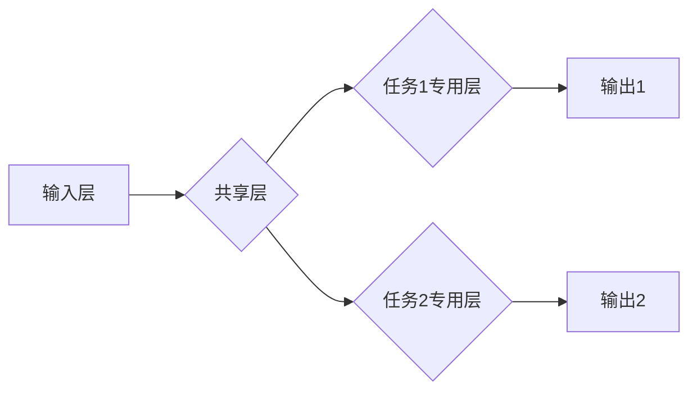

> 多任务学习，大模型，模型训练，迁移学习，性能提升，应用场景

## 1. 背景介绍

近年来，深度学习在计算机视觉、自然语言处理等领域取得了显著成就，这得益于模型规模的不断扩大和训练数据的丰富。然而，训练大型深度学习模型需要大量的计算资源和时间，并且每个模型通常只针对特定任务进行训练，导致模型的泛化能力有限。

多任务学习 (Multi-Task Learning, MTL) 作为一种有效的学习范式，旨在训练一个共享参数的模型来同时学习多个相关任务。通过共享参数，MTL 可以利用不同任务之间的相关性，提升模型的泛化能力和学习效率。

## 2. 核心概念与联系

**2.1 多任务学习的优势**

* **提升泛化能力:** MTL 通过学习多个相关任务，可以更好地捕捉数据的全局特征，从而提升模型在未见过的任务上的泛化能力。
* **提高学习效率:** MTL 可以利用不同任务之间的相关性，共享模型参数，从而减少训练所需的计算资源和时间。
* **促进知识迁移:** MTL 可以将已学习到的知识迁移到新的任务中，从而加速新任务的学习过程。

**2.2 MTL 与其他学习范式的联系**

* **迁移学习:** MTL 可以看作是一种特殊的迁移学习范式，其中源任务和目标任务之间存在着一定的相关性。
* **联合学习:** MTL 可以与联合学习相结合，训练多个模型共享一部分参数，从而进一步提升模型的性能。

**2.3 MTL 的架构**



**2.4 MTL 的挑战**

* **任务相关性:** MTL 的效果依赖于任务之间的相关性，如果任务之间不相关，MTL 的效果可能不如单任务学习。
* **任务权重:** 需要合理分配不同任务的权重，以平衡不同任务的学习效果。
* **模型复杂度:** MTL 模型通常比单任务学习模型更复杂，需要更多的计算资源和时间进行训练。

## 3. 核心算法原理 & 具体操作步骤

### 3.1  算法原理概述

MTL 的核心思想是共享模型参数，从而利用不同任务之间的相关性，提升模型的泛化能力和学习效率。

MTL 的训练目标是同时最小化所有任务的损失函数，通常采用加权平均的方式来平衡不同任务的贡献。

### 3.2  算法步骤详解

1. **数据预处理:** 对所有任务的数据进行预处理，例如数据清洗、特征提取等。
2. **模型构建:** 构建一个共享参数的模型，其中包含共享层和每个任务专用层。
3. **参数初始化:** 对模型参数进行初始化，可以使用随机初始化或预训练模型的参数。
4. **训练:** 使用梯度下降算法训练模型，同时最小化所有任务的损失函数。
5. **评估:** 在测试集上评估模型的性能，并根据需要调整模型参数或训练策略。

### 3.3  算法优缺点

**优点:**

* 提升泛化能力
* 提高学习效率
* 促进知识迁移

**缺点:**

* 任务相关性要求高
* 任务权重分配需要谨慎
* 模型复杂度较高

### 3.4  算法应用领域

* **自然语言处理:** 文本分类、情感分析、机器翻译等
* **计算机视觉:** 图像分类、目标检测、图像分割等
* **语音识别:** 语音识别、语音合成等
* **医疗诊断:** 病理图像分析、疾病预测等

## 4. 数学模型和公式 & 详细讲解 & 举例说明

### 4.1  数学模型构建

假设我们有 $T$ 个任务，每个任务都有自己的损失函数 $L_t(θ)$，其中 $θ$ 是模型参数。MTL 的目标是同时最小化所有任务的损失函数，可以使用加权平均的方式来平衡不同任务的贡献：

$$
L(θ) = \sum_{t=1}^{T} \lambda_t L_t(θ)
$$

其中，$\lambda_t$ 是第 $t$ 个任务的权重，满足 $\sum_{t=1}^{T} \lambda_t = 1$。

### 4.2  公式推导过程

MTL 的训练过程可以使用梯度下降算法进行优化。目标函数 $L(θ)$ 对参数 $θ$ 的梯度为：

$$
\nabla L(θ) = \sum_{t=1}^{T} \lambda_t \nabla L_t(θ)
$$

根据梯度下降算法，模型参数 $θ$ 的更新规则为：

$$
θ = θ - \eta \nabla L(θ)
$$

其中，$\eta$ 是学习率。

### 4.3  案例分析与讲解

例如，我们训练一个模型来同时进行图像分类和目标检测任务。我们可以将图像分类任务的损失函数设置为交叉熵损失，目标检测任务的损失函数设置为边界框回归损失。

在训练过程中，我们可以根据任务的重要性分配不同的权重，例如图像分类任务的权重设置为 0.7，目标检测任务的权重设置为 0.3。

## 5. 项目实践：代码实例和详细解释说明

### 5.1  开发环境搭建

* 操作系统: Ubuntu 20.04
* Python 版本: 3.8
* 深度学习框架: PyTorch 1.8

### 5.2  源代码详细实现

```python
import torch
import torch.nn as nn

class MultiTaskModel(nn.Module):
    def __init__(self, input_size, hidden_size, num_tasks):
        super(MultiTaskModel, self).__init__()
        self.shared_layer = nn.Linear(input_size, hidden_size)
        self.task_specific_layers = nn.ModuleList([
            nn.Linear(hidden_size, num_classes) for _ in range(num_tasks)
        ])

    def forward(self, x):
        x = self.shared_layer(x)
        outputs = [task_layer(x) for task_layer in self.task_specific_layers]
        return outputs

# 实例化模型
model = MultiTaskModel(input_size=100, hidden_size=50, num_tasks=2)

# 定义损失函数和优化器
criterion = nn.CrossEntropyLoss()
optimizer = torch.optim.Adam(model.parameters())

# 训练模型
for epoch in range(num_epochs):
    for batch_idx, (data, target) in enumerate(train_loader):
        optimizer.zero_grad()
        outputs = model(data)
        loss = criterion(outputs, target)
        loss.backward()
        optimizer.step()

```

### 5.3  代码解读与分析

* `MultiTaskModel` 类定义了多任务学习模型的结构，包含共享层和每个任务专用层。
* `forward` 方法定义了模型的正向传播过程，将输入数据传递到共享层，然后分别传递到每个任务专用层，得到每个任务的输出。
* `criterion` 定义了损失函数，用于衡量模型预测结果与真实标签之间的差异。
* `optimizer` 定义了优化器，用于更新模型参数。
* 训练循环迭代训练模型，计算损失函数，并根据梯度更新模型参数。

### 5.4  运行结果展示

训练完成后，可以将模型在测试集上进行评估，并观察模型在不同任务上的性能。

## 6. 实际应用场景

### 6.1  自然语言处理

* **文本分类:** MTL 可以训练一个模型来同时进行情感分析、主题分类和垃圾邮件过滤等任务。
* **机器翻译:** MTL 可以训练一个模型来同时进行多种语言的机器翻译。
* **问答系统:** MTL 可以训练一个模型来同时进行文本问答和对话系统。

### 6.2  计算机视觉

* **图像分类和目标检测:** MTL 可以训练一个模型来同时进行图像分类和目标检测任务。
* **图像分割和实例分割:** MTL 可以训练一个模型来同时进行图像分割和实例分割任务。
* **视频分析:** MTL 可以训练一个模型来同时进行视频分类、目标跟踪和行为识别等任务。

### 6.3  其他领域

* **医疗诊断:** MTL 可以训练一个模型来同时进行病理图像分析、疾病预测和药物发现等任务。
* **金融预测:** MTL 可以训练一个模型来同时进行股票预测、信用风险评估和欺诈检测等任务。

### 6.4  未来应用展望

随着大模型的不断发展，MTL 在更多领域将发挥越来越重要的作用。例如，可以训练一个通用多任务学习模型，能够适应各种不同的任务和领域。

## 7. 工具和资源推荐

### 7.1  学习资源推荐

* **书籍:**
    * Deep Learning by Ian Goodfellow, Yoshua Bengio, and Aaron Courville
    * Hands-On Machine Learning with Scikit-Learn, Keras & TensorFlow by Aurélien Géron
* **论文:**
    * Multi-Task Learning by Richard S. Sutton and Andrew G. Barto
    * Learning Transferable Features with Deep Neural Networks by Y. Bengio et al.
* **在线课程:**
    * Stanford CS231n: Convolutional Neural Networks for Visual Recognition
    * Deep Learning Specialization by Andrew Ng

### 7.2  开发工具推荐

* **深度学习框架:** PyTorch, TensorFlow, Keras
* **数据处理工具:** Pandas, NumPy
* **可视化工具:** Matplotlib, Seaborn

### 7.3  相关论文推荐

* **Multi-Task Learning with Deep Neural Networks** by Caruana et al. (1997)
* **Learning Transferable Features with Deep Neural Networks** by Y. Bengio et al. (2012)
* **Multi-Task Deep Reinforcement Learning** by J. Finn et al. (2017)

## 8. 总结：未来发展趋势与挑战

### 8.1  研究成果总结

MTL 在近年来取得了显著的进展，在多个领域取得了优异的性能。

### 8.2  未来发展趋势

* **大规模多任务学习:** 随着大模型的不断发展，将训练更大规模、更复杂的 multi-task learning 模型。
* **自适应多任务学习:** 开发能够自动学习任务重要性和调整任务权重的自适应 MTL 方法。
* **跨模态多任务学习:** 训练能够处理多种模态数据的 multi-task learning 模型，例如文本、图像、音频等。

### 8.3  面临的挑战

* **任务相关性:** 找到具有良好相关性的任务组合仍然是一个挑战。
* **模型复杂度:** 训练大型多任务学习模型需要大量的计算资源和时间。
* **数据稀缺性:** 某些任务的数据可能稀缺，这会影响模型的训练效果。

### 8.4  研究展望

未来，MTL 将继续是一个重要的研究方向，有望在更多领域发挥重要作用。


## 9. 附录：常见问题与解答

**1. MTL 与单任务学习相比有什么优势？**

MTL 可以利用不同任务之间的相关性，提升模型的泛化能力和学习效率。

**2. 如何选择合适的任务组合进行 MTL？**

任务组合的选择需要考虑任务之间的相关性、数据量和模型复杂度等因素。

**3. 如何平衡不同任务的权重？**

可以使用交叉验证等方法来确定每个任务的最佳权重。

**4. MTL 的训练过程与单任务学习有什么区别？**

MTL 的训练目标是同时最小化所有任务的损失函数，而单任务学习的目标是最小化单个任务的损失函数。

**5. MTL 的应用场景有哪些？**

MTL 在自然语言处理、计算机视觉、语音识别、医疗诊断等多个领域都有广泛的应用。


作者：禅与计算机程序设计艺术 / Zen and the Art of Computer Programming 
<end_of_turn>