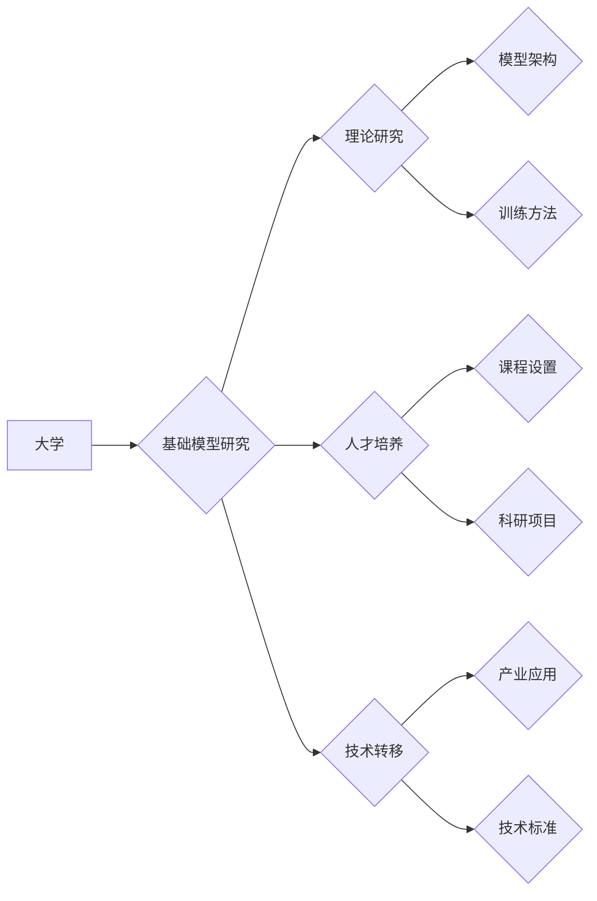

> 基础模型、大学、研究使命、人工智能、深度学习、知识图谱、数据科学、伦理

## 1. 背景介绍

人工智能（AI）正以惊人的速度发展，基础模型作为其核心驱动力，正在深刻地改变着我们生活和工作的方式。基础模型是指在海量数据上预训练的大规模深度学习模型，具备强大的泛化能力和适应性，能够应用于各种下游任务，例如自然语言处理、计算机视觉、语音识别等。

大学作为高等教育的摇篮，肩负着培养人才、推动科技进步的重任。在AI时代，大学在基础模型研究中的使命显得尤为重要。一方面，大学拥有顶尖的科研团队和雄厚的科研实力，能够进行前沿的基础模型研究，推动该领域的理论和技术发展；另一方面，大学是培养未来AI人才的重要场所，需要为学生提供学习基础模型的平台和机会，培养他们成为AI领域的领军人才。

## 2. 核心概念与联系

**2.1 基础模型**

基础模型是深度学习领域的一个重要概念，指的是在海量数据上预训练的大规模神经网络模型。这些模型通常具有以下特点：

* **规模庞大:** 基础模型通常拥有数十亿甚至数千亿个参数，比传统的深度学习模型规模要大得多。
* **预训练:** 基础模型在大量未标记数据上进行预训练，学习到通用的语言表示或特征。
* **泛化能力强:** 由于预训练，基础模型能够应用于各种下游任务，并表现出较强的泛化能力。

**2.2 大学在基础模型研究中的角色**

大学在基础模型研究中扮演着多重角色：

* **基础研究:** 大学科研团队可以进行基础模型的理论研究，探索新的模型架构、训练方法和应用场景。
* **人才培养:** 大学可以为学生提供学习基础模型的课程和平台，培养未来AI领域的领军人才。
* **技术转移:** 大学可以将基础模型研究成果转化为实际应用，推动产业发展。

**2.3 基础模型与大学的联系**

大学和基础模型之间存在着密切的联系：

* **数据资源:** 大学拥有丰富的学术数据资源，可以为基础模型的训练提供数据支持。
* **科研人才:** 大学拥有众多优秀的科研人员，可以进行基础模型的研究和开发。
* **教育平台:** 大学可以为学生提供学习基础模型的平台和机会，培养未来AI人才。

**2.4 基础模型研究的未来趋势**

基础模型研究是一个快速发展的领域，未来将朝着以下几个方向发展：

* **模型规模的进一步扩大:** 模型规模将继续扩大，以提高模型的性能和泛化能力。
* **模型训练方法的创新:** 将探索新的模型训练方法，例如自监督学习、强化学习等，以提高模型的效率和鲁棒性。
* **模型应用场景的拓展:** 基础模型将应用于更多领域，例如医疗、教育、金融等，为社会带来更多价值。

**Mermaid 流程图**



## 3. 核心算法原理 & 具体操作步骤

### 3.1 算法原理概述

基础模型的训练主要基于深度学习算法，其中Transformer模型是目前最流行的架构之一。Transformer模型的核心思想是利用注意力机制来捕捉序列数据中的长距离依赖关系，从而提高模型的理解和生成能力。

### 3.2 算法步骤详解

基础模型的训练过程可以概括为以下步骤：

1. **数据预处理:** 将原始数据进行清洗、格式化和编码，使其能够被模型理解。
2. **模型初始化:** 初始化模型参数，通常使用随机初始化的方法。
3. **前向传播:** 将预处理后的数据输入模型，计算模型的输出。
4. **损失函数计算:** 计算模型输出与真实值的差异，即损失函数的值。
5. **反向传播:** 计算损失函数对模型参数的梯度，并根据梯度更新模型参数。
6. **迭代训练:** 重复步骤3-5，直到模型的性能达到预期的水平。

### 3.3 算法优缺点

**优点:**

* 泛化能力强: 预训练模型能够应用于各种下游任务，并表现出较强的泛化能力。
* 训练效率高: 预训练模型可以利用已有模型的知识，减少训练时间和资源消耗。
* 可解释性高: Transformer模型的注意力机制可以帮助我们理解模型的决策过程。

**缺点:**

* 计算资源需求高: 基础模型通常规模庞大，训练需要大量的计算资源。
* 数据依赖性强: 基础模型的性能取决于训练数据的质量和数量。
* 潜在的偏见: 基础模型可能存在训练数据中的偏见，需要进行相应的处理和缓解。

### 3.4 算法应用领域

基础模型在各个领域都有广泛的应用，例如：

* **自然语言处理:** 文本生成、机器翻译、问答系统等。
* **计算机视觉:** 图像识别、目标检测、图像生成等。
* **语音识别:** 语音转文本、语音合成等。
* **推荐系统:** 商品推荐、内容推荐等。

## 4. 数学模型和公式 & 详细讲解 & 举例说明

### 4.1 数学模型构建

Transformer模型的核心是注意力机制，其数学模型可以表示为：

$$
Attention(Q, K, V) = softmax(\frac{QK^T}{\sqrt{d_k}})V
$$

其中：

* $Q$：查询矩阵
* $K$：键矩阵
* $V$：值矩阵
* $d_k$：键向量的维度
* $softmax$：softmax函数

### 4.2 公式推导过程

注意力机制的目的是计算查询向量与键向量的相关性，并根据相关性对值向量进行加权求和。

* $QK^T$：计算查询向量与键向量的点积，得到一个得分矩阵。
* $\frac{QK^T}{\sqrt{d_k}}$：对得分矩阵进行归一化，使得每个元素的范围在0到1之间。
* $softmax$：对归一化后的得分矩阵进行softmax操作，得到每个键向量的权重。
* $V$：将权重与值向量相乘，得到最终的输出。

### 4.3 案例分析与讲解

例如，在机器翻译任务中，查询向量可以表示源语言的词语，键向量可以表示目标语言的词语，值向量可以表示目标语言的词语的含义。注意力机制可以帮助模型找到源语言词语与目标语言词语之间的对应关系，从而提高翻译的准确性。

## 5. 项目实践：代码实例和详细解释说明

### 5.1 开发环境搭建

* 操作系统: Ubuntu 20.04
* Python 版本: 3.8
* CUDA 版本: 11.0
* cuDNN 版本: 8.0

### 5.2 源代码详细实现

```python
import torch
import torch.nn as nn

class Transformer(nn.Module):
    def __init__(self, vocab_size, embedding_dim, num_heads, num_layers):
        super(Transformer, self).__init__()
        self.embedding = nn.Embedding(vocab_size, embedding_dim)
        self.transformer_layers = nn.ModuleList([
            nn.TransformerEncoderLayer(embedding_dim, num_heads)
            for _ in range(num_layers)
        ])
        self.linear = nn.Linear(embedding_dim, vocab_size)

    def forward(self, x):
        x = self.embedding(x)
        for layer in self.transformer_layers:
            x = layer(x)
        x = self.linear(x)
        return x
```

### 5.3 代码解读与分析

* `__init__` 方法: 初始化模型参数，包括词嵌入层、Transformer编码器层和输出层。
* `forward` 方法: 定义模型的正向传播过程，将输入序列经过词嵌入层、Transformer编码器层和输出层，最终得到输出序列。

### 5.4 运行结果展示

训练完成后，可以使用模型对新的文本进行预测，例如翻译、生成等。

## 6. 实际应用场景

基础模型在各个领域都有广泛的应用，例如：

### 6.1 自然语言处理

* **机器翻译:** 基于Transformer模型的机器翻译系统，例如Google Translate，能够实现高质量的文本翻译。
* **文本摘要:** 基于Transformer模型的文本摘要系统，能够自动生成文本的简要概述。
* **问答系统:** 基于Transformer模型的问答系统，能够理解用户的问题并给出准确的答案。

### 6.2 计算机视觉

* **图像识别:** 基于Transformer模型的图像识别系统，能够识别图像中的物体和场景。
* **目标检测:** 基于Transformer模型的目标检测系统，能够定位图像中的目标物体。
* **图像生成:** 基于Transformer模型的图像生成系统，能够生成逼真的图像。

### 6.3 语音识别

* **语音转文本:** 基于Transformer模型的语音转文本系统，能够将语音信号转换为文本。
* **语音合成:** 基于Transformer模型的语音合成系统，能够将文本转换为语音。

### 6.4 未来应用展望

基础模型的应用前景广阔，未来将应用于更多领域，例如：

* **医疗诊断:** 基于Transformer模型的医疗诊断系统，能够辅助医生诊断疾病。
* **教育教学:** 基于Transformer模型的教育教学系统，能够个性化定制学习内容。
* **金融分析:** 基于Transformer模型的金融分析系统，能够分析市场趋势并提供投资建议。

## 7. 工具和资源推荐

### 7.1 学习资源推荐

* **书籍:**
    * 《深度学习》
    * 《Transformer模型详解》
* **在线课程:**
    * Coursera: 深度学习
    * Udacity: 自然语言处理
* **博客:**
    * The Gradient
    * Towards Data Science

### 7.2 开发工具推荐

* **框架:**
    * PyTorch
    * TensorFlow
* **库:**
    * Hugging Face Transformers
    * OpenAI GPT-3 API

### 7.3 相关论文推荐

* 《Attention Is All You Need》
* 《BERT: Pre-training of Deep Bidirectional Transformers for Language Understanding》
* 《GPT-3: Language Models are Few-Shot Learners》

## 8. 总结：未来发展趋势与挑战

### 8.1 研究成果总结

基础模型研究取得了显著进展，模型规模不断扩大，性能不断提升，应用领域不断拓展。

### 8.2 未来发展趋势

基础模型研究将朝着以下几个方向发展：

* **模型规模的进一步扩大:** 模型规模将继续扩大，以提高模型的性能和泛化能力。
* **模型训练方法的创新:** 将探索新的模型训练方法，例如自监督学习、强化学习等，以提高模型的效率和鲁棒性。
* **模型应用场景的拓展:** 基础模型将应用于更多领域，例如医疗、教育、金融等，为社会带来更多价值。

### 8.3 面临的挑战

基础模型研究也面临着一些挑战：

* **计算资源需求高:** 基础模型的训练需要大量的计算资源，这对于资源有限的机构和个人来说是一个挑战。
* **数据依赖性强:** 基础模型的性能取决于训练数据的质量和数量，而高质量的训练数据往往难以获取。
* **潜在的偏见:** 基础模型可能存在训练数据中的偏见，需要进行相应的处理和缓解。

### 8.4 研究展望

未来，基础模型研究将继续深入，推动人工智能技术的发展，为人类社会带来更多福祉。大学作为人工智能研究的中心，将继续发挥重要作用，培养人才、推动创新，为基础模型研究做出更大的贡献。

## 9. 附录：常见问题与解答

### 9.1 什么