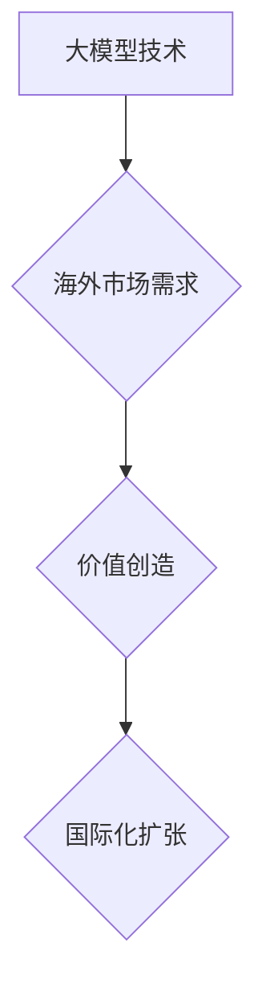

> 大模型、国际化扩张、战略规划、市场分析、技术适配、人才培养、法律法规、文化差异、风险管理

## 1. 背景介绍

近年来，大模型技术蓬勃发展，其强大的泛化能力和应用潜力吸引了全球各地的目光。从自然语言处理到计算机视觉，从药物研发到金融预测，大模型正在深刻地改变着各行各业。与此同时，大模型企业也开始积极寻求国际化扩张，以开拓更广阔的市场和资源。然而，国际化扩张并非易事，大模型企业需要面对诸多挑战，例如文化差异、法律法规、技术适配等。

## 2. 核心概念与联系

**2.1 大模型概述**

大模型是指参数规模庞大、训练数据海量的人工智能模型。其强大的学习能力使其能够在各种任务上表现出色，并具备一定的泛化能力，能够应用于不同的领域和场景。

**2.2 国际化扩张**

国际化扩张是指企业将业务范围扩展到海外市场，包括但不限于设立海外分公司、收购海外公司、建立海外合作伙伴关系等。

**2.3 核心概念联系**

大模型企业国际化扩张的核心在于将大模型技术优势与海外市场需求相结合，创造新的价值。

**2.4 核心架构**

## 3. 核心算法原理 & 具体操作步骤

**3.1 算法原理概述**

大模型的训练主要基于深度学习算法，例如Transformer、BERT等。这些算法通过多层神经网络结构，学习数据中的复杂模式和关系，从而实现对语言、图像等数据的理解和生成。

**3.2 算法步骤详解**

1. **数据收集和预处理:** 收集大量相关数据，并进行清洗、格式化等预处理操作。
2. **模型构建:** 根据任务需求选择合适的深度学习模型架构，并设置模型参数。
3. **模型训练:** 使用训练数据训练模型，通过调整模型参数，使模型在预测任务上达到最佳性能。
4. **模型评估:** 使用测试数据评估模型的性能，并进行必要的调整和优化。
5. **模型部署:** 将训练好的模型部署到实际应用场景中，例如网站、应用程序等。

**3.3 算法优缺点**

**优点:**

* 强大的泛化能力，能够应用于多种任务和领域。
* 能够学习数据中的复杂模式和关系，实现更精准的预测和生成。

**缺点:**

* 训练成本高，需要大量数据和计算资源。
* 模型解释性差，难以理解模型的决策过程。

**3.4 算法应用领域**

* 自然语言处理：机器翻译、文本摘要、问答系统等。
* 计算机视觉：图像识别、物体检测、图像生成等。
* 金融预测：股票预测、风险评估等。
* 药物研发：药物发现、药物设计等。

## 4. 数学模型和公式 & 详细讲解 & 举例说明

**4.1 数学模型构建**

大模型训练的核心是优化模型参数，使其能够最小化预测误差。常用的优化算法包括梯度下降法、Adam优化器等。

**4.2 公式推导过程**

梯度下降法的核心公式为：

$$
\theta = \theta - \alpha \nabla L(\theta)
$$

其中：

* $\theta$：模型参数
* $\alpha$：学习率
* $\nabla L(\theta)$：损失函数对模型参数的梯度

**4.3 案例分析与讲解**

假设我们训练一个图像分类模型，损失函数为交叉熵损失函数。通过梯度下降法，我们可以计算出模型参数的梯度，并根据梯度方向更新模型参数，从而降低损失函数的值，最终实现图像分类任务。

## 5. 项目实践：代码实例和详细解释说明

**5.1 开发环境搭建**

大模型开发通常需要强大的计算资源，例如GPU。可以使用云计算平台，例如AWS、Google Cloud、Azure等，搭建开发环境。

**5.2 源代码详细实现**

可以使用深度学习框架，例如TensorFlow、PyTorch等，实现大模型的训练和部署。

**5.3 代码解读与分析**

代码中包含了模型架构定义、数据加载、模型训练、模型评估等步骤。

**5.4 运行结果展示**

训练好的模型可以用于实际应用场景，例如图像识别、文本生成等，并展示模型的性能指标，例如准确率、F1-score等。

## 6. 实际应用场景

**6.1 跨语言沟通**

大模型可以用于构建跨语言沟通工具，例如机器翻译、实时语音翻译等，打破语言障碍，促进全球交流。

**6.2 个性化教育**

大模型可以用于个性化教育，根据学生的学习进度和需求，提供定制化的学习内容和辅导。

**6.3 智能客服**

大模型可以用于构建智能客服系统，自动处理客户咨询，提高服务效率。

**6.4 未来应用展望**

大模型的应用场景还在不断拓展，未来将应用于更多领域，例如医疗诊断、科学研究、艺术创作等。

## 7. 工具和资源推荐

**7.1 学习资源推荐**

* 深度学习书籍：深度学习，动手学深度学习
* 在线课程：Coursera、edX、Udacity等平台提供深度学习课程。
* 代码库：GitHub、HuggingFace等平台提供开源深度学习代码。

**7.2 开发工具推荐**

* 深度学习框架：TensorFlow、PyTorch、Keras等。
* 云计算平台：AWS、Google Cloud、Azure等。
* 数据处理工具：Pandas、NumPy等。

**7.3 相关论文推荐**

* Attention Is All You Need
* BERT: Pre-training of Deep Bidirectional Transformers for Language Understanding

## 8. 总结：未来发展趋势与挑战

**8.1 研究成果总结**

近年来，大模型技术取得了显著进展，模型规模不断扩大，性能不断提升。大模型已在多个领域取得成功应用，展现出巨大的潜力。

**8.2 未来发展趋势**

* 模型规模进一步扩大，模型能力进一步提升。
* 模型训练效率提高，降低训练成本。
* 模型解释性增强，提高模型可信度。
* 大模型应用场景更加广泛，覆盖更多领域。

**8.3 面临的挑战**

* 数据获取和隐私保护
* 计算资源需求
* 模型安全性和可控性
* 伦理和社会影响

**8.4 研究展望**

未来，大模型研究将继续朝着更安全、更可靠、更可解释的方向发展，并探索更多新的应用场景，为人类社会带来更多福祉。

## 9. 附录：常见问题与解答

**9.1 如何选择合适的深度学习框架？**

选择深度学习框架需要考虑项目需求、开发人员经验、社区支持等因素。

**9.2 如何解决大模型训练的计算资源问题？**

可以使用云计算平台，例如AWS、Google Cloud、Azure等，租用计算资源进行大模型训练。

**9.3 如何保证大模型的安全性？**

需要采取多种措施保证大模型的安全性，例如数据加密、模型审计、对抗攻击防御等。

作者：禅与计算机程序设计艺术 / Zen and the Art of Computer Programming 
<end_of_turn>