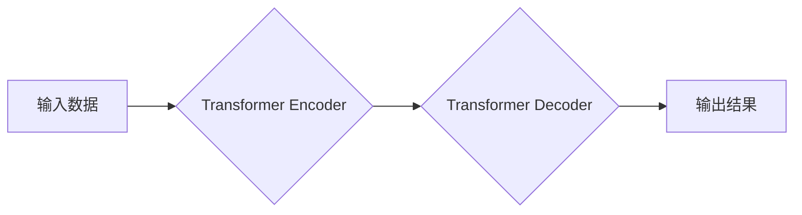

> 大模型、人工智能、创业潮、互联网大厂、技术趋势、商业应用

## 1. 背景介绍

近年来，人工智能（AI）技术突飞猛进，特别是大模型的出现，为各行各业带来了前所未有的机遇。大模型，是指参数规模庞大、训练数据海量的人工智能模型，具备强大的泛化能力和学习能力，能够在自然语言处理、计算机视觉、语音识别等领域取得突破性进展。

互联网巨头们也意识到了大模型的巨大潜力，纷纷投入巨资进行研发和应用。从谷歌的LaMDA、OpenAI的GPT-3到百度、阿里、腾讯等国内企业的巨量模型，大模型的竞争格局日益激烈。

与此同时，大模型技术也吸引了一批创业者，他们看到了大模型在商业领域的应用前景，并积极开发基于大模型的创新产品和服务。

## 2. 核心概念与联系

### 2.1 大模型的概念

大模型是指参数规模庞大、训练数据海量的人工智能模型。其核心特点是：

* **参数规模巨大:** 大模型通常拥有数十亿甚至数千亿个参数，这使得它们能够学习到更复杂的模式和关系。
* **训练数据海量:** 大模型的训练需要大量的文本、图像、音频等数据，这些数据可以帮助模型更好地理解和生成人类语言和内容。
* **泛化能力强:** 由于参数规模庞大，训练数据海量，大模型能够在不同的任务和领域中表现出较强的泛化能力，即能够应用于未见过的场景和数据。

### 2.2 大模型的架构

大模型的架构通常基于 Transformer 网络，Transformer 网络是一种专门用于处理序列数据的网络结构，其核心特点是自注意力机制，能够捕捉序列数据中的长距离依赖关系。

**Mermaid 流程图:**



### 2.3 大模型的应用场景

大模型在各个领域都有广泛的应用场景，例如：

* **自然语言处理:** 文本生成、机器翻译、问答系统、对话系统等。
* **计算机视觉:** 图像识别、物体检测、图像生成等。
* **语音识别:** 语音转文本、语音合成等。
* **推荐系统:** 商品推荐、内容推荐等。

## 3. 核心算法原理 & 具体操作步骤

### 3.1 算法原理概述

大模型的训练基于深度学习算法，具体来说是使用反向传播算法来优化模型参数。

反向传播算法的核心思想是：

1. 将输入数据输入到模型中，得到输出结果。
2. 计算输出结果与真实值的误差。
3. 根据误差反向传播，调整模型参数，使得误差最小化。

### 3.2 算法步骤详解

大模型训练的具体步骤如下：

1. **数据预处理:** 将原始数据进行清洗、格式化、编码等操作，使其能够被模型理解。
2. **模型构建:** 根据任务需求选择合适的模型架构，并初始化模型参数。
3. **模型训练:** 将预处理后的数据输入到模型中，使用反向传播算法进行训练，不断调整模型参数，使得模型的预测结果越来越准确。
4. **模型评估:** 在训练完成后，使用测试数据评估模型的性能，例如准确率、召回率、F1-score等。
5. **模型调优:** 根据评估结果，调整模型参数、训练策略等，进一步提高模型性能。

### 3.3 算法优缺点

**优点:**

* 能够学习到复杂的模式和关系。
* 泛化能力强，能够应用于不同的任务和领域。

**缺点:**

* 训练成本高，需要大量的计算资源和训练数据。
* 模型解释性差，难以理解模型的决策过程。

### 3.4 算法应用领域

大模型的应用领域非常广泛，包括：

* **自然语言处理:** 文本生成、机器翻译、问答系统、对话系统等。
* **计算机视觉:** 图像识别、物体检测、图像生成等。
* **语音识别:** 语音转文本、语音合成等。
* **推荐系统:** 商品推荐、内容推荐等。

## 4. 数学模型和公式 & 详细讲解 & 举例说明

### 4.1 数学模型构建

大模型的训练基于深度学习算法，其核心是构建一个复杂的数学模型，该模型能够将输入数据映射到输出结果。

**损失函数:**

损失函数用于衡量模型预测结果与真实值的差异。常用的损失函数包括均方误差（MSE）、交叉熵损失（Cross-Entropy Loss）等。

**优化算法:**

优化算法用于调整模型参数，使得损失函数最小化。常用的优化算法包括梯度下降（Gradient Descent）、Adam优化器（Adam Optimizer）等。

### 4.2 公式推导过程

**梯度下降算法:**

梯度下降算法的核心思想是沿着损失函数的负梯度方向更新模型参数。

公式：

$$
\theta_{t+1} = \theta_t - \eta \nabla L(\theta_t)
$$

其中：

* $\theta$ 表示模型参数。
* $t$ 表示迭代次数。
* $\eta$ 表示学习率。
* $\nabla L(\theta_t)$ 表示损失函数 $L$ 在当前参数 $\theta_t$ 处的梯度。

### 4.3 案例分析与讲解

假设我们训练一个图像分类模型，目标是将图像分类为不同的类别。

损失函数可以选择交叉熵损失，因为图像分类任务是多分类问题。

优化算法可以选择Adam优化器，因为它能够自动调整学习率，并具有较快的收敛速度。

通过梯度下降算法，不断更新模型参数，使得模型能够将图像准确地分类到不同的类别。

## 5. 项目实践：代码实例和详细解释说明

### 5.1 开发环境搭建

为了开发大模型项目，需要搭建一个合适的开发环境。

常用的开发环境包括：

* **Python:** 大模型开发的常用编程语言。
* **TensorFlow/PyTorch:** 大模型训练和推理的常用框架。
* **GPU:** 大模型训练需要大量的计算资源，GPU能够提供强大的计算能力。

### 5.2 源代码详细实现

以下是一个使用 TensorFlow 框架训练一个简单的文本生成模型的代码示例：

```python
import tensorflow as tf

# 定义模型架构
model = tf.keras.Sequential([
    tf.keras.layers.Embedding(input_dim=10000, output_dim=128),
    tf.keras.layers.LSTM(units=128),
    tf.keras.layers.Dense(units=10000, activation='softmax')
])

# 编译模型
model.compile(optimizer='adam', loss='sparse_categorical_crossentropy', metrics=['accuracy'])

# 训练模型
model.fit(x_train, y_train, epochs=10)

# 评估模型
loss, accuracy = model.evaluate(x_test, y_test)
print('Loss:', loss)
print('Accuracy:', accuracy)
```

### 5.3 代码解读与分析

这段代码定义了一个简单的文本生成模型，该模型使用 Embedding 层将单词映射到向量空间，使用 LSTM 层捕捉文本序列中的长距离依赖关系，最后使用 Dense 层生成下一个单词的概率分布。

模型使用 Adam 优化器、交叉熵损失函数和准确率作为评估指标进行训练。

### 5.4 运行结果展示

训练完成后，可以将模型应用于文本生成任务，例如生成诗歌、小说、对话等。

## 6. 实际应用场景

### 6.1 自然语言处理

大模型在自然语言处理领域有着广泛的应用场景，例如：

* **机器翻译:** 使用大模型可以实现更高质量的机器翻译，例如 Google Translate。
* **问答系统:** 大模型可以训练出能够回答复杂问题的问答系统，例如微软的 XiaoIce。
* **对话系统:** 大模型可以训练出能够进行自然对话的对话系统，例如 OpenAI 的 ChatGPT。

### 6.2 计算机视觉

大模型在计算机视觉领域也取得了突破性进展，例如：

* **图像识别:** 大模型可以实现对图像的准确识别，例如 Google 的 ImageNet。
* **物体检测:** 大模型可以检测图像中物体的类别和位置，例如 Tesla 的 Autopilot。
* **图像生成:** 大模型可以生成逼真的图像，例如 OpenAI 的 DALL-E 2。

### 6.3 其他应用场景

大模型还可以应用于其他领域，例如：

* **语音识别:** 大模型可以实现更准确的语音识别，例如 Apple 的 Siri。
* **推荐系统:** 大模型可以根据用户的行为和偏好推荐更精准的内容，例如 Netflix 的推荐系统。
* **药物研发:** 大模型可以帮助科学家发现新的药物和治疗方法。

### 6.4 未来应用展望

随着大模型技术的不断发展，其应用场景将会更加广泛，例如：

* **个性化教育:** 大模型可以根据学生的学习情况提供个性化的学习方案。
* **智能客服:** 大模型可以训练出能够提供更智能和高效的客服服务。
* **自动写作:** 大模型可以帮助人们自动生成各种类型的文本，例如新闻报道、小说、诗歌等。

## 7. 工具和资源推荐

### 7.1 学习资源推荐

* **书籍:**
    * 《深度学习》
    * 《自然语言处理》
    * 《机器学习》
* **在线课程:**
    * Coursera
    * edX
    * Udacity
* **博客和论坛:**
    * TensorFlow Blog
    * PyTorch Blog
    * Stack Overflow

### 7.2 开发工具推荐

* **TensorFlow:** 开源深度学习框架。
* **PyTorch:** 开源深度学习框架。
* **Jupyter Notebook:** 用于编写和运行代码的交互式环境。
* **Git:** 用于版本控制的工具。

### 7.3 相关论文推荐

* **Attention Is All You Need:** https://arxiv.org/abs/1706.03762
* **BERT: Pre-training of Deep Bidirectional Transformers for Language Understanding:** https://arxiv.org/abs/1810.04805
* **GPT-3: Language Models are Few-Shot Learners:** https://arxiv.org/abs/2005.14165

## 8. 总结：未来发展趋势与挑战

### 8.1 研究成果总结

近年来，大模型技术取得了显著进展，在各个领域都展现出巨大的潜力。

大模型的出现，标志着人工智能进入了一个新的时代，其应用场景将会更加广泛，对人类社会的影响也将更加深远。

### 8.2 未来发展趋势

未来，大模型技术将朝着以下几个方向发展：

* **模型规模更大:** 模型参数规模将继续扩大，从而提升模型的性能。
* **训练效率更高:** 训练大模型需要大量的计算资源，因此将研究更高效的训练方法。
* **模型解释性更强:** 提高模型的解释性，使得人们能够更好地理解模型的决策过程。
* **应用场景更广泛:** 大模型将应用于更多领域，例如医疗、教育、金融等。

### 8.3 面临的挑战

大模型技术也面临着一些挑战：

* **数据获取和隐私问题:** 大模型的训练需要海量数据，如何获取高质量数据并保护用户隐私是一个重要问题。
* **计算资源需求:** 训练大模型需要大量的计算资源，这对于资源有限的机构和个人来说是一个挑战。
* **模型安全性:** 大模型可能被用于恶意目的，例如生成虚假信息、进行网络攻击等，因此需要加强模型的安全性和可控性。

### 8.4 研究展望

未来，大模型研究将继续深入，探索更强大的模型架构、更有效的训练方法和更广泛的应用场景。

大模型技术将深刻地改变我们的生活，为人类社会带来更多机遇和挑战。

## 9. 附录：常见问题与解答

### 9.1 什么是大模型？

大模型是指参数规模庞大、训练数据海量的人工