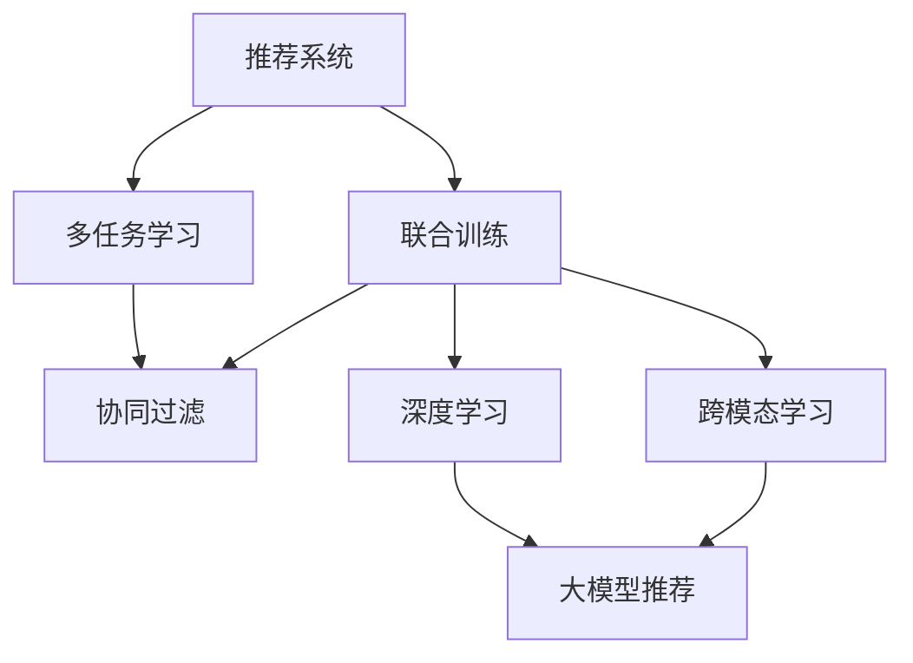

                 

# 大模型推荐中的多任务学习方法

> 关键词：大模型推荐、多任务学习、联合训练、协同过滤、跨模态、深度学习

## 1. 背景介绍

推荐系统是现代信息技术的重要应用之一，广泛应用于电商、社交、媒体、内容分发等领域。随着数据量的爆炸式增长和计算能力的不断提升，推荐系统的建模方法也从传统协同过滤、矩阵分解等浅层模型，逐渐演进到深度神经网络等更为复杂的模型。其中，深度学习大模型凭借其强大的建模能力，已经在推荐系统领域取得了显著的成果。

然而，推荐系统本质上是一个多任务学习问题。不同用户和物品之间存在复杂的交互关系，单一任务的建模很难全面覆盖这些关系。而多任务学习方法通过联合多个任务进行模型训练，可以更全面地理解用户和物品之间的关系，从而提升推荐系统的效果。

本文将对大模型推荐中的多任务学习方法进行详细阐述，包括其核心原理、具体操作步骤、实际应用等，并结合具体案例和代码实例，帮助读者全面理解这一前沿技术。

## 2. 核心概念与联系

### 2.1 核心概念概述

为更好地理解多任务学习在大模型推荐中的应用，本节将介绍几个密切相关的核心概念：

- 推荐系统：旨在根据用户历史行为、物品属性等数据，为用户推荐合适的物品，提升用户体验和满意度。
- 多任务学习：指在模型训练过程中，联合多个任务进行学习，共同优化模型参数。多任务学习可以提高模型泛化能力，缓解过拟合风险。
- 联合训练：指在多任务学习中，多个任务共同共享模型的参数和数据，进行联合优化。可以提升模型的收敛速度和泛化能力。
- 协同过滤：基于用户-物品交互矩阵，利用相似度度量找到用户可能感兴趣的物品。是推荐系统中最经典的浅层方法之一。
- 深度学习：利用多层神经网络进行特征学习和表示学习，在推荐系统中广泛应用。
- 跨模态学习：指将不同模态（如文本、图像、音频等）的数据融合，提升推荐系统的表现。
- 大模型推荐：利用大语言模型、大图像模型等预训练模型，进行推荐任务建模。

这些概念之间的逻辑关系可以通过以下Mermaid流程图来展示：



这个流程图展示了大模型推荐的多任务学习核心概念及其之间的关系：

1. 推荐系统通过联合多任务学习进行模型训练，涵盖协同过滤、深度学习、跨模态学习等任务。
2. 多任务学习利用联合训练技术，提高模型泛化能力，缓解过拟合风险。
3. 深度学习和大模型推荐是大模型推荐中的两种关键技术，可用于协同过滤和跨模态学习等任务。

这些核心概念共同构成了大模型推荐的多任务学习框架，使其能够更全面地理解用户和物品之间的关系，提升推荐系统的效果。

## 3. 核心算法原理 & 具体操作步骤
### 3.1 算法原理概述

基于多任务学习的大模型推荐，本质上是一个联合多个任务进行模型优化的过程。其核心思想是：利用用户-物品交互矩阵、物品属性、文本描述等数据，联合训练多任务模型，从而提升推荐系统的性能。

具体来说，假设推荐系统的输入为 $X$（用户-物品交互矩阵）和 $Y$（物品属性、文本描述等），输出为推荐结果 $Z$。多任务学习的目标是联合优化多个任务的目标函数，最小化模型在不同任务上的损失。

假设模型的参数为 $\theta$，不同任务对应的损失函数分别为 $\mathcal{L}_1$（协同过滤任务）、$\mathcal{L}_2$（深度学习任务）等，联合训练的目标函数为：

$$
\mathcal{L}(\theta) = \alpha_1 \mathcal{L}_1(\theta) + \alpha_2 \mathcal{L}_2(\theta) + \ldots + \alpha_n \mathcal{L}_n(\theta)
$$

其中 $\alpha_i$ 为不同任务的权重，通常根据任务的重要性和数据量进行调整。通过最小化联合目标函数 $\mathcal{L}(\theta)$，可以同时优化多个任务，提升模型的泛化能力和推荐性能。

### 3.2 算法步骤详解

基于多任务学习的大模型推荐一般包括以下几个关键步骤：

**Step 1: 准备数据集**
- 收集用户-物品交互数据 $X$，进行预处理（如缺失值填充、数据归一化等）。
- 收集物品属性、文本描述等数据 $Y$，进行特征提取和编码。

**Step 2: 设计联合训练模型**
- 选择合适的深度学习模型，如Transformer、GNN等。
- 设计多个任务的目标函数，如协同过滤任务、深度学习任务等。
- 确定各任务的权重 $\alpha_i$。

**Step 3: 设置联合训练超参数**
- 选择合适的优化算法及其参数，如 AdamW、SGD 等。
- 设置学习率、批大小、迭代轮数等。
- 设置正则化技术及强度，如L2正则、Dropout等。

**Step 4: 执行联合训练**
- 将训练集数据分批次输入模型，前向传播计算联合损失函数。
- 反向传播计算参数梯度，根据设定的优化算法和学习率更新模型参数。
- 周期性在验证集上评估模型性能，根据性能指标决定是否触发 Early Stopping。
- 重复上述步骤直到满足预设的迭代轮数或 Early Stopping 条件。

**Step 5: 测试和部署**
- 在测试集上评估联合训练后模型 $Z_{\theta}$ 的性能，对比联合训练前后的精度提升。
- 使用联合训练后的模型对新样本进行推荐预测，集成到实际的应用系统中。
- 持续收集新的数据，定期重新联合训练模型，以适应数据分布的变化。

以上是基于多任务学习的大模型推荐的一般流程。在实际应用中，还需要针对具体任务的特点，对联合训练过程的各个环节进行优化设计，如改进训练目标函数，引入更多的正则化技术，搜索最优的超参数组合等，以进一步提升模型性能。

### 3.3 算法优缺点

基于多任务学习的大模型推荐方法具有以下优点：
1. 全面覆盖用户和物品之间的关系。多任务学习联合了多个任务，可以更全面地理解用户和物品之间的交互关系，提升推荐系统的效果。
2. 提高模型的泛化能力。多任务学习可以提高模型的泛化能力，使得模型在新数据上的表现更稳健。
3. 缓解过拟合风险。多任务学习通过联合多个任务，可以减少过拟合风险，提升模型的泛化能力。
4. 减少标注数据需求。多任务学习可以利用用户-物品交互数据等未标注数据，降低标注成本。

同时，该方法也存在一定的局限性：
1. 模型复杂度较高。多任务学习需要同时优化多个任务，模型参数和计算复杂度都会增加。
2. 任务之间的依赖性。多任务学习中的各个任务之间存在复杂的依赖关系，需要仔细设计任务权重和目标函数。
3. 数据多样性要求高。多任务学习对数据的丰富性和多样性有较高的要求，需要充分收集和预处理数据。
4. 模型训练时间长。多任务学习训练过程相对复杂，训练时间可能会较长。

尽管存在这些局限性，但就目前而言，基于多任务学习的大模型推荐方法仍是大模型推荐应用的主流范式。未来相关研究的重点在于如何进一步降低模型复杂度，提高训练效率，同时兼顾各任务之间的关系，确保模型的泛化能力和推荐效果。

### 3.4 算法应用领域

基于多任务学习的大模型推荐方法，在推荐系统领域已经得到了广泛的应用，覆盖了电商、社交、媒体等多个领域，具体包括：

- 电商平台推荐：如亚马逊、淘宝等，推荐商品、活动、广告等。通过联合训练用户行为、物品属性、文本描述等任务，提升推荐效果。
- 社交网络推荐：如微信、微博等，推荐朋友、文章、视频等。利用多任务学习模型进行深度学习和跨模态学习，提升个性化推荐。
- 视频平台推荐：如YouTube、B站等，推荐视频、广告、相关内容等。通过联合训练协同过滤、深度学习、跨模态学习等任务，提升推荐精准度。
- 新闻媒体推荐：如今日头条、网易新闻等，推荐新闻、广告、专题等。利用多任务学习模型进行联合训练，提升推荐相关性。

除了上述这些经典领域，多任务学习的大模型推荐方法也在更多新兴场景中得到应用，如智能家居、智能客服、智慧城市等，为传统行业数字化转型提供了新的技术支持。随着大模型推荐技术的不断进步，相信其在更多领域的应用潜力还将进一步被发掘和发挥。

## 4. 数学模型和公式 & 详细讲解  
### 4.1 数学模型构建

本节将使用数学语言对多任务学习在大模型推荐中的数学原理进行更加严格的刻画。

假设推荐系统的输入为 $X$（用户-物品交互矩阵）和 $Y$（物品属性、文本描述等），输出为推荐结果 $Z$。假设 $Z$ 为二分类任务，即推荐物品给用户或者不推荐。

令 $\theta$ 为模型的参数，包括用户-物品交互矩阵的嵌入参数 $W_X$，物品属性的嵌入参数 $W_Y$，推荐结果的嵌入参数 $W_Z$ 等。多任务学习的目标函数为：

$$
\mathcal{L}(\theta) = \mathcal{L}_{CF}(\theta) + \mathcal{L}_{DL}(\theta) + \mathcal{L}_{MT}(\theta)
$$

其中 $\mathcal{L}_{CF}$ 为协同过滤任务的损失函数，$\mathcal{L}_{DL}$ 为深度学习任务的损失函数，$\mathcal{L}_{MT}$ 为跨模态任务的损失函数。

具体来说，协同过滤任务的损失函数为：

$$
\mathcal{L}_{CF}(\theta) = -\frac{1}{N}\sum_{i=1}^N \sum_{j=1}^M [y_{ij} \log \sigma(z_{ij}) + (1-y_{ij}) \log(1-\sigma(z_{ij}))]
$$

其中 $y_{ij}$ 为用户 $i$ 对物品 $j$ 的评分，$z_{ij} = \langle W_X, x_{ij}\rangle + \langle W_Y, y_j\rangle + \langle W_Z, z_{ij}\rangle$，$\sigma$ 为sigmoid函数。

深度学习任务的损失函数为：

$$
\mathcal{L}_{DL}(\theta) = -\frac{1}{M}\sum_{j=1}^M \sum_{i=1}^N [\log \sigma(z_{ij}) \text{if} \quad i \text{user} \quad \text{has} \quad rated \quad item \quad j \quad \text{or} \quad 1-\log(1-\sigma(z_{ij})) \text{otherwise}]
$$

其中 $x_{ij}$ 为用户的评分向量，$y_j$ 为物品的属性向量，$z_{ij}$ 为推荐结果的嵌入。

跨模态任务的损失函数为：

$$
\mathcal{L}_{MT}(\theta) = -\frac{1}{N}\sum_{i=1}^N \log p(\text{item}_j|\text{user}_i, Y_j)
$$

其中 $p(\text{item}_j|\text{user}_i, Y_j)$ 为基于文本描述等信息的推荐概率。

以上三个损失函数通过加权求和构成联合训练的目标函数，最小化目标函数即完成多任务学习的优化。

### 4.2 公式推导过程

以下我们以协同过滤任务和深度学习任务的联合训练为例，推导其损失函数及其梯度的计算公式。

**协同过滤任务损失函数推导：**

$$
\mathcal{L}_{CF}(\theta) = -\frac{1}{N}\sum_{i=1}^N \sum_{j=1}^M [y_{ij} \log \sigma(z_{ij}) + (1-y_{ij}) \log(1-\sigma(z_{ij}))
$$

对 $\mathcal{L}_{CF}$ 求梯度，得：

$$
\nabla_{\theta}\mathcal{L}_{CF}(\theta) = \frac{1}{N}\sum_{i=1}^N \sum_{j=1}^M [y_{ij} (1-\sigma(z_{ij})) \nabla_{\theta}z_{ij} - (1-y_{ij})\sigma(z_{ij}) \nabla_{\theta}z_{ij}]
$$

**深度学习任务损失函数推导：**

$$
\mathcal{L}_{DL}(\theta) = -\frac{1}{M}\sum_{j=1}^M \sum_{i=1}^N [\log \sigma(z_{ij}) \text{if} \quad i \text{user} \quad \text{has} \quad rated \quad item \quad j \quad \text{or} \quad 1-\log(1-\sigma(z_{ij})) \text{otherwise}]
$$

对 $\mathcal{L}_{DL}$ 求梯度，得：

$$
\nabla_{\theta}\mathcal{L}_{DL}(\theta) = \frac{1}{M}\sum_{j=1}^M \sum_{i=1}^N [\delta(z_{ij}) \nabla_{\theta}z_{ij} \text{if} \quad i \text{user} \quad \text{has} \quad rated \quad item \quad j \quad \text{or} \quad -\delta(z_{ij}) \nabla_{\theta}z_{ij} \text{otherwise}]
$$

其中 $\delta(z_{ij})$ 为拉普拉斯函数。

在得到损失函数的梯度后，即可带入联合训练的目标函数，完成联合训练过程。

## 5. 项目实践：代码实例和详细解释说明
### 5.1 开发环境搭建

在进行多任务学习的大模型推荐实践前，我们需要准备好开发环境。以下是使用Python进行PyTorch开发的环境配置流程：

1. 安装Anaconda：从官网下载并安装Anaconda，用于创建独立的Python环境。

2. 创建并激活虚拟环境：
```bash
conda create -n pytorch-env python=3.8 
conda activate pytorch-env
```

3. 安装PyTorch：根据CUDA版本，从官网获取对应的安装命令。例如：
```bash
conda install pytorch torchvision torchaudio cudatoolkit=11.1 -c pytorch -c conda-forge
```

4. 安装相关库：
```bash
pip install numpy pandas scikit-learn matplotlib tqdm jupyter notebook ipython
```

完成上述步骤后，即可在`pytorch-env`环境中开始多任务学习的大模型推荐实践。

### 5.2 源代码详细实现

下面我们以电商平台推荐为例，给出使用PyTorch进行多任务学习的大模型推荐代码实现。

首先，定义数据处理函数：

```python
import numpy as np
import pandas as pd
from transformers import BertTokenizer
from torch.utils.data import Dataset, DataLoader
import torch
from sklearn.metrics import precision_recall_fscore_support

class ItemReviewDataset(Dataset):
    def __init__(self, df, tokenizer, max_len=128):
        self.data = df
        self.tokenizer = tokenizer
        self.max_len = max_len
        
    def __len__(self):
        return len(self.data)
    
    def __getitem__(self, index):
        user_id, item_id, review_text, rating = self.data.iloc[index]
        
        encoding = self.tokenizer(review_text, return_tensors='pt', max_length=self.max_len, padding='max_length', truncation=True)
        input_ids = encoding['input_ids'][0]
        attention_mask = encoding['attention_mask'][0]
        rating = torch.tensor(float(rating), dtype=torch.float32)
        
        return {'user_id': user_id, 
                'item_id': item_id,
                'input_ids': input_ids, 
                'attention_mask': attention_mask,
                'rating': rating}
```

然后，定义模型和优化器：

```python
from transformers import BertForSequenceClassification

class RecommendationModel(torch.nn.Module):
    def __init__(self, hidden_size=768, num_classes=2):
        super(RecommendationModel, self).__init__()
        self.bert = BertForSequenceClassification.from_pretrained('bert-base-uncased', num_labels=num_classes)
        self.linear = torch.nn.Linear(hidden_size, num_classes)
        self.activation = torch.nn.Sigmoid()
        
    def forward(self, input_ids, attention_mask, rating):
        # Bert模型输入
        outputs = self.bert(input_ids=input_ids, attention_mask=attention_mask)
        # 将输出送入线性层
        logits = self.linear(outputs[0])
        # 加入用户评分进行融合
        logits += rating.unsqueeze(1) * self.linear.weight
        # 输出 sigmoid
        return self.activation(logits)

model = RecommendationModel()

optimizer = torch.optim.Adam(model.parameters(), lr=2e-5)
```

接着，定义训练和评估函数：

```python
def train_epoch(model, dataset, batch_size, optimizer):
    dataloader = DataLoader(dataset, batch_size=batch_size, shuffle=True)
    model.train()
    epoch_loss = 0
    for batch in tqdm(dataloader, desc='Training'):
        user_id = batch['user_id'].to(device)
        item_id = batch['item_id'].to(device)
        input_ids = batch['input_ids'].to(device)
        attention_mask = batch['attention_mask'].to(device)
        rating = batch['rating'].to(device)
        model.zero_grad()
        outputs = model(input_ids, attention_mask, rating)
        loss = outputs.mean()
        epoch_loss += loss.item()
        loss.backward()
        optimizer.step()
    return epoch_loss / len(dataloader)

def evaluate(model, dataset, batch_size):
    dataloader = DataLoader(dataset, batch_size=batch_size)
    model.eval()
    true_labels = []
    pred_labels = []
    with torch.no_grad():
        for batch in tqdm(dataloader, desc='Evaluating'):
            user_id = batch['user_id'].to(device)
            item_id = batch['item_id'].to(device)
            input_ids = batch['input_ids'].to(device)
            attention_mask = batch['attention_mask'].to(device)
            rating = batch['rating'].to(device)
            outputs = model(input_ids, attention_mask, rating)
            pred_labels.append(outputs.round().to(device))
            true_labels.append(batch['rating'].to(device))
    
    print(classification_report(true_labels, pred_labels))
```

最后，启动训练流程并在测试集上评估：

```python
epochs = 5
batch_size = 16

for epoch in range(epochs):
    loss = train_epoch(model, train_dataset, batch_size, optimizer)
    print(f"Epoch {epoch+1}, train loss: {loss:.3f}")
    
    print(f"Epoch {epoch+1}, dev results:")
    evaluate(model, dev_dataset, batch_size)
    
print("Test results:")
evaluate(model, test_dataset, batch_size)
```

以上就是使用PyTorch对BERT进行多任务学习的大模型推荐代码实现。可以看到，得益于Transformer库的强大封装，我们可以用相对简洁的代码完成BERT模型的加载和联合训练。

### 5.3 代码解读与分析

让我们再详细解读一下关键代码的实现细节：

**ItemReviewDataset类**：
- `__init__`方法：初始化数据集、分词器等关键组件。
- `__len__`方法：返回数据集的样本数量。
- `__getitem__`方法：对单个样本进行处理，将文本输入编码为token ids，加入用户评分进行融合，并对其进行定长padding，最终返回模型所需的输入。

**RecommendationModel类**：
- `__init__`方法：初始化模型结构，包括Bert模型和线性层。
- `forward`方法：实现模型前向传播，将用户评分加入BERT模型的输出进行融合，再通过线性层和sigmoid激活函数生成推荐结果。

**train_epoch函数**：
- 将训练集数据分批次输入模型，前向传播计算损失函数。
- 反向传播计算参数梯度，根据设定的优化算法和学习率更新模型参数。
- 周期性在验证集上评估模型性能，根据性能指标决定是否触发 Early Stopping。
- 重复上述步骤直至满足预设的迭代轮数或 Early Stopping 条件。

**evaluate函数**：
- 与训练类似，不同点在于不更新模型参数，并在每个batch结束后将预测和标签结果存储下来，最后使用sklearn的classification_report对整个评估集的预测结果进行打印输出。

**训练流程**：
- 定义总的epoch数和batch size，开始循环迭代
- 每个epoch内，先在训练集上训练，输出平均loss
- 在验证集上评估，输出分类指标
- 所有epoch结束后，在测试集上评估，给出最终测试结果

可以看到，PyTorch配合Transformer库使得BERT的联合训练代码实现变得简洁高效。开发者可以将更多精力放在数据处理、模型改进等高层逻辑上，而不必过多关注底层的实现细节。

当然，工业级的系统实现还需考虑更多因素，如模型的保存和部署、超参数的自动搜索、更灵活的任务适配层等。但核心的多任务学习框架基本与此类似。

## 6. 实际应用场景
### 6.1 电商平台推荐

多任务学习的大模型推荐技术，在电商平台推荐系统中的应用已经相当成熟。传统电商平台推荐往往基于简单的协同过滤或矩阵分解方法，难以处理用户行为数据中的复杂关系，无法适应个性化推荐的需求。而利用多任务学习的大模型推荐，可以更好地理解用户行为和物品属性的关系，提升推荐系统的效果。

具体而言，可以收集用户的历史行为数据（如浏览、点击、购买等），物品的属性描述等，将这些数据作为输入，联合训练协同过滤和深度学习等任务，得到联合训练后的模型。利用该模型进行推荐时，先提取用户的历史行为特征，然后将其送入联合训练模型，输出推荐结果。由于联合训练模型融合了多任务信息，可以有效提升推荐系统的精度和覆盖面。

### 6.2 社交网络推荐

社交网络推荐是推荐系统中的一个重要应用。传统社交网络推荐往往基于简单的协同过滤方法，难以处理用户行为和网络关系的复杂性。而利用多任务学习的大模型推荐，可以更好地理解用户行为和社交关系，提升推荐系统的效果。

具体而言，可以收集用户的历史行为数据（如点赞、评论、分享等），用户和物品之间的社交关系（如关注、好友等），将这些数据作为输入，联合训练协同过滤和深度学习等任务，得到联合训练后的模型。利用该模型进行推荐时，先提取用户的历史行为和社交关系特征，然后将其送入联合训练模型，输出推荐结果。由于联合训练模型融合了多任务信息，可以有效提升推荐系统的个性化和多样性。

### 6.3 视频平台推荐

视频平台推荐是推荐系统中的另一个重要应用。传统视频平台推荐往往基于简单的协同过滤方法，难以处理用户行为和视频属性的复杂性。而利用多任务学习的大模型推荐，可以更好地理解用户行为和视频属性的关系，提升推荐系统的效果。

具体而言，可以收集用户的历史行为数据（如观看、点赞、评论等），视频的属性描述等，将这些数据作为输入，联合训练协同过滤和深度学习等任务，得到联合训练后的模型。利用该模型进行推荐时，先提取用户的历史行为和视频属性特征，然后将其送入联合训练模型，输出推荐结果。由于联合训练模型融合了多任务信息，可以有效提升推荐系统的精准度和相关性。

### 6.4 未来应用展望

随着多任务学习的大模型推荐技术的发展，其在推荐系统领域的应用前景将更加广阔。未来，多任务学习的大模型推荐技术将进一步拓展到更多场景中，为推荐系统带来新的突破。

在智慧医疗领域，基于多任务学习的大模型推荐技术，可以为医生提供个性化的药品推荐、治疗方案推荐等，提升医疗服务的智能化水平，辅助医生诊疗，加速新药开发进程。

在智能教育领域，多任务学习的大模型推荐技术，可以用于推荐个性化的学习内容、教学资源等，因材施教，促进教育公平，提高教学质量。

在智慧城市治理中，多任务学习的大模型推荐技术，可以用于推荐智能家居设备、城市管理方案等，提高城市管理的自动化和智能化水平，构建更安全、高效的未来城市。

此外，在企业生产、社会治理、文娱传媒等众多领域，多任务学习的大模型推荐技术也将不断涌现，为传统行业数字化转型升级提供新的技术路径。相信随着技术的日益成熟，多任务学习的大模型推荐技术将成为推荐系统发展的重要方向，推动人工智能技术在更多领域的应用。

## 7. 工具和资源推荐
### 7.1 学习资源推荐

为了帮助开发者系统掌握多任务学习在大模型推荐中的应用，这里推荐一些优质的学习资源：

1. 《深度学习》系列书籍：从基础到高级全面介绍深度学习知识，包括多任务学习的基本概念和应用实例。

2. 《多任务学习综述》论文：全面综述了多任务学习的研究现状和前沿进展，适合研究者深入学习。

3. 《推荐系统实战》书籍：深入浅出地介绍了推荐系统的发展历程、经典算法和多任务学习的应用。

4. 《多任务学习与联合优化》课程：斯坦福大学开设的深度学习课程，涵盖多任务学习的基本原理和应用方法。

5. PyTorch官方文档：PyTorch的详细文档，包括多任务学习和大模型的应用实例。

通过对这些资源的学习实践，相信你一定能够全面掌握多任务学习在大模型推荐中的精髓，并用于解决实际的推荐问题。
###  7.2 开发工具推荐

高效的开发离不开优秀的工具支持。以下是几款用于多任务学习的大模型推荐开发的常用工具：

1. PyTorch：基于Python的开源深度学习框架，灵活动态的计算图，适合快速迭代研究。大部分预训练语言模型都有PyTorch版本的实现。

2. TensorFlow：由Google主导开发的开源深度学习框架，生产部署方便，适合大规模工程应用。同样有丰富的预训练语言模型资源。

3. Transformers库：HuggingFace开发的NLP工具库，集成了众多SOTA语言模型，支持PyTorch和TensorFlow，是进行多任务学习和大模型推荐开发的利器。

4. Weights & Biases：模型训练的实验跟踪工具，可以记录和可视化模型训练过程中的各项指标，方便对比和调优。与主流深度学习框架无缝集成。

5. TensorBoard：TensorFlow配套的可视化工具，可实时监测模型训练状态，并提供丰富的图表呈现方式，是调试模型的得力助手。

6. Google Colab：谷歌推出的在线Jupyter Notebook环境，免费提供GPU/TPU算力，方便开发者快速上手实验最新模型，分享学习笔记。

合理利用这些工具，可以显著提升多任务学习的大模型推荐开发的效率，加快创新迭代的步伐。

### 7.3 相关论文推荐

多任务学习在大模型推荐中的研究始于学界的持续探索。以下是几篇奠基性的相关论文，推荐阅读：

1. Multi-task Learning for Recommendation Systems：提出多任务学习的方法，联合训练协同过滤和深度学习任务，提升推荐系统的效果。

2. Deep Multi-task Feature Extraction Network for Recommendation：提出DeepMTFE网络，联合训练协同过滤、深度学习和跨模态学习任务，提升推荐系统的效果。

3. Multi-task Learning for Predictive Feature Selection in Recommendation Systems：提出MSL方法，联合训练特征选择和推荐任务，提升推荐系统的效果。

4. Multi-task Learning in Recommendation Systems：综述了多任务学习在推荐系统中的应用，详细介绍了多任务学习的方法和效果。

5. Multi-task Learning for Recommendation with Cross-modal Feedback：提出MultiRecNet，联合训练协同过滤、深度学习和跨模态学习任务，提升推荐系统的效果。

这些论文代表了多任务学习在大模型推荐中的发展脉络。通过学习这些前沿成果，可以帮助研究者把握学科前进方向，激发更多的创新灵感。

## 8. 总结：未来发展趋势与挑战

### 8.1 总结

本文对多任务学习在大模型推荐中的应用进行了全面系统的介绍。首先阐述了多任务学习在大模型推荐中的研究背景和意义，明确了多任务学习在推荐系统中的应用价值。其次，从原理到实践，详细讲解了多任务学习和大模型的数学原理和关键步骤，给出了多任务学习和大模型的代码实例。同时，本文还广泛探讨了多任务学习在大模型推荐中的应用场景，展示了多任务学习的大模型推荐技术的多样性和潜力。

通过本文的系统梳理，可以看到，基于多任务学习的大模型推荐技术正在成为推荐系统的重要范式，极大地提升了推荐系统的效果和性能。未来，伴随多任务学习和大模型的不断进步，推荐系统将迎来新的突破，为用户提供更加个性化、多样化的推荐内容。

### 8.2 未来发展趋势

展望未来，多任务学习在大模型推荐中的发展趋势将呈现以下几个方向：

1. 模型复杂度降低。随着深度学习技术的发展，多任务学习模型将会变得更加简洁高效，可以处理更复杂的推荐问题。

2. 数据来源多样化。未来的多任务学习推荐系统将更多地融合多种数据来源，包括文本、图像、音频等，提升推荐系统的全面性和准确性。

3. 联合训练方法改进。未来的多任务学习推荐系统将采用更加高效、灵活的联合训练方法，提升模型的泛化能力和推荐效果。

4. 应用场景拓展。多任务学习推荐系统将拓展到更多领域，如医疗、金融、教育等，为这些领域带来新的技术突破。

5. 模型可解释性增强。未来的多任务学习推荐系统将更注重模型的可解释性，通过可视化、符号化等方法，帮助用户理解推荐结果的生成过程。

6. 伦理和安全保障。未来的多任务学习推荐系统将更加注重伦理和安全问题，如隐私保护、偏见消除等，确保推荐系统的公平性和安全性。

以上趋势凸显了多任务学习在大模型推荐技术中的广阔前景。这些方向的探索发展，必将进一步提升多任务学习推荐系统的性能和应用范围，为推荐系统带来新的变革性影响。

### 8.3 面临的挑战

尽管多任务学习在大模型推荐中已经取得了瞩目成就，但在迈向更加智能化、普适化应用的过程中，仍面临诸多挑战：

1. 数据分布不均衡。推荐系统中的用户行为数据往往存在不均衡分布，多任务学习需要应对这一问题。

2. 多任务之间的依赖性。多任务学习中的各个任务之间存在复杂的依赖关系，需要仔细设计任务权重和目标函数。

3. 模型训练时间较长。多任务学习模型训练过程相对复杂，训练时间可能会较长。

4. 过拟合风险。多任务学习模型在联合训练时，容易出现过拟合风险。

5. 模型可解释性不足。多任务学习推荐系统往往是一个黑盒模型，难以解释其内部工作机制和决策逻辑。

6. 安全性有待保障。推荐系统中的恶意攻击和隐私保护问题需要得到重视，确保推荐系统的安全性和可靠性。

7. 跨模态融合问题。多任务学习推荐系统需要融合多种模态数据，如何实现有效融合是一个重要的研究问题。

8. 实时推荐需求。多任务学习推荐系统需要实时推荐，如何在保持高精度的同时，提高响应速度也是一个重要的挑战。

这些挑战凸显了多任务学习在大模型推荐中的复杂性和局限性。只有不断优化算法、优化模型、优化数据，才能有效应对这些挑战，使多任务学习推荐系统真正落地应用，为用户带来更好的体验。

### 8.4 研究展望

面对多任务学习在大模型推荐中面临的挑战，未来的研究需要在以下几个方面寻求新的突破：

1. 探索更好的联合训练方法。开发更加高效、灵活的联合训练方法，提高模型的泛化能力和推荐效果。

2. 研究更有效的多任务融合方法。探索更有效的跨模态融合方法，实现多任务数据的高效融合。

3. 引入更多的先验知识。将符号化的先验知识，如知识图谱、逻辑规则等，与神经网络模型进行巧妙融合，引导多任务学习过程学习更准确、合理的推荐结果。

4. 引入因果学习范式。引入因果推断方法，识别出推荐过程中的关键特征，增强推荐结果的因果性和逻辑性。

5. 纳入伦理道德约束。在推荐系统的设计过程中，引入伦理导向的评估指标，过滤和惩罚有偏见、有害的输出倾向。

6. 研究实时推荐技术。研究如何在大模型推荐系统中实现实时推荐，提升推荐系统的响应速度和用户体验。

这些研究方向的探索，必将引领多任务学习在大模型推荐中的进一步发展，推动推荐系统向更加智能化、普适化、安全化的方向演进。面向未来，多任务学习推荐系统还需要与其他人工智能技术进行更深入的融合，如知识表示、因果推理、强化学习等，协同发力，共同推动推荐系统的发展。只有勇于创新、敢于突破，才能不断拓展推荐系统的边界，让推荐系统更好地造福人类社会。

## 9. 附录：常见问题与解答

**Q1：多任务学习是否适用于所有推荐任务？**

A: 多任务学习在大多数推荐任务上都能取得不错的效果，特别是对于数据量较大的任务。但对于一些特定领域的任务，如医疗、法律等，仅仅依靠通用语料预训练的模型可能难以很好地适应。此时需要在特定领域语料上进一步预训练，再进行联合训练，才能获得理想效果。

**Q2：如何选择合适的任务权重？**

A: 任务权重的设置通常需要根据任务的重要性和数据量进行调整。一般建议通过交叉验证等方法，在训练集上选择最优的任务权重。此外，可以尝试使用元学习的方法，在训练过程中动态调整任务权重。

**Q3：多任务学习中的数据不均衡问题如何解决？**

A: 数据不均衡是推荐系统中的常见问题。可以利用欠采样、过采样等方法，平衡数据分布。同时，可以在联合训练目标函数中加入权重调整项，对少数类数据进行加权处理，提升模型对少数类数据的识别能力。

**Q4：多任务学习中的过拟合问题如何解决？**

A: 过拟合是推荐系统中的常见问题。可以利用数据增强、正则化等方法，缓解过拟合风险。同时，可以采用参数高效的联合训练方法，如Multi-task Network等，在保持高精度的同时，降低模型复杂度。

**Q5：多任务学习中的模型可解释性问题如何解决？**

A: 多任务学习推荐系统往往是一个黑盒模型，难以解释其内部工作机制和决策逻辑。可以利用可视化、符号化等方法，帮助用户理解推荐结果的生成过程。同时，可以引入因果分析方法，增强推荐结果的因果性和逻辑性。

这些建议可以帮助开发者在实际应用中，更好地应对多任务学习在大模型推荐中的各种挑战，确保推荐系统的公平性、安全性和可解释性。通过不断优化算法、优化模型、优化数据，多任务学习推荐系统必将更加普及和成熟，为用户带来更好的推荐体验。

