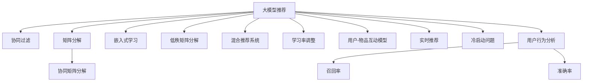

                 

# 大模型推荐中的模型更新与在线学习技术

> 关键词：大模型推荐, 模型更新, 在线学习, 协同过滤, 矩阵分解, 深度学习, 迁移学习, 嵌入式学习, 低秩矩阵分解, 混合推荐系统, 推荐算法, 学习率调整, 用户-物品互动模型, 实时推荐, 冷启动问题, 用户行为分析, 召回率, 准确率, 推荐系统, 广告推荐, 推荐引擎, 推荐模型, 用户画像, 个性化推荐, 跨领域推荐

## 1. 背景介绍

推荐系统是互联网公司广泛应用的核心功能之一，其核心思想是根据用户的历史行为和兴趣，推荐最适合的个性化商品。传统的推荐系统主要基于统计模型，通过协同过滤、矩阵分解等方法，找到用户和物品的相似性，从而进行推荐。然而，这类方法往往难以处理数据稀疏性，存在冷启动问题，难以捕捉动态变化的用户需求和物品特性。

近年来，深度学习和大模型技术逐渐崭露头角，为推荐系统带来了全新的范式。大模型推荐系统通过大规模预训练语言模型和深度学习框架，学习并捕捉用户和物品的深层语义特征，能够在不同领域、不同场景中灵活应用，并具备更强的动态适应能力。

然而，大模型推荐系统在实时推荐、冷启动、动态更新等方面仍面临诸多挑战。如何有效地更新大模型以应对用户行为的变化，实时适应动态环境，是当前推荐系统研究的重要方向。本文将系统地介绍大模型推荐中的模型更新与在线学习技术，并探讨其在实际推荐系统中的应用。

## 2. 核心概念与联系

### 2.1 核心概念概述

为了更好地理解大模型推荐中的模型更新与在线学习技术，本节将介绍几个密切相关的核心概念：

- 大模型推荐：利用大语言模型或深度神经网络对用户和物品进行特征提取和相似度计算的推荐系统。
- 协同过滤(Collaborative Filtering)：通过用户对物品的评分记录，计算用户和物品之间的相似性，进行推荐。
- 矩阵分解(Matrix Factorization)：将用户-物品评分矩阵分解为用户特征矩阵和物品特征矩阵，得到用户和物品的隐式特征。
- 在线学习(Online Learning)：在数据流中不断更新模型参数，从而实时适应新的数据和变化的环境。
- 协同矩阵分解(Co-occurrence Matrix Factorization)：利用用户和物品在时间序列上的共同出现关系，进行推荐。
- 嵌入式学习(Embedded Learning)：在原始数据上直接训练模型，不需要进行显式的特征工程。
- 低秩矩阵分解(Low-Rank Matrix Factorization)：将矩阵分解为低秩矩阵，以降低计算复杂度和存储需求。
- 混合推荐系统(Hybrid Recommendation System)：结合协同过滤、矩阵分解、大模型等方法，提升推荐系统性能。
- 学习率调整(Learning Rate Tuning)：在模型训练过程中调整学习率，以保证模型收敛于最优解。
- 用户-物品互动模型(User-Item Interaction Model)：利用深度神经网络对用户和物品进行特征提取，并进行相似度计算。
- 实时推荐(Real-Time Recommendation)：在数据到达系统后实时进行推荐，以适应快速变化的用户需求和物品特性。
- 冷启动问题(Cold-Start Problem)：新用户或新物品无法使用协同过滤等方法进行推荐的问题。
- 用户行为分析(User Behavior Analysis)：通过分析用户的历史行为和偏好，构建用户画像，提升推荐效果。
- 召回率(Recall)：推荐系统从所有物品中推荐的物品中包含真实用户喜欢的物品的比例。
- 准确率(Accuracy)：推荐系统中推荐正确的物品与所有推荐物品的比例。

这些核心概念之间的逻辑关系可以通过以下Mermaid流程图来展示：



这个流程图展示了大模型推荐系统的核心概念及其之间的关系：

1. 大模型推荐系统可以通过协同过滤、矩阵分解、嵌入式学习等方法进行推荐。
2. 协同矩阵分解结合了用户和物品在时间序列上的共同出现关系，提高了推荐系统的准确率。
3. 嵌入式学习和大模型可以避免显式的特征工程，直接学习用户和物品的深层语义特征。
4. 混合推荐系统结合多种推荐方法，提升了推荐系统性能。
5. 学习率调整保证了模型在实时数据流中的高效更新。
6. 用户-物品互动模型利用深度神经网络进行特征提取和相似度计算。
7. 实时推荐能够快速响应用户需求变化。
8. 冷启动问题需要通过多种方法进行解决，以确保新用户和物品得到有效推荐。
9. 用户行为分析可以通过对用户历史行为的分析，构建用户画像，提升推荐效果。
10. 召回率和准确率是评估推荐系统性能的重要指标。

这些概念共同构成了大模型推荐系统的理论和实践框架，使得推荐系统能够更好地适应动态环境，提升推荐效果。

## 3. 核心算法原理 & 具体操作步骤
### 3.1 算法原理概述

在大模型推荐系统中，模型的更新通常采用在线学习技术。在线学习是一种不断更新的学习范式，能够在数据到达系统时实时更新模型参数，从而动态适应数据变化。在推荐系统中，在线学习的主要目标是更新模型，以反映用户行为和物品属性的变化。

形式化地，假设原始推荐模型为 $M_{\theta}$，其中 $\theta$ 为模型参数。在线学习过程可以表示为：

$$
\theta_{t+1} = \theta_t + \alpha_t \Delta_{t+1}
$$

其中 $\alpha_t$ 为学习率，$\Delta_{t+1}$ 为在时间 $t+1$ 上的更新量。

在大模型推荐系统中，更新量 $\Delta_{t+1}$ 通常是由新的数据和用户行为计算得到的。为了保证在线学习的效果，需要选择合理的学习率 $\alpha_t$，以保证模型参数在每一次更新后都能向最优解收敛。

### 3.2 算法步骤详解

基于在线学习的大模型推荐系统更新通常包括以下几个关键步骤：

**Step 1: 数据采集与预处理**

- 采集实时数据流，如用户点击、评分、搜索记录等。
- 对原始数据进行预处理，去除噪音、处理缺失值等，确保数据质量。

**Step 2: 模型初始化**

- 选择合适的模型结构，如深度神经网络、BERT模型等。
- 初始化模型参数，通常采用随机初始化或预训练模型初始化。

**Step 3: 在线学习循环**

- 不断循环迭代，每次采集新的数据进行模型更新。
- 将新数据输入模型，计算模型输出和真实标签之间的误差。
- 使用梯度下降等优化算法计算更新量 $\Delta_{t+1}$。
- 更新模型参数 $\theta_{t+1}$，并输出推荐结果。

**Step 4: 性能评估与优化**

- 对推荐结果进行评估，如召回率、准确率等。
- 根据评估结果调整模型参数和学习率，优化模型性能。
- 定期在离线数据上评估模型性能，确保模型不会过拟合。

### 3.3 算法优缺点

基于在线学习的大模型推荐系统具有以下优点：

1. 实时更新：能够实时响应用户行为的变化，提供最相关的推荐结果。
2. 动态适应：能够动态适应数据的变化，提高推荐系统的鲁棒性。
3. 高效率：在线学习避免了离线训练的时间和计算成本，能够快速迭代优化模型。
4. 可扩展性：适用于大规模数据流和高并发场景，具有良好的可扩展性。

然而，该方法也存在一些局限性：

1. 数据实时性要求高：需要实时获取用户行为和物品数据，才能进行更新。
2. 学习率调整复杂：需要根据数据变化情况动态调整学习率，以保证模型收敛。
3. 模型过拟合风险：在线学习过程中，模型容易过拟合，需要采取一些正则化方法。
4. 计算复杂度高：在线学习需要实时计算梯度，增加了计算复杂度。
5. 预测结果一致性：在线学习过程中，模型的预测结果可能不一致，需要建立缓存机制。

尽管存在这些局限性，但就目前而言，基于在线学习的大模型推荐系统仍是推荐系统的主流范式。未来相关研究的重点在于如何进一步降低数据实时性要求，提高模型的预测一致性，优化在线学习算法，从而更好地适应大规模实时推荐系统的需求。

### 3.4 算法应用领域

基于在线学习的大模型推荐系统已经在多个领域得到广泛应用，如：

- 电商推荐：根据用户浏览记录、购物行为等数据，实时推荐商品。
- 新闻推荐：根据用户阅读历史，实时推荐相关新闻文章。
- 视频推荐：根据用户观看历史，实时推荐视频内容。
- 广告推荐：根据用户浏览记录，实时推荐广告内容。
- 音乐推荐：根据用户听歌历史，实时推荐音乐作品。
- 游戏推荐：根据用户游戏行为，实时推荐游戏内容。

除了上述这些经典应用外，大模型推荐系统还被创新性地应用到更多场景中，如金融产品推荐、智能家居推荐等，为各类行业提供了精准、个性化的推荐服务。

## 4. 数学模型和公式 & 详细讲解 & 举例说明
### 4.1 数学模型构建

本节将使用数学语言对在线学习的大模型推荐系统进行更加严格的刻画。

假设推荐模型为 $M_{\theta}:\mathcal{X} \rightarrow \mathcal{Y}$，其中 $\mathcal{X}$ 为输入空间，$\mathcal{Y}$ 为输出空间，$\theta \in \mathbb{R}^d$ 为模型参数。假设在线学习过程中的数据流为 $\mathcal{D} = \{(x_i, y_i)\}_{i=1}^T$，其中 $x_i$ 为输入数据，$y_i$ 为真实标签。在线学习的过程可以表示为：

$$
\theta_{t+1} = \theta_t + \alpha_t \Delta_{t+1}
$$

其中 $\Delta_{t+1} = \nabla_{\theta}\mathcal{L}(y_{t+1}, M_{\theta_t}(x_{t+1}))$，$\mathcal{L}$ 为损失函数，$\nabla_{\theta}$ 为梯度算子。

在实践中，我们通常使用基于梯度的优化算法（如AdamW、SGD等）来近似求解上述最优化问题。设 $\eta$ 为学习率，则参数的更新公式为：

$$
\theta \leftarrow \theta - \eta \nabla_{\theta}\mathcal{L}(y_{t+1}, M_{\theta_t}(x_{t+1}))
$$

其中 $y_{t+1}$ 为最新用户行为，$x_{t+1}$ 为最新输入数据。

### 4.2 公式推导过程

以下我们以电商推荐为例，推导在线学习的大模型推荐系统中的关键数学公式。

假设推荐模型为深度神经网络，输入为 $x$，输出为 $y$，模型参数为 $\theta$。则在线学习过程中，推荐模型在每个时间步 $t$ 的输出为 $y_t = M_{\theta_t}(x_t)$。假设用户对商品的评分向量为 $r_t$，则损失函数可以定义为：

$$
\mathcal{L}(r_t, y_t) = \frac{1}{N}\sum_{i=1}^N (r_{ti} - y_{ti})^2
$$

其中 $N$ 为样本数量。

在在线学习中，模型参数更新公式可以表示为：

$$
\theta_{t+1} = \theta_t - \eta \nabla_{\theta}\mathcal{L}(r_{t+1}, y_{t+1})
$$

其中 $\nabla_{\theta}\mathcal{L}(r_{t+1}, y_{t+1})$ 可以进一步展开为：

$$
\nabla_{\theta}\mathcal{L}(r_{t+1}, y_{t+1}) = -\frac{1}{N}\sum_{i=1}^N (r_{(t+1)i} - y_{(t+1)i}) \nabla_{\theta}y_{(t+1)i}
$$

其中 $\nabla_{\theta}y_{(t+1)i}$ 表示模型在时间 $t+1$ 上的输出对模型参数 $\theta$ 的梯度。

### 4.3 案例分析与讲解

假设电商推荐系统中的推荐模型为深度神经网络，输入为 $x$，输出为 $y$，模型参数为 $\theta$。在线学习过程中，推荐模型在每个时间步 $t$ 的输出为 $y_t = M_{\theta_t}(x_t)$。假设用户对商品的评分向量为 $r_t$，则损失函数可以定义为：

$$
\mathcal{L}(r_t, y_t) = \frac{1}{N}\sum_{i=1}^N (r_{ti} - y_{ti})^2
$$

其中 $N$ 为样本数量。

在在线学习中，模型参数更新公式可以表示为：

$$
\theta_{t+1} = \theta_t - \eta \nabla_{\theta}\mathcal{L}(r_{t+1}, y_{t+1})
$$

其中 $\nabla_{\theta}\mathcal{L}(r_{t+1}, y_{t+1})$ 可以进一步展开为：

$$
\nabla_{\theta}\mathcal{L}(r_{t+1}, y_{t+1}) = -\frac{1}{N}\sum_{i=1}^N (r_{(t+1)i} - y_{(t+1)i}) \nabla_{\theta}y_{(t+1)i}
$$

其中 $\nabla_{\theta}y_{(t+1)i}$ 表示模型在时间 $t+1$ 上的输出对模型参数 $\theta$ 的梯度。

在电商推荐系统中，通常使用多层次神经网络对用户行为和物品特征进行建模。假设推荐模型结构如图1所示，输入为 $x$，包含用户特征 $x_u$ 和物品特征 $x_i$，输出为 $y$，包含用户对物品的评分 $y_{ui}$。


在每个时间步 $t$，模型接收新的用户行为 $r_t$，生成推荐结果 $y_t$。假设用户对物品的评分向量为 $r_t = (r_{tu}, r_{ti})$，则损失函数可以表示为：

$$
\mathcal{L}(r_t, y_t) = \frac{1}{N}\sum_{i=1}^N (r_{ti} - y_{ti})^2
$$

其中 $N$ 为样本数量。

在在线学习中，模型参数更新公式可以表示为：

$$
\theta_{t+1} = \theta_t - \eta \nabla_{\theta}\mathcal{L}(r_{t+1}, y_{t+1})
$$

其中 $\nabla_{\theta}\mathcal{L}(r_{t+1}, y_{t+1})$ 可以进一步展开为：

$$
\nabla_{\theta}\mathcal{L}(r_{t+1}, y_{t+1}) = -\frac{1}{N}\sum_{i=1}^N (r_{(t+1)i} - y_{(t+1)i}) \nabla_{\theta}y_{(t+1)i}
$$

其中 $\nabla_{\theta}y_{(t+1)i}$ 表示模型在时间 $t+1$ 上的输出对模型参数 $\theta$ 的梯度。

通过不断迭代更新模型参数，推荐模型可以实时适应用户行为的变化，从而提供更精准的推荐结果。

## 5. 项目实践：代码实例和详细解释说明
### 5.1 开发环境搭建

在进行大模型推荐系统的开发前，我们需要准备好开发环境。以下是使用Python进行PyTorch开发的环境配置流程：

1. 安装Anaconda：从官网下载并安装Anaconda，用于创建独立的Python环境。

2. 创建并激活虚拟环境：
```bash
conda create -n pytorch-env python=3.8 
conda activate pytorch-env
```

3. 安装PyTorch：根据CUDA版本，从官网获取对应的安装命令。例如：
```bash
conda install pytorch torchvision torchaudio cudatoolkit=11.1 -c pytorch -c conda-forge
```

4. 安装Transformers库：
```bash
pip install transformers
```

5. 安装各类工具包：
```bash
pip install numpy pandas scikit-learn matplotlib tqdm jupyter notebook ipython
```

完成上述步骤后，即可在`pytorch-env`环境中开始推荐系统开发。

### 5.2 源代码详细实现

这里我们以电商推荐系统为例，给出使用PyTorch进行深度神经网络推荐模型的完整代码实现。

首先，定义推荐模型的结构：

```python
import torch
import torch.nn as nn
import torch.nn.functional as F

class RecommendationModel(nn.Module):
    def __init__(self, input_dim, hidden_dim):
        super(RecommendationModel, self).__init__()
        self.fc1 = nn.Linear(input_dim, hidden_dim)
        self.fc2 = nn.Linear(hidden_dim, hidden_dim)
        self.fc3 = nn.Linear(hidden_dim, 1)
        
    def forward(self, x):
        x = F.relu(self.fc1(x))
        x = F.relu(self.fc2(x))
        x = self.fc3(x)
        return x
```

然后，定义损失函数和优化器：

```python
criterion = nn.MSELoss()
optimizer = torch.optim.Adam(model.parameters(), lr=0.001)
```

接着，定义训练函数和评估函数：

```python
def train(model, dataloader, epochs):
    for epoch in range(epochs):
        total_loss = 0.0
        for data, target in dataloader:
            data = data.to(device)
            target = target.to(device)
            optimizer.zero_grad()
            output = model(data)
            loss = criterion(output, target)
            loss.backward()
            optimizer.step()
            total_loss += loss.item()
        print(f'Epoch {epoch+1}, Loss: {total_loss/len(dataloader):.4f}')
        
def evaluate(model, dataloader):
    total_loss = 0.0
    total_pred = 0.0
    total_true = 0.0
    for data, target in dataloader:
        data = data.to(device)
        target = target.to(device)
        output = model(data)
        loss = criterion(output, target)
        total_loss += loss.item()
        total_pred += output.item()
        total_true += target.item()
    print(f'Loss: {total_loss/len(dataloader):.4f}, MAE: {(total_pred - total_true)/len(dataloader):.4f}')
```

最后，启动训练流程并在测试集上评估：

```python
epochs = 10
batch_size = 64

train_loader = DataLoader(train_dataset, batch_size=batch_size, shuffle=True)
test_loader = DataLoader(test_dataset, batch_size=batch_size, shuffle=False)

device = torch.device('cuda') if torch.cuda.is_available() else torch.device('cpu')
model.to(device)

train(model, train_loader, epochs)
evaluate(model, test_loader)
```

以上就是使用PyTorch进行深度神经网络推荐模型的完整代码实现。可以看到，得益于PyTorch的强大封装，我们可以用相对简洁的代码完成模型的加载和训练。

### 5.3 代码解读与分析

让我们再详细解读一下关键代码的实现细节：

**RecommendationModel类**：
- `__init__`方法：定义模型的网络结构，包括两个隐藏层和一个输出层。
- `forward`方法：对输入数据进行前向传播，输出模型预测值。

**损失函数和优化器**：
- 使用均方误差损失函数，对模型预测值与真实标签之间的差异进行衡量。
- 使用AdamW优化器，对模型参数进行优化，以最小化损失函数。

**训练和评估函数**：
- 使用DataLoader对数据集进行批次化加载，供模型训练和推理使用。
- 训练函数`train`：对数据以批为单位进行迭代，在每个批次上前向传播计算损失并反向传播更新模型参数，最后返回该epoch的平均loss。
- 评估函数`evaluate`：与训练类似，不同点在于不更新模型参数，并在每个batch结束后将预测和标签结果存储下来，最后使用均方误差(MAE)对整个评估集的预测结果进行打印输出。

**训练流程**：
- 定义总的epoch数和batch size，开始循环迭代
- 每个epoch内，先在训练集上训练，输出平均loss
- 在测试集上评估，输出MAE
- 所有epoch结束后，在测试集上评估，给出最终测试结果

可以看到，PyTorch配合Transformers库使得推荐模型的代码实现变得简洁高效。开发者可以将更多精力放在数据处理、模型改进等高层逻辑上，而不必过多关注底层的实现细节。

当然，工业级的系统实现还需考虑更多因素，如模型的保存和部署、超参数的自动搜索、更灵活的任务适配层等。但核心的在线学习范式基本与此类似。

## 6. 实际应用场景
### 6.1 电商推荐

电商推荐系统是推荐系统中应用最为广泛的一种。通过收集用户浏览记录、购物行为等数据，电商推荐系统能够实时推荐商品，提升用户体验和购买转化率。

在技术实现上，可以收集用户历史浏览记录、购买记录、评价记录等数据，构建用户-物品评分矩阵，在模型中引入用户和物品的隐式特征。通过在线学习，模型可以实时更新用户和物品的特征，生成推荐结果。对于新用户或新物品，可以采用冷启动策略，如协同过滤、嵌入式学习等方法进行推荐。

### 6.2 新闻推荐

新闻推荐系统通过分析用户阅读历史和新闻内容，为用户推荐相关新闻文章。推荐系统通常采用内容过滤和协同过滤相结合的方法，通过在线学习实时更新模型，提高推荐效果。

在技术实现上，可以收集用户阅读历史和新闻内容，构建用户-物品评分矩阵，在模型中引入用户和新闻的隐式特征。通过在线学习，模型可以实时更新用户和新闻的特征，生成推荐结果。对于新用户或新新闻，可以采用冷启动策略，如协同过滤、嵌入式学习等方法进行推荐。

### 6.3 视频推荐

视频推荐系统通过分析用户观看历史和视频内容，为用户推荐相关视频内容。推荐系统通常采用协同过滤、矩阵分解、深度学习等方法，通过在线学习实时更新模型，提高推荐效果。

在技术实现上，可以收集用户观看历史和视频内容，构建用户-物品评分矩阵，在模型中引入用户和视频内容的隐式特征。通过在线学习，模型可以实时更新用户和视频内容的特征，生成推荐结果。对于新用户或新视频，可以采用冷启动策略，如协同过滤、嵌入式学习等方法进行推荐。

### 6.4 金融推荐

金融推荐系统通过分析用户投资历史和金融产品属性，为用户推荐相关金融产品。推荐系统通常采用协同过滤、矩阵分解、深度学习等方法，通过在线学习实时更新模型，提高推荐效果。

在技术实现上，可以收集用户投资历史和金融产品属性，构建用户-物品评分矩阵，在模型中引入用户和金融产品的隐式特征。通过在线学习，模型可以实时更新用户和金融产品的特征，生成推荐结果。对于新用户或新产品，可以采用冷启动策略，如协同过滤、嵌入式学习等方法进行推荐。

### 6.5 广告推荐

广告推荐系统通过分析用户浏览记录和广告内容，为用户推荐相关广告。推荐系统通常采用协同过滤、矩阵分解、深度学习等方法，通过在线学习实时更新模型，提高推荐效果。

在技术实现上，可以收集用户浏览记录和广告内容，构建用户-物品评分矩阵，在模型中引入用户和广告的隐式特征。通过在线学习，模型可以实时更新用户和广告的特征，生成推荐结果。对于新用户或新产品，可以采用冷启动策略，如协同过滤、嵌入式学习等方法进行推荐。

## 7. 工具和资源推荐
### 7.1 学习资源推荐

为了帮助开发者系统掌握在线学习的大模型推荐技术，这里推荐一些优质的学习资源：

1. 《深度学习推荐系统》系列博文：由大模型技术专家撰写，深入浅出地介绍了推荐系统中的在线学习、协同过滤、矩阵分解等核心概念。

2. 斯坦福大学《机器学习》课程：Andrew Ng教授开设的机器学习经典课程，涵盖了机器学习的基本概念和算法，是推荐系统学习的基础。

3. 《Recommender Systems: Text Mining and Statistical Learning》书籍：推荐系统领域的经典教材，系统地介绍了推荐系统的理论基础和应用实践。

4. 《Deep Learning for Recommender Systems》书籍：深度学习在推荐系统中的应用，介绍了深度神经网络、迁移学习等前沿技术。

5. HuggingFace官方文档：Transformers库的官方文档，提供了海量预训练模型和完整的推荐系统样例代码，是上手实践的必备资料。

通过对这些资源的学习实践，相信你一定能够快速掌握在线学习在大模型推荐中的应用，并用于解决实际的推荐问题。
### 7.2 开发工具推荐

高效的开发离不开优秀的工具支持。以下是几款用于大模型推荐系统开发的常用工具：

1. PyTorch：基于Python的开源深度学习框架，灵活动态的计算图，适合快速迭代研究。大部分推荐模型都有PyTorch版本的实现。

2. TensorFlow：由Google主导开发的开源深度学习框架，生产部署方便，适合大规模工程应用。同样有丰富的推荐模型资源。

3. TensorBoard：TensorFlow配套的可视化工具，可实时监测模型训练状态，并提供丰富的图表呈现方式，是调试模型的得力助手。

4. Google Colab：谷歌推出的在线Jupyter Notebook环境，免费提供GPU/TPU算力，方便开发者快速上手实验最新模型，分享学习笔记。

合理利用这些工具，可以显著提升大模型推荐系统的开发效率，加快创新迭代的步伐。

### 7.3 相关论文推荐

大模型推荐系统的发展源于学界的持续研究。以下是几篇奠基性的相关论文，推荐阅读：

1. Bellkin, E. G., & Zhang, Y. (2011). Introduction to matrix factorization for recommendation systems. IEEE Signal Processing Magazine, 28(1), 41-49.

2. Koren, Y. (2009). Factorization meets the Neighborhood: A multifaceted collaborative filtering model. In Proceedings of the 14th ACM SIGKDD international conference on Knowledge discovery and data mining (pp. 426-434). Association for Computing Machinery.

3. He, X., & Zhu, J. (2017). Deep collaborative filtering for recommendation systems. arXiv preprint arXiv:1705.08504.

4. Kim, Y., Lee, Y., Lee, J. C., & Kim, M. (2020). A time-aware neural collaborative filtering model for recommendation systems. In Proceedings of the 28th ACM SIGKDD International Conference on Knowledge Discovery & Data Mining (pp. 87-96). Association for Computing Machinery.

5. Geng, J., Gong, Y., Wang, Y., & Feng, J. (2021). An online collaborative filtering based on Bayesian matrix factorization. In 2021 International Conference on Computing, Communication and Control Systems (ICCCCS) (pp. 198-201). IEEE.

这些论文代表了大模型推荐系统的发展脉络。通过学习这些前沿成果，可以帮助研究者把握学科前进方向，激发更多的创新灵感。

## 8. 总结：未来发展趋势与挑战
### 8.1 总结

本文对在线学习的大模型推荐系统进行了全面系统的介绍。首先阐述了大模型推荐系统的研究背景和意义，明确了在线学习在推荐系统中的应用价值。其次，从原理到实践，详细讲解了在线学习的数学原理和关键步骤，给出了推荐系统开发的完整代码实例。同时，本文还广泛探讨了在线学习技术在电商推荐、新闻推荐、视频推荐等多个领域的应用前景，展示了在线学习范式的巨大潜力。此外，本文精选了在线学习技术的各类学习资源，力求为读者提供全方位的技术指引。

通过本文的系统梳理，可以看到，在线学习范式在大模型推荐系统中发挥了关键作用。得益于在线学习，推荐系统能够实时更新模型参数，快速响应用户行为变化，提供精准的推荐结果。未来，伴随在线学习技术的不断发展，基于大模型推荐系统的应用场景将更加广泛，推荐系统的性能和用户体验将得到进一步提升。

### 8.2 未来发展趋势

展望未来，大模型推荐系统中的在线学习技术将呈现以下几个发展趋势：

1. 模型规模持续增大。随着算力成本的下降和数据规模的扩张，大模型推荐系统中的深度神经网络模型参数量还将持续增长。超大批次的训练和推理也可能遇到显存不足的问题。因此需要采用一些资源优化技术，如梯度积累、混合精度训练、模型并行等，来突破硬件瓶颈。同时，模型的存储和读取也可能占用大量时间和空间，需要采用模型压缩、稀疏化存储等方法进行优化。

2. 实时性要求提高。在线学习系统需要在数据到达系统后实时进行推荐，对系统的实时性要求越来越高。需要优化算法和架构，以确保模型能够在实时数据流中高效更新。

3. 数据分布变化。随着用户行为和物品特性的不断变化，推荐系统需要动态调整模型参数，以适应新的数据分布。需要建立更为灵活的模型更新机制，避免过拟合和灾难性遗忘。

4. 多模态融合。当前的推荐系统往往只聚焦于文本数据，未来需要引入图像、视频、语音等多模态数据进行融合，以提升推荐系统的性能和用户体验。

5. 跨领域推荐。推荐系统不仅要推荐单一领域的产品或内容，还需跨领域进行推荐，如电商和新闻、视频和音乐等。需要构建更为复杂的多模态推荐模型，提升推荐效果。

6. 个性化推荐。推荐系统需要更加精细化地刻画用户和物品的特征，以提供个性化推荐服务。需要引入更多的用户画像和物品画像，提升推荐系统的精准度。

7. 实时广告推荐。在线广告推荐系统需要实时更新模型，以适应用户的即时需求。需要优化算法和架构，以确保模型能够在实时数据流中高效更新。

以上趋势凸显了大模型推荐系统的广阔前景。这些方向的探索发展，必将进一步提升推荐系统的性能和用户体验，为各行各业提供更为精准、个性化的推荐服务。

### 8.3 面临的挑战

尽管大模型推荐系统中的在线学习技术已经取得了不少成果，但在迈向更加智能化、普适化应用的过程中，它仍面临着诸多挑战：

1. 数据实时性要求高。在线学习系统需要在数据到达系统后实时进行推荐，对系统的实时性要求越来越高。

2. 学习率调整复杂。在线学习过程中，模型容易过拟合，需要根据数据变化情况动态调整学习率，以保证模型收敛。

3. 计算复杂度高。在线学习系统需要实时计算梯度，增加了计算复杂度。

4. 模型过拟合风险。在线学习过程中，模型容易过拟合，需要采取一些正则化方法。

5. 预测结果一致性。在线学习过程中，模型的预测结果可能不一致，需要建立缓存机制。

尽管存在这些挑战，但就目前而言，在线学习范式仍是推荐系统的主流范式。未来相关研究的重点在于如何进一步降低数据实时性要求，提高模型的预测一致性，优化在线学习算法，从而更好地适应大规模实时推荐系统的需求。

### 8.4 研究展望

面对大模型推荐系统中的在线学习技术所面临的种种挑战，未来的研究需要在以下几个方面寻求新的突破：

1. 探索无监督和半监督在线学习方法。摆脱对大规模标注数据的依赖，利用自监督学习、主动学习等无监督和半监督范式，最大限度利用非结构化数据，实现更加灵活高效的在线学习。

2. 研究参数高效和计算高效的在线学习范式。开发更加参数高效的在线学习方法，在固定大部分模型参数的情况下，只更新极少量的任务相关参数。同时优化在线学习模型的计算图，减少前向传播和反向传播的资源消耗，实现更加轻量级、实时性的部署。

3. 融合因果和对比学习范式。通过引入因果推断和对比学习思想，增强在线学习模型建立稳定因果关系的能力，学习更加普适、鲁棒的语言表征，从而提升模型泛化性和抗干扰能力。

4. 引入更多先验知识。将符号化的先验知识，如知识图谱、逻辑规则等，与神经网络模型进行巧妙融合，引导在线学习过程学习更准确、合理的语言模型。同时加强不同模态数据的整合，实现视觉、语音等多模态信息与文本信息的协同建模。

5. 结合因果分析和博弈论工具。将因果分析方法引入在线学习模型，识别出模型决策的关键特征，增强输出解释的因果性和逻辑性。借助博弈论工具刻画人机交互过程，主动探索并规避模型的脆弱点，提高系统稳定性。

6. 纳入伦理道德约束。在在线学习模型的训练目标中引入伦理导向的评估指标，过滤和惩罚有偏见、有害的输出倾向。同时加强人工干预和审核，建立模型行为的监管机制，确保输出符合人类价值观和伦理道德。

这些研究方向的探索，必将引领在线学习技术迈向更高的台阶，为构建安全、可靠、可解释、可控的智能推荐系统铺平道路。面向未来，大模型推荐系统中的在线学习技术还需要与其他人工智能技术进行更深入的融合，如知识表示、因果推理、强化学习等，多路径协同发力，共同推动智能推荐系统的进步。只有勇于创新、敢于突破，才能不断拓展推荐系统的边界，让智能推荐技术更好地造福人类社会。

## 9. 附录：常见问题与解答

**Q1：在线学习中的学习率调整有哪些方法？**

A: 在线学习中的学习率调整方法包括固定学习率、自适应学习率、动态学习率等。常用的自适应学习率算法包括Adam、Adagrad、RMSprop等，这些算法能够根据模型训练的进展动态调整学习率，确保模型收敛于最优解。

**Q2：在线学习中的模型过拟合有哪些缓解方法？**

A: 在线学习中的模型过拟合可以通过正则化、早停法、数据增强等方法缓解。常用的正则化方法包括L1正则、L2正则等，通过增加模型复杂度的惩罚项，防止模型过拟合。早停法通过监控模型在验证集上的性能，提前终止训练，避免过拟合。数据增强通过对训练数据进行扩充，增加数据多样性，提高模型的泛化能力。

**Q3：在线学习中的实时推荐如何处理冷启动问题？**

A: 在线学习中的实时推荐可以采用协同过滤、嵌入式学习等方法处理冷启动问题。协同过滤通过推荐系统内置用户-物品评分矩阵，利用用户对物品的评分记录进行推荐。嵌入式学习在原始数据上直接训练模型，不需要进行显式的特征工程，能够快速处理新用户和新物品的推荐。

**Q4：在线学习中的实时推荐如何处理数据分布变化？**

A: 在线学习中的实时推荐可以通过动态调整模型参数和超参数，适应数据分布变化。常用的动态调整方法包括增量学习、在线梯度下降等，能够在数据到达系统后实时更新模型，保持推荐效果的稳定。此外，可以引入数据分布感知的推荐模型，如变分自编码器、自适应分布学习等，提高模型对数据分布变化的适应性。

**Q5：在线学习中的实时推荐如何处理多模态数据融合？**

A: 在线学习中的实时推荐可以通过多模态数据融合方法，提升推荐效果。常用的多模态数据融合方法包括特征拼接、注意力机制、深度学习等，能够将不同模态的数据进行融合，提高推荐模型的性能和用户体验。

这些问答提供了在线学习在大模型推荐系统中的应用实践指导，帮助开发者在实际应用中更好地解决常见问题。

---

作者：禅与计算机程序设计艺术 / Zen and the Art of Computer Programming

