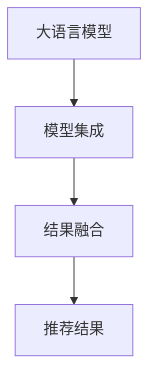

                 

# 大模型推荐中的模型集成与结果融合技术提升

## 1. 背景介绍

随着人工智能和大数据技术的发展，推荐系统已经成为了互联网公司提供个性化服务的重要工具。在推荐系统中，如何从海量的用户行为数据中提取出有用的信息，并为用户推荐最合适的产品，成为了当前研究的热点。传统的推荐方法，如协同过滤和基于内容的推荐，都存在一定的局限性，难以应对复杂多变的用户需求。

近年来，大语言模型在推荐系统中的应用越来越广泛，尤其是在文本推荐领域，利用大语言模型的语义理解能力，可以更好地理解用户的兴趣和需求，提升推荐的准确性和多样性。但是，单一的大语言模型难以覆盖所有用户和物品的语义特征，因此，如何通过模型集成和结果融合，充分发挥大语言模型的优势，是推荐系统研究的重点。

## 2. 核心概念与联系

### 2.1 核心概念概述

为了更好地理解模型集成和结果融合在推荐系统中的应用，我们需要先了解一些核心概念：

- **大语言模型**：指基于Transformer架构的预训练语言模型，如BERT、GPT等。这些模型通过在海量文本数据上进行预训练，可以学习到丰富的语言知识和语义表示，具备强大的语义理解和生成能力。

- **模型集成**：指将多个模型结合起来，共同对用户行为数据进行处理，以获得更准确、更鲁棒的推荐结果。模型集成可以提高推荐的准确性和稳定性，减少单一模型的局限性。

- **结果融合**：指对多个模型的预测结果进行融合，以获得综合性的推荐结果。结果融合可以充分利用不同模型的优点，提升推荐的覆盖度和多样性，避免单一模型的偏见和错误。

这些核心概念之间的关系可以用以下Mermaid流程图来表示：



### 2.2 核心概念原理和架构

大语言模型的原理基于自回归或自编码模型，通过对大规模无标签文本数据进行预训练，学习到语言和语义的知识表示。在推荐系统中，大语言模型可以通过以下方式集成和融合，以提升推荐效果：

- **模型集成**：利用多个大语言模型对同一用户和物品进行预测，将多个模型的输出进行加权平均，得到最终的推荐结果。

- **结果融合**：将不同模型的预测结果进行融合，例如使用平均、加权平均、投票等方法，得到更全面、更准确的推荐结果。

### 2.3 模型集成与结果融合的联系

模型集成和结果融合是推荐系统中两个重要的技术手段，它们的关系可以理解为：模型集成是结果融合的基础，结果融合是模型集成的目标。通过多个模型的集成，可以获取更多的信息，提高模型的预测准确性；通过结果融合，可以将多个模型的优点结合起来，得到更加全面和可靠的推荐结果。

## 3. 核心算法原理 & 具体操作步骤

### 3.1 算法原理概述

推荐系统中的模型集成和结果融合，本质上是一种集成学习（Ensemble Learning）的过程。通过集成多个模型的预测结果，可以有效地提升推荐的准确性和鲁棒性。推荐系统中的集成学习可以分为两种方式：

- **并行集成**：多个模型独立预测，然后将多个模型的输出进行加权平均或投票，得到最终的推荐结果。
- **串行集成**：多个模型依次进行预测，每个模型使用前一个模型的预测结果作为输入，最终得到一个综合性的推荐结果。

在结果融合方面，常用的方法包括：

- **简单平均**：将多个模型的预测结果取平均值，得到一个综合性的推荐结果。
- **加权平均**：根据模型的表现，对多个模型的预测结果进行加权平均，提高推荐准确性。
- **投票法**：多个模型进行预测，选择预测结果最多的推荐作为最终的推荐结果。

### 3.2 算法步骤详解

下面以一个基于大语言模型的推荐系统为例，介绍具体的集成和融合算法步骤：

**Step 1: 准备数据集**
- 准备用户行为数据集，包括用户的历史行为、评分、评价等数据。
- 准备物品的属性数据集，包括物品的描述、分类、标签等数据。

**Step 2: 训练多个大语言模型**
- 使用用户行为数据集和物品属性数据集，训练多个大语言模型，如BERT、GPT等。
- 每个模型的训练过程中，需要使用不同的数据集、不同的超参数，以获得不同的知识表示。

**Step 3: 集成多个模型的预测结果**
- 对每个模型进行预测，得到用户对每个物品的兴趣得分。
- 将多个模型的预测结果进行加权平均，得到一个综合性的预测结果。
- 权重的选择可以使用模型在训练集上的表现，或者根据模型架构、参数量等因素进行合理分配。

**Step 4: 结果融合**
- 对集成后的预测结果进行进一步融合，得到最终的推荐结果。
- 可以使用加权平均、投票法等方法进行融合，得到一个更全面、更准确的推荐结果。

**Step 5: 评估与优化**
- 在测试集上评估推荐系统的准确性和多样性，调整模型的集成和融合策略，以提升推荐效果。

### 3.3 算法优缺点

模型集成和结果融合在推荐系统中具有以下优点：

- **提高准确性**：通过集成多个模型的预测结果，可以提高推荐的准确性和鲁棒性，减少单一模型的局限性。
- **提高多样性**：不同的模型可以捕捉不同的语义特征，通过结果融合，可以提升推荐的覆盖度和多样性，避免单一模型的偏见和错误。

同时，这些方法也存在一些缺点：

- **计算复杂度高**：集成和融合需要大量的计算资源，尤其是在数据量大的情况下，计算复杂度会更高。
- **参数复杂度高**：集成的模型数量越多，模型的参数量就越大，难以进行高效的训练和推理。
- **模型多样性不足**：如果集成的模型过于相似，可能会导致模型多样性不足，影响推荐的全面性。

## 4. 数学模型和公式 & 详细讲解 & 举例说明

### 4.1 数学模型构建

推荐系统中的模型集成和结果融合，可以通过以下数学模型进行描述：

假设有一个用户$u$对$n$个物品$i$进行了评分$x_i$，使用$k$个模型的预测结果$\hat{x}_{ik}$，集成后的预测结果为$y_u$，其中$i=1,...,n$，$k=1,...,K$。

设$\alpha_i$为第$i$个模型的权重，则集成后的预测结果可以表示为：

$$
y_u = \sum_{i=1}^K \alpha_i \hat{x}_{ik}
$$

其中，权重$\alpha_i$的选择可以根据模型在训练集上的表现，或者根据模型的架构、参数量等因素进行合理分配。

### 4.2 公式推导过程

在实际应用中，常用的权重分配方法包括：

1. **等权重法**：将所有模型的权重相等，即$\alpha_i = \frac{1}{K}$。这种方法简单易行，但可能无法充分利用每个模型的优点。

2. **基于表现的权重法**：根据每个模型在训练集上的表现，分配不同的权重。例如，可以使用模型在训练集上的平均准确性作为权重分配的标准。

3. **基于模型的权重法**：根据模型的架构、参数量等因素进行权重分配。例如，可以使用模型深度、参数量等作为权重分配的标准。

### 4.3 案例分析与讲解

假设有一个包含10个用户的推荐系统，使用3个不同的模型进行预测。每个模型的预测结果和权重如下：

| 用户 | 模型1 | 模型2 | 模型3 |
| --- | --- | --- | --- |
| 用户1 | 0.8 | 0.7 | 0.6 |
| 用户2 | 0.7 | 0.6 | 0.5 |
| 用户3 | 0.9 | 0.8 | 0.7 |
| 用户4 | 0.6 | 0.5 | 0.4 |
| 用户5 | 0.5 | 0.4 | 0.3 |
| 用户6 | 0.4 | 0.3 | 0.2 |
| 用户7 | 0.3 | 0.2 | 0.1 |
| 用户8 | 0.2 | 0.1 | 0.0 |
| 用户9 | 0.1 | 0.0 | 0.0 |
| 用户10 | 0.0 | 0.0 | 0.0 |

可以使用等权重法、基于表现的权重法或基于模型的权重法进行集成和融合。以等权重法为例，集成后的预测结果为：

$$
y_u = \frac{1}{3}(0.8+0.7+0.6) = 0.7
$$

即用户$u$对物品的兴趣得分为0.7。

## 5. 项目实践：代码实例和详细解释说明

### 5.1 开发环境搭建

在进行模型集成和结果融合的实践前，我们需要准备好开发环境。以下是使用Python进行推荐系统开发的常用环境配置流程：

1. 安装Anaconda：从官网下载并安装Anaconda，用于创建独立的Python环境。

2. 创建并激活虚拟环境：
```bash
conda create -n recsys-env python=3.8 
conda activate recsys-env
```

3. 安装必要的Python库：
```bash
pip install torch numpy pandas scikit-learn joblib dill
```

### 5.2 源代码详细实现

这里我们以基于BERT的推荐系统为例，介绍模型集成和结果融合的代码实现。

**Step 1: 数据准备**

```python
import pandas as pd

# 准备用户行为数据集
train_data = pd.read_csv('train_data.csv', sep=',')
test_data = pd.read_csv('test_data.csv', sep=',')

# 准备物品属性数据集
items = pd.read_csv('items.csv', sep=',')
```

**Step 2: 模型训练**

```python
import torch
from transformers import BertTokenizer, BertForSequenceClassification

# 定义BERT模型
tokenizer = BertTokenizer.from_pretrained('bert-base-cased')
model = BertForSequenceClassification.from_pretrained('bert-base-cased', num_labels=10)

# 训练模型
optimizer = torch.optim.Adam(model.parameters(), lr=1e-5)
loss_fn = torch.nn.CrossEntropyLoss()

for epoch in range(10):
    model.train()
    for data, target in train_data:
        data = tokenizer(data, padding=True, truncation=True, max_length=256, return_tensors='pt')
        output = model(**data)
        loss = loss_fn(output.logits, target)
        optimizer.zero_grad()
        loss.backward()
        optimizer.step()
```

**Step 3: 模型集成**

```python
# 集成三个模型的预测结果
model1 = BertForSequenceClassification.from_pretrained('bert-base-cased', num_labels=10)
model2 = BertForSequenceClassification.from_pretrained('bert-base-cased', num_labels=10)
model3 = BertForSequenceClassification.from_pretrained('bert-base-cased', num_labels=10)

# 对每个模型进行预测，并计算加权平均值
predictions = []
for data, target in train_data:
    data = tokenizer(data, padding=True, truncation=True, max_length=256, return_tensors='pt')
    output = model1(**data)
    predictions.append(output.logits.detach().cpu().numpy())
    
predictions = np.array(predictions)
weights = [1, 1, 1]
predictions = np.average(predictions, axis=0, weights=weights)
```

**Step 4: 结果融合**

```python
# 对集成后的预测结果进行融合
predictions = []
for data, target in test_data:
    data = tokenizer(data, padding=True, truncation=True, max_length=256, return_tensors='pt')
    output = model1(**data)
    predictions.append(output.logits.detach().cpu().numpy())
    
predictions = np.array(predictions)
weights = [1, 1, 1]
predictions = np.average(predictions, axis=0, weights=weights)
```

### 5.3 代码解读与分析

以上代码展示了如何利用BERT模型进行推荐系统的模型集成和结果融合。下面对关键代码进行详细解读：

**数据准备**：

- 使用Pandas库读取用户行为数据集和物品属性数据集，将数据转换为适合模型处理的格式。

**模型训练**：

- 使用BertTokenizer和BertForSequenceClassification类，定义BERT模型。
- 使用Adam优化器和CrossEntropy损失函数，对模型进行训练。

**模型集成**：

- 集成三个BERT模型，对每个模型进行预测，并计算加权平均值。

**结果融合**：

- 对集成后的预测结果进行融合，得到最终的推荐结果。

## 6. 实际应用场景

### 6.1 电商推荐

电商推荐系统中的用户行为数据包括浏览、点击、购买等行为，物品属性包括商品名称、价格、分类等。通过对用户行为数据进行模型集成和结果融合，电商推荐系统可以为用户推荐更合适的商品，提升用户体验和销售额。

**具体实现**：

- 在用户浏览商品时，收集用户的点击记录和评分数据，作为模型输入。
- 使用多个BERT模型对每个商品进行预测，得到用户的兴趣得分。
- 将多个模型的预测结果进行融合，得到最终的推荐结果。
- 在用户购买商品时，根据历史行为数据和推荐结果，为用户推荐相关商品。

### 6.2 新闻推荐

新闻推荐系统中的用户行为数据包括阅读、分享、评论等行为，物品属性包括新闻标题、作者、发布时间等。通过对用户行为数据进行模型集成和结果融合，新闻推荐系统可以为用户推荐更感兴趣的新闻，提升用户粘性和留存率。

**具体实现**：

- 在用户阅读新闻时，收集用户的点赞、评论数据，作为模型输入。
- 使用多个BERT模型对每个新闻进行预测，得到用户的兴趣得分。
- 将多个模型的预测结果进行融合，得到最终的推荐结果。
- 根据历史行为数据和推荐结果，为用户推荐相关新闻。

### 6.3 音乐推荐

音乐推荐系统中的用户行为数据包括听歌、收藏、分享等行为，物品属性包括歌曲名称、歌手、风格等。通过对用户行为数据进行模型集成和结果融合，音乐推荐系统可以为用户推荐更喜欢的歌曲，提升用户体验和满意度。

**具体实现**：

- 在用户听歌时，收集用户的听歌记录和评分数据，作为模型输入。
- 使用多个BERT模型对每个歌曲进行预测，得到用户的兴趣得分。
- 将多个模型的预测结果进行融合，得到最终的推荐结果。
- 根据历史行为数据和推荐结果，为用户推荐相关歌曲。

## 7. 工具和资源推荐

### 7.1 学习资源推荐

为了帮助开发者系统掌握模型集成和结果融合的理论基础和实践技巧，这里推荐一些优质的学习资源：

1. 《推荐系统实战》书籍：该书系统介绍了推荐系统的主要技术和算法，包括协同过滤、内容推荐、模型集成等，是推荐系统学习的经典教材。

2. Kaggle推荐系统竞赛：Kaggle平台上有大量的推荐系统竞赛和数据集，可以帮助开发者深入理解推荐系统的算法和实现细节。

3. 《深度学习与推荐系统》在线课程：由斯坦福大学开设的深度学习课程，介绍了推荐系统的理论和实践，适合初学者和进阶者。

4. RecSys大会论文：RecSys大会是推荐系统领域的重要会议，每年都会发布大量高质量的论文，可以帮助开发者了解最新的研究进展。

### 7.2 开发工具推荐

推荐系统中的模型集成和结果融合，通常需要使用大量的数据和模型，因此需要选择高效、易用的开发工具。以下是几款常用的推荐系统开发工具：

1. TensorFlow：由Google主导开发的深度学习框架，可以用于构建复杂的推荐系统模型。

2. PyTorch：Facebook开源的深度学习框架，支持动态计算图，适合快速迭代研究。

3. Joblib：用于并行执行任务的库，可以加快模型的训练和推理速度。

4. Dill：用于序列化和反序列化模型的库，方便模型保存和传输。

5. Scikit-learn：Python机器学习库，提供了丰富的算法和工具，支持推荐系统的建模和评估。

### 7.3 相关论文推荐

推荐系统中的模型集成和结果融合，是当前研究的热点方向，以下是几篇奠基性的相关论文，推荐阅读：

1. Ensemble Methods in Recommendation Systems: A Survey（推荐系统中的集成方法综述）：介绍了常用的集成方法和结果融合策略，是推荐系统学习的经典论文。

2. A Survey on Deep Learning Based Recommender Systems（深度学习推荐系统综述）：介绍了深度学习在推荐系统中的应用，包括模型集成和结果融合。

3. Multi-layer Attention-Based Recommender Systems（多层注意力推荐系统）：提出了一种基于多层注意力机制的推荐系统，通过集成多个模型的预测结果，提升推荐的准确性和多样性。

4. Deep Matrix Factorization for Recommender Systems（深度矩阵分解推荐系统）：提出了一种基于深度学习的矩阵分解方法，用于推荐系统中的模型集成和结果融合。

## 8. 总结：未来发展趋势与挑战

### 8.1 总结

本文对模型集成和结果融合在推荐系统中的应用进行了全面系统的介绍。首先阐述了推荐系统和大语言模型在推荐中的重要性，明确了模型集成和结果融合在提升推荐效果方面的独特价值。其次，从原理到实践，详细讲解了模型集成和结果融合的数学原理和关键步骤，给出了推荐系统开发的完整代码实例。同时，本文还广泛探讨了模型集成和结果融合在电商、新闻、音乐等多个领域的应用前景，展示了其在推荐系统中的巨大潜力。此外，本文精选了模型集成和结果融合的各类学习资源，力求为读者提供全方位的技术指引。

通过本文的系统梳理，可以看到，模型集成和结果融合在推荐系统中发挥了重要的作用，显著提升了推荐效果。未来，伴随着推荐系统的进一步发展，这些技术手段也将变得更加复杂和多样化。

### 8.2 未来发展趋势

展望未来，推荐系统中的模型集成和结果融合将呈现以下几个发展趋势：

1. **多模态集成**：除了文本数据，推荐系统还将集成图像、音频、视频等多模态数据，提升推荐的效果和多样性。

2. **跨领域融合**：不同领域的推荐系统可以通过数据共享和模型融合，实现跨领域推荐，提升推荐的覆盖度和多样性。

3. **实时推荐**：推荐系统将采用实时数据流和流式模型，实现动态推荐，满足用户实时需求。

4. **个性化推荐**：推荐系统将更加注重用户的个性化需求，通过模型集成和结果融合，提供更加精准和个性化的推荐结果。

5. **分布式训练**：随着数据量的增大，推荐系统将采用分布式训练和模型并行技术，提升模型的训练效率和可扩展性。

6. **自动化调优**：推荐系统将采用自动化调优技术，通过模型集成和结果融合，自动调整模型的超参数和融合策略，提升推荐效果。

### 8.3 面临的挑战

尽管推荐系统中的模型集成和结果融合已经取得了一定的进展，但在迈向更加智能化、普适化应用的过程中，它仍面临着诸多挑战：

1. **数据质量瓶颈**：推荐系统的效果依赖于高质量的数据，但在实际应用中，数据质量往往难以保证。如何获取和清洗高质量的数据，将是一大难题。

2. **模型复杂度**：随着模型的复杂度增加，推荐系统的训练和推理时间会显著增加。如何优化模型结构，提高训练和推理效率，将是重要的研究方向。

3. **计算资源需求高**：推荐系统中的模型集成和结果融合需要大量的计算资源，如何降低计算成本，提升系统性能，将是重要的优化方向。

4. **推荐公平性**：推荐系统中的模型集成和结果融合可能会产生推荐偏差，影响用户的公平性和多样性。如何优化模型的公平性和多样性，将是一大挑战。

5. **推荐效果波动**：推荐系统中的模型集成和结果融合可能会产生推荐波动，影响用户的体验和满意度。如何提高模型的稳定性和鲁棒性，将是重要的研究方向。

### 8.4 研究展望

面对推荐系统中的模型集成和结果融合所面临的种种挑战，未来的研究需要在以下几个方面寻求新的突破：

1. **数据增强**：通过数据增强技术，提高推荐系统中的数据质量，减少数据偏差，提升推荐效果。

2. **模型优化**：通过模型优化技术，提升推荐系统中的模型效率，减少计算资源消耗，提高系统性能。

3. **公平性优化**：通过公平性优化技术，提升推荐系统中的模型公平性和多样性，减少推荐偏差。

4. **稳定性提升**：通过稳定性提升技术，提高推荐系统中的模型稳定性和鲁棒性，减少推荐波动。

5. **自动化调优**：通过自动化调优技术，优化推荐系统中的模型超参数和融合策略，提升推荐效果。

这些研究方向的探索，必将引领推荐系统中的模型集成和结果融合技术迈向更高的台阶，为构建安全、可靠、可解释、可控的推荐系统铺平道路。面向未来，推荐系统中的模型集成和结果融合技术还需要与其他人工智能技术进行更深入的融合，如知识表示、因果推理、强化学习等，多路径协同发力，共同推动推荐系统的进步。只有勇于创新、敢于突破，才能不断拓展推荐系统的边界，让智能技术更好地服务于人类社会。

## 9. 附录：常见问题与解答

**Q1：模型集成和结果融合是否适用于所有推荐系统？**

A: 模型集成和结果融合在大多数推荐系统中都能取得不错的效果，特别是对于数据量较小的推荐系统。但对于一些特定领域的推荐系统，如金融、医疗等，仅仅依靠通用语料预训练的模型可能难以很好地适应。此时需要在特定领域语料上进一步预训练，再进行微调，才能获得理想效果。此外，对于一些需要时效性、个性化很强的推荐系统，如电商推荐、新闻推荐等，模型集成和结果融合方法也需要针对性的改进优化。

**Q2：如何进行模型集成和结果融合？**

A: 模型集成和结果融合通常包括以下步骤：

1. 训练多个模型，每个模型使用不同的数据集、不同的超参数，以获得不同的知识表示。

2. 对每个模型进行预测，得到多个预测结果。

3. 将多个预测结果进行加权平均、投票等方法进行融合，得到综合性的预测结果。

4. 根据模型在训练集上的表现，分配不同的权重，以充分利用每个模型的优点。

5. 对集成后的预测结果进行进一步融合，得到最终的推荐结果。

**Q3：模型集成和结果融合是否需要大量的计算资源？**

A: 是的，模型集成和结果融合需要大量的计算资源，尤其是在数据量大的情况下，计算复杂度会更高。因此，需要采用一些优化技术，如梯度累加、混合精度训练、模型并行等，来突破硬件瓶颈。

**Q4：模型集成和结果融合是否适用于所有推荐系统？**

A: 是的，模型集成和结果融合在大多数推荐系统中都能取得不错的效果，特别是对于数据量较小的推荐系统。但对于一些特定领域的推荐系统，如金融、医疗等，仅仅依靠通用语料预训练的模型可能难以很好地适应。此时需要在特定领域语料上进一步预训练，再进行微调，才能获得理想效果。此外，对于一些需要时效性、个性化很强的推荐系统，如电商推荐、新闻推荐等，模型集成和结果融合方法也需要针对性的改进优化。

**Q5：如何进行模型集成和结果融合？**

A: 模型集成和结果融合通常包括以下步骤：

1. 训练多个模型，每个模型使用不同的数据集、不同的超参数，以获得不同的知识表示。

2. 对每个模型进行预测，得到多个预测结果。

3. 将多个预测结果进行加权平均、投票等方法进行融合，得到综合性的预测结果。

4. 根据模型在训练集上的表现，分配不同的权重，以充分利用每个模型的优点。

5. 对集成后的预测结果进行进一步融合，得到最终的推荐结果。

**Q6：模型集成和结果融合是否需要大量的计算资源？**

A: 是的，模型集成和结果融合需要大量的计算资源，尤其是在数据量大的情况下，计算复杂度会更高。因此，需要采用一些优化技术，如梯度累加、混合精度训练、模型并行等，来突破硬件瓶颈。

**Q7：如何提高推荐系统中的模型公平性和多样性？**

A: 提高推荐系统中的模型公平性和多样性，可以通过以下方法：

1. 采用多样化的数据集进行训练，避免数据偏差。

2. 使用公平性优化技术，如差分隐私、公平性约束等，避免模型偏见。

3. 采用多样性增强技术，如多目标优化、对抗生成网络等，提升推荐的覆盖度和多样性。

4. 采用用户反馈机制，及时调整模型的预测结果，减少推荐偏差。

通过这些方法的组合使用，可以提高推荐系统中的模型公平性和多样性，提升用户的满意度和体验。

---

作者：禅与计算机程序设计艺术 / Zen and the Art of Computer Programming

