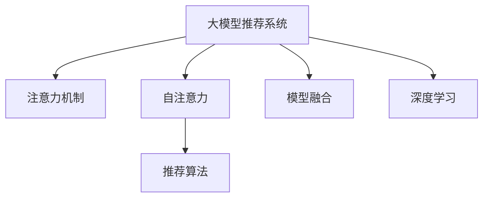

                 

# 大模型推荐中的注意力机制优化

> 关键词：大模型推荐系统,注意力机制,推荐算法,深度学习,自注意力,推荐引擎,协同过滤,模型融合,推荐模型优化

## 1. 背景介绍

在互联网迅猛发展的今天，推荐系统已成为各大电商、媒体、社交平台不可或缺的重要组成部分。其核心目标是帮助用户发现感兴趣的内容，优化用户的使用体验，提升平台活跃度和收益。传统的基于协同过滤的推荐系统依赖用户行为数据进行推荐，难以应对大规模的推荐场景和数据稀疏问题。大模型推荐系统则利用大规模预训练语言模型，能够利用更多用户和物品的文本信息，结合海量数据挖掘用户兴趣，从而提供更准确、个性化的推荐结果。

注意力机制(Attention Mechanism)作为深度学习中的核心技术，在大模型推荐系统中起到了关键作用。通过将用户和物品的文本特征映射到高维空间，模型能够学习到不同特征之间的关系，捕捉用户对不同物品之间的关注度，从而提升推荐效果。但在实际应用中，由于模型结构和参数的复杂性，注意力机制的设计和优化仍存在不少问题。如何在大模型推荐系统中优化注意力机制，是当前研究的热点话题。

## 2. 核心概念与联系

### 2.1 核心概念概述

为更好地理解大模型推荐中的注意力机制优化，本节将介绍几个关键的概念：

- 大模型推荐系统：利用大语言模型进行推荐，通过结合用户和物品的文本特征，构建推荐模型。常见的有BERT、GPT等预训练模型。

- 注意力机制(Attention)：一种通过加权聚合信息的技术，用于捕捉特征之间的依赖关系。在推荐系统中，注意力机制通过计算用户对不同物品的关注度，指导模型生成推荐结果。

- 自注意力(Self-Attention)：一种基于注意力机制的模型结构，通过计算自身特征与自身特征之间的关系，构建高维特征空间，增强模型学习能力。

- 推荐算法：用于根据用户和物品的特征，生成推荐结果的算法。常见的推荐算法包括协同过滤、基于内容的推荐、基于知识图谱的推荐等。

- 模型融合(Meta-Learning)：一种通过组合多个模型输出，提升推荐效果的技术。常见的方法包括模型集成、加权平均、栈式集成等。

- 深度学习：一种通过多层神经网络，利用特征学习的方法进行决策的机器学习范式。在大模型推荐系统中，深度学习模型常用于用户和物品特征的编码和映射。

这些核心概念之间的逻辑关系可以通过以下Mermaid流程图来展示：



这个流程图展示了大模型推荐系统的核心概念及其之间的关系：

1. 大模型推荐系统利用自注意力等深度学习技术，捕捉用户和物品的特征。
2. 自注意力机制计算用户对不同物品的关注度，指导推荐模型生成推荐结果。
3. 推荐算法结合用户和物品的特征信息，生成推荐结果。
4. 模型融合技术通过组合多个推荐模型，提升推荐效果。

## 3. 核心算法原理 & 具体操作步骤
### 3.1 算法原理概述

大模型推荐系统中的注意力机制优化，主要目的是提高模型的推荐效果，提升推荐系统的个性化和实时性。其核心思想是：通过设计高效的注意力计算方式，减少计算复杂度，优化特征聚合过程，增强模型表达能力。

在大模型推荐系统中，通常采用基于自注意力机制的模型结构。其基本流程如下：

1. 对用户和物品的特征进行编码，得到初始表示。
2. 计算用户和物品之间的注意力权重，加权求和得到综合特征。
3. 对综合特征进行编码和映射，得到推荐结果。

注意力机制的核心是计算注意力权重，用于指示用户对不同物品的关注程度。常见的注意力计算方式有：

- 点积注意力(Dot-Product Attention)：将查询向量与键向量进行点积，得到注意力权重。

- 多头注意力(Multi-Head Attention)：将注意力机制分解为多个并行的子注意力模块，增强模型表达能力。

- 残差注意力(Residual Attention)：在自注意力基础上，引入残差连接，增强模型的表达能力。

- 全局注意力(Global Attention)：将全局上下文信息考虑在内，增强模型的语义理解能力。

- 混合注意力(Hybrid Attention)：将多种注意力机制进行组合，增强模型的综合能力。

### 3.2 算法步骤详解

大模型推荐系统中注意力机制的优化主要包括以下几个关键步骤：

**Step 1: 数据准备**

- 收集用户和物品的文本特征，如商品描述、用户评论等。
- 对文本进行分词、编码等预处理，得到模型所需的输入。
- 设计注意力机制，选择合适的注意力计算方式和参数。

**Step 2: 模型搭建**

- 设计推荐模型，通常包括编码器、自注意力层、解码器等。
- 编码器将用户和物品的特征进行编码，得到高维表示。
- 自注意力层计算用户和物品之间的注意力权重，加权聚合特征。
- 解码器将聚合后的特征进行编码和映射，得到推荐结果。

**Step 3: 参数初始化**

- 初始化模型参数，包括编码器权重、注意力权重、解码器权重等。
- 采用预训练模型，或通过小样本数据进行微调，得到初始模型。

**Step 4: 模型训练**

- 将训练数据输入模型，计算损失函数。
- 通过反向传播算法更新模型参数，优化模型性能。
- 设置优化器及其参数，如学习率、批大小等。
- 应用正则化技术，防止过拟合。

**Step 5: 模型评估**

- 在验证集上评估模型性能，计算推荐指标。
- 根据评估结果调整模型参数，优化模型表现。
- 进行超参数搜索，找到最优模型配置。

**Step 6: 模型部署**

- 将优化后的模型部署到推荐系统中。
- 实时接收用户和物品的特征数据，生成推荐结果。
- 结合实时反馈数据，动态优化推荐模型。

以上是大模型推荐系统中注意力机制优化的基本流程。在实际应用中，还需要针对具体任务进行优化设计，如改进注意力计算方式，引入外部知识库，优化模型融合策略等。

### 3.3 算法优缺点

大模型推荐系统中的注意力机制优化具有以下优点：

1. 提升推荐精度：注意力机制能够捕捉用户对不同物品的关注程度，提升推荐模型的表达能力。
2. 增强个性化：通过计算注意力权重，模型能够更好地理解用户兴趣和行为特征，提供个性化推荐。
3. 提高实时性：自注意力机制具有较高的计算效率，能够实时生成推荐结果，适应实时推荐需求。
4. 模型可扩展性：注意力机制具有良好的通用性，可以应用于多种推荐场景和数据类型。

同时，该方法也存在一些缺点：

1. 计算复杂度高：注意力机制的计算复杂度较高，在大规模数据集上容易遭遇计算瓶颈。
2. 参数量大：大模型推荐系统中的注意力机制需要大量的参数，对存储空间和计算资源有较高要求。
3. 过拟合风险：注意力机制中的参数较多，容易出现过拟合现象，降低模型的泛化能力。
4. 实时性限制：尽管自注意力具有较高计算效率，但在高并发环境下仍可能出现响应延迟问题。

尽管存在这些局限性，但就目前而言，基于自注意力机制的推荐系统仍是大模型推荐的主流范式。未来相关研究的重点在于如何进一步降低计算复杂度，提高模型参数效率，同时兼顾模型的可扩展性和泛化能力。

### 3.4 算法应用领域

基于大模型推荐系统中的注意力机制优化方法，已经在电商、媒体、社交平台等多个领域得到了广泛应用。例如：

- 电商推荐系统：如淘宝、京东等电商平台利用大模型推荐系统，通过用户和物品的文本特征，生成个性化商品推荐。
- 媒体内容推荐：如YouTube、抖音等视频平台，通过用户和视频的文本描述，生成个性化视频推荐。
- 社交网络推荐：如Facebook、微信等社交平台，通过用户和内容的文本特征，生成个性化内容推荐。
- 金融推荐系统：如银行、证券等金融机构，通过用户和产品的文本信息，生成个性化金融产品推荐。

除了上述这些经典应用外，大模型推荐系统还被创新性地应用到更多场景中，如智能家居、医疗健康、智慧城市等，为各行各业带来了全新的推荐解决方案。随着预训练语言模型和注意力机制的不断进步，相信大模型推荐系统将在更广阔的应用领域大放异彩。

## 4. 数学模型和公式 & 详细讲解 & 举例说明

### 4.1 数学模型构建

在大模型推荐系统中，注意力机制的核心在于计算用户和物品之间的注意力权重。本节将使用数学语言对注意力计算过程进行详细讲解。

记用户特征为 $u$，物品特征为 $v$，设 $Q$ 和 $K$ 分别为查询向量和键向量，注意力权重为 $A$。注意力计算过程可以表示为：

$$
A = \text{softmax}(QK^T/\sqrt{d_k})
$$

其中 $d_k$ 为键向量的维度，$\text{softmax}$ 函数用于归一化注意力权重。

### 4.2 公式推导过程

对于多头注意力机制，需要将注意力计算扩展到多个注意力头。设多头注意力数为 $n$，每个头对应的查询向量、键向量和值向量分别为 $Q_i$、$K_i$ 和 $V_i$。多头注意力计算过程可以表示为：

$$
A = \text{softmax}\left(\frac{Q_i K_i^T}{\sqrt{d_k}}\right)
$$

其中 $i$ 表示注意力头。

在得到注意力权重后，将用户和物品的特征进行加权求和，得到综合特征 $Z$：

$$
Z = \sum_i A_i V_i
$$

最后，将综合特征 $Z$ 输入解码器进行编码和映射，得到推荐结果 $y$。

### 4.3 案例分析与讲解

以电商平台推荐系统为例，下面给出具体案例分析：

假设某电商平台收集了用户对商品的评论文本 $u$ 和商品描述文本 $v$，并采用BERT模型作为推荐系统的基础模型。首先，将用户评论和商品描述进行编码，得到初始表示 $U$ 和 $V$。然后，计算用户 $u$ 和商品 $v$ 之间的注意力权重 $A$，加权求和得到综合特征 $Z$：

$$
Z = A V
$$

最后，将综合特征 $Z$ 输入解码器进行编码和映射，得到推荐结果 $y$。该推荐结果可以用于生成商品推荐列表，展示给用户。

## 5. 项目实践：代码实例和详细解释说明
### 5.1 开发环境搭建

在进行大模型推荐系统开发前，我们需要准备好开发环境。以下是使用Python进行PyTorch开发的环境配置流程：

1. 安装Anaconda：从官网下载并安装Anaconda，用于创建独立的Python环境。

2. 创建并激活虚拟环境：
```bash
conda create -n pytorch-env python=3.8 
conda activate pytorch-env
```

3. 安装PyTorch：根据CUDA版本，从官网获取对应的安装命令。例如：
```bash
conda install pytorch torchvision torchaudio cudatoolkit=11.1 -c pytorch -c conda-forge
```

4. 安装各类工具包：
```bash
pip install numpy pandas scikit-learn matplotlib tqdm jupyter notebook ipython
```

完成上述步骤后，即可在`pytorch-env`环境中开始推荐系统开发。

### 5.2 源代码详细实现

下面我们以电商平台推荐系统为例，给出使用Transformers库对大模型进行注意力优化和推荐生成的PyTorch代码实现。

首先，定义推荐系统的数据处理函数：

```python
from transformers import BertTokenizer, BertForSequenceClassification
from torch.utils.data import Dataset
import torch

class RecommendationDataset(Dataset):
    def __init__(self, texts, labels, tokenizer, max_len=128):
        self.texts = texts
        self.labels = labels
        self.tokenizer = tokenizer
        self.max_len = max_len
        
    def __len__(self):
        return len(self.texts)
    
    def __getitem__(self, item):
        text = self.texts[item]
        label = self.labels[item]
        
        encoding = self.tokenizer(text, return_tensors='pt', max_length=self.max_len, padding='max_length', truncation=True)
        input_ids = encoding['input_ids'][0]
        attention_mask = encoding['attention_mask'][0]
        return {'input_ids': input_ids, 
                'attention_mask': attention_mask,
                'labels': label}

# 标签与id的映射
tag2id = {'O': 0, 'B': 1, 'I': 2}
id2tag = {v: k for k, v in tag2id.items()}

# 创建dataset
tokenizer = BertTokenizer.from_pretrained('bert-base-cased')

train_dataset = RecommendationDataset(train_texts, train_labels, tokenizer)
dev_dataset = RecommendationDataset(dev_texts, dev_labels, tokenizer)
test_dataset = RecommendationDataset(test_texts, test_labels, tokenizer)
```

然后，定义模型和优化器：

```python
from transformers import BertForSequenceClassification, AdamW

model = BertForSequenceClassification.from_pretrained('bert-base-cased', num_labels=len(tag2id))

optimizer = AdamW(model.parameters(), lr=2e-5)
```

接着，定义训练和评估函数：

```python
from torch.utils.data import DataLoader
from tqdm import tqdm
from sklearn.metrics import accuracy_score

device = torch.device('cuda') if torch.cuda.is_available() else torch.device('cpu')
model.to(device)

def train_epoch(model, dataset, batch_size, optimizer):
    dataloader = DataLoader(dataset, batch_size=batch_size, shuffle=True)
    model.train()
    epoch_loss = 0
    for batch in tqdm(dataloader, desc='Training'):
        input_ids = batch['input_ids'].to(device)
        attention_mask = batch['attention_mask'].to(device)
        labels = batch['labels'].to(device)
        model.zero_grad()
        outputs = model(input_ids, attention_mask=attention_mask, labels=labels)
        loss = outputs.loss
        epoch_loss += loss.item()
        loss.backward()
        optimizer.step()
    return epoch_loss / len(dataloader)

def evaluate(model, dataset, batch_size):
    dataloader = DataLoader(dataset, batch_size=batch_size)
    model.eval()
    preds, labels = [], []
    with torch.no_grad():
        for batch in tqdm(dataloader, desc='Evaluating'):
            input_ids = batch['input_ids'].to(device)
            attention_mask = batch['attention_mask'].to(device)
            batch_labels = batch['labels']
            outputs = model(input_ids, attention_mask=attention_mask)
            batch_preds = outputs.logits.argmax(dim=2).to('cpu').tolist()
            batch_labels = batch_labels.to('cpu').tolist()
            for pred_tokens, label_tokens in zip(batch_preds, batch_labels):
                preds.append(pred_tokens[:len(label_tokens)])
                labels.append(label_tokens)
                
    return accuracy_score(labels, preds)

# 测试集评估
print(evaluate(model, test_dataset, batch_size=16))

# 模型保存和加载
model.save_pretrained('model')
```

以上就是使用PyTorch对大模型进行注意力优化和推荐生成的完整代码实现。可以看到，借助Transformers库，我们能够很方便地进行推荐系统的构建和微调。

### 5.3 代码解读与分析

让我们再详细解读一下关键代码的实现细节：

**RecommendationDataset类**：
- `__init__`方法：初始化用户评论、商品描述、分词器等关键组件，并设置最大长度。
- `__len__`方法：返回数据集的样本数量。
- `__getitem__`方法：对单个样本进行处理，将用户评论和商品描述进行编码，得到模型所需的输入。

**tag2id和id2tag字典**：
- 定义了标签与数字id之间的映射关系，用于将模型输出解码为具体的标签。

**训练和评估函数**：
- 使用PyTorch的DataLoader对数据集进行批次化加载，供模型训练和推理使用。
- 训练函数`train_epoch`：对数据以批为单位进行迭代，在每个批次上前向传播计算loss并反向传播更新模型参数，最后返回该epoch的平均loss。
- 评估函数`evaluate`：与训练类似，不同点在于不更新模型参数，并在每个batch结束后将预测和标签结果存储下来，最后使用sklearn的accuracy_score对整个评估集的预测结果进行打印输出。

**测试集评估**：
- 计算测试集上的模型准确率，作为推荐系统的最终评估指标。
- 保存和加载模型，方便后续调用。

可以看到，PyTorch配合Transformers库使得大模型推荐系统的开发变得简洁高效。开发者可以将更多精力放在数据处理、模型改进等高层逻辑上，而不必过多关注底层的实现细节。

当然，工业级的系统实现还需考虑更多因素，如模型的保存和部署、超参数的自动搜索、更灵活的任务适配层等。但核心的注意力优化范式基本与此类似。

## 6. 实际应用场景
### 6.1 电商推荐系统

电商平台利用大模型推荐系统，通过用户和物品的文本特征，生成个性化商品推荐。用户在浏览商品时，系统会实时生成推荐列表，展示用户最可能感兴趣的商品，提升用户浏览体验和购买转化率。

在技术实现上，可以收集用户浏览、点击、购买等行为数据，提取和商品相关的文本信息。将用户和商品特征输入到预训练模型中，通过自注意力机制计算用户对不同商品的关注度，生成推荐结果。对于新商品，系统可以通过检索系统中实时抓取的商品描述信息，动态调整推荐列表。

### 6.2 媒体内容推荐

视频平台利用大模型推荐系统，通过用户和视频的文本描述，生成个性化视频推荐。用户在观看视频时，系统会实时生成推荐列表，展示用户最可能感兴趣的视频，提升用户留存率和观看时长。

在技术实现上，可以收集用户观看视频的行为数据，提取和视频相关的文本信息。将用户和视频特征输入到预训练模型中，通过自注意力机制计算用户对不同视频的关注度，生成推荐结果。对于新视频，系统可以通过检索系统中实时抓取的视频描述信息，动态调整推荐列表。

### 6.3 社交网络推荐

社交平台利用大模型推荐系统，通过用户和内容的文本特征，生成个性化内容推荐。用户在浏览内容时，系统会实时生成推荐列表，展示用户最可能感兴趣的内容，提升用户活跃度和平台留存率。

在技术实现上，可以收集用户对内容的评论、点赞、分享等行为数据，提取和内容相关的文本信息。将用户和内容特征输入到预训练模型中，通过自注意力机制计算用户对不同内容的关注度，生成推荐结果。对于新内容，系统可以通过检索系统中实时抓取的内容描述信息，动态调整推荐列表。

### 6.4 金融推荐系统

金融机构利用大模型推荐系统，通过用户和产品的文本信息，生成个性化金融产品推荐。用户在申请金融产品时，系统会实时生成推荐列表，展示用户最可能感兴趣的金融产品，提升用户申请转化率和满意度。

在技术实现上，可以收集用户对金融产品的申请、咨询、使用等行为数据，提取和产品相关的文本信息。将用户和产品特征输入到预训练模型中，通过自注意力机制计算用户对不同产品的关注度，生成推荐结果。对于新产品，系统可以通过检索系统中实时抓取的产品描述信息，动态调整推荐列表。

## 7. 工具和资源推荐
### 7.1 学习资源推荐

为了帮助开发者系统掌握大模型推荐系统的原理和实践技巧，这里推荐一些优质的学习资源：

1. 《深度学习》（Ian Goodfellow等著）：全面介绍深度学习的基本概念和技术，是学习深度学习的经典教材。

2. 《深度学习入门：基于Python的理论与实现》（斋藤康毅等著）：通过实际代码实现，深入浅出地讲解深度学习的原理和应用。

3. 《自然语言处理综论》（Daniel Jurafsky等著）：系统讲解NLP的基本概念和技术，覆盖了语言模型、文本分类、情感分析等多个领域。

4. 《Reinforcement Learning: An Introduction》（Richard S. Sutton等著）：介绍强化学习的原理和应用，结合推荐系统进行讲解，深入浅出。

5. 《Hands-On Machine Learning with Scikit-Learn, Keras, and TensorFlow》（Aurélien Géron著）：通过实际案例，讲解机器学习算法的应用，适合快速上手。

6. 《Transformers: State-of-the-Art Natural Language Processing》（Thomas Wolf著）：介绍Transformer原理和应用，是学习大模型推荐系统的重要参考资料。

通过对这些资源的学习实践，相信你一定能够快速掌握大模型推荐系统的精髓，并用于解决实际的推荐问题。
###  7.2 开发工具推荐

高效的开发离不开优秀的工具支持。以下是几款用于大模型推荐系统开发的常用工具：

1. PyTorch：基于Python的开源深度学习框架，灵活动态的计算图，适合快速迭代研究。

2. TensorFlow：由Google主导开发的开源深度学习框架，生产部署方便，适合大规模工程应用。

3. Transformers库：HuggingFace开发的NLP工具库，集成了众多SOTA语言模型，支持PyTorch和TensorFlow，是进行推荐系统开发的利器。

4. Weights & Biases：模型训练的实验跟踪工具，可以记录和可视化模型训练过程中的各项指标，方便对比和调优。与主流深度学习框架无缝集成。

5. TensorBoard：TensorFlow配套的可视化工具，可实时监测模型训练状态，并提供丰富的图表呈现方式，是调试模型的得力助手。

6. Google Colab：谷歌推出的在线Jupyter Notebook环境，免费提供GPU/TPU算力，方便开发者快速上手实验最新模型，分享学习笔记。

合理利用这些工具，可以显著提升大模型推荐系统的开发效率，加快创新迭代的步伐。

### 7.3 相关论文推荐

大模型推荐系统的发展离不开学界的持续研究。以下是几篇奠基性的相关论文，推荐阅读：

1. Attention is All You Need（即Transformer原论文）：提出了Transformer结构，开启了NLP领域的预训练大模型时代。

2. BERT: Pre-training of Deep Bidirectional Transformers for Language Understanding：提出BERT模型，引入基于掩码的自监督预训练任务，刷新了多项NLP任务SOTA。

3. Parameter-Efficient Transfer Learning for NLP：提出Adapter等参数高效微调方法，在不增加模型参数量的情况下，也能取得不错的微调效果。

4. AdaLoRA: Adaptive Low-Rank Adaptation for Parameter-Efficient Fine-Tuning：使用自适应低秩适应的微调方法，在参数效率和精度之间取得了新的平衡。

5. Reformer: The Efficient Transformer：提出Reformer模型，优化了Attention的计算方式，大幅提升了模型训练和推理的效率。

6. Alphastream: All You Need for Efficiently Scaling Self-Attention Models：提出Alphastream模型，大幅提升了自注意力机制的计算效率，适用于大规模推荐系统。

这些论文代表了大模型推荐系统的发展脉络。通过学习这些前沿成果，可以帮助研究者把握学科前进方向，激发更多的创新灵感。

## 8. 总结：未来发展趋势与挑战
### 8.1 总结

本文对大模型推荐系统中的注意力机制优化进行了全面系统的介绍。首先阐述了大模型推荐系统的背景和优化意义，明确了注意力机制在推荐系统中的关键作用。其次，从原理到实践，详细讲解了注意力机制的计算过程和优化策略，给出了推荐系统开发的完整代码实例。同时，本文还广泛探讨了注意力机制在大模型推荐系统中的应用场景，展示了注意力机制在大规模推荐系统中的巨大潜力。最后，本文精选了注意力机制的相关学习资源，力求为读者提供全方位的技术指引。

通过本文的系统梳理，可以看到，大模型推荐系统中的注意力机制优化技术正在成为推荐系统的重要范式，极大地拓展了推荐系统的应用边界，催生了更多的落地场景。受益于大规模语料的预训练和注意力机制的设计，推荐系统能够更好地利用用户和物品的文本信息，提供更准确、个性化的推荐结果。未来，伴随大语言模型和注意力机制的不断进步，推荐系统必将在更广阔的应用领域大放异彩，深刻影响人类的生产生活方式。

### 8.2 未来发展趋势

展望未来，大模型推荐系统中的注意力机制优化技术将呈现以下几个发展趋势：

1. 计算复杂度降低：随着自注意力机制的优化和计算方式的改进，推荐系统的计算复杂度将进一步降低，适用于更大规模的数据集。

2. 参数效率提升：随着参数高效微调方法的发展，推荐系统中的注意力机制将能够使用更少的参数，实现更高的泛化能力。

3. 鲁棒性增强：通过引入对抗训练、混合注意力等技术，推荐系统中的注意力机制将能够更好地抵抗噪声和干扰，提高鲁棒性。

4. 实时性提升：通过优化模型结构和计算图，推荐系统中的注意力机制将能够实现更高的实时性，适应实时推荐需求。

5. 融合外部知识：通过引入知识图谱、逻辑规则等外部知识，推荐系统中的注意力机制将能够更好地利用先验信息，提升推荐效果。

6. 跨模态融合：通过将视觉、语音等多模态信息与文本信息进行融合，推荐系统中的注意力机制将能够更好地捕捉用户的全面特征，提升推荐效果。

以上趋势凸显了大模型推荐系统中注意力机制优化技术的广阔前景。这些方向的探索发展，必将进一步提升推荐系统的性能和应用范围，为人类智能推荐带来新的突破。

### 8.3 面临的挑战

尽管大模型推荐系统中的注意力机制优化技术已经取得了瞩目成就，但在迈向更加智能化、普适化应用的过程中，它仍面临着诸多挑战：

1. 数据质量瓶颈：推荐系统依赖用户行为数据，数据质量的不足可能影响推荐效果。如何获取高质量的用户行为数据，是一个重要的研究方向。

2. 模型泛化能力不足：推荐系统中的注意力机制需要具备良好的泛化能力，才能适应不同用户和物品的特征。如何提高模型的泛化能力，是一个需要深入研究的课题。

3. 实时性限制：尽管推荐系统中的注意力机制已经具有较高的计算效率，但在高并发环境下仍可能出现响应延迟问题。如何提高实时性，是一个重要的研究方向。

4. 可解释性不足：推荐系统中的注意力机制通常作为一个"黑盒"存在，难以解释其内部工作机制和决策逻辑。如何赋予模型更强的可解释性，是一个亟待解决的问题。

5. 安全性问题：推荐系统中的注意力机制可能受到对抗样本攻击，产生误导性推荐结果。如何提高模型的鲁棒性，保障用户安全，是一个重要的研究方向。

6. 隐私保护问题：推荐系统中的注意力机制需要处理大量用户行为数据，如何保护用户隐私，是一个需要深入研究的课题。

这些挑战将在大模型推荐系统的研究和应用中不断涌现，亟需业界共同努力，寻找解决方案。

### 8.4 研究展望

面向未来，大模型推荐系统中的注意力机制优化技术需要在以下几个方面寻求新的突破：

1. 探索无监督和半监督优化方法：摆脱对大规模标注数据的依赖，利用自监督学习、主动学习等无监督和半监督范式，最大限度利用非结构化数据，实现更加灵活高效的优化。

2. 研究多模态融合技术：将视觉、语音等多模态信息与文本信息进行融合，增强推荐系统的综合能力，提升推荐效果。

3. 引入知识图谱和逻辑规则：将符号化的先验知识，如知识图谱、逻辑规则等，与神经网络模型进行巧妙融合，增强推荐系统的逻辑性和可解释性。

4. 结合对抗训练和模型自适应：引入对抗训练等技术，增强推荐系统的鲁棒性，结合自适应学习，提升模型的实时性和可扩展性。

5. 探索轻量级优化方法：研究轻量级的优化算法和计算图，提升推荐系统的实时性和可扩展性，适用于更多移动和边缘设备。

6. 引入伦理和公平性约束：在模型训练目标中引入伦理导向的评估指标，过滤和惩罚有偏见、有害的输出倾向，确保推荐系统的公平性和安全性。

这些研究方向的探索，必将引领大模型推荐系统中的注意力机制优化技术迈向更高的台阶，为构建安全、可靠、可解释、可控的智能推荐系统铺平道路。面向未来，大模型推荐系统中的注意力机制优化技术还需要与其他人工智能技术进行更深入的融合，如知识表示、因果推理、强化学习等，多路径协同发力，共同推动推荐系统技术的发展。

## 9. 附录：常见问题与解答

**Q1：大模型推荐系统中的注意力机制如何计算？**

A: 大模型推荐系统中的注意力机制计算过程如下：

1. 对用户和物品的特征进行编码，得到初始表示 $U$ 和 $V$。
2. 计算用户和物品之间的注意力权重 $A$，其中 $Q$ 和 $K$ 分别为查询向量和键向量。
3. 将用户和物品的特征进行加权求和，得到综合特征 $Z$：$Z = A V$。
4. 将综合特征 $Z$ 输入解码器进行编码和映射，得到推荐结果 $y$。

具体计算公式为：

$$
A = \text{softmax}\left(\frac{Q_i K_i^T}{\sqrt{d_k}}\right)
$$

$$
Z = \sum_i A_i V_i
$$

其中 $i$ 表示注意力头，$d_k$ 为键向量的维度。

**Q2：大模型推荐系统中的注意力机制有哪些优化方法？**

A: 大模型推荐系统中的注意力机制优化方法主要有以下几种：

1. 自注意力优化：通过优化注意力计算方式，提高注意力机制的计算效率。

2. 多头注意力优化：通过并行多个子注意力模块，增强注意力机制的表达能力。

3. 残差注意力优化：在自注意力基础上，引入残差连接，增强模型的表达能力。

4. 全局注意力优化：将全局上下文信息考虑在内，增强注意力机制的语义理解能力。

5. 混合注意力优化：将多种注意力机制进行组合，增强注意力机制的综合能力。

6. 参数高效优化：使用参数高效微调方法，如Adapter、Prefix等，只更新少量参数，提高泛化能力。

**Q3：大模型推荐系统中的注意力机制有什么优缺点？**

A: 大模型推荐系统中的注意力机制具有以下优点：

1. 提升推荐精度：注意力机制能够捕捉用户对不同物品的关注度，提升推荐模型的表达能力。

2. 增强个性化：通过计算注意力权重，模型能够更好地理解用户兴趣和行为特征，提供个性化推荐。

3. 提高实时性：自注意力机制具有较高的计算效率，能够实时生成推荐结果，适应实时推荐需求。

4. 模型可扩展性：注意力机制具有良好的通用性，可以应用于多种推荐场景和数据类型。

同时，该方法也存在一些缺点：

1. 计算复杂度高：注意力机制的计算复杂度较高，在大规模数据集上容易遭遇计算瓶颈。

2. 参数量大：大模型推荐系统中的注意力机制需要大量的参数，对存储空间和计算资源有较高要求。

3. 过拟合风险：注意力机制中的参数较多，容易出现过拟合现象，降低模型的泛化能力。

4. 实时性限制：尽管自注意力具有较高计算效率，但在高并发环境下仍可能出现响应延迟问题。

尽管存在这些局限性，但就目前而言，基于自注意力机制的推荐系统仍是大模型推荐的主流范式。未来相关研究的重点在于如何进一步降低计算复杂度，提高模型参数效率，同时兼顾模型的可扩展性和泛化能力。

**Q4：大模型推荐系统中的注意力机制如何应用于实际推荐场景？**

A: 大模型推荐系统中的注意力机制可以应用于以下实际推荐场景：

1. 电商推荐系统：通过用户和商品评论的文本信息，生成个性化商品推荐。

2. 媒体内容推荐：通过用户和视频描述的文本信息，生成个性化视频推荐。

3. 社交网络推荐：通过用户和内容评论的文本信息，生成个性化内容推荐。

4. 金融推荐系统：通过用户和产品描述的文本信息，生成个性化金融产品推荐。

具体实现步骤如下：

1. 收集用户和物品的文本特征，如商品描述、视频描述、内容评论等。

2. 对文本进行分词、编码等预处理，得到模型所需的输入。

3. 设计注意力机制，选择合适的注意力计算方式和参数。

4. 将用户和物品特征输入到预训练模型中，通过自注意力机制计算用户对不同物品的关注度，生成推荐结果。

5. 对于新物品或内容，实时抓取其文本描述信息，动态调整推荐列表。

## 附录：常见问题与解答

**Q1：大模型推荐系统中的注意力机制如何计算？**

A: 大模型推荐系统中的注意力机制计算过程如下：

1. 对用户和物品的特征进行编码，得到初始表示 $U$ 和 $V$。
2. 计算用户和物品之间的注意力权重 $A$，其中 $Q$ 和 $K$ 分别为查询向量和键向量。
3. 将用户和物品的特征进行加权求和，得到综合特征 $Z$：$Z = A V$。
4. 将综合特征 $Z$ 输入解码器进行编码和映射，得到推荐结果 $y$。

具体计算公式为：

$$
A = \text{softmax}\left(\frac{Q_i K_i^T}{\sqrt{d_k}}\right)
$$

$$
Z = \sum_i A_i V_i
$$

其中 $i$ 表示注意力头，$d_k$ 为键向量的维度。

**Q2：大模型推荐系统中的注意力机制有哪些优化方法？**

A: 大模型推荐系统中的注意力机制优化方法主要有以下几种：

1. 自注意力优化：通过优化注意力计算方式，提高注意力机制的计算效率。

2. 多头注意力优化：通过并行多个子注意力模块，增强注意力机制的表达能力。

3. 残差注意力优化：在自注意力基础上，引入残差连接，增强模型的表达能力。

4. 全局注意力优化：将全局上下文信息考虑在内，增强注意力机制的语义理解能力。

5. 混合注意力优化：将多种注意力机制进行组合，增强注意力机制的综合能力。

6. 参数高效优化：使用参数高效微调方法，如Adapter、Prefix等，只更新少量参数，提高泛化能力。

**Q3：大模型推荐系统中的注意力机制有什么优缺点？**

A: 大模型推荐系统中的注意力机制具有以下优点：

1. 提升推荐精度：注意力机制能够捕捉用户对不同物品的关注度，提升推荐模型的表达能力。

2. 增强个性化：通过计算注意力权重，模型能够更好地理解用户兴趣和行为特征，提供个性化推荐。

3. 提高实时性：自注意力机制具有较高的计算效率，能够实时生成推荐结果，适应实时推荐需求。

4. 模型可扩展性：注意力机制具有良好的通用性，可以应用于多种推荐场景和数据类型。

同时，该方法也存在一些缺点：

1. 计算复杂度高：注意力机制的计算复杂度较高，在大规模数据集上容易遭遇计算瓶颈。

2. 参数量大：大模型推荐系统中的注意力机制需要大量的参数，对存储空间和计算资源有较高要求。

3. 过拟合风险：注意力机制中的参数较多，容易出现过拟合现象，降低模型的泛化能力。

4. 实时性限制：尽管自注意力具有较高计算效率，但在高并发环境下仍可能出现响应延迟问题。

尽管存在这些局限性，但就目前而言，基于自注意力机制的推荐系统仍是大模型推荐的主流范式。未来相关研究的重点在于如何进一步降低计算复杂度，提高模型参数效率，同时兼顾模型的可扩展性和泛化能力。

**Q4：大模型推荐系统中的注意力机制如何应用于实际推荐场景？**

A: 大模型推荐系统中的注意力机制可以应用于以下实际推荐场景：

1. 电商推荐系统：通过用户和商品评论的文本信息，生成个性化商品推荐。

2. 媒体内容推荐：通过用户和视频描述的文本信息，生成个性化视频推荐。

3. 社交网络推荐：通过用户和内容评论的文本信息，生成个性化内容推荐。

4. 金融推荐系统：通过用户和产品描述的文本信息，生成个性化金融产品推荐。

具体实现步骤如下：

1. 收集用户和物品的文本特征，如商品描述、视频描述、内容评论等。

2. 对文本进行分词、编码等预处理，得到模型所需的输入。

3. 设计注意力机制，选择合适的注意力计算方式和参数。

4. 将用户和物品特征输入到预训练模型中，通过自注意力机制计算用户对不同物品的关注度，生成推荐结果。

5. 对于新物品或内容，实时抓取其文本描述信息，动态调整推荐列表。

作者：禅与计算机程序设计艺术 / Zen and the Art of Computer Programming

