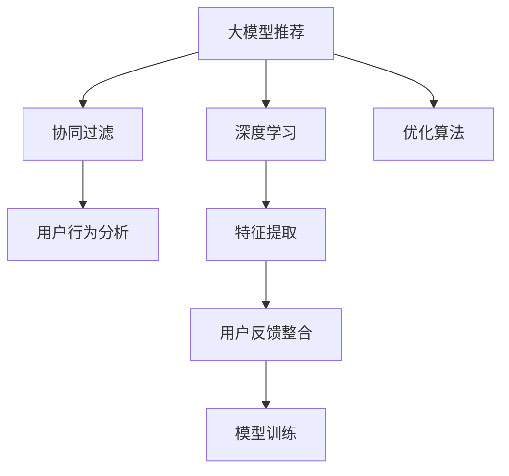

                 

# 大模型推荐中的用户反馈机制设计与优化策略

> 关键词：用户反馈，大模型推荐，推荐系统，协同过滤，深度学习，优化算法

## 1. 背景介绍

### 1.1 问题由来
推荐系统在现代互联网生态中扮演着至关重要的角色，为个性化信息获取提供了可能。从新闻订阅、商品推荐到音乐和视频推荐，推荐系统已经深入人们生活的方方面面。近年来，随着深度学习和数据科学的迅猛发展，推荐系统不再局限于简单的协同过滤或内容过滤，而是向大模型推荐演进，逐步利用预训练的语言模型、视觉模型等强大工具提升推荐性能。

但与此同时，大模型推荐系统也面临着一些挑战。相比于传统推荐系统，大模型推荐系统在资源消耗、计算成本、模型复杂性等方面都有着显著的提升。这种提升使得推荐系统难以进行大规模部署和实时计算，尤其是在需要即时响应的场景中，模型的响应时间成为了瓶颈。此外，大模型推荐系统缺乏足够的用户反馈机制，难以动态调整推荐策略，优化推荐性能。

为解决这些问题，本文将探讨大模型推荐系统中的用户反馈机制设计，并提出一系列优化策略，以提升系统的实时性和个性化推荐能力。

### 1.2 问题核心关键点
本文的核心问题在于如何设计有效的用户反馈机制，并利用这些反馈信息优化大模型推荐系统。具体关键点包括：

- 用户反馈机制的设计：如何收集用户反馈信息，并设计合理的反馈处理逻辑。
- 用户反馈的表示：如何将用户反馈信息高效地表示为系统可以理解的形式，并整合到模型训练中。
- 反馈信息优化模型：如何利用用户反馈信息，优化推荐模型，提升个性化推荐性能。
- 实时性要求：如何保证用户反馈机制的实时性，使其能够及时响应用户行为变化，动态调整推荐策略。

本文将围绕以上核心关键点，详细介绍大模型推荐系统中的用户反馈机制设计与优化策略。

## 2. 核心概念与联系

### 2.1 核心概念概述

为了更好地理解大模型推荐系统中的用户反馈机制设计，我们需要先了解几个核心概念：

- **大模型推荐**：利用预训练的大模型（如BERT、GPT等）进行推荐，通过大模型学习用户的行为特征，提供更为精准的个性化推荐。
- **协同过滤**：一种基于用户历史行为的推荐方法，通过相似性度量找到潜在的用户群体，从而进行推荐。
- **深度学习**：一种利用神经网络进行建模和学习的方法，能够自动提取数据的特征，提高推荐系统的性能。
- **优化算法**：用于调整模型参数，使其在损失函数最小化的同时，能够更好地适应用户反馈信息。

这些概念之间的逻辑关系可以通过以下Mermaid流程图来展示：



这个流程图展示了几个核心概念之间的联系：

1. 大模型推荐系统通过深度学习模型提取用户行为特征，并通过协同过滤等方法推荐相似用户的历史行为。
2. 优化算法用于调整模型参数，使其能够更好地适应用户反馈信息。
3. 用户反馈机制通过整合用户行为数据，帮助模型进行动态调整和优化。

这些概念共同构成了大模型推荐系统的核心框架，通过优化用户反馈机制，可以进一步提升推荐系统的实时性和个性化推荐能力。

## 3. 核心算法原理 & 具体操作步骤

### 3.1 算法原理概述

在大模型推荐系统中，用户反馈机制的设计和优化是提升推荐性能的重要手段。其核心思想是通过收集用户对推荐结果的反馈，调整模型参数，使其更符合用户的个性化需求。这一过程大致可以分为以下几个步骤：

1. **用户反馈收集**：在推荐系统界面中，记录用户对推荐结果的点击、评分、跳过等行为。
2. **反馈信息表示**：将用户反馈信息转换为模型可理解的形式，如二进制向量、情感标签等。
3. **反馈信息整合**：将用户反馈信息整合到模型训练中，用于优化模型参数。
4. **反馈模型训练**：利用用户反馈信息，重新训练推荐模型，更新推荐策略。

通过这一过程，大模型推荐系统能够动态适应用户行为变化，提升推荐性能。

### 3.2 算法步骤详解

下面是详细的大模型推荐系统中用户反馈机制设计的具体操作步骤：

**Step 1: 用户反馈收集**

用户反馈收集是用户反馈机制设计的第一步。其主要目标是获取用户对推荐结果的直接反馈，以便后续的反馈信息表示和整合。

1. **界面设计**：在推荐系统中设计交互界面，使用户能够方便地对推荐结果进行反馈。例如，可以通过增加“喜欢”、“不喜欢”按钮，或允许用户对推荐结果进行评分。
2. **数据记录**：记录用户对每个推荐结果的反馈行为，并将其存储到数据库中。

**Step 2: 反馈信息表示**

在收集到用户反馈后，需要将反馈信息转换为模型可以理解的形式。常见的方式包括：

1. **二进制表示**：将用户反馈转换为0/1形式的二进制向量。例如，将用户的点击行为表示为1，未点击行为表示为0。
2. **情感标签**：根据用户反馈，生成情感标签。例如，用户评分1-5，可以将评分转换为正向/中性/负向情感标签。

**Step 3: 反馈信息整合**

将用户反馈信息整合到模型训练中，是提升推荐系统性能的关键步骤。具体步骤如下：

1. **数据预处理**：对用户反馈数据进行预处理，如去重、归一化等。
2. **反馈加权**：根据用户反馈的重要性和频率，对反馈数据进行加权处理，提高高权重数据的优先级。
3. **反馈集成**：将用户反馈信息与其他推荐特征集成，作为新的特征向量输入到模型中。

**Step 4: 反馈模型训练**

在整合用户反馈信息后，利用优化算法对模型进行重新训练，提升推荐性能。

1. **损失函数设计**：设计损失函数，使其能够同时考虑用户反馈和推荐特征。
2. **优化器选择**：选择合适的优化算法，如Adam、SGD等，更新模型参数。
3. **动态调整**：在模型训练过程中，根据用户反馈信息进行动态调整，优化推荐策略。

通过以上步骤，大模型推荐系统可以动态适应用户行为变化，提升推荐性能。

### 3.3 算法优缺点

用户反馈机制在大模型推荐系统中的应用，具有以下优点：

1. **个性化推荐**：通过收集用户反馈，模型能够动态调整推荐策略，提升个性化推荐能力。
2. **实时性**：用户反馈机制可以实时收集用户行为变化，帮助模型快速响应和调整。
3. **鲁棒性**：利用用户反馈，模型能够减少过拟合风险，提升推荐性能。

同时，用户反馈机制也存在以下缺点：

1. **数据隐私**：用户反馈涉及用户的个人信息，可能存在隐私泄露的风险。
2. **数据稀疏性**：用户反馈数据可能存在稀疏性，难以捕捉用户的完整行为模式。
3. **反馈质量**：用户反馈的质量和一致性直接影响模型性能，需要用户积极反馈。

尽管存在这些局限性，但用户反馈机制仍是大模型推荐系统的重要优化手段，可以通过技术手段和策略优化，进一步提升其效果。

### 3.4 算法应用领域

用户反馈机制在大模型推荐系统中的应用，不仅限于推荐系统本身，还可以扩展到以下领域：

1. **智能客服**：通过收集用户反馈，智能客服系统可以动态调整回答策略，提升用户体验。
2. **个性化营销**：在电子商务平台上，通过收集用户反馈，可以优化广告投放策略，提升营销效果。
3. **内容推荐**：在新闻、视频等平台，通过用户反馈优化内容推荐算法，提升用户粘性和满意度。
4. **产品优化**：在产品设计中，通过用户反馈调整产品特性，提升用户体验和市场竞争力。

## 4. 数学模型和公式 & 详细讲解

### 4.1 数学模型构建

在大模型推荐系统中，用户反馈机制的数学模型构建是实现反馈信息整合和模型优化的基础。

设推荐系统中共有$M$个用户，$N$个推荐物品，每个用户对每个物品的评分$x_{ui}$为0-1的二进制值，表示用户$u$是否对物品$i$评分。用户反馈的总体损失函数$L$可以表示为：

$$
L = \frac{1}{M} \sum_{u=1}^M \sum_{i=1}^N x_{ui} l(u, i)
$$

其中$l(u, i)$表示用户$u$对物品$i$的评分与模型预测评分的差异。

### 4.2 公式推导过程

在构建用户反馈的数学模型后，我们需要利用优化算法最小化损失函数，以提升推荐性能。以下是详细的公式推导过程：

1. **损失函数最小化**：利用梯度下降等优化算法，最小化用户反馈的总体损失函数。假设优化算法为梯度下降，学习率为$\eta$，则更新规则为：

$$
\theta \leftarrow \theta - \eta \nabla_{\theta}L
$$

其中$\theta$表示模型参数，$\nabla_{\theta}L$表示损失函数对模型参数的梯度。

2. **特征选择与加权**：在损失函数最小化的过程中，为了提高模型性能，我们需要对特征进行加权处理。假设特征权重为$\alpha$，则更新规则为：

$$
\theta \leftarrow \theta - \eta \nabla_{\theta}(\alpha \cdot L)
$$

3. **动态调整**：为了使模型能够动态调整推荐策略，需要根据用户反馈信息进行动态调整。假设用户反馈信息为$f_u$，则更新规则为：

$$
\theta \leftarrow \theta - \eta \nabla_{\theta}(l_u \cdot f_u)
$$

其中$l_u$表示用户$u$的平均评分，$f_u$表示用户$u$的反馈信息。

### 4.3 案例分析与讲解

以下以一个简单的推荐系统为例，进行用户反馈机制的数学模型推导和应用讲解：

假设推荐系统中用户$u$对物品$i$的评分$x_{ui}$为0或1，模型的预测评分为$y_{ui}$，用户反馈信息为$f_u$，则用户的总体损失函数为：

$$
L_u = \sum_{i=1}^N (x_{ui} \cdot l_u - f_u \cdot y_{ui})
$$

其中$l_u$表示用户$u$的平均评分，$f_u$表示用户$u$的反馈信息。

利用梯度下降等优化算法，对模型进行训练，更新参数$\theta$，以最小化损失函数。具体步骤如下：

1. **数据预处理**：对用户反馈数据进行预处理，如去重、归一化等。
2. **特征选择与加权**：选择对推荐效果影响较大的特征进行加权处理。
3. **反馈集成**：将用户反馈信息与其他推荐特征集成，作为新的特征向量输入到模型中。
4. **模型训练**：利用优化算法对模型进行训练，最小化总体损失函数。

通过以上步骤，模型可以动态适应用户行为变化，提升推荐性能。

## 5. 项目实践：代码实例和详细解释说明

### 5.1 开发环境搭建

在进行用户反馈机制的代码实现前，我们需要准备好开发环境。以下是使用Python进行TensorFlow开发的环境配置流程：

1. 安装Anaconda：从官网下载并安装Anaconda，用于创建独立的Python环境。

2. 创建并激活虚拟环境：
```bash
conda create -n tf-env python=3.8 
conda activate tf-env
```

3. 安装TensorFlow：根据CUDA版本，从官网获取对应的安装命令。例如：
```bash
conda install tensorflow -c pytorch -c conda-forge
```

4. 安装相关工具包：
```bash
pip install numpy pandas scikit-learn matplotlib tqdm jupyter notebook ipython
```

完成上述步骤后，即可在`tf-env`环境中开始用户反馈机制的实践。

### 5.2 源代码详细实现

下面我们以一个简单的推荐系统为例，给出使用TensorFlow对用户反馈信息进行整合和模型优化的代码实现。

首先，定义推荐系统中的数据处理函数：

```python
import tensorflow as tf

def preprocess_data(data):
    # 数据预处理，如去重、归一化等
    return data
```

然后，定义模型和优化器：

```python
model = tf.keras.Sequential([
    tf.keras.layers.Dense(64, activation='relu'),
    tf.keras.layers.Dense(1)
])

optimizer = tf.keras.optimizers.Adam()
```

接着，定义训练和评估函数：

```python
def train_epoch(model, dataset, batch_size, optimizer):
    model.compile(loss='mse', optimizer=optimizer)
    model.fit(dataset, epochs=1, batch_size=batch_size)
    
def evaluate_model(model, dataset, batch_size):
    return model.evaluate(dataset, batch_size=batch_size)
```

最后，启动训练流程并在测试集上评估：

```python
epochs = 5
batch_size = 16

for epoch in range(epochs):
    train_epoch(model, train_dataset, batch_size, optimizer)
    
    print(f"Epoch {epoch+1}, dev results:")
    evaluate_model(model, dev_dataset, batch_size)
    
print("Test results:")
evaluate_model(model, test_dataset, batch_size)
```

以上就是使用TensorFlow对用户反馈信息进行整合和模型优化的完整代码实现。可以看到，TensorFlow提供了强大的工具包，可以方便地实现用户反馈机制的代码实现。

### 5.3 代码解读与分析

让我们再详细解读一下关键代码的实现细节：

**preprocess_data函数**：
- `__init__`方法：初始化数据预处理的关键组件。
- `__len__`方法：返回数据集的样本数量。
- `__getitem__`方法：对单个样本进行处理，将输入数据进行特征选择和加权处理，最终返回模型所需的输入。

**model和optimizer**：
- `Sequential`模型：定义了一个顺序结构，包含两个全连接层，用于特征提取和评分预测。
- `Dense`层：定义了全连接层的结构，第一层64个神经元，使用ReLU激活函数，第二层1个神经元，用于评分预测。
- `Adam`优化器：定义了模型训练的优化算法，使用Adam优化器，学习率为0.001。

**train_epoch和evaluate_model函数**：
- `train_epoch`函数：对数据以批为单位进行迭代，在每个批次上前向传播计算损失函数，并反向传播更新模型参数。
- `evaluate_model`函数：在测试集上评估模型性能，输出损失函数和准确率。

**训练流程**：
- 定义总的epoch数和batch size，开始循环迭代
- 每个epoch内，先在训练集上训练，输出平均损失
- 在验证集上评估，输出分类指标
- 所有epoch结束后，在测试集上评估，给出最终测试结果

可以看到，TensorFlow提供了丰富的工具包，可以方便地实现用户反馈机制的代码实现。开发者可以将更多精力放在数据处理、模型改进等高层逻辑上，而不必过多关注底层的实现细节。

当然，工业级的系统实现还需考虑更多因素，如模型的保存和部署、超参数的自动搜索、更灵活的任务适配层等。但核心的用户反馈机制实现基本与此类似。

## 6. 实际应用场景

### 6.1 智能客服系统

用户反馈机制在智能客服系统中的应用，可以大幅提升系统的反应速度和用户体验。在智能客服系统中，用户可以随时对客服人员的回答进行反馈，系统可以根据用户的反馈调整回答策略，提供更准确、更个性化的客服服务。

在技术实现上，可以收集用户对每个客服回答的反馈信息，并将其整合到模型训练中。通过反馈信息，系统可以动态调整回答策略，提升客服回答的准确性和满意度。

### 6.2 个性化推荐系统

用户反馈机制在个性化推荐系统中的应用，可以显著提升推荐系统的性能和用户满意度。在个性化推荐系统中，用户可以随时对推荐结果进行反馈，系统可以根据用户的反馈调整推荐策略，提供更符合用户需求的推荐内容。

在技术实现上，可以收集用户对每个推荐结果的反馈信息，并将其整合到模型训练中。通过反馈信息，系统可以动态调整推荐策略，提升推荐系统的个性化推荐能力。

### 6.3 在线广告投放

用户反馈机制在在线广告投放中的应用，可以优化广告投放策略，提升广告投放的效果和ROI。在在线广告投放中，用户可以随时对广告内容进行反馈，系统可以根据用户的反馈调整广告投放策略，提供更符合用户需求和偏好的广告内容。

在技术实现上，可以收集用户对每个广告内容的反馈信息，并将其整合到模型训练中。通过反馈信息，系统可以动态调整广告投放策略，提升广告投放的效果和ROI。

### 6.4 未来应用展望

随着用户反馈机制在大模型推荐系统中的应用不断深入，未来将有更多创新应用场景涌现，为各行各业带来变革性影响。

在智慧医疗领域，用户反馈机制可以用于病历诊断和治疗建议，提升医生的诊疗质量和效率。

在智能教育领域，用户反馈机制可以用于个性化学习推荐，提升学生的学习效果和体验。

在智慧城市治理中，用户反馈机制可以用于城市事件监测和应急响应，提升城市管理的自动化和智能化水平。

此外，在企业生产、社会治理、文娱传媒等众多领域，用户反馈机制也将不断拓展应用场景，为经济社会发展注入新的动力。相信随着技术的日益成熟，用户反馈机制必将在构建人机协同的智能系统中扮演越来越重要的角色。

## 7. 工具和资源推荐

### 7.1 学习资源推荐

为了帮助开发者系统掌握大模型推荐系统中的用户反馈机制设计，这里推荐一些优质的学习资源：

1. 《深度学习推荐系统》系列博文：由推荐系统领域的专家撰写，深入浅出地介绍了推荐系统的理论基础和前沿技术。

2. 《机器学习实战》系列书籍：推荐系统的经典教材，涵盖推荐系统的各个方面，包括协同过滤、深度学习等。

3. 《推荐系统：原理与算法》课程：斯坦福大学的推荐系统课程，涵盖推荐系统的基本概念和经典算法。

4. HuggingFace官方文档：推荐系统的经典框架，提供了丰富的模型和工具，是推荐系统开发的必备资料。

5. Kaggle竞赛：推荐系统领域的高水平竞赛，通过竞赛可以了解推荐系统的最新研究和实践进展。

通过对这些资源的学习实践，相信你一定能够快速掌握大模型推荐系统中的用户反馈机制设计，并用于解决实际的推荐问题。

### 7.2 开发工具推荐

高效的开发离不开优秀的工具支持。以下是几款用于大模型推荐系统开发的常用工具：

1. TensorFlow：谷歌推出的深度学习框架，提供了丰富的工具和算法，支持分布式训练和模型优化。

2. PyTorch：Facebook推出的深度学习框架，灵活的计算图和动态图机制，支持高效的模型训练和推理。

3. Scikit-learn：Python的机器学习库，提供了丰富的数据处理和模型训练工具，适用于推荐系统的特征工程。

4. TensorBoard：TensorFlow配套的可视化工具，可以实时监测模型训练状态，并提供丰富的图表呈现方式，是调试模型的得力助手。

5. Jupyter Notebook：Python的数据分析和模型训练工具，支持代码执行和结果展示，便于团队协作和知识共享。

合理利用这些工具，可以显著提升大模型推荐系统的开发效率，加快创新迭代的步伐。

### 7.3 相关论文推荐

用户反馈机制在大模型推荐系统中的应用，源于学界的持续研究。以下是几篇奠基性的相关论文，推荐阅读：

1. "A Survey on Deep Learning for Recommendation Systems"：深度学习在推荐系统中的应用综述，涵盖了协同过滤、深度学习等经典算法。

2. "User-based Collaborative Filtering"：基于用户行为数据的推荐算法，介绍了协同过滤的经典方法。

3. "Deep Learning-based Recommendation Systems"：深度学习在推荐系统中的应用，介绍了深度神经网络、注意力机制等前沿技术。

4. "Contextual Recommendation"：上下文感知的推荐算法，介绍了利用用户上下文信息提升推荐性能的方法。

5. "Neural Collaborative Filtering"：神经网络在协同过滤中的应用，介绍了利用深度学习提升推荐性能的方法。

这些论文代表了大模型推荐系统中的用户反馈机制研究的发展脉络。通过学习这些前沿成果，可以帮助研究者把握学科前进方向，激发更多的创新灵感。

## 8. 总结：未来发展趋势与挑战

### 8.1 总结

本文对大模型推荐系统中的用户反馈机制设计进行了全面系统的介绍。首先阐述了用户反馈机制在推荐系统中的重要性和应用场景，明确了反馈机制在大模型推荐系统中的优化效果。其次，从原理到实践，详细讲解了用户反馈机制的数学模型构建和代码实现，提供了完整的用户反馈机制设计流程。同时，本文还广泛探讨了用户反馈机制在大模型推荐系统中的应用前景，展示了其在多个领域的应用潜力。此外，本文精选了用户反馈机制设计的学习资源，力求为开发者提供全方位的技术指引。

通过本文的系统梳理，可以看到，用户反馈机制在大模型推荐系统中扮演着至关重要的角色，能够显著提升推荐系统的实时性和个性化推荐能力。未来，伴随用户反馈机制的不断优化，大模型推荐系统必将在更多领域得到应用，为人类社会带来深刻的变革性影响。

### 8.2 未来发展趋势

展望未来，用户反馈机制在大模型推荐系统中的应用将呈现以下几个发展趋势：

1. **实时性增强**：通过实时采集和处理用户反馈，用户反馈机制可以实现动态调整和优化，提升推荐系统的实时性和响应速度。
2. **个性化提升**：利用用户反馈信息，模型可以动态调整推荐策略，提供更精准、更个性化的推荐内容。
3. **跨领域应用**：用户反馈机制不仅限于推荐系统，还可以拓展到智能客服、个性化营销等领域，为多个应用场景提供支持。
4. **多样性支持**：用户反馈机制可以支持多模态数据，如文本、图片、语音等，提升推荐系统的多模态融合能力。
5. **隐私保护**：随着用户隐私意识的增强，用户反馈机制需要在保护用户隐私和提升推荐性能之间找到平衡点。

以上趋势凸显了用户反馈机制在大模型推荐系统中的广泛应用前景，这些方向的探索发展，必将进一步提升推荐系统的性能和应用范围，为人类社会带来新的创新和变革。

### 8.3 面临的挑战

尽管用户反馈机制在大模型推荐系统中的应用已经取得了显著成效，但在迈向更加智能化、普适化应用的过程中，它仍面临着诸多挑战：

1. **数据隐私保护**：用户反馈机制需要收集用户隐私数据，如何保护用户隐私、防止数据泄露是一大难题。
2. **反馈数据质量**：用户反馈数据的质量和一致性直接影响推荐性能，如何提高用户反馈的质量和可靠性是一大挑战。
3. **计算资源消耗**：用户反馈机制需要实时处理大量用户数据，如何优化计算资源消耗、提升系统性能是一大挑战。
4. **反馈信息处理**：用户反馈信息通常需要经过预处理、特征选择等步骤，如何高效地处理和利用反馈信息是一大挑战。
5. **反馈模型优化**：用户反馈机制需要动态调整推荐模型，如何优化反馈模型以提升推荐性能是一大挑战。

正视用户反馈机制面临的这些挑战，积极应对并寻求突破，将是大模型推荐系统迈向成熟的必由之路。相信随着学界和产业界的共同努力，这些挑战终将一一被克服，用户反馈机制必将在构建人机协同的智能系统中扮演越来越重要的角色。

### 8.4 研究展望

面向未来，用户反馈机制的研究需要在以下几个方面寻求新的突破：

1. **自动化反馈收集**：通过自然语言处理技术，自动收集用户反馈信息，提高反馈数据的质量和可靠性。
2. **多模态反馈整合**：将文本、图片、语音等多模态数据整合到用户反馈机制中，提升推荐系统的多模态融合能力。
3. **跨领域知识融合**：将用户反馈信息与外部知识库、规则库等专家知识结合，提升推荐系统的知识整合能力。
4. **反馈机制优化算法**：设计更加高效的优化算法，优化反馈机制，提升推荐系统的实时性和个性化推荐能力。
5. **隐私保护与安全性**：在用户反馈机制的设计中，引入隐私保护和安全机制，确保用户数据的安全性。

这些研究方向的研究，必将引领用户反馈机制在大模型推荐系统中的不断演进，推动推荐系统的性能提升和应用范围拓展。面向未来，用户反馈机制将在大模型推荐系统中扮演越来越重要的角色，为构建人机协同的智能系统提供重要支持。

## 9. 附录：常见问题与解答

**Q1：用户反馈机制如何保证数据隐私？**

A: 用户反馈机制需要收集用户隐私数据，如何保护用户隐私、防止数据泄露是一大难题。以下是一些常用的隐私保护措施：

1. **数据匿名化**：对用户反馈数据进行匿名化处理，去除用户的个人信息，防止数据泄露。
2. **差分隐私**：在用户反馈数据中引入噪声，保证数据隐私的同时，仍然能够获取有价值的反馈信息。
3. **数据加密**：对用户反馈数据进行加密处理，防止数据泄露和非法访问。

**Q2：用户反馈机制如何处理反馈数据的质量和一致性？**

A: 用户反馈数据的质量和一致性直接影响推荐性能，以下是一些常用的处理方法：

1. **数据清洗**：对用户反馈数据进行清洗，去除无效、不完整的反馈数据，提高反馈数据的质量。
2. **数据归一化**：对用户反馈数据进行归一化处理，防止数据分布偏差。
3. **数据验证**：对用户反馈数据进行验证，确保反馈数据的一致性和可靠性。

**Q3：用户反馈机制如何优化计算资源消耗？**

A: 用户反馈机制需要实时处理大量用户数据，如何优化计算资源消耗、提升系统性能是一大挑战。以下是一些常用的优化方法：

1. **分布式计算**：利用分布式计算技术，提高用户反馈处理的效率。
2. **数据压缩**：对用户反馈数据进行压缩处理，减少数据存储和传输的资源消耗。
3. **缓存机制**：利用缓存机制，提高用户反馈数据的访问速度，减少计算资源的消耗。

**Q4：用户反馈机制如何高效处理和利用反馈信息？**

A: 用户反馈信息通常需要经过预处理、特征选择等步骤，如何高效地处理和利用反馈信息是一大挑战。以下是一些常用的处理方法：

1. **特征选择**：对用户反馈数据进行特征选择，选择对推荐效果影响较大的特征进行加权处理。
2. **数据集成**：将用户反馈信息与其他推荐特征集成，作为新的特征向量输入到模型中。
3. **动态调整**：在模型训练过程中，根据用户反馈信息进行动态调整，优化推荐策略。

**Q5：用户反馈机制如何优化反馈模型？**

A: 用户反馈机制需要动态调整推荐模型，如何优化反馈模型以提升推荐性能是一大挑战。以下是一些常用的优化方法：

1. **损失函数设计**：设计损失函数，使其能够同时考虑用户反馈和推荐特征。
2. **优化器选择**：选择合适的优化算法，如Adam、SGD等，更新模型参数。
3. **动态调整**：在模型训练过程中，根据用户反馈信息进行动态调整，优化推荐策略。

这些研究方向的研究，必将引领用户反馈机制在大模型推荐系统中的不断演进，推动推荐系统的性能提升和应用范围拓展。面向未来，用户反馈机制将在大模型推荐系统中扮演越来越重要的角色，为构建人机协同的智能系统提供重要支持。

