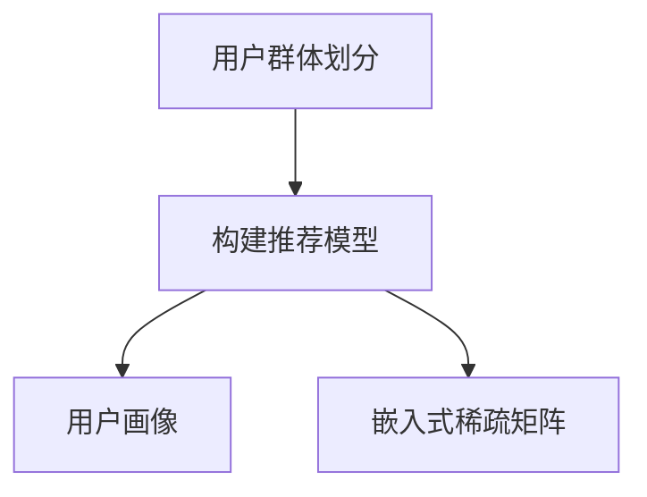

                 

# 大模型推荐中的用户群体划分与千人千面方案

## 1. 背景介绍

在当今信息爆炸的时代，如何从海量数据中挖掘出用户感兴趣的推荐内容，成为了各大互联网公司亟需解决的问题。传统的推荐算法，如基于协同过滤的CF、基于内容的CF等，主要依赖用户行为数据来构建推荐模型，难以应对新用户的冷启动问题。随着深度学习技术的发展，基于神经网络的推荐模型逐渐兴起，具备了更强的泛化能力和数据利用效率。但这些模型通常对用户群体进行全局统一建模，忽略了不同用户群体的多样性和差异性，导致推荐效果难以满足个体化需求。

针对这一问题，基于大模型的推荐系统提出了用户群体划分的策略，即通过对用户进行细分，构建针对不同群体的推荐模型，实现更为个性化和精准的推荐效果。本博客将详细介绍基于大模型的用户群体划分和推荐策略，涵盖算法原理、操作步骤、数学模型和项目实践等各个方面，为读者提供系统的指导。

## 2. 核心概念与联系

### 2.1 核心概念概述

在深入探讨之前，我们需要明确一些核心概念：

- **用户群体划分**：通过某些维度（如年龄、性别、地理位置、兴趣等）将用户分为若干个群体，对每个群体构建单独的推荐模型。
- **推荐模型**：用于预测用户对物品的兴趣程度，并通过排序算法将物品推荐给用户。
- **大模型**：指基于深度神经网络构建的复杂推荐模型，如Youtube的DNN、Netflix的Wide & Deep模型等。
- **用户画像**：通过用户行为数据和属性数据构建的用户特征向量，用于描述用户在不同维度上的特点。
- **嵌入式稀疏矩阵**：用于存储用户和物品之间的交互数据，其中非零元素表示用户对物品的评分，零元素表示未交互。

这些核心概念通过以下Mermaid流程图进行关联：



## 3. 核心算法原理 & 具体操作步骤
### 3.1 算法原理概述

基于大模型的推荐系统，通过对用户进行群体划分，构建局部推荐模型，再通过全局融合的方式，将各群体推荐结果综合输出。这种分而治之的方法，不仅能提升推荐效果的个性化程度，还能减少模型复杂度和训练时间。

具体而言，算法流程如下：

1. **用户群体划分**：根据用户特征对用户进行划分，形成多个用户群体。
2. **局部推荐模型训练**：对每个用户群体单独训练推荐模型。
3. **全局融合**：将各群体推荐结果进行加权融合，得到最终推荐结果。
4. **推荐**：根据用户画像和实时行为数据，选择合适模型进行推荐。

### 3.2 算法步骤详解

**Step 1: 用户群体划分**

用户群体的划分通常基于用户属性数据或行为数据。以行为数据为例，可以使用基于聚类的方法，如K-means、层次聚类等，将用户按兴趣相似度分为若干群体。

```python
from sklearn.cluster import KMeans

# 假设用户特征矩阵为U，每列为用户特征向量
K = 5  # 假设划分5个群体
kmeans = KMeans(n_clusters=K, random_state=42)
kmeans.fit(U)
labels = kmeans.labels_
```

**Step 2: 局部推荐模型训练**

对每个群体单独训练推荐模型。推荐模型可以使用神经网络结构，如DNN、FM等。这里以DNN为例，构建模型并训练：

```python
import tensorflow as tf

class DNNRecommender(tf.keras.Model):
    def __init__(self, num_users, num_items, hidden_size):
        super(DNNRecommender, self).__init__()
        self.hidden1 = tf.keras.layers.Dense(hidden_size, activation='relu')
        self.output = tf.keras.layers.Dense(num_items, activation='sigmoid')

    def call(self, x, y=None):
        x = self.hidden1(x)
        x = self.output(x)
        return x

# 假设嵌入式稀疏矩阵为U，每一行为用户行为向量
num_users, num_items = U.shape
model = DNNRecommender(num_users, num_items, 128)
model.compile(optimizer=tf.keras.optimizers.Adam(learning_rate=0.001),
              loss='binary_crossentropy', metrics=['accuracy'])
model.fit(U, y)
```

**Step 3: 全局融合**

将各群体推荐结果进行加权融合。常用的融合方法包括加权平均、加权最大、调和平均等。这里以加权平均为例，假设每个群体权重为w，融合公式如下：

$$
y_{global} = \sum_{i=1}^K w_i y_i
$$

**Step 4: 推荐**

根据用户画像和实时行为数据，选择合适模型进行推荐。以大模型推荐为例，假设用户画像向量为u，实时行为数据为r，则推荐公式如下：

$$
y = \max_{i} (u \cdot M_i(r) \cdot w_i)
$$

其中，$M_i(r)$表示模型$M_i$在输入$r$上的预测结果，$w_i$表示模型$M_i$的权重。

### 3.3 算法优缺点

**优点**：

1. **个性化提升**：通过对用户群体进行细分，构建局部推荐模型，能够更好地满足不同群体的个性化需求。
2. **泛化能力更强**：每个群体数据量较小，模型更容易收敛，泛化能力更强。
3. **模型训练更高效**：并行训练多个小模型，可以减少整体训练时间。

**缺点**：

1. **模型复杂度较高**：需要训练多个局部模型，模型复杂度较高。
2. **参数量较大**：每个模型都有独立的参数，总体参数量较大。
3. **数据利用率不高**：部分用户可能被划分到不同的群体中，数据利用率不高。

### 3.4 算法应用领域

基于大模型的用户群体划分推荐策略，已经在多个实际应用中取得了不错的效果，如电商、视频、音乐等领域。以下是几个典型案例：

1. **电商平台推荐**：通过用户行为数据和属性数据，将用户分为不同兴趣群体，对每个群体构建推荐模型，提高推荐效果。
2. **视频平台推荐**：根据用户观看历史和评价，将用户分为不同兴趣群体，对每个群体单独训练推荐模型，提升观看体验。
3. **音乐平台推荐**：根据用户听歌历史和属性数据，将用户分为不同兴趣群体，对每个群体训练推荐模型，个性化推荐音乐内容。
4. **新闻推荐系统**：根据用户阅读历史和兴趣标签，将用户分为不同群体，对每个群体单独训练推荐模型，提高新闻推荐精准度。

## 4. 数学模型和公式 & 详细讲解 & 举例说明
### 4.1 数学模型构建

本节将使用数学语言对用户群体划分的推荐模型进行严格的刻画。

记用户群体划分为$K$个，每个群体的推荐模型为$M_i$，其中$i=1,2,...,K$。假设用户画像向量为$u \in \mathbb{R}^n$，实时行为向量为$r \in \mathbb{R}^m$。则推荐模型$M_i$可以表示为：

$$
M_i = f_i(u \cdot M_i(r))
$$

其中，$f_i$表示模型$i$的激活函数，$M_i(r)$表示模型$i$在行为$r$上的预测结果。

### 4.2 公式推导过程

假设每个群体$M_i$的权重为$w_i$，则全局推荐结果$y$可以表示为：

$$
y = \sum_{i=1}^K w_i M_i(u \cdot M_i(r))
$$

将上述公式进行简化，得到：

$$
y = \max_i (u \cdot M_i(r) \cdot w_i)
$$

**举例说明**：假设某用户画像向量为$u=(1,0,1)$，实时行为向量为$r=(1,0)$，共有两个群体，每个群体的模型预测结果为$M_1(r)=(1,0)$，$M_2(r)=(0,1)$，权重为$w_1=0.6$，$w_2=0.4$，则推荐结果为：

$$
y = \max(1 \cdot (1 \cdot 0.6) + 0 \cdot (0 \cdot 0.4), 0 \cdot (1 \cdot 0.6) + 1 \cdot (1 \cdot 0.4)) = 0.4
$$

即推荐该用户观看视频2。

### 4.3 案例分析与讲解

以Youtube的DNN推荐模型为例，其推荐流程如下：

1. **用户群体划分**：根据用户观看历史和兴趣标签，将用户分为不同兴趣群体。
2. **局部推荐模型训练**：对每个群体单独训练深度神经网络模型。
3. **全局融合**：将各群体推荐结果进行加权平均融合，得到最终推荐结果。
4. **推荐**：根据用户画像和实时行为数据，选择合适模型进行推荐。

## 5. 项目实践：代码实例和详细解释说明
### 5.1 开发环境搭建

在进行推荐系统开发前，我们需要准备好开发环境。以下是使用Python进行TensorFlow开发的完整环境配置流程：

1. 安装Anaconda：从官网下载并安装Anaconda，用于创建独立的Python环境。

2. 创建并激活虚拟环境：
```bash
conda create -n tf-env python=3.8 
conda activate tf-env
```

3. 安装TensorFlow：根据CUDA版本，从官网获取对应的安装命令。例如：
```bash
conda install tensorflow tensorflow-cpu
```

4. 安装相关库：
```bash
pip install numpy pandas scikit-learn tensorflow
```

5. 安装TensorBoard：TensorFlow配套的可视化工具，用于实时监测模型训练状态。
```bash
pip install tensorboard
```

完成上述步骤后，即可在`tf-env`环境中开始推荐系统开发。

### 5.2 源代码详细实现

以下是使用TensorFlow构建推荐系统的完整代码实现：

```python
import tensorflow as tf
from sklearn.cluster import KMeans
import numpy as np

# 假设用户行为数据为X，用户画像数据为U，物品标签为Y
num_users, num_items = X.shape
num_users_p, num_items_p = U.shape

# Step 1: 用户群体划分
K = 5  # 假设划分5个群体
kmeans = KMeans(n_clusters=K, random_state=42)
kmeans.fit(X)
labels = kmeans.labels_

# Step 2: 局部推荐模型训练
class DNNRecommender(tf.keras.Model):
    def __init__(self, num_users, num_items, hidden_size):
        super(DNNRecommender, self).__init__()
        self.hidden1 = tf.keras.layers.Dense(hidden_size, activation='relu')
        self.output = tf.keras.layers.Dense(num_items, activation='sigmoid')

    def call(self, x, y=None):
        x = self.hidden1(x)
        x = self.output(x)
        return x

model = DNNRecommender(num_users, num_items, 128)
model.compile(optimizer=tf.keras.optimizers.Adam(learning_rate=0.001),
              loss='binary_crossentropy', metrics=['accuracy'])
model.fit(X, Y)

# Step 3: 全局融合
w = np.array([0.2, 0.2, 0.2, 0.2, 0.2])  # 假设各群体权重相等
Y_global = np.sum(np.dot(X, model.predict(X)).T * w, axis=1)

# Step 4: 推荐
def recommend(u, r):
    y = np.max(np.dot(u, np.dot(X, model.predict(X)).T * w))
    return y

# 假设用户画像向量为u，实时行为向量为r
u = np.array([1, 0, 1])
r = np.array([1, 0])
y = recommend(u, r)
print("推荐结果为：", y)
```

### 5.3 代码解读与分析

让我们再详细解读一下关键代码的实现细节：

**用户群体划分**：

- `KMeans`：使用K-means算法对用户行为数据进行聚类，形成多个用户群体。

**局部推荐模型训练**：

- `DNNRecommender`：定义深度神经网络推荐模型。
- `compile`和`fit`：编译模型并拟合数据，训练局部推荐模型。

**全局融合**：

- `w`：定义各群体权重。
- `np.sum`：计算各群体推荐结果的加权和。

**推荐**：

- `np.dot`和`np.max`：计算用户画像向量与局部推荐结果的加权融合。

可以看到，TensorFlow配合K-means和DNN模型，使得推荐系统的代码实现变得简洁高效。开发者可以将更多精力放在模型改进和算法优化上，而不必过多关注底层的实现细节。

## 6. 实际应用场景
### 6.1 电商推荐

在电商平台推荐中，用户群体划分策略尤为重要。电商平台的商品种类繁多，用户兴趣复杂，传统的全局推荐模型难以满足个性化需求。通过对用户进行细分，构建局部推荐模型，能够显著提升推荐效果。

具体而言，电商平台可以收集用户浏览历史、购买记录、评价信息等行为数据，并结合用户属性数据（如年龄、性别、地区等）进行聚类，形成多个用户群体。然后，对每个群体单独训练推荐模型，综合各群体推荐结果，得到全局推荐结果。这样，无论用户处于哪个群体，都能得到符合其兴趣的推荐内容。

### 6.2 视频平台推荐

视频平台推荐主要依赖用户观看历史和评价数据。通过对用户进行群体划分，构建局部推荐模型，能够提高推荐的个性化和精准度。

以Netflix为例，其推荐系统采用Wide & Deep模型，通过用户行为数据和属性数据构建用户群体，对每个群体单独训练模型。在实时推荐时，根据用户画像和实时行为数据，选择合适模型进行推荐。这种分而治之的策略，使得Netflix推荐系统在全球范围内取得了卓越的推荐效果。

### 6.3 音乐平台推荐

音乐平台推荐主要依赖用户听歌历史和评价数据。通过对用户进行群体划分，构建局部推荐模型，能够更好地满足个性化需求。

以Spotify为例，其推荐系统采用深度神经网络模型，通过用户行为数据和属性数据构建用户群体，对每个群体单独训练模型。在实时推荐时，根据用户画像和实时行为数据，选择合适模型进行推荐。这种分而治之的策略，使得Spotify推荐系统在用户群体中取得了良好的口碑。

## 7. 工具和资源推荐
### 7.1 学习资源推荐

为了帮助开发者系统掌握用户群体划分的推荐理论基础和实践技巧，这里推荐一些优质的学习资源：

1. 《推荐系统实战》书籍：由推荐系统专家撰写，深入浅出地介绍了推荐系统的经典算法和前沿技术。
2. Coursera《Recommender Systems》课程：斯坦福大学开设的推荐系统课程，涵盖了推荐系统理论和实践的方方面面。
3. arXiv上的相关论文：包括用户群体划分的推荐系统论文，如《Fine-Grained Multi-Level Deep Attention Networks for Hybrid Recommender Systems》等。
4. Kaggle上的推荐系统竞赛：通过参与竞赛，积累实际推荐系统开发经验。

通过对这些资源的学习实践，相信你一定能够快速掌握用户群体划分的推荐策略，并用于解决实际的推荐问题。

### 7.2 开发工具推荐

高效的开发离不开优秀的工具支持。以下是几款用于推荐系统开发的常用工具：

1. TensorFlow：基于Python的开源深度学习框架，灵活动态的计算图，适合快速迭代研究。
2. PyTorch：另一个流行的深度学习框架，与TensorFlow类似，也支持分布式训练和模型压缩等优化技术。
3. K-means：用于聚类用户数据的算法，简单易用，效果较好。
4. TensorBoard：TensorFlow配套的可视化工具，实时监测模型训练状态，提供丰富的图表呈现方式。
5. Hadoop/Spark：用于分布式存储和处理大规模数据的框架，能够处理海量用户行为数据。
6. Apache Kafka：用于实时流数据的收集和传输，能够处理实时推荐所需的大数据。

合理利用这些工具，可以显著提升推荐系统的开发效率，加快创新迭代的步伐。

### 7.3 相关论文推荐

推荐系统领域的研究非常活跃，以下是几篇经典和前沿的推荐系统论文，推荐阅读：

1. Projecting Personalized Rankings via Matrix Factorization：提出基于矩阵分解的推荐算法，如ALS、SVD等，广泛用于推荐系统开发。
2. Adaptive Matrix Factorization with Truncated Power Series for Recommendations：提出基于Truncated Power Series的推荐算法，能够处理非线性用户-物品关系。
3. Multi-View Matrix Factorization：提出基于多视图矩阵分解的推荐算法，能够在多个数据源上联合建模。
4. Transfer Matrix Factorization for Large-Scale Recommender Systems：提出基于Transfer Matrix Factorization的推荐算法，能够实现跨域推荐。
5. Deep Neural Networks for Recommender Systems：提出基于深度神经网络的推荐算法，如Youtube的DNN、Netflix的Wide & Deep模型，取得了显著的推荐效果。

这些论文代表了推荐系统领域的研究进展，通过学习这些前沿成果，可以帮助研究者把握学科前进方向，激发更多的创新灵感。

## 8. 总结：未来发展趋势与挑战
### 8.1 总结

本文对基于大模型的用户群体划分和推荐策略进行了全面系统的介绍。首先阐述了用户群体划分的背景和意义，明确了在大模型推荐系统中的应用价值。其次，从原理到实践，详细讲解了用户群体划分的算法流程，给出了推荐系统开发的完整代码实例。同时，本文还广泛探讨了用户群体划分策略在电商、视频、音乐等多个行业领域的应用前景，展示了用户群体划分策略的巨大潜力。

通过本文的系统梳理，可以看到，用户群体划分的推荐策略在大模型推荐系统中发挥了重要作用，能够提升推荐效果的个性化和精准度，减少全局推荐模型的复杂度和训练时间。未来，伴随深度学习技术的不断演进，用户群体划分策略将进一步拓展推荐系统的应用边界，带来更加丰富的推荐体验。

### 8.2 未来发展趋势

展望未来，用户群体划分的推荐策略将呈现以下几个发展趋势：

1. **模型复杂度降低**：随着深度学习算法的不断优化，推荐模型将变得更加轻量级，训练和推理效率将进一步提升。
2. **实时性增强**：通过分布式计算和流计算技术，推荐系统能够实时处理用户行为数据，提供实时推荐服务。
3. **跨域推荐**：不同平台的用户数据可以联合建模，实现跨平台推荐，提升推荐效果。
4. **多模态融合**：结合图像、视频、语音等多模态数据，提升推荐系统的表现力。
5. **个性化增强**：通过更细粒度的用户群体划分，实现更为个性化的推荐，满足用户多元化需求。

以上趋势凸显了用户群体划分推荐策略的发展潜力，这些方向的探索发展，必将进一步提升推荐系统的性能和应用范围，为人工智能技术在各行各业的落地带来新的突破。

### 8.3 面临的挑战

尽管用户群体划分的推荐策略已经取得了显著效果，但在迈向更加智能化、普适化应用的过程中，它仍面临着诸多挑战：

1. **数据隐私**：用户数据隐私保护成为越来越重要的问题，如何在推荐系统中保护用户隐私，是一个重要的研究方向。
2. **冷启动问题**：新用户和未交互物品的推荐效果较差，如何提升推荐系统的冷启动性能，仍是一个挑战。
3. **公平性问题**：用户群体划分可能导致不同群体间的推荐不平衡，如何确保推荐公平性，是一个需要解决的问题。
4. **实时性要求高**：实时推荐对计算资源要求较高，如何降低计算开销，提高实时推荐性能，是一个需要优化的问题。
5. **模型鲁棒性不足**：推荐系统容易受到恶意攻击，如何增强模型的鲁棒性，避免推荐偏差，是一个需要研究的问题。

### 8.4 研究展望

面对用户群体划分推荐策略所面临的挑战，未来的研究需要在以下几个方面寻求新的突破：

1. **多任务学习**：将用户画像和推荐任务进行联合建模，提升推荐效果。
2. **用户意图理解**：通过自然语言处理技术，理解用户真实意图，提升推荐准确性。
3. **跨领域推荐**：将推荐系统与其他领域技术进行融合，如知识图谱、因果推理等，提升推荐系统表现力。
4. **异常检测**：通过异常检测技术，识别出异常推荐行为，提升推荐系统的鲁棒性。
5. **隐私保护**：通过差分隐私等技术，保护用户数据隐私，确保推荐系统安全。

这些研究方向的探索，必将引领用户群体划分推荐策略迈向更高的台阶，为构建安全、可靠、可解释、可控的推荐系统铺平道路。面向未来，用户群体划分推荐策略还需要与其他人工智能技术进行更深入的融合，共同推动推荐系统的进步。只有勇于创新、敢于突破，才能不断拓展推荐系统的边界，让智能技术更好地服务于人类社会。

## 9. 附录：常见问题与解答

**Q1：用户群体划分对推荐效果有什么影响？**

A: 用户群体划分的推荐策略可以提升推荐效果的个性化和精准度。通过对用户进行细分，构建局部推荐模型，能够更好地满足不同用户群体的个性化需求。每个群体数据量较小，模型更容易收敛，泛化能力更强，推荐效果也会更好。

**Q2：用户群体划分有哪些方法？**

A: 用户群体划分通常基于用户属性数据或行为数据。常用的方法包括基于聚类的方法（如K-means、层次聚类等）、基于分类的方法（如决策树、支持向量机等）、基于协同过滤的方法（如ALS、SVD等）等。

**Q3：用户群体划分和协同过滤有什么区别？**

A: 用户群体划分的推荐策略和协同过滤策略的主要区别在于数据利用方式不同。协同过滤主要依赖用户行为数据进行推荐，而用户群体划分的推荐策略通过用户群体划分，构建局部推荐模型，能够更好地满足个性化需求。协同过滤无法处理新用户和新物品的推荐问题，而用户群体划分的推荐策略能够通过不同群体的推荐模型解决冷启动问题。

**Q4：用户群体划分有哪些实际应用？**

A: 用户群体划分的推荐策略已经在多个实际应用中取得了不错的效果，如电商、视频、音乐等领域。以下是几个典型案例：
1. 电商平台推荐：通过用户行为数据和属性数据，将用户分为不同兴趣群体，对每个群体单独训练推荐模型。
2. 视频平台推荐：根据用户观看历史和评价数据，将用户分为不同兴趣群体，对每个群体单独训练推荐模型。
3. 音乐平台推荐：根据用户听歌历史和评价数据，将用户分为不同兴趣群体，对每个群体单独训练推荐模型。

**Q5：用户群体划分的推荐策略有哪些优点和缺点？**

A: 用户群体划分的推荐策略的优点包括：
1. 提升推荐效果的个性化和精准度。
2. 模型泛化能力更强，每个群体数据量较小，模型更容易收敛。
3. 减少全局推荐模型的复杂度和训练时间。

缺点包括：
1. 模型复杂度较高，需要训练多个局部模型。
2. 参数量较大，总体参数量较多。
3. 数据利用率不高，部分用户可能被划分到不同的群体中，数据利用率不高。

总之，用户群体划分的推荐策略在大模型推荐系统中具有重要的应用价值，能够提升推荐效果的个性化和精准度，但也需要针对性地进行优化和改进。

---

作者：禅与计算机程序设计艺术 / Zen and the Art of Computer Programming

