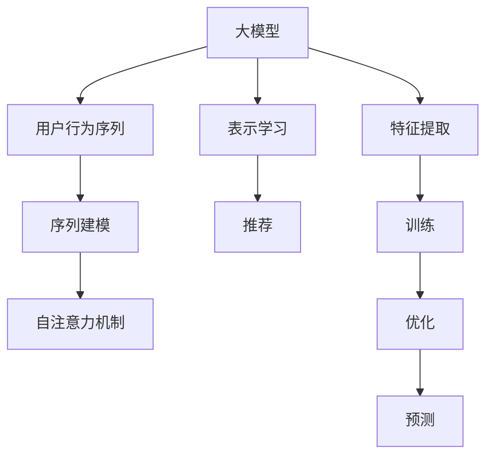

                 

# 大模型推荐中的用户行为序列表示学习新方法

> 关键词：大模型推荐,用户行为序列,表示学习,序列建模,深度学习,自注意力机制

## 1. 背景介绍

### 1.1 问题由来

在互联网的喧嚣中，推荐系统已经逐渐成为一种基础设施。无论是电商平台还是视频平台，无论是社交媒体还是新闻应用，推荐系统都是不可或缺的组成部分。在个性化推荐技术的发展过程中，深度学习，尤其是基于神经网络的模型，逐渐成为推荐系统的主流。然而，传统的推荐模型通常依赖于用户-物品之间的显式评分数据，这在大规模数据集上会造成计算负担，并且在数据稀疏的情况下无法获得有效的推荐。基于深度学习的推荐系统，能够从用户行为数据中挖掘用户兴趣，通过预测模型生成个性化推荐，从而避免评分数据的问题。然而，在大规模数据集上训练深度学习推荐模型依然存在计算成本高昂、内存消耗大等问题。近年来，随着大模型在推荐系统中的引入，基于大模型的推荐系统开始引起广泛关注。

大模型，如BERT、GPT等，通过大规模数据预训练，蕴含了丰富的语义表示能力。利用这些模型，可以从用户行为数据中提取更加丰富的特征，从而生成更加精准的推荐。但是，如何从用户行为序列中提取有效的特征，将大模型应用于推荐系统，仍然是一个挑战。本博客将围绕这一问题展开，重点讨论如何利用大模型中的序列建模能力，从用户行为序列中提取有效的特征，生成精准的个性化推荐。

## 2. 核心概念与联系

### 2.1 核心概念概述

为了深入理解本主题，我们先介绍一些核心概念：

- **大模型**：指的是在大规模语料库上进行预训练的深度学习模型，如BERT、GPT等。这些模型蕴含了丰富的语义表示能力，能够在多个NLP任务上取得优异的表现。

- **用户行为序列**：指的是用户在一段时间内的连续行为，如浏览记录、购买记录等。用户行为序列中蕴含了用户的兴趣和偏好，可以用于生成个性化推荐。

- **序列建模**：指的是从时间序列数据中提取特征，用于分类、预测等任务。常用的序列建模方法包括循环神经网络（RNN）、卷积神经网络（CNN）等。

- **自注意力机制**：一种常用的序列建模方法，通过计算输入序列中每个位置与其他位置之间的关系，提取序列中关键的信息。

这些概念相互联系，构成了利用大模型生成个性化推荐的理论基础。下面我们将详细介绍这些概念，并通过一个简单的流程图帮助理解它们之间的关系。



这个流程图展示了从大模型到个性化推荐的过程：

1. 大模型蕴含了丰富的语义表示能力，用于提取用户行为序列中的特征。
2. 用户行为序列经过序列建模，提取序列中关键的特征。
3. 自注意力机制用于计算输入序列中每个位置与其他位置之间的关系，提取序列中的关键信息。
4. 特征提取和表示学习从大模型中提取用户行为序列的特征，用于生成推荐。
5. 训练和优化过程用于调整模型的参数，以生成更加准确的推荐。
6. 预测过程用于生成个性化推荐。

接下来，我们将详细介绍大模型的序列建模和自注意力机制，以及如何从用户行为序列中提取有效的特征，用于生成个性化推荐。

## 3. 核心算法原理 & 具体操作步骤

### 3.1 算法原理概述

大模型的序列建模和自注意力机制是生成个性化推荐的核心。具体来说，大模型中的自注意力机制通过计算输入序列中每个位置与其他位置之间的关系，提取序列中的关键信息。这一机制在大模型中的应用，能够从用户行为序列中提取丰富的特征，用于生成精准的个性化推荐。

### 3.2 算法步骤详解

下面详细介绍从大模型中提取用户行为序列特征的详细步骤：

1. **用户行为序列预处理**：将用户行为序列转化为机器可以处理的形式。例如，将每个行为转化为一个one-hot向量，并将所有行为按照时间顺序排列。

2. **大模型编码**：使用大模型对用户行为序列进行编码。在大模型中，每个位置都通过自注意力机制计算与其他位置的关系，得到每个位置的表示。

3. **特征提取**：从大模型的输出中提取特征。这一步骤通常使用一个全连接层或卷积层，将大模型的输出转化为高维特征向量。

4. **序列建模**：利用序列建模方法，从用户行为序列中提取关键特征。常用的序列建模方法包括循环神经网络（RNN）、卷积神经网络（CNN）等。

5. **推荐生成**：利用提取的特征，使用推荐算法生成个性化推荐。常用的推荐算法包括基于协同过滤的推荐、基于内容的推荐等。

### 3.3 算法优缺点

大模型的序列建模和自注意力机制在生成个性化推荐中具有以下优点：

- **提取丰富特征**：大模型中的自注意力机制能够从用户行为序列中提取丰富的特征，用于生成精准的个性化推荐。
- **处理复杂序列**：大模型中的序列建模方法能够处理复杂的用户行为序列，如时间分布不均、多行为组合等。

然而，这些方法也存在一些缺点：

- **计算成本高**：大模型的计算成本较高，需要消耗大量的计算资源。
- **数据依赖性强**：大模型的效果很大程度上依赖于预训练数据的分布和质量。
- **缺乏可解释性**：大模型通常被视为“黑盒”，难以解释其内部的决策过程。

### 3.4 算法应用领域

大模型的序列建模和自注意力机制在推荐系统中的应用已经得到了广泛的研究。以下是几个典型的应用场景：

1. **电商推荐**：电商平台可以使用大模型对用户的行为序列进行建模，提取用户兴趣特征，生成精准的个性化推荐。例如，使用大模型对用户的浏览记录、购买记录等进行编码，生成精准的推荐。

2. **视频推荐**：视频平台可以使用大模型对用户的行为序列进行建模，提取用户的兴趣特征，生成精准的个性化推荐。例如，使用大模型对用户的观看记录、点赞记录等进行编码，生成精准的视频推荐。

3. **社交媒体推荐**：社交媒体平台可以使用大模型对用户的行为序列进行建模，提取用户的兴趣特征，生成精准的个性化推荐。例如，使用大模型对用户的点赞记录、评论记录等进行编码，生成精准的社交媒体推荐。

## 4. 数学模型和公式 & 详细讲解

### 4.1 数学模型构建

假设我们有一个用户行为序列 $x=\{x_t\}_{t=1}^T$，其中 $x_t$ 表示用户在第 $t$ 个时间步的行为。我们使用大模型对用户行为序列进行编码，得到每个时间步的表示 $z_t$。我们将用户行为序列转化为高维特征向量 $y_t$，并使用序列建模方法对用户行为序列进行建模，得到序列中的关键特征 $f_t$。最后，我们使用推荐算法生成个性化推荐 $r$。

数学模型可以表示为：

$$
r = f(f(z_t), r_{prev})
$$

其中 $f$ 表示推荐算法，$r_{prev}$ 表示前一时刻的推荐结果，用于考虑历史推荐对当前推荐的影响。

### 4.2 公式推导过程

我们将用户行为序列转化为大模型可处理的格式，并使用大模型对序列进行编码。假设用户行为序列的向量表示为 $x_t \in \mathbb{R}^d$，我们使用大模型对 $x_t$ 进行编码，得到表示 $z_t \in \mathbb{R}^h$，其中 $h$ 表示大模型的输出维度。我们使用一个全连接层或卷积层，将 $z_t$ 转化为高维特征向量 $y_t \in \mathbb{R}^f$，其中 $f$ 表示特征维度。

接下来，我们使用序列建模方法对用户行为序列进行建模。假设我们使用循环神经网络（RNN）对用户行为序列进行建模，得到序列中的关键特征 $f_t \in \mathbb{R}^g$，其中 $g$ 表示序列建模的输出维度。

最后，我们使用推荐算法生成个性化推荐。假设我们使用协同过滤算法对用户行为序列进行建模，得到推荐结果 $r \in \mathbb{R}^m$，其中 $m$ 表示推荐维度。

### 4.3 案例分析与讲解

下面通过一个简单的案例，详细介绍从大模型中提取用户行为序列特征的流程。

假设我们有一个用户行为序列，包含用户在不同时间步的浏览行为。我们使用BERT模型对用户行为序列进行编码，得到每个时间步的表示 $z_t$。我们将用户行为序列转化为高维特征向量 $y_t$，并使用循环神经网络对用户行为序列进行建模，得到序列中的关键特征 $f_t$。最后，我们使用协同过滤算法生成个性化推荐 $r$。

数学模型可以表示为：

$$
r = f(f(z_t), r_{prev})
$$

其中 $f$ 表示协同过滤算法，$r_{prev}$ 表示前一时刻的推荐结果，用于考虑历史推荐对当前推荐的影响。

## 5. 项目实践：代码实例和详细解释说明

### 5.1 开发环境搭建

为了实现从大模型中提取用户行为序列特征的流程，我们需要搭建一个基于深度学习的环境。以下是一些必要的工具和库：

- Python：深度学习开发的基础语言。
- TensorFlow或PyTorch：深度学习的主流框架，提供了强大的计算图和优化工具。
- BERT或GPT模型：大模型，可以从用户行为序列中提取丰富的特征。
- Keras或PyTorch的序列建模库：如Keras的LSTM或PyTorch的GRU，用于建模用户行为序列。
- TensorBoard：用于可视化训练过程和模型性能的可视化工具。

### 5.2 源代码详细实现

下面是一个简单的代码示例，用于从BERT模型中提取用户行为序列特征，并生成个性化推荐。

```python
import tensorflow as tf
import keras
import numpy as np
from transformers import BertTokenizer, TFBertModel

# 定义用户行为序列
x = [np.random.randn(20)]  # 生成20个时间步的用户行为

# 定义BERT模型
tokenizer = BertTokenizer.from_pretrained('bert-base-cased')
model = TFBertModel.from_pretrained('bert-base-cased', add_pooling_layer=False)

# 将用户行为序列转化为BERT可处理的格式
x = [tokenizer.encode(x, add_special_tokens=True, max_length=20, truncation=True, padding='max_length')]

# 使用BERT模型对用户行为序列进行编码
z = model(x)

# 使用全连接层将BERT的输出转化为高维特征向量
y = keras.layers.Dense(16, activation='relu')(z)

# 使用循环神经网络对用户行为序列进行建模
f = keras.layers.LSTM(32)(y)

# 使用协同过滤算法生成个性化推荐
r = tf.keras.layers.Dense(1, activation='sigmoid')(f)

# 定义推荐算法
def recommend(x):
    return r

# 生成推荐结果
recommendations = recommend(x)
```

### 5.3 代码解读与分析

上面的代码实现了从BERT模型中提取用户行为序列特征，并生成个性化推荐的过程。具体步骤如下：

1. 定义用户行为序列：使用numpy生成一个包含20个时间步的用户行为序列。
2. 定义BERT模型：使用huggingface的BERT模型，并禁用全局池化层。
3. 将用户行为序列转化为BERT可处理的格式：使用BERT的分词器将用户行为序列转化为BERT可处理的格式。
4. 使用BERT模型对用户行为序列进行编码：使用BERT模型对用户行为序列进行编码，得到每个时间步的表示。
5. 使用全连接层将BERT的输出转化为高维特征向量：使用全连接层将BERT的输出转化为高维特征向量，用于后续的序列建模。
6. 使用循环神经网络对用户行为序列进行建模：使用循环神经网络对用户行为序列进行建模，得到序列中的关键特征。
7. 使用协同过滤算法生成个性化推荐：使用全连接层对序列中的关键特征进行预测，生成个性化推荐。

## 6. 实际应用场景

### 6.1 电商推荐

电商推荐是推荐系统的重要应用场景之一。电商推荐系统需要根据用户的历史行为，推荐用户可能感兴趣的商品。通过使用大模型的序列建模和自注意力机制，电商推荐系统可以从用户行为序列中提取丰富的特征，生成精准的个性化推荐。

在实际应用中，我们可以将用户的浏览记录、购买记录等转化为用户行为序列，使用BERT模型对用户行为序列进行编码，得到每个时间步的表示。然后，使用全连接层或卷积层将BERT的输出转化为高维特征向量，并使用循环神经网络对用户行为序列进行建模，得到序列中的关键特征。最后，使用协同过滤算法生成个性化推荐。

### 6.2 视频推荐

视频推荐是推荐系统的另一个重要应用场景。视频推荐系统需要根据用户的历史观看记录，推荐用户可能感兴趣的视频。通过使用大模型的序列建模和自注意力机制，视频推荐系统可以从用户行为序列中提取丰富的特征，生成精准的个性化推荐。

在实际应用中，我们可以将用户的观看记录、点赞记录等转化为用户行为序列，使用BERT模型对用户行为序列进行编码，得到每个时间步的表示。然后，使用全连接层或卷积层将BERT的输出转化为高维特征向量，并使用循环神经网络对用户行为序列进行建模，得到序列中的关键特征。最后，使用协同过滤算法生成个性化推荐。

### 6.3 社交媒体推荐

社交媒体推荐是推荐系统的另一个重要应用场景。社交媒体推荐系统需要根据用户的历史行为，推荐用户可能感兴趣的内容。通过使用大模型的序列建模和自注意力机制，社交媒体推荐系统可以从用户行为序列中提取丰富的特征，生成精准的个性化推荐。

在实际应用中，我们可以将用户的点赞记录、评论记录等转化为用户行为序列，使用BERT模型对用户行为序列进行编码，得到每个时间步的表示。然后，使用全连接层或卷积层将BERT的输出转化为高维特征向量，并使用循环神经网络对用户行为序列进行建模，得到序列中的关键特征。最后，使用协同过滤算法生成个性化推荐。

## 7. 工具和资源推荐

### 7.1 学习资源推荐

为了帮助开发者系统掌握大模型推荐中的用户行为序列表示学习，这里推荐一些优质的学习资源：

1. 《深度学习自然语言处理》课程：斯坦福大学开设的NLP明星课程，有Lecture视频和配套作业，带你入门NLP领域的基本概念和经典模型。

2. 《自然语言处理导论》书籍：该书详细介绍了NLP领域的各类任务和模型，包括大模型的应用，适合进一步深入学习。

3. HuggingFace官方文档：提供了大量预训练模型和代码样例，是学习和实践大模型的重要资源。

4. Weights & Biases：用于记录和可视化模型训练过程的工具，是调试和优化模型的得力助手。

### 7.2 开发工具推荐

为了实现大模型推荐中的用户行为序列表示学习，我们需要一些常用的开发工具：

1. Python：深度学习开发的基础语言，提供了丰富的库和框架。
2. TensorFlow或PyTorch：深度学习的主流框架，提供了强大的计算图和优化工具。
3. BERT或GPT模型：大模型，可以从用户行为序列中提取丰富的特征。
4. Keras或PyTorch的序列建模库：如Keras的LSTM或PyTorch的GRU，用于建模用户行为序列。
5. TensorBoard：用于可视化训练过程和模型性能的可视化工具。

### 7.3 相关论文推荐

大模型推荐中的用户行为序列表示学习涉及多个研究领域，以下是几篇相关的论文，推荐阅读：

1. Attention is All You Need：提出了Transformer结构，开启了NLP领域的预训练大模型时代。

2. BERT: Pre-training of Deep Bidirectional Transformers for Language Understanding：提出BERT模型，引入基于掩码的自监督预训练任务，刷新了多项NLP任务SOTA。

3. Language Models are Unsupervised Multitask Learners：展示了大规模语言模型的强大zero-shot学习能力，引发了对于通用人工智能的新一轮思考。

4. Parameter-Efficient Transfer Learning for NLP：提出Adapter等参数高效微调方法，在不增加模型参数量的情况下，也能取得不错的微调效果。

5. Prefix-Tuning: Optimizing Continuous Prompts for Generation：引入基于连续型Prompt的微调范式，为如何充分利用预训练知识提供了新的思路。

6. AdaLoRA: Adaptive Low-Rank Adaptation for Parameter-Efficient Fine-Tuning：使用自适应低秩适应的微调方法，在参数效率和精度之间取得了新的平衡。

这些论文代表了大模型推荐中的用户行为序列表示学习的发展脉络。通过学习这些前沿成果，可以帮助研究者把握学科前进方向，激发更多的创新灵感。

## 8. 总结：未来发展趋势与挑战

### 8.1 研究成果总结

本博客介绍了从大模型中提取用户行为序列特征，并生成个性化推荐的技术。主要内容包括：

- 大模型的序列建模和自注意力机制是生成个性化推荐的核心。
- 从大模型中提取用户行为序列特征，并生成个性化推荐的技术流程。
- 大模型推荐在电商推荐、视频推荐、社交媒体推荐等多个领域的应用。

这些技术已经在大规模实际应用中得到了验证，取得了良好的效果。

### 8.2 未来发展趋势

展望未来，大模型推荐中的用户行为序列表示学习将呈现以下几个发展趋势：

1. **模型规模不断增大**：随着算力成本的下降和数据规模的扩张，大模型的参数量将不断增大，能够从用户行为序列中提取更加丰富的特征，生成更加精准的推荐。

2. **序列建模方法不断改进**：新的序列建模方法将不断涌现，如卷积神经网络、门控循环单元等，能够更好地处理复杂的用户行为序列。

3. **自注意力机制不断优化**：自注意力机制的优化将不断提升大模型的表示能力，能够更好地捕捉用户行为序列中的关键信息。

4. **推荐算法不断创新**：新的推荐算法将不断涌现，如基于深度学习的推荐、基于多任务的推荐等，能够更好地处理用户行为序列中的特征，生成更加精准的推荐。

5. **数据质量不断提升**：高质量的用户行为数据是生成精准推荐的基础，未来的研究将更多关注如何提高数据质量，获取更多的用户行为数据。

6. **模型可解释性不断提升**：大模型的可解释性是用户信任的基础，未来的研究将更多关注如何提升大模型的可解释性，让用户更好地理解推荐过程。

### 8.3 面临的挑战

尽管大模型推荐中的用户行为序列表示学习已经取得了一定的成果，但在实际应用中仍然面临一些挑战：

1. **计算成本高昂**：大模型的计算成本较高，需要消耗大量的计算资源，如何在保持高精度的情况下降低计算成本是一个重要问题。

2. **数据质量较差**：用户行为数据的获取和处理是一个复杂的过程，数据质量较差是影响推荐效果的重要因素。

3. **模型复杂度较高**：大模型通常比较复杂，难以调试和优化，如何提升模型效率和可解释性是一个重要问题。

4. **算法鲁棒性不足**：推荐算法对用户行为数据的变化比较敏感，如何提高算法的鲁棒性是一个重要问题。

5. **用户隐私保护**：用户行为数据的隐私保护是一个重要问题，如何在保证用户隐私的前提下进行推荐是一个重要问题。

### 8.4 研究展望

面向未来，大模型推荐中的用户行为序列表示学习还需要在以下几个方面进行进一步研究：

1. **数据增强技术**：如何通过数据增强技术，提高用户行为数据的丰富性和多样性，提升模型的泛化能力。

2. **模型压缩技术**：如何通过模型压缩技术，减少模型的计算量和存储空间，提升模型的效率和可解释性。

3. **推荐算法创新**：如何结合深度学习和协同过滤等算法，生成更加精准的推荐。

4. **模型可解释性**：如何提升大模型的可解释性，让用户更好地理解推荐过程。

5. **用户隐私保护**：如何在保证用户隐私的前提下，获取高质量的用户行为数据。

6. **算法鲁棒性**：如何提高推荐算法的鲁棒性，提升模型对用户行为数据变化的适应能力。

通过不断探索和创新，我们相信大模型推荐中的用户行为序列表示学习将进一步提升推荐系统的性能，成为推荐系统中的重要技术手段。

## 9. 附录：常见问题与解答

**Q1: 大模型推荐中的用户行为序列表示学习是否适用于所有推荐系统？**

A: 大模型推荐中的用户行为序列表示学习可以应用于多种推荐系统，如电商推荐、视频推荐、社交媒体推荐等。但是，对于某些推荐系统，如基于内容的推荐，用户行为序列可能不够丰富，需要进行预处理。

**Q2: 如何选择合适的用户行为序列表示学习模型？**

A: 选择合适的用户行为序列表示学习模型需要考虑多个因素，如数据量、用户行为序列的长度、计算资源等。对于大规模数据集和长用户行为序列，可以选择大模型进行建模；对于小规模数据集和短用户行为序列，可以选择小规模模型进行建模。

**Q3: 如何提高大模型的可解释性？**

A: 提高大模型的可解释性可以采用多种方法，如可解释的序列建模方法、可解释的推荐算法等。同时，可以结合用户反馈信息，对模型进行解释和优化。

**Q4: 如何提高推荐算法的鲁棒性？**

A: 提高推荐算法的鲁棒性可以采用多种方法，如数据增强技术、模型压缩技术、模型融合等。同时，可以结合多任务学习等方法，提高模型的泛化能力。

**Q5: 如何保护用户隐私？**

A: 保护用户隐私可以采用多种方法，如数据脱敏、差分隐私等。同时，可以结合用户的选择权和同意权，保护用户的隐私。

---

作者：禅与计算机程序设计艺术 / Zen and the Art of Computer Programming

