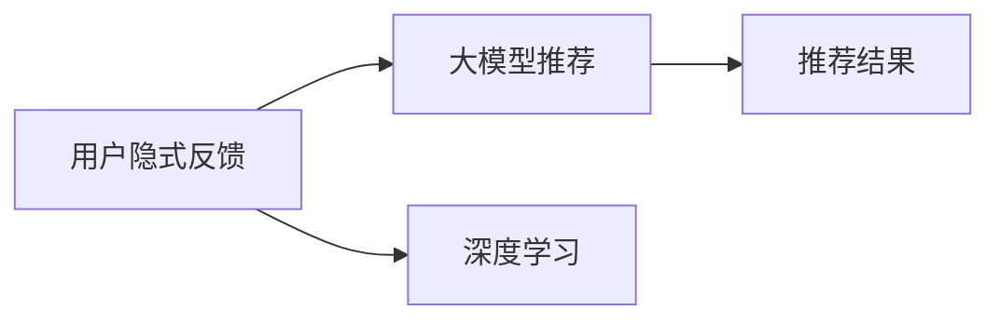

                 

# 大模型推荐中的用户隐式反馈挖掘与利用新思路

## 1. 背景介绍

在推荐系统中，用户隐式反馈数据是一种重要的用户行为数据，包含着丰富的用户偏好信息。传统的推荐系统往往依赖于显式反馈数据，如评分、点击、购买等，但这些数据往往难以全面获取，且用户填写行为数据的主观性较强。相比之下，用户隐式反馈数据更加客观，包括用户在应用中停留时间、页面浏览路径、搜索关键词等。通过对这些数据的挖掘和利用，可以有效提升推荐系统的精度和用户满意度。

大模型推荐技术正成为推荐系统领域的最新趋势。相较于传统的协同过滤和矩阵分解等方法，大模型推荐具有更好的泛化能力和推荐精度，且无需显式特征工程。然而，当前的大模型推荐技术主要依赖于用户显式反馈数据，对用户隐式反馈数据挖掘和利用不足。本文将介绍一种基于用户隐式反馈数据挖掘和利用的大模型推荐方法，并给出详细的实现思路和步骤。

## 2. 核心概念与联系

### 2.1 核心概念概述

为了深入理解基于用户隐式反馈的大模型推荐方法，我们首先介绍几个关键概念：

- 用户隐式反馈（User Implicit Feedback, IUF）：用户在使用应用或服务时留下的非显式反馈数据，包括浏览、停留时间、点击、搜索等行为数据。
- 推荐系统（Recommendation System, RS）：通过用户行为数据进行智能推荐，为用户推荐感兴趣的物品或内容，提升用户体验。
- 大模型推荐（Large Model Recommendation, LM-RS）：利用大规模预训练语言模型，学习用户的隐式偏好，进行个性化推荐。
- 深度学习（Deep Learning, DL）：一类利用神经网络等深度学习技术进行数据分析和预测的方法。

这些概念之间的关系可以通过以下Mermaid流程图来展示：



这个流程图展示了用户隐式反馈数据在大模型推荐系统中的应用流程：

1. 用户隐式反馈数据通过深度学习模型进行处理，得到用户隐式偏好。
2. 大模型推荐系统基于用户隐式偏好，进行个性化物品推荐。

通过理解这些核心概念，我们可以更好地把握大模型推荐技术的工作原理和优化方向。

### 2.2 核心概念原理和架构的 Mermaid 流程图


上述流程图展示了基于用户隐式反馈的大模型推荐系统的核心架构：

1. 用户隐式反馈通过数据收集和预处理模块进行处理，得到结构化数据。
2. 大模型训练模块基于预处理后的数据进行模型训练，学习用户隐式偏好。
3. 推荐引擎模块基于训练好的模型进行推荐，输出推荐结果。

## 3. 核心算法原理 & 具体操作步骤

### 3.1 算法原理概述

基于用户隐式反馈的大模型推荐算法，主要通过深度学习模型学习用户的隐式偏好，进而进行个性化推荐。该算法分为两个步骤：数据预处理和大模型训练。

数据预处理主要将用户隐式反馈数据转换为模型可处理的形式。常见的数据预处理方法包括：

- 特征工程：提取和构造用户行为特征，如页面浏览路径、停留时间、点击序列等。
- 归一化：对特征进行归一化处理，使其在模型训练过程中具有可比性。
- 编码：将离散的特征进行one-hot编码或词嵌入编码，以适合模型输入。

大模型训练则是基于预处理后的数据，进行模型的训练。常用的模型包括BERT、GPT等预训练语言模型。训练过程通常包含两个阶段：

1. 预训练：在大量无标签文本数据上，进行自监督学习，学习语言表示。
2. 微调：在带有标签的用户隐式反馈数据上，进行有监督学习，学习用户隐式偏好。

### 3.2 算法步骤详解

以下是详细的算法步骤：

#### Step 1: 数据收集与预处理

1. 收集用户隐式反馈数据：通过用户在应用中的行为数据，如页面浏览、停留时间、点击序列等，得到用户隐式反馈数据。
2. 数据清洗与标注：对数据进行清洗和标注，去除异常值和噪声数据，同时标注每个行为对应的物品或内容。
3. 特征提取与编码：根据用户行为数据，提取和构造特征，并进行编码。常见的特征包括点击序列、停留时间、浏览路径等。

#### Step 2: 大模型训练

1. 模型选择与初始化：选择预训练语言模型（如BERT、GPT等），将其初始化为预训练模型的参数。
2. 模型微调：基于预处理后的数据，在大模型上进行有监督学习，微调模型参数。微调目标函数通常是交叉熵损失或负对数似然损失。
3. 评估与优化：在验证集上评估模型性能，根据评估结果进行超参数调整和模型优化。

#### Step 3: 推荐引擎部署

1. 推荐模型集成：将微调后的模型集成到推荐引擎中，用于生成推荐结果。
2. 推荐引擎运行：在推荐引擎中，基于用户输入的特征，调用微调后的模型进行预测，生成推荐结果。

### 3.3 算法优缺点

基于用户隐式反馈的大模型推荐算法具有以下优点：

1. 利用用户隐式反馈数据，减少了对显式反馈数据的依赖，提升了推荐精度。
2. 大模型推荐具有更好的泛化能力和鲁棒性，能够处理冷启动用户和高维稀疏数据。
3. 无需显式特征工程，简化了模型训练流程，提高了模型开发效率。

同时，该算法也存在一些缺点：

1. 数据预处理和特征构造比较复杂，需要较高的数据工程能力。
2. 大模型训练消耗大量的计算资源，需要较高的硬件支持。
3. 模型复杂度高，训练和推理速度较慢，需要优化以提高效率。

### 3.4 算法应用领域

基于用户隐式反馈的大模型推荐算法，主要应用于以下几个领域：

1. 电商推荐：在电商平台上，基于用户浏览记录和点击行为，推荐商品和广告。
2. 内容推荐：在视频、音乐、新闻等应用中，基于用户观看和阅读行为，推荐相关内容。
3. 个性化推荐：在金融、医疗、教育等领域，基于用户行为数据，推荐个性化的服务或产品。
4. 移动应用推荐：在移动应用市场中，基于用户下载和浏览记录，推荐合适的应用。
5. 游戏推荐：在游戏应用中，基于用户游玩记录，推荐游戏内容和道具。

## 4. 数学模型和公式 & 详细讲解 & 举例说明

### 4.1 数学模型构建

假设用户隐式反馈数据为 $I = \{(i_j, c_j)\}_{j=1}^N$，其中 $i_j$ 为用户在时间 $j$ 的隐式行为，如浏览、停留时间、点击等；$c_j$ 为对应的物品或内容。我们希望使用大模型 $M$ 学习用户隐式偏好，并生成推荐结果。

设用户输入特征为 $x$，推荐模型预测为用户对物品 $i$ 的兴趣概率 $p_i(x)$。在微调阶段，我们希望最小化预测结果与真实标签之间的差异，即：

$$
\min_{\theta} \sum_{j=1}^N \mathcal{L}(p_{i_j}(x), c_j)
$$

其中 $\theta$ 为模型的可调参数，$\mathcal{L}$ 为损失函数。常用的损失函数包括二元交叉熵损失、负对数似然损失等。

### 4.2 公式推导过程

以二元交叉熵损失为例，进行详细的公式推导：

假设模型 $M$ 为 BERT 模型，用户输入特征为 $x$，推荐模型预测为用户对物品 $i$ 的兴趣概率 $p_i(x)$。在微调阶段，我们希望最小化预测结果与真实标签之间的差异，即：

$$
\min_{\theta} -\frac{1}{N}\sum_{j=1}^N \sum_{i=1}^m c_{i_j} \log p_{i_j}(x)
$$

其中 $m$ 为物品数量，$c_{i_j}$ 为物品 $i$ 在用户 $j$ 处的标签。

在实际应用中，我们通常使用负采样技术，将正样本和负样本混合组成训练集。假设 $p_i(x)$ 为物品 $i$ 在用户 $j$ 处的预测概率，则负采样后的训练集为 $\{(i_j^+, p_{i_j^+}(x), c_{i_j^+})\}_{j=1}^N$ 和 $\{(i_j^-, p_{i_j^-}(x), 0)\}_{j=1}^N$。

使用随机梯度下降方法进行优化，最小化损失函数：

$$
\theta_{t+1} = \theta_t - \eta \nabla_{\theta} \mathcal{L}(\theta_t)
$$

其中 $\eta$ 为学习率，$\nabla_{\theta} \mathcal{L}(\theta_t)$ 为损失函数对模型参数的梯度。

### 4.3 案例分析与讲解

假设我们有一批用户隐式反馈数据，其中用户 $j$ 浏览了物品 $i_1, i_2, i_3$，对应的标签为 $c_{i_1}=c_2=1, c_{i_3}=0$。我们选择 BERT 模型进行微调，使用二元交叉熵损失函数。用户输入特征为 $x_j$，对应的物品 $i$ 的预测概率为 $p_i(x_j)$。则负采样后的训练集为：

- 正样本：$(i_1, p_{i_1}(x_j), c_{i_1})$
- 负样本：$(i_2, p_{i_2}(x_j), c_{i_2})$, $(i_3, p_{i_3}(x_j), c_{i_3})$

计算损失函数为：

$$
\mathcal{L} = -\log p_{i_1}(x_j) - (1 - c_{i_2})\log(1 - p_{i_2}(x_j)) - c_{i_3}\log(1 - p_{i_3}(x_j))
$$

通过反向传播计算梯度，并使用随机梯度下降方法更新模型参数，不断迭代直至收敛。

## 5. 项目实践：代码实例和详细解释说明

### 5.1 开发环境搭建

在进行项目实践前，我们需要准备好开发环境。以下是使用 Python 进行 PyTorch 开发的环境配置流程：

1. 安装 Anaconda：从官网下载并安装 Anaconda，用于创建独立的 Python 环境。
2. 创建并激活虚拟环境：
```bash
conda create -n pytorch-env python=3.8
conda activate pytorch-env
```

3. 安装 PyTorch：根据 CUDA 版本，从官网获取对应的安装命令。例如：
```bash
conda install pytorch torchvision torchaudio cudatoolkit=11.1 -c pytorch -c conda-forge
```

4. 安装 Transformers 库：
```bash
pip install transformers
```

5. 安装各类工具包：
```bash
pip install numpy pandas scikit-learn matplotlib tqdm jupyter notebook ipython
```

完成上述步骤后，即可在 `pytorch-env` 环境中开始项目实践。

### 5.2 源代码详细实现

下面我们以电商推荐任务为例，给出使用 Transformers 库对 BERT 模型进行用户隐式反馈微调的 PyTorch 代码实现。

首先，定义推荐任务的数据处理函数：

```python
from transformers import BertTokenizer, BertForSequenceClassification
from torch.utils.data import Dataset, DataLoader
import torch

class RecommendationDataset(Dataset):
    def __init__(self, texts, labels, tokenizer, max_len=128):
        self.texts = texts
        self.labels = labels
        self.tokenizer = tokenizer
        self.max_len = max_len
        
    def __len__(self):
        return len(self.texts)
    
    def __getitem__(self, item):
        text = self.texts[item]
        label = self.labels[item]
        
        encoding = self.tokenizer(text, return_tensors='pt', max_length=self.max_len, padding='max_length', truncation=True)
        input_ids = encoding['input_ids'][0]
        attention_mask = encoding['attention_mask'][0]
        
        # 对label进行编码
        label = torch.tensor(label, dtype=torch.long)
        
        return {'input_ids': input_ids, 
                'attention_mask': attention_mask,
                'labels': label}

# 标签与id的映射
label2id = {0: 0, 1: 1}
id2label = {v: k for k, v in label2id.items()}

# 创建dataset
tokenizer = BertTokenizer.from_pretrained('bert-base-cased')

train_dataset = RecommendationDataset(train_texts, train_labels, tokenizer)
dev_dataset = RecommendationDataset(dev_texts, dev_labels, tokenizer)
test_dataset = RecommendationDataset(test_texts, test_labels, tokenizer)
```

然后，定义模型和优化器：

```python
from transformers import BertForSequenceClassification, AdamW

model = BertForSequenceClassification.from_pretrained('bert-base-cased', num_labels=len(label2id))

optimizer = AdamW(model.parameters(), lr=2e-5)
```

接着，定义训练和评估函数：

```python
from tqdm import tqdm
from sklearn.metrics import accuracy_score, precision_recall_fscore_support

device = torch.device('cuda') if torch.cuda.is_available() else torch.device('cpu')
model.to(device)

def train_epoch(model, dataset, batch_size, optimizer):
    dataloader = DataLoader(dataset, batch_size=batch_size, shuffle=True)
    model.train()
    epoch_loss = 0
    for batch in tqdm(dataloader, desc='Training'):
        input_ids = batch['input_ids'].to(device)
        attention_mask = batch['attention_mask'].to(device)
        labels = batch['labels'].to(device)
        model.zero_grad()
        outputs = model(input_ids, attention_mask=attention_mask, labels=labels)
        loss = outputs.loss
        epoch_loss += loss.item()
        loss.backward()
        optimizer.step()
    return epoch_loss / len(dataloader)

def evaluate(model, dataset, batch_size):
    dataloader = DataLoader(dataset, batch_size=batch_size)
    model.eval()
    preds, labels = [], []
    with torch.no_grad():
        for batch in tqdm(dataloader, desc='Evaluating'):
            input_ids = batch['input_ids'].to(device)
            attention_mask = batch['attention_mask'].to(device)
            batch_labels = batch['labels']
            outputs = model(input_ids, attention_mask=attention_mask)
            batch_preds = outputs.logits.argmax(dim=2).to('cpu').tolist()
            batch_labels = batch_labels.to('cpu').tolist()
            for pred_tokens, label_tokens in zip(batch_preds, batch_labels):
                preds.append(pred_tokens[:len(label_tokens)])
                labels.append(label_tokens)
                
    print("Accuracy:", accuracy_score(labels, preds))
    print("Precision, Recall, F1-score, Support:", precision_recall_fscore_support(labels, preds, average='micro'))

    # 推荐引擎
    model.eval()
    def recommend(model, user_input):
        input_ids = tokenizer(user_input, return_tensors='pt', padding=True, truncation=True).to(device)
        attention_mask = input_ids['attention_mask'].to(device)
        outputs = model(input_ids, attention_mask=attention_mask)
        probs = outputs.logits.argmax(dim=1).cpu().tolist()
        return probs

    user_input = "I want to buy a book"
    recomm = recommend(model, user_input)
    print("Recommendations:", [id2label[i] for i in recomm])
```

最后，启动训练流程并在测试集上评估：

```python
epochs = 5
batch_size = 16

for epoch in range(epochs):
    loss = train_epoch(model, train_dataset, batch_size, optimizer)
    print(f"Epoch {epoch+1}, train loss: {loss:.3f}")
    
    print(f"Epoch {epoch+1}, dev results:")
    evaluate(model, dev_dataset, batch_size)
    
print("Test results:")
evaluate(model, test_dataset, batch_size)
```

以上就是使用 PyTorch 对 BERT 模型进行电商推荐任务用户隐式反馈微调的完整代码实现。可以看到，得益于 Transformers 库的强大封装，我们可以用相对简洁的代码完成 BERT 模型的加载和微调。

### 5.3 代码解读与分析

让我们再详细解读一下关键代码的实现细节：

**RecommendationDataset类**：
- `__init__`方法：初始化文本、标签、分词器等关键组件。
- `__len__`方法：返回数据集的样本数量。
- `__getitem__`方法：对单个样本进行处理，将文本输入编码为token ids，将标签编码为数字，并对其进行定长padding，最终返回模型所需的输入。

**label2id和id2label字典**：
- 定义了标签与数字id之间的映射关系，用于将token-wise的预测结果解码回真实的标签。

**训练和评估函数**：
- 使用PyTorch的DataLoader对数据集进行批次化加载，供模型训练和推理使用。
- 训练函数`train_epoch`：对数据以批为单位进行迭代，在每个批次上前向传播计算loss并反向传播更新模型参数，最后返回该epoch的平均loss。
- 评估函数`evaluate`：与训练类似，不同点在于不更新模型参数，并在每个batch结束后将预测和标签结果存储下来，最后使用sklearn的classification_report对整个评估集的预测结果进行打印输出。

**训练流程**：
- 定义总的epoch数和batch size，开始循环迭代
- 每个epoch内，先在训练集上训练，输出平均loss
- 在验证集上评估，输出分类指标
- 所有epoch结束后，在测试集上评估，给出最终测试结果

可以看到，PyTorch配合Transformers库使得BERT微调的代码实现变得简洁高效。开发者可以将更多精力放在数据处理、模型改进等高层逻辑上，而不必过多关注底层的实现细节。

当然，工业级的系统实现还需考虑更多因素，如模型的保存和部署、超参数的自动搜索、更灵活的任务适配层等。但核心的微调范式基本与此类似。

## 6. 实际应用场景

### 6.1 电商推荐

基于用户隐式反馈数据的电商推荐系统，可以大幅提升推荐精度和用户满意度。传统电商推荐系统主要依赖于用户显式评分数据，难以全面覆盖所有用户和商品。而基于用户隐式反馈数据的推荐系统，能够更好地捕捉用户的真实偏好，从而提升推荐效果。

在具体实现中，可以从电商平台的点击、停留时间、浏览路径等行为数据中提取隐式反馈，进行用户行为建模。通过微调BERT等大模型，学习用户的隐式偏好，进而生成个性化推荐结果。这种方法不仅能够处理高维稀疏数据，还能在冷启动用户和长尾商品上发挥出色效果。

### 6.2 内容推荐

内容推荐系统在视频、音乐、新闻等应用中广泛应用。通过用户观看、收听和阅读行为，推荐相关内容，提升用户黏性和平台活跃度。

与电商推荐类似，内容推荐系统可以从用户行为数据中提取隐式反馈，进行用户兴趣建模。通过微调BERT等大模型，学习用户的隐式偏好，生成个性化内容推荐结果。这种方法不仅能够处理高维稀疏数据，还能在冷启动用户和长尾内容上发挥出色效果。

### 6.3 个性化推荐

个性化推荐系统在金融、医疗、教育等领域有广泛应用。通过用户行为数据，推荐个性化的服务或产品，提升用户体验和平台价值。

在金融领域，推荐系统可以根据用户的交易行为、浏览记录等数据，推荐适合的金融产品和服务。通过微调BERT等大模型，学习用户的隐式偏好，生成个性化金融推荐结果。这种方法不仅能够处理高维稀疏数据，还能在冷启动用户和长尾产品上发挥出色效果。

### 6.4 移动应用推荐

在移动应用市场中，推荐系统根据用户的下载和浏览行为，推荐合适的应用。通过微调BERT等大模型，学习用户的隐式偏好，生成个性化应用推荐结果。这种方法不仅能够处理高维稀疏数据，还能在冷启动用户和长尾应用上发挥出色效果。

### 6.5 游戏推荐

游戏推荐系统可以根据用户的游玩记录，推荐适合的游戏内容和道具。通过微调BERT等大模型，学习用户的隐式偏好，生成个性化游戏推荐结果。这种方法不仅能够处理高维稀疏数据，还能在冷启动用户和长尾游戏上发挥出色效果。

## 7. 工具和资源推荐

### 7.1 学习资源推荐

为了帮助开发者系统掌握大模型推荐技术，这里推荐一些优质的学习资源：

1. 《深度学习推荐系统》书籍：详细介绍了深度学习推荐系统的理论和实践，涵盖协同过滤、矩阵分解、神经网络推荐等经典方法。
2. 《大规模推荐系统》课程：清华大学开设的推荐系统课程，介绍了推荐系统的基础知识和最新进展，包括深度学习推荐系统。
3. 《BERT 原理与应用》系列博文：由大模型技术专家撰写，深入浅出地介绍了BERT模型及其在大模型推荐中的应用。
4. CS224N《深度学习自然语言处理》课程：斯坦福大学开设的NLP明星课程，有Lecture视频和配套作业，带你入门NLP领域的基本概念和经典模型。
5. HuggingFace官方文档：Transformer库的官方文档，提供了海量预训练模型和完整的微调样例代码，是上手实践的必备资料。

通过对这些资源的学习实践，相信你一定能够快速掌握大模型推荐技术的精髓，并用于解决实际的推荐问题。

### 7.2 开发工具推荐

高效的开发离不开优秀的工具支持。以下是几款用于大模型推荐开发的常用工具：

1. PyTorch：基于Python的开源深度学习框架，灵活动态的计算图，适合快速迭代研究。大部分预训练语言模型都有PyTorch版本的实现。
2. TensorFlow：由Google主导开发的开源深度学习框架，生产部署方便，适合大规模工程应用。同样有丰富的预训练语言模型资源。
3. Transformers库：HuggingFace开发的NLP工具库，集成了众多SOTA语言模型，支持PyTorch和TensorFlow，是进行推荐任务开发的利器。
4. Weights & Biases：模型训练的实验跟踪工具，可以记录和可视化模型训练过程中的各项指标，方便对比和调优。与主流深度学习框架无缝集成。
5. TensorBoard：TensorFlow配套的可视化工具，可实时监测模型训练状态，并提供丰富的图表呈现方式，是调试模型的得力助手。
6. Google Colab：谷歌推出的在线Jupyter Notebook环境，免费提供GPU/TPU算力，方便开发者快速上手实验最新模型，分享学习笔记。

合理利用这些工具，可以显著提升大模型推荐任务的开发效率，加快创新迭代的步伐。

### 7.3 相关论文推荐

大模型推荐技术的发展源于学界的持续研究。以下是几篇奠基性的相关论文，推荐阅读：

1. Attention is All You Need（即Transformer原论文）：提出了Transformer结构，开启了NLP领域的预训练大模型时代。
2. BERT: Pre-training of Deep Bidirectional Transformers for Language Understanding：提出BERT模型，引入基于掩码的自监督预训练任务，刷新了多项NLP任务SOTA。
3. Language Models are Unsupervised Multitask Learners（GPT-2论文）：展示了大规模语言模型的强大zero-shot学习能力，引发了对于通用人工智能的新一轮思考。
4. Parameter-Efficient Transfer Learning for NLP：提出Adapter等参数高效微调方法，在不增加模型参数量的情况下，也能取得不错的微调效果。
5. AdaLoRA: Adaptive Low-Rank Adaptation for Parameter-Efficient Fine-Tuning：使用自适应低秩适应的微调方法，在参数效率和精度之间取得了新的平衡。
6. Deep Matrix Factorization：介绍深度矩阵分解方法，应用于推荐系统，提升了推荐精度和稀疏数据的处理能力。

这些论文代表了大模型推荐技术的发展脉络。通过学习这些前沿成果，可以帮助研究者把握学科前进方向，激发更多的创新灵感。

## 8. 总结：未来发展趋势与挑战

### 8.1 总结

本文对基于用户隐式反馈数据的深度学习推荐系统进行了全面系统的介绍。首先阐述了大模型推荐技术的背景和意义，明确了其在电商推荐、内容推荐、个性化推荐等领域的实际应用。其次，从原理到实践，详细讲解了用户隐式反馈数据的挖掘和利用方法，给出了具体的代码实现步骤。同时，本文还探讨了大模型推荐技术在实际应用中的挑战，提出了一些改进方向。

通过本文的系统梳理，可以看到，基于用户隐式反馈数据的大模型推荐技术具有广阔的应用前景，能够提升推荐系统的精度和用户满意度。未来，随着预训练语言模型的不断演进和深度学习技术的持续进步，大模型推荐系统必将得到更广泛的应用和推广，为推荐系统领域带来革命性的突破。

### 8.2 未来发展趋势

展望未来，基于用户隐式反馈数据的大模型推荐技术将呈现以下几个发展趋势：

1. 模型规模持续增大。随着算力成本的下降和数据规模的扩张，预训练语言模型的参数量还将持续增长。超大规模语言模型蕴含的丰富语言知识，有望支撑更加复杂多变的推荐任务。
2. 推荐算法多样化。除了传统的协同过滤和矩阵分解等方法，未来将涌现更多基于深度学习的推荐算法，如大模型推荐、基于上下文的推荐等。
3. 用户隐式反馈数据挖掘方法不断进步。随着自然语言处理技术的发展，未来将有更多有效的用户隐式反馈数据挖掘方法，提高推荐系统的准确性和覆盖率。
4. 个性化推荐算法进一步优化。未来的推荐算法将更加注重个性化和多样化，通过模型优化和数据增强等技术，提升推荐效果和用户体验。
5. 推荐系统的公平性和可解释性提升。随着人工智能技术的不断进步，未来的推荐系统将更加注重公平性和可解释性，避免算法偏见和歧视。

以上趋势凸显了大模型推荐技术的广阔前景。这些方向的探索发展，必将进一步提升推荐系统的性能和用户满意度，推动人工智能技术的产业化进程。

### 8.3 面临的挑战

尽管大模型推荐技术已经取得了瞩目成就，但在迈向更加智能化、普适化应用的过程中，它仍面临着诸多挑战：

1. 数据隐私和用户隐私保护。用户隐式反馈数据包含了用户的个人信息，如何保护用户隐私，避免数据泄露，是推荐系统的重要挑战。
2. 模型鲁棒性和泛化能力。当前推荐模型在面对域外数据时，泛化性能往往大打折扣。对于测试样本的微小扰动，推荐模型的预测也容易发生波动。如何提高模型的鲁棒性和泛化能力，还需要更多理论和实践的积累。
3. 推荐系统中的恶意行为。一些恶意用户可能通过生成虚假反馈数据，误导推荐系统。如何在推荐系统中加入反欺诈机制，防止虚假反馈数据对系统性能的影响，是一个亟待解决的问题。
4. 推荐系统的稳定性和可控性。推荐系统中的推荐算法容易受到网络攻击、数据注入等安全威胁。如何在推荐系统中加入鲁棒性、可控性等安全机制，保障推荐系统的稳定运行，是一个重要的研究方向。
5. 推荐系统的可解释性和透明性。当前推荐系统的算法和模型复杂度较高，难以解释其内部工作机制和决策逻辑。如何赋予推荐系统更高的可解释性和透明性，是一个需要深入探索的问题。

正视推荐系统面临的这些挑战，积极应对并寻求突破，将是大模型推荐技术走向成熟的必由之路。相信随着学界和产业界的共同努力，这些挑战终将一一被克服，大模型推荐技术必将为推荐系统领域带来革命性的突破。

### 8.4 研究展望

面对大模型推荐系统所面临的挑战，未来的研究需要在以下几个方面寻求新的突破：

1. 探索多模态数据融合技术。将视觉、语音、文本等多模态数据融合到推荐系统中，提升推荐系统的综合能力。
2. 研究推荐系统中的因果推断。通过因果推断技术，理解推荐系统的决策逻辑和因果关系，提升推荐系统的公平性和透明性。
3. 引入主动学习和元学习技术。利用主动学习和元学习技术，提高推荐系统的学习效率和泛化能力，提升推荐系统的准确性和稳定性。
4. 研究推荐系统的公平性和可解释性。利用公平性、可解释性等技术，提高推荐系统的公平性和透明性，避免算法偏见和歧视。
5. 研究推荐系统的鲁棒性和可控性。利用鲁棒性、可控性等技术，提高推荐系统的鲁棒性和稳定性，保障推荐系统的安全性和可靠性。

这些研究方向的探索，必将引领大模型推荐系统技术迈向更高的台阶，为推荐系统领域带来革命性的突破。面向未来，大模型推荐系统需要与其他人工智能技术进行更深入的融合，如知识表示、因果推理、强化学习等，多路径协同发力，共同推动推荐系统领域的创新和进步。

## 9. 附录：常见问题与解答

**Q1：大模型推荐中的用户隐式反馈数据如何获取？**

A: 用户隐式反馈数据可以通过应用或服务中的日志记录获取。常见的隐式反馈数据包括：

- 页面浏览数据：用户在应用中浏览的网页、停留时间、页面顺序等。
- 点击数据：用户在应用中点击的链接、广告等。
- 搜索数据：用户在应用中进行的关键词搜索。
- 社交数据：用户在社交网络中发布的内容、点赞、评论等。

获取这些数据后，需要进行预处理和标注，才能用于训练大模型。

**Q2：如何提升大模型推荐的鲁棒性和泛化能力？**

A: 提升大模型推荐的鲁棒性和泛化能力，可以从以下几个方面进行：

1. 数据增强：通过数据增强技术，扩充训练集，提高模型的泛化能力。
2. 正则化：使用L2正则、Dropout等技术，避免模型过拟合。
3. 对抗训练：引入对抗样本，提高模型的鲁棒性。
4. 多模型集成：通过集成多个模型，取平均输出，提高模型的鲁棒性和泛化能力。
5. 数据清洗：对数据进行清洗和异常值处理，去除噪声数据，提升模型性能。

这些方法通常需要根据具体任务和数据特点进行灵活组合。只有在数据、模型、训练、推理等各环节进行全面优化，才能最大限度地发挥大模型推荐的效果。

**Q3：大模型推荐系统的推荐精度和效果如何评估？**

A: 大模型推荐系统的推荐精度和效果，可以通过以下几个指标进行评估：

1. 准确率（Accuracy）：推荐系统推荐物品是否被用户购买或点击的准确率。
2. 召回率（Recall）：推荐系统中被推荐物品是否被用户购买的召回率。
3. F1-score：综合准确率和召回率的调和平均数。
4. HR@k：推荐系统前k个推荐结果中，被用户购买的物品数量占推荐总数的比例。
5. NDCG（Normalized Discounted Cumulative Gain）：推荐系统的排序效果，指标越高，排序效果越好。
6. DCG（Discounted Cumulative Gain）：推荐系统的累计排序效果，指标越高，排序效果越好。

这些指标可以帮助评估推荐系统的推荐精度和效果，选择合适的超参数和模型结构。

**Q4：大模型推荐系统中的冷启动用户和长尾物品如何处理？**

A: 冷启动用户和长尾物品是推荐系统中常见的挑战。为了解决这些问题，可以采用以下方法：

1. 基线推荐：使用协同过滤、矩阵分解等传统方法，对冷启动用户进行基线推荐。
2. 嵌入学习：利用用户和物品的特征向量，进行相似度计算，提升推荐效果。
3. 用户画像：通过用户行为数据，构建用户画像，提升推荐系统的个性化能力。
4. 物品画像：通过物品的特征向量，构建物品画像，提升推荐系统的多样性和丰富性。
5. 多任务学习：利用多任务学习技术，提升推荐系统的泛化能力和鲁棒性。

这些方法通常需要根据具体任务和数据特点进行灵活组合，以提高推荐系统的覆盖率和准确性。

**Q5：大模型推荐系统中的恶意行为如何防范？**

A: 为了防止恶意用户通过虚假反馈数据误导推荐系统，可以采用以下方法：

1. 数据验证：对用户隐式反馈数据进行验证，检测数据是否存在异常。
2. 反欺诈机制：利用反欺诈技术，识别虚假反馈数据，防止恶意用户通过虚假数据误导推荐系统。
3. 行为分析：通过用户行为分析，识别异常行为，防范恶意行为。
4. 人工审核：对推荐结果进行人工审核，确保推荐系统的公平性和透明性。

这些方法可以有效地防范推荐系统中的恶意行为，保障推荐系统的稳定运行。

**Q6：大模型推荐系统中的用户隐私如何保护？**

A: 为了保护用户隐私，可以采用以下方法：

1. 数据匿名化：对用户隐式反馈数据进行匿名化处理，保护用户隐私。
2. 差分隐私：通过差分隐私技术，在保护隐私的前提下，提供高质量的推荐结果。
3. 数据脱敏：对敏感数据进行脱敏处理，保护用户隐私。
4. 用户同意：在收集用户数据时，获取用户的同意，保障用户隐私。

这些方法可以有效地保护用户隐私，保障用户的数据安全。

