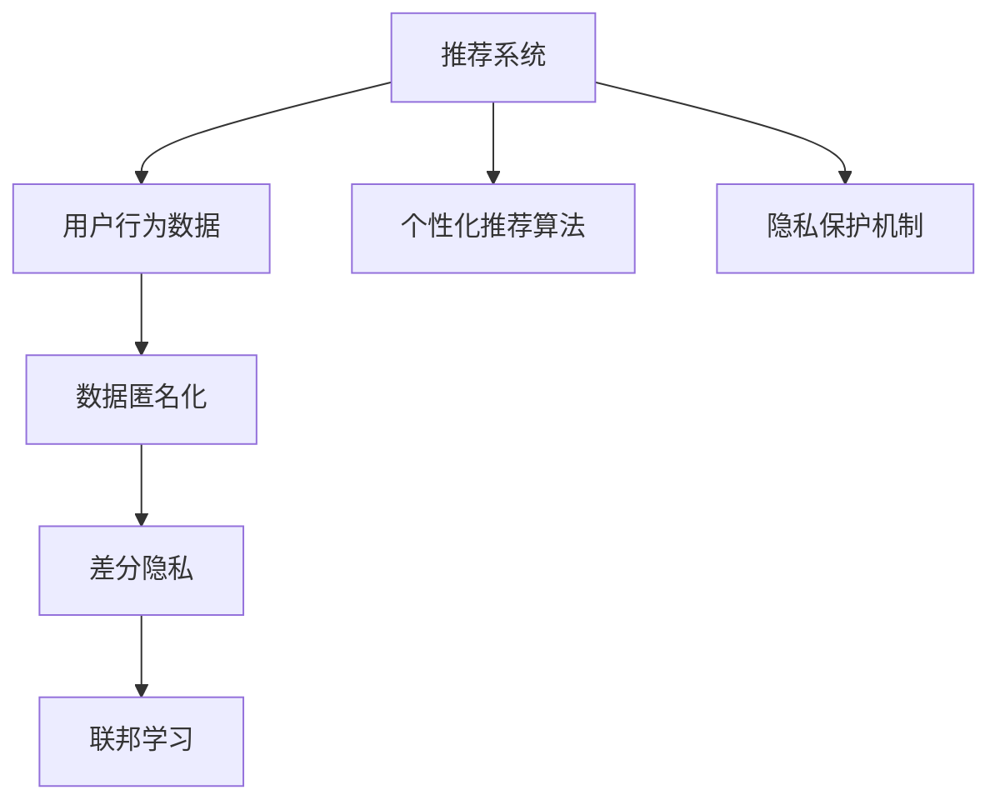

                 

# 大模型推荐中的隐私保护问题

## 1. 背景介绍

在大数据时代，推荐系统已经成为互联网产品中不可或缺的一部分。然而，推荐系统的核心在于对用户行为的分析和预测，这离不开大量个人数据的收集和使用。尽管如此，隐私保护成为了一个关键问题，用户在享受推荐服务的同时，也担心自己的隐私会被泄露。如何在提供个性化推荐的同时，保护用户的隐私，成为了推荐系统研究的一个重要课题。

## 2. 核心概念与联系

### 2.1 核心概念概述

为了理解推荐系统中的隐私保护问题，我们需要了解以下几个关键概念：

- **推荐系统（Recommender System）**：通过分析用户行为和历史数据，预测用户可能感兴趣的商品或服务，为用户提供个性化的推荐。
- **用户隐私（User Privacy）**：用户在使用推荐系统时，其行为数据、个人信息等不应被未经授权地收集、使用或分享。
- **数据匿名化（Data Anonymization）**：将原始数据转换为匿名数据，使得数据不能直接被识别出个人身份，从而保护隐私。
- **差分隐私（Differential Privacy）**：在数据分析或模型训练过程中，确保对任何单个用户的添加或删除不会显著影响模型的结果。
- **联邦学习（Federated Learning）**：在分布式环境中，多个本地设备或服务器协作训练模型，不共享任何原始数据。

### 2.2 核心概念原理和架构的 Mermaid 流程图



## 3. 核心算法原理 & 具体操作步骤

### 3.1 算法原理概述

在大规模推荐系统中，隐私保护问题主要集中在数据收集、存储、处理和传输等各个环节。其核心算法原理包括以下几个方面：

1. **数据匿名化**：通过对原始数据进行去标识化处理，使得数据无法直接关联到特定用户。常见的匿名化方法包括一般化、数据扰动和混淆等。
2. **差分隐私**：在模型训练或数据分析时，通过加入噪声或限制查询频率等方式，确保模型不会过度依赖特定用户的数据，从而保护隐私。
3. **联邦学习**：在分布式环境中，各本地设备或服务器不共享原始数据，而是通过本地计算和模型参数的同步更新，协作训练全局模型。

### 3.2 算法步骤详解

下面以联邦学习为例，详细介绍其具体步骤：

1. **选择合适的联邦学习算法**：如Federated Averaging（FedAvg），通过计算每个客户端的局部模型参数的平均值，得到全局模型。
2. **本地模型训练**：每个客户端在本地数据集上训练模型，生成本地模型参数。
3. **模型参数同步**：使用加密技术（如同态加密、差分隐私等），将本地模型参数发送至服务器进行全局平均计算。
4. **本地更新**：服务器将全局模型参数发送回每个客户端，每个客户端根据本地数据调整模型参数，完成一轮训练。
5. **重复迭代**：重复上述步骤，直到模型收敛。

### 3.3 算法优缺点

联邦学习具有以下优点：

1. **隐私保护**：每个客户端不共享原始数据，仅发送加密后的模型参数，从而保护用户隐私。
2. **分布式计算**：多个本地设备或服务器可以同时参与模型训练，加快训练速度。
3. **模型鲁棒性**：通过多客户端协作训练，模型能够更好地应对数据分布不均、数据噪声等问题。

然而，联邦学习也存在一些缺点：

1. **通信开销**：每次模型参数的同步需要加密和解密，增加了计算和通信开销。
2. **同步频率**：模型参数的同步频率需要平衡计算效率和隐私保护，不当的同步频率可能导致性能下降。
3. **网络延迟**：分布式环境中，网络延迟可能影响训练效率。

### 3.4 算法应用领域

联邦学习主要应用于以下领域：

1. **个性化推荐系统**：如电商、音乐、视频等推荐场景，通过分布式协作训练，保护用户隐私，提升推荐精度。
2. **医疗健康**：在医疗数据隐私保护要求较高的场景下，联邦学习可用于联合训练疾病诊断模型，保护患者隐私。
3. **金融风控**：通过分布式训练信用评分模型，保护用户交易数据，提升风险评估的准确性。
4. **智能家居**：智能设备通过联邦学习协作训练家庭智能系统，保护用户行为数据，提升系统智能化水平。

## 4. 数学模型和公式 & 详细讲解 & 举例说明

### 4.1 数学模型构建

联邦学习的数学模型主要包括以下几个组成部分：

1. **本地模型**：每个客户端在本地数据集上训练的模型，记为 $M_i$。
2. **全局模型**：所有客户端的平均模型，记为 $M$。
3. **本地数据**：每个客户端的本地数据集，记为 $D_i$。
4. **本地梯度**：每个客户端的梯度更新，记为 $g_i$。
5. **全局梯度**：所有客户端的梯度平均，记为 $g$。

### 4.2 公式推导过程

联邦学习的主要推导基于FedAvg算法。其核心步骤如下：

1. **本地模型更新**：
   $$
   M_i \leftarrow M_i - \eta \frac{\partial L_i(M_i)}{\partial M_i}
   $$
   其中，$L_i$ 为客户端 $i$ 的损失函数，$\eta$ 为学习率。

2. **本地梯度计算**：
   $$
   g_i = \frac{\partial L_i(M_i)}{\partial M_i}
   $$

3. **全局模型更新**：
   $$
   M \leftarrow \frac{1}{K} \sum_{i=1}^K M_i
   $$

4. **全局梯度计算**：
   $$
   g = \frac{1}{K} \sum_{i=1}^K g_i
   $$

5. **本地模型同步**：
   $$
   M_i \leftarrow M_i - \eta g
   $$

### 4.3 案例分析与讲解

以电商推荐系统为例，联邦学习的应用流程如下：

1. **数据分布**：假设每个用户的购买记录存储在各自的设备上，如手机、平板等。
2. **本地模型训练**：每个设备在本地数据上训练推荐模型，生成局部模型 $M_i$。
3. **模型参数同步**：使用同态加密技术，将 $M_i$ 发送至服务器进行全局平均计算，得到 $M$。
4. **本地更新**：每个设备根据 $M$ 调整本地模型，完成一轮训练。
5. **重复迭代**：重复上述步骤，直至模型收敛。

## 5. 项目实践：代码实例和详细解释说明

### 5.1 开发环境搭建

在进行联邦学习实践前，我们需要准备好开发环境。以下是使用Python进行TensorFlow开发的环境配置流程：

1. 安装Anaconda：从官网下载并安装Anaconda，用于创建独立的Python环境。

2. 创建并激活虚拟环境：
```bash
conda create -n federated-env python=3.8 
conda activate federated-env
```

3. 安装TensorFlow：根据CUDA版本，从官网获取对应的安装命令。例如：
```bash
conda install tensorflow -c pytorch -c conda-forge
```

4. 安装联邦学习库：
```bash
pip install federated-ml
```

5. 安装各类工具包：
```bash
pip install numpy pandas scikit-learn matplotlib tqdm jupyter notebook ipython
```

完成上述步骤后，即可在`federated-env`环境中开始联邦学习实践。

### 5.2 源代码详细实现

以下是一个使用TensorFlow实现联邦学习的应用示例，具体实现如下：

```python
import tensorflow as tf
from federatedml import configurations
from federatedml.config import Config

# 配置联邦学习环境
config = Config()
config.strategy = 'local'

# 定义本地模型
class LocalModel(tf.keras.Model):
    def __init__(self):
        super(LocalModel, self).__init__()
        self.dnn = tf.keras.Sequential([
            tf.keras.layers.Dense(128, activation='relu'),
            tf.keras.layers.Dense(10, activation='softmax')
        ])

    def call(self, x):
        return self.dnn(x)

# 定义联邦学习实例
federated_learning = tf.keras.federated.FederatedAveraging(
    local_model=LocalModel,
    num_clients=10,
    rounds=5,
    config=config
)

# 本地训练
def train_local_model(model, data):
    model.compile(optimizer=tf.keras.optimizers.Adam(learning_rate=0.01), loss='sparse_categorical_crossentropy', metrics=['accuracy'])
    model.fit(data['x'], data['y'], epochs=5)
    return model

# 全局模型训练
def train_global_model(model, federated_learning, data):
    federated_learning.load(data)
    federated_learning.train()
    return federated_learning.model

# 准备数据
import numpy as np
data = {
    'x': np.random.randn(100, 10),
    'y': np.random.randint(0, 10, size=100)
}

# 本地模型训练
local_models = [train_local_model(tf.keras.models.clone(config.local_model), data) for _ in range(config.num_clients)]

# 全局模型训练
global_model = train_global_model(config.local_model, federated_learning, data)

# 输出模型结果
print(global_model.predict(data['x']))
```

### 5.3 代码解读与分析

让我们再详细解读一下关键代码的实现细节：

**配置联邦学习环境**：
- `Config`类：用于定义联邦学习的环境参数，如策略、轮数等。
- `strategy`：定义训练策略，如`local`表示本地计算，`server`表示集中计算。

**本地模型定义**：
- `LocalModel`类：定义本地模型，使用Keras搭建简单的全连接神经网络。

**联邦学习实例**：
- `tf.keras.federated.FederatedAveraging`：实例化联邦平均算法，参数包括本地模型、客户端数、轮数等。

**本地模型训练**：
- `train_local_model`函数：定义本地模型训练流程，包括模型编译、数据拟合等步骤。

**全局模型训练**：
- `train_global_model`函数：定义全局模型训练流程，包括加载数据、训练联邦学习模型等步骤。

**数据准备**：
- 使用NumPy生成随机数据，作为训练样本和标签。

**本地模型训练**：
- 使用`train_local_model`函数，对每个本地模型进行训练，生成本地模型列表。

**全局模型训练**：
- 使用`train_global_model`函数，对全局模型进行训练，生成全局模型。

**模型输出**：
- 使用`predict`函数，对数据进行预测，输出结果。

## 6. 实际应用场景

### 6.1 智能推荐系统

在大规模推荐系统中，联邦学习可以用于保护用户隐私，同时提升推荐精度。具体而言，每个用户的数据存储在各自的设备上，通过联邦学习的方式，多个设备协作训练推荐模型，保护用户隐私的同时，提供更加个性化的推荐服务。

### 6.2 医疗健康

在医疗数据隐私保护要求较高的场景下，联邦学习可用于联合训练疾病诊断模型，保护患者隐私，提升医疗服务的精准度和效率。

### 6.3 金融风控

通过分布式训练信用评分模型，联邦学习可用于保护用户交易数据，提升风险评估的准确性，同时满足合规要求。

### 6.4 智能家居

智能设备通过联邦学习协作训练家庭智能系统，保护用户行为数据，提升系统智能化水平，同时确保用户隐私。

## 7. 工具和资源推荐

### 7.1 学习资源推荐

为了帮助开发者系统掌握联邦学习的理论基础和实践技巧，这里推荐一些优质的学习资源：

1. 《Federated Learning: Concepts and Applications》书籍：详细介绍了联邦学习的概念、算法和应用，是入门联邦学习的必备书籍。
2. TensorFlow Federated（TFF）官方文档：TensorFlow联邦学习库的官方文档，提供了丰富的联邦学习模型和算法实现，是实践联邦学习的强大工具。
3 Arxiv上最新的联邦学习论文：跟踪最新的联邦学习研究成果，了解联邦学习领域的最新进展。
4. Kaggle联邦学习竞赛：参与联邦学习竞赛，提升实际联邦学习应用能力。

通过对这些资源的学习实践，相信你一定能够快速掌握联邦学习的精髓，并用于解决实际的推荐系统问题。

### 7.2 开发工具推荐

高效的开发离不开优秀的工具支持。以下是几款用于联邦学习开发的常用工具：

1. TensorFlow Federated（TFF）：TensorFlow官方提供的联邦学习库，提供了丰富的联邦学习模型和算法实现。
2. PySyft：隐私保护库，支持差分隐私、同态加密等隐私保护技术，可用于联邦学习框架的构建。
3. H2O.ai：开源的机器学习平台，支持分布式训练和联邦学习，方便大规模数据处理。
4. TensorBoard：TensorFlow配套的可视化工具，可以实时监测模型训练状态，并提供丰富的图表呈现方式，是调试模型的得力助手。
5. Weights & Biases：模型训练的实验跟踪工具，可以记录和可视化模型训练过程中的各项指标，方便对比和调优。

合理利用这些工具，可以显著提升联邦学习任务的开发效率，加快创新迭代的步伐。

### 7.3 相关论文推荐

联邦学习的研究源于学界的持续研究。以下是几篇奠基性的相关论文，推荐阅读：

1. "A Scalable Federated Learning Approach for Mobile Device Personalization"：提出FedAvg算法，用于移动设备上的个性化推荐。
2. "Federated Learning in E-Health: A Survey"：综述了联邦学习在医疗健康领域的应用，包括疾病诊断、健康监测等。
3. "Secure Federated Learning for Recommendation Systems"：提出差分隐私联邦学习算法，用于推荐系统的隐私保护。
4. "Federated Learning for Credit Scoring"：应用联邦学习于信用评分，保护用户隐私，提升风险评估的准确性。
5. "Hierarchical federated learning for personalized recommendation"：提出层次化的联邦学习算法，提升推荐系统的性能和隐私保护。

这些论文代表了大规模推荐系统中的联邦学习发展脉络。通过学习这些前沿成果，可以帮助研究者把握学科前进方向，激发更多的创新灵感。

## 8. 总结：未来发展趋势与挑战

### 8.1 总结

本文对联邦学习在大模型推荐中的应用进行了全面系统的介绍。首先阐述了推荐系统中的隐私保护问题，明确了联邦学习在保护用户隐私方面的重要价值。其次，从原理到实践，详细讲解了联邦学习的数学原理和关键步骤，给出了联邦学习任务开发的完整代码实例。同时，本文还广泛探讨了联邦学习在智能推荐、医疗健康、金融风控等多个行业领域的应用前景，展示了联邦学习的巨大潜力。

通过本文的系统梳理，可以看到，联邦学习在大规模推荐系统中具有广阔的应用前景，既能保护用户隐私，又能提升推荐系统的性能和效果。未来，伴随联邦学习技术的不断演进，推荐系统必将在更加智能化、普适化应用中发挥重要作用。

### 8.2 未来发展趋势

展望未来，联邦学习在大模型推荐中的应用将呈现以下几个发展趋势：

1. **分布式计算**：随着分布式计算技术的不断发展，联邦学习的应用将更加广泛，能够支持更大规模的数据集和更多客户端的协作。
2. **隐私保护**：联邦学习将继续探索更多隐私保护技术，如差分隐私、同态加密、联邦数据生成等，增强模型训练的隐私性和安全性。
3. **模型优化**：联邦学习将引入更多高效的模型训练策略，如联邦加速、联邦超参优化等，提升模型的训练效率和效果。
4. **应用场景多样化**：联邦学习将逐步拓展到更多领域，如智能交通、智慧城市、物联网等，为各行各业提供隐私保护下的数据共享和协作服务。

以上趋势凸显了联邦学习技术的广泛应用前景，将为大规模推荐系统带来新的突破。这些方向的探索发展，必将进一步提升推荐系统的性能和应用范围，为构建更加智能、普适的推荐系统提供坚实的基础。

### 8.3 面临的挑战

尽管联邦学习在推荐系统中已经取得了显著成就，但在迈向更加智能化、普适化应用的过程中，它仍面临诸多挑战：

1. **通信开销**：联邦学习需要频繁的模型参数同步，增加了通信开销，可能影响训练效率。
2. **模型一致性**：多个客户端的本地模型在初始化或训练过程中可能出现不一致，导致全局模型收敛困难。
3. **异构性问题**：不同客户端的设备性能、数据质量等因素可能存在差异，影响模型的训练效果。
4. **安全性**：联邦学习需要保证通信过程的安全性，防止模型参数被恶意篡改或窃取。

解决这些挑战，需要研究者从算法、系统架构、安全机制等多个维度进行深入探索，才能使联邦学习在大规模推荐系统中得到更好的应用。

### 8.4 研究展望

面向未来，联邦学习在大模型推荐中的应用，需要在以下几个方面寻求新的突破：

1. **模型并行**：引入更多的模型并行技术，提高联邦学习的训练效率，支持更大规模的数据集和更多客户端的协作。
2. **联邦优化器**：开发高效的联邦优化器，如FedAdam、FedAdagrad等，提升模型的训练效果和收敛速度。
3. **跨领域融合**：将联邦学习与其他人工智能技术进行更深入的融合，如强化学习、知识表示等，提升推荐系统的性能和鲁棒性。
4. **模型压缩**：引入模型压缩技术，如剪枝、量化、蒸馏等，减少模型大小，提高推理速度和效率。
5. **隐私保护**：继续探索更多隐私保护技术，如差分隐私、同态加密等，增强联邦学习的隐私性和安全性。
6. **数据公平性**：研究和评估联邦学习模型在公平性方面的表现，确保推荐系统不会产生偏见或歧视。

这些研究方向的探索，必将引领联邦学习技术迈向更高的台阶，为构建安全、可靠、可解释、可控的推荐系统提供坚实的基础。

## 9. 附录：常见问题与解答

**Q1：联邦学习是否可以用于所有推荐系统？**

A: 联邦学习主要应用于分布式环境中，需要多个客户端共同协作训练模型。对于集中式推荐系统，联邦学习可能不适合。此外，对于某些小型推荐系统，联邦学习带来的额外通信开销可能得不偿失。

**Q2：联邦学习是否需要加密技术？**

A: 联邦学习可以不需要加密技术，但使用加密技术可以增强模型的隐私保护能力。常见的加密技术包括同态加密、差分隐私等。使用加密技术会增加计算和通信开销，但可以显著提高模型的安全性。

**Q3：联邦学习中的本地模型如何更新？**

A: 联邦学习的本地模型更新通常使用全局模型参数的平均，即使用本地模型计算梯度，并将梯度传递给服务器进行全局平均，然后更新本地模型。具体的本地模型更新公式如下：

$$
M_i \leftarrow M_i - \eta g
$$

其中，$M_i$ 为本地模型，$\eta$ 为学习率，$g$ 为全局梯度。

**Q4：联邦学习中的差分隐私如何实现？**

A: 差分隐私通常通过在模型参数中加入噪声来实现，具体的噪声注入方法包括Laplace噪声、高斯噪声等。常见的差分隐私实现方式包括：

1. 基于敏感度评估的噪声注入：先评估模型对单个样本的敏感度，然后根据敏感度计算噪声量。
2. 基于频次限制的噪声注入：限制模型对单个样本的查询频率，从而控制差分隐私的强度。

**Q5：联邦学习中的模型压缩有哪些方法？**

A: 模型压缩技术包括剪枝、量化、蒸馏等，可以显著减少模型的参数量和计算量，提升推理速度和效率。常用的模型压缩方法包括：

1. 剪枝：去除模型中的冗余参数，保留对模型性能影响最大的参数。
2. 量化：将模型中的参数和激活量从高精度类型（如float32）转换为低精度类型（如int8）。
3. 蒸馏：使用较小的模型来蒸馏较大的模型，保留关键特征和结构。

这些技术可以结合使用，以进一步优化联邦学习的模型和性能。

---

作者：禅与计算机程序设计艺术 / Zen and the Art of Computer Programming

