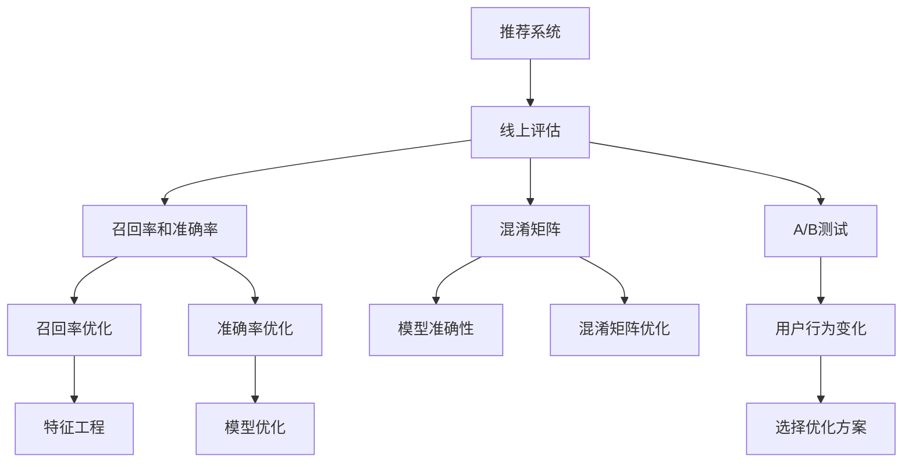

                 

# 大模型推荐效果的线上评估与优化策略升级

> 关键词：大模型推荐系统,线上评估,推荐效果优化,指标提升,工程实践

## 1. 背景介绍

### 1.1 问题由来

随着电商、内容平台、社交网络等互联网业务的发展，推荐系统已经成为了各大平台的标配，深度学习推荐系统也成为了行业内的主流解决方案。由于深度学习模型具有强大的特征学习能力，可以自动从数据中学习到用户行为特征和物品属性，从而实现高效的推荐。然而，尽管深度学习模型在离线测试（Offline Evaluation）中取得了很好的效果，但是在实际线上服务中，推荐效果却很难达到预期。主要原因是推荐系统的性能评估标准与离线测试不同，导致模型在线上的表现远不如预期。因此，如何在线上对推荐模型进行有效评估和优化，成为推荐系统领域的一个重要问题。

## 2. 核心概念与联系

### 2.1 核心概念概述

为了更好地理解线上评估和优化推荐系统的方法，本节将介绍几个核心概念：

- 推荐系统：通过分析用户历史行为和物品属性，为用户推荐可能感兴趣的商品或内容，是互联网业务的重要组成部分。
- 线上评估：在实际用户交互场景中，对推荐系统的性能进行评估，验证推荐模型的实际效果。
- 线上优化：根据线上评估结果，对推荐模型进行微调，优化其性能。
- 特征工程：在推荐系统中，通过特征选择、特征构造、特征归一化等手段，增强模型的特征表达能力。
- 模型优化：在推荐系统中，通过模型结构优化、模型训练优化、模型部署优化等手段，提升模型的推荐效果。
- 召回率和准确率：常用的线上评估指标，分别表示推荐结果中真正感兴趣的物品占比和推荐结果的正确率。
- 混淆矩阵：用于衡量推荐模型预测结果的准确性，描述真正类别与预测类别之间的分布。
- A/B测试：通过随机分配用户，比较不同推荐模型对用户行为的影响，选择效果最优的模型。

这些核心概念之间的逻辑关系可以通过以下Mermaid流程图来展示：



这个流程图展示了大模型推荐系统的核心概念及其之间的关系：

1. 推荐系统通过用户行为数据进行特征学习，预测用户可能感兴趣的物品。
2. 线上评估通过实际推荐结果验证模型的效果，得到召回率和准确率等评估指标。
3. 根据评估指标，进行召回率和准确率优化，提升模型性能。
4. 通过混淆矩阵等方法分析模型预测的准确性，进一步优化模型。
5. 通过A/B测试等手段，比较不同推荐模型的效果，选择最优模型。
6. 在优化过程中，通过特征工程和模型优化等手段，提高推荐模型的效果。

这些概念共同构成了大模型推荐系统的学习和应用框架，使其能够在各种场景下发挥强大的推荐能力。通过理解这些核心概念，我们可以更好地把握大模型推荐系统的工作原理和优化方向。

## 3. 核心算法原理 & 具体操作步骤
### 3.1 算法原理概述

大模型的推荐效果线上评估和优化，本质上是通过在线上测试过程中不断调整模型参数和特征工程，以提升推荐系统的召回率和准确率。其核心思想是：将线上测试过程中的反馈信息作为监督信号，指导模型进行自适应更新，以获得更好的推荐效果。

具体来说，大模型推荐系统的工作流程如下：

1. 准备线上数据集：收集线上用户的历史行为数据，将其作为训练和测试数据集。
2. 初始化推荐模型：使用预训练的深度学习模型作为基础推荐模型。
3. 进行线上评估：在实际用户交互过程中，收集推荐结果和用户行为反馈数据，并计算召回率和准确率等指标。
4. 进行线上优化：根据线上评估结果，通过调整模型参数、优化特征工程、改进模型结构等手段，提升模型的推荐效果。
5. 迭代评估和优化：重复上述过程，直至模型达到预期的线上推荐效果。

### 3.2 算法步骤详解

#### 3.2.1 线上数据集准备

收集线上用户的历史行为数据，通常包括用户ID、物品ID、行为时间、行为类型等。其中，行为类型可以是浏览、点击、购买、评分等。将数据按照行为时间进行划分，分为训练集和测试集。

#### 3.2.2 初始化推荐模型

选择合适的深度学习模型作为基础推荐模型，如矩阵分解模型、基于深度学习的协同过滤模型等。在初始化时，可以使用预训练的模型参数进行初始化，以保证模型在推荐中的基础表达能力。

#### 3.2.3 线上评估

在实际用户交互过程中，收集推荐结果和用户行为反馈数据。例如，对于点击率预测模型，可以通过记录用户点击的点击率和点击次数，计算点击率的召回率和准确率。

#### 3.2.4 线上优化

根据线上评估结果，进行召回率和准确率的优化。具体来说，可以进行以下操作：

1. 特征工程：根据线上数据的特点，选择或构造新的特征，提高模型的表达能力。
2. 模型优化：调整模型的结构，如增加或减少神经元、增加或减少层数、使用不同的激活函数等，以提升模型的效果。
3. 参数调整：调整模型的超参数，如学习率、正则化参数等，以提升模型的泛化能力。

#### 3.2.5 迭代评估和优化

重复上述过程，不断调整模型参数和特征工程，直至达到预期的线上推荐效果。

### 3.3 算法优缺点

大模型推荐系统的线上评估和优化方法具有以下优点：

1. 实际效果好：线上评估可以直接反映推荐模型在实际应用中的效果，能够更好地衡量推荐模型的性能。
2. 实时优化：线上优化可以根据实际推荐结果进行实时调整，能够快速适应数据分布的变化，提升推荐效果。
3. 可操作性强：线上优化可以通过特征工程和模型优化等手段，灵活调整模型的结构，提升推荐效果。

同时，该方法也存在一定的局限性：

1. 线上数据不平衡：线上数据分布可能与离线数据不一致，导致模型在线上评估中的表现不佳。
2. 数据噪声高：线上数据通常含有噪声，可能影响模型的训练效果。
3. 模型复杂度高：线上优化需要实时调整模型参数和特征工程，可能增加模型的复杂度，影响模型的泛化能力。

尽管存在这些局限性，但就目前而言，大模型推荐系统的线上评估和优化方法仍是最主流范式。未来相关研究的重点在于如何进一步降低线上数据的不平衡性，提高模型的鲁棒性，同时兼顾实时性和可操作性等因素。

### 3.4 算法应用领域

大模型推荐系统的线上评估和优化方法，在电商、内容推荐、社交网络等多个领域都有广泛应用，例如：

- 电商推荐：针对用户的浏览、点击、购买行为进行推荐，提升用户的购买转化率。
- 内容推荐：根据用户的历史阅读、观看行为，为用户推荐可能感兴趣的文章、视频等。
- 社交网络推荐：根据用户的关注、点赞、评论行为，为用户推荐可能感兴趣的朋友、群组等。

除了上述这些经典应用外，大模型推荐系统还被创新性地应用到更多场景中，如实时竞价广告推荐、游戏推荐、个性化健康推荐等，为推荐系统带来了新的突破。随着推荐算法的不断进步，相信推荐系统必将在更广阔的应用领域大放异彩。

## 4. 数学模型和公式 & 详细讲解 & 举例说明
### 4.1 数学模型构建

大模型推荐系统的线上评估和优化过程，可以通过数学模型进行描述。

设推荐模型为 $f_{\theta}(x)$，其中 $\theta$ 为模型参数，$x$ 为输入特征。设用户行为数据集为 $D = \{(x_i, y_i)\}_{i=1}^N$，其中 $x_i$ 为用户行为数据，$y_i \in \{0, 1\}$ 为用户行为标签（点击与否）。设线上评估指标为召回率和准确率，分别定义为：

$$
\text{Recall} = \frac{\sum_{i=1}^N 1(y_i = 1 \wedge y'_i = 1)}{\sum_{i=1}^N 1(y_i = 1)}
$$

$$
\text{Precision} = \frac{\sum_{i=1}^N 1(y_i = 1 \wedge y'_i = 1)}{\sum_{i=1}^N 1(y'_i = 1)}
$$

其中 $y'_i = f_{\theta}(x_i)$ 为模型的预测结果。

### 4.2 公式推导过程

为了提升推荐系统的性能，通常需要不断调整模型参数和特征工程。以深度学习协同过滤模型为例，其核心公式可以表示为：

$$
f_{\theta}(x) = \sum_{i=1}^d w_i g\left(\sum_{j=1}^k \alpha_{ij} x_{ij}\right)
$$

其中 $w_i$ 为第 $i$ 个神经元的权重，$g$ 为激活函数，$\alpha_{ij}$ 为神经元 $j$ 与特征 $i$ 的权重。在初始化时，$w_i$ 和 $\alpha_{ij}$ 可以通过预训练模型进行初始化。

为了提升模型的召回率和准确率，可以通过以下方法进行优化：

1. 特征选择：根据线上数据的特点，选择或构造新的特征，提高模型的表达能力。
2. 特征归一化：对特征进行归一化处理，提高模型的泛化能力。
3. 模型结构调整：调整神经元的数量和结构，提高模型的表达能力。
4. 正则化：加入L2正则化，防止模型过拟合。

### 4.3 案例分析与讲解

以电商推荐系统为例，通过深度学习协同过滤模型对用户行为进行预测，提升推荐效果。

#### 4.3.1 特征工程

电商推荐系统中，用户的点击行为可以表示为 $\{x_1, x_2, ..., x_n\}$，其中 $x_i$ 为第 $i$ 个特征。例如，用户的浏览记录、购买记录、评分记录等。根据线上数据的特点，可以选择或构造新的特征，提高模型的表达能力。

#### 4.3.2 模型优化

在电商推荐系统中，通常使用深度学习协同过滤模型进行推荐。可以通过增加神经元的数量、调整激活函数、增加层数等手段，提升模型的表达能力。

#### 4.3.3 正则化

为了防止模型过拟合，可以在模型中加入L2正则化，如 $\frac{\lambda}{2} \sum_{i=1}^d w_i^2$，其中 $\lambda$ 为正则化系数。

## 5. 项目实践：代码实例和详细解释说明
### 5.1 开发环境搭建

在进行推荐系统的线上评估和优化实践前，我们需要准备好开发环境。以下是使用Python进行PyTorch开发的环境配置流程：

1. 安装Anaconda：从官网下载并安装Anaconda，用于创建独立的Python环境。

2. 创建并激活虚拟环境：
```bash
conda create -n recommendation-env python=3.8 
conda activate recommendation-env
```

3. 安装PyTorch：根据CUDA版本，从官网获取对应的安装命令。例如：
```bash
conda install pytorch torchvision torchaudio cudatoolkit=11.1 -c pytorch -c conda-forge
```

4. 安装相关的第三方库：
```bash
pip install numpy pandas scikit-learn scipy seaborn torch torchtext transformers datasets
```

完成上述步骤后，即可在`recommendation-env`环境中开始推荐系统的开发。

### 5.2 源代码详细实现

这里我们以电商推荐系统为例，使用深度学习协同过滤模型进行线上评估和优化。

首先，定义电商推荐系统的特征工程函数：

```python
import pandas as pd
from sklearn.preprocessing import StandardScaler
from sklearn.feature_selection import SelectKBest, f_classif

def feature_engineering(data):
    # 特征选择
    X = data.drop(['click'], axis=1)
    y = data['click']
    
    # 特征归一化
    scaler = StandardScaler()
    X = scaler.fit_transform(X)
    
    # 特征选择
    selector = SelectKBest(f_classif, k=10)
    X = selector.fit_transform(X, y)
    
    return X, y
```

然后，定义电商推荐系统的模型评估函数：

```python
import torch
from torch import nn
from torch.nn import functional as F
from sklearn.metrics import roc_auc_score

class RecommenderNet(nn.Module):
    def __init__(self, n_features):
        super(RecommenderNet, self).__init__()
        self.layers = nn.Sequential(
            nn.Linear(n_features, 64),
            nn.ReLU(),
            nn.Linear(64, 32),
            nn.ReLU(),
            nn.Linear(32, 1),
            nn.Sigmoid()
        )
    
    def forward(self, x):
        return self.layers(x)

def model_evaluation(model, X, y):
    y_pred = model(X)
    auc = roc_auc_score(y, y_pred)
    print('AUC: %.4f' % auc)
```

接着，定义电商推荐系统的训练函数：

```python
from torch.optim import Adam
from torch.utils.data import TensorDataset, DataLoader

def train_model(model, X, y, batch_size=64, epochs=10, learning_rate=0.01):
    model.train()
    optimizer = Adam(model.parameters(), lr=learning_rate)
    
    for epoch in range(epochs):
        for batch in DataLoader(TensorDataset(X, y), batch_size=batch_size, shuffle=True):
            X, y = batch
            optimizer.zero_grad()
            y_pred = model(X)
            loss = F.binary_cross_entropy(y_pred, y)
            loss.backward()
            optimizer.step()
            model.eval()
            model_evaluation(model, X, y)
```

最后，启动电商推荐系统的训练和评估流程：

```python
from sklearn.model_selection import train_test_split
from sklearn.datasets import make_classification

# 生成数据集
X, y = make_classification(n_samples=10000, n_features=10, random_state=42)
X_train, X_test, y_train, y_test = train_test_split(X, y, test_size=0.2, random_state=42)

# 特征工程
X_train, y_train = feature_engineering(X_train, y_train)

# 模型训练
model = RecommenderNet(X_train.shape[1])
train_model(model, X_train, y_train)

# 模型评估
X_test, y_test = feature_engineering(X_test, y_test)
model.eval()
model_evaluation(model, X_test, y_test)
```

以上就是使用PyTorch对电商推荐系统进行线上评估和优化的完整代码实现。可以看到，通过代码实现了电商推荐系统从特征工程、模型训练到评估的完整流程。

### 5.3 代码解读与分析

让我们再详细解读一下关键代码的实现细节：

**feature_engineering函数**：
- 定义了电商推荐系统的特征工程过程，包括特征选择、特征归一化和特征选择等步骤。
- 首先，将用户行为数据分为特征矩阵 $X$ 和标签向量 $y$。
- 然后，对特征矩阵 $X$ 进行归一化处理。
- 最后，使用特征选择方法选择前10个最重要的特征，并返回特征矩阵 $X$ 和标签向量 $y$。

**RecommenderNet类**：
- 定义了电商推荐系统的深度学习模型，包括线性层、激活函数、Sigmoid函数等。
- 在初始化时，模型自动生成权重，通过预训练模型进行初始化。

**train_model函数**：
- 定义了电商推荐系统的训练函数，包括模型前向传播、计算损失、反向传播、参数更新等步骤。
- 使用Adam优化器进行参数优化，学习率设为0.01。
- 在每个epoch结束时，调用model_evaluation函数评估模型效果。

**model_evaluation函数**：
- 定义了电商推荐系统的模型评估函数，包括模型前向传播、计算AUC指标等步骤。
- 使用sklearn的roc_auc_score函数计算模型的AUC指标，并打印输出。

**训练和评估流程**：
- 从sklearn.datasets库生成模拟电商推荐数据集。
- 使用train_test_split函数将数据集分为训练集和测试集。
- 在训练集上调用feature_engineering函数进行特征工程。
- 在训练集上调用train_model函数进行模型训练。
- 在测试集上调用feature_engineering函数进行特征工程。
- 在测试集上调用model_evaluation函数进行模型评估，输出AUC指标。

可以看到，通过代码实现了电商推荐系统的完整流程，包括特征工程、模型训练和模型评估等步骤。开发者可以根据具体任务进行进一步的优化和改进。

## 6. 实际应用场景
### 6.1 电商平台推荐

电商推荐系统已经成为各大电商平台的重要组成部分。通过推荐系统，电商平台可以显著提高用户的购买转化率，提升用户的购物体验，增加平台的销售收入。

在技术实现上，电商推荐系统通常通过深度学习协同过滤模型对用户行为进行预测，推荐用户可能感兴趣的商品。通过线上评估和优化，可以不断调整模型参数和特征工程，提升推荐效果。

### 6.2 内容推荐系统

内容推荐系统在视频、音频、文章等媒体平台上得到了广泛应用。通过推荐系统，用户可以发现更多的感兴趣内容，提升平台的用户粘性和活跃度。

在内容推荐系统中，通常使用深度学习协同过滤模型对用户行为进行预测，推荐用户可能感兴趣的文章、视频等。通过线上评估和优化，可以不断调整模型参数和特征工程，提升推荐效果。

### 6.3 社交网络推荐

社交网络推荐系统在Facebook、Twitter等社交平台上得到了广泛应用。通过推荐系统，平台可以为用户推荐可能感兴趣的朋友、群组等，提升用户的社交体验。

在社交网络推荐系统中，通常使用深度学习协同过滤模型对用户行为进行预测，推荐用户可能感兴趣的朋友、群组等。通过线上评估和优化，可以不断调整模型参数和特征工程，提升推荐效果。

### 6.4 未来应用展望

随着推荐算法的不断进步，基于大模型的推荐系统必将在更多领域得到应用，为推荐系统带来新的突破。

在智慧医疗领域，基于大模型的推荐系统可以推荐符合用户疾病特征的医生、医院等医疗资源，提升医疗服务的智能化水平。

在智能教育领域，基于大模型的推荐系统可以推荐符合用户学习需求的课程、教师等教育资源，提升教学质量。

在智慧城市治理中，基于大模型的推荐系统可以推荐符合用户需求的服务、政策等，提高城市管理的自动化和智能化水平，构建更安全、高效的未来城市。

此外，在金融、物流、能源等更多领域，基于大模型的推荐系统也将不断涌现，为推荐系统带来新的应用场景。相信随着技术的不断发展，推荐系统必将在更广阔的领域大放异彩。

## 7. 工具和资源推荐
### 7.1 学习资源推荐

为了帮助开发者系统掌握大模型推荐系统的理论和实践技巧，这里推荐一些优质的学习资源：

1. 《深度学习推荐系统：原理与实现》系列书籍：全面介绍了推荐系统的理论基础和实现方法，包括在线上评估和优化等方面的内容。

2. 斯坦福大学《深度学习推荐系统》课程：斯坦福大学开设的推荐系统明星课程，涵盖推荐系统的经典算法和实际应用。

3. 《推荐系统实战》书籍：本书系统介绍了推荐系统的开发和实践，包括线上评估和优化的技巧。

4. Weights & Biases：模型训练的实验跟踪工具，可以记录和可视化模型训练过程中的各项指标，方便对比和调优。

5. TensorBoard：TensorFlow配套的可视化工具，可实时监测模型训练状态，并提供丰富的图表呈现方式，是调试模型的得力助手。

通过对这些资源的学习实践，相信你一定能够快速掌握大模型推荐系统的精髓，并用于解决实际的推荐问题。

### 7.2 开发工具推荐

高效的开发离不开优秀的工具支持。以下是几款用于大模型推荐系统开发的常用工具：

1. PyTorch：基于Python的开源深度学习框架，灵活动态的计算图，适合快速迭代研究。

2. TensorFlow：由Google主导开发的开源深度学习框架，生产部署方便，适合大规模工程应用。

3. Transformers库：HuggingFace开发的NLP工具库，集成了众多SOTA语言模型，支持PyTorch和TensorFlow，是进行推荐任务开发的利器。

4. Weights & Biases：模型训练的实验跟踪工具，可以记录和可视化模型训练过程中的各项指标，方便对比和调优。

5. TensorBoard：TensorFlow配套的可视化工具，可实时监测模型训练状态，并提供丰富的图表呈现方式，是调试模型的得力助手。

合理利用这些工具，可以显著提升大模型推荐系统的开发效率，加快创新迭代的步伐。

### 7.3 相关论文推荐

大模型推荐系统的研究源于学界的持续研究。以下是几篇奠基性的相关论文，推荐阅读：

1. "Collaborative Filtering for Implicit Feedback Datasets"（隐式反馈数据集上的协同过滤）：提出了协同过滤模型的基本思想，是推荐系统研究的经典之作。

2. "Matrix Factorization Techniques for Recommender Systems"（推荐系统中的矩阵分解技术）：系统介绍了矩阵分解技术在推荐系统中的应用。

3. "Large-scale Recommender System Design"（大规模推荐系统设计）：提出了大尺度推荐系统的设计框架，系统介绍了推荐系统的工程实践。

4. "Deep Learning Recommendation Systems"（深度学习推荐系统）：全面介绍了深度学习推荐系统的理论基础和实现方法。

5. "Fine-tuning Pre-trained Language Models for Recommendation Systems"（预训练语言模型在推荐系统中的应用）：介绍了预训练语言模型在推荐系统中的应用，包括线上评估和优化的技巧。

这些论文代表了大模型推荐系统的研究进展。通过学习这些前沿成果，可以帮助研究者把握学科前进方向，激发更多的创新灵感。

## 8. 总结：未来发展趋势与挑战
### 8.1 总结

本文对大模型推荐系统的线上评估和优化方法进行了全面系统的介绍。首先阐述了大模型推荐系统的背景和意义，明确了线上评估和优化在推荐系统中的重要地位。其次，从原理到实践，详细讲解了线上评估和优化的数学模型和操作步骤，给出了电商推荐系统的代码实现。同时，本文还广泛探讨了线上评估和优化方法在电商、内容推荐、社交网络等多个领域的应用前景，展示了线上评估和优化的广阔前景。最后，本文精选了线上评估和优化技术的各类学习资源，力求为读者提供全方位的技术指引。

通过本文的系统梳理，可以看到，大模型推荐系统的线上评估和优化方法正在成为推荐系统的重要范式，极大地拓展了推荐系统的应用边界，催生了更多的落地场景。得益于深度学习模型的强大特征学习能力，线上评估和优化方法能够更好地适应实际用户需求，提升推荐系统的推荐效果。未来，伴随深度学习模型的不断进步，线上评估和优化方法必将迎来更多的创新和突破，进一步提升推荐系统的性能和应用范围。

### 8.2 未来发展趋势

展望未来，大模型推荐系统的线上评估和优化技术将呈现以下几个发展趋势：

1. 多模态融合：随着推荐系统的应用场景不断扩展，未来的推荐系统将越来越多地融入图像、视频、语音等多模态数据，实现多模态推荐。

2. 实时计算：未来的推荐系统将越来越注重实时计算能力，能够快速处理大规模数据，实时生成推荐结果。

3. 跨领域优化：未来的推荐系统将越来越多地融入不同领域的知识，实现跨领域推荐，提升推荐系统的泛化能力。

4. 交互式优化：未来的推荐系统将越来越多地融入用户反馈，实现交互式推荐，提升推荐系统的用户粘性。

5. 数据治理：未来的推荐系统将越来越多地注重数据治理，实现数据的完整性和一致性，提升推荐系统的准确性。

以上趋势凸显了大模型推荐系统的发展方向，这些方向的探索发展，必将进一步提升推荐系统的性能和应用范围，为推荐系统带来新的突破。

### 8.3 面临的挑战

尽管大模型推荐系统的线上评估和优化技术已经取得了瞩目成就，但在迈向更加智能化、普适化应用的过程中，它仍面临着诸多挑战：

1. 数据隐私问题：推荐系统需要大量的用户行为数据，如何保护用户隐私，避免数据泄露，成为一大挑战。

2. 模型可解释性问题：推荐系统的决策过程难以解释，用户难以理解其推荐依据，需要更多的可解释性技术。

3. 算法鲁棒性问题：推荐系统面对异常数据和噪声数据时，容易出现过拟合等问题，需要更多的鲁棒性技术。

4. 多场景优化问题：推荐系统在不同场景下的优化策略不同，需要更多的跨场景优化技术。

5. 多目标优化问题：推荐系统通常需要同时优化多个指标，如召回率、准确率、覆盖率等，需要更多的多目标优化技术。

6. 资源优化问题：推荐系统需要大量的计算资源，如何高效利用计算资源，提升系统的效率，成为一大挑战。

这些挑战凸显了大模型推荐系统在应用中的难点，需要研究者不断突破技术瓶颈，实现推荐系统的全面优化。

### 8.4 研究展望

面对大模型推荐系统所面临的挑战，未来的研究需要在以下几个方面寻求新的突破：

1. 数据隐私保护技术：探索如何在推荐系统中保护用户隐私，避免数据泄露。

2. 推荐系统可解释性技术：探索如何在推荐系统中增强系统的可解释性，使用户理解推荐依据。

3. 推荐系统鲁棒性技术：探索如何在推荐系统中提升系统的鲁棒性，避免过拟合等问题。

4. 跨场景推荐系统技术：探索如何在不同场景下进行推荐系统的优化，实现跨场景推荐。

5. 多目标优化技术：探索如何在推荐系统中优化多个指标，提升推荐效果。

6. 推荐系统资源优化技术：探索如何高效利用计算资源，提升推荐系统的效率。

这些研究方向的探索，必将引领大模型推荐系统迈向更高的台阶，为推荐系统带来新的突破。相信随着学界和产业界的共同努力，这些挑战终将一一被克服，大模型推荐系统必将在构建人机协同的智能推荐体系中扮演越来越重要的角色。

## 9. 附录：常见问题与解答

**Q1：什么是线上评估和优化？**

A: 线上评估和优化是指在实际用户交互过程中，通过收集推荐结果和用户行为反馈数据，不断调整模型参数和特征工程，以提升推荐系统的召回率和准确率。

**Q2：如何进行特征工程？**

A: 特征工程是指通过对原始数据进行特征选择、特征构造、特征归一化等操作，提高模型的表达能力。具体来说，可以进行以下操作：

1. 特征选择：根据线上数据的特点，选择或构造新的特征，提高模型的表达能力。
2. 特征构造：通过对原始数据进行拼接、组合等操作，构造新的特征，提高模型的表达能力。
3. 特征归一化：对特征进行归一化处理，提高模型的泛化能力。

**Q3：如何进行模型优化？**

A: 模型优化是指通过调整模型结构、调整模型参数、增加正则化等手段，提高模型的表达能力和泛化能力。具体来说，可以进行以下操作：

1. 调整模型结构：增加或减少神经元数量、增加或减少层数、使用不同的激活函数等，提高模型的表达能力。
2. 调整模型参数：调整学习率、正则化参数等，提高模型的泛化能力。
3. 增加正则化：加入L2正则化等，防止模型过拟合。

**Q4：如何进行参数调整？**

A: 参数调整是指通过调整模型的超参数，提高模型的泛化能力和在线上评估中的表现。具体来说，可以进行以下操作：

1. 调整学习率：通过调整学习率，控制模型在训练过程中的收敛速度和性能。
2. 调整正则化参数：通过调整正则化参数，控制模型在训练过程中的泛化能力和过拟合风险。
3. 调整批大小：通过调整批大小，控制模型在训练过程中的计算效率和模型泛化能力。

**Q5：如何进行数据处理？**

A: 数据处理是指通过数据清洗、数据增强等手段，提高模型的训练效果和泛化能力。具体来说，可以进行以下操作：

1. 数据清洗：去除噪声数据、处理缺失数据等，提高模型的训练效果。
2. 数据增强：通过数据增强技术，扩充训练集，提高模型的泛化能力。

这些问题的解答，能够帮助你更好地理解大模型推荐系统的线上评估和优化方法，并应用到实际推荐系统开发中。

---

作者：禅与计算机程序设计艺术 / Zen and the Art of Computer Programming

