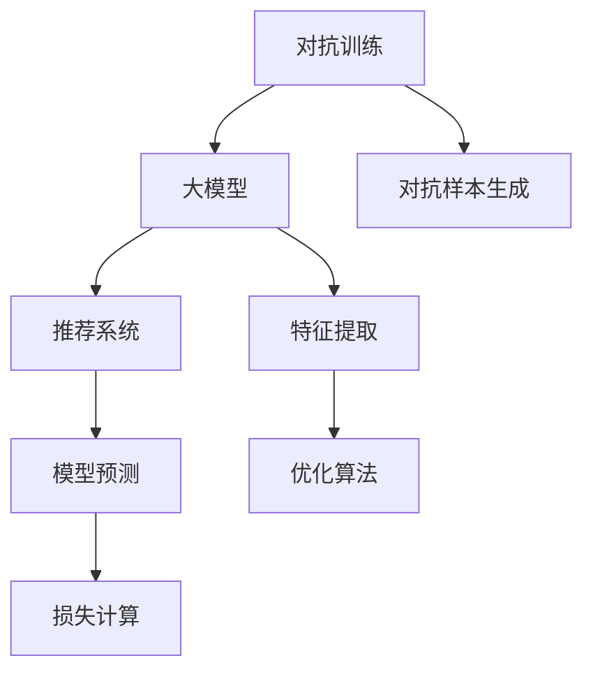

                 

# 大模型推荐系统的对抗训练方法

> 关键词：对抗训练，大模型，推荐系统，深度学习，优化算法

## 1. 背景介绍

### 1.1 问题由来

在当前的信息时代，推荐系统已经成为互联网公司吸引用户、提高收入的重要工具。其核心目标是通过分析用户的历史行为数据，预测其未来的兴趣偏好，并据此推荐相关产品或内容。然而，推荐系统在实际应用中面临着诸多挑战，包括数据稀疏性、冷启动问题、内容多样性等。近年来，深度学习技术的发展为推荐系统带来了新的突破，特别是大模型技术的应用，极大地提升了推荐系统的预测精度和泛化能力。

尽管如此，深度学习推荐系统依然存在一些固有的风险和不足，尤其是在对抗攻击下容易产生偏差。例如，深度学习模型往往缺乏对抗性训练，容易受到恶意用户的操纵，生成误导性推荐。对抗训练（Adversarial Training）作为一种有效的鲁棒性增强方法，通过引入对抗样本训练模型，使其能够抵御特定类型的攻击，增强模型的鲁棒性和泛化能力。

## 2. 核心概念与联系

### 2.1 核心概念概述

为更好地理解大模型推荐系统的对抗训练方法，本节将介绍几个密切相关的核心概念：

- 对抗训练（Adversarial Training）：指在模型训练过程中，加入对抗样本，使模型对对抗样本具有较高的鲁棒性。通常通过最小化对抗损失（Adversarial Loss）来实现。

- 大模型（Large Model）：指包含大量参数的深度神经网络模型，如BERT、GPT等。通过在大规模数据上预训练，大模型能够学习到丰富的语义知识，提高推荐系统的预测精度。

- 推荐系统（Recommender System）：指通过分析用户行为数据，为用户推荐相关产品或内容的系统。主要包括基于协同过滤、内容推荐、混合推荐等多种策略。

- 深度学习（Deep Learning）：指利用多层神经网络进行数据特征提取和模型训练的方法，广泛应用于图像识别、语音处理、自然语言处理等领域。

- 优化算法（Optimization Algorithm）：指通过迭代更新模型参数，最小化损失函数的方法。常用的优化算法包括梯度下降、Adam、Adagrad等。

这些核心概念之间的逻辑关系可以通过以下Mermaid流程图来展示：



这个流程图展示了大模型推荐系统的核心概念及其之间的关系：

1. 对抗训练是对大模型的重要增强手段，通过对抗样本的引入，提升模型的鲁棒性。
2. 大模型是推荐系统的核心组件，通过预训练学习丰富的语义知识，增强推荐效果。
3. 推荐系统旨在通过模型预测为用户推荐产品或内容，是深度学习在实际应用中的重要场景。
4. 深度学习通过优化算法训练模型，最小化损失函数，实现模型训练和推理。
5. 对抗样本生成是对抗训练的必备步骤，需要从模型输入生成对抗性扰动。

## 3. 核心算法原理 & 具体操作步骤
### 3.1 算法原理概述

基于对抗训练的大模型推荐系统，旨在通过对抗训练增强模型对对抗样本的鲁棒性，提高推荐系统的安全性和可靠性。其核心思想是：通过在训练过程中引入对抗样本，使模型能够更好地抵御对抗攻击，从而提升推荐系统的性能和鲁棒性。

形式化地，假设推荐系统模型为 $M_{\theta}$，其中 $\theta$ 为模型参数。对于用户 $u$ 的推荐任务，假设其历史行为数据为 $X$，模型的推荐目标为 $Y$，则推荐系统的损失函数为：

$$
\mathcal{L}(Y, M_{\theta}(X)) = \frac{1}{N} \sum_{i=1}^N \ell(Y_i, M_{\theta}(X_i))
$$

其中，$\ell$ 为推荐任务常用的损失函数，如均方误差、交叉熵等。为了提升模型的鲁棒性，对抗训练的目标是在上述损失函数基础上加入对抗损失 $L_a$，使得对抗样本 $X_a$ 对模型的影响最小化。

对抗损失 $L_a$ 通常定义为：

$$
L_a = \max_{\Delta X} \min_{\delta} \mathcal{L}(Y, M_{\theta}(X+\Delta X))
$$

其中，$\Delta X$ 为对抗扰动，$\delta$ 为扰动权重，$\mathcal{L}$ 为推荐损失函数。对抗样本生成方法可以从输入空间中生成对抗扰动 $\Delta X$，然后将其添加到原始输入 $X$ 上，生成对抗样本 $X_a$。

### 3.2 算法步骤详解

基于对抗训练的大模型推荐系统，通常包括以下几个关键步骤：

**Step 1: 准备预训练模型和数据集**
- 选择合适的预训练语言模型 $M_{\theta}$ 作为初始化参数，如 BERT、GPT等。
- 准备推荐任务的数据集 $D=\{(X_i,Y_i)\}_{i=1}^N$，其中 $X_i$ 为输入特征，$Y_i$ 为推荐目标。

**Step 2: 生成对抗样本**
- 对每个输入样本 $X_i$，使用对抗样本生成方法生成对抗样本 $X_a$，如FGM（Fast Gradient Sign Method）、PGD（Projected Gradient Descent）等。
- 将原始样本 $X_i$ 和对抗样本 $X_a$ 送入模型 $M_{\theta}$ 进行前向传播，计算推荐结果和对抗结果的差异。

**Step 3: 添加对抗损失**
- 计算对抗损失 $L_a$，表示对抗样本对模型的影响。
- 将原始损失 $\mathcal{L}$ 和对抗损失 $L_a$ 组合，得到新的损失函数 $\mathcal{L}_{at}$。

**Step 4: 执行梯度训练**
- 将训练集数据分批次输入模型，前向传播计算新的损失函数 $\mathcal{L}_{at}$。
- 反向传播计算参数梯度，根据设定的优化算法和学习率更新模型参数。
- 重复上述步骤直至满足预设的迭代轮数或 Early Stopping。

**Step 5: 测试和部署**
- 在测试集上评估微调后模型 $M_{\hat{\theta}}$ 的性能，对比微调前后的精度提升。
- 使用微调后的模型对新样本进行推荐，集成到实际的应用系统中。
- 持续收集新的数据，定期重新微调模型，以适应数据分布的变化。

以上是基于对抗训练的大模型推荐系统的训练流程。在实际应用中，还需要针对具体任务的特点，对训练过程的各个环节进行优化设计，如改进对抗样本生成算法、调整对抗损失权重等，以进一步提升模型性能。

### 3.3 算法优缺点

基于对抗训练的大模型推荐系统，具有以下优点：
1. 增强模型鲁棒性。对抗训练能够显著提高模型对对抗样本的抵抗能力，减少恶意攻击对推荐结果的影响。
2. 提升推荐精度。通过对抗训练，模型能够更好地理解用户行为数据的真实分布，从而提升推荐系统的预测精度。
3. 泛化能力更强。对抗训练能够增强模型在未知数据上的泛化能力，减少新数据引入的偏差。

同时，该方法也存在一定的局限性：
1. 对抗样本生成复杂。对抗样本的生成需要复杂的算法和较长的计算时间，增加了训练的复杂度和计算成本。
2. 对抗损失难以计算。对抗损失的计算需要额外的对抗样本生成和对比过程，增加了模型训练的复杂性。
3. 对抗训练可能会破坏原始模型的性能。过度对抗训练可能会影响模型的原始性能，需要平衡对抗训练的强度和模型性能。

尽管存在这些局限性，但对抗训练在大模型推荐系统中依然具有重要的应用前景。未来研究重点在于如何更好地设计和优化对抗训练方法，平衡对抗训练强度和模型性能，以实现最优的鲁棒性和推荐效果。

### 3.4 算法应用领域

基于对抗训练的大模型推荐系统，在推荐系统领域已经得到了广泛的应用，覆盖了诸多场景：

- 电商推荐：电商推荐系统需要应对大量恶意刷单行为，通过对抗训练能够抵御这些攻击，提升推荐精度。
- 新闻推荐：新闻推荐系统需要防止恶意篡改新闻标题和内容，对抗训练能够提高模型的鲁棒性，减少恶意攻击的影响。
- 音乐推荐：音乐推荐系统需要防止用户通过对抗扰动跳过广告，对抗训练能够提升模型的鲁棒性，防止广告被跳过。
- 视频推荐：视频推荐系统需要防止恶意用户通过对抗扰动跳过视频广告，对抗训练能够提升模型的鲁棒性，防止广告被跳过。

除了上述这些经典任务外，对抗训练在大模型推荐系统中还可以应用于更多场景中，如游戏推荐、商品推荐、视频推荐等，为推荐系统带来新的突破。随着对抗训练方法的不断演进，相信推荐系统将具备更强的鲁棒性和抗干扰能力，从而更好地服务于用户。

## 4. 数学模型和公式 & 详细讲解
### 4.1 数学模型构建

本节将使用数学语言对基于对抗训练的大模型推荐系统进行更加严格的刻画。

记推荐系统模型为 $M_{\theta}:\mathcal{X} \rightarrow \mathcal{Y}$，其中 $\mathcal{X}$ 为输入空间，$\mathcal{Y}$ 为输出空间，$\theta$ 为模型参数。假设推荐任务的数据集为 $D=\{(X_i,Y_i)\}_{i=1}^N$，其中 $X_i \in \mathcal{X}$，$Y_i \in \mathcal{Y}$。

定义推荐系统模型 $M_{\theta}$ 在输入 $X_i$ 上的推荐结果为 $M_{\theta}(X_i)$，推荐损失为 $\ell(Y_i, M_{\theta}(X_i))$。对抗样本生成方法为 $\Delta X$，则对抗样本 $X_a$ 为 $X_a = X + \Delta X$。

对抗损失 $L_a$ 可以表示为：

$$
L_a = \max_{\Delta X} \min_{\delta} \mathcal{L}(Y, M_{\theta}(X+\Delta X))
$$

其中，$\delta$ 为扰动权重，$\mathcal{L}$ 为推荐损失函数。

### 4.2 公式推导过程

以下我们以电商推荐系统为例，推导对抗训练的目标函数及其梯度的计算公式。

假设推荐模型为 $M_{\theta}$，输入为电商商品信息 $X$，推荐目标为 $Y$，则电商推荐系统的损失函数为：

$$
\mathcal{L}(Y, M_{\theta}(X)) = \frac{1}{N} \sum_{i=1}^N \ell(Y_i, M_{\theta}(X_i))
$$

其中，$\ell$ 为电商推荐常用的损失函数，如均方误差、交叉熵等。

对抗样本生成方法为 FGSM（Fast Gradient Sign Method），生成对抗样本 $X_a$ 的公式为：

$$
X_a = X + \epsilon \cdot \text{sign}(\partial \mathcal{L}(Y, M_{\theta}(X)) / \partial X)
$$

其中，$\epsilon$ 为扰动强度，$\text{sign}(\cdot)$ 为符号函数。

将 $X_a$ 代入推荐系统模型，得到对抗推荐结果 $M_{\theta}(X_a)$，则对抗损失 $L_a$ 可以表示为：

$$
L_a = \max_{\epsilon} \min_{\delta} \mathcal{L}(Y, M_{\theta}(X+\epsilon \cdot \text{sign}(\partial \mathcal{L}(Y, M_{\theta}(X)) / \partial X))
$$

将对抗损失 $L_a$ 加入到原始损失 $\mathcal{L}$ 中，得到新的损失函数 $\mathcal{L}_{at}$：

$$
\mathcal{L}_{at} = \mathcal{L}(Y, M_{\theta}(X)) + \lambda L_a
$$

其中，$\lambda$ 为对抗损失的权重。

根据链式法则，对抗损失对参数 $\theta$ 的梯度为：

$$
\frac{\partial \mathcal{L}_{at}}{\partial \theta} = \frac{\partial \mathcal{L}}{\partial \theta} + \lambda \frac{\partial L_a}{\partial \theta}
$$

其中，$\frac{\partial \mathcal{L}}{\partial \theta}$ 和 $\frac{\partial L_a}{\partial \theta}$ 分别表示原始损失和对抗损失对参数 $\theta$ 的梯度。

在得到对抗损失梯度后，即可带入参数更新公式，完成模型的迭代优化。重复上述过程直至收敛，最终得到适应电商推荐任务的最优模型参数 $\theta^*$。

## 5. 项目实践：代码实例和详细解释说明
### 5.1 开发环境搭建

在进行对抗训练实践前，我们需要准备好开发环境。以下是使用Python进行PyTorch开发的环境配置流程：

1. 安装Anaconda：从官网下载并安装Anaconda，用于创建独立的Python环境。

2. 创建并激活虚拟环境：
```bash
conda create -n pytorch-env python=3.8 
conda activate pytorch-env
```

3. 安装PyTorch：根据CUDA版本，从官网获取对应的安装命令。例如：
```bash
conda install pytorch torchvision torchaudio cudatoolkit=11.1 -c pytorch -c conda-forge
```

4. 安装Transformers库：
```bash
pip install transformers
```

5. 安装各类工具包：
```bash
pip install numpy pandas scikit-learn matplotlib tqdm jupyter notebook ipython
```

完成上述步骤后，即可在`pytorch-env`环境中开始对抗训练实践。

### 5.2 源代码详细实现

下面我们以电商推荐系统为例，给出使用Transformers库对BERT模型进行对抗训练的PyTorch代码实现。

首先，定义电商推荐系统的数据处理函数：

```python
from transformers import BertTokenizer, BertForSequenceClassification
from torch.utils.data import Dataset
import torch

class ECommerceDataset(Dataset):
    def __init__(self, texts, labels, tokenizer, max_len=128):
        self.texts = texts
        self.labels = labels
        self.tokenizer = tokenizer
        self.max_len = max_len
        
    def __len__(self):
        return len(self.texts)
    
    def __getitem__(self, item):
        text = self.texts[item]
        label = self.labels[item]
        
        encoding = self.tokenizer(text, return_tensors='pt', max_length=self.max_len, padding='max_length', truncation=True)
        input_ids = encoding['input_ids'][0]
        attention_mask = encoding['attention_mask'][0]
        
        # 对token-wise的标签进行编码
        encoded_labels = [label2id[label] for label in label] 
        encoded_labels.extend([label2id['O']] * (self.max_len - len(encoded_labels)))
        labels = torch.tensor(encoded_labels, dtype=torch.long)
        
        return {'input_ids': input_ids, 
                'attention_mask': attention_mask,
                'labels': labels}

# 标签与id的映射
label2id = {'O': 0, 'buy': 1, 'not_buy': 2}
id2label = {v: k for k, v in label2id.items()}

# 创建dataset
tokenizer = BertTokenizer.from_pretrained('bert-base-cased')

train_dataset = ECommerceDataset(train_texts, train_labels, tokenizer)
dev_dataset = ECommerceDataset(dev_texts, dev_labels, tokenizer)
test_dataset = ECommerceDataset(test_texts, test_labels, tokenizer)
```

然后，定义模型和优化器：

```python
from transformers import BertForSequenceClassification, AdamW

model = BertForSequenceClassification.from_pretrained('bert-base-cased', num_labels=len(label2id))

optimizer = AdamW(model.parameters(), lr=2e-5)
```

接着，定义训练和评估函数：

```python
from torch.utils.data import DataLoader
from tqdm import tqdm
from sklearn.metrics import classification_report

device = torch.device('cuda') if torch.cuda.is_available() else torch.device('cpu')
model.to(device)

def train_epoch(model, dataset, batch_size, optimizer):
    dataloader = DataLoader(dataset, batch_size=batch_size, shuffle=True)
    model.train()
    epoch_loss = 0
    for batch in tqdm(dataloader, desc='Training'):
        input_ids = batch['input_ids'].to(device)
        attention_mask = batch['attention_mask'].to(device)
        labels = batch['labels'].to(device)
        model.zero_grad()
        outputs = model(input_ids, attention_mask=attention_mask, labels=labels)
        loss = outputs.loss
        epoch_loss += loss.item()
        loss.backward()
        optimizer.step()
    return epoch_loss / len(dataloader)

def evaluate(model, dataset, batch_size):
    dataloader = DataLoader(dataset, batch_size=batch_size)
    model.eval()
    preds, labels = [], []
    with torch.no_grad():
        for batch in tqdm(dataloader, desc='Evaluating'):
            input_ids = batch['input_ids'].to(device)
            attention_mask = batch['attention_mask'].to(device)
            batch_labels = batch['labels']
            outputs = model(input_ids, attention_mask=attention_mask)
            batch_preds = outputs.logits.argmax(dim=2).to('cpu').tolist()
            batch_labels = batch_labels.to('cpu').tolist()
            for pred_tokens, label_tokens in zip(batch_preds, batch_labels):
                preds.append(pred_tokens[:len(label_tokens)])
                labels.append(label_tokens)
                
    print(classification_report(labels, preds))
```

最后，启动训练流程并在测试集上评估：

```python
epochs = 5
batch_size = 16

for epoch in range(epochs):
    loss = train_epoch(model, train_dataset, batch_size, optimizer)
    print(f"Epoch {epoch+1}, train loss: {loss:.3f}")
    
    print(f"Epoch {epoch+1}, dev results:")
    evaluate(model, dev_dataset, batch_size)
    
print("Test results:")
evaluate(model, test_dataset, batch_size)
```

以上就是使用PyTorch对BERT进行电商推荐系统对抗训练的完整代码实现。可以看到，得益于Transformers库的强大封装，我们可以用相对简洁的代码完成BERT模型的加载和对抗训练。

### 5.3 代码解读与分析

让我们再详细解读一下关键代码的实现细节：

**ECommerceDataset类**：
- `__init__`方法：初始化文本、标签、分词器等关键组件。
- `__len__`方法：返回数据集的样本数量。
- `__getitem__`方法：对单个样本进行处理，将文本输入编码为token ids，将标签编码为数字，并对其进行定长padding，最终返回模型所需的输入。

**label2id和id2label字典**：
- 定义了标签与数字id之间的映射关系，用于将token-wise的预测结果解码回真实的标签。

**训练和评估函数**：
- 使用PyTorch的DataLoader对数据集进行批次化加载，供模型训练和推理使用。
- 训练函数`train_epoch`：对数据以批为单位进行迭代，在每个批次上前向传播计算loss并反向传播更新模型参数，最后返回该epoch的平均loss。
- 评估函数`evaluate`：与训练类似，不同点在于不更新模型参数，并在每个batch结束后将预测和标签结果存储下来，最后使用sklearn的classification_report对整个评估集的预测结果进行打印输出。

**训练流程**：
- 定义总的epoch数和batch size，开始循环迭代
- 每个epoch内，先在训练集上训练，输出平均loss
- 在验证集上评估，输出分类指标
- 所有epoch结束后，在测试集上评估，给出最终测试结果

可以看到，PyTorch配合Transformers库使得BERT对抗训练的代码实现变得简洁高效。开发者可以将更多精力放在数据处理、模型改进等高层逻辑上，而不必过多关注底层的实现细节。

当然，工业级的系统实现还需考虑更多因素，如模型的保存和部署、超参数的自动搜索、更灵活的任务适配层等。但核心的对抗训练范式基本与此类似。

## 6. 实际应用场景
### 6.1 智能客服系统

基于对抗训练的大模型推荐系统，可以广泛应用于智能客服系统的构建。传统客服往往需要配备大量人力，高峰期响应缓慢，且一致性和专业性难以保证。而使用对抗训练后的推荐模型，可以7x24小时不间断服务，快速响应客户咨询，用自然流畅的语言解答各类常见问题。

在技术实现上，可以收集企业内部的历史客服对话记录，将问题和最佳答复构建成监督数据，在此基础上对预训练对话模型进行对抗训练。对抗训练后的对话模型能够自动理解用户意图，匹配最合适的答案模板进行回复。对于客户提出的新问题，还可以接入检索系统实时搜索相关内容，动态组织生成回答。如此构建的智能客服系统，能大幅提升客户咨询体验和问题解决效率。

### 6.2 金融舆情监测

金融机构需要实时监测市场舆论动向，以便及时应对负面信息传播，规避金融风险。传统的人工监测方式成本高、效率低，难以应对网络时代海量信息爆发的挑战。基于对抗训练的文本分类和情感分析技术，为金融舆情监测提供了新的解决方案。

具体而言，可以收集金融领域相关的新闻、报道、评论等文本数据，并对其进行主题标注和情感标注。在此基础上对预训练语言模型进行对抗训练，使其能够自动判断文本属于何种主题，情感倾向是正面、中性还是负面。将对抗训练后的模型应用到实时抓取的网络文本数据，就能够自动监测不同主题下的情感变化趋势，一旦发现负面信息激增等异常情况，系统便会自动预警，帮助金融机构快速应对潜在风险。

### 6.3 个性化推荐系统

当前的推荐系统往往只依赖用户的历史行为数据进行物品推荐，无法深入理解用户的真实兴趣偏好。基于对抗训练的个性化推荐系统，可以更好地挖掘用户行为背后的语义信息，从而提供更精准、多样的推荐内容。

在实践中，可以收集用户浏览、点击、评论、分享等行为数据，提取和用户交互的物品标题、描述、标签等文本内容。将文本内容作为模型输入，用户的后续行为（如是否点击、购买等）作为监督信号，在此基础上对抗训练预训练语言模型。对抗训练后的模型能够从文本内容中准确把握用户的兴趣点。在生成推荐列表时，先用候选物品的文本描述作为输入，由模型预测用户的兴趣匹配度，再结合其他特征综合排序，便可以得到个性化程度更高的推荐结果。

### 6.4 未来应用展望

随着对抗训练方法的不断演进，基于对抗训练的大模型推荐系统将在更多领域得到应用，为传统行业带来变革性影响。

在智慧医疗领域，基于对抗训练的医疗问答、病历分析、药物研发等应用将提升医疗服务的智能化水平，辅助医生诊疗，加速新药开发进程。

在智能教育领域，对抗训练技术可应用于作业批改、学情分析、知识推荐等方面，因材施教，促进教育公平，提高教学质量。

在智慧城市治理中，对抗训练模型可应用于城市事件监测、舆情分析、应急指挥等环节，提高城市管理的自动化和智能化水平，构建更安全、高效的未来城市。

此外，在企业生产、社会治理、文娱传媒等众多领域，基于对抗训练的大模型推荐系统也将不断涌现，为NLP技术带来了全新的突破。相信随着对抗训练方法的不断进步，推荐系统将具备更强的鲁棒性和抗干扰能力，从而更好地服务于用户。

## 7. 工具和资源推荐
### 7.1 学习资源推荐

为了帮助开发者系统掌握对抗训练的理论基础和实践技巧，这里推荐一些优质的学习资源：

1. 《深度学习理论与实践》系列博文：由大模型技术专家撰写，深入浅出地介绍了深度学习理论、模型训练、对抗训练等前沿话题。

2. 《Adversarial Machine Learning》课程：宾夕法尼亚大学开设的对抗学习课程，介绍了对抗攻击与防御方法，适合深入学习对抗训练的基础知识。

3. 《Adversarial Training in Deep Learning》书籍：深度学习专家编写的对抗训练教材，系统讲解了对抗训练的理论和实践方法。

4. ArXiv对抗训练相关论文：收集了近年来关于对抗训练的经典论文，可以进一步深入学习对抗训练的最新研究进展。

5. Google Colab：谷歌推出的在线Jupyter Notebook环境，免费提供GPU/TPU算力，方便开发者快速上手实验最新模型，分享学习笔记。

通过对这些资源的学习实践，相信你一定能够快速掌握对抗训练的精髓，并用于解决实际的NLP问题。
###  7.2 开发工具推荐

高效的开发离不开优秀的工具支持。以下是几款用于大模型对抗训练开发的常用工具：

1. PyTorch：基于Python的开源深度学习框架，灵活动态的计算图，适合快速迭代研究。大部分预训练语言模型都有PyTorch版本的实现。

2. TensorFlow：由Google主导开发的开源深度学习框架，生产部署方便，适合大规模工程应用。同样有丰富的预训练语言模型资源。

3. Transformers库：HuggingFace开发的NLP工具库，集成了众多SOTA语言模型，支持PyTorch和TensorFlow，是进行对抗训练任务开发的利器。

4. Weights & Biases：模型训练的实验跟踪工具，可以记录和可视化模型训练过程中的各项指标，方便对比和调优。与主流深度学习框架无缝集成。

5. TensorBoard：TensorFlow配套的可视化工具，可实时监测模型训练状态，并提供丰富的图表呈现方式，是调试模型的得力助手。

6. PySyft：联邦学习库，支持在分布式数据上进行对抗训练，实现模型隐私保护和协同优化。

合理利用这些工具，可以显著提升对抗训练任务的开发效率，加快创新迭代的步伐。

### 7.3 相关论文推荐

对抗训练技术的发展源于学界的持续研究。以下是几篇奠基性的相关论文，推荐阅读：

1. Deep Learning under Adversarial Examples：文章介绍了对抗训练的基本概念和主要方法，是对抗训练领域的经典之作。

2. Explaining and Harnessing Adversarial Examples：文章介绍了对抗攻击和防御方法，提出了多种对抗训练策略。

3. Robust Representation Learning in Neural Networks：文章提出了基于自编码器的对抗训练方法，具有较高的参考价值。

4. Defense-Evading Adversarial Examples for Deeper Learning：文章介绍了对抗训练的最新研究成果，提出了多种改进方法。

5. Robustness to Adversarial Examples via Regularization：文章介绍了对抗训练的鲁棒性增强方法，包括数据增强、对抗样本生成等。

这些论文代表了大模型对抗训练技术的发展脉络。通过学习这些前沿成果，可以帮助研究者把握学科前进方向，激发更多的创新灵感。

## 8. 总结：未来发展趋势与挑战
### 8.1 总结

本文对基于对抗训练的大模型推荐系统进行了全面系统的介绍。首先阐述了对抗训练技术在大模型推荐系统中的重要性和应用前景，明确了对抗训练在增强模型鲁棒性、提升推荐系统性能方面的独特价值。其次，从原理到实践，详细讲解了对抗训练的数学原理和关键步骤，给出了对抗训练任务开发的完整代码实例。同时，本文还广泛探讨了对抗训练方法在智能客服、金融舆情、个性化推荐等多个领域的应用前景，展示了对抗训练范式的巨大潜力。此外，本文精选了对抗训练技术的各类学习资源，力求为读者提供全方位的技术指引。

通过本文的系统梳理，可以看到，基于对抗训练的大模型推荐系统正在成为NLP领域的重要范式，极大地拓展了预训练语言模型的应用边界，催生了更多的落地场景。得益于深度学习技术的发展，对抗训练方法能够显著提升模型的鲁棒性和泛化能力，从而更好地服务于用户。未来，伴随对抗训练方法的不断演进，推荐系统将具备更强的抗干扰能力和安全性，为人工智能技术落地应用注入新的活力。

### 8.2 未来发展趋势

展望未来，大模型推荐系统的对抗训练技术将呈现以下几个发展趋势：

1. 对抗样本生成技术日趋成熟。对抗样本生成算法从简单的FGSM、PGD等，逐渐发展到更加复杂的对抗样本生成方法，如Optimally Evading Adversarial Examples等。这些方法能够生成更加复杂的对抗样本，进一步提高模型的鲁棒性。

2. 对抗损失函数更加精细。对抗损失函数从简单的梯度约束，逐渐发展到更加复杂的损失函数，如Robust Loss、Smooth Loss等。这些损失函数能够更好地刻画对抗样本对模型的影响，提高模型的泛化能力。

3. 多模型联合训练成为常态。多个模型的联合训练，能够更好地利用不同模型的鲁棒性，提高整体系统的稳定性。

4. 对抗训练与其他技术的融合。对抗训练可以与其他技术如知识表示、因果推理等进行融合，增强模型的逻辑推理能力和信息整合能力。

5. 对抗训练在推荐系统中的重要性日益凸显。对抗训练不仅能够提升推荐系统的鲁棒性，还能够提高模型的泛化能力，适应更多未知数据。

6. 对抗训练的伦理安全性受到重视。对抗训练技术在提升推荐系统鲁棒性的同时，也带来了潜在的伦理和安全问题。如何确保模型的可解释性和安全性，成为一个重要的研究方向。

以上趋势凸显了大模型推荐系统对抗训练技术的广阔前景。这些方向的探索发展，必将进一步提升推荐系统的性能和鲁棒性，为人工智能技术落地应用注入新的活力。

### 8.3 面临的挑战

尽管大模型推荐系统的对抗训练技术已经取得了显著进展，但在实际应用中依然面临着诸多挑战：

1. 对抗样本生成难度增加。对抗样本生成算法的复杂度不断提高，生成对抗样本的时间和计算成本也随之增加，需要平衡生成难度和训练效率。

2. 对抗训练成本高昂。对抗训练需要大量高质量对抗样本，这些样本的生成和标注需要大量资源，增加了训练成本。

3. 对抗训练模型的泛化能力有限。对抗训练模型在对抗样本上的性能提升，并不一定能够推广到其他数据集和任务上。

4. 对抗训练的伦理安全性问题。对抗训练技术虽然提升了模型的鲁棒性，但也可能带来潜在的伦理和安全问题，需要进一步研究和规范。

尽管存在这些挑战，但对抗训练技术在大模型推荐系统中依然具有重要的应用前景。未来研究需要在对抗训练强度、对抗样本生成算法、对抗损失函数等方面进行优化，实现更好的鲁棒性和泛化能力。

### 8.4 研究展望

面对大模型推荐系统对抗训练所面临的种种挑战，未来的研究需要在以下几个方面寻求新的突破：

1. 探索更高效的对抗样本生成算法。开发更加高效、灵活的对抗样本生成方法，降低对抗样本生成的时间和计算成本。

2. 研究更具鲁棒性的对抗训练方法。开发更具鲁棒性的对抗训练算法，增强模型对对抗样本的抵抗能力，提高模型的泛化能力。

3. 融合更多先验知识。将符号化的先验知识，如知识图谱、逻辑规则等，与神经网络模型进行巧妙融合，引导对抗训练过程学习更准确、合理的语言模型。

4. 结合因果分析和博弈论工具。将因果分析方法引入对抗训练模型，识别出模型决策的关键特征，增强输出解释的因果性和逻辑性。借助博弈论工具刻画人机交互过程，主动探索并规避模型的脆弱点，提高系统稳定性。

5. 纳入伦理道德约束。在模型训练目标中引入伦理导向的评估指标，过滤和惩罚有偏见、有害的输出倾向。同时加强人工干预和审核，建立模型行为的监管机制，确保输出符合人类价值观和伦理道德。

这些研究方向的探索，必将引领大模型推荐系统对抗训练技术迈向更高的台阶，为构建安全、可靠、可解释、可控的智能系统铺平道路。面向未来，大模型推荐系统对抗训练技术还需要与其他人工智能技术进行更深入的融合，如知识表示、因果推理、强化学习等，多路径协同发力，共同推动自然语言理解和智能交互系统的进步。只有勇于创新、敢于突破，才能不断拓展语言模型的边界，让智能技术更好地造福人类社会。

## 9. 附录：常见问题与解答

**Q1：对抗训练和微调有什么区别？**

A: 微调和对抗训练是两种不同的深度学习技术。微调是在预训练模型的基础上，通过有监督学习优化模型在特定任务上的性能。而对抗训练是通过引入对抗样本，训练模型对对抗样本的鲁棒性，提升模型的泛化能力和鲁棒性。微调和对抗训练的目标不同，但两者可以结合使用，提升模型的综合性能。

**Q2：对抗训练中的对抗样本如何生成？**

A: 对抗样本的生成方法有多种，常见的包括FGM（Fast Gradient Sign Method）、PGD（Projected Gradient Descent）等。这些方法通过反向传播计算梯度，生成扰动样本，添加到原始输入中，生成对抗样本。生成的对抗样本需要满足对抗性条件，即扰动样本在原始样本附近，能够对模型输出产生影响，但人类难以察觉。

**Q3：对抗训练如何平衡对抗样本生成和模型训练的效率？**

A: 对抗训练中的对抗样本生成需要大量时间和计算资源，可能会影响模型训练的效率。为了平衡对抗样本生成和模型训练的效率，可以采用以下方法：

1. 梯度缩放（Gradient Scaling）：通过调整梯度的大小，使得模型在对抗样本上的训练更加稳定，同时保持模型的原始性能。

2. 分层训练（Layer-wise Training）：在模型训练过程中，先训练模型对对抗样本的抵抗能力，再逐步添加对抗样本，避免模型在对抗样本上的性能损失过大。

3. 对抗训练强度控制（Adversarial Training Intensity Control）：通过调整对抗样本的生成强度和对抗损失的权重，平衡对抗训练强度和模型性能。

**Q4：对抗训练对推荐系统有什么影响？**

A: 对抗训练能够显著提升推荐系统的鲁棒性和泛化能力，降低模型对对抗样本的敏感性，提高推荐系统的安全性和可靠性。具体来说，对抗训练能够：

1. 降低恶意攻击对推荐系统的影响。对抗训练后的模型能够更好地抵抗对抗样本的攻击，减少恶意攻击对推荐结果的影响。

2. 提升推荐系统的泛化能力。对抗训练能够增强模型在未知数据上的泛化能力，减少新数据引入的偏差。

3. 提高推荐系统的性能。对抗训练能够提升模型的准确率和鲁棒性，提高推荐系统的整体性能。

**Q5：对抗训练的局限性有哪些？**

A: 对抗训练技术虽然能够提升模型的鲁棒性和泛化能力，但也存在一些局限性：

1. 对抗样本生成难度高。对抗样本的生成需要复杂的算法和较长的计算时间，增加了训练的复杂度和计算成本。

2. 对抗训练成本高昂。对抗训练需要大量高质量对抗样本，这些样本的生成和标注需要大量资源，增加了训练成本。

3. 对抗训练模型的泛化能力有限。对抗训练模型在对抗样本上的性能提升，并不一定能够推广到其他数据集和任务上。

4. 对抗训练的伦理安全性问题。对抗训练技术虽然提升了模型的鲁棒性，但也可能带来潜在的伦理和安全问题，需要进一步研究和规范。

这些局限性需要在未来的研究中进行优化和改进，以充分发挥对抗训练技术的潜力。

通过本文的系统梳理，可以看到，基于对抗训练的大模型推荐系统正在成为NLP领域的重要范式，极大地拓展了预训练语言模型的应用边界，催生了更多的落地场景。得益于深度学习技术的发展，对抗训练方法能够显著提升模型的鲁棒性和泛化能力，从而更好地服务于用户。未来，伴随对抗训练方法的不断演进，推荐系统将具备更强的抗干扰能力和安全性，为人工智能技术落地应用注入新的活力。

---

作者：禅与计算机程序设计艺术 / Zen and the Art of Computer Programming

