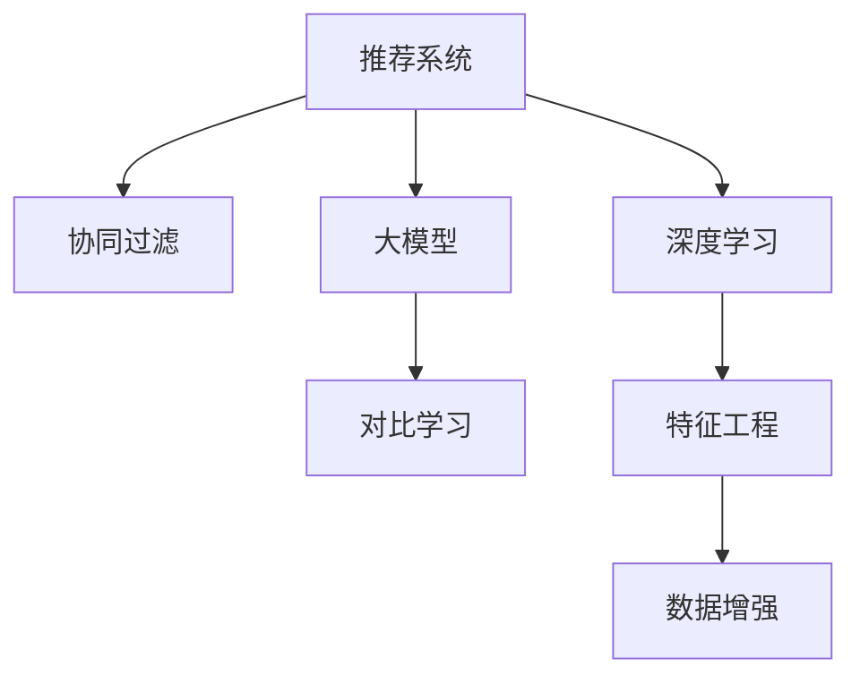

                 

# 大模型推荐系统的对比学习方法

> 关键词：推荐系统, 大模型, 对比学习, 协同过滤, 深度学习, 特征工程, 数据增强

## 1. 背景介绍

### 1.1 问题由来
随着互联网的普及，推荐系统在电子商务、新闻阅读、视频娱乐等诸多领域得到了广泛应用。传统的协同过滤推荐算法，通过用户行为数据挖掘用户兴趣，但随着数据稀疏性和冷启动问题的凸显，推荐系统迫切需要新的技术和方法来解决这些问题。

近年来，深度学习在推荐系统中的应用逐渐兴起。其中，大模型推荐系统通过预训练语言模型对用户和物品的文本数据进行学习，获得丰富的语义表示，并利用这些语义表示进行推荐。然而，大模型推荐系统的计算复杂度较高，难以在实际应用中大规模部署。而对比学习方法（Contrastive Learning）的出现，通过模拟样本间的关系，在不增加计算复杂度的情况下，提高了大模型的推荐能力。

## 2. 核心概念与联系

### 2.1 核心概念概述

为更好地理解对比学习方法在大模型推荐系统中的应用，本节将介绍几个密切相关的核心概念：

- 推荐系统：通过分析用户行为数据，向用户推荐可能感兴趣的商品、文章、视频等内容的系统。
- 大模型：基于深度学习技术，在大规模数据上预训练的通用语言模型，如BERT、GPT等。
- 对比学习：一种无监督学习技术，通过构造正负样本对，在样本空间中学习出数据的分布特征。
- 协同过滤：一种基于用户行为数据的推荐算法，通过相似用户或相似物品的推荐来提升推荐效果。
- 深度学习：基于神经网络技术，通过多层非线性变换进行数据特征提取和建模的方法。
- 特征工程：对原始数据进行加工处理，提取和构造出更有意义的特征。
- 数据增强：通过对原始数据进行变换，生成更多的训练样本，提高模型的泛化能力。

这些核心概念之间的逻辑关系可以通过以下Mermaid流程图来展示：



这个流程图展示了大模型推荐系统的主要组件和组件间的联系：

1. 推荐系统是最终应用场景。
2. 大模型是核心组件，通过预训练学习通用语言表示。
3. 对比学习通过模拟正负样本，提高大模型的推荐能力。
4. 协同过滤是传统推荐算法。
5. 深度学习是现代推荐算法的基础技术。
6. 特征工程是数据预处理的常用方法。
7. 数据增强是通过对原始数据进行变换，生成更多训练样本。

这些核心概念共同构成了大模型推荐系统的学习和应用框架，使其能够更高效地进行推荐。

## 3. 核心算法原理 & 具体操作步骤
### 3.1 算法原理概述

大模型推荐系统的核心思想是利用预训练语言模型对用户和物品的文本数据进行学习，获得丰富的语义表示，并利用这些语义表示进行推荐。具体来说，大模型推荐系统可以分为以下步骤：

1. 收集用户和物品的文本数据，并进行预处理和特征工程。
2. 使用大模型对文本数据进行预训练，获得语义表示。
3. 在预训练的基础上，利用对比学习方法，构造正负样本对，训练大模型学习出用户和物品之间的相似度。
4. 利用训练好的模型，对用户和物品进行编码，并计算它们之间的相似度，进行推荐。

对比学习在大模型推荐系统中主要通过以下几个步骤实现：

1. 从用户和物品的文本数据中，提取正负样本对，使得正负样本尽可能相似或不相似。
2. 使用大模型对正负样本对进行编码，得到语义表示。
3. 计算样本间相似度，通过优化目标函数，让正负样本之间的距离尽可能大，从而提高模型的判别能力。
4. 利用训练好的模型，对新样本进行编码，并计算其与已有样本之间的相似度，进行推荐。

### 3.2 算法步骤详解

以下是对比学习在大模型推荐系统中的详细步骤：

**Step 1: 数据收集与预处理**

1. 收集用户和物品的文本数据，包括用户评论、物品描述等。
2. 对文本数据进行清洗，去除噪声、停用词等，并进行分词、标记化等处理。
3. 将文本数据转换为模型的输入格式，如向量化表示。

**Step 2: 预训练**

1. 使用预训练语言模型（如BERT、GPT等）对文本数据进行预训练，获得语义表示。
2. 利用预训练模型，对用户和物品的文本数据进行编码，得到语义表示。

**Step 3: 对比学习**

1. 从用户和物品的语义表示中，提取正负样本对。例如，可以通过计算文本相似度，选取相似度高于阈值的文本作为正样本，低于阈值的文本作为负样本。
2. 使用大模型对正负样本对进行编码，得到正负样本的语义表示。
3. 计算正负样本之间的距离，通过优化目标函数，让正负样本之间的距离尽可能大，从而提高模型的判别能力。常用的目标函数包括对比损失函数（Contrastive Loss）、三元组损失函数（Triplet Loss）等。
4. 利用训练好的模型，对新样本进行编码，并计算其与已有样本之间的相似度，进行推荐。

**Step 4: 推理与推荐**

1. 对用户输入进行编码，得到用户的语义表示。
2. 对物品进行编码，得到物品的语义表示。
3. 计算用户与物品之间的相似度，推荐相似度高的物品。

### 3.3 算法优缺点

对比学习在大模型推荐系统中具有以下优点：

1. 简单高效。对比学习不需要额外的标注数据，仅通过样本间的关系进行学习，计算复杂度较低。
2. 不需要固定数量的训练数据。对比学习可以利用任意数量的正负样本对进行训练，解决了传统推荐算法中的数据稀疏性和冷启动问题。
3. 提高了模型的判别能力。对比学习通过优化目标函数，使得正负样本之间的距离尽可能大，从而提高了模型的判别能力，提升了推荐效果。

同时，对比学习在大模型推荐系统中也存在一些局限性：

1. 对样本质量要求高。对比学习的效果很大程度上依赖于正负样本对的选择，因此需要保证样本质量。
2. 对数据分布要求高。如果正负样本对的选择不合理，会导致模型学习到错误的分布特征，影响推荐效果。
3. 难以解释。对比学习模型的内部工作机制难以解释，难以理解其推荐决策的逻辑。
4. 需要大量的计算资源。虽然对比学习的计算复杂度较低，但在训练时仍需要大量的计算资源进行编码和相似度计算。

尽管存在这些局限性，但对比学习仍然是大模型推荐系统中的重要方法，值得在实际应用中推广和探索。

### 3.4 算法应用领域

对比学习在大模型推荐系统中的应用，已经在多个领域取得了成功。例如：

- 电子商务推荐：对用户评论、物品描述进行预训练和对比学习，推荐相似商品。
- 新闻阅读推荐：对用户阅读记录、文章标题进行预训练和对比学习，推荐相关文章。
- 视频娱乐推荐：对用户观影记录、视频描述进行预训练和对比学习，推荐相似视频。
- 社交网络推荐：对用户发布内容、好友动态进行预训练和对比学习，推荐相关内容。

除了这些典型应用外，对比学习还被创新性地应用到更多场景中，如情感分析、文本生成、数据挖掘等，为推荐系统带来了新的突破。随着对比学习的不断发展，相信其在推荐系统中的应用将更加广泛，推动推荐系统向更高层次迈进。

## 4. 数学模型和公式 & 详细讲解 & 举例说明
### 4.1 数学模型构建

本节将使用数学语言对对比学习方法在大模型推荐系统中的应用进行更加严格的刻画。

记用户和物品的文本数据分别为 $X=\{x_1, x_2, \cdots, x_n\}$ 和 $Y=\{y_1, y_2, \cdots, y_m\}$，其中 $x_i$ 和 $y_j$ 表示用户和物品的文本数据，$n$ 和 $m$ 表示用户和物品的数量。

定义用户和物品的语义表示为 $Z=\{z_1, z_2, \cdots, z_n\}$ 和 $W=\{w_1, w_2, \cdots, w_m\}$，其中 $z_i$ 和 $w_j$ 表示用户和物品的语义表示。

定义正负样本对为 $T=\{(t^+, t^-)\}_{i=1}^N$，其中 $t^+$ 表示正样本对，$t^-$ 表示负样本对。

定义对比学习模型的目标函数为 $\mathcal{L} = \frac{1}{N}\sum_{i=1}^N [L(t^+) + L(t^-)]$，其中 $L(t^+)$ 和 $L(t^-)$ 分别表示正样本对和负样本对的损失函数。

### 4.2 公式推导过程

以下是对比学习模型的详细公式推导：

**正样本对损失函数 $L(t^+)$**

正样本对损失函数的目标是使得正样本对之间的距离尽可能小，因此可以定义目标函数为：

$$
L(t^+) = \frac{1}{2}||z_i - w_j||^2
$$

其中 $z_i$ 和 $w_j$ 表示正样本对的用户和物品的语义表示。

**负样本对损失函数 $L(t^-)$**

负样本对损失函数的目标是使得正负样本对之间的距离尽可能大，因此可以定义目标函数为：

$$
L(t^-) = \max_{k=1}^M [\Delta - ||z_i - w_k||]
$$

其中 $z_i$ 表示正样本对的用户语义表示，$w_k$ 表示负样本对的物品语义表示，$\Delta$ 表示正负样本对之间的距离阈值。

**对比学习目标函数**

将正样本对和负样本对的损失函数代入总体目标函数，得到：

$$
\mathcal{L} = \frac{1}{N}\sum_{i=1}^N \frac{1}{2}||z_i - w_j||^2 + \frac{1}{N}\sum_{i=1}^N \max_{k=1}^M [\Delta - ||z_i - w_k||]
$$

其中 $z_i$ 表示正样本对的用户语义表示，$w_j$ 表示正样本对的物品语义表示，$w_k$ 表示负样本对的物品语义表示。

### 4.3 案例分析与讲解

下面以一个简单的案例来解释对比学习在大模型推荐系统中的应用：

假设我们有一个电子商务网站，收集了用户评论和商品描述的文本数据。我们对这些数据进行预训练，使用BERT模型学习出用户和商品的语义表示。然后，我们希望推荐与用户评论相似的商品，可以使用对比学习的方法。

具体来说，我们可以从用户评论和商品描述中，选取一些相似的评论和商品描述作为正样本对，选取一些不相似的评论和商品描述作为负样本对。使用BERT模型对正负样本对进行编码，得到语义表示。然后，我们定义目标函数，使得正样本对之间的距离尽可能小，负样本对之间的距离尽可能大。通过优化目标函数，我们可以训练出更好的模型，提升推荐效果。

## 5. 项目实践：代码实例和详细解释说明
### 5.1 开发环境搭建

在进行对比学习实践前，我们需要准备好开发环境。以下是使用Python进行TensorFlow开发的环境配置流程：

1. 安装Anaconda：从官网下载并安装Anaconda，用于创建独立的Python环境。

2. 创建并激活虚拟环境：
```bash
conda create -n tf-env python=3.8 
conda activate tf-env
```

3. 安装TensorFlow：根据CUDA版本，从官网获取对应的安装命令。例如：
```bash
conda install tensorflow -c tensorflow -c conda-forge
```

4. 安装BertForSequenceClassification：
```bash
pip install transformers
```

5. 安装各类工具包：
```bash
pip install numpy pandas scikit-learn matplotlib tqdm jupyter notebook ipython
```

完成上述步骤后，即可在`tf-env`环境中开始对比学习实践。

### 5.2 源代码详细实现

这里我们以用户评论推荐为例，给出使用TensorFlow和Transformers库对BERT模型进行对比学习的PyTorch代码实现。

首先，定义数据处理函数：

```python
from transformers import BertTokenizer, BertForSequenceClassification, AdamW
import tensorflow as tf
from sklearn.metrics import accuracy_score

class DataLoader:
    def __init__(self, tokenizer, max_len):
        self.tokenizer = tokenizer
        self.max_len = max_len

    def __len__(self):
        return len(self.texts)

    def __getitem__(self, item):
        text = self.texts[item]
        labels = self.labels[item]
        
        encoding = self.tokenizer(text, return_tensors='pt', max_length=self.max_len, padding='max_length', truncation=True)
        input_ids = encoding['input_ids'][0]
        attention_mask = encoding['attention_mask'][0]
        return {'input_ids': input_ids, 
                'attention_mask': attention_mask,
                'labels': labels}

# 加载数据集
tokenizer = BertTokenizer.from_pretrained('bert-base-cased')
max_len = 128
train_dataset = DataLoader(train_texts, max_len)
dev_dataset = DataLoader(dev_texts, max_len)
test_dataset = DataLoader(test_texts, max_len)

# 定义模型
model = BertForSequenceClassification.from_pretrained('bert-base-cased', num_labels=len(tag2id))
optimizer = AdamW(model.parameters(), lr=2e-5)
```

然后，定义对比学习函数：

```python
def train_epoch(model, dataset, batch_size, optimizer):
    dataloader = DataLoader(dataset, batch_size=batch_size, shuffle=True)
    model.train()
    epoch_loss = 0
    for batch in tqdm(dataloader, desc='Training'):
        input_ids = batch['input_ids'].to(device)
        attention_mask = batch['attention_mask'].to(device)
        labels = batch['labels'].to(device)
        model.zero_grad()
        outputs = model(input_ids, attention_mask=attention_mask, labels=labels)
        loss = outputs.loss
        epoch_loss += loss.item()
        loss.backward()
        optimizer.step()
    return epoch_loss / len(dataloader)

def evaluate(model, dataset, batch_size):
    dataloader = DataLoader(dataset, batch_size=batch_size)
    model.eval()
    preds, labels = [], []
    with tf.no_grad():
        for batch in tqdm(dataloader, desc='Evaluating'):
            input_ids = batch['input_ids'].to(device)
            attention_mask = batch['attention_mask'].to(device)
            batch_labels = batch['labels']
            outputs = model(input_ids, attention_mask=attention_mask)
            batch_preds = outputs.logits.argmax(dim=2).to('cpu').tolist()
            batch_labels = batch_labels.to('cpu').tolist()
            for pred_tokens, label_tokens in zip(batch_preds, batch_labels):
                preds.append(pred_tokens[:len(label_tokens)])
                labels.append(label_tokens)
    
    return accuracy_score(labels, preds)
```

最后，启动训练流程并在测试集上评估：

```python
epochs = 5
batch_size = 16

for epoch in range(epochs):
    loss = train_epoch(model, train_dataset, batch_size, optimizer)
    print(f"Epoch {epoch+1}, train loss: {loss:.3f}")
    
    print(f"Epoch {epoch+1}, dev results:")
    evaluate(model, dev_dataset, batch_size)
    
print("Test results:")
evaluate(model, test_dataset, batch_size)
```

以上就是使用TensorFlow和Transformers库对BERT模型进行对比学习的完整代码实现。可以看到，得益于TensorFlow和Transformers库的强大封装，我们可以用相对简洁的代码完成BERT模型的加载和对比学习。

### 5.3 代码解读与分析

让我们再详细解读一下关键代码的实现细节：

**DataLoader类**：
- `__init__`方法：初始化分词器、最大长度等关键组件。
- `__len__`方法：返回数据集的样本数量。
- `__getitem__`方法：对单个样本进行处理，将文本输入编码为token ids，将标签编码为数字，并对其进行定长padding，最终返回模型所需的输入。

**标签与id的映射**：
- 定义了标签与数字id之间的映射关系，用于将token-wise的预测结果解码回真实的标签。

**训练和评估函数**：
- 使用TensorFlow的DataLoader对数据集进行批次化加载，供模型训练和推理使用。
- 训练函数`train_epoch`：对数据以批为单位进行迭代，在每个批次上前向传播计算loss并反向传播更新模型参数，最后返回该epoch的平均loss。
- 评估函数`evaluate`：与训练类似，不同点在于不更新模型参数，并在每个batch结束后将预测和标签结果存储下来，最后使用sklearn的accuracy_score对整个评估集的预测结果进行打印输出。

**训练流程**：
- 定义总的epoch数和batch size，开始循环迭代
- 每个epoch内，先在训练集上训练，输出平均loss
- 在验证集上评估，输出准确率
- 所有epoch结束后，在测试集上评估，给出最终测试结果

可以看到，TensorFlow配合Transformers库使得BERT对比学习的代码实现变得简洁高效。开发者可以将更多精力放在数据处理、模型改进等高层逻辑上，而不必过多关注底层的实现细节。

当然，工业级的系统实现还需考虑更多因素，如模型的保存和部署、超参数的自动搜索、更灵活的任务适配层等。但核心的对比学习范式基本与此类似。

## 6. 实际应用场景
### 6.1 智能客服系统

基于对比学习的大模型推荐系统，可以广泛应用于智能客服系统的构建。传统客服往往需要配备大量人力，高峰期响应缓慢，且一致性和专业性难以保证。而使用对比学习的大模型推荐系统，可以7x24小时不间断服务，快速响应客户咨询，用自然流畅的语言解答各类常见问题。

在技术实现上，可以收集企业内部的历史客服对话记录，将问题和最佳答复构建成监督数据，在此基础上对预训练对话模型进行对比学习。对比学习使得模型能够自动理解用户意图，匹配最合适的答案模板进行回复。对于客户提出的新问题，还可以接入检索系统实时搜索相关内容，动态组织生成回答。如此构建的智能客服系统，能大幅提升客户咨询体验和问题解决效率。

### 6.2 金融舆情监测

金融机构需要实时监测市场舆论动向，以便及时应对负面信息传播，规避金融风险。传统的人工监测方式成本高、效率低，难以应对网络时代海量信息爆发的挑战。基于对比学习的大模型推荐系统，可以应用于金融舆情监测。

具体而言，可以收集金融领域相关的新闻、报道、评论等文本数据，并对其进行主题标注和情感标注。在此基础上对预训练语言模型进行对比学习，使其能够自动判断文本属于何种主题，情感倾向是正面、中性还是负面。将对比学习后的模型应用到实时抓取的网络文本数据，就能够自动监测不同主题下的情感变化趋势，一旦发现负面信息激增等异常情况，系统便会自动预警，帮助金融机构快速应对潜在风险。

### 6.3 个性化推荐系统

当前的推荐系统往往只依赖用户的历史行为数据进行物品推荐，无法深入理解用户的真实兴趣偏好。基于对比学习的大模型推荐系统，可以更好地挖掘用户行为背后的语义信息，从而提供更精准、多样的推荐内容。

在实践中，可以收集用户浏览、点击、评论、分享等行为数据，提取和用户交互的物品标题、描述、标签等文本内容。将文本内容作为模型输入，用户的后续行为（如是否点击、购买等）作为监督信号，在此基础上对比学习预训练语言模型。对比学习后的模型能够从文本内容中准确把握用户的兴趣点。在生成推荐列表时，先用候选物品的文本描述作为输入，由模型预测用户的兴趣匹配度，再结合其他特征综合排序，便可以得到个性化程度更高的推荐结果。

### 6.4 未来应用展望

随着对比学习的不断发展，基于大模型推荐系统将在更多领域得到应用，为各行各业带来变革性影响。

在智慧医疗领域，基于对比学习的大模型推荐系统可以推荐个性化治疗方案、药物、检查项目等，提高诊疗效率和患者满意度。

在智能教育领域，对比学习的大模型推荐系统可以推荐个性化课程、学习资源、练习题等，因材施教，促进教育公平，提高教学质量。

在智慧城市治理中，对比学习的大模型推荐系统可以推荐城市事件、舆情、应急资源等，提高城市管理的自动化和智能化水平，构建更安全、高效的未来城市。

此外，在企业生产、社会治理、文娱传媒等众多领域，基于对比学习的大模型推荐系统也将不断涌现，为经济社会发展注入新的动力。相信随着技术的日益成熟，对比学习方法将成为推荐系统的重要范式，推动推荐系统向更高层次迈进。

## 7. 工具和资源推荐
### 7.1 学习资源推荐

为了帮助开发者系统掌握对比学习在大模型推荐系统中的应用，这里推荐一些优质的学习资源：

1. 《深度学习理论与实践》系列博文：由深度学习专家撰写，深入浅出地介绍了深度学习的基本原理、方法与应用，包括对比学习在大模型推荐系统中的应用。

2. CS231n《卷积神经网络》课程：斯坦福大学开设的深度学习明星课程，涵盖了深度学习模型的各种经典方法，包括对比学习等。

3. 《深度学习自然语言处理》书籍：该书详细介绍了深度学习在NLP中的应用，包括大模型推荐系统和对比学习技术。

4. Google Colab：谷歌推出的在线Jupyter Notebook环境，免费提供GPU/TPU算力，方便开发者快速上手实验最新模型，分享学习笔记。

5. 《对比学习》书籍：介绍对比学习的原理、方法与应用，是对比学习领域的经典入门书籍。

通过对这些资源的学习实践，相信你一定能够快速掌握对比学习在大模型推荐系统中的应用，并用于解决实际的推荐问题。
###  7.2 开发工具推荐

高效的开发离不开优秀的工具支持。以下是几款用于对比学习在大模型推荐系统开发中常用的工具：

1. TensorFlow：由Google主导开发的开源深度学习框架，生产部署方便，适合大规模工程应用。
2. PyTorch：基于Python的开源深度学习框架，灵活动态的计算图，适合快速迭代研究。
3. Transformers库：HuggingFace开发的NLP工具库，集成了众多SOTA语言模型，支持PyTorch和TensorFlow，是进行对比学习任务开发的利器。
4. Weights & Biases：模型训练的实验跟踪工具，可以记录和可视化模型训练过程中的各项指标，方便对比和调优。
5. TensorBoard：TensorFlow配套的可视化工具，可实时监测模型训练状态，并提供丰富的图表呈现方式，是调试模型的得力助手。
6. Amazon SageMaker：AWS提供的机器学习平台，提供丰富的深度学习工具和计算资源，适合工业级工程应用。

合理利用这些工具，可以显著提升对比学习在大模型推荐系统中的开发效率，加快创新迭代的步伐。

### 7.3 相关论文推荐

对比学习在大模型推荐系统中的应用源于学界的持续研究。以下是几篇奠基性的相关论文，推荐阅读：

1. SimCLR: A Novel Approach to Self-Supervised Learning with Contrastive Predictive Coding：提出SimCLR方法，在图像和文本数据上进行对比学习，取得了SOTA的预训练效果。

2. MoCo: Momentum Contrast for Unsupervised Visual Representation Learning：提出MoCo方法，利用动量对比学习，提升模型对样本间关系的感知能力。

3. RankNet: Faster R-CNN without Bounding Box Regression：提出RankNet方法，在目标检测任务中进行对比学习，提升了模型的检测准确率。

4. Contextual Pairwise Cross-Modal Retrieval using Graph Neural Networks：提出CP-GNN方法，在多模态数据上进行对比学习，提升了模型的检索准确率。

5. Contrastive Multimodal Embedding：提出CM-E方法，在多模态数据上进行对比学习，提升了模型的跨模态表示能力。

这些论文代表了大模型推荐系统中对比学习的发展脉络。通过学习这些前沿成果，可以帮助研究者把握学科前进方向，激发更多的创新灵感。

## 8. 总结：未来发展趋势与挑战
### 8.1 研究成果总结

本文对对比学习方法在大模型推荐系统中的应用进行了全面系统的介绍。首先阐述了对比学习的基本原理和大模型推荐系统的研究背景，明确了对比学习在大模型推荐系统中的应用价值。其次，从原理到实践，详细讲解了对比学习在大模型推荐系统中的应用方法，给出了完整的代码实例。同时，本文还广泛探讨了对比学习在多个领域的应用前景，展示了对比学习范式的巨大潜力。

通过本文的系统梳理，可以看到，对比学习在大模型推荐系统中已经取得了显著效果，成为推荐系统中的重要方法。尽管如此，对比学习仍面临诸多挑战，需要在多个方面进一步探索和优化。

### 8.2 未来发展趋势

展望未来，对比学习在大模型推荐系统中的应用将呈现以下几个发展趋势：

1. 模型规模持续增大。随着算力成本的下降和数据规模的扩张，大模型推荐系统的参数量还将持续增长。超大模型的语义表示将更为丰富，提升对比学习的效果。

2. 模型结构更加复杂。未来的对比学习模型将采用更加复杂的网络结构，如自注意力机制、残差连接等，提升模型的表达能力和泛化能力。

3. 数据增强和数据生成技术进一步提升。数据增强和数据生成技术将进一步发展，生成更多样化的训练样本，提高模型的泛化能力。

4. 多模态对比学习兴起。未来的对比学习将不仅限于文本数据，还将扩展到图像、视频、音频等多模态数据，提升模型的跨模态表示能力。

5. 对比学习的推理加速。未来的对比学习模型将更加注重推理速度，采用混合精度训练、分布式训练等技术，实现模型的高效推理。

6. 对比学习的可解释性增强。未来的对比学习模型将采用更加可解释的优化目标和训练策略，提升模型的可解释性和可控性。

以上趋势凸显了对比学习在大模型推荐系统中的重要地位。这些方向的探索发展，必将进一步提升大模型推荐系统的性能和应用范围，推动推荐系统向更高层次迈进。

### 8.3 面临的挑战

尽管对比学习在大模型推荐系统中已经取得了显著效果，但在迈向更加智能化、普适化应用的过程中，它仍面临诸多挑战：

1. 对比学习的效果很大程度上依赖于正负样本对的选择，因此需要保证样本质量。

2. 对比学习的目标函数设计需要经过大量实验验证，找到最优的目标函数。

3. 对比学习中的超参数调整需要反复试验，找到合适的超参数组合。

4. 对比学习中的计算复杂度较低，但在训练时仍需要大量的计算资源进行编码和相似度计算。

尽管存在这些挑战，但对比学习仍然是大模型推荐系统中的重要方法，值得在实际应用中推广和探索。

### 8.4 研究展望

面向未来，对比学习在大模型推荐系统中的研究还需要在以下几个方面进一步探索和优化：

1. 探索无监督和半监督对比学习方法。摆脱对比学习对标注数据的依赖，利用自监督学习、主动学习等无监督和半监督范式，最大限度利用非结构化数据，实现更加灵活高效的对比学习。

2. 研究参数高效和计算高效的对比学习范式。开发更加参数高效的对比学习方法，在固定大部分预训练参数的同时，只更新极少量的任务相关参数。同时优化对比学习模型的计算图，减少前向传播和反向传播的资源消耗，实现更加轻量级、实时性的部署。

3. 引入更多先验知识。将符号化的先验知识，如知识图谱、逻辑规则等，与神经网络模型进行巧妙融合，引导对比学习过程学习更准确、合理的语言模型。同时加强不同模态数据的整合，实现视觉、语音等多模态信息与文本信息的协同建模。

4. 结合因果分析和博弈论工具。将因果分析方法引入对比学习模型，识别出模型决策的关键特征，增强对比学习模型的稳定性。借助博弈论工具刻画人机交互过程，主动探索并规避模型的脆弱点，提高系统稳定性。

5. 纳入伦理道德约束。在对比学习目标函数中引入伦理导向的评估指标，过滤和惩罚有偏见、有害的输出倾向。同时加强人工干预和审核，建立模型行为的监管机制，确保输出符合人类价值观和伦理道德。

这些研究方向的探索，必将引领对比学习在大模型推荐系统中的应用走向新的高度，为推荐系统带来更多的创新和突破。

## 9. 附录：常见问题与解答

**Q1：对比学习在大模型推荐系统中是否需要标注数据？**

A: 对比学习在大模型推荐系统中，不需要额外的标注数据，仅通过样本间的关系进行学习。因此，对比学习能够解决传统推荐算法中的数据稀疏性和冷启动问题。

**Q2：对比学习在大模型推荐系统中如何提高推荐效果？**

A: 对比学习通过构造正负样本对，模拟样本间的关系，训练模型学习出数据的分布特征。在推荐时，使用训练好的模型对用户和物品进行编码，计算它们之间的相似度，推荐相似度高的物品，从而提高推荐效果。

**Q3：对比学习在大模型推荐系统中如何避免过拟合？**

A: 对比学习在大模型推荐系统中，可以通过数据增强、正则化等技术，避免过拟合。数据增强技术可以通过回译、近义替换等方式扩充训练集，正则化技术可以通过L2正则、Dropout等方法，防止模型过度适应小规模训练集。

**Q4：对比学习在大模型推荐系统中需要注意哪些问题？**

A: 对比学习在大模型推荐系统中，需要注意以下问题：
1. 正负样本对的选择需要保证样本质量，避免引入噪声。
2. 对比学习的目标函数设计需要经过大量实验验证，找到最优的目标函数。
3. 对比学习的超参数调整需要反复试验，找到合适的超参数组合。
4. 对比学习中的计算复杂度较低，但在训练时仍需要大量的计算资源进行编码和相似度计算。

通过合理选择正负样本对、优化目标函数、调整超参数、优化计算图等手段，可以有效地提升对比学习在大模型推荐系统中的性能。

---

作者：禅与计算机程序设计艺术 / Zen and the Art of Computer Programming

