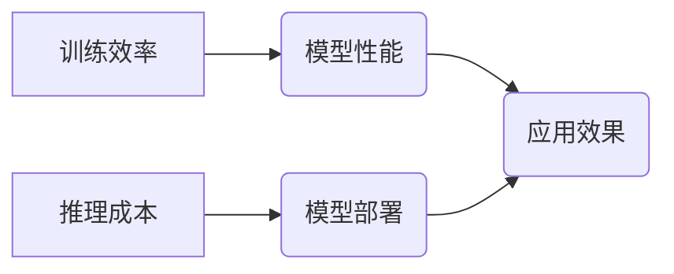

> 大模型, 训练效率, 推理成本, 优化算法, 模型压缩, 量化, 硬件加速

## 1. 背景介绍

近年来，深度学习模型规模不断扩大，涌现出许多参数量达数十亿甚至千亿的“大模型”。这些大模型在自然语言处理、计算机视觉、语音识别等领域取得了突破性进展，展现出强大的学习能力和泛化能力。然而，大模型的训练和部署也面临着巨大的挑战，其中训练效率和推理成本是两个关键问题。

**1.1 训练效率**

大模型的训练需要消耗大量的计算资源和时间。训练过程通常涉及到海量数据的处理和模型参数的更新，这对于硬件设备和软件框架提出了极高的要求。

**1.2 推理成本**

大模型的推理速度和内存占用也相对较高，这限制了其在实际应用中的部署和推广。尤其是在移动设备、嵌入式系统等资源受限的场景下，大模型的推理成本难以承受。

## 2. 核心概念与联系

训练效率和推理成本是两个相互关联但又相互独立的概念。

**2.1 训练效率**

训练效率是指在给定硬件资源和时间条件下，模型能够达到目标性能所需的训练次数。提高训练效率可以缩短训练时间，降低训练成本。

**2.2 推理成本**

推理成本是指模型在进行预测或推理时所需的计算资源和时间。降低推理成本可以提高模型的实时性、效率和可部署性。

**2.3 核心概念关系图**



## 3. 核心算法原理 & 具体操作步骤

### 3.1  算法原理概述

为了提高训练效率和降低推理成本，研究者们提出了许多算法和技术，例如：

* **优化算法:** 

Adam、RMSprop、SGD等优化算法可以加速模型训练，提高收敛速度。

* **模型压缩:** 

剪枝、量化、知识蒸馏等技术可以减少模型参数量，降低模型大小和推理成本。

* **硬件加速:** 

GPU、TPU等专用硬件可以大幅提高模型训练和推理速度。

### 3.2  算法步骤详解

**3.2.1 优化算法**

1. 初始化模型参数和学习率。
2. 计算模型预测值与真实值的损失函数。
3. 根据损失函数反向传播，计算梯度。
4. 使用优化算法更新模型参数。
5. 重复步骤2-4，直到模型性能达到目标。

**3.2.2 模型压缩**

1. 选择模型压缩技术，例如剪枝、量化或知识蒸馏。
2. 对模型进行压缩，减少模型参数量。
3. 对压缩后的模型进行微调，恢复模型性能。

**3.2.3 硬件加速**

1. 选择合适的硬件平台，例如GPU或TPU。
2. 使用深度学习框架提供的硬件加速功能，例如CUDA或TPU API。
3. 优化模型代码，充分利用硬件加速能力。

### 3.3  算法优缺点

**3.3.1 优化算法**

* **优点:** 能够加速模型训练，提高收敛速度。
* **缺点:** 不同优化算法对模型和数据集的适用性不同，需要根据实际情况选择合适的算法。

**3.3.2 模型压缩**

* **优点:** 可以显著减少模型大小和推理成本。
* **缺点:** 模型压缩可能会导致模型性能下降，需要进行微调以恢复性能。

**3.3.3 硬件加速**

* **优点:** 可以大幅提高模型训练和推理速度。
* **缺点:** 硬件成本较高，需要专业的硬件知识和技能。

### 3.4  算法应用领域

* **优化算法:** 广泛应用于各种深度学习任务，例如图像分类、目标检测、自然语言处理等。
* **模型压缩:** 应用于移动设备、嵌入式系统等资源受限的场景，例如智能手机、物联网设备等。
* **硬件加速:** 应用于大规模模型训练和推理，例如人工智能云平台、高性能计算中心等。

## 4. 数学模型和公式 & 详细讲解 & 举例说明

### 4.1  数学模型构建

**4.1.1 损失函数**

损失函数用于衡量模型预测值与真实值的差异。常见的损失函数包括均方误差 (MSE)、交叉熵 (Cross-Entropy) 等。

**4.1.2 梯度下降**

梯度下降是一种常用的优化算法，用于更新模型参数以最小化损失函数。

**4.1.3 模型压缩公式**

模型压缩的公式取决于具体的压缩技术。例如，剪枝算法会根据模型参数的权重大小进行剪枝，量化算法会将模型参数的精度降低。

### 4.2  公式推导过程

**4.2.1 梯度下降公式**

$$
\theta = \theta - \alpha \nabla L(\theta)
$$

其中：

* $\theta$ 是模型参数
* $\alpha$ 是学习率
* $\nabla L(\theta)$ 是损失函数 $L(\theta)$ 的梯度

**4.2.2 剪枝算法公式**

$$
\text{剪枝阈值} = \text{平均权重值} \times \text{剪枝比例}
$$

### 4.3  案例分析与讲解

**4.3.1 损失函数案例**

对于图像分类任务，可以使用交叉熵损失函数来衡量模型预测值与真实标签之间的差异。

**4.3.2 梯度下降案例**

使用梯度下降算法更新模型参数，可以使模型逐渐逼近最优解，从而提高模型性能。

**4.3.3 模型压缩案例**

使用量化技术将模型参数的精度降低，可以显著减少模型大小和推理成本，同时保持较高的模型性能。

## 5. 项目实践：代码实例和详细解释说明

### 5.1  开发环境搭建

* 操作系统: Ubuntu 20.04
* Python 版本: 3.8
* 深度学习框架: PyTorch 1.8

### 5.2  源代码详细实现

```python
import torch
import torch.nn as nn

# 定义一个简单的卷积神经网络模型
class SimpleCNN(nn.Module):
    def __init__(self):
        super(SimpleCNN, self).__init__()
        self.conv1 = nn.Conv2d(3, 16, kernel_size=3, padding=1)
        self.relu1 = nn.ReLU()
        self.pool1 = nn.MaxPool2d(kernel_size=2, stride=2)
        self.conv2 = nn.Conv2d(16, 32, kernel_size=3, padding=1)
        self.relu2 = nn.ReLU()
        self.pool2 = nn.MaxPool2d(kernel_size=2, stride=2)
        self.fc1 = nn.Linear(32 * 7 * 7, 128)
        self.relu3 = nn.ReLU()
        self.fc2 = nn.Linear(128, 10)

    def forward(self, x):
        x = self.pool1(self.relu1(self.conv1(x)))
        x = self.pool2(self.relu2(self.conv2(x)))
        x = x.view(-1, 32 * 7 * 7)
        x = self.relu3(self.fc1(x))
        x = self.fc2(x)
        return x

# 实例化模型
model = SimpleCNN()

# 定义损失函数和优化器
criterion = nn.CrossEntropyLoss()
optimizer = torch.optim.Adam(model.parameters(), lr=0.001)

# 训练模型
for epoch in range(10):
    # ... 训练过程 ...
    optimizer.zero_grad()
    outputs = model(inputs)
    loss = criterion(outputs, labels)
    loss.backward()
    optimizer.step()

```

### 5.3  代码解读与分析

* 代码首先定义了一个简单的卷积神经网络模型 `SimpleCNN`，包含卷积层、激活函数、池化层和全连接层。
* 然后实例化模型，并定义损失函数和优化器。
* 训练模型的过程包括前向传播、损失计算、反向传播和参数更新。

### 5.4  运行结果展示

训练完成后，可以评估模型的性能，例如准确率、召回率等。

## 6. 实际应用场景

### 6.1  图像分类

大模型在图像分类任务中取得了优异的性能，例如识别物体、场景、人物等。

### 6.2  目标检测

大模型可以用于目标检测任务，例如识别图像中多个目标的类别和位置。

### 6.3  自然语言处理

大模型在自然语言处理任务中也表现出色，例如文本分类、机器翻译、问答系统等。

### 6.4  未来应用展望

随着大模型技术的不断发展，其应用场景将更加广泛，例如：

* **个性化推荐:** 根据用户的兴趣和行为，提供个性化的商品推荐、内容推荐等。
* **智能客服:** 利用大模型构建智能客服系统，自动回答用户问题，提高服务效率。
* **医疗诊断:** 利用大模型分析医学图像和病历，辅助医生进行诊断。

## 7. 工具和资源推荐

### 7.1  学习资源推荐

* **书籍:**
    * 《深度学习》
    * 《动手学深度学习》
* **在线课程:**
    * Coursera 深度学习课程
    * fast.ai 深度学习课程

### 7.2  开发工具推荐

* **深度学习框架:** PyTorch、TensorFlow、Keras
* **硬件平台:** GPU、TPU

### 7.3  相关论文推荐

* 《Attention Is All You Need》
* 《BERT: Pre-training of Deep Bidirectional Transformers for Language Understanding》
* 《GPT-3: Language Models are Few-Shot Learners》

## 8. 总结：未来发展趋势与挑战

### 8.1  研究成果总结

近年来，大模型在多个领域取得了突破性进展，展现出强大的学习能力和泛化能力。

### 8.2  未来发展趋势

* **模型规模继续扩大:** 研究者们将继续探索更大规模的模型，以提高模型性能。
* **训练效率和推理成本的优化:** 研究者们将继续探索新的算法和技术，以提高训练效率和降低推理成本。
* **模型的可解释性和安全性:** 研究者们将更加关注大模型的可解释性和安全性，以确保模型的可靠性和可信度。

### 8.3  面临的挑战

* **计算资源需求:** 大模型的训练和部署需要大量的计算资源，这对于资源有限的机构和个人来说是一个挑战。
* **数据获取和标注:** 大模型的训练需要海量的数据，而数据获取和标注成本较高。
* **模型的偏见和公平性:** 大模型可能会继承训练数据中的偏见，导致模型输出不公平的结果。

### 8.4  研究展望

未来，大模型研究将朝着更加高效、安全、可解释的方向发展，并应用于更多领域，为人类社会带来更多福祉。

## 9. 附录：常见问题与解答

**9.1  大模型训练需要多少计算资源？**

大模型的训练需要大量的计算资源，具体需求取决于模型规模、训练数据量和训练算法等因素。

**9.2  如何降低大模型的推理成本？**

可以通过模型压缩、量化、硬件加速等技术降低大模型的推理成本。

**9.3  大模型的训练数据有哪些来源？**

大模型的训练数据可以来自公开数据集、Web爬虫、用户生成内容等多种来源。

**9.4  如何解决大模型的偏见问题？**

可以通过数据预