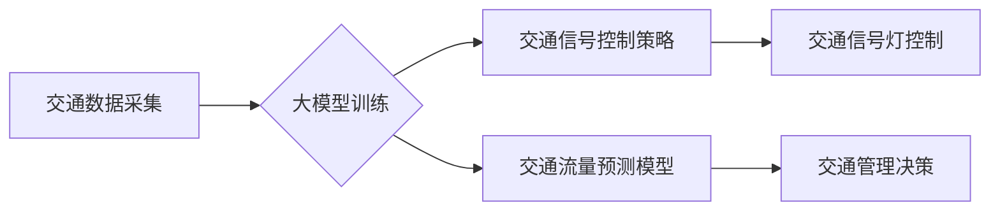

> 大模型，智慧交通，交通信号控制，交通流量预测，深度学习，Transformer，强化学习

## 1. 背景介绍

随着城市化进程的加速和人口的不断增长，交通拥堵已成为全球性难题之一。传统的交通管理方式难以有效应对日益复杂的交通状况，亟需智能化、高效化的解决方案。近年来，大模型技术在自然语言处理、计算机视觉等领域取得了突破性进展，为智慧交通的建设提供了强大的技术支撑。

大模型，是指在海量数据上训练的具有强大泛化能力的深度学习模型。其强大的学习能力和表达能力，能够有效提取交通数据中的复杂模式和规律，为交通信号控制和流量预测提供更精准、更有效的解决方案。

## 2. 核心概念与联系

**2.1 交通信号控制**

交通信号控制是指通过设置交通信号灯，对车辆和行人的通行进行有序调控，以提高道路通行效率、降低交通拥堵和事故发生率。传统的交通信号控制方式通常采用固定时序控制，无法根据实时路况进行动态调整，导致信号灯周期过长或过短，造成交通拥堵。

**2.2 交通流量预测**

交通流量预测是指利用历史交通数据和实时路况信息，预测未来一段时间内的交通流量变化趋势。准确的交通流量预测能够为交通管理部门提供决策依据，优化交通信号控制策略，提高道路通行效率。

**2.3 大模型赋能智慧交通**

大模型能够通过学习海量交通数据，建立交通信号控制和流量预测的数学模型，并根据实时路况信息进行动态调整，实现智能化交通管理。

**2.4 架构图**



## 3. 核心算法原理 & 具体操作步骤

**3.1 算法原理概述**

大模型在交通信号控制和流量预测中的应用主要基于深度学习算法，例如卷积神经网络（CNN）、循环神经网络（RNN）和Transformer等。

* **CNN** 擅长提取图像数据中的特征，可以用于分析交通视频数据，识别车辆类型、速度等信息。
* **RNN** 擅长处理序列数据，可以用于预测交通流量的未来变化趋势。
* **Transformer** 是一种新型的深度学习模型，具有强大的序列建模能力，可以用于处理复杂的交通场景，例如多路交叉口的交通流量预测。

**3.2 算法步骤详解**

1. **数据采集:** 收集交通数据，包括道路摄像头视频、交通传感器数据、GPS轨迹数据等。
2. **数据预处理:** 对收集到的数据进行清洗、格式化、特征提取等处理，使其适合模型训练。
3. **模型训练:** 选择合适的深度学习模型，并利用训练数据进行模型训练，调整模型参数，使其能够准确预测交通流量或优化交通信号控制策略。
4. **模型评估:** 利用测试数据对模型进行评估，评估模型的预测精度和控制效果。
5. **模型部署:** 将训练好的模型部署到实际应用场景中，实时预测交通流量或控制交通信号灯。

**3.3 算法优缺点**

* **优点:** 大模型能够学习复杂的交通模式，提高预测精度和控制效果。
* **缺点:** 大模型训练需要海量数据和强大的计算资源，部署成本较高。

**3.4 算法应用领域**

* **交通信号控制优化:** 根据实时路况信息，动态调整信号灯周期，提高道路通行效率。
* **交通流量预测:** 预测未来一段时间内的交通流量变化趋势，为交通管理部门提供决策依据。
* **交通拥堵缓解:** 通过预测交通拥堵区域，引导车辆避开拥堵路段，缓解交通拥堵。
* **智能驾驶辅助:** 为自动驾驶车辆提供交通信号控制和流量预测信息，辅助车辆安全行驶。

## 4. 数学模型和公式 & 详细讲解 & 举例说明

**4.1 数学模型构建**

交通流量预测模型通常采用时间序列模型，例如ARIMA、SARIMA和Prophet等。这些模型假设交通流量具有时间相关性，即未来流量受过去流量的影响。

**4.2 公式推导过程**

ARIMA模型的公式如下：

$$
y_t = c + \phi_1 y_{t-1} + \phi_2 y_{t-2} + ... + \phi_p y_{t-p} + \theta_1 \epsilon_{t-1} + \theta_2 \epsilon_{t-2} + ... + \theta_q \epsilon_{t-q} + \epsilon_t
$$

其中：

* $y_t$ 表示时间t的流量值
* $c$ 表示截距项
* $\phi_i$ 表示自回归系数
* $\theta_i$ 表示移动平均系数
* $\epsilon_t$ 表示随机误差项

**4.3 案例分析与讲解**

假设我们想要预测某条道路的未来一小时的交通流量。我们可以收集该道路过去一周的交通流量数据，并使用ARIMA模型进行训练。训练完成后，我们可以输入未来一小时的实时路况信息，例如当前时间、天气状况、周边事件等，模型就能预测未来一小时的交通流量。

## 5. 项目实践：代码实例和详细解释说明

**5.1 开发环境搭建**

* 操作系统：Ubuntu 20.04
* Python 版本：3.8
* 深度学习框架：TensorFlow 2.0

**5.2 源代码详细实现**

```python
import tensorflow as tf
from tensorflow.keras.models import Sequential
from tensorflow.keras.layers import LSTM, Dense

# 构建LSTM模型
model = Sequential()
model.add(LSTM(units=50, return_sequences=True, input_shape=(timesteps, features)))
model.add(LSTM(units=50))
model.add(Dense(units=1))

# 编译模型
model.compile(optimizer='adam', loss='mean_squared_error')

# 训练模型
model.fit(X_train, y_train, epochs=100, batch_size=32)

# 预测未来流量
predictions = model.predict(X_test)
```

**5.3 代码解读与分析**

* 首先，我们使用TensorFlow框架构建一个LSTM模型。
* 模型包含两层LSTM层和一层Dense层。
* LSTM层用于处理时间序列数据，Dense层用于输出预测结果。
* 我们使用Adam优化器和均方误差损失函数进行模型训练。
* 训练完成后，我们可以使用模型预测未来流量。

**5.4 运行结果展示**

训练后的模型可以用于预测未来交通流量，并与实际流量进行对比，评估模型的预测精度。

## 6. 实际应用场景

**6.1 交通信号控制优化**

大模型可以根据实时路况信息，动态调整信号灯周期，优化交通流量，减少拥堵。例如，在高峰时段，可以延长绿灯时间，提高车辆通行效率；在非高峰时段，可以缩短绿灯时间，减少车辆等待时间。

**6.2 交通流量预测**

大模型可以预测未来一段时间内的交通流量变化趋势，为交通管理部门提供决策依据。例如，可以预测未来拥堵路段，引导车辆避开拥堵路段，缓解交通拥堵。

**6.3 智能驾驶辅助**

大模型可以为自动驾驶车辆提供交通信号控制和流量预测信息，辅助车辆安全行驶。例如，可以预测前方交通信号灯的变色时间，帮助车辆提前减速或停车。

**6.4 未来应用展望**

随着大模型技术的不断发展，其在智慧交通领域的应用将更加广泛和深入。例如，可以利用大模型实现更加智能化的交通信号控制，例如根据车辆类型、速度等信息进行个性化控制；可以利用大模型预测交通事故发生概率，提前预警和预防事故发生。

## 7. 工具和资源推荐

**7.1 学习资源推荐**

* TensorFlow 官方文档：https://www.tensorflow.org/
* PyTorch 官方文档：https://pytorch.org/
* 深度学习书籍：
    * 深度学习
    * 深度学习实践

**7.2 开发工具推荐**

* Jupyter Notebook
* Google Colab

**7.3 相关论文推荐**

* [Traffic Flow Prediction with Deep Learning](https://arxiv.org/abs/1706.04494)
* [Deep Reinforcement Learning for Traffic Signal Control](https://arxiv.org/abs/1803.03977)

## 8. 总结：未来发展趋势与挑战

**8.1 研究成果总结**

大模型技术在智慧交通领域的应用取得了显著成果，例如交通信号控制优化、交通流量预测等。

**8.2 未来发展趋势**

未来，大模型在智慧交通领域的应用将更加智能化、个性化和融合化。例如，可以利用大模型实现更加智能化的交通信号控制，例如根据车辆类型、速度等信息进行个性化控制；可以利用大模型预测交通事故发生概率，提前预警和预防事故发生。

**8.3 面临的挑战**

大模型在智慧交通领域的应用也面临一些挑战，例如数据安全、模型解释性、部署成本等。

**8.4 研究展望**

未来，需要进一步研究大模型在智慧交通领域的应用，解决上述挑战，推动大模型技术在智慧交通领域的落地应用。

## 9. 附录：常见问题与解答

**9.1 如何选择合适的深度学习模型？**

选择合适的深度学习模型需要根据具体应用场景和数据特点进行选择。例如，对于交通流量预测，可以使用ARIMA、SARIMA或Prophet等时间序列模型；对于交通信号控制优化，可以使用RNN或Transformer等序列建模模型。

**9.2 如何解决数据安全问题？**

在使用大模型进行智慧交通应用时，需要确保数据安全。例如，可以采用数据加密、匿名化等技术保护敏感数据。

**9.3 如何提高模型解释性？**

提高模型解释性可以帮助人们更好地理解模型的决策过程，从而提高模型的信任度。例如，可以使用可解释机器学习（XAI）技术分析模型的决策边界，解释模型的预测结果。


作者：禅与计算机程序设计艺术 / Zen and the Art of Computer Programming 
<end_of_turn>