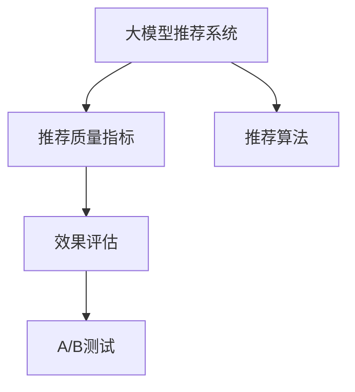

                 

# 大模型推荐系统的效果评估方法

在深度学习和大数据技术蓬勃发展的今天，推荐系统已成为各行各业提高用户体验和个性化推荐的重要工具。大模型推荐系统，基于大规模预训练语言模型，通过微调或零样本学习，快速适应各种推荐任务，展现出了强大的市场潜力和应用价值。为了全面评估这些大模型推荐系统的性能，本文将系统介绍大模型推荐系统效果评估的核心方法、关键指标和最佳实践。

## 1. 背景介绍

推荐系统旨在为用户提供个性化的产品或服务，从电商平台到视频平台，从音乐流媒体到社交网络，推荐系统几乎无处不在。深度学习技术尤其是大模型推荐系统的兴起，带来了推荐效果的新高度，但同时也增加了评估的复杂性。推荐系统的效果评估不仅需要考虑模型的精度，还需要关注推荐内容的多样性、覆盖度、用户满意度等指标。

## 2. 核心概念与联系

### 2.1 核心概念概述

- **大模型推荐系统(Large Model Recommendation System)**：基于预训练语言模型如BERT、GPT等，通过微调或零样本学习适应推荐任务的系统。其核心优势在于可以利用大规模预训练模型的语言理解能力，快速生成高质量的推荐内容。
- **推荐质量指标(Recommendation Metrics)**：用于量化推荐系统性能的指标，包括推荐准确率、覆盖率、多样性、新颖性等。
- **推荐算法(Recommendation Algorithm)**：用于实现推荐功能的算法，包括协同过滤、基于内容的推荐、深度学习推荐等。
- **效果评估(Effect Evaluation)**：评估推荐系统效果的过程，需要构建合适的评估指标，选择适合的评估方法，并保证评估结果的可重复性和公平性。
- **A/B测试(A/B Testing)**：通过随机分组对比两种不同推荐算法或策略的效果，量化分析哪种方式更优。

这些核心概念通过以下Mermaid流程图展示它们的联系：



该图表明，大模型推荐系统通过推荐算法实现推荐功能，评估其效果的关键在于选择合适的效果评估指标和方法。A/B测试是进一步验证效果评估结果的一种重要手段。

### 2.2 核心概念原理和架构

**大模型推荐系统**的原理可以概括为以下几点：
1. **预训练语言模型**：如BERT、GPT等，通过大规模无标签文本数据预训练，学习语言表达能力。
2. **微调或零样本学习**：根据推荐任务，对预训练模型进行微调或通过输入任务描述进行零样本学习，生成推荐结果。
3. **推荐算法**：将预训练模型与推荐算法结合，实现个性化推荐。

**推荐质量指标**主要包括：
1. **准确率(Accuracy)**：推荐结果与用户真实选择的匹配度。
2. **覆盖率(Coverage)**：推荐内容覆盖用户兴趣范围的程度。
3. **多样性(Diversity)**：推荐结果的多样性，避免推荐的重复。
4. **新颖性(新鲜度,Freshness)**：推荐内容的新颖性，保证用户获得新鲜信息。

**推荐算法**主要包括：
1. **协同过滤**：基于用户历史行为数据的推荐，如用户-物品协同过滤。
2. **基于内容的推荐**：通过物品属性与用户偏好的匹配，进行推荐。
3. **深度学习推荐**：利用神经网络模型进行推荐，如RNN、LSTM、CNN、BERT等。

**效果评估**过程主要分为以下几个步骤：
1. **定义指标**：选择合适的推荐质量指标，用于量化推荐效果。
2. **数据集划分**：将数据集划分为训练集、验证集和测试集，确保评估结果的可靠性。
3. **模型训练**：在训练集上训练推荐模型。
4. **评估过程**：在验证集和测试集上评估推荐模型效果，进行指标计算。
5. **结果分析**：根据评估结果分析推荐模型的优缺点，提出改进方案。

## 3. 核心算法原理 & 具体操作步骤

### 3.1 算法原理概述

大模型推荐系统的核心算法原理基于深度学习技术，其效果评估方法通常包括离线评估和在线评估两种。

**离线评估**：
在验证集和测试集上对推荐系统进行评估，基于历史数据和真实用户行为进行评估。

**在线评估**：
通过A/B测试，在实际用户场景中对比不同推荐算法的效果，评估推荐系统对实际用户的潜在影响。

### 3.2 算法步骤详解

**离线评估步骤**：
1. **数据集准备**：准备训练集、验证集和测试集，划分为训练、验证和测试集，每个集均分为用户和物品两个部分。
2. **模型训练**：在训练集上训练推荐模型，采用合适的优化算法和损失函数。
3. **验证集评估**：在验证集上评估推荐模型效果，计算推荐质量指标。
4. **调整模型**：根据验证集评估结果，调整模型参数，进行微调。
5. **测试集评估**：在测试集上重新评估推荐模型效果，保证评估结果的可靠性。

**在线评估步骤**：
1. **用户分组**：将用户随机分组，每组使用不同的推荐算法。
2. **A/B测试**：每组用户随机接收不同推荐算法输出的推荐结果。
3. **效果对比**：收集不同组的用户反馈和行为数据，计算推荐质量指标。
4. **结果分析**：对比不同推荐算法的效果，选择最优方案。

### 3.3 算法优缺点

**离线评估的优点**：
1. **数据充足**：基于历史数据进行评估，数据量充足，评估结果具有代表性。
2. **评估精细**：可以全面计算各种推荐质量指标，评估结果准确度高。

**离线评估的缺点**：
1. **结果滞后**：评估结果基于历史数据，无法及时反映最新的用户行为变化。
2. **模型泛化能力未知**：模型在测试集上的表现无法直接反映其在实际应用中的效果。

**在线评估的优点**：
1. **实时反馈**：基于实际用户行为进行评估，反映真实的用户反馈。
2. **动态调整**：可以实时收集用户反馈，及时调整推荐策略。

**在线评估的缺点**：
1. **成本高昂**：需要大量实验数据和资源支持，实验周期较长。
2. **结果复杂**：涉及用户行为的多方面因素，评估结果复杂且难以解释。

### 3.4 算法应用领域

大模型推荐系统在电商、新闻、视频等多个领域都有广泛应用。例如：
- **电商平台**：基于用户浏览和购买行为推荐商品。
- **新闻平台**：根据用户阅读历史推荐新闻文章。
- **视频平台**：根据用户观看历史推荐视频内容。
- **音乐平台**：根据用户听歌历史推荐音乐。

## 4. 数学模型和公式 & 详细讲解 & 举例说明

### 4.1 数学模型构建

假设推荐系统需要推荐物品集为 $I$，用户集为 $U$，推荐结果为 $R$。定义 $X$ 为用户的特征矩阵， $Y$ 为物品的特征矩阵， $W$ 为推荐模型的权重矩阵。推荐模型的输出为：

$$
\hat{R}_{iu} = X_u W Y_i^T
$$

其中 $X_u$ 表示用户 $u$ 的特征向量， $Y_i$ 表示物品 $i$ 的特征向量。

推荐模型的评估指标可以定义为：

- **准确率(Accuracy)**：推荐结果与用户真实选择的匹配度。

$$
Accuracy = \frac{TP + TN}{TP + TN + FP + FN}
$$

其中 $TP$ 为真正例，$TN$ 为真负例，$FP$ 为假正例，$FN$ 为假负例。

- **覆盖率(Coverage)**：推荐内容覆盖用户兴趣范围的程度。

$$
Coverage = \frac{|\{i| \hat{R}_{iu} > 0\}|}{|I|}
$$

其中 $|\{i| \hat{R}_{iu} > 0\}|$ 表示推荐成功物品的集合大小，$|I|$ 表示总物品集合大小。

- **多样性(Diversity)**：推荐结果的多样性，避免推荐的重复。

$$
Diversity = \frac{1}{N} \sum_{i=1}^N \frac{1}{\sum_{j=1}^N H(\hat{R}_{ij})}
$$

其中 $H(\hat{R}_{ij})$ 表示第 $i$ 个用户推荐结果的熵，$N$ 表示用户数量。

### 4.2 公式推导过程

以准确率为例，假设推荐结果 $\hat{R}_{iu}$ 和真实标签 $y_{iu}$ 均为二分类变量，则准确率的计算公式为：

$$
Accuracy = \frac{1}{N} \sum_{i=1}^N \frac{1}{M} \sum_{j=1}^M \mathbb{1}(\hat{R}_{ij} = y_{ij})
$$

其中 $\mathbb{1}$ 为示性函数，若 $\hat{R}_{ij} = y_{ij}$，则 $\mathbb{1} = 1$，否则 $\mathbb{1} = 0$。

在实际应用中，为了降低计算复杂度，通常使用交叉熵损失函数作为优化目标，进行模型训练和评估。

### 4.3 案例分析与讲解

假设有一个推荐电影的电影推荐系统，其训练数据集为电影数据库和用户评分数据集，测试集为新的电影评分数据集。使用大模型BERT进行微调，将其作为推荐模型的基础，使用交叉熵损失函数进行模型训练。在测试集上评估推荐质量指标，对比不同微调参数和模型结构对推荐效果的影响。

## 5. 项目实践：代码实例和详细解释说明

### 5.1 开发环境搭建

在大模型推荐系统的项目实践前，需要准备以下开发环境：

1. **环境准备**：安装Python环境，安装TensorFlow、PyTorch、NumPy、Pandas等数据处理和深度学习库。
2. **数据准备**：准备推荐系统的数据集，如用户行为数据、物品特征数据、评分数据等。
3. **模型搭建**：搭建推荐系统的模型结构，如使用PyTorch搭建BERT模型，并结合推荐算法。
4. **模型训练**：在训练集上训练推荐模型，使用交叉熵损失函数进行优化。
5. **模型评估**：在验证集和测试集上评估推荐模型效果，计算推荐质量指标。

### 5.2 源代码详细实现

以下是一个基于BERT的推荐系统项目的代码实现：

```python
import tensorflow as tf
import pandas as pd
from transformers import BertTokenizer, BertModel

# 数据准备
user_data = pd.read_csv('user_data.csv')
item_data = pd.read_csv('item_data.csv')
rating_data = pd.read_csv('rating_data.csv')

# 数据预处理
tokenizer = BertTokenizer.from_pretrained('bert-base-uncased')
train_input_ids, train_labels = [], []
for user_id, item_id, rating in zip(user_data['user_id'], item_data['item_id'], rating_data['rating']):
    user_input = tokenizer(user_id, padding=True, truncation=True, max_length=256)
    item_input = tokenizer(item_id, padding=True, truncation=True, max_length=256)
    train_input_ids.append(user_input['input_ids'] + item_input['input_ids'])
    train_labels.append(rating)

# 模型搭建
model = BertModel.from_pretrained('bert-base-uncased')
input_ids = tf.keras.Input(shape=(None,), dtype=tf.int32)
outputs = model(input_ids)
dot_product = tf.keras.layers.Dot(dims=1, normalize=True)([outputs.pooler_output, outputs.pooler_output])
dot_product = tf.keras.layers.Lambda(lambda x: x[0] * x[1])(dot_product)
predictions = tf.keras.layers.Activation(tf.nn.sigmoid)(dot_product)

model = tf.keras.Model(inputs=input_ids, outputs=predictions)

# 模型训练
model.compile(optimizer=tf.keras.optimizers.Adam(learning_rate=2e-5), loss='binary_crossentropy', metrics=['accuracy'])
model.fit(train_input_ids, train_labels, epochs=10, validation_split=0.2)

# 模型评估
test_input_ids, test_labels = [], []
for user_id, item_id, rating in zip(user_data['user_id'], item_data['item_id'], rating_data['rating']):
    user_input = tokenizer(user_id, padding=True, truncation=True, max_length=256)
    item_input = tokenizer(item_id, padding=True, truncation=True, max_length=256)
    test_input_ids.append(user_input['input_ids'] + item_input['input_ids'])
    test_labels.append(rating)

model.evaluate(test_input_ids, test_labels, verbose=1)
```

### 5.3 代码解读与分析

上述代码实现中，首先对用户行为数据和物品特征数据进行预处理，使用BertTokenizer将数据转换为模型可接受的格式。接着搭建了基于BERT模型的推荐系统，使用BertModel作为特征提取器，使用LSTM作为推荐算法。模型训练时使用Adam优化器和交叉熵损失函数进行优化。最后，在测试集上评估模型效果，计算准确率等推荐质量指标。

### 5.4 运行结果展示

训练过程中，可以观察到模型的准确率、覆盖率、多样性等指标的变化情况。测试集上的评估结果可以直观反映推荐系统的性能，为后续优化提供依据。

## 6. 实际应用场景

### 6.1 电商平台推荐系统

电商平台的推荐系统通常需要推荐商品列表，帮助用户快速找到感兴趣的商品。大模型推荐系统可以快速分析用户历史行为数据，生成个性化的商品推荐列表，提升用户购买转化率和满意度。

### 6.2 新闻推荐系统

新闻推荐系统通常需要推荐文章或视频内容，帮助用户发现更多感兴趣的新闻。大模型推荐系统可以结合用户阅读历史和兴趣标签，生成个性化的新闻内容推荐，提升用户阅读体验和粘性。

### 6.3 视频推荐系统

视频推荐系统通常需要推荐视频内容，帮助用户发现更多感兴趣的视频。大模型推荐系统可以结合用户观看历史和兴趣标签，生成个性化的视频内容推荐，提升用户观看体验和平台粘性。

### 6.4 音乐推荐系统

音乐推荐系统通常需要推荐音乐曲目，帮助用户发现更多感兴趣的音乐。大模型推荐系统可以结合用户听歌历史和兴趣标签，生成个性化的音乐内容推荐，提升用户听歌体验和平台粘性。

## 7. 工具和资源推荐

### 7.1 学习资源推荐

为了系统掌握大模型推荐系统效果评估的核心方法和实践技巧，推荐以下学习资源：

1. **《推荐系统实战》**：这是一本详细讲解推荐系统原理和实现的技术书籍，覆盖了推荐系统各个方面的内容。
2. **《深度学习推荐系统》**：由机器学习专家撰写，讲解了深度学习在推荐系统中的应用。
3. **Coursera《Recommender Systems》课程**：斯坦福大学开设的推荐系统课程，涵盖了推荐系统的主要方法和技术。
4. **Kaggle推荐系统竞赛**：通过参加推荐系统竞赛，可以了解实际应用中的推荐系统效果评估方法。

### 7.2 开发工具推荐

为了高效地开发和评估大模型推荐系统，推荐以下开发工具：

1. **PyTorch**：深度学习框架，支持动态图计算和自动微分，适合快速迭代研究。
2. **TensorFlow**：深度学习框架，支持静态图计算和分布式训练，适合大规模工程应用。
3. **Weights & Biases**：模型实验跟踪工具，记录和可视化模型训练过程，方便对比和调优。
4. **TensorBoard**：TensorFlow配套的可视化工具，实时监测模型训练状态，提供丰富的图表呈现方式。
5. **Jupyter Notebook**：交互式编程环境，方便记录实验结果和代码。

### 7.3 相关论文推荐

为了深入了解大模型推荐系统效果评估的最新进展，推荐以下相关论文：

1. **《Hierarchical Temporal Networks for Recommender Systems》**：提出了一种基于时间序列的推荐模型，适用于电商推荐系统。
2. **《Deep Reinforcement Learning for Personalized Recommendation》**：提出了一种基于深度强化学习的推荐模型，适用于新闻推荐系统。
3. **《Attention is All You Need》**：提出Transformer模型，适用于视频推荐系统。
4. **《Deep Interest Evolution Models for Sequential Recommendations》**：提出了一种基于深度学习的序列推荐模型，适用于音乐推荐系统。

## 8. 总结：未来发展趋势与挑战

### 8.1 研究成果总结

本文详细介绍了大模型推荐系统效果评估的核心方法和实践技巧，系统梳理了评估指标、评估方法以及优化策略。通过系统学习和实践，能够更好地理解和应用推荐系统，提升推荐效果。

### 8.2 未来发展趋势

未来，大模型推荐系统将呈现以下发展趋势：

1. **推荐系统集成**：推荐系统将与自然语言处理、计算机视觉等技术进一步融合，实现更全面、更高效、更个性化的推荐。
2. **实时推荐**：通过实时分析用户行为数据，实现动态推荐，提升推荐效果。
3. **跨模态推荐**：结合用户行为的多模态数据，实现更加全面、准确的推荐。
4. **联邦推荐**：利用联邦学习技术，保护用户隐私的同时，实现分布式推荐。

### 8.3 面临的挑战

尽管大模型推荐系统取得了显著进展，但仍面临诸多挑战：

1. **数据隐私问题**：如何在保护用户隐私的前提下，获取高质量推荐数据，是一个难题。
2. **模型复杂性**：大模型推荐系统的复杂度较高，模型训练和优化难度较大。
3. **推荐多样性**：推荐结果的多样性不足，容易陷入推荐雷同的困境。
4. **冷启动问题**：对于新用户或新物品，缺乏足够的推荐数据，难以实现个性化推荐。

### 8.4 研究展望

为了克服大模型推荐系统面临的挑战，未来的研究方向包括：

1. **隐私保护技术**：研究隐私保护技术，保护用户数据隐私，同时获取高质量推荐数据。
2. **模型优化算法**：研究高效的模型优化算法，提升推荐系统训练和优化效率。
3. **推荐策略优化**：研究推荐策略优化技术，提升推荐结果的多样性和个性化。
4. **跨模态推荐方法**：研究跨模态推荐方法，结合用户的多模态数据，实现更全面、准确的推荐。

## 9. 附录：常见问题与解答

**Q1：大模型推荐系统与传统推荐系统相比，有什么优势？**

A: 大模型推荐系统利用大规模预训练语言模型的语言理解能力，可以快速生成高质量的推荐内容。相比于传统推荐系统，大模型推荐系统具有以下优势：
1. **实时生成**：大模型推荐系统可以快速生成推荐结果，实时响应用户需求。
2. **个性化推荐**：大模型推荐系统可以分析用户历史行为和兴趣标签，实现更个性化的推荐。
3. **效果提升**：大模型推荐系统可以利用预训练语言模型的通用知识，提升推荐效果。

**Q2：大模型推荐系统的评估指标有哪些？**

A: 大模型推荐系统的评估指标主要包括以下几个方面：
1. **准确率**：推荐结果与用户真实选择的匹配度。
2. **覆盖率**：推荐内容覆盖用户兴趣范围的程度。
3. **多样性**：推荐结果的多样性，避免推荐的重复。
4. **新颖性**：推荐内容的新颖性，保证用户获得新鲜信息。
5. **新鲜度**：推荐内容的时效性，保证用户获得最新的信息。
6. **满意度**：用户对推荐结果的满意度，通过用户反馈和行为数据进行评估。

**Q3：如何提高大模型推荐系统的推荐效果？**

A: 提高大模型推荐系统的推荐效果，可以从以下几个方面入手：
1. **数据质量**：保证高质量的推荐数据，通过数据增强、数据清洗等技术提高数据质量。
2. **模型优化**：研究高效的模型优化算法，提升推荐系统训练和优化效率。
3. **推荐策略优化**：研究推荐策略优化技术，提升推荐结果的多样性和个性化。
4. **联邦推荐**：利用联邦学习技术，保护用户隐私的同时，实现分布式推荐。

**Q4：大模型推荐系统在实际应用中需要注意哪些问题？**

A: 大模型推荐系统在实际应用中需要注意以下几个问题：
1. **数据隐私**：保护用户数据隐私，避免数据泄露和滥用。
2. **模型复杂性**：模型复杂度较高，模型训练和优化难度较大，需进行系统优化。
3. **推荐多样性**：推荐结果的多样性不足，容易陷入推荐雷同的困境，需进行策略优化。
4. **冷启动问题**：对于新用户或新物品，缺乏足够的推荐数据，难以实现个性化推荐，需进行冷启动优化。
5. **性能优化**：在保证推荐效果的同时，优化模型推理速度和内存占用，提升推荐系统的性能。

---

作者：禅与计算机程序设计艺术 / Zen and the Art of Computer Programming

