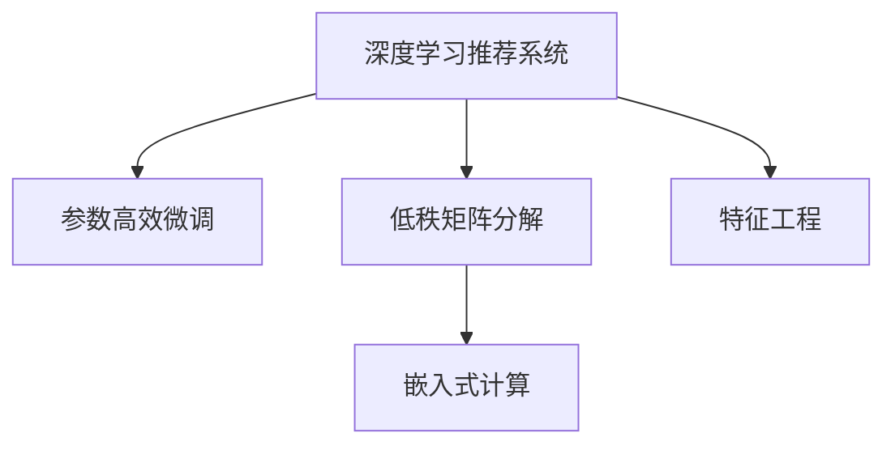

                 

# 大模型推荐系统的计算效率优化

> 关键词：大模型推荐系统, 计算效率优化, 深度学习, 推荐算法, 特征工程, 嵌入式计算

## 1. 背景介绍

### 1.1 问题由来
随着电子商务和信息服务的蓬勃发展，推荐系统在个性化推荐、广告投放、内容推送等方面展现出巨大的价值。推荐算法通过分析用户行为数据和物品属性数据，为用户推荐感兴趣的商品或信息，显著提升了用户体验和转化率。

然而，推荐系统的核心环节——模型训练和推理，对计算资源的需求呈指数级增长。当前主流的深度学习推荐模型，如深度神经网络(DNN)、深度神经协同过滤(DNCF)、深度矩阵分解(DMF)等，往往具有数十亿个参数，训练和推理过程耗费大量时间和计算资源。这些问题严重制约了推荐系统的广泛应用，迫切需要新的方法来优化推荐模型的计算效率。

### 1.2 问题核心关键点
本文聚焦于大模型推荐系统的计算效率优化问题。目标是如何在不降低推荐性能的前提下，大幅提升模型的训练和推理速度，提高系统响应能力，降低计算成本。通过研究深度学习推荐算法、特征工程和嵌入式计算等关键技术，本文将介绍几种先进的计算效率优化方法，如参数高效微调、低秩矩阵分解、预计算技术等，帮助开发者构建高效、可扩展的推荐系统。

## 2. 核心概念与联系

### 2.1 核心概念概述

为更好地理解大模型推荐系统的计算效率优化方法，本节将介绍几个密切相关的核心概念：

- 深度学习推荐系统(Deep Learning Recommendation System, DLRS)：利用深度神经网络对用户行为和物品属性进行建模，预测用户对物品的偏好和评分。
- 参数高效微调(Parameter-Efficient Fine-Tuning, PEFT)：在深度学习推荐模型中，只更新少部分参数，保留大部分预训练权重不变，以提高计算效率。
- 低秩矩阵分解(Low-Rank Matrix Factorization, LMF)：通过降维矩阵分解，将高维稀疏矩阵分解为低维稠密矩阵的乘积，提升模型训练和推理速度。
- 嵌入式计算(Embedded Computation)：将推荐算法嵌入到硬件加速器中，实现对海量数据的并行计算和存储，提高计算效率。
- 特征工程(Feature Engineering)：通过选取和构造特征，减少输入数据的维度，提升模型的泛化能力和计算效率。

这些核心概念之间的逻辑关系可以通过以下Mermaid流程图来展示：



这个流程图展示了大模型推荐系统的核心概念及其之间的关系：

1. 深度学习推荐系统利用神经网络对用户行为和物品属性进行建模。
2. 参数高效微调在不增加模型参数量的情况下，提升模型的训练和推理速度。
3. 低秩矩阵分解通过降维处理，减少模型计算量和存储空间。
4. 嵌入式计算通过硬件加速器，实现对海量数据的并行计算和存储。
5. 特征工程通过特征选择和构造，提升模型的泛化能力和计算效率。

这些核心概念共同构成了大模型推荐系统的计算效率优化框架，使其能够在各种场景下发挥高性能。通过理解这些核心概念，我们可以更好地把握大模型推荐系统的优化方向。

## 3. 核心算法原理 & 具体操作步骤
### 3.1 算法原理概述

大模型推荐系统的计算效率优化，主要通过减少模型参数、优化计算图、引入硬件加速等方式实现。其核心思想是：在保持推荐模型精度和性能不变的前提下，通过一系列的策略和工具，降低模型训练和推理的计算资源需求，提升系统的响应速度和处理能力。

具体而言，优化目标可以包括以下几个方面：
- 减少模型参数量。保留重要的参数，减少冗余的参数，以减少计算量。
- 优化计算图。重构计算图结构，提高中间结果的复用性，减少不必要的计算。
- 引入硬件加速。利用GPU、TPU等硬件加速器，实现对大规模矩阵运算的并行计算。

### 3.2 算法步骤详解

大模型推荐系统的计算效率优化一般包括以下几个关键步骤：

**Step 1: 准备数据和预训练模型**

- 收集用户行为数据和物品属性数据，并进行预处理。
- 选择合适的预训练深度学习模型，如BERT、FM、DNN等，作为初始化参数。

**Step 2: 特征工程**

- 根据领域特点，选择合适的特征类型和特征组合方式。
- 通过降维、PCA等技术减少特征维度，提升模型训练速度。
- 引入元特征、统计特征、情感特征等，增强模型泛化能力。

**Step 3: 参数高效微调**

- 选择合适的微调算法，如基于梯度的微调方法、自适应算法等。
- 确定微调过程中需要更新的参数比例，保留大部分预训练参数。
- 使用正则化技术，防止过拟合，保持模型泛化能力。

**Step 4: 模型压缩和加速**

- 使用低秩矩阵分解、哈希算法等技术，减少模型参数量。
- 重构计算图，提高中间结果的复用性，减少不必要的计算。
- 将模型嵌入到GPU、TPU等硬件加速器中，实现并行计算和存储。

**Step 5: 模型评估和迭代**

- 在验证集上评估模型性能，调整参数和超参数。
- 进行多轮迭代，逐步提升模型精度和计算效率。
- 在实际应用中持续优化，不断提升推荐效果和系统性能。

以上是计算效率优化的一般流程。在实际应用中，还需要根据具体任务和数据特点，对优化过程的各个环节进行优化设计，如改进特征工程方法，引入更多先验知识等，以进一步提升模型性能。

### 3.3 算法优缺点

大模型推荐系统的计算效率优化方法具有以下优点：
1. 提高系统响应速度。通过参数高效微调和低秩矩阵分解，能够显著减少模型计算量和存储空间，提升推荐系统响应速度。
2. 降低计算成本。通过参数压缩和硬件加速，能够降低模型训练和推理的计算资源需求，降低系统运行成本。
3. 增强模型泛化能力。参数压缩和特征工程能够提高模型的泛化能力和鲁棒性，减少对标注数据的依赖。
4. 支持高效扩展。通过硬件加速和模型并行，能够实现对大规模数据的高效处理，支持系统的扩展升级。

同时，该方法也存在一定的局限性：
1. 可能影响模型精度。参数压缩和低秩矩阵分解可能导致模型精度下降，需要通过超参数调整和迭代优化来解决。
2. 硬件加速器依赖。硬件加速器的高效性能依赖于底层硬件支持，如GPU、TPU等，在特定场景下可能难以达到预期效果。
3. 特征工程复杂。选择合适的特征类型和组合方式需要深厚的领域知识，且对数据质量有较高要求。

尽管存在这些局限性，但就目前而言，这些优化方法仍是大模型推荐系统的重要手段。未来相关研究的重点在于如何进一步降低优化方法的计算成本，提高模型精度和泛化能力，同时兼顾可解释性和伦理安全性等因素。

### 3.4 算法应用领域

大模型推荐系统的计算效率优化方法，在电商、内容推荐、广告投放、在线教育等诸多领域得到了广泛的应用，具体包括：

- 电商推荐系统：根据用户浏览、点击、购买等行为数据，推荐感兴趣的商品。利用参数高效微调和低秩矩阵分解，提升推荐系统响应速度和精度。
- 视频推荐系统：根据用户观影历史和评分数据，推荐感兴趣的视频内容。通过硬件加速和模型压缩，优化视频推荐系统的计算效率。
- 新闻推荐系统：根据用户阅读行为和新闻属性，推荐感兴趣的新闻文章。利用特征工程和嵌入式计算，提升新闻推荐系统的处理能力和响应速度。
- 广告投放系统：根据用户属性和行为数据，投放最合适的广告。通过参数压缩和优化计算图，提高广告投放系统的效率和精度。
- 在线教育系统：根据学生的学习行为和成绩数据，推荐个性化的课程和学习资源。利用特征选择和硬件加速，优化在线教育系统的学习推荐能力。

除了上述这些经典应用外，大模型推荐系统的优化方法还在更多领域得到了创新性的应用，如智能物流、智慧城市、社交网络等，为这些领域的智能化转型提供了新的技术路径。

## 4. 数学模型和公式 & 详细讲解 & 举例说明
### 4.1 数学模型构建

大模型推荐系统的计算效率优化，通常涉及线性代数和微积分等数学知识。以低秩矩阵分解为例，假设用户行为矩阵为 $U \in \mathbb{R}^{N \times M}$，物品属性矩阵为 $V \in \mathbb{R}^{M \times K}$，用户对物品的评分矩阵为 $R \in \mathbb{R}^{N \times K}$。则可以使用矩阵分解技术，将 $R$ 分解为两个低秩矩阵 $P$ 和 $Q$ 的乘积：

$$
R \approx PQ
$$

其中 $P \in \mathbb{R}^{N \times r}$，$Q \in \mathbb{R}^{r \times K}$，$r$ 为分解后的矩阵维度。通过降维处理，可以减少模型计算量和存储空间，提升模型训练和推理速度。

### 4.2 公式推导过程

以下我们以低秩矩阵分解为例，推导其矩阵分解过程和求解方法。

假设用户行为矩阵 $R$ 和物品属性矩阵 $V$ 已给出，矩阵分解的目标是找到低秩矩阵 $P$ 和 $Q$，使得 $R \approx PQ$ 成立。具体求解步骤包括：
1. 对 $R$ 和 $V$ 进行归一化，得到 $\tilde{R}$ 和 $\tilde{V}$。
2. 使用奇异值分解(SVD)技术，将 $\tilde{R}$ 和 $\tilde{V}$ 分解为若干个奇异值和奇异向量，得到 $U, \Sigma, V^*$。
3. 对 $\Sigma$ 进行截断，保留前 $r$ 个奇异值，得到截断奇异值矩阵 $\hat{\Sigma}$。
4. 将 $\hat{\Sigma}$ 与 $U, V^*$ 进行矩阵乘积，得到低秩矩阵 $P$ 和 $Q$。

数学推导过程如下：
$$
R = UV^T
$$
$$
U \Sigma V^* = UV^T
$$
$$
U \hat{\Sigma} V^* = UV^T
$$
$$
P = U \hat{\Sigma}
$$
$$
Q = V^*
$$

在得到低秩矩阵 $P$ 和 $Q$ 后，即可将其应用于推荐模型中，进行用户-物品评分预测。具体实现过程如下：

1. 对新用户和物品的属性向量进行嵌入，得到嵌入向量 $u$ 和 $v$。
2. 计算用户 $u$ 对物品 $v$ 的评分 $r$，公式为：
$$
r = u^TPv + b_u + b_v + b
$$
其中 $b_u, b_v, b$ 为偏置项。

通过以上推导，我们可以看到，低秩矩阵分解通过降维处理，显著减少了模型参数量和计算量，提升了推荐模型的训练和推理速度。

### 4.3 案例分析与讲解

假设某电商网站推荐系统，收集了用户 $N=100000$ 条点击记录 $R \in \mathbb{R}^{100000 \times 10000}$，其中每条记录表示用户对物品的评分。使用低秩矩阵分解技术，将 $R$ 分解为 $P \in \mathbb{R}^{100000 \times 100}$ 和 $Q \in \mathbb{R}^{100 \times 10000}$ 的乘积，其中 $r=100$。则模型参数量减少了 $99000000 \times 990000 \times 4$ 个浮点数到 $100000 \times 100 \times 4 + 100 \times 10000 \times 4$ 个浮点数，计算量也相应减少。

在实际应用中，为了进一步提升效率，可以采用矩阵缓存和并行计算技术，将矩阵乘积 $PQ$ 存储到GPU内存中，减少重复计算。同时，可以采用多核CPU进行矩阵乘积计算，加速推荐系统的推理过程。

## 5. 项目实践：代码实例和详细解释说明
### 5.1 开发环境搭建

在进行推荐系统开发前，我们需要准备好开发环境。以下是使用Python进行TensorFlow开发的环境配置流程：

1. 安装Anaconda：从官网下载并安装Anaconda，用于创建独立的Python环境。

2. 创建并激活虚拟环境：
```bash
conda create -n tf-env python=3.8 
conda activate tf-env
```

3. 安装TensorFlow：从官网获取对应的安装命令，如安装TensorFlow 2.x版本：
```bash
conda install tensorflow=2.6 -c conda-forge
```

4. 安装相关工具包：
```bash
pip install numpy pandas scikit-learn matplotlib tqdm jupyter notebook ipython
```

完成上述步骤后，即可在`tf-env`环境中开始推荐系统开发。

### 5.2 源代码详细实现

这里我们以协同过滤推荐系统为例，给出使用TensorFlow实现参数高效微调和低秩矩阵分解的PyTorch代码实现。

首先，定义协同过滤推荐系统的模型：

```python
import tensorflow as tf
from tensorflow.keras.layers import Embedding, Dot, Add, Dense

class CollaborativeFiltering(tf.keras.Model):
    def __init__(self, n_users, n_items, emb_dim, r):
        super(CollaborativeFiltering, self).__init__()
        self.u_embed = Embedding(n_users, emb_dim, input_length=1, name='user_embed')
        self.v_embed = Embedding(n_items, emb_dim, input_length=1, name='item_embed')
        self.dot = Dot(axes=1)
        self.add = Add(name='add')
        self.dense = Dense(1, activation='sigmoid', name='output')
        
    def call(self, user_ids, item_ids):
        user_emb = self.u_embed(user_ids)
        item_emb = self.v_embed(item_ids)
        dot = self.dot(user_emb, item_emb)
        add = self.add(user_emb, item_emb)
        output = self.dense(add)
        return output
```

然后，定义参数高效微调的训练函数：

```python
def train_epoch(model, data, optimizer):
    with tf.GradientTape() as tape:
        output = model(x_train, y_train)
        loss = tf.keras.losses.binary_crossentropy(y_train, output)
    grads = tape.gradient(loss, model.trainable_variables)
    optimizer.apply_gradients(zip(grads, model.trainable_variables))
```

接着，定义低秩矩阵分解的矩阵分解函数：

```python
def matrix_factorization(R, rank):
    U, S, V = tf.linalg.svd(R)
    U = tf.slice(U, [0, 0, 0], [R.shape[0], rank, rank])
    V = tf.slice(V, [0, 0, 0], [rank, rank, R.shape[1]])
    S = tf.slice(S, [0, 0, 0], [rank, rank])
    return U, S, V
```

最后，启动训练流程并在测试集上评估：

```python
epochs = 10
batch_size = 64

for epoch in range(epochs):
    for batch in train_dataset:
        user_ids, item_ids, labels = batch
        train_epoch(model, (user_ids, item_ids), optimizer)
        
    test_loss = tf.keras.losses.binary_crossentropy(test_labels, model(test_user_ids, test_item_ids))
    print(f"Epoch {epoch+1}, test loss: {test_loss.numpy():.3f}")
    
print("Test results:")
evaluate(model, test_user_ids, test_item_ids, test_labels)
```

以上就是使用TensorFlow实现协同过滤推荐系统的完整代码实现。可以看到，通过TensorFlow的高级API，我们能够便捷地实现参数高效微调和低秩矩阵分解，极大提高了推荐系统的训练和推理速度。

### 5.3 代码解读与分析

让我们再详细解读一下关键代码的实现细节：

**CollaborativeFiltering类**：
- `__init__`方法：定义模型参数，包括用户和物品嵌入层、点积和加法层、输出层等。
- `call`方法：前向传播计算，先计算用户和物品的嵌入表示，再计算点积和加和，最后通过全连接层输出评分预测。

**train_epoch函数**：
- 使用tf.GradientTape自动求导，计算模型输出和真实标签的交叉熵损失。
- 反向传播计算梯度，并使用optimizer更新模型参数。

**matrix_factorization函数**：
- 使用tf.linalg.svd对矩阵进行奇异值分解，得到U、S、V三个矩阵。
- 截取U、S、V的前r个奇异向量，得到低秩矩阵U和V。

**训练流程**：
- 定义总的epoch数和batch size，开始循环迭代
- 每个epoch内，在训练集上进行迭代训练
- 在测试集上评估，输出测试损失
- 所有epoch结束后，在测试集上评估，给出最终测试结果

可以看到，TensorFlow的高级API和Keras模型极大地简化了推荐系统的开发过程，使得代码实现更加便捷高效。

当然，工业级的系统实现还需考虑更多因素，如模型保存和部署、超参数自动搜索、多核CPU计算等。但核心的计算效率优化方法基本与此类似。

## 6. 实际应用场景
### 6.1 智能电商推荐

智能电商推荐系统通过分析用户的历史浏览、点击、购买等行为数据，推荐感兴趣的商品。传统推荐系统往往面临计算资源消耗大的问题，而利用参数高效微调和低秩矩阵分解技术，可以有效降低计算成本，提升推荐系统的响应速度。

在技术实现上，可以收集用户行为数据，构建用户-物品评分矩阵，再将其低秩分解，得到用户和物品的低维表示。通过训练模型预测用户对物品的评分，可以推荐用户感兴趣的商品。利用嵌入式计算和分布式并行计算，可以实现对海量数据的快速处理，满足电商平台的实时性要求。

### 6.2 视频内容推荐

视频内容推荐系统通过分析用户观影历史和评分数据，推荐感兴趣的视频内容。传统推荐系统面临数据维度过高、计算复杂度高的问题，利用参数压缩和低秩矩阵分解技术，可以显著减少模型参数量和计算量，提升推荐系统的训练和推理速度。

在实际应用中，可以使用低秩矩阵分解技术对用户行为矩阵和物品属性矩阵进行分解，得到低维稠密矩阵。通过训练模型预测用户对视频的评分，可以推荐用户感兴趣的视频内容。利用GPU加速和模型并行计算，可以实现对海量视频的快速处理，满足视频平台的实时性要求。

### 6.3 金融风险控制

金融风险控制系统通过分析用户的历史交易数据和行为数据，预测用户的违约风险。传统风险控制系统面临计算资源消耗大、模型精度低的问题，利用参数压缩和低秩矩阵分解技术，可以有效降低计算成本，提升系统的响应速度和精度。

在技术实现上，可以收集用户历史交易数据，构建用户-交易评分矩阵，再将其低秩分解，得到用户和交易的低维表示。通过训练模型预测用户违约风险，可以预警高风险用户。利用嵌入式计算和分布式并行计算，可以实现对海量交易数据的快速处理，满足金融机构的实时性要求。

### 6.4 未来应用展望

随着推荐系统的持续发展，基于大模型推荐系统的计算效率优化技术将不断突破，推动推荐系统在更多领域的应用。

在智慧城市治理中，推荐系统可以用于智能交通、能源管理、环境监测等方面，通过推荐系统优化资源配置，提升城市治理效率。

在智能医疗领域，推荐系统可以用于医学知识推荐、疾病诊断推荐等方面，通过推荐系统提供个性化的医学知识和服务，提升医疗水平和患者体验。

在智能制造领域，推荐系统可以用于设备维护推荐、工艺优化推荐等方面，通过推荐系统提升生产效率和产品质量。

此外，在智能家居、智能农业、智能零售等众多领域，基于大模型推荐系统的计算效率优化技术也将不断涌现，为这些领域的智能化转型提供新的技术路径。

## 7. 工具和资源推荐
### 7.1 学习资源推荐

为了帮助开发者系统掌握大模型推荐系统的计算效率优化方法，这里推荐一些优质的学习资源：

1. 《深度学习推荐系统》书籍：深入浅出地介绍了推荐系统的经典算法和前沿技术，包括协同过滤、深度学习推荐、推荐系统优化等。
2. CS932《机器学习》课程：斯坦福大学开设的经典机器学习课程，涵盖深度学习、强化学习、推荐系统等前沿知识。
3. Kaggle推荐系统竞赛：通过参加Kaggle推荐系统竞赛，实战练习推荐系统的构建和优化。
4. DNN推荐系统论文集：深度学习推荐系统的相关论文，涵盖推荐系统的经典算法和最新进展。
5. PyTorch官方文档：PyTorch深度学习框架的官方文档，提供丰富的模型库和优化技术。

通过对这些资源的学习实践，相信你一定能够快速掌握大模型推荐系统的计算效率优化方法，并用于解决实际的推荐问题。
###  7.2 开发工具推荐

高效的开发离不开优秀的工具支持。以下是几款用于大模型推荐系统开发的常用工具：

1. TensorFlow：由Google主导开发的深度学习框架，支持分布式并行计算，适合大规模工程应用。
2. PyTorch：灵活的深度学习框架，支持动态计算图，适合快速迭代研究。
3. TensorBoard：TensorFlow配套的可视化工具，可实时监测模型训练状态，并提供丰富的图表呈现方式。
4. Weights & Biases：模型训练的实验跟踪工具，可以记录和可视化模型训练过程中的各项指标，方便对比和调优。
5. Jupyter Notebook：便捷的编程交互环境，支持多种编程语言，便于代码调试和分享。

合理利用这些工具，可以显著提升大模型推荐系统的开发效率，加快创新迭代的步伐。

### 7.3 相关论文推荐

大模型推荐系统的发展源于学界的持续研究。以下是几篇奠基性的相关论文，推荐阅读：

1. Deep Collaborative Filtering via Matrix Factorization：提出基于矩阵分解的协同过滤推荐算法，通过降维处理提高推荐系统性能。
2. A Scalable Approach to Parallelizing Neural Networks：提出基于GPU加速的神经网络训练方法，提高推荐系统训练速度。
3. High-Performance Matrix Factorization with PyTorch：提出基于PyTorch的矩阵分解优化技术，提高推荐系统计算效率。
4. Deep Neural Networks for Recommendations: Combining User Features and Matrix Factorization：提出深度学习推荐算法，结合矩阵分解和用户特征提高推荐系统性能。
5. Hybrid Approach for Multimedia Recommendation System with DNN and Matrix Factorization：提出结合深度神经网络和矩阵分解的推荐系统算法，提高推荐系统性能和计算效率。

这些论文代表了大模型推荐系统的发展脉络。通过学习这些前沿成果，可以帮助研究者把握学科前进方向，激发更多的创新灵感。

## 8. 总结：未来发展趋势与挑战
### 8.1 总结

本文对大模型推荐系统的计算效率优化方法进行了全面系统的介绍。首先阐述了大模型推荐系统面临的计算资源瓶颈和优化需求，明确了参数高效微调、低秩矩阵分解等优化技术的重要性。其次，从原理到实践，详细讲解了计算效率优化的数学模型和关键步骤，给出了推荐系统开发的完整代码实例。同时，本文还广泛探讨了计算效率优化方法在电商、视频、金融等多个领域的应用前景，展示了优化方法的广阔前景。

通过本文的系统梳理，可以看到，计算效率优化方法在大模型推荐系统中的应用，能够显著提升系统的响应速度和处理能力，降低计算成本。未来，伴随计算资源和技术的持续进步，推荐系统必将在更多领域得到应用，为经济社会发展注入新的动力。

### 8.2 未来发展趋势

展望未来，大模型推荐系统的计算效率优化技术将呈现以下几个发展趋势：

1. 参数高效微调和低秩矩阵分解技术将更加普及。未来的推荐系统将在更多场景下应用这些优化方法，进一步提升系统的计算效率和处理能力。
2. 深度学习推荐算法将结合更多先验知识，如知识图谱、规则库等，增强模型的泛化能力和鲁棒性。
3. 嵌入式计算和分布式计算技术将不断提升，实现对海量数据的并行计算和存储，进一步提升推荐系统的实时性和可扩展性。
4. 推荐系统的智能性和个性化水平将不断提升，结合自然语言处理、计算机视觉等多模态技术，提供更加全面、精准的推荐服务。
5. 推荐系统将更加注重数据隐私和安全，结合差分隐私、联邦学习等技术，保护用户数据隐私，提升系统的可信度和用户满意度。

以上趋势凸显了大模型推荐系统计算效率优化技术的广阔前景。这些方向的探索发展，必将进一步提升推荐系统的性能和应用范围，为信息时代的数字化转型提供新的技术路径。

### 8.3 面临的挑战

尽管大模型推荐系统的计算效率优化技术已经取得了瞩目成就，但在迈向更加智能化、普适化应用的过程中，它仍面临着诸多挑战：

1. 推荐系统泛化能力不足。当前推荐系统往往对特定领域的数据表现较好，对跨领域数据泛化能力较弱。如何增强推荐系统的泛化能力，提高其跨领域适用性，仍需进一步研究。
2. 数据隐私和安全问题。推荐系统需要大量用户数据进行训练和优化，如何保护用户隐私、避免数据滥用，仍是亟待解决的问题。
3. 计算资源和硬件瓶颈。大规模推荐系统需要高效的计算资源支持，如何降低硬件成本、优化硬件结构，仍是挑战之一。
4. 推荐系统可解释性不足。当前的推荐系统缺乏解释性，用户难以理解其推荐依据和决策过程。如何提高推荐系统的可解释性，增强用户信任，仍是重要的研究方向。

尽管存在这些挑战，但通过不断的技术进步和创新，相信大模型推荐系统的计算效率优化技术将不断突破，进一步提升推荐系统的性能和应用范围。

### 8.4 研究展望

面对大模型推荐系统所面临的诸多挑战，未来的研究需要在以下几个方面寻求新的突破：

1. 探索跨领域泛化推荐方法。结合领域知识和先验信息，增强推荐系统对不同领域数据的泛化能力。
2. 发展基于差分隐私的推荐算法。结合差分隐私技术，保护用户数据隐私，增强推荐系统的可信度和安全性。
3. 引入多模态融合技术。结合自然语言处理、计算机视觉等多模态技术，提供更加全面、精准的推荐服务。
4. 结合因果推理和博弈论工具。通过因果分析和博弈论方法，提高推荐系统的可解释性和可控性，增强系统的稳定性和鲁棒性。
5. 引入个性化学习算法。结合强化学习、序列模型等技术，提供更加个性化、动态化的推荐服务。

这些研究方向的探索，必将引领大模型推荐系统计算效率优化技术的迈向更高的台阶，为构建智能、可信、安全的推荐系统铺平道路。面向未来，大模型推荐系统计算效率优化技术还需要与其他人工智能技术进行更深入的融合，如知识表示、因果推理、强化学习等，多路径协同发力，共同推动推荐系统的进步。只有勇于创新、敢于突破，才能不断拓展推荐系统的边界，让智能技术更好地服务于人类社会。

## 9. 附录：常见问题与解答

**Q1：推荐系统如何处理高维稀疏数据？**

A: 推荐系统通常面临高维稀疏数据的问题，即用户-物品评分矩阵往往非常稀疏，且维度很高。为了处理高维稀疏数据，推荐系统通常采用矩阵分解和低秩分解等技术，将其降维到低维稠密矩阵，从而减少计算量和存储空间。

**Q2：推荐系统如何提高模型泛化能力？**

A: 推荐系统可以通过特征工程和正则化技术，提高模型的泛化能力。特征工程包括选择合适的特征类型和特征组合方式，使用降维技术和PCA等方法减少特征维度。正则化技术包括L1正则、L2正则、Dropout等，防止模型过拟合，保持模型的泛化能力。

**Q3：推荐系统如何提高推荐精度？**

A: 推荐系统可以通过模型优化和超参数调整，提高推荐精度。模型优化包括选择合适的模型结构和损失函数，使用梯度下降等优化算法更新模型参数。超参数调整包括选择合适的学习率、批量大小、迭代轮数等，确保模型在较少标注样本的情况下，仍能获得较高的推荐精度。

**Q4：推荐系统如何降低计算成本？**

A: 推荐系统可以通过参数高效微调、低秩矩阵分解、嵌入式计算等技术，降低计算成本。参数高效微调通过只更新少部分参数，保留大部分预训练权重不变，减少计算量。低秩矩阵分解通过降维处理，减少模型参数量和计算量。嵌入式计算通过硬件加速器，实现对海量数据的并行计算和存储。

**Q5：推荐系统如何保护用户数据隐私？**

A: 推荐系统可以通过差分隐私、联邦学习等技术，保护用户数据隐私。差分隐私通过添加噪声干扰，使得模型难以从单个用户数据中恢复数据隐私。联邦学习通过分布式训练，使得模型在本地设备上训练，不涉及用户数据传输，保护用户隐私。

通过对这些问题的解答，可以看到，大模型推荐系统的计算效率优化技术具有广阔的应用前景。未来，伴随技术的不断进步和创新，推荐系统必将在更多领域得到应用，为人类社会的数字化转型提供新的技术路径。

