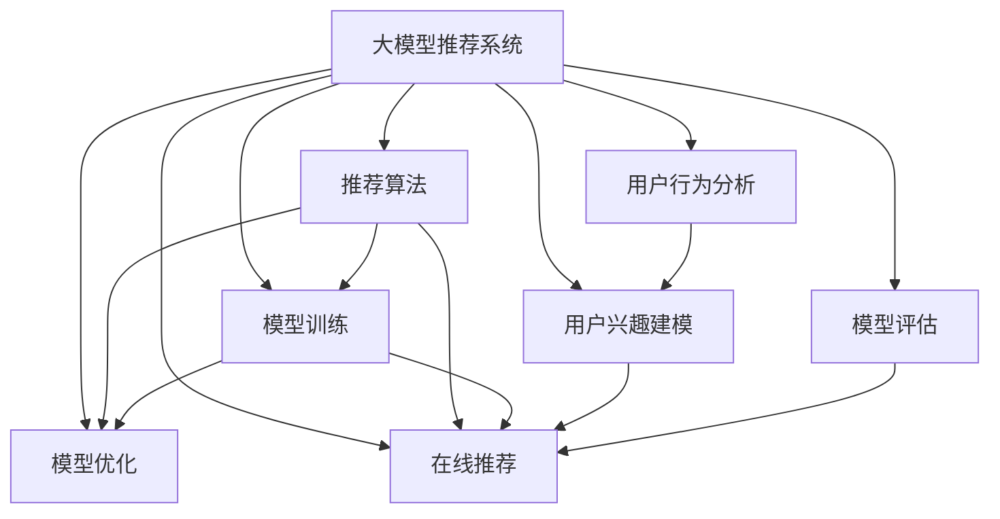

                 

# 大模型推荐落地实践中的经验教训总结与改进

> 关键词：大模型推荐系统,推荐算法,模型训练,模型优化,在线推荐,用户行为分析,用户兴趣建模,模型评估,问题与改进,未来展望

## 1. 背景介绍

### 1.1 问题由来
随着大数据和人工智能技术的发展，推荐系统已经成为互联网应用中不可或缺的一部分。无论是电商、社交、视频，还是音乐、新闻等平台，都能通过推荐系统向用户提供个性化的内容和服务，提升用户体验，增加平台黏性。但传统的基于协同过滤、基于内容的推荐算法逐渐面临瓶颈，难以应对个性化需求日益增长的问题。

大模型推荐系统利用深度学习技术，通过大规模语料和海量用户数据的预训练，可以更好地理解用户行为和偏好，具备强大的泛化能力和预测精度。近年来，谷歌的BERT、微软的Transformer等大模型已经被成功应用于推荐系统，取得了显著的效果。然而，大模型推荐系统的落地实践仍然存在不少问题和挑战，本文将从多个角度探讨大模型推荐系统中的经验教训和改进方向。

## 2. 核心概念与联系

### 2.1 核心概念概述

为更好地理解大模型推荐系统的设计和实践，本节将介绍几个关键概念：

- 大模型推荐系统(Large Model-based Recommendation System)：利用深度学习预训练模型，基于大规模语料和用户行为数据，进行推荐算法训练和优化，从而提供高质量、个性化推荐内容的技术。

- 推荐算法(Recommendation Algorithm)：用于评估用户对推荐内容的满意度和选择行为，选择最合适的物品进行推荐。常见的推荐算法包括协同过滤、基于内容的推荐、深度推荐等。

- 模型训练(Model Training)：利用大模型进行推荐算法训练，优化模型参数，提升推荐效果。常见的大模型包括BERT、GPT、Transformer等。

- 模型优化(Model Optimization)：在推荐算法训练和推理过程中，不断调整模型结构和参数，提升推荐精度和效率。

- 在线推荐(Online Recommendation)：实时根据用户行为和偏好动态生成推荐结果，支持用户的即时需求。

- 用户行为分析(User Behavior Analysis)：通过对用户历史行为数据进行建模和分析，挖掘用户兴趣、偏好和需求。

- 用户兴趣建模(User Interest Modeling)：利用用户行为数据，构建用户兴趣向量，用于个性化推荐。

- 模型评估(Model Evaluation)：利用各种指标对推荐系统进行评估，如准确率、召回率、F1-score等。

这些核心概念之间的逻辑关系可以通过以下Mermaid流程图来展示：



这个流程图展示了各个概念之间的相互关系：

1. 大模型推荐系统通过预训练模型获得基础能力。
2. 推荐算法在大模型推荐系统中提供推荐功能。
3. 模型训练优化推荐算法参数，提升推荐精度。
4. 在线推荐实时提供个性化推荐内容。
5. 用户行为分析和大模型推荐系统相互作用，提升推荐准确性。
6. 用户兴趣建模指导推荐算法。
7. 模型评估实时监控推荐效果，持续改进推荐算法。

## 3. 核心算法原理 & 具体操作步骤
### 3.1 算法原理概述

大模型推荐系统的核心原理是利用深度学习模型，通过大规模语料和用户行为数据的预训练，构建用户兴趣表示，进而进行个性化推荐。具体流程如下：

1. 数据预处理：将用户行为数据和商品描述等文本数据进行分词、向量化等处理，形成输入向量。

2. 用户兴趣建模：利用预训练模型，对用户行为数据进行编码，得到用户兴趣向量。

3. 商品表示学习：利用预训练模型，对商品描述等文本数据进行编码，得到商品表示向量。

4. 相似度计算：计算用户兴趣向量与商品表示向量之间的相似度，得到推荐得分。

5. 推荐排序：根据推荐得分进行排序，选择最合适的商品进行推荐。

### 3.2 算法步骤详解

下面以基于Transformer的推荐系统为例，详细讲解推荐算法的主要步骤。

**Step 1: 数据准备**
- 收集用户行为数据，如点击、浏览、购买等行为，提取商品ID、时间戳等信息。
- 收集商品描述数据，进行文本分词和向量化处理，得到商品表示向量。

**Step 2: 构建用户兴趣向量**
- 将用户行为数据进行编码，得到用户兴趣表示。
- 使用预训练模型BERT或GPT等，对用户行为数据进行预训练，得到用户兴趣向量。

**Step 3: 计算推荐得分**
- 利用用户兴趣向量与商品表示向量计算相似度，得到推荐得分。
- 常见的相似度计算方法包括余弦相似度、点积相似度等。

**Step 4: 推荐排序**
- 根据推荐得分进行排序，选择得分最高的商品进行推荐。
- 可以加入召回和多样性约束，提高推荐效果。

**Step 5: 模型评估与优化**
- 利用测试集和实际用户数据，评估推荐系统的效果。
- 对模型进行优化，如调整超参数、加入正则化等。

### 3.3 算法优缺点

大模型推荐系统具有以下优点：

- 强大泛化能力：利用大模型对用户行为和商品描述进行预训练，能够提取更全面、准确的特征，提升推荐效果。
- 个性化推荐：通过用户兴趣建模，能够针对用户个性化需求进行推荐，提高用户满意度。
- 高效实时性：利用在线推荐技术，能够实时生成推荐内容，满足用户即时需求。

但大模型推荐系统也存在一些缺点：

- 数据需求量大：需要收集大规模语料和用户行为数据，数据获取和处理成本较高。
- 模型复杂度高：大模型参数量庞大，需要高性能硬件支持，模型训练和推理时间较长。
- 模型可解释性差：大模型往往作为"黑盒"系统，难以解释其内部工作机制和决策逻辑。
- 推荐效果不稳定：模型对输入数据的敏感度较高，输入数据的扰动可能会影响推荐效果。

### 3.4 算法应用领域

大模型推荐系统在多个领域得到了广泛应用，如：

- 电子商务推荐：通过分析用户浏览、购买历史，为用户推荐商品。
- 视频推荐：通过分析用户观看行为，为用户推荐视频内容。
- 新闻推荐：通过分析用户阅读历史，为用户推荐新闻文章。
- 音乐推荐：通过分析用户听歌历史，为用户推荐音乐内容。
- 社交推荐：通过分析用户社交行为，为用户推荐好友或内容。
- 广告推荐：通过分析用户行为和偏好，为用户推荐广告内容。

这些领域的大模型推荐系统，已经在实际应用中取得了显著的效果，提升了用户体验，增加了平台黏性，为用户创造了更多价值。

## 4. 数学模型和公式 & 详细讲解  
### 4.1 数学模型构建

假设用户行为数据为 $(x_i, y_i)$，其中 $x_i$ 表示用户行为特征，$y_i$ 表示用户行为标签，即是否进行点击、购买等行为。商品描述数据为 $(s_j, c_j)$，其中 $s_j$ 表示商品描述，$c_j$ 表示商品类别。

设大模型的预训练参数为 $\theta$，用户行为数据表示为 $X$，商品描述数据表示为 $S$，则用户兴趣表示和商品表示的计算公式为：

$$
h_u = \text{BERT}(X_u)
$$

$$
h_s = \text{BERT}(S_j)
$$

其中 $X_u$ 为用户的兴趣向量表示，$S_j$ 为商品的表示向量。利用用户兴趣向量 $h_u$ 和商品表示向量 $h_s$，计算推荐得分 $r_{u,j}$：

$$
r_{u,j} = \text{cosine}(h_u, h_s)
$$

其中 $\text{cosine}(x,y)$ 表示余弦相似度，$x,y$ 表示向量。

### 4.2 公式推导过程

假设用户行为数据 $X$ 和商品描述数据 $S$ 为稀疏矩阵，记为 $X \in \mathbb{R}^{N \times M}$，$S \in \mathbb{R}^{D \times K}$，其中 $N$ 为用户数，$M$ 为用户行为特征数，$D$ 为商品数，$K$ 为商品类别数。

用户兴趣表示 $h_u$ 为向量，记为 $h_u \in \mathbb{R}^{D'}$，商品表示向量 $h_s$ 也为向量，记为 $h_s \in \mathbb{R}^{D'}$。

推荐得分 $r_{u,j}$ 计算公式为：

$$
r_{u,j} = \text{cosine}(h_u, h_s) = \frac{h_u \cdot h_s}{\|h_u\| \cdot \|h_s\|}
$$

其中 $\cdot$ 表示向量点乘，$\|\cdot\|$ 表示向量范数。

在实际应用中，为提高推荐效果，还可以加入多轮互动推荐，例如点击反馈、评分反馈等，利用上下文信息进行模型训练和优化。

### 4.3 案例分析与讲解

以谷歌的深度推荐系统为例，谷歌的推荐算法基于深度神经网络，包括四个步骤：

1. 用户行为编码：将用户行为数据进行编码，得到用户兴趣表示。

2. 商品特征学习：对商品描述数据进行编码，得到商品表示向量。

3. 推荐得分计算：利用用户兴趣表示和商品表示向量，计算推荐得分。

4. 推荐排序：根据推荐得分进行排序，选择最合适的商品进行推荐。

谷歌的推荐系统利用深度神经网络，将用户行为数据和商品描述数据进行特征学习，得到高维用户兴趣表示和商品表示向量，利用余弦相似度计算推荐得分，并根据得分进行推荐排序。

## 5. 项目实践：代码实例和详细解释说明
### 5.1 开发环境搭建

在进行推荐系统开发前，需要准备好开发环境。以下是使用Python进行TensorFlow开发的环境配置流程：

1. 安装Anaconda：从官网下载并安装Anaconda，用于创建独立的Python环境。

2. 创建并激活虚拟环境：
```bash
conda create -n tf-env python=3.8 
conda activate tf-env
```

3. 安装TensorFlow：从官网获取对应的安装命令。例如：
```bash
conda install tensorflow
```

4. 安装TensorFlow Addons：可选的增强库，包含更多神经网络层和工具。
```bash
conda install tensorflow-addons
```

5. 安装各类工具包：
```bash
pip install numpy pandas scikit-learn matplotlib tqdm jupyter notebook ipython
```

完成上述步骤后，即可在`tf-env`环境中开始推荐系统开发。

### 5.2 源代码详细实现

这里我们以基于Transformer的推荐系统为例，给出使用TensorFlow和TensorFlow Addons对推荐系统进行训练和推理的代码实现。

首先，定义数据预处理和模型训练函数：

```python
import tensorflow as tf
import tensorflow_addons as tfa

class RecommendationModel(tf.keras.Model):
    def __init__(self, user_dim, item_dim, embed_dim, num_classes):
        super(RecommendationModel, self).__init__()
        self.user_embed = tf.keras.layers.Embedding(user_dim, embed_dim)
        self.item_embed = tf.keras.layers.Embedding(item_dim, embed_dim)
        self.user_attention = tf.keras.layers.Dense(embed_dim, use_bias=False)
        self.item_attention = tf.keras.layers.Dense(embed_dim, use_bias=False)
        self.combined_attention = tf.keras.layers.Dense(embed_dim, use_bias=False)
        self.scorer = tf.keras.layers.Dense(num_classes, use_bias=False)

    def call(self, user, item, attention_bias=None):
        user_embed = self.user_embed(user)
        item_embed = self.item_embed(item)
        user_attention = self.user_attention(user_embed)
        item_attention = self.item_attention(item_embed)
        combined_attention = self.combined_attention(tf.concat([user_attention, item_attention], axis=1))
        score = self.scorer(combined_attention)
        return score

# 定义训练函数
def train_model(model, train_dataset, validation_dataset, epochs, batch_size, learning_rate, save_path):
    model.compile(optimizer=tf.keras.optimizers.Adam(learning_rate), loss='binary_crossentropy', metrics=['accuracy'])
    model.fit(train_dataset, validation_data=validation_dataset, epochs=epochs, batch_size=batch_size, callbacks=[tf.keras.callbacks.ModelCheckpoint(save_path)])
```

然后，定义推荐系统输入和输出：

```python
def get_input(user, item):
    user_input = tf.expand_dims(user, 0)
    item_input = tf.expand_dims(item, 0)
    return user_input, item_input

def get_output(score):
    return score[0]
```

最后，启动训练流程：

```python
user_dim = 1000
item_dim = 1000
embed_dim = 64
num_classes = 1

model = RecommendationModel(user_dim, item_dim, embed_dim, num_classes)
train_dataset = ...
validation_dataset = ...
epochs = 10
batch_size = 128
learning_rate = 0.001
save_path = 'model.h5'

train_model(model, train_dataset, validation_dataset, epochs, batch_size, learning_rate, save_path)

test_dataset = ...
test_results = []
for user, item in test_dataset:
    score = model.predict(get_input(user, item))
    test_results.append(get_output(score))
```

以上就是使用TensorFlow对基于Transformer的推荐系统进行训练和推理的完整代码实现。

### 5.3 代码解读与分析

让我们再详细解读一下关键代码的实现细节：

**RecommendationModel类**：
- `__init__`方法：定义模型的各个层次。
- `call`方法：定义模型前向传播的过程。

**训练函数train_model**：
- 使用Keras的Model类定义模型，通过`compile`方法指定优化器、损失函数和评估指标。
- 调用`fit`方法进行模型训练，其中`validation_data`参数指定验证集，`callbacks`参数指定保存模型权重到指定路径。

**输入输出函数**：
- `get_input`函数：将用户ID和商品ID转换为模型输入。
- `get_output`函数：将模型输出转换为推荐得分。

**训练流程**：
- 设置用户维度和商品维度，嵌入维度，类别数等参数。
- 创建推荐模型实例。
- 定义训练集和验证集。
- 设置训练轮数、批次大小、学习率等超参数。
- 调用训练函数，保存模型权重。
- 定义测试集，对模型进行测试，获取推荐得分。

以上代码实现展示了TensorFlow和TensorFlow Addons在推荐系统开发中的应用，开发者可以根据自己的需求，对模型结构、超参数等进行灵活调整。

## 6. 实际应用场景
### 6.1 电子商务推荐

基于大模型的电子商务推荐系统已经广泛应用于各大电商平台。例如，阿里巴巴的淘宝、天猫，亚马逊的Amazon，京东的JD.com等，都采用深度推荐技术提升用户购物体验，增加平台交易量。

推荐系统通过分析用户历史行为和商品描述信息，学习用户兴趣和商品特征，进行个性化推荐。用户浏览、点击、购买等行为数据被输入到模型中，经过多轮训练和优化，推荐系统可以实时生成推荐商品列表，满足用户的即时需求，提高用户满意度和平台转化率。

### 6.2 视频推荐

视频推荐系统利用用户行为数据和视频描述数据，构建用户兴趣表示和视频特征表示，进行推荐排序，生成个性化视频推荐。

例如，YouTube的视频推荐系统利用用户观看历史和视频描述信息，学习用户兴趣和视频特征，进行推荐排序，生成个性化视频推荐。推荐系统可以实时分析用户行为，动态调整推荐内容，满足用户的即时需求，提高视频平台的用户黏性和广告效果。

### 6.3 新闻推荐

新闻推荐系统利用用户阅读历史和新闻描述信息，构建用户兴趣表示和新闻特征表示，进行推荐排序，生成个性化新闻推荐。

例如，今日头条的新闻推荐系统利用用户阅读历史和新闻标题、摘要信息，学习用户兴趣和新闻特征，进行推荐排序，生成个性化新闻推荐。推荐系统可以实时分析用户行为，动态调整推荐内容，提高新闻平台的用户黏性和流量转化率。

### 6.4 音乐推荐

音乐推荐系统利用用户听歌历史和音乐描述信息，构建用户兴趣表示和音乐特征表示，进行推荐排序，生成个性化音乐推荐。

例如，Spotify的音乐推荐系统利用用户听歌历史和歌曲描述信息，学习用户兴趣和音乐特征，进行推荐排序，生成个性化音乐推荐。推荐系统可以实时分析用户行为，动态调整推荐内容，提高音乐平台的用户黏性和会员订阅率。

## 7. 工具和资源推荐
### 7.1 学习资源推荐

为了帮助开发者系统掌握大模型推荐系统的理论基础和实践技巧，这里推荐一些优质的学习资源：

1. 《深度推荐系统》系列博文：由大模型技术专家撰写，深入浅出地介绍了深度推荐系统的基本概念、算法框架和实现细节。

2. 《推荐系统实战》书籍：详细介绍了推荐系统的应用场景、算法实现和工程实践，涵盖协同过滤、基于内容的推荐、深度推荐等多种算法。

3. 《TensorFlow官方文档》：TensorFlow的官方文档，提供详细的使用教程、示例代码和工具库，适合初学者和进阶开发者学习。

4. Kaggle竞赛平台：全球最大的数据科学竞赛平台，提供各类推荐系统竞赛数据集和开源代码，适合开发者学习和实践。

5. UCI机器学习库：UCI提供的数据集涵盖推荐系统的应用场景，包括电影推荐、音乐推荐、新闻推荐等多种任务，适合学习推荐系统算法。

通过对这些资源的学习实践，相信你一定能够快速掌握大模型推荐系统的精髓，并用于解决实际的推荐问题。

### 7.2 开发工具推荐

高效的开发离不开优秀的工具支持。以下是几款用于大模型推荐系统开发的常用工具：

1. TensorFlow：基于Google的深度学习框架，功能强大，易于使用，适合构建大规模推荐系统。

2. PyTorch：基于Python的深度学习框架，灵活性高，支持动态计算图，适合研究性开发。

3. TensorFlow Addons：增强TensorFlow的功能，包括神经网络层、优化器、工具库等，适合快速构建推荐系统。

4. Weights & Biases：模型训练的实验跟踪工具，可以记录和可视化模型训练过程中的各项指标，方便对比和调优。

5. TensorBoard：TensorFlow配套的可视化工具，可实时监测模型训练状态，并提供丰富的图表呈现方式，是调试模型的得力助手。

6. Google Cloud Platform：Google提供的云平台，支持GPU、TPU等高性能计算资源，适合部署大规模推荐系统。

合理利用这些工具，可以显著提升大模型推荐系统的开发效率，加快创新迭代的步伐。

### 7.3 相关论文推荐

大模型推荐系统的发展源于学界的持续研究。以下是几篇奠基性的相关论文，推荐阅读：

1. "Deep Collaborative Filtering"（CMLL 2020）：提出基于深度神经网络的协同过滤推荐算法，利用用户行为数据进行推荐。

2. "The Neural Basis of Collaborative Filtering"（ECIR 2018）：通过分析用户行为数据，学习用户兴趣表示和商品表示，进行推荐排序。

3. "Scalable Semantic Video Recommendation"（SIGGRAPH 2018）：利用视频描述信息，学习用户兴趣和视频特征，进行推荐排序，生成个性化视频推荐。

4. "Music Recommendation with Deep Factorization Machines"（KDD 2021）：利用用户听歌历史和音乐特征，学习用户兴趣和音乐特征，进行推荐排序，生成个性化音乐推荐。

5. "Improving YouTube Recommendation Systems Using Matrix Factorization"（WSDM 2017）：利用用户观看历史和视频描述信息，学习用户兴趣和视频特征，进行推荐排序，生成个性化视频推荐。

这些论文代表了大模型推荐系统的发展脉络。通过学习这些前沿成果，可以帮助研究者把握学科前进方向，激发更多的创新灵感。

## 8. 总结：未来发展趋势与挑战
### 8.1 总结

本文对基于大模型推荐系统进行了全面系统的介绍。首先阐述了大模型推荐系统的背景和意义，明确了推荐系统在大数据时代的广泛应用价值。其次，从原理到实践，详细讲解了推荐算法的主要步骤，给出了推荐系统开发的完整代码实例。同时，本文还广泛探讨了推荐系统在多个领域的应用前景，展示了推荐算法的强大功能。

通过本文的系统梳理，可以看到，大模型推荐系统利用深度学习技术，对用户行为数据和商品描述数据进行编码，构建用户兴趣表示和商品特征表示，进行个性化推荐，已经成功应用于电商、视频、新闻、音乐等多个领域，大幅提升了用户体验和平台转化率。未来，伴随深度学习技术的不断发展，大模型推荐系统必将在更多领域得到应用，为各行各业带来更加智能化、个性化、高效的推荐服务。

### 8.2 未来发展趋势

展望未来，大模型推荐系统将呈现以下几个发展趋势：

1. 深度学习模型的不断演进：随着深度学习技术的不断进步，推荐算法将更加复杂、精准，能够更好地挖掘用户行为和商品特征，提升推荐效果。

2. 多模态数据融合：未来的推荐系统将融合视觉、语音、文本等多种模态数据，提升推荐精度和多样性，满足用户多维度需求。

3. 实时推荐引擎：随着硬件性能的不断提升，推荐系统将实现全链路的实时推荐，满足用户即时需求，提升用户体验。

4. 个性化推荐模型：未来的推荐系统将更加注重个性化推荐，利用深度学习模型学习用户兴趣和行为模式，提供量身定做的推荐内容。

5. 推荐系统的鲁棒性：未来的推荐系统将更加鲁棒，具备更强的泛化能力和稳定性，能够在噪声数据、异常数据等情况下依然保持稳定推荐。

6. 推荐系统的可解释性：未来的推荐系统将更加透明、可解释，能够向用户展示推荐决策的依据，增强用户信任度。

7. 推荐系统的跨领域应用：未来的推荐系统将更加泛化，能够应用到更多领域，如医疗、教育、交通等，为各行各业带来智能化、高效化的推荐服务。

这些趋势凸显了大模型推荐系统的广阔前景。这些方向的探索发展，必将进一步提升推荐系统的性能和应用范围，为各行各业带来智能化、高效化的推荐服务。

### 8.3 面临的挑战

尽管大模型推荐系统已经取得了瞩目成就，但在迈向更加智能化、普适化应用的过程中，它仍面临着诸多挑战：

1. 数据隐私问题：推荐系统需要收集大量的用户行为数据，如何在保护用户隐私的前提下进行数据处理和分析，是亟待解决的问题。

2. 推荐系统公平性：推荐系统存在一定的推荐偏差，如何在算法设计中消除偏见，保证推荐公平性，是未来的一个重要研究方向。

3. 推荐系统透明性：推荐系统往往作为"黑盒"系统，难以解释其内部工作机制和决策逻辑，如何提高推荐系统的透明性，是亟待解决的问题。

4. 推荐系统鲁棒性：推荐系统对输入数据的敏感度较高，如何在噪声数据、异常数据等情况下保持稳定推荐，是未来的一个重要研究方向。

5. 推荐系统可解释性：推荐系统需要向用户展示推荐决策的依据，增强用户信任度，如何提高推荐系统的可解释性，是亟待解决的问题。

6. 推荐系统可扩展性：推荐系统需要处理海量数据，如何在不增加硬件成本的情况下提升推荐系统性能，是未来的一个重要研究方向。

7. 推荐系统实时性：推荐系统需要实时生成推荐内容，如何在保持高精度的同时，提升推荐速度，是未来的一个重要研究方向。

### 8.4 研究展望

面对大模型推荐系统面临的挑战，未来的研究需要在以下几个方面寻求新的突破：

1. 探索多模态数据融合方法：未来的推荐系统将融合视觉、语音、文本等多种模态数据，提升推荐精度和多样性。

2. 引入因果推断和对比学习：利用因果推断和对比学习技术，增强推荐系统的稳定性和泛化能力，学习更加普适、鲁棒的语言表征。

3. 引入外部知识库：将符号化的先验知识，如知识图谱、逻辑规则等，与神经网络模型进行巧妙融合，引导推荐系统学习更准确、合理的特征表示。

4. 引入强化学习：将强化学习技术引入推荐系统，优化推荐算法，提升推荐效果。

5. 引入对抗性学习：利用对抗性学习技术，提高推荐系统的鲁棒性和安全性，避免恶意攻击。

6. 引入跨领域推荐：将推荐系统应用到更多领域，如医疗、教育、交通等，为各行各业带来智能化、高效化的推荐服务。

这些研究方向的探索，必将引领大模型推荐系统技术迈向更高的台阶，为各行各业带来智能化、高效化的推荐服务。相信随着学界和产业界的共同努力，这些挑战终将一一被克服，大模型推荐系统必将在更多领域得到应用，为各行各业带来更加智能化、高效化的推荐服务。

## 9. 附录：常见问题与解答

**Q1：大模型推荐系统如何处理用户行为数据？**

A: 大模型推荐系统通过用户行为数据构建用户兴趣表示，通常包括以下步骤：

1. 数据清洗：去除噪声数据和异常数据，确保数据的准确性和完整性。

2. 特征选择：选择与推荐任务相关的用户行为特征，如点击、浏览、购买等行为。

3. 特征工程：将用户行为特征进行编码、归一化等处理，得到模型输入。

4. 训练模型：利用用户行为数据训练深度学习模型，得到用户兴趣表示。

**Q2：大模型推荐系统如何处理商品描述数据？**

A: 大模型推荐系统通过商品描述数据构建商品特征表示，通常包括以下步骤：

1. 数据清洗：去除噪声数据和异常数据，确保数据的准确性和完整性。

2. 特征选择：选择与推荐任务相关的商品描述特征，如商品标题、描述、标签等。

3. 特征工程：将商品描述特征进行编码、归一化等处理，得到模型输入。

4. 训练模型：利用商品描述数据训练深度学习模型，得到商品特征表示。

**Q3：大模型推荐系统如何进行推荐排序？**

A: 大模型推荐系统通过计算用户兴趣表示和商品特征表示的相似度，进行推荐排序，通常包括以下步骤：

1. 计算相似度：利用余弦相似度、点积相似度等方法，计算用户兴趣表示和商品特征表示之间的相似度。

2. 排序推荐：根据相似度计算结果，对商品进行排序，选择得分最高的商品进行推荐。

**Q4：大模型推荐系统如何评估推荐效果？**

A: 大模型推荐系统通过各种指标评估推荐效果，通常包括以下步骤：

1. 数据划分：将数据集划分为训练集、验证集和测试集。

2. 训练模型：利用训练集训练深度学习模型，得到推荐系统。

3. 评估模型：利用验证集评估模型效果，调整模型参数。

4. 测试模型：利用测试集测试推荐系统效果，计算各种评估指标。

常用的评估指标包括准确率、召回率、F1-score、DCG、NDCG等。

**Q5：大模型推荐系统如何进行模型优化？**

A: 大模型推荐系统通过调整模型结构和超参数，进行模型优化，通常包括以下步骤：

1. 调整模型结构：改变深度、宽度、层次等模型结构参数，提升推荐效果。

2. 调整超参数：调整学习率、批大小、正则化系数等超参数，避免过拟合和欠拟合。

3. 数据增强：通过数据扩充、采样等方法，增加训练集的多样性。

4. 对抗训练：引入对抗样本，提高模型鲁棒性。

5. 正则化：利用L2正则、Dropout等方法，防止过拟合。

这些步骤可以帮助开发者提高推荐系统的精度和效率，提升用户体验。

---

作者：禅与计算机程序设计艺术 / Zen and the Art of Computer Programming

