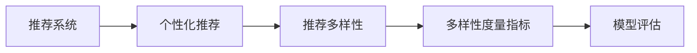

                 

# 大模型视角下推荐系统的推荐多样性度量指标

> 关键词：推荐系统,多样性度量,个性化推荐,模型评估,系统优化

## 1. 背景介绍

在推荐系统领域，推荐多样性（Recommendation Diversity）是一个重要的评价指标。它衡量了推荐结果中不同物品的多样性，旨在避免用户被单一类型的物品推荐，促进用户的多样化消费体验。特别是在大规模推荐系统（如电商平台、视频流媒体等）中，推荐多样性显得尤为重要。

然而，随着深度学习和大模型的引入，传统的推荐多样性度量方法面临着新的挑战。如何在大规模数据和复杂模型环境下有效地评估和优化推荐多样性，成为了一个亟待解决的问题。本文将从大模型的视角出发，详细探讨推荐多样性度量指标的设计和应用，为推荐系统优化提供有价值的参考。

## 2. 核心概念与联系

### 2.1 核心概念概述

- **推荐系统（Recommendation System）**：通过分析用户的历史行为、兴趣和上下文信息，为用户推荐感兴趣的物品。推荐系统广泛应用于电商、社交媒体、视频流媒体等场景。

- **个性化推荐（Personalized Recommendation）**：针对每个用户，推荐其特定的、可能感兴趣的物品，以提高用户满意度和留存率。

- **推荐多样性（Recommendation Diversity）**：衡量推荐结果中不同物品的多样性，避免用户被单一类型的物品推荐，促进用户的多样化消费体验。

- **多样性度量指标（Diversity Metrics）**：用于衡量推荐结果多样性的指标，常见如覆盖率（Coverage）、Jaccard系数、互信息等。

- **模型评估（Model Evaluation）**：评估推荐模型的性能，包括准确率、召回率、F1分数等，同时需要关注推荐结果的多样性。

### 2.2 核心概念原理和架构的 Mermaid 流程图



该流程图展示了推荐系统、个性化推荐、推荐多样性、多样性度量指标和模型评估之间的联系：

1. **推荐系统**：基础架构，接收用户行为数据，分析用户兴趣。
2. **个性化推荐**：核心目标，根据用户特征和兴趣，推荐个性化物品。
3. **推荐多样性**：重要评价指标，衡量推荐结果的多样性，避免单一推荐。
4. **多样性度量指标**：具体工具，用于计算推荐多样性的数值。
5. **模型评估**：综合评价，结合准确率和推荐多样性，全面评估推荐模型。

## 3. 核心算法原理 & 具体操作步骤

### 3.1 算法原理概述

推荐多样性度量指标的目的是评估推荐系统的多样性性能，通常分为两个部分：

1. **用户层多样性（User-level Diversity）**：评估每个用户推荐的物品种类数量。
2. **物品层多样性（Item-level Diversity）**：评估推荐系统推荐的所有物品中，不同物品的多样性。

在推荐系统的大模型框架下，这些指标的计算需要考虑模型的复杂性和数据的规模。常见的推荐多样性度量方法包括覆盖率（Coverage）、Jaccard系数、互信息（Mutual Information）等。

### 3.2 算法步骤详解

以下是推荐多样性度量指标的详细步骤：

**Step 1: 数据预处理**

- 收集用户行为数据，包括浏览、点击、购买等行为。
- 对数据进行清洗和预处理，去除异常值和重复数据。
- 将数据进行分片，便于大规模并行计算。

**Step 2: 计算用户层多样性**

- 对于每个用户 $u$，计算其推荐的物品集合 $R_u$。
- 统计 $R_u$ 中不同物品的种类数 $|\mathcal{I}_R|$。
- 计算用户层覆盖率 $C_u$ 和多样性系数 $D_u$。

**Step 3: 计算物品层多样性**

- 计算所有用户推荐的物品集合 $R$ 的并集 $\mathcal{I}_R$，即推荐系统中不同物品的种类数。
- 计算推荐系统整体覆盖率 $C$ 和多样性系数 $D$。

**Step 4: 多样性度量指标的优化**

- 根据业务需求和推荐策略，选择合适的多样性度量指标。
- 使用模型评估的方法，结合准确率和推荐多样性，进行综合评价。

### 3.3 算法优缺点

**优点：**

- **综合性评估**：结合准确率和推荐多样性，全面评估推荐系统。
- **数据驱动**：基于用户行为数据，能够更准确地评估推荐系统的多样性性能。
- **多指标综合**：通过多种多样性度量指标，提供更全面的评估结果。

**缺点：**

- **计算复杂**：特别是在大模型和大数据量的情况下，计算复杂度较高。
- **模型依赖**：多样性度量指标的选择和优化依赖于推荐模型，不同模型可能需要不同的计算方法。
- **多样性冲突**：用户层多样性和物品层多样性之间可能存在冲突，需要平衡两者的关系。

### 3.4 算法应用领域

推荐多样性度量指标广泛应用于电商、社交媒体、视频流媒体等推荐系统领域，具体应用包括：

- **电商推荐系统**：提高用户浏览和购买的多样性，增加销售额。
- **视频流媒体**：推荐多样性高的视频，增加用户观看时长和满意度。
- **社交媒体**：推荐多样化内容，增加用户互动和留存率。
- **智能广告**：推荐多样化的广告内容，提升广告点击率和转化率。

## 4. 数学模型和公式 & 详细讲解 & 举例说明

### 4.1 数学模型构建

推荐多样性度量指标的数学模型通常基于信息论和概率统计理论。以覆盖率（Coverage）和Jaccard系数为例，公式如下：

**覆盖率（Coverage）**：

$$
C = \frac{\sum_{u=1}^N |R_u \cap \mathcal{I}_R|}{N \times |\mathcal{I}_R|}
$$

其中 $N$ 为用户数，$R_u$ 为第 $u$ 个用户的推荐集合，$\mathcal{I}_R$ 为推荐系统中不同物品的种类数。

**Jaccard系数**：

$$
D = \frac{|R_u \cap \mathcal{I}_R|}{|R_u| \times |\mathcal{I}_R|}
$$

其中 $|R_u|$ 为第 $u$ 个用户推荐集合的大小。

### 4.2 公式推导过程

上述公式的推导过程基于概率论和信息论的基本原理。以覆盖率为例，公式表示为每个用户推荐的物品集合与推荐系统中不同物品集合的交集大小除以总用户数和推荐物品集合大小，从而评估用户推荐的多样性。

### 4.3 案例分析与讲解

假设有一个电商平台，收集了1000个用户的历史行为数据，推荐系统中不同物品的种类数为1000。对每个用户 $u$ 计算其推荐集合 $R_u$，发现 $R_u$ 中不同物品的种类数为 $C_u$，计算用户层覆盖率 $C_u$ 和多样性系数 $D_u$。然后计算整体覆盖率 $C$ 和多样性系数 $D$，得出推荐系统的多样性性能。

## 5. 项目实践：代码实例和详细解释说明

### 5.1 开发环境搭建

在Python环境下，可以使用Pandas、NumPy、Scikit-Learn等库进行数据处理和计算。具体步骤如下：

1. 安装Python环境。
2. 安装Pandas、NumPy、Scikit-Learn等库。
3. 读取数据集，并进行预处理和清洗。
4. 使用Pandas进行数据分组和计算。

### 5.2 源代码详细实现

以下是使用Python实现推荐多样性度量指标的代码示例：

```python
import pandas as pd
import numpy as np

# 读取用户行为数据
data = pd.read_csv('user_behavior.csv')

# 数据预处理
data = data.dropna(subset=['item_id', 'user_id', 'timestamp'])

# 计算用户层多样性
def calculate_user_diversity(data):
    # 计算每个用户推荐集合与推荐系统中不同物品集合的交集大小
    intersection = data.groupby('user_id')['item_id'].nunique()
    # 计算覆盖率和多样性系数
    coverage = (intersection / len(data['item_id'].unique())).sum()
    diversity = intersection / data.groupby('user_id')['item_id'].transform('count')
    return coverage, diversity

# 计算物品层多样性
def calculate_item_diversity(data):
    # 计算推荐系统中不同物品集合
    items = data['item_id'].unique()
    # 计算覆盖率和多样性系数
    coverage = (data.groupby('user_id')['item_id'].nunique() / len(items)).sum()
    diversity = data.groupby('user_id')['item_id'].transform('count') / data.groupby('user_id')['item_id'].nunique()
    return coverage, diversity

# 计算推荐多样性度量指标
coverage_user, diversity_user = calculate_user_diversity(data)
coverage_item, diversity_item = calculate_item_diversity(data)

print('User-level Coverage:', coverage_user)
print('User-level Diversity:', diversity_user)
print('Item-level Coverage:', coverage_item)
print('Item-level Diversity:', diversity_item)
```

### 5.3 代码解读与分析

上述代码中，首先通过Pandas库读取用户行为数据，并进行预处理和清洗。然后定义了两个函数，分别计算用户层多样性和物品层多样性。最后，打印输出计算结果，显示用户层和物品层的多样性性能。

## 6. 实际应用场景

### 6.1 电商推荐系统

在电商推荐系统中，推荐多样性度量指标可以帮助电商平台评估推荐系统的性能，优化推荐策略。例如，电商平台可以定期计算用户层和物品层的多样性，发现推荐效果不佳的用户群体，针对性地进行个性化推荐，提高用户的浏览和购买多样性。

### 6.2 视频流媒体

视频流媒体平台可以利用推荐多样性度量指标，评估推荐系统的多样性性能，优化推荐算法。例如，通过计算用户层和物品层的多样性，发现用户对推荐内容的喜好变化，动态调整推荐策略，提高用户的观看时长和满意度。

### 6.3 社交媒体

社交媒体平台可以利用推荐多样性度量指标，评估推荐系统的多样性性能，优化推荐算法。例如，通过计算用户层和物品层的多样性，发现用户对推荐内容的互动变化，动态调整推荐策略，增加用户互动和留存率。

## 7. 工具和资源推荐

### 7.1 学习资源推荐

1. **《推荐系统实战》**：详细介绍了推荐系统的设计和优化，包括多样性度量指标的计算方法。
2. **《信息论与统计》**：介绍了信息论和概率统计的基本原理，为推荐多样性度量指标的计算提供理论基础。
3. **Coursera推荐系统课程**：由斯坦福大学教授讲授，涵盖推荐系统的基本概念和多样性度量指标的计算。

### 7.2 开发工具推荐

1. **Pandas**：用于数据处理和分析，支持高效的数据分组和聚合计算。
2. **NumPy**：用于数值计算和科学计算，支持高效的数组和矩阵操作。
3. **Scikit-Learn**：用于机器学习和数据分析，支持各种常用的算法和工具。

### 7.3 相关论文推荐

1. **《推荐系统中的多样性评估》**：详细介绍了推荐多样性度量指标的计算方法和应用场景。
2. **《个性化推荐系统中的推荐多样性研究》**：研究了推荐多样性度量指标在个性化推荐系统中的优化策略。
3. **《基于大模型的推荐系统》**：研究了大模型在推荐系统中的应用，包括推荐多样性度量指标的计算。

## 8. 总结：未来发展趋势与挑战

### 8.1 研究成果总结

本文从大模型的视角出发，详细探讨了推荐多样性度量指标的设计和应用，为推荐系统优化提供有价值的参考。推荐多样性度量指标的计算方法在大模型框架下仍然适用，但需要考虑模型的复杂性和数据的规模。

### 8.2 未来发展趋势

未来，推荐多样性度量指标的发展趋势包括：

1. **自适应多样性计算**：在大模型和实时数据的背景下，推荐多样性度量指标需要更加灵活和高效。自适应多样性计算方法可以帮助系统根据实时数据动态调整推荐策略，提高推荐系统的多样性性能。
2. **多指标综合评估**：推荐多样性度量指标需要结合其他性能指标，如准确率、召回率等，进行全面评估和优化。多指标综合评估方法可以帮助系统更好地平衡推荐多样性和推荐效果。
3. **跨领域多样性计算**：推荐多样性度量指标的计算方法可以应用于跨领域推荐系统，如跨平台、跨媒体等。跨领域多样性计算方法可以帮助系统更好地理解用户的多样性需求，提供更加个性化的推荐服务。

### 8.3 面临的挑战

尽管推荐多样性度量指标在推荐系统中的应用已经取得一定进展，但仍面临以下挑战：

1. **数据质量问题**：推荐多样性度量指标的计算依赖于用户行为数据，数据质量问题会影响计算结果的准确性。如何提高数据质量，保证推荐多样性度量指标的有效性，是未来需要解决的问题。
2. **模型复杂度问题**：大模型和复杂推荐算法的引入，使得推荐多样性度量指标的计算更加复杂。如何在保证计算效率的前提下，实现多样性度量指标的精确计算，是未来需要解决的问题。
3. **多样性冲突问题**：用户层多样性和物品层多样性之间可能存在冲突，需要平衡两者的关系。如何在保证推荐多样性的同时，提高推荐效果，是未来需要解决的问题。

### 8.4 研究展望

未来，推荐多样性度量指标的研究可以从以下几个方向进行：

1. **推荐多样性生成模型**：研究推荐多样性生成模型，自动生成推荐多样性度量指标，提高生成效率和质量。
2. **推荐多样性增强算法**：研究推荐多样性增强算法，优化推荐策略，提高推荐多样性性能。
3. **推荐多样性评估工具**：开发推荐多样性评估工具，帮助推荐系统开发者实时监控和评估推荐多样性性能，提高系统优化效率。

## 9. 附录：常见问题与解答

**Q1: 推荐多样性度量指标和推荐准确率有什么区别？**

A: 推荐多样性度量指标和推荐准确率是两个不同的指标。推荐准确率衡量推荐的准确性和相关性，而推荐多样性度量指标衡量推荐结果的多样性。推荐系统需要同时考虑这两个指标，才能全面评估系统的性能。

**Q2: 如何平衡用户层多样性和物品层多样性？**

A: 用户层多样性和物品层多样性之间存在一定的冲突，需要根据具体业务需求进行平衡。一般可以通过调整推荐算法参数、优化推荐策略等方式进行平衡。

**Q3: 推荐多样性度量指标在大模型中的应用需要注意哪些问题？**

A: 在大模型中的应用中，推荐多样性度量指标的计算复杂度较高，需要考虑模型的复杂性和数据的规模。同时，模型可能存在偏见和有害信息，需要在使用之前进行数据清洗和模型优化。

**Q4: 推荐多样性度量指标的计算是否需要考虑用户隐私？**

A: 推荐多样性度量指标的计算需要考虑用户隐私，尤其是用户层的推荐多样性度量指标。需要采用匿名化处理和差分隐私等技术，保护用户隐私。

**Q5: 推荐多样性度量指标的计算是否需要考虑实时性？**

A: 推荐多样性度量指标的计算需要考虑实时性，特别是在大模型和大规模数据的情况下。需要采用分布式计算和流式计算等技术，实现实时计算和优化。

---

作者：禅与计算机程序设计艺术 / Zen and the Art of Computer Programming

