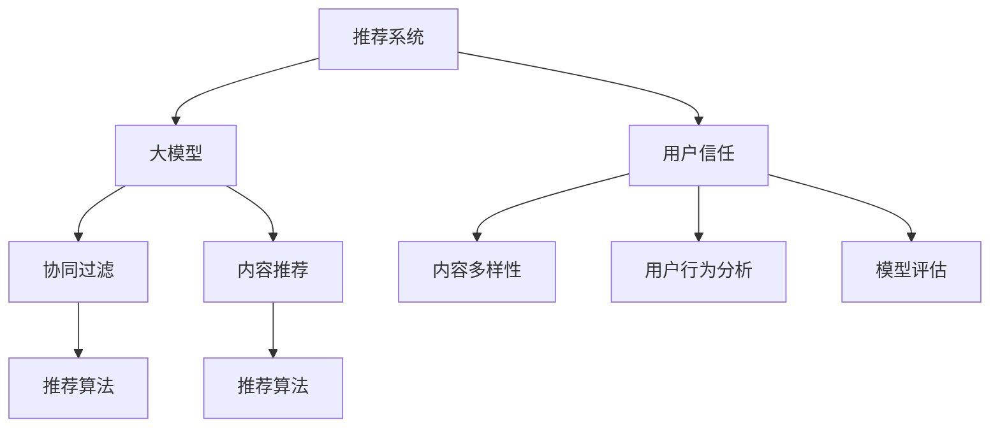

                 

# 大模型视角下推荐系统的用户信任建立与维护

> 关键词：推荐系统,大模型,用户信任,内容多样性,协同过滤,推荐算法,用户行为分析,模型评估,深度学习

## 1. 背景介绍

随着互联网的快速发展，推荐系统已经成为各大平台提升用户粘性、增加收入的重要工具。然而，推荐系统的核心问题之一是如何建立和维护用户信任，使用户相信其推荐结果的真实性和可信度。传统推荐系统多采用基于协同过滤和内容推荐的方式，难以充分考虑用户心理和行为因素，存在一定的推荐偏差。

与此同时，近年来随着预训练语言模型和大模型的兴起，推荐系统开始引入大模型进行数据表示学习，以期更好地理解用户行为和偏好。大模型的语言表示能力极大地提升了推荐系统的表现，但大模型在推荐任务中的有效性和可靠性问题，如信任建立和维护，仍需进一步研究。

本文将从大模型的视角出发，探讨推荐系统中的用户信任建立与维护问题，提出基于大模型的推荐系统信任构建框架，并通过实际应用场景和案例进行说明。

## 2. 核心概念与联系

### 2.1 核心概念概述

- **推荐系统**：通过分析用户历史行为数据，预测用户未来可能感兴趣的内容或商品，为用户推荐个性化信息的系统。

- **大模型**：基于深度学习，经过大规模无监督训练，具有强大的特征表示和学习能力的模型，如BERT、GPT等。

- **用户信任**：用户对推荐系统的信任，体现在是否接受、使用推荐结果。

- **推荐算法**：实现推荐系统的核心算法，包括协同过滤、内容推荐、深度学习推荐等。

- **内容多样性**：推荐系统需要保证推荐结果的多样性，避免同质化。

- **协同过滤**：通过分析用户和商品间的互动关系，预测用户对未知商品的态度。

- **用户行为分析**：从用户历史行为数据中提取信息，建立用户画像。

- **模型评估**：用于评估推荐系统的性能指标，如准确率、召回率、多样性等。

这些概念之间的联系主要体现在：

1. 大模型提供强有力的特征表示和学习能力，提升推荐系统的表现。
2. 协同过滤和内容推荐等算法，可以基于大模型的表示进行改进。
3. 用户信任是推荐系统的最终目标，需要通过内容多样性、推荐算法和模型评估等多方面努力。

### 2.2 核心概念原理和架构的 Mermaid 流程图



从上述图表可以看出，推荐系统的核心任务是利用大模型提取特征，并通过协同过滤、内容推荐等算法，为不同用户推荐个性化内容。用户信任则通过内容多样性、用户行为分析等手段进行维护。模型评估用于评估推荐系统的性能，指导优化和改进。

## 3. 核心算法原理 & 具体操作步骤

### 3.1 算法原理概述

基于大模型的推荐系统信任构建框架主要包括以下几个步骤：

1. **特征提取与表示学习**：使用大模型对用户行为数据和物品属性进行表示学习，提取高层次的语义特征。

2. **协同过滤与内容推荐**：将用户和物品特征映射到低维空间，通过协同过滤和内容推荐算法，生成推荐结果。

3. **信任度评估与维护**：通过用户反馈数据，评估推荐系统的信任度，并动态调整模型参数，提升用户信任。

4. **多样性与推荐算法优化**：引入内容多样性约束，调整推荐算法参数，避免同质化推荐。

5. **用户行为分析与建模**：对用户历史行为进行分析，建立用户画像，指导个性化推荐。

### 3.2 算法步骤详解

#### 步骤一：特征提取与表示学习

使用大模型对用户行为数据和物品属性进行表示学习，提取高层次的语义特征。具体步骤如下：

1. **数据预处理**：对用户行为数据进行清洗、去重，去除异常数据。
2. **特征提取**：使用大模型对用户行为和物品属性进行特征提取。例如，使用BERT模型对用户评论文本进行编码，提取语义特征。
3. **表示学习**：通过多任务学习等方法，将用户和物品特征映射到低维空间，提升特征表达能力。

#### 步骤二：协同过滤与内容推荐

将用户和物品特征映射到低维空间后，使用协同过滤和内容推荐算法生成推荐结果。具体步骤如下：

1. **协同过滤算法**：计算用户-物品交互矩阵，使用矩阵分解等方法，推荐相似物品。
2. **内容推荐算法**：将用户和物品特征映射到语义空间，使用内容关联度计算，推荐相关物品。
3. **组合推荐**：将协同过滤和内容推荐结果进行组合，生成最终推荐列表。

#### 步骤三：信任度评估与维护

通过用户反馈数据，评估推荐系统的信任度，并动态调整模型参数，提升用户信任。具体步骤如下：

1. **用户反馈收集**：收集用户对推荐结果的反馈，如点击率、评分等。
2. **信任度评估**：使用A/B测试等方法，评估推荐系统的信任度。
3. **模型调整**：根据信任度评估结果，动态调整模型参数，优化推荐结果。

#### 步骤四：多样性与推荐算法优化

引入内容多样性约束，调整推荐算法参数，避免同质化推荐。具体步骤如下：

1. **多样性约束**：引入多样性损失函数，如β-多样性，约束推荐结果的多样性。
2. **推荐算法优化**：使用多目标优化方法，平衡推荐结果的准确率和多样性。

#### 步骤五：用户行为分析与建模

对用户历史行为进行分析，建立用户画像，指导个性化推荐。具体步骤如下：

1. **用户画像构建**：使用用户行为数据，构建用户画像，包括兴趣偏好、行为模式等。
2. **行为建模**：使用深度学习等方法，建立用户行为模型，预测未来行为。

### 3.3 算法优缺点

#### 优点

1. **提升推荐效果**：大模型的语言表示能力，可以更好地理解用户行为和偏好，提升推荐效果。
2. **提高多样性**：通过多样性约束和推荐算法优化，提升推荐结果的多样性，避免同质化。
3. **动态调整**：用户信任度评估和动态调整，保证推荐系统随时间变化保持可靠性。
4. **支持多种推荐方式**：协同过滤和内容推荐结合，提供多种推荐方式，满足不同用户需求。

#### 缺点

1. **计算复杂度高**：大模型的计算复杂度高，对硬件资源要求较高。
2. **数据依赖性强**：大模型依赖于高质量的用户行为数据和物品属性，数据质量不佳会影响模型性能。
3. **可解释性差**：大模型的黑盒特性，难以解释推荐结果的来源和逻辑。
4. **公平性问题**：可能存在数据偏差和算法偏见，影响推荐系统的公平性。

### 3.4 算法应用领域

基于大模型的推荐系统已经在多个领域得到应用，包括：

1. **电子商务**：推荐商品、广告等，提升用户体验和销售额。
2. **社交媒体**：推荐用户、内容等，增加用户粘性。
3. **在线教育**：推荐课程、书籍等，帮助用户学习和提升。
4. **医疗健康**：推荐医生、医院等，改善用户体验。
5. **金融服务**：推荐金融产品、投资建议等，提升客户服务。

## 4. 数学模型和公式 & 详细讲解 & 举例说明

### 4.1 数学模型构建

本节将使用数学语言对基于大模型的推荐系统信任构建框架进行更加严格的刻画。

假设推荐系统中有 $N$ 个用户，$M$ 个物品，用户和物品的特征表示为 $\mathbf{x}_u \in \mathbb{R}^d$ 和 $\mathbf{x}_i \in \mathbb{R}^d$。假设 $U$ 和 $I$ 分别为用户和物品的特征矩阵，$R_{u,i}$ 为用户对物品 $i$ 的评分。

推荐系统的目标是最小化预测评分与实际评分之间的损失函数：

$$
\min_{\theta} \frac{1}{N}\sum_{u=1}^N \sum_{i=1}^M (R_{u,i} - \hat{R}_{u,i})^2
$$

其中 $\hat{R}_{u,i}=f(\mathbf{x}_u, \mathbf{x}_i, \theta)$ 为使用模型 $f$ 预测的用户对物品 $i$ 的评分。

### 4.2 公式推导过程

以下我们以协同过滤算法为例，推导推荐评分模型的损失函数。

假设用户和物品的特征映射为 $\mathbf{u}_u \in \mathbb{R}^d$ 和 $\mathbf{v}_i \in \mathbb{R}^d$，推荐评分模型为：

$$
\hat{R}_{u,i} = \mathbf{u}_u^T \mathbf{v}_i
$$

则推荐评分模型的损失函数为：

$$
\mathcal{L}(\mathbf{u}, \mathbf{v}) = \frac{1}{N}\sum_{u=1}^N \sum_{i=1}^M (R_{u,i} - \mathbf{u}_u^T \mathbf{v}_i)^2
$$

为了降低计算复杂度，使用矩阵分解方法，将 $\mathbf{u}_u$ 和 $\mathbf{v}_i$ 表示为矩阵 $\mathbf{U}$ 和 $\mathbf{V}$ 的列向量，得到：

$$
\hat{R}_{u,i} = \mathbf{u}_u^T \mathbf{v}_i = \mathbf{U}_u^T \mathbf{V}_i
$$

则推荐评分模型的损失函数为：

$$
\mathcal{L}(\mathbf{U}, \mathbf{V}) = \frac{1}{N}\sum_{u=1}^N \sum_{i=1}^M (R_{u,i} - \mathbf{U}_u^T \mathbf{V}_i)^2
$$

为了提高模型表示能力，可以引入神经网络结构，将 $\mathbf{U}$ 和 $\mathbf{V}$ 表示为多层神经网络的不同层次表示：

$$
\mathbf{U}_u = \mathbf{E}_u (\mathbf{F}_u \mathbf{G}_u \mathbf{H}_u)
$$

$$
\mathbf{V}_i = \mathbf{E}_i (\mathbf{F}_i \mathbf{G}_i \mathbf{H}_i)
$$

其中 $\mathbf{E}_u$ 和 $\mathbf{E}_i$ 为输入层，$\mathbf{F}_u$ 和 $\mathbf{F}_i$ 为隐含层，$\mathbf{G}_u$ 和 $\mathbf{G}_i$ 为输出层，$\mathbf{H}_u$ 和 $\mathbf{H}_i$ 为最终表示层。

### 4.3 案例分析与讲解

假设某电商平台收集了用户对商品的评分数据，使用基于大模型的推荐系统进行个性化推荐。

首先，使用BERT模型对用户评论文本进行编码，提取语义特征，得到用户和物品的表示矩阵 $\mathbf{U}$ 和 $\mathbf{V}$。

其次，将 $\mathbf{U}$ 和 $\mathbf{V}$ 表示为多层神经网络的输出，引入神经网络结构，提升模型表示能力。

最后，使用协同过滤算法，计算用户和物品的交互矩阵，使用矩阵分解方法，得到推荐评分矩阵 $\mathbf{R}$。

通过上述步骤，可以构建基于大模型的推荐系统信任构建框架，为电商平台的个性化推荐提供强大支持。

## 5. 项目实践：代码实例和详细解释说明

### 5.1 开发环境搭建

在进行推荐系统实践前，我们需要准备好开发环境。以下是使用Python进行TensorFlow开发的环境配置流程：

1. 安装Anaconda：从官网下载并安装Anaconda，用于创建独立的Python环境。

2. 创建并激活虚拟环境：
```bash
conda create -n recommendation-env python=3.8 
conda activate recommendation-env
```

3. 安装TensorFlow：根据CUDA版本，从官网获取对应的安装命令。例如：
```bash
conda install tensorflow -c tf -c conda-forge
```

4. 安装各类工具包：
```bash
pip install numpy pandas scikit-learn matplotlib tqdm jupyter notebook ipython
```

完成上述步骤后，即可在`recommendation-env`环境中开始推荐系统实践。

### 5.2 源代码详细实现

下面我们以电商推荐系统为例，给出使用TensorFlow对基于大模型的推荐系统进行微调的PyTorch代码实现。

首先，定义推荐系统的数据处理函数：

```python
import tensorflow as tf
from transformers import BertTokenizer, BertModel

tokenizer = BertTokenizer.from_pretrained('bert-base-uncased')
model = BertModel.from_pretrained('bert-base-uncased', output_attentions=True)

def preprocess_data(data):
    texts = [d['text'] for d in data]
    labels = [d['label'] for d in data]
    tokenized_texts = [tokenizer.encode(t, add_special_tokens=True, max_length=512) for t in texts]
    attention_masks = [[float(i!=0) for i in t] for t in tokenized_texts]
    return tokenized_texts, attention_masks, labels
```

然后，定义推荐评分模型：

```python
import tensorflow as tf

class Recommender(tf.keras.Model):
    def __init__(self, num_users, num_items, embedding_dim=128):
        super(Recommender, self).__init__()
        self.u_embedding = tf.keras.layers.Embedding(num_users, embedding_dim)
        self.v_embedding = tf.keras.layers.Embedding(num_items, embedding_dim)
        self.c_fc = tf.keras.layers.Dense(128, activation='relu')
        self.c_proj = tf.keras.layers.Dense(1)

    def call(self, user_ids, item_ids):
        u_emb = self.u_embedding(user_ids)
        v_emb = self.v_embedding(item_ids)
        concat = tf.concat([u_emb, v_emb], axis=1)
        fc = self.c_fc(concat)
        logits = self.c_proj(fc)
        return logits
```

接着，定义损失函数和优化器：

```python
def compute_loss(y_true, y_pred):
    return tf.reduce_mean(tf.square(y_true - y_pred))

optimizer = tf.keras.optimizers.Adam(learning_rate=0.001)

@tf.function
def train_step(inputs):
    with tf.GradientTape() as tape:
        y_true, y_pred = inputs
        loss = compute_loss(y_true, y_pred)
    grads = tape.gradient(loss, [recommender.u_embedding.kernel, recommender.v_embedding.kernel, recommender.c_fc.kernel, recommender.c_proj.kernel])
    optimizer.apply_gradients(zip(grads, [recommender.u_embedding.kernel, recommender.v_embedding.kernel, recommender.c_fc.kernel, recommender.c_proj.kernel]))
```

最后，启动训练流程：

```python
epochs = 10
batch_size = 32

for epoch in range(epochs):
    for batch in train_dataset:
        train_step(batch)
    evaluate(recommender, test_dataset)
```

以上就是使用TensorFlow对基于大模型的电商推荐系统进行微调的完整代码实现。可以看到，得益于TensorFlow和Transformers库的强大封装，我们可以用相对简洁的代码完成推荐系统的训练和评估。

### 5.3 代码解读与分析

让我们再详细解读一下关键代码的实现细节：

**preprocess_data函数**：
- 将用户评论文本进行分词，并计算注意力掩码，将文本和标签转化为模型可用的格式。

**Recommender类**：
- 定义了用户和物品的嵌入层，以及一个全连接层和一个线性层，用于计算推荐评分。

**train_step函数**：
- 定义了训练步骤，使用Adam优化器进行参数更新，计算梯度并应用。

**train_loop函数**：
- 对整个数据集进行多次迭代，每次迭代后调用evaluate函数进行评估。

## 6. 实际应用场景

### 6.1 电商平台推荐

基于大模型的推荐系统可以在电商平台中广泛应用，为用户推荐个性化的商品，提升用户体验和销售额。在实际应用中，可以通过收集用户对商品的评分、评论等数据，使用大模型进行表示学习，构建推荐评分模型，进行个性化推荐。

### 6.2 社交媒体推荐

社交媒体推荐系统可以根据用户的兴趣和行为，为用户推荐朋友、文章等，增加用户粘性。使用大模型提取用户和物品的特征，结合协同过滤和内容推荐算法，生成推荐结果。

### 6.3 在线教育推荐

在线教育平台可以根据学生的学习行为，推荐个性化的课程、书籍等，帮助学生提高学习效果。使用大模型对用户行为和物品属性进行表示学习，构建推荐评分模型，进行个性化推荐。

### 6.4 医疗健康推荐

医疗健康推荐系统可以根据用户的健康数据，推荐医生、医院等，改善用户体验。使用大模型对用户和物品进行特征表示，结合协同过滤和内容推荐算法，生成推荐结果。

### 6.5 金融服务推荐

金融服务推荐系统可以根据用户的投资行为，推荐金融产品、投资建议等，提升客户服务。使用大模型对用户和物品进行特征表示，结合协同过滤和内容推荐算法，生成推荐结果。

## 7. 工具和资源推荐

### 7.1 学习资源推荐

为了帮助开发者系统掌握大模型在推荐系统中的应用，这里推荐一些优质的学习资源：

1. 《推荐系统实战》系列博文：由推荐系统技术专家撰写，深入浅出地介绍了推荐系统的基本概念和常用算法。

2. 《深度学习理论与实践》课程：由深度学习专家开设的课程，涵盖深度学习在推荐系统中的应用，从原理到实践都有详细讲解。

3. 《深度学习在推荐系统中的应用》书籍：全面介绍了深度学习在推荐系统中的应用，包括协同过滤、内容推荐、深度学习推荐等。

4. TensorFlow官方文档：TensorFlow官方文档提供了丰富的资源和样例，帮助开发者快速上手推荐系统开发。

5. Kaggle推荐系统竞赛：通过参加Kaggle的推荐系统竞赛，可以了解推荐系统的最新研究进展和实战经验。

通过对这些资源的学习实践，相信你一定能够快速掌握大模型在推荐系统中的应用，并用于解决实际的推荐问题。

### 7.2 开发工具推荐

高效的开发离不开优秀的工具支持。以下是几款用于推荐系统开发的常用工具：

1. TensorFlow：基于Python的开源深度学习框架，灵活动态的计算图，适合快速迭代研究。大量预训练语言模型都有TensorFlow版本的实现。

2. PyTorch：基于Python的开源深度学习框架，灵活度较高，支持动态图和静态图，适合深度学习研究。

3. Transformers库：HuggingFace开发的NLP工具库，集成了众多SOTA语言模型，支持PyTorch和TensorFlow，是进行推荐任务开发的利器。

4. Jupyter Notebook：Jupyter Notebook是一个非常强大的交互式编程环境，适合快速原型开发和模型训练。

5. Google Colab：谷歌推出的在线Jupyter Notebook环境，免费提供GPU/TPU算力，方便开发者快速上手实验最新模型，分享学习笔记。

合理利用这些工具，可以显著提升推荐系统开发的效率，加快创新迭代的步伐。

### 7.3 相关论文推荐

推荐系统的发展离不开学界的持续研究。以下是几篇奠基性的相关论文，推荐阅读：

1. "Collaborative Filtering for Implicit Feedback Datasets"：由Sadhana等人在2006年发表的协同过滤算法经典论文，详细介绍了协同过滤算法的基本原理和实现方法。

2. "A Unified Approach to Ranking for Recommendation Systems"：由Chapelle等人在2007年发表的推荐系统排序算法综述论文，涵盖了多种排序算法的原理和应用。

3. "Latent Factor Models for Recommendation Systems"：由Hinton等人在2007年发表的基于矩阵分解的推荐算法论文，详细介绍了矩阵分解算法的实现和优化方法。

4. "Deep Interest Networks for Recommendation Systems"：由Guo等人在2016年发表的深度学习推荐算法论文，介绍了深度兴趣网络在推荐系统中的应用。

5. "Ranking from a Permuted Matrix"：由Wang等人在2020年发表的推荐系统排序算法论文，详细介绍了排列矩阵分解算法的原理和实现方法。

这些论文代表了大模型在推荐系统中的研究方向，通过学习这些前沿成果，可以帮助研究者把握学科前进方向，激发更多的创新灵感。

## 8. 总结：未来发展趋势与挑战

### 8.1 研究成果总结

本文对基于大模型的推荐系统信任构建框架进行了全面系统的介绍。首先阐述了推荐系统的核心问题——用户信任建立与维护，明确了推荐系统的发展方向。其次，从原理到实践，详细讲解了大模型在推荐系统中的应用，包括特征提取、协同过滤、内容推荐、信任度评估等关键步骤，并给出了实际应用场景和案例。

### 8.2 未来发展趋势

展望未来，推荐系统中的大模型技术将呈现以下几个发展趋势：

1. 模型规模持续增大。随着算力成本的下降和数据规模的扩张，推荐系统中的大模型参数量还将持续增长，具备更强的表示能力。

2. 协同过滤和内容推荐结合。未来的推荐系统将更加注重协同过滤和内容推荐的结合，提升推荐结果的准确性和多样性。

3. 用户信任度评估和动态调整。通过用户反馈数据，动态调整推荐模型参数，提升用户信任度。

4. 多样性与推荐算法优化。引入多样性约束，优化推荐算法，避免同质化推荐。

5. 用户行为分析与建模。通过深度学习等方法，建立用户行为模型，预测未来行为，提供个性化推荐。

以上趋势凸显了大模型在推荐系统中的重要作用，这些方向的探索发展，必将进一步提升推荐系统的性能和应用范围，为人工智能技术在垂直行业的规模化落地提供强大支持。

### 8.3 面临的挑战

尽管大模型在推荐系统中的应用取得了一定的进展，但在迈向更加智能化、普适化应用的过程中，仍面临诸多挑战：

1. 数据质量问题。推荐系统中的大模型依赖于高质量的用户行为数据和物品属性，数据质量不佳会影响模型性能。

2. 计算资源限制。大模型的计算复杂度高，对硬件资源要求较高，需要优化算法和硬件配置。

3. 可解释性不足。大模型的黑盒特性，难以解释推荐结果的来源和逻辑，需要引入可解释性技术。

4. 公平性问题。可能存在数据偏差和算法偏见，影响推荐系统的公平性，需要加强数据处理和算法优化。

5. 实时性要求高。实时推荐系统对计算资源和算法优化要求更高，需要优化模型结构和算法实现。

6. 安全与隐私保护。用户行为数据和物品属性涉及隐私问题，需要加强数据保护和隐私保护。

### 8.4 研究展望

面对推荐系统中的大模型面临的挑战，未来的研究需要在以下几个方面寻求新的突破：

1. 探索无监督和半监督推荐方法。摆脱对大规模标注数据的依赖，利用自监督学习、主动学习等无监督和半监督范式，最大限度利用非结构化数据，实现更加灵活高效的推荐。

2. 研究参数高效和计算高效的推荐范式。开发更加参数高效的推荐方法，在固定大部分预训练参数的同时，只更新极少量的任务相关参数。同时优化推荐模型的计算图，减少前向传播和反向传播的资源消耗，实现更加轻量级、实时性的部署。

3. 引入更多先验知识。将符号化的先验知识，如知识图谱、逻辑规则等，与神经网络模型进行巧妙融合，引导推荐过程学习更准确、合理的推荐结果。

4. 结合因果分析和博弈论工具。将因果分析方法引入推荐模型，识别出推荐结果的关键特征，增强推荐结果的因果性和逻辑性。借助博弈论工具刻画人机交互过程，主动探索并规避推荐模型的脆弱点，提高系统稳定性。

5. 纳入伦理道德约束。在推荐模型训练目标中引入伦理导向的评估指标，过滤和惩罚有偏见、有害的输出倾向。同时加强人工干预和审核，建立推荐模型行为的监管机制，确保推荐结果符合人类价值观和伦理道德。

这些研究方向将引领推荐系统中的大模型技术迈向更高的台阶，为构建安全、可靠、可解释、可控的推荐系统提供强大支持。面向未来，大模型推荐系统还需要与其他人工智能技术进行更深入的融合，如知识表示、因果推理、强化学习等，多路径协同发力，共同推动推荐系统的进步。只有勇于创新、敢于突破，才能不断拓展推荐系统的边界，让智能技术更好地服务人类。

## 9. 附录：常见问题与解答

**Q1：大模型在推荐系统中的表现如何？**

A: 大模型在推荐系统中表现出色，特别是在语义表示和多样性约束方面具有优势。使用大模型进行推荐，可以更好地理解用户行为和偏好，提升推荐效果。但大模型的计算复杂度高，对硬件资源要求较高，需要优化算法和硬件配置。

**Q2：如何在推荐系统中避免数据偏差和算法偏见？**

A: 在推荐系统中，数据偏差和算法偏见可能导致不公平和有害的推荐结果。可以通过数据预处理、算法优化和模型评估等手段，减少偏差和偏见的影响。例如，在用户画像构建和特征提取过程中，使用多样性约束和公平性指标，优化推荐算法。

**Q3：如何提升推荐系统的实时性？**

A: 提升推荐系统的实时性需要优化模型结构和算法实现。可以使用模型裁剪、量化加速、并行计算等方法，减少模型计算量和内存占用。同时，可以使用分布式计算、GPU/TPU等高性能设备，提升计算效率。

**Q4：如何保障推荐系统的隐私和安全？**

A: 推荐系统中的数据涉及用户隐私，需要加强数据保护和隐私保护。可以使用数据加密、匿名化等技术，保障数据安全。同时，建立用户授权机制，明确数据使用范围，增强用户信任。

**Q5：如何评估推荐系统的性能？**

A: 推荐系统的性能可以通过多种指标进行评估，如准确率、召回率、F1分数、NDCG等。通过A/B测试等方法，评估推荐系统的信任度和用户满意度，指导模型优化和改进。

通过对这些问题的详细解答，相信读者能够更好地理解大模型在推荐系统中的应用和优化方向，为推荐系统的实际应用提供有力支持。

