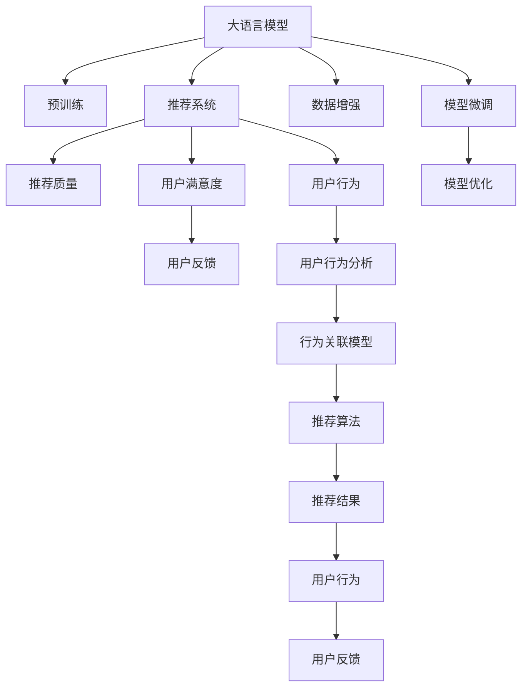

                 

## 1. 背景介绍

在互联网信息爆炸的时代，推荐系统作为信息过滤和智能匹配的重要工具，对用户个性化需求和体验的提升起着关键作用。传统的推荐系统多基于协同过滤、基于内容的推荐等方法，难以充分挖掘用户行为背后的深层次需求。近年来，随着深度学习和大模型的兴起，推荐系统开始引入预训练语言模型，以更好的理解用户行为和意图，提供更为精准的推荐结果。然而，如何将预训练模型的优势最大化，以提升推荐系统的用户体验，仍需系统性的评估和优化。本文将探讨在大模型赋能下，如何构建推荐系统用户体验评估体系，以指导实际应用和不断改进。

## 2. 核心概念与联系

### 2.1 核心概念概述

为更好地理解大模型推荐系统用户体验的评估体系，本节将介绍几个密切相关的核心概念：

- 大语言模型(Large Language Model, LLM)：以自回归(如GPT)或自编码(如BERT)模型为代表的大规模预训练语言模型。通过在海量无标签文本语料上进行预训练，学习通用的语言表示，具备强大的语言理解和生成能力。

- 预训练(Pre-training)：指在大规模无标签文本语料上，通过自监督学习任务训练通用语言模型的过程。常见的预训练任务包括言语建模、遮挡语言模型等。预训练使得模型学习到语言的通用表示。

- 推荐系统(Recommendation System)：基于用户历史行为和兴趣，通过算法生成个性化的物品推荐结果。目的是减少用户选择困难，提升用户体验和满意度。

- 用户满意度(User Satisfaction)：推荐系统使用户满意度的程度，衡量其推荐效果好坏的重要指标。

- 用户行为(User Behavior)：用户在使用推荐系统时所表现出的点击、购买、评价等行为数据。

- 推荐质量(Recommendation Quality)：推荐系统所推荐的物品与用户真实需求的匹配程度。

- 用户体验(User Experience)：用户在使用推荐系统的过程中，感受到的流畅性、可理解性、可靠性等各方面因素的组合。

这些核心概念之间的逻辑关系可以通过以下Mermaid流程图来展示：



这个流程图展示了大语言模型推荐系统的核心概念及其之间的关系：

1. 大语言模型通过预训练获得基础能力。
2. 推荐系统对预训练模型进行任务特定的优化，以生成个性化的物品推荐。
3. 推荐质量衡量推荐系统推荐物品与用户需求的匹配程度。
4. 用户满意度反映推荐系统使用户满意的程度。
5. 用户行为是推荐系统进行个性化推荐的基础数据。
6. 用户反馈进一步优化推荐系统。
7. 行为关联模型将用户行为分析与推荐算法结合，提升推荐质量。
8. 模型微调和优化确保推荐系统性能稳定。

这些概念共同构成了推荐系统的用户评估体系，使得用户能够获得更符合自己需求和偏好的推荐结果。

## 3. 核心算法原理 & 具体操作步骤
### 3.1 算法原理概述

基于大模型的推荐系统用户体验评估体系，本质上是一个从预训练模型到推荐算法，再到用户满意度评价的多层次优化过程。其核心思想是：将预训练的大模型视为强大的"特征提取器"，通过有监督或无监督的方式对其进行微调，使其能够生成高质量的推荐结果。推荐的物品需尽可能满足用户实际需求，从而提升用户满意度和体验。

形式化地，假设预训练模型为 $M_{\theta}$，其中 $\theta$ 为预训练得到的模型参数。推荐系统的推荐算法为 $F$，目标是通过优化模型参数 $\theta$，使得推荐结果与用户需求的匹配程度 $R$ 最大化：

$$
\max_{\theta} \sum_{i=1}^N r_i f(x_i; M_{\theta})
$$

其中 $x_i$ 表示用户的历史行为数据， $r_i$ 为每个行为对应的推荐评分，可以是用户给出的评分，也可以是从其他用户行为推断出的评分。$f(x_i; M_{\theta})$ 为推荐算法生成的物品评分，通常使用预训练语言模型对物品进行向量表示，并计算相似度得分。

### 3.2 算法步骤详解

基于大模型的推荐系统用户体验评估体系一般包括以下几个关键步骤：

**Step 1: 准备预训练模型和数据集**
- 选择合适的预训练语言模型 $M_{\theta}$ 作为初始化参数，如 BERT、GPT等。
- 准备推荐系统所需的数据集，包括用户行为数据、物品信息数据等。

**Step 2: 添加推荐适配层**
- 根据推荐任务类型，在预训练模型顶层设计合适的推荐得分计算方法。
- 对于基于内容的推荐，通常使用预训练语言模型对物品进行向量表示，并计算物品与用户兴趣的相似度得分。
- 对于协同过滤推荐，则设计用户与物品的交互矩阵，通过矩阵分解等方法计算推荐得分。

**Step 3: 设置微调超参数**
- 选择合适的优化算法及其参数，如 AdamW、SGD 等，设置学习率、批大小、迭代轮数等。
- 设置正则化技术及强度，包括权重衰减、Dropout、Early Stopping等。
- 确定冻结预训练参数的策略，如仅微调顶层，或全部参数都参与微调。

**Step 4: 执行梯度训练**
- 将训练集数据分批次输入模型，前向传播计算推荐得分。
- 反向传播计算参数梯度，根据设定的优化算法和学习率更新模型参数。
- 周期性在验证集上评估推荐结果，根据性能指标决定是否触发 Early Stopping。
- 重复上述步骤直到满足预设的迭代轮数或 Early Stopping 条件。

**Step 5: 测试和部署**
- 在测试集上评估微调后模型 $M_{\hat{\theta}}$ 的推荐效果。
- 使用微调后的模型对新物品进行推荐，集成到实际的应用系统中。
- 持续收集用户反馈，定期重新微调模型，以适应用户行为和需求的变化。

以上是基于大模型的推荐系统用户体验评估体系的一般流程。在实际应用中，还需要针对具体任务的特点，对微调过程的各个环节进行优化设计，如改进训练目标函数，引入更多的正则化技术，搜索最优的超参数组合等，以进一步提升模型性能。

### 3.3 算法优缺点

基于大模型的推荐系统用户体验评估体系具有以下优点：
1. 简单高效。只需准备少量用户行为数据，即可对预训练模型进行快速适配，生成高质量的推荐结果。
2. 通用适用。适用于各种推荐任务，包括基于内容的推荐、协同过滤推荐等，设计简单的任务适配层即可实现。
3. 参数高效。利用参数高效微调技术，在固定大部分预训练参数的情况下，仍可取得不错的推荐效果。
4. 效果显著。在学术界和工业界的诸多推荐任务上，基于大模型的方法已经刷新了最先进的性能指标。

同时，该方法也存在一定的局限性：
1. 依赖标注数据。推荐结果的质量很大程度上取决于标注数据的质量和数量，获取高质量标注数据的成本较高。
2. 模型泛化能力有限。当目标任务与预训练数据的分布差异较大时，推荐模型的泛化能力有限。
3. 推荐过程黑盒。用户难以理解推荐算法的决策逻辑，难以对其推荐结果进行调试和解释。
4. 安全性不足。推荐系统可能会推荐有害物品，或存在偏见，导致用户体验降低。

尽管存在这些局限性，但就目前而言，基于大模型的推荐系统仍是一种高效的推荐范式。未来相关研究的重点在于如何进一步降低推荐对标注数据的依赖，提高模型的少样本学习和跨领域迁移能力，同时兼顾可解释性和伦理安全性等因素。

### 3.4 算法应用领域

基于大模型的推荐系统用户体验评估体系在推荐系统领域已经得到了广泛的应用，覆盖了几乎所有常见任务，例如：

- 商品推荐：如电商平台商品推荐。通过用户行为数据，对商品进行向量表示，计算相似度得分。
- 视频推荐：如流媒体平台视频推荐。根据用户观看历史和评分，计算推荐得分。
- 音乐推荐：如音乐流媒体平台推荐。分析用户的听歌记录，推荐相似音乐。
- 新闻推荐：如新闻聚合平台推荐。根据用户阅读记录，推荐相关新闻。
- 广告推荐：如在线广告推荐。根据用户浏览行为，推荐相关广告。

除了上述这些经典任务外，大模型的推荐系统也被创新性地应用到更多场景中，如推荐系统中的增强学习、多模态推荐等，为推荐技术带来了全新的突破。随着预训练模型和推荐方法的不断进步，相信推荐系统必将在更广阔的应用领域大放异彩。

## 4. 数学模型和公式 & 详细讲解  
### 4.1 数学模型构建

本节将使用数学语言对基于大模型的推荐系统用户体验评估过程进行更加严格的刻画。

记预训练语言模型为 $M_{\theta}$，其中 $\theta$ 为预训练得到的模型参数。假设推荐任务为 $T$，用户行为数据为 $X=\{x_1, x_2, ..., x_N\}$，物品信息数据为 $Y=\{y_1, y_2, ..., y_M\}$。推荐算法的目标是最大化推荐质量 $R$，即：

$$
R = \max_{\theta} \sum_{i=1}^N \sum_{j=1}^M r_{ij} f(x_i, y_j; M_{\theta})
$$

其中 $r_{ij}$ 为物品 $y_j$ 对用户 $x_i$ 的推荐评分。$f(x_i, y_j; M_{\theta})$ 为物品 $y_j$ 在用户 $x_i$ 上下文中的推荐得分，通常使用余弦相似度、点积相似度等方法计算。

### 4.2 公式推导过程

以下我们以商品推荐为例，推导推荐得分函数及其梯度的计算公式。

假设用户行为数据 $x_i$ 为商品 ID，物品信息数据 $y_j$ 为商品描述。对于每个用户 $x_i$，推荐算法 $F$ 将物品 $y_j$ 的描述向量 $v_j$ 与用户 $x_i$ 的兴趣向量 $u_i$ 计算余弦相似度得分，得到推荐得分 $f(x_i, y_j; M_{\theta}) = \cos(u_i \cdot v_j)$。假设用户 $x_i$ 对物品 $y_j$ 的评分 $r_{ij} \in [0, 1]$，则推荐质量 $R$ 为：

$$
R = \max_{\theta} \sum_{i=1}^N \sum_{j=1}^M r_{ij} \cos(u_i \cdot v_j)
$$

根据链式法则，推荐得分函数对参数 $\theta$ 的梯度为：

$$
\frac{\partial R}{\partial \theta} = \frac{\partial}{\partial \theta} \sum_{i=1}^N \sum_{j=1}^M r_{ij} \cos(u_i \cdot v_j)
$$

在得到推荐得分函数的梯度后，即可带入参数更新公式，完成模型的迭代优化。重复上述过程直至收敛，最终得到适应下游推荐任务的最优模型参数 $\theta^*$。

## 5. 项目实践：代码实例和详细解释说明
### 5.1 开发环境搭建

在进行推荐系统开发前，我们需要准备好开发环境。以下是使用Python进行PyTorch开发的环境配置流程：

1. 安装Anaconda：从官网下载并安装Anaconda，用于创建独立的Python环境。

2. 创建并激活虚拟环境：
```bash
conda create -n recsys-env python=3.8 
conda activate recsys-env
```

3. 安装PyTorch：根据CUDA版本，从官网获取对应的安装命令。例如：
```bash
conda install pytorch torchvision torchaudio cudatoolkit=11.1 -c pytorch -c conda-forge
```

4. 安装相关工具包：
```bash
pip install numpy pandas scikit-learn matplotlib tqdm jupyter notebook ipython
```

5. 安装PyTorch Lightning：用于快速构建和训练深度学习模型，支持分布式训练和模型保存。

```bash
pip install torch-lightning
```

完成上述步骤后，即可在`recsys-env`环境中开始推荐系统开发。

### 5.2 源代码详细实现

这里我们以商品推荐为例，给出使用PyTorch Lightning对BERT模型进行推荐系统开发的PyTorch代码实现。

首先，定义推荐任务的数据处理函数：

```python
from torch.utils.data import Dataset
import torch

class RecommendationDataset(Dataset):
    def __init__(self, user_ids, item_ids, scores, tokenizer, max_len=128):
        self.user_ids = user_ids
        self.item_ids = item_ids
        self.scores = scores
        self.tokenizer = tokenizer
        self.max_len = max_len
        
    def __len__(self):
        return len(self.user_ids)
    
    def __getitem__(self, item):
        user_id = self.user_ids[item]
        item_id = self.item_ids[item]
        score = self.scores[item]
        
        # 将用户ID和商品ID拼接，形成文本输入
        user_item_text = str(user_id) + ' ' + str(item_id)
        encoding = self.tokenizer(user_item_text, return_tensors='pt', max_length=self.max_len, padding='max_length', truncation=True)
        input_ids = encoding['input_ids'][0]
        attention_mask = encoding['attention_mask'][0]
        
        # 构建推荐评分向量
        item_id_vector = torch.tensor([item_id], dtype=torch.long)
        item_score = torch.tensor([score], dtype=torch.float)
        item_vector = torch.stack([item_id_vector, item_score], dim=0)
        
        return {'input_ids': input_ids, 
                'attention_mask': attention_mask,
                'item_vector': item_vector}
```

然后，定义模型和优化器：

```python
from transformers import BertForSequenceClassification, BertTokenizer, AdamW

model = BertForSequenceClassification.from_pretrained('bert-base-cased', num_labels=1)
tokenizer = BertTokenizer.from_pretrained('bert-base-cased')

optimizer = AdamW(model.parameters(), lr=2e-5)
```

接着，定义训练和评估函数：

```python
from torch.utils.data import DataLoader
from tqdm import tqdm
from sklearn.metrics import mean_squared_error

device = torch.device('cuda') if torch.cuda.is_available() else torch.device('cpu')
model.to(device)

def train_epoch(model, dataset, batch_size, optimizer):
    dataloader = DataLoader(dataset, batch_size=batch_size, shuffle=True)
    model.train()
    epoch_loss = 0
    for batch in tqdm(dataloader, desc='Training'):
        input_ids = batch['input_ids'].to(device)
        attention_mask = batch['attention_mask'].to(device)
        item_vector = batch['item_vector'].to(device)
        model.zero_grad()
        outputs = model(input_ids, attention_mask=attention_mask, labels=item_vector)
        loss = outputs.loss
        epoch_loss += loss.item()
        loss.backward()
        optimizer.step()
    return epoch_loss / len(dataloader)

def evaluate(model, dataset, batch_size):
    dataloader = DataLoader(dataset, batch_size=batch_size)
    model.eval()
    true_scores = []
    pred_scores = []
    with torch.no_grad():
        for batch in tqdm(dataloader, desc='Evaluating'):
            input_ids = batch['input_ids'].to(device)
            attention_mask = batch['attention_mask'].to(device)
            item_vector = batch['item_vector'].to(device)
            batch_true_scores = item_vector[0]
            batch_pred_scores = model(input_ids, attention_mask=attention_mask).logits[0]
            for true_score, pred_score in zip(batch_true_scores, batch_pred_scores):
                true_scores.append(true_score)
                pred_scores.append(pred_score)
                
    mse = mean_squared_error(true_scores, pred_scores)
    print(f"Evaluation MSE: {mse:.4f}")
```

最后，启动训练流程并在测试集上评估：

```python
epochs = 5
batch_size = 16

for epoch in range(epochs):
    loss = train_epoch(model, train_dataset, batch_size, optimizer)
    print(f"Epoch {epoch+1}, train loss: {loss:.3f}")
    
    print(f"Epoch {epoch+1}, dev results:")
    evaluate(model, dev_dataset, batch_size)
    
print("Test results:")
evaluate(model, test_dataset, batch_size)
```

以上就是使用PyTorch Lightning对BERT模型进行商品推荐任务开发的完整代码实现。可以看到，得益于PyTorch Lightning的封装和分布式训练支持，推荐系统的训练过程变得简洁高效。

### 5.3 代码解读与分析

让我们再详细解读一下关键代码的实现细节：

**RecommendationDataset类**：
- `__init__`方法：初始化用户ID、商品ID、评分、分词器等关键组件。
- `__len__`方法：返回数据集的样本数量。
- `__getitem__`方法：对单个样本进行处理，将用户ID和商品ID拼接为文本输入，进行token化处理，并将评分向量化处理，准备模型所需的输入。

**tokenizer和AdamW定义**：
- 定义BERT分词器和AdamW优化器，用于初始化模型和更新模型参数。

**训练和评估函数**：
- 使用PyTorch的DataLoader对数据集进行批次化加载，供模型训练和推理使用。
- 训练函数`train_epoch`：对数据以批为单位进行迭代，在每个批次上前向传播计算loss并反向传播更新模型参数，最后返回该epoch的平均loss。
- 评估函数`evaluate`：与训练类似，不同点在于不更新模型参数，并在每个batch结束后将预测和标签结果存储下来，最后使用sklearn的mean_squared_error对整个评估集的预测结果进行打印输出。

**训练流程**：
- 定义总的epoch数和batch size，开始循环迭代
- 每个epoch内，先在训练集上训练，输出平均loss
- 在验证集上评估，输出评估指标（此处使用均方误差MSE）
- 所有epoch结束后，在测试集上评估，给出最终测试结果

可以看到，PyTorch Lightning配合BERT的代码实现变得简洁高效。开发者可以将更多精力放在数据处理、模型改进等高层逻辑上，而不必过多关注底层的实现细节。

当然，工业级的系统实现还需考虑更多因素，如模型的保存和部署、超参数的自动搜索、更灵活的任务适配层等。但核心的推荐范式基本与此类似。

## 6. 实际应用场景
### 6.1 电子商务推荐

基于大语言模型推荐系统的用户体验评估体系，已经在电子商务平台推荐中得到了广泛的应用。电商平台通过收集用户历史浏览、购买、评价等行为数据，构建商品描述和用户行为的语义关联，能够快速生成个性化的商品推荐结果，提升用户体验和满意度。

在技术实现上，可以构建基于大语言模型的推荐模型，对用户行为数据进行微调，学习商品描述与用户行为之间的语义关联，生成推荐结果。结合用户评分和反馈信息，进一步优化模型性能，使推荐结果更加精准。例如，京东、亚马逊等电商巨头已经在大规模商品推荐中，成功应用了基于大模型的推荐技术，显著提升了推荐效果和用户满意度。

### 6.2 音乐流媒体推荐

音乐流媒体平台如Spotify、网易云音乐等，也通过基于大模型的推荐系统，为用户提供个性化的音乐推荐服务。推荐系统根据用户听歌记录、评分等行为数据，生成音乐推荐列表，提升用户的音乐体验。

在具体实现上，可以使用BERT等大语言模型，将音乐名称、歌词、歌手等描述信息进行编码，构建推荐模型。结合用户行为数据，计算推荐得分，生成推荐列表。Spotify等平台已经利用大模型推荐技术，通过实时分析用户行为数据，不断优化推荐结果，极大地提高了用户体验。

### 6.3 新闻聚合推荐

新闻聚合平台如RSS reader、Google News等，也需要高效精准的推荐系统，为用户推荐高质量的新闻内容。推荐系统通过分析用户阅读记录、评分等行为数据，生成相关新闻推荐，提升用户的阅读体验。

在具体实现上，可以使用BERT等大语言模型，将新闻标题、摘要、作者等描述信息进行编码，构建推荐模型。结合用户行为数据，计算推荐得分，生成推荐列表。Google News等平台已经在大规模新闻推荐中，成功应用了基于大模型的推荐技术，显著提升了新闻推荐质量和用户体验。

### 6.4 未来应用展望

随着大语言模型推荐系统的发展，未来的推荐系统将具备更强的个性化推荐能力，带来更佳的用户体验。

在智能家居领域，基于大模型的推荐系统可以为用户提供智能家居设备的个性化推荐，提升用户生活便捷性和舒适性。例如，通过分析用户行为数据，推荐最符合用户习惯的智能家居设备。

在教育领域，推荐系统可以根据学生的学习行为数据，推荐个性化的学习内容，提升学习效果和体验。例如，根据学生的课堂表现、作业完成情况等数据，推荐相应的学习资源。

在社交媒体领域，推荐系统可以根据用户的行为数据，推荐朋友、新闻、视频等个性化内容，提升社交体验。例如，根据用户的朋友关系、点赞、评论等数据，推荐相关内容。

此外，在医疗、金融、旅游等众多领域，基于大模型的推荐系统也将不断涌现，为用户的日常工作和生活带来更多便利和智能。相信随着技术的不断进步，大模型推荐系统必将在更广泛的应用领域大放异彩，提升用户的整体体验和满意度。

## 7. 工具和资源推荐
### 7.1 学习资源推荐

为了帮助开发者系统掌握大模型推荐系统的理论基础和实践技巧，这里推荐一些优质的学习资源：

1. 《推荐系统实战》系列博文：由推荐系统领域专家撰写，详细介绍了推荐系统的原理、方法、工具等，是推荐系统开发者的必备指南。

2. CS224N《深度学习自然语言处理》课程：斯坦福大学开设的NLP明星课程，有Lecture视频和配套作业，涵盖推荐系统的经典模型和最新研究。

3. 《推荐系统》书籍：作者为Recommender Systems领域的知名学者，全面介绍了推荐系统的各种算法、评估指标和实际应用，适合进阶学习。

4. Kaggle竞赛平台：包含大量推荐系统相关的竞赛数据集和样例代码，能够帮助开发者在实战中提升推荐技能。

5. RecSys论文库：推荐系统领域的权威论文库，涵盖各个推荐任务、方法和评估指标的研究，适合深入研究。

通过对这些资源的学习实践，相信你一定能够快速掌握大语言模型推荐系统的精髓，并用于解决实际的推荐问题。
###  7.2 开发工具推荐

高效的开发离不开优秀的工具支持。以下是几款用于大语言模型推荐系统开发的常用工具：

1. PyTorch Lightning：基于PyTorch的快速构建和训练深度学习模型的框架，支持分布式训练和模型保存。

2. TensorFlow Serving：用于部署深度学习模型的通用框架，支持多种模型格式和推理引擎。

3. NGINX：高性能的网络代理服务器，支持负载均衡、缓存等功能，可以与推荐系统进行高效集成。

4. ELK Stack：用于日志收集和分析的工具集，包括Elasticsearch、Logstash和Kibana，可以帮助开发者对推荐系统性能进行监控和调试。

5. Apache Kafka：高吞吐量的消息队列系统，可以用于处理推荐系统中的实时数据流。

6. Apache Flink：流式计算框架，可以处理推荐系统中的实时数据和流数据，支持复杂的推荐算法和优化。

合理利用这些工具，可以显著提升大语言模型推荐系统的开发效率，加快创新迭代的步伐。

### 7.3 相关论文推荐

大语言模型推荐系统的发展源于学界的持续研究。以下是几篇奠基性的相关论文，推荐阅读：

1. Attention Is All You Need：提出Transformer结构，开启了NLP领域的预训练大模型时代。

2. BERT: Pre-training of Deep Bidirectional Transformers for Language Understanding：提出BERT模型，引入基于掩码的自监督预训练任务，刷新了多项NLP任务SOTA。

3. Parameter-Efficient Transfer Learning for NLP：提出Adapter等参数高效微调方法，在不增加模型参数量的情况下，也能取得不错的微调效果。

4. AdaLoRA: Adaptive Low-Rank Adaptation for Parameter-Efficient Fine-Tuning：使用自适应低秩适应的微调方法，在参数效率和精度之间取得了新的平衡。

5. FastTabNet: A Fast and Scalable Tabular Recommendation Algorithm with Query-aware Cross-features：提出基于TabNet的快速推荐算法，兼顾精度和效率，适用于表格数据的推荐系统。

这些论文代表了大语言模型推荐系统的发展脉络。通过学习这些前沿成果，可以帮助研究者把握学科前进方向，激发更多的创新灵感。

## 8. 总结：未来发展趋势与挑战
### 8.1 总结

本文对基于大语言模型的推荐系统用户体验评估体系进行了全面系统的介绍。首先阐述了大语言模型和推荐系统用户体验评估的的研究背景和意义，明确了用户体验评估在推荐系统中的重要性。其次，从原理到实践，详细讲解了基于大语言模型的推荐系统用户体验评估体系的数学原理和关键步骤，给出了推荐系统开发的完整代码实例。同时，本文还广泛探讨了推荐系统在电商、音乐、新闻等多个行业领域的应用前景，展示了推荐系统的广泛应用价值。

通过本文的系统梳理，可以看到，基于大语言模型的推荐系统用户体验评估体系正在成为推荐系统的重要范式，极大地拓展了预训练语言模型的应用边界，催生了更多的落地场景。受益于大规模语料的预训练，推荐系统以更低的时间和标注成本，取得了不俗的推荐效果，有力推动了推荐技术的产业化进程。未来，伴随预训练语言模型和推荐方法的不断进步，相信推荐系统必将在更广阔的应用领域大放异彩，深刻影响人类的生产生活方式。

### 8.2 未来发展趋势

展望未来，大语言模型推荐系统用户体验评估体系将呈现以下几个发展趋势：

1. 推荐系统智能化程度提升。随着深度学习和大模型技术的进步，推荐系统将能够更好地理解用户行为背后的深层次需求，提供更为精准的推荐结果。推荐算法将融合更多的符号化知识，引入因果推理、对抗学习等先进技术，提升推荐质量。

2. 多模态数据融合增强。推荐系统将融合视觉、语音、行为等多种模态数据，构建更全面、准确的推荐模型。视觉图像和行为数据的引入，将显著提升推荐系统的准确性和鲁棒性。

3. 实时性增强。推荐系统将采用流式计算和分布式训练，提升实时处理能力，快速响应用户行为变化，提供实时推荐结果。

4. 用户隐私保护强化。推荐系统将采用差分隐私、联邦学习等技术，保护用户隐私数据，提升用户对推荐系统的信任度。

5. 个性化推荐精准度提升。推荐系统将通过多任务学习、迁移学习等方法，提升个性化推荐精准度，避免推荐内容同质化。

6. 推荐系统伦理道德合规。推荐系统将引入伦理导向的评估指标，避免推荐有害内容，确保推荐结果符合人类价值观和伦理道德。

这些趋势凸显了大语言模型推荐系统的未来发展方向，预示着推荐系统将迈向更为智能、高效、安全、个性化的阶段。

### 8.3 面临的挑战

尽管大语言模型推荐系统已经取得了瞩目成就，但在迈向更加智能化、普适化应用的过程中，它仍面临着诸多挑战：

1. 数据分布偏差。推荐系统对数据分布的敏感性较高，数据分布偏差可能导致推荐结果偏差。如何获取广泛、均衡的数据分布，提升推荐系统的泛化能力，仍需进一步研究。

2. 推荐系统冷启动问题。对于新用户和新物品，推荐系统难以提供高质量的推荐结果。如何利用用户少量行为数据进行冷启动，提升推荐系统的覆盖面和效果，是重要的研究方向。

3. 推荐系统延迟问题。推荐系统的实时推荐能力需要高效的计算和存储支持。如何优化计算图、采用分布式训练，提升推荐系统的实时响应速度，仍需深入研究。

4. 用户隐私保护。推荐系统需要大量用户数据支持，如何在保证用户隐私的同时，获取有效数据，是推荐系统面临的重要挑战。

5. 推荐系统安全风险。推荐系统存在潜在的恶意推荐风险，如何防止推荐系统被恶意利用，是推荐系统必须解决的安全问题。

6. 推荐系统模型可解释性。推荐系统往往被认为是"黑盒"系统，用户难以理解推荐逻辑。如何增强推荐系统的可解释性，提升用户对推荐系统的信任度，是未来的重要研究课题。

这些挑战凸显了大语言模型推荐系统的未来发展之路，需要从技术、伦理、应用等多个层面进行深入研究和持续优化。只有勇于创新、敢于突破，才能不断拓展推荐系统的边界，使其更好地服务人类社会。

### 8.4 研究展望

面对大语言模型推荐系统所面临的种种挑战，未来的研究需要在以下几个方面寻求新的突破：

1. 探索无监督和半监督推荐方法。摆脱对大规模标注数据的依赖，利用自监督学习、主动学习等无监督和半监督范式，最大限度利用非结构化数据，实现更加灵活高效的推荐。

2. 研究参数高效和计算高效的推荐范式。开发更加参数高效的推荐方法，在固定大部分预训练参数的情况下，仍可取得不错的推荐效果。同时优化推荐模型的计算图，减少前向传播和反向传播的资源消耗，实现更加轻量级、实时性的部署。

3. 融合因果和对比学习范式。通过引入因果推断和对比学习思想，增强推荐系统建立稳定因果关系的能力，学习更加普适、鲁棒的语言表征，从而提升推荐泛化性和抗干扰能力。

4. 引入更多先验知识。将符号化的先验知识，如知识图谱、逻辑规则等，与神经网络模型进行巧妙融合，引导推荐过程学习更准确、合理的语言模型。同时加强不同模态数据的整合，实现视觉、语音等多模态信息与文本信息的协同建模。

5. 结合因果分析和博弈论工具。将因果分析方法引入推荐系统，识别出推荐决策的关键特征，增强推荐结果的因果性和逻辑性。借助博弈论工具刻画人机交互过程，主动探索并规避推荐系统的脆弱点，提高系统稳定性。

6. 纳入伦理道德约束。在推荐系统训练目标中引入伦理导向的评估指标，过滤和惩罚有害的推荐内容，确保推荐结果符合人类价值观和伦理道德。

这些研究方向的探索，必将引领大语言模型推荐系统走向更高的台阶，为构建安全、可靠、可解释、可控的智能推荐系统铺平道路。面向未来，大语言模型推荐系统还需要与其他人工智能技术进行更深入的融合，如知识表示、因果推理、强化学习等，多路径协同发力，共同推动推荐技术的进步。只有积极创新、主动应对，才能不断提升推荐系统的用户满意度，使其成为未来智能推荐的主流技术。

## 9. 附录：常见问题与解答

**Q1：基于大语言模型的推荐系统如何平衡个性化推荐和泛化能力？**

A: 基于大语言模型的推荐系统可以通过多任务学习、迁移学习等方法，提升个性化推荐的同时，保持对新物品和数据的泛化能力。例如，在微调推荐模型时，可以将多任务损失函数进行组合，同时优化推荐结果和泛化指标。此外，采用少样本学习技术，在少量标注数据的情况下，仍能对新物品进行有效推荐。

**Q2：推荐系统中的冷启动问题如何解决？**

A: 推荐系统中的冷启动问题可以通过多维数据融合、知识图谱嵌入、标签传播等方法来解决。例如，利用用户少量行为数据，构建用户的兴趣图谱，通过标签传播算法，逐步挖掘用户兴趣，进行推荐。同时，引入先验知识，如领域专家规则、知识图谱等，帮助推荐系统快速理解新物品的特征，提升推荐效果。

**Q3：推荐系统中的实时推荐如何实现？**

A: 推荐系统中的实时推荐可以通过流式计算和分布式训练实现。例如，采用Apache Flink等流式计算框架，实时处理用户行为数据，快速生成推荐结果。同时，利用分布式训练和模型压缩技术，提升推荐系统的处理能力和实时响应速度。

**Q4：推荐系统如何保护用户隐私？**

A: 推荐系统可以通过差分隐私、联邦学习等技术，保护用户隐私。例如，采用差分隐私技术，对用户数据进行扰动处理，防止隐私泄露。采用联邦学习技术，在本地设备上训练推荐模型，保护用户数据。此外，采用匿名化和脱敏技术，降低用户数据泄露风险。

**Q5：推荐系统的伦理道德约束如何确保？**

A: 推荐系统的伦理道德约束可以通过伦理导向的评估指标、推荐结果审查、人工干预等方式来确保。例如，在推荐系统中引入伦理导向的指标，如多样性、公平性、不偏袒等，防止有害内容的推荐。通过人工干预和推荐结果审查，及时发现和处理有害推荐结果。

这些回答试图解决推荐系统中常见的问题，为开发者提供了实际的指导和建议。相信通过不断优化推荐系统，提升用户体验，大语言模型推荐系统必将在未来的智能推荐领域发挥更大的作用。

