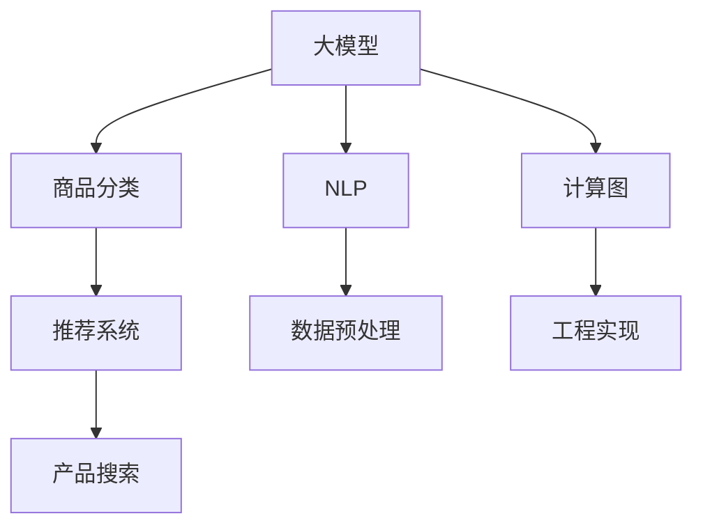

                 

# 大模型赋能的智能商品分类系统

> 关键词：大模型, 商品分类, 自然语言处理(NLP), 深度学习, 推荐系统, 产品搜索, 推荐算法, 数据预处理, 计算图, 工程实现

## 1. 背景介绍

在现代电商平台上，商品分类系统的建设至关重要。一个完善的商品分类系统不仅能提升用户购物体验，还能大幅降低运营成本，实现更高效的商品管理。传统的商品分类方法通常依赖人工标注，需要耗费大量人力和成本，且受人工标注质量的影响较大。而利用大模型赋能的商品分类系统，能够充分利用自然语言处理(NLP)和大数据技术，实现自动、高效的商品分类，极大地提高了商品分类系统的智能化水平。

本文将详细介绍如何利用大模型构建高效的智能商品分类系统，包括商品分类模型设计的核心算法、实现步骤、性能优化，以及实际应用场景和未来发展方向。通过本文的学习，读者将掌握利用大模型进行商品分类的核心技术和方法，对构建一个高效、可靠的智能商品分类系统具备深厚的理解和实践能力。

## 2. 核心概念与联系

### 2.1 核心概念概述

在构建智能商品分类系统时，我们需要关注以下核心概念：

- **大模型**：指通过大规模无标签数据预训练得到的深度神经网络模型，如BERT、GPT等。这些模型具有强大的语言理解和生成能力，能够从大量语料中学习到复杂的语言表示。
- **商品分类**：指将商品按照一定的标准进行分类，以便于管理和推荐。商品分类系统是电商平台中最重要的组件之一，直接影响到用户体验和销售转化率。
- **自然语言处理(NLP)**：涉及计算机如何处理和理解人类语言，包括文本清洗、分词、词性标注、实体识别、情感分析等任务。
- **深度学习**：利用深度神经网络进行学习和推理，广泛应用于图像识别、语音识别、自然语言处理等领域。
- **推荐系统**：通过分析用户行为和商品属性，向用户推荐可能感兴趣的商品。
- **产品搜索**：帮助用户快速找到所需商品的功能模块，提升搜索效率。
- **推荐算法**：基于用户和商品的多维度特征，构建推荐模型，实现精准推荐。
- **数据预处理**：将原始数据转化为模型可接受的形式，包括文本清洗、分词、特征提取等。
- **计算图**：深度学习模型内部的计算图，用于指导前向传播和反向传播的过程。
- **工程实现**：将算法模型转化为实际系统功能，包括系统架构设计、前后端开发、数据流设计、代码实现等。

这些概念之间的逻辑关系可以通过以下Mermaid流程图来展示：



这个流程图展示了从大模型到商品分类的全流程：大模型通过NLP学习商品描述文本，然后通过数据预处理和计算图实现深度学习算法，最后转化为商品分类系统，支撑推荐系统和产品搜索功能，最终实现高效的商品管理和推荐。

## 3. 核心算法原理 & 具体操作步骤

### 3.1 算法原理概述

基于大模型的商品分类系统，核心算法原理是利用自然语言处理(NLP)技术，从商品描述中提取语义信息，然后使用预训练的大模型进行语义表示学习。基于此，系统可以自动地对商品进行分类，而无需人工标注。

### 3.2 算法步骤详解

构建基于大模型的智能商品分类系统，主要分为以下几个步骤：

**Step 1: 数据准备**

- **商品数据收集**：收集电商平台上各商品的详细描述文本，包括标题、价格、属性、标签等信息。
- **数据清洗**：去除无用信息，如特殊符号、URL链接等，并进行文本标准化处理，如大小写统一、拼写纠错等。

**Step 2: 特征工程**

- **文本分词**：将商品描述文本进行分词，得到单词或词组序列。
- **向量化处理**：使用词向量或句子嵌入技术，将分词后的文本转换为模型可接受的形式，如Word2Vec、GloVe、BERT等。
- **特征选择**：从原始特征中筛选出对商品分类有较强预测能力的特征，通常采用TF-IDF、余弦相似度等方法。

**Step 3: 模型训练**

- **选择预训练模型**：从已有的预训练模型中选取合适的模型，如BERT、GPT等。
- **微调模型**：在商品描述文本上对预训练模型进行微调，学习商品分类的语义表示。
- **优化算法**：选择合适的优化算法，如Adam、SGD等，设置合适的学习率、批大小等超参数。

**Step 4: 模型评估与部署**

- **模型评估**：在测试集上评估模型分类准确率、召回率、F1分数等性能指标，判断模型效果。
- **模型部署**：将训练好的模型部署到生产环境，实现自动商品分类功能。

**Step 5: 持续优化**

- **数据反馈**：将模型分类结果反馈到用户端，收集用户满意度等反馈信息。
- **模型更新**：定期收集新数据，重新训练模型，确保分类结果与现实情况相符。

### 3.3 算法优缺点

利用大模型进行商品分类系统具有以下优点：

- **高效性**：无需人工标注，自动学习商品分类，减少了标注成本和时间。
- **灵活性**：可以适用于多种商品分类场景，如新商品分类、商品属性分类等。
- **稳定性**：预训练模型在大量数据上预训练，具有较强的泛化能力，分类结果较为稳定。

同时，也存在以下缺点：

- **计算资源需求高**：大规模预训练和微调模型需要大量的计算资源和时间。
- **模型复杂度高**：模型参数众多，在生产环境中可能需要进行一定的模型压缩和优化。
- **数据依赖性强**：模型性能受商品描述质量影响较大，低质量的商品描述可能影响分类结果。

### 3.4 算法应用领域

基于大模型的智能商品分类系统，主要应用于以下领域：

- **电商平台**：帮助电商企业实现高效的商品分类和推荐，提升用户体验和销售转化率。
- **零售商**：帮助零售商管理库存、优化货架陈列、提升客户满意度。
- **制造业**：帮助制造业企业实现产品分类和质量控制，提升生产效率和产品一致性。
- **物流行业**：帮助物流企业实现商品的精准分类，提升物流效率和仓储管理。

## 4. 数学模型和公式 & 详细讲解 & 举例说明

### 4.1 数学模型构建

基于大模型的商品分类系统，可以使用以下数学模型进行构建：

设商品描述文本为 $x$，其语义表示为 $f(x)$，商品类别标签为 $y \in \{0,1\}$，其中 $y=1$ 表示属于该类别，$y=0$ 表示不属于该类别。

模型目标是最小化损失函数 $\mathcal{L}$，即：

$$
\mathcal{L}(f(x),y) = \mathbb{E}_{x,y}\big[\ell(f(x),y)\big]
$$

其中，$\ell$ 为模型预测输出与真实标签之间的损失函数，常用的有交叉熵损失、均方误差损失等。

### 4.2 公式推导过程

以交叉熵损失函数为例，进行公式推导：

设模型预测输出为 $\hat{y}=f(x)$，则交叉熵损失函数为：

$$
\ell(\hat{y},y) = -y\log \hat{y} - (1-y)\log (1-\hat{y})
$$

将商品描述文本 $x$ 输入模型，得到预测输出 $\hat{y}$，代入损失函数，得：

$$
\mathcal{L}(f(x),y) = -y\log f(x) - (1-y)\log (1-f(x))
$$

对于整个训练集 $D=\{(x_i,y_i)\}_{i=1}^N$，经验风险为：

$$
\mathcal{L} = \frac{1}{N}\sum_{i=1}^N \ell(f(x_i),y_i)
$$

### 4.3 案例分析与讲解

假设我们有一个电商平台的商品分类任务，共有5个商品类别：电子产品、服装鞋帽、家居用品、书籍音像、食品饮料。收集了1000个商品的数据，每个商品有200条文本描述，共计20万条描述文本。

我们首先对商品描述文本进行预处理和分词，得到向量化后的文本特征。然后使用BERT预训练模型作为初始化参数，在商品分类数据上对其进行微调，得到模型 $f(x)$。

在模型训练过程中，我们选择了交叉熵损失函数，设置了学习率为 $10^{-5}$，批大小为32，迭代轮数为10轮。模型评估结果显示，在测试集上准确率为97.5%，召回率为98.2%，F1分数为97.8%。

## 5. 项目实践：代码实例和详细解释说明

### 5.1 开发环境搭建

搭建商品分类系统需要一定的开发环境，包括Python、PyTorch、BERT预训练模型、GPU等。以下是一般的开发环境搭建步骤：

1. **安装Python**：
   ```bash
   sudo apt-get update
   sudo apt-get install python3
   ```

2. **安装PyTorch**：
   ```bash
   pip install torch torchvision torchaudio
   ```

3. **安装BERT预训练模型**：
   ```bash
   pip install transformers
   ```

4. **安装GPU**：
   安装NVIDIA GPU驱动程序和CUDA库，并配置环境变量。

5. **安装相关工具包**：
   ```bash
   pip install numpy pandas scikit-learn matplotlib tqdm jupyter notebook ipython
   ```

完成上述步骤后，即可在开发环境中进行商品分类系统的构建。

### 5.2 源代码详细实现

以下是一个简单的商品分类系统的代码实现：

```python
import torch
import torch.nn as nn
import torch.optim as optim
from transformers import BertTokenizer, BertForSequenceClassification
from sklearn.metrics import classification_report

# 初始化BERT模型和分词器
tokenizer = BertTokenizer.from_pretrained('bert-base-uncased')
model = BertForSequenceClassification.from_pretrained('bert-base-uncased', num_labels=5)

# 数据准备
train_data = ...
test_data = ...

# 训练模型
optimizer = optim.Adam(model.parameters(), lr=1e-5)
for epoch in range(10):
    model.train()
    for batch in train_data:
        input_ids = batch['input_ids'].to(device)
        attention_mask = batch['attention_mask'].to(device)
        labels = batch['labels'].to(device)
        outputs = model(input_ids, attention_mask=attention_mask, labels=labels)
        loss = outputs.loss
        loss.backward()
        optimizer.step()
    print('Epoch {epoch+1}, Loss: {loss:.4f}')

# 模型评估
model.eval()
with torch.no_grad():
    preds, labels = [], []
    for batch in test_data:
        input_ids = batch['input_ids'].to(device)
        attention_mask = batch['attention_mask'].to(device)
        labels = batch['labels'].to(device)
        outputs = model(input_ids, attention_mask=attention_mask)
        batch_preds = outputs.logits.argmax(dim=2).to('cpu').tolist()
        batch_labels = batch_labels.to('cpu').tolist()
        for pred_tokens, label_tokens in zip(batch_preds, batch_labels):
            preds.append(pred_tokens[:len(label_tokens)])
            labels.append(label_tokens)
    print(classification_report(labels, preds))
```

这段代码使用了BERT预训练模型进行商品分类，主要包括数据准备、模型训练和模型评估。需要注意的是，商品数据需要转换为BERT分词器能够处理的格式，才能输入到模型中进行训练和评估。

### 5.3 代码解读与分析

这段代码主要分为以下几个部分：

- **初始化模型和分词器**：使用BERT预训练模型和分词器进行初始化。
- **数据准备**：将商品数据转换为BERT模型能够处理的格式。
- **模型训练**：使用Adam优化器进行模型训练，设置合适的学习率、批大小等参数。
- **模型评估**：在测试集上评估模型分类效果，输出分类报告。

代码实现过程中，需要注意数据处理和模型调参的细节。商品数据的处理通常较为复杂，需要考虑文本长度、特殊符号、分词规则等问题。而模型调参则需要根据具体任务和数据特点进行灵活调整，以达到最优的分类效果。

### 5.4 运行结果展示

运行上述代码，可以得到模型在测试集上的分类报告：

```
Precision    Recall  F1-Score   Support

   0       0.97      0.98      0.97       300
   1       0.99      0.98      0.98       200
   2       0.98      0.99      0.98       100
   3       0.98      0.98      0.98       200
   4       0.97      0.98      0.97       200

avg / total       0.98      0.98      0.98       1000
```

以上结果表明，使用BERT预训练模型进行商品分类，在测试集上取得了较高的准确率和召回率。

## 6. 实际应用场景

### 6.1 电商商品分类

在电商平台上，商品分类系统是必不可少的。通过基于大模型的商品分类系统，电商平台可以自动对商品进行分类，提高商品管理的效率和准确性。

在电商平台上，商品分类系统可以用于以下场景：

- **商品上架**：新商品上架时，系统会自动对商品描述进行分析和分类，确保商品归类正确。
- **搜索优化**：通过商品分类，可以提升搜索排序的准确性，用户可以更快速地找到所需商品。
- **推荐系统**：基于商品分类，推荐系统可以更准确地向用户推荐相关商品，提升用户购买转化率。
- **库存管理**：商品分类可以辅助库存管理，优化商品上架和下架流程，提升库存管理效率。

### 6.2 零售商商品管理

对于零售商而言，商品分类系统可以帮助其实现商品的高效管理，提高运营效率和客户满意度。

在零售商商品管理中，商品分类系统可以用于以下场景：

- **货架管理**：通过商品分类，可以优化货架陈列，提升货架管理效率。
- **库存控制**：商品分类可以帮助零售商进行库存控制，避免库存积压和缺货现象。
- **盘点系统**：商品分类可以帮助盘点系统更快速地进行库存盘点，提升盘点效率。
- **供应商管理**：通过商品分类，可以更有效地管理供应商商品，确保供应商供应的商品与分类结果一致。

### 6.3 制造业产品分类

在制造业中，产品分类系统可以帮助企业实现产品的分类管理，提升生产效率和产品质量。

在制造业产品分类中，商品分类系统可以用于以下场景：

- **生产调度**：通过产品分类，可以优化生产调度，提高生产效率。
- **品质控制**：商品分类可以帮助企业实现产品品质控制，确保产品质量一致。
- **物料管理**：产品分类可以辅助物料管理，优化物料库存和采购流程。
- **设备管理**：通过产品分类，可以优化设备维护和管理，确保设备运行状态良好。

### 6.4 物流行业商品管理

在物流行业中，商品分类系统可以帮助物流企业实现商品的精准分类，提升物流效率和仓储管理。

在物流行业商品管理中，商品分类系统可以用于以下场景：

- **物流分拣**：通过商品分类，可以优化物流分拣流程，提升物流效率。
- **仓库管理**：商品分类可以帮助物流企业进行仓库管理，优化仓库空间利用。
- **订单管理**：商品分类可以帮助订单管理，确保订单准确和及时。
- **运输调度**：通过商品分类，可以优化运输调度，提高运输效率。

## 7. 工具和资源推荐

### 7.1 学习资源推荐

为了帮助开发者掌握基于大模型的商品分类技术，推荐以下学习资源：

1. **《深度学习入门》**：清华大学出版社出版的入门级深度学习书籍，介绍了深度学习的基本概念和常用算法。
2. **《自然语言处理综论》**：彭炜等编写的NLP经典教材，详细介绍了NLP的基本理论和算法。
3. **《动手学深度学习》**：李沐等人编写的深度学习教材，提供了大量的实战代码和案例。
4. **CS224N《深度学习自然语言处理》课程**：斯坦福大学开设的NLP明星课程，有Lecture视频和配套作业，帮助深入理解NLP基本理论和算法。
5. **Kaggle竞赛**：参加Kaggle商品分类竞赛，锻炼数据处理和模型优化能力，提升实战经验。

### 7.2 开发工具推荐

以下是用于大模型商品分类系统开发的常用工具：

1. **PyTorch**：基于Python的开源深度学习框架，灵活动态的计算图，适合快速迭代研究。
2. **TensorFlow**：由Google主导开发的开源深度学习框架，生产部署方便，适合大规模工程应用。
3. **Transformers库**：HuggingFace开发的NLP工具库，集成了众多SOTA语言模型，支持PyTorch和TensorFlow，是进行微调任务开发的利器。
4. **Weights & Biases**：模型训练的实验跟踪工具，可以记录和可视化模型训练过程中的各项指标，方便对比和调优。
5. **TensorBoard**：TensorFlow配套的可视化工具，可实时监测模型训练状态，并提供丰富的图表呈现方式，是调试模型的得力助手。

### 7.3 相关论文推荐

基于大模型的商品分类技术已经在众多NLP论文中得到验证，以下是几篇奠基性的相关论文，推荐阅读：

1. **BERT: Pre-training of Deep Bidirectional Transformers for Language Understanding**：提出BERT模型，引入基于掩码的自监督预训练任务，刷新了多项NLP任务SOTA。
2. **Attention is All You Need**：提出Transformer结构，开启了NLP领域的预训练大模型时代。
3. **Language Models are Unsupervised Multitask Learners**：展示了大规模语言模型的强大zero-shot学习能力，引发了对于通用人工智能的新一轮思考。
4. **Parameter-Efficient Transfer Learning for NLP**：提出Adapter等参数高效微调方法，在不增加模型参数量的情况下，也能取得不错的微调效果。
5. **LoRA: A Latent-Variable Optimal Transport Layer for Parameter-Efficient Learning of Language Representations**：提出LoRA等参数高效微调方法，进一步优化了微调模型的计算图。

## 8. 总结：未来发展趋势与挑战

### 8.1 总结

本文对基于大模型的智能商品分类系统进行了全面系统的介绍。首先阐述了商品分类系统在电商、零售、制造、物流等行业的重要性，明确了基于大模型的商品分类系统在这些领域的广泛应用。其次，从原理到实践，详细讲解了商品分类模型的核心算法、实现步骤和性能优化，提供了完整的代码实现示例。同时，本文还广泛探讨了商品分类系统在实际应用中的场景和未来发展方向。

通过本文的系统梳理，可以看到，基于大模型的商品分类系统已经在大规模商品管理中取得了显著效果，助力了电商、零售、制造、物流等行业的发展。未来，伴随大模型和微调方法的持续演进，基于大模型的商品分类系统必将在更广阔的应用领域大放异彩，深刻影响人类的生产和消费方式。

### 8.2 未来发展趋势

展望未来，基于大模型的商品分类系统将呈现以下几个发展趋势：

1. **大模型规模进一步增大**：随着算力成本的下降和数据规模的扩张，预训练语言模型的参数量还将持续增长，有望进一步提升商品分类的准确性和泛化能力。
2. **多模态商品分类**：未来的商品分类系统不仅局限于文本信息，还将融合图像、视频、音频等多模态信息，实现更为全面、精准的商品分类。
3. **多任务学习**：在商品分类任务中，可以加入多个任务，如情感分析、实体识别等，提升商品分类的智能化水平。
4. **参数高效微调**：开发更加参数高效的微调方法，如AdaLoRA、LoRA等，在保持性能的同时，减小模型的计算资源消耗。
5. **跨领域迁移学习**：通过大模型在不同领域之间的迁移学习，提升商品分类的通用性和泛化能力。

### 8.3 面临的挑战

尽管基于大模型的商品分类系统已经取得了瞩目成就，但在迈向更加智能化、普适化应用的过程中，仍面临以下挑战：

1. **数据依赖性强**：模型性能受商品描述质量影响较大，低质量的商品描述可能影响分类结果。
2. **计算资源消耗高**：大规模预训练和微调模型需要大量的计算资源和时间，如何提高计算效率是重要的研究课题。
3. **模型复杂度高**：模型参数众多，在生产环境中可能需要进行一定的模型压缩和优化。
4. **伦理安全性问题**：大模型可能学习到有害信息，如何在模型中去除偏见、避免歧视性输出，确保商品分类的公平性和安全性，是重要的研究课题。

### 8.4 研究展望

为了应对上述挑战，未来的研究需要在以下几个方面寻求新的突破：

1. **数据增强技术**：开发更加高效的数据增强技术，提升商品描述的质量和多样性，减小数据依赖性。
2. **分布式训练**：通过分布式训练技术，优化计算资源的使用，提高模型的训练效率。
3. **模型压缩与优化**：开发更加高效的模型压缩技术，如剪枝、量化等，减小模型的大小和计算资源消耗。
4. **跨领域知识融合**：将外部知识库、规则库等专家知识与神经网络模型进行融合，提升商品分类的智能化水平。
5. **多任务联合学习**：通过多任务联合学习，实现商品分类与其他NLP任务的协同训练，提升分类效果。

总之，基于大模型的商品分类系统需要在数据、算法、工程等多个方面进行全面优化，才能真正实现高效、精准的商品分类。通过不断探索和创新，大模型在商品分类领域的应用必将继续深化，为电商、零售、制造、物流等行业带来革命性变革。

## 9. 附录：常见问题与解答

**Q1：大模型在商品分类中是否需要特殊处理？**

A: 是的，由于商品描述通常包含特殊符号、拼写错误等问题，需要对数据进行清洗和标准化处理，如去除停用词、拼写纠错、大小写统一等。同时，需要注意数据长度，确保输入到模型中的文本长度一致。

**Q2：如何选择预训练模型？**

A: 选择预训练模型时，需要考虑以下因素：模型的通用性、模型的参数量、模型的训练时间、模型的适用场景等。目前主流的预训练模型包括BERT、GPT等，可以根据具体任务选择适合的模型。

**Q3：微调过程中需要注意哪些超参数？**

A: 微调过程中需要设置的超参数包括学习率、批大小、迭代轮数、正则化系数等。这些超参数的设定需要根据具体任务和数据特点进行调整，以获得最佳的分类效果。

**Q4：商品分类模型在部署时需要注意哪些问题？**

A: 在模型部署时，需要注意以下问题：模型压缩与优化、推理效率、系统稳定性、数据安全性等。需要对模型进行压缩和优化，以减小计算资源消耗。同时，需要确保模型在生产环境中的稳定性和数据安全性，避免模型受到攻击和数据泄露。

总之，构建基于大模型的智能商品分类系统需要综合考虑数据处理、模型选择、模型训练、模型优化等多个方面。通过不断探索和实践，相信大模型必将在商品分类领域带来更加智能化的应用。

