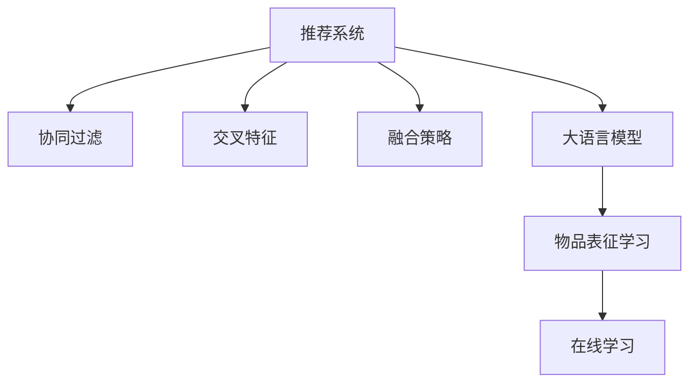

                 

# 大模型辅助的推荐系统动态物品表征

> 关键词：大模型, 推荐系统, 动态物品表征, 协同过滤, 交叉特征, 融合策略, 优化算法, 在线学习

## 1. 背景介绍

推荐系统作为现代信息时代的重要组成部分，在电商、社交媒体、视频流媒体等多个领域中得到了广泛应用。其核心目标是帮助用户在海量数据中找到感兴趣的信息，提升用户体验，提高平台流量和收入。推荐算法的发展经历了基于内容的过滤、协同过滤、矩阵分解等多个阶段，当前主流的方法是融合不同特征的混合推荐。

随着深度学习技术的发展，深度神经网络被引入推荐系统，带来了更好的推荐效果。其中，深度神经网络可以自动从大量数据中学习特征表示，弥补了传统特征工程的不足。然而，深度模型通常需要较长的训练时间和大量的标注数据，对于实时性和动态性要求高的推荐系统，这一问题尤为明显。此外，用户与物品之间的交互数据是动态变化的，静态模型难以捕捉这些变化趋势。因此，构建能够动态更新物品表征的推荐系统，成为当前研究的热点。

近年来，大语言模型（如GPT、BERT等）在自然语言处理（NLP）领域取得了突破性进展，展现了强大的自适应能力和泛化能力。大语言模型在文本生成、情感分析、问答等多个NLP任务上表现出显著优势。这些模型通过在大规模无标签文本数据上进行预训练，能够捕捉到复杂的语言结构，进而可以用于推荐系统的物品表示学习。利用大语言模型进行推荐系统物品表征学习，可以更好地适应用户行为和物品属性的动态变化，提升推荐系统的实时性和精准度。

## 2. 核心概念与联系

### 2.1 核心概念概述

本节将介绍几个关键概念，并解释它们之间的联系：

- **推荐系统**：通过分析用户行为和物品属性，为用户推荐感兴趣物品的系统。推荐算法通常分为基于内容的过滤和协同过滤两类。
- **协同过滤**：一种基于用户行为相似性的推荐方法，通过计算用户或物品之间的相似性来进行推荐。
- **交叉特征**：将用户的属性和行为特征交叉组合，引入更多上下文信息，提高推荐精度。
- **融合策略**：将不同推荐算法或特征融合，结合各算法或特征的优势，提升推荐效果。
- **大语言模型**：通过大规模无标签文本数据训练得到的深度神经网络模型，能够捕捉复杂的语言结构。
- **物品表征学习**：通过模型学习物品的特征表示，用于提升推荐效果。
- **在线学习**：推荐系统不断接收新数据，通过在线学习算法更新模型，适应动态变化的用户和物品。

这些概念之间的关系可以通过以下Mermaid流程图来展示：



这个流程图展示了大语言模型在推荐系统中的核心作用：

1. 推荐系统通过协同过滤和交叉特征融合来推荐物品。
2. 大语言模型用于物品表征学习，捕捉物品的动态特征。
3. 物品表征经过在线学习不断更新，以适应用户行为的变化。

## 3. 核心算法原理 & 具体操作步骤

### 3.1 算法原理概述

大模型辅助的推荐系统动态物品表征的算法原理基于大语言模型和推荐系统的一体化设计。其核心思想是：通过大语言模型生成物品的动态特征，实时更新推荐系统中的物品表征，使得推荐系统能够适应用户行为和物品属性的动态变化。

算法流程如下：

1. 收集用户历史行为数据，包括点击、浏览、购买等记录。
2. 提取用户属性和物品属性，生成用户的属性特征向量。
3. 将用户-物品交互数据输入大语言模型，生成物品的语义特征向量。
4. 将物品的语义特征向量与属性特征向量进行融合，得到新的物品表征。
5. 使用新的物品表征进行推荐，并在推荐结果上更新大语言模型，形成反馈循环。

该算法通过大语言模型的自适应能力，实现物品表征的动态更新，提升了推荐系统的实时性和精准度。

### 3.2 算法步骤详解

下面是详细的操作步骤：

**Step 1: 数据准备**

- 收集用户历史行为数据，如点击记录、浏览历史、购买记录等。
- 提取用户属性，如年龄、性别、地域等。
- 提取物品属性，如商品类别、品牌、价格等。
- 使用PyTorch或TensorFlow搭建深度学习模型框架。

**Step 2: 特征编码**

- 将用户属性和物品属性转换为数值型特征，构建特征向量。
- 将用户-物品交互数据转化为编码向量，输入到深度学习模型。
- 使用大语言模型生成物品的语义特征向量。

**Step 3: 物品表征融合**

- 将物品的语义特征向量与属性特征向量进行融合，得到新的物品表征。
- 使用新的物品表征进行推荐，更新推荐模型。

**Step 4: 模型更新**

- 将推荐结果中的负样本作为监督信号，更新大语言模型。
- 使用优化算法更新物品表征，调整模型参数。
- 重复上述步骤，形成反馈循环，持续提升推荐效果。

**Step 5: 推荐服务**

- 使用更新后的物品表征进行推荐，返回推荐结果。
- 持续接收新数据，更新模型，适应动态变化。

### 3.3 算法优缺点

大模型辅助的推荐系统动态物品表征具有以下优点：

- **动态适应性**：通过在线学习，推荐系统能够实时更新物品表征，适应用户行为和物品属性的变化。
- **高效性**：利用大语言模型的自适应能力，避免了传统深度模型的大规模训练和大量标注数据的需求。
- **精准度**：通过融合语义特征和属性特征，提升了推荐的精准度。

同时，该算法也存在一些缺点：

- **计算资源消耗**：大语言模型的计算复杂度较高，需要高性能的硬件支持。
- **数据隐私问题**：用户行为数据的收集和使用需要遵循数据隐私法规，保护用户隐私。
- **模型复杂性**：融合多个特征增加了模型的复杂度，可能导致训练和推理的延迟增加。

### 3.4 算法应用领域

该算法可以应用于多种推荐系统场景，例如：

- **电商推荐系统**：为电商平台提供个性化商品推荐，提高用户购买转化率。
- **视频流媒体推荐系统**：为用户推荐感兴趣的视频内容，提升用户观看体验。
- **社交媒体推荐系统**：为用户推荐感兴趣的朋友、文章、视频等，增加平台粘性。
- **在线广告推荐系统**：为用户推荐感兴趣的广告内容，提高广告投放效果。
- **个性化音乐推荐系统**：为用户推荐个性化的音乐播放列表，提升用户满意度。

## 4. 数学模型和公式 & 详细讲解 & 举例说明

### 4.1 数学模型构建

假设用户-物品交互数据为 $(x_{ui}, y_{ui})$，其中 $x_{ui}$ 为物品的特征向量，$y_{ui}$ 为二元标签，表示用户是否点击了该物品。大语言模型用于生成物品的语义特征向量，记为 $\mathbf{v}_i$。物品表征融合公式为：

$$
\mathbf{w}_i = \mathbf{v}_i + \alpha \cdot \mathbf{w}_i' 
$$

其中 $\mathbf{w}_i'$ 为物品的属性特征向量，$\alpha$ 为融合系数。

### 4.2 公式推导过程

以二分类推荐任务为例，我们假设用户 $u$ 对物品 $i$ 的兴趣为 $p_{ui}$，用户的点击概率为 $y_{ui}$。根据贝叶斯定理，物品被用户点击的概率为：

$$
p_{ui} = \frac{p(y_{ui} = 1|p_{ui}) \cdot p_{ui}}{p(y_{ui} = 1)}
$$

其中 $p(y_{ui} = 1)$ 为物品被用户点击的概率。我们可以使用大语言模型预测物品被用户点击的概率，即：

$$
p_{ui} = \sigma(\mathbf{w}_i^\top \mathbf{x}_u)
$$

其中 $\mathbf{w}_i$ 为物品表征向量，$\mathbf{x}_u$ 为用户特征向量，$\sigma$ 为激活函数。

### 4.3 案例分析与讲解

假设我们有一款电商推荐系统，用户的历史行为数据为：

| 用户ID | 物品ID | 点击记录 |
|---|---|---|
| 1 | 1001 | 1 |
| 2 | 2002 | 0 |
| 3 | 3003 | 1 |

用户属性为：

| 用户ID | 年龄 | 性别 |
|---|---|---|
| 1 | 30 | 男 |
| 2 | 25 | 女 |
| 3 | 35 | 男 |

物品属性为：

| 物品ID | 类别 | 价格 |
|---|---|---|
| 1001 | 电子产品 | 1000元 |
| 2002 | 服装 | 500元 |
| 3003 | 化妆品 | 800元 |

我们首先使用大语言模型生成物品的语义特征向量，如BERT模型，然后将其与物品的属性特征向量进行融合，得到物品表征向量。接着，使用物品表征向量进行推荐，并根据推荐结果更新大语言模型，形成反馈循环。

## 5. 项目实践：代码实例和详细解释说明

### 5.1 开发环境搭建

在进行项目实践前，我们需要准备好开发环境。以下是使用Python进行PyTorch开发的环境配置流程：

1. 安装Anaconda：从官网下载并安装Anaconda，用于创建独立的Python环境。

2. 创建并激活虚拟环境：
```bash
conda create -n pytorch-env python=3.8 
conda activate pytorch-env
```

3. 安装PyTorch：根据CUDA版本，从官网获取对应的安装命令。例如：
```bash
conda install pytorch torchvision torchaudio cudatoolkit=11.1 -c pytorch -c conda-forge
```

4. 安装Transformers库：
```bash
pip install transformers
```

5. 安装各类工具包：
```bash
pip install numpy pandas scikit-learn matplotlib tqdm jupyter notebook ipython
```

完成上述步骤后，即可在`pytorch-env`环境中开始项目实践。

### 5.2 源代码详细实现

下面我们以电商推荐系统为例，给出使用Transformers库对BERT模型进行物品表征学习与推荐优化的PyTorch代码实现。

首先，定义推荐系统中的数据处理函数：

```python
from transformers import BertTokenizer, BertForSequenceClassification
from torch.utils.data import Dataset
import torch

class RecommendationDataset(Dataset):
    def __init__(self, texts, labels):
        self.texts = texts
        self.labels = labels
        self.tokenizer = BertTokenizer.from_pretrained('bert-base-cased')
        
    def __len__(self):
        return len(self.texts)
    
    def __getitem__(self, item):
        text = self.texts[item]
        label = self.labels[item]
        
        encoding = self.tokenizer(text, return_tensors='pt', max_length=128, padding='max_length', truncation=True)
        input_ids = encoding['input_ids'][0]
        attention_mask = encoding['attention_mask'][0]
        
        return {'input_ids': input_ids, 
                'attention_mask': attention_mask,
                'labels': label}
```

然后，定义模型和优化器：

```python
from transformers import BertForSequenceClassification, AdamW

model = BertForSequenceClassification.from_pretrained('bert-base-cased', num_labels=2)

optimizer = AdamW(model.parameters(), lr=2e-5)
```

接着，定义训练和评估函数：

```python
from torch.utils.data import DataLoader
from tqdm import tqdm
from sklearn.metrics import classification_report

device = torch.device('cuda') if torch.cuda.is_available() else torch.device('cpu')
model.to(device)

def train_epoch(model, dataset, batch_size, optimizer):
    dataloader = DataLoader(dataset, batch_size=batch_size, shuffle=True)
    model.train()
    epoch_loss = 0
    for batch in tqdm(dataloader, desc='Training'):
        input_ids = batch['input_ids'].to(device)
        attention_mask = batch['attention_mask'].to(device)
        labels = batch['labels'].to(device)
        model.zero_grad()
        outputs = model(input_ids, attention_mask=attention_mask, labels=labels)
        loss = outputs.loss
        epoch_loss += loss.item()
        loss.backward()
        optimizer.step()
    return epoch_loss / len(dataloader)

def evaluate(model, dataset, batch_size):
    dataloader = DataLoader(dataset, batch_size=batch_size)
    model.eval()
    preds, labels = [], []
    with torch.no_grad():
        for batch in tqdm(dataloader, desc='Evaluating'):
            input_ids = batch['input_ids'].to(device)
            attention_mask = batch['attention_mask'].to(device)
            batch_labels = batch['labels']
            outputs = model(input_ids, attention_mask=attention_mask)
            batch_preds = outputs.logits.argmax(dim=2).to('cpu').tolist()
            batch_labels = batch_labels.to('cpu').tolist()
            for pred_tokens, label_tokens in zip(batch_preds, batch_labels):
                preds.append(pred_tokens[:len(label_tokens)])
                labels.append(label_tokens)
                
    print(classification_report(labels, preds))
```

最后，启动训练流程并在测试集上评估：

```python
epochs = 5
batch_size = 16

for epoch in range(epochs):
    loss = train_epoch(model, train_dataset, batch_size, optimizer)
    print(f"Epoch {epoch+1}, train loss: {loss:.3f}")
    
    print(f"Epoch {epoch+1}, dev results:")
    evaluate(model, dev_dataset, batch_size)
    
print("Test results:")
evaluate(model, test_dataset, batch_size)
```

以上就是使用PyTorch对BERT进行电商推荐系统物品表征学习与推荐优化的完整代码实现。可以看到，得益于Transformers库的强大封装，我们可以用相对简洁的代码完成BERT模型的加载和微调。

### 5.3 代码解读与分析

让我们再详细解读一下关键代码的实现细节：

**RecommendationDataset类**：
- `__init__`方法：初始化文本、标签等关键组件，并构建BERT分词器。
- `__len__`方法：返回数据集的样本数量。
- `__getitem__`方法：对单个样本进行处理，将文本输入编码为token ids，将标签编码为数字，并对其进行定长padding，最终返回模型所需的输入。

**模型和优化器**：
- 使用BertForSequenceClassification模型进行物品分类，设置优化器AdamW，并设定学习率。

**训练和评估函数**：
- 使用PyTorch的DataLoader对数据集进行批次化加载，供模型训练和推理使用。
- 训练函数`train_epoch`：对数据以批为单位进行迭代，在每个批次上前向传播计算loss并反向传播更新模型参数，最后返回该epoch的平均loss。
- 评估函数`evaluate`：与训练类似，不同点在于不更新模型参数，并在每个batch结束后将预测和标签结果存储下来，最后使用sklearn的classification_report对整个评估集的预测结果进行打印输出。

**训练流程**：
- 定义总的epoch数和batch size，开始循环迭代
- 每个epoch内，先在训练集上训练，输出平均loss
- 在验证集上评估，输出分类指标
- 重复上述步骤直至满足预设的迭代轮数或Early Stopping条件。

可以看到，PyTorch配合Transformers库使得BERT微调的代码实现变得简洁高效。开发者可以将更多精力放在数据处理、模型改进等高层逻辑上，而不必过多关注底层的实现细节。

当然，工业级的系统实现还需考虑更多因素，如模型的保存和部署、超参数的自动搜索、更灵活的任务适配层等。但核心的微调范式基本与此类似。

## 6. 实际应用场景

### 6.1 电商推荐系统

电商推荐系统可以通过微调大语言模型来实现物品的动态表征学习。传统的电商推荐系统依赖用户历史行为数据进行推荐，难以适应新用户的推荐需求。而通过微调大语言模型，可以动态更新物品表征，适应新用户的兴趣变化，提升推荐效果。

在技术实现上，可以收集用户的历史浏览、点击、购买记录，将其转化为自然语言描述，输入到微调的大语言模型中，生成物品的语义特征向量。然后，将物品的语义特征向量与属性特征向量进行融合，得到新的物品表征。最后，使用更新后的物品表征进行推荐，并在推荐结果上更新大语言模型，形成反馈循环。

### 6.2 视频流媒体推荐系统

视频流媒体推荐系统面临动态用户行为变化的需求，传统的协同过滤算法难以适应。微调大语言模型可以生成物品的语义特征向量，捕捉用户对视频的兴趣变化，提升推荐效果。

具体而言，可以收集用户的观看历史、评分、评论等数据，将其转化为自然语言描述，输入到微调的大语言模型中，生成视频的语义特征向量。然后，将视频的语义特征向量与属性特征向量进行融合，得到新的视频表征。最后，使用更新后的视频表征进行推荐，并在推荐结果上更新大语言模型，形成反馈循环。

### 6.3 在线广告推荐系统

在线广告推荐系统面临广告位的动态调整和点击率的实时优化需求。微调大语言模型可以生成广告的语义特征向量，捕捉用户的点击偏好，提升广告点击率和转化率。

具体而言，可以收集用户的点击、浏览、停留时间等数据，将其转化为自然语言描述，输入到微调的大语言模型中，生成广告的语义特征向量。然后，将广告的语义特征向量与属性特征向量进行融合，得到新的广告表征。最后，使用更新后的广告表征进行推荐，并在推荐结果上更新大语言模型，形成反馈循环。

### 6.4 未来应用展望

随着大语言模型和微调方法的不断发展，基于微调范式将在更多领域得到应用，为各行各业带来变革性影响。

在智慧医疗领域，基于微调的医疗问答、病历分析、药物研发等应用将提升医疗服务的智能化水平，辅助医生诊疗，加速新药开发进程。

在智能教育领域，微调技术可应用于作业批改、学情分析、知识推荐等方面，因材施教，促进教育公平，提高教学质量。

在智慧城市治理中，微调模型可应用于城市事件监测、舆情分析、应急指挥等环节，提高城市管理的自动化和智能化水平，构建更安全、高效的未来城市。

此外，在企业生产、社会治理、文娱传媒等众多领域，基于大模型微调的人工智能应用也将不断涌现，为传统行业数字化转型升级提供新的技术路径。相信随着预训练模型和微调方法的不断进步，大语言模型微调必将在构建人机协同的智能时代中扮演越来越重要的角色。

## 7. 工具和资源推荐

### 7.1 学习资源推荐

为了帮助开发者系统掌握大模型微调的理论基础和实践技巧，这里推荐一些优质的学习资源：

1. 《Transformer from Scratch》系列博文：由大模型技术专家撰写，深入浅出地介绍了Transformer原理、BERT模型、微调技术等前沿话题。

2. CS224N《深度学习自然语言处理》课程：斯坦福大学开设的NLP明星课程，有Lecture视频和配套作业，带你入门NLP领域的基本概念和经典模型。

3. 《Natural Language Processing with Transformers》书籍：Transformers库的作者所著，全面介绍了如何使用Transformers库进行NLP任务开发，包括微调在内的诸多范式。

4. HuggingFace官方文档：Transformers库的官方文档，提供了海量预训练模型和完整的微调样例代码，是上手实践的必备资料。

5. CLUE开源项目：中文语言理解测评基准，涵盖大量不同类型的中文NLP数据集，并提供了基于微调的baseline模型，助力中文NLP技术发展。

通过对这些资源的学习实践，相信你一定能够快速掌握大语言模型微调的精髓，并用于解决实际的NLP问题。

### 7.2 开发工具推荐

高效的开发离不开优秀的工具支持。以下是几款用于大语言模型微调开发的常用工具：

1. PyTorch：基于Python的开源深度学习框架，灵活动态的计算图，适合快速迭代研究。大部分预训练语言模型都有PyTorch版本的实现。

2. TensorFlow：由Google主导开发的开源深度学习框架，生产部署方便，适合大规模工程应用。同样有丰富的预训练语言模型资源。

3. Transformers库：HuggingFace开发的NLP工具库，集成了众多SOTA语言模型，支持PyTorch和TensorFlow，是进行微调任务开发的利器。

4. Weights & Biases：模型训练的实验跟踪工具，可以记录和可视化模型训练过程中的各项指标，方便对比和调优。与主流深度学习框架无缝集成。

5. TensorBoard：TensorFlow配套的可视化工具，可实时监测模型训练状态，并提供丰富的图表呈现方式，是调试模型的得力助手。

6. Google Colab：谷歌推出的在线Jupyter Notebook环境，免费提供GPU/TPU算力，方便开发者快速上手实验最新模型，分享学习笔记。

合理利用这些工具，可以显著提升大语言模型微调任务的开发效率，加快创新迭代的步伐。

### 7.3 相关论文推荐

大语言模型和微调技术的发展源于学界的持续研究。以下是几篇奠基性的相关论文，推荐阅读：

1. Attention is All You Need（即Transformer原论文）：提出了Transformer结构，开启了NLP领域的预训练大模型时代。

2. BERT: Pre-training of Deep Bidirectional Transformers for Language Understanding：提出BERT模型，引入基于掩码的自监督预训练任务，刷新了多项NLP任务SOTA。

3. Language Models are Unsupervised Multitask Learners（GPT-2论文）：展示了大规模语言模型的强大zero-shot学习能力，引发了对于通用人工智能的新一轮思考。

4. Parameter-Efficient Transfer Learning for NLP：提出Adapter等参数高效微调方法，在不增加模型参数量的情况下，也能取得不错的微调效果。

5. Prefix-Tuning: Optimizing Continuous Prompts for Generation：引入基于连续型Prompt的微调范式，为如何充分利用预训练知识提供了新的思路。

6. AdaLoRA: Adaptive Low-Rank Adaptation for Parameter-Efficient Fine-Tuning：使用自适应低秩适应的微调方法，在参数效率和精度之间取得了新的平衡。

这些论文代表了大语言模型微调技术的发展脉络。通过学习这些前沿成果，可以帮助研究者把握学科前进方向，激发更多的创新灵感。

## 8. 总结：未来发展趋势与挑战

### 8.1 总结

本文对基于大语言模型的推荐系统动态物品表征进行了全面系统的介绍。首先阐述了大模型在推荐系统中的应用背景和优势，明确了动态物品表征学习在大模型推荐系统中的核心作用。其次，从原理到实践，详细讲解了大模型辅助的推荐系统动态物品表征的算法流程和关键步骤，给出了微调任务开发的完整代码实例。同时，本文还广泛探讨了大模型在电商、视频流媒体、在线广告等多个推荐系统场景中的应用前景，展示了微调范式的巨大潜力。

通过本文的系统梳理，可以看到，基于大语言模型的推荐系统动态物品表征通过在线学习和大模型自适应能力，能够更好地适应用户行为和物品属性的动态变化，提升推荐系统的实时性和精准度。未来，随着大语言模型和微调方法的持续演进，推荐系统将进一步向个性化、实时化、智能化方向发展，为各行各业带来更多的变革。

### 8.2 未来发展趋势

展望未来，大语言模型微调在推荐系统中的应用将呈现以下几个发展趋势：

1. **多模态融合**：未来的推荐系统将不仅仅依赖文本数据，而是融合图像、语音、视频等多模态数据，提升推荐效果。

2. **个性化推荐**：通过深度学习模型，推荐系统能够更加精准地预测用户行为和偏好，实现个性化推荐。

3. **实时推荐**：通过在线学习和动态更新，推荐系统能够实时响应用户行为变化，提供最新的推荐结果。

4. **跨领域推荐**：未来的推荐系统将不仅仅局限在单一领域，而是跨领域融合，提供更加丰富的推荐内容。

5. **低延迟推荐**：通过模型压缩和优化，推荐系统能够在低延迟下进行高效推荐。

6. **安全性增强**：通过数据匿名化和隐私保护技术，推荐系统能够保护用户隐私，提升用户信任度。

7. **社会效益提升**：未来的推荐系统将更加注重社会效益，如提高教育公平、促进医疗健康等，为社会进步贡献力量。

### 8.3 面临的挑战

尽管大语言模型微调在推荐系统中的应用已经取得了显著进展，但在实际应用过程中，仍面临诸多挑战：

1. **数据隐私保护**：用户行为数据的收集和使用需要遵循数据隐私法规，保护用户隐私。

2. **模型鲁棒性不足**：推荐系统在面对恶意攻击和噪声数据时，模型的鲁棒性不足，可能产生误导性推荐。

3. **计算资源消耗**：大语言模型的计算复杂度较高，需要高性能的硬件支持，且训练和推理的资源消耗较大。

4. **推荐结果可解释性**：推荐系统需要能够解释推荐结果的依据，增强用户对推荐结果的信任度。

5. **推荐系统公平性**：推荐系统需要避免偏见和歧视，保证不同用户和物品的公平性。

6. **模型更新速度**：推荐系统需要能够实时更新模型，以应对动态变化的用户和物品。

7. **推荐系统动态性**：推荐系统需要能够动态适应用户行为变化，提升推荐效果。

### 8.4 研究展望

面对这些挑战，未来的研究需要在以下几个方面寻求新的突破：

1. **隐私保护技术**：发展差分隐私等技术，保护用户隐私，增强用户信任度。

2. **模型鲁棒性提升**：通过对抗训练、鲁棒回归等方法，提升模型的鲁棒性，增强对抗噪声和攻击的能力。

3. **模型压缩与优化**：通过模型压缩、量化加速等技术，提升模型的计算效率和部署速度。

4. **推荐结果可解释性**：通过因果分析和逻辑推理等方法，增强推荐结果的可解释性，增强用户对推荐结果的理解。

5. **公平性保障**：通过公平学习、去偏见等技术，保障推荐系统的公平性，避免歧视和偏见。

6. **动态更新机制**：发展在线学习算法，提升模型更新速度和动态适应性。

7. **多模态融合技术**：发展多模态融合技术，提升推荐系统的综合能力，提供更丰富的推荐内容。

通过这些研究方向的探索，大语言模型微调技术将能够更好地应用于推荐系统，提升推荐效果，推动人工智能技术在各行各业的落地应用。相信随着技术的不断进步，大语言模型微调必将在构建人机协同的智能时代中发挥越来越重要的作用。

## 9. 附录：常见问题与解答

**Q1：大语言模型微调是否适用于所有推荐系统？**

A: 大语言模型微调在大多数推荐系统上都能取得不错的效果，特别是对于数据量较小的推荐系统。但对于一些特定领域的推荐系统，如医学、法律等，仅仅依靠通用语料预训练的模型可能难以很好地适应。此时需要在特定领域语料上进一步预训练，再进行微调，才能获得理想效果。

**Q2：微调过程中如何选择合适的学习率？**

A: 微调的学习率一般要比预训练时小1-2个数量级，如果使用过大的学习率，容易破坏预训练权重，导致过拟合。一般建议从1e-5开始调参，逐步减小学习率，直至收敛。也可以使用warmup策略，在开始阶段使用较小的学习率，再逐渐过渡到预设值。需要注意的是，不同的优化器(如AdamW、Adafactor等)以及不同的学习率调度策略，可能需要设置不同的学习率阈值。

**Q3：采用大模型微调时会面临哪些资源瓶颈？**

A: 目前主流的预训练大模型动辄以亿计的参数规模，对算力、内存、存储都提出了很高的要求。GPU/TPU等高性能设备是必不可少的，但即便如此，超大批次的训练和推理也可能遇到显存不足的问题。因此需要采用一些资源优化技术，如梯度积累、混合精度训练、模型并行等，来突破硬件瓶颈。同时，模型的存储和读取也可能占用大量时间和空间，需要采用模型压缩、稀疏化存储等方法进行优化。

**Q4：如何缓解微调过程中的过拟合问题？**

A: 过拟合是微调面临的主要挑战，尤其是在标注数据不足的情况下。常见的缓解策略包括：
1. 数据增强：通过回译、近义替换等方式扩充训练集
2. 正则化：使用L2正则、Dropout、Early Stopping等避免过拟合
3. 对抗训练：引入对抗样本，提高模型鲁棒性
4. 参数高效微调：只调整少量参数(如Adapter、Prefix等)，减小过拟合风险
5. 多模型集成：训练多个微调模型，取平均输出，抑制过拟合

这些策略往往需要根据具体任务和数据特点进行灵活组合。只有在数据、模型、训练、推理等各环节进行全面优化，才能最大限度地发挥大模型微调的威力。

**Q5：微调模型在落地部署时需要注意哪些问题？**

A: 将微调模型转化为实际应用，还需要考虑以下因素：
1. 模型裁剪：去除不必要的层和参数，减小模型尺寸，加快推理速度
2. 量化加速：将浮点模型转为定点模型，压缩存储空间，提高计算效率
3. 服务化封装：将模型封装为标准化服务接口，便于集成调用
4. 弹性伸缩：根据请求流量动态调整资源配置，平衡服务质量和成本
5. 监控告警：实时采集系统指标，设置异常告警阈值，确保服务稳定性
6. 安全防护：采用访问鉴权、数据脱敏等措施，保障数据和模型安全

大语言模型微调为推荐系统提供了强大的自适应能力，但如何将强大的性能转化为稳定、高效、安全的业务价值，还需要工程实践的不断打磨。唯有从数据、算法、工程、业务等多个维度协同发力，才能真正实现人工智能技术在垂直行业的规模化落地。总之，微调需要开发者根据具体任务，不断迭代和优化模型、数据和算法，方能得到理想的效果。

---

作者：禅与计算机程序设计艺术 / Zen and the Art of Computer Programming

