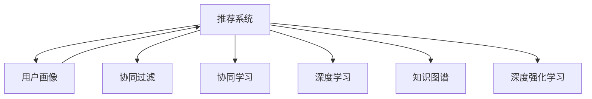

                 

# 大模型辅助的推荐系统用户画像构建

> 关键词：推荐系统,用户画像,协同过滤,协同学习,知识图谱,深度学习,深度强化学习,工业级应用,基于大模型的推荐系统, 用户行为分析

## 1. 背景介绍

### 1.1 问题由来
在数字经济快速发展的今天，推荐系统已成为互联网公司运营的重要支柱，通过精准的个性化推荐，提升用户体验，提高转化率。然而，传统的基于协同过滤的推荐算法，在数据稀疏和冷启动问题上表现不佳。为解决这些问题，众多学者提出了多维协同学习、深度学习等新的推荐技术，显著提升了推荐效果。

但这些方法通常依赖用户历史行为数据，难以捕捉到用户的隐式兴趣和潜在的真实需求。而通过大模型（Large Model）对用户进行全视图画像建模，可以突破传统推荐方法的局限，实现更加精准、泛化的推荐。

## 2. 核心概念与联系

### 2.1 核心概念概述

为更好地理解大模型在推荐系统中的应用，本节将介绍几个密切相关的核心概念：

- 推荐系统(Recommender System)：利用用户历史行为数据、产品属性信息等，为用户推荐感兴趣的内容。通过个性化推荐，提升用户满意度，增加消费转化。

- 用户画像(User Profile)：对用户基本信息、兴趣偏好、行为特征等进行全面建模，构建多维度用户画像，有助于精准刻画用户需求，实现个性化推荐。

- 协同过滤(Collaborative Filtering, CF)：通过用户行为数据，构建用户-商品关联矩阵，通过矩阵分解、K-近邻等方法挖掘用户兴趣，为用户推荐相似用户喜欢的商品。

- 协同学习(Collaborative Learning)：基于用户协同行为数据，在多维特征上挖掘用户兴趣，实现跨用户、跨物品的协同建模。

- 深度学习(Deep Learning)：通过多层次的神经网络结构，学习用户和商品的深度特征，捕捉复杂的用户行为模式，提高推荐效果。

- 知识图谱(Knowledge Graph)：通过将实体、关系、属性等知识映射为图结构，帮助推荐系统构建用户、商品之间的隐式关系，提高推荐模型的泛化能力。

- 深度强化学习(Deep Reinforcement Learning)：在推荐系统中引入强化学习，通过与用户交互的策略模型，不断调整推荐策略，提升推荐效果。

这些核心概念之间的逻辑关系可以通过以下Mermaid流程图来展示：



这个流程图展示了大模型在推荐系统中的应用核心概念及其之间的关系：

1. 推荐系统通过大模型构建用户画像。
2. 协同过滤、协同学习、深度学习、知识图谱、深度强化学习等多种推荐技术，可以进一步提升推荐系统的效果。
3. 大模型辅助的用户画像，作为推荐系统的核心输入，在多维协同学习中起到关键作用。

## 3. 核心算法原理 & 具体操作步骤
### 3.1 算法原理概述

基于大模型的推荐系统，主要依赖于对用户画像的精细刻画。通过预训练语言模型（如BERT、GPT等），可以学习到用户输入文本的深层次语义表示，并将其映射为高维用户特征向量。这些特征向量可以与其他用户行为特征（如点击、浏览、评分等）融合，构建用户画像，从而支持推荐系统进行个性化推荐。

形式化地，设用户画像模型为 $F_{\theta}(x)$，其中 $x$ 为用户的输入文本，$\theta$ 为模型参数。用户行为特征为 $X_{user}$，商品特征为 $X_{item}$，则推荐系统在用户输入 $x$ 和用户行为特征 $X_{user}$ 上的推荐结果为：

$$
R_{\theta}(x, X_{user}) = F_{\theta}(x) \cdot X_{user}
$$

其中 $.$ 表示向量点积，$F_{\theta}(x)$ 为预训练语言模型对输入文本的特征映射。用户画像模型与用户行为特征的融合，可以有多种方式，如拼接、加权平均、MLP等。

### 3.2 算法步骤详解

基于大模型的推荐系统用户画像构建一般包括以下几个关键步骤：

**Step 1: 准备预训练模型和数据集**
- 选择合适的预训练语言模型 $F_{\theta}$ 作为初始化参数，如 BERT、GPT等。
- 准备推荐系统的训练集 $D=\{(x_i, X_{user_i}, y_i)\}_{i=1}^N$，其中 $x_i$ 为用户的输入文本，$X_{user_i}$ 为用户的其他行为特征，$y_i$ 为推荐的商品ID。

**Step 2: 预训练语言模型进行用户画像映射**
- 对用户输入文本进行预处理，如分词、编码等，带入预训练语言模型进行特征映射，得到用户画像向量 $F_{\theta}(x_i)$。
- 将用户画像向量与用户行为特征向量 $X_{user_i}$ 融合，得到用户综合特征向量 $V_{user_i}$。

**Step 3: 训练协同学习模型**
- 将用户综合特征向量 $V_{user_i}$ 和用户行为特征向量 $X_{user_i}$ 作为输入，结合商品特征向量 $X_{item}$，训练协同学习模型。
- 协同学习模型可以是矩阵分解模型、K-近邻模型、深度学习模型等，具体选择根据任务需求和数据特点来决定。

**Step 4: 推荐模型预测**
- 对于新的用户输入 $x$ 和用户行为特征 $X_{user}$，通过用户画像模型 $F_{\theta}(x)$ 得到用户画像向量 $F_{\theta}(x)$。
- 将用户画像向量与用户行为特征向量融合，得到用户综合特征向量 $V_{user}$。
- 在协同学习模型上，预测推荐结果 $y_{pred}$。
- 根据预测结果 $y_{pred}$ 生成推荐列表。

**Step 5: 评估和调整**
- 在测试集上评估推荐系统的准确率、召回率、点击率等指标。
- 根据评估结果调整模型参数，如学习率、正则化系数、损失函数等。
- 重复训练过程，直到达到预设的性能指标。

以上是基于大模型的推荐系统用户画像构建的一般流程。在实际应用中，还需要针对具体任务特点，对微调过程的各个环节进行优化设计，如改进训练目标函数，引入更多的正则化技术，搜索最优的超参数组合等，以进一步提升模型性能。

### 3.3 算法优缺点

基于大模型的推荐系统用户画像构建方法具有以下优点：
1. 多样性模型结合。通过大模型和其他推荐技术结合，综合利用多维用户行为特征，提高推荐系统的表现。
2. 用户兴趣丰富。大模型能够学习到用户输入文本的深层次语义表示，刻画用户隐式兴趣和长期偏好。
3. 推荐效果显著。在学术界和工业界的推荐任务上，基于大模型的推荐系统已经刷新了多项性能指标。

同时，该方法也存在一定的局限性：
1. 依赖用户输入。用户输入文本的质量和数量直接影响推荐结果。
2. 数据处理复杂。需要处理大量的文本数据，对计算资源和时间成本要求较高。
3. 模型可解释性不足。基于大模型的推荐系统往往难以解释推荐决策的内部机制。
4. 需要大量标注数据。大模型进行用户画像映射，需要大量标注数据进行微调，获取标注数据的成本较高。
5. 模型更新频率较低。由于大模型的参数量较大，更新频率较低，难以实时捕捉用户需求的变化。

尽管存在这些局限性，但就目前而言，基于大模型的推荐系统方法仍是大数据推荐系统的重要范式。未来相关研究的重点在于如何进一步降低对用户输入数据的依赖，提高模型的实时响应能力和可解释性，同时兼顾数据隐私和安全性等因素。

### 3.4 算法应用领域

基于大模型的推荐系统用户画像构建方法，在推荐领域已经得到了广泛的应用，涵盖了从电商、社交网络到视频流媒体等多个领域，例如：

- 电商推荐：在电商平台上，通过用户浏览、购买记录等行为数据，结合用户输入的搜索词、评价等文本信息，为用户推荐相似商品。
- 社交推荐：在社交网络平台上，通过用户发布的内容、点赞、评论等互动数据，结合用户输入的社交关系信息，推荐相关内容或用户。
- 视频推荐：在视频流媒体平台，通过用户观看行为、评分等数据，结合用户输入的评论、标签等文本信息，为用户推荐相关视频。
- 新闻推荐：在新闻聚合平台上，通过用户阅读记录、点赞等行为数据，结合用户输入的标题、关键词等文本信息，为用户推荐相关新闻。
- 广告推荐：在广告投放平台上，通过用户浏览行为、点击等数据，结合用户输入的广告描述、关键词等文本信息，为用户推荐相关广告。

除了上述这些经典应用外，基于大模型的推荐系统还在新闻摘要、音乐推荐、旅游推荐等多个领域得到创新性应用，为推荐技术带来了新的突破。

## 4. 数学模型和公式 & 详细讲解  
### 4.1 数学模型构建

本节将使用数学语言对基于大模型的推荐系统用户画像构建过程进行更加严格的刻画。

设用户画像模型为 $F_{\theta}(x)$，用户行为特征为 $X_{user}$，商品特征为 $X_{item}$，推荐结果为 $y$。假设推荐系统训练集为 $D=\{(x_i, X_{user_i}, y_i)\}_{i=1}^N$。

推荐系统的优化目标是最小化预测误差，即找到最优参数：

$$
\theta^* = \mathop{\arg\min}_{\theta} \frac{1}{N} \sum_{i=1}^N \ell(F_{\theta}(x_i) \cdot X_{user_i}, y_i)
$$

其中 $\ell$ 为损失函数，$\theta$ 为模型参数。常见的损失函数包括均方误差损失、交叉熵损失等。

### 4.2 公式推导过程

以均方误差损失为例，推荐系统用户画像构建的数学推导过程如下：

假设推荐系统训练集为 $D=\{(x_i, X_{user_i}, y_i)\}_{i=1}^N$，则均方误差损失函数为：

$$
\mathcal{L}(\theta) = \frac{1}{N} \sum_{i=1}^N (F_{\theta}(x_i) \cdot X_{user_i} - y_i)^2
$$

其中 $F_{\theta}(x_i)$ 为用户输入 $x_i$ 在用户画像模型 $F_{\theta}$ 上的特征映射。为了便于推导，我们假设用户画像模型是一个单层神经网络，则：

$$
F_{\theta}(x_i) = W \cdot tanh(A \cdot x_i + b)
$$

其中 $W$ 为权重矩阵，$A$ 为线性变换矩阵，$b$ 为偏置向量。则均方误差损失函数进一步展开为：

$$
\mathcal{L}(\theta) = \frac{1}{N} \sum_{i=1}^N (W \cdot tanh(A \cdot x_i + b) \cdot X_{user_i} - y_i)^2
$$

使用反向传播算法，求解损失函数对模型参数 $W$、$A$、$b$ 的梯度：

$$
\frac{\partial \mathcal{L}}{\partial W} = \frac{2}{N} \sum_{i=1}^N X_{user_i} \cdot (W \cdot tanh(A \cdot x_i + b) \cdot X_{user_i} - y_i) \cdot tanh'(A \cdot x_i + b)
$$

$$
\frac{\partial \mathcal{L}}{\partial A} = \frac{2}{N} \sum_{i=1}^N X_{user_i} \cdot (W \cdot tanh(A \cdot x_i + b) \cdot X_{user_i} - y_i) \cdot x_i \cdot (1 - tanh^2(A \cdot x_i + b))
$$

$$
\frac{\partial \mathcal{L}}{\partial b} = \frac{2}{N} \sum_{i=1}^N X_{user_i} \cdot (W \cdot tanh(A \cdot x_i + b) \cdot X_{user_i} - y_i) \cdot (1 - tanh(A \cdot x_i + b))
$$

通过上述梯度公式，可以不断迭代优化模型参数 $W$、$A$、$b$，最小化均方误差损失，得到用户画像模型 $F_{\theta}(x)$ 的最优参数 $\theta^*$。

## 5. 项目实践：代码实例和详细解释说明
### 5.1 开发环境搭建

在进行推荐系统开发前，我们需要准备好开发环境。以下是使用Python进行PyTorch开发的环境配置流程：

1. 安装Anaconda：从官网下载并安装Anaconda，用于创建独立的Python环境。

2. 创建并激活虚拟环境：
```bash
conda create -n recommendation-env python=3.8 
conda activate recommendation-env
```

3. 安装PyTorch：根据CUDA版本，从官网获取对应的安装命令。例如：
```bash
conda install pytorch torchvision torchaudio cudatoolkit=11.1 -c pytorch -c conda-forge
```

4. 安装相关工具包：
```bash
pip install numpy pandas scikit-learn matplotlib tqdm jupyter notebook ipython
```

完成上述步骤后，即可在`recommendation-env`环境中开始推荐系统开发。

### 5.2 源代码详细实现

下面我们以基于大模型的电商推荐系统为例，给出使用Transformers库对BERT模型进行推荐系统开发的PyTorch代码实现。

首先，定义数据处理函数：

```python
from transformers import BertTokenizer
from torch.utils.data import Dataset
import torch

class RecommendationDataset(Dataset):
    def __init__(self, texts, user_behaviours, item_ids, tokenizer, max_len=128):
        self.texts = texts
        self.user_behaviours = user_behaviours
        self.item_ids = item_ids
        self.tokenizer = tokenizer
        self.max_len = max_len
        
    def __len__(self):
        return len(self.texts)
    
    def __getitem__(self, item):
        text = self.texts[item]
        user_behaviour = self.user_behaviours[item]
        item_id = self.item_ids[item]
        
        encoding = self.tokenizer(text, return_tensors='pt', max_length=self.max_len, padding='max_length', truncation=True)
        input_ids = encoding['input_ids'][0]
        attention_mask = encoding['attention_mask'][0]
        
        # 将用户行为特征转换为向量
        user_behaviour_vector = torch.tensor(user_behaviour, dtype=torch.long)
        
        # 将商品ID转换为向量
        item_id_vector = torch.tensor(item_id, dtype=torch.long)
        
        return {'input_ids': input_ids, 
                'attention_mask': attention_mask,
                'user_behaviour_vector': user_behaviour_vector,
                'item_id_vector': item_id_vector}
```

然后，定义模型和优化器：

```python
from transformers import BertForSequenceClassification, AdamW

model = BertForSequenceClassification.from_pretrained('bert-base-cased', num_labels=len(tag2id))

optimizer = AdamW(model.parameters(), lr=2e-5)
```

接着，定义训练和评估函数：

```python
from torch.utils.data import DataLoader
from tqdm import tqdm
from sklearn.metrics import precision_recall_fscore_support

device = torch.device('cuda') if torch.cuda.is_available() else torch.device('cpu')
model.to(device)

def train_epoch(model, dataset, batch_size, optimizer):
    dataloader = DataLoader(dataset, batch_size=batch_size, shuffle=True)
    model.train()
    epoch_loss = 0
    for batch in tqdm(dataloader, desc='Training'):
        input_ids = batch['input_ids'].to(device)
        attention_mask = batch['attention_mask'].to(device)
        user_behaviour_vector = batch['user_behaviour_vector'].to(device)
        item_id_vector = batch['item_id_vector'].to(device)
        model.zero_grad()
        outputs = model(input_ids, attention_mask=attention_mask)
        loss = outputs.loss
        epoch_loss += loss.item()
        loss.backward()
        optimizer.step()
    return epoch_loss / len(dataloader)

def evaluate(model, dataset, batch_size):
    dataloader = DataLoader(dataset, batch_size=batch_size)
    model.eval()
    preds, labels = [], []
    with torch.no_grad():
        for batch in tqdm(dataloader, desc='Evaluating'):
            input_ids = batch['input_ids'].to(device)
            attention_mask = batch['attention_mask'].to(device)
            user_behaviour_vector = batch['user_behaviour_vector'].to(device)
            item_id_vector = batch['item_id_vector'].to(device)
            batch_labels = batch['item_id'].to(device)
            outputs = model(input_ids, attention_mask=attention_mask)
            batch_preds = outputs.logits.argmax(dim=2).to('cpu').tolist()
            batch_labels = batch_labels.to('cpu').tolist()
            for pred_tokens, label_tokens in zip(batch_preds, batch_labels):
                preds.append(pred_tokens[:len(label_tokens)])
                labels.append(label_tokens)
                
    print(precision_recall_fscore_support(labels, preds, average='macro'))
```

最后，启动训练流程并在测试集上评估：

```python
epochs = 5
batch_size = 16

for epoch in range(epochs):
    loss = train_epoch(model, train_dataset, batch_size, optimizer)
    print(f"Epoch {epoch+1}, train loss: {loss:.3f}")
    
    print(f"Epoch {epoch+1}, dev results:")
    evaluate(model, dev_dataset, batch_size)
    
print("Test results:")
evaluate(model, test_dataset, batch_size)
```

以上就是使用PyTorch对BERT进行电商推荐系统用户画像构建的完整代码实现。可以看到，得益于Transformers库的强大封装，我们可以用相对简洁的代码完成BERT模型的加载和微调。

### 5.3 代码解读与分析

让我们再详细解读一下关键代码的实现细节：

**RecommendationDataset类**：
- `__init__`方法：初始化文本、用户行为、商品ID等关键组件。
- `__len__`方法：返回数据集的样本数量。
- `__getitem__`方法：对单个样本进行处理，将文本输入编码为token ids，将用户行为特征转换为向量，同时将商品ID转换为向量，返回模型所需的输入。

**标签与id的映射**
- 定义了标签与数字id之间的映射关系，用于将token-wise的预测结果解码回真实的商品ID。

**训练和评估函数**：
- 使用PyTorch的DataLoader对数据集进行批次化加载，供模型训练和推理使用。
- 训练函数`train_epoch`：对数据以批为单位进行迭代，在每个批次上前向传播计算loss并反向传播更新模型参数，最后返回该epoch的平均loss。
- 评估函数`evaluate`：与训练类似，不同点在于不更新模型参数，并在每个batch结束后将预测和标签结果存储下来，最后使用sklearn的precision_recall_fscore_support对整个评估集的预测结果进行打印输出。

**训练流程**：
- 定义总的epoch数和batch size，开始循环迭代
- 每个epoch内，先在训练集上训练，输出平均loss
- 在验证集上评估，输出精确率、召回率、F1值等指标
- 所有epoch结束后，在测试集上评估，给出最终测试结果

可以看到，PyTorch配合Transformers库使得BERT微调的代码实现变得简洁高效。开发者可以将更多精力放在数据处理、模型改进等高层逻辑上，而不必过多关注底层的实现细节。

当然，工业级的系统实现还需考虑更多因素，如模型的保存和部署、超参数的自动搜索、更灵活的任务适配层等。但核心的微调范式基本与此类似。

## 6. 实际应用场景
### 6.1 电商推荐

基于大模型的推荐系统在电商推荐上具有广泛的应用前景。电商平台需要对用户历史浏览、点击、购买等行为进行建模，为用户推荐感兴趣的商品。通过大模型学习用户输入文本的深层次语义表示，可以更全面地刻画用户的兴趣和偏好。

在技术实现上，可以收集用户浏览、点击、购买等行为数据，将其转换为用户的输入文本，结合商品特征，在微调后的大模型上进行用户画像建模，并结合协同过滤技术，生成个性化的推荐结果。

### 6.2 视频推荐

视频推荐系统同样可以通过大模型进行用户画像建模。视频平台需要对用户观看行为、评分、评论等数据进行建模，为用户推荐相关视频内容。大模型能够捕捉用户输入文本的语义信息，进一步丰富视频推荐的效果。

在具体实践中，可以结合用户输入的标题、描述、标签等文本信息，构建用户画像，并结合协同学习技术，提高视频推荐系统的泛化能力。

### 6.3 社交推荐

社交平台需要对用户发布内容、点赞、评论等互动数据进行建模，为用户推荐相关内容或用户。大模型可以学习用户输入文本的深层次语义表示，更好地捕捉用户隐式兴趣和长期偏好。

在推荐系统构建上，可以结合用户输入的社交关系信息，利用大模型进行用户画像建模，并结合协同过滤技术，生成个性化的推荐结果。

### 6.4 新闻推荐

新闻聚合平台需要对用户阅读记录、点赞等行为数据进行建模，为用户推荐相关新闻。大模型可以捕捉用户输入文本的语义信息，进一步丰富新闻推荐的效果。

在推荐系统构建上，可以结合用户输入的标题、关键词等文本信息，构建用户画像，并结合协同学习技术，提高新闻推荐系统的泛化能力。

## 7. 工具和资源推荐
### 7.1 学习资源推荐

为了帮助开发者系统掌握大模型在推荐系统中的应用，这里推荐一些优质的学习资源：

1. 《深度学习推荐系统》系列书籍：介绍推荐系统基本概念和经典方法，涵盖协同过滤、深度学习、强化学习等多种推荐技术。

2. 《Recommender Systems》课程：由Coursera开设的推荐系统经典课程，有Lecture视频和配套作业，帮助学习推荐系统理论。

3. 《Reinforcement Learning for Recommender Systems》书籍：介绍强化学习在推荐系统中的应用，并结合深度学习技术，提升推荐效果。

4. 《Graph Neural Networks for Recommendation Systems》论文：提出基于图神经网络的推荐系统方法，利用知识图谱信息，提高推荐系统的泛化能力。

5. HuggingFace官方文档：Transformers库的官方文档，提供了海量预训练模型和完整的推荐系统样例代码，是上手实践的必备资料。

通过对这些资源的学习实践，相信你一定能够快速掌握大模型在推荐系统中的应用，并用于解决实际的推荐问题。
### 7.2 开发工具推荐

高效的开发离不开优秀的工具支持。以下是几款用于大模型推荐系统开发的常用工具：

1. PyTorch：基于Python的开源深度学习框架，灵活动态的计算图，适合快速迭代研究。大部分预训练语言模型都有PyTorch版本的实现。

2. TensorFlow：由Google主导开发的开源深度学习框架，生产部署方便，适合大规模工程应用。同样有丰富的预训练语言模型资源。

3. Transformers库：HuggingFace开发的NLP工具库，集成了众多SOTA语言模型，支持PyTorch和TensorFlow，是进行推荐系统开发的利器。

4. Weights & Biases：模型训练的实验跟踪工具，可以记录和可视化模型训练过程中的各项指标，方便对比和调优。与主流深度学习框架无缝集成。

5. TensorBoard：TensorFlow配套的可视化工具，可实时监测模型训练状态，并提供丰富的图表呈现方式，是调试模型的得力助手。

6. Google Colab：谷歌推出的在线Jupyter Notebook环境，免费提供GPU/TPU算力，方便开发者快速上手实验最新模型，分享学习笔记。

合理利用这些工具，可以显著提升大模型推荐系统的开发效率，加快创新迭代的步伐。

### 7.3 相关论文推荐

大模型和推荐系统的发展源于学界的持续研究。以下是几篇奠基性的相关论文，推荐阅读：

1. Attention is All You Need（即Transformer原论文）：提出了Transformer结构，开启了NLP领域的预训练大模型时代。

2. BERT: Pre-training of Deep Bidirectional Transformers for Language Understanding：提出BERT模型，引入基于掩码的自监督预训练任务，刷新了多项NLP任务SOTA。

3. Deep Reinforcement Learning for Recommender Systems：提出深度强化学习在推荐系统中的应用，通过与用户交互的策略模型，不断调整推荐策略，提升推荐效果。

4. Knowledge Graph Embeddings and Recommendation Systems：提出知识图谱嵌入技术，将实体、关系、属性等知识映射为图结构，提高推荐系统的泛化能力。

5. Attention-based Deep Neural Networks for Recommendation Systems：提出基于注意力机制的深度神经网络推荐方法，提升推荐系统的效果。

这些论文代表了大模型和推荐系统的发展脉络。通过学习这些前沿成果，可以帮助研究者把握学科前进方向，激发更多的创新灵感。

## 8. 总结：未来发展趋势与挑战

### 8.1 总结

本文对基于大模型的推荐系统用户画像构建方法进行了全面系统的介绍。首先阐述了大模型和推荐系统的发展背景和重要意义，明确了推荐系统通过大模型进行用户画像建模的核心思想。其次，从原理到实践，详细讲解了推荐系统用户画像构建的数学原理和关键步骤，给出了推荐系统开发的完整代码实例。同时，本文还广泛探讨了推荐系统在大数据、电商、社交、视频等多个领域的应用前景，展示了推荐系统技术的巨大潜力。此外，本文精选了推荐系统开发的各类学习资源，力求为读者提供全方位的技术指引。

通过本文的系统梳理，可以看到，基于大模型的推荐系统在推荐领域的应用前景广阔，突破传统推荐方法的用户输入依赖，能够更好地捕捉用户隐式兴趣和长期偏好，实现个性化推荐。未来，伴随大语言模型和推荐算法的进一步发展，推荐系统有望在更多的领域实现落地应用，进一步提升用户体验和消费转化。

### 8.2 未来发展趋势

展望未来，大模型在推荐系统中的应用将呈现以下几个发展趋势：

1. 推荐模型多样化。结合大模型的预训练语言特征，融合协同过滤、深度学习、强化学习等多种推荐技术，提升推荐效果。
2. 用户画像丰富化。大模型可以捕捉用户输入文本的深层次语义表示，刻画用户隐式兴趣和长期偏好，实现更全面、精准的用户画像建模。
3. 推荐效果优化。通过大模型对用户画像建模，结合多维用户行为特征，提高推荐系统的泛化能力和性能。
4. 实时响应能力提升。大模型能够动态捕捉用户需求变化，结合在线学习、增量更新等技术，实现实时推荐。
5. 可解释性增强。推荐系统结合自然语言理解技术，提升推荐结果的可解释性，增强用户信任感。
6. 数据隐私保护。结合差分隐私、联邦学习等技术，保护用户隐私数据，同时实现推荐模型的泛化能力。

以上趋势凸显了大模型在推荐系统中的应用前景。这些方向的探索发展，必将进一步提升推荐系统的性能和应用范围，为推荐系统技术在多个领域的落地应用奠定基础。

### 8.3 面临的挑战

尽管大模型在推荐系统中的应用取得了显著成效，但在迈向更加智能化、普适化应用的过程中，它仍面临着诸多挑战：

1. 数据冷启动问题。在数据稀疏、用户新注册的场景下，大模型难以获得足够的用户行为数据进行微调，推荐效果受限。
2. 模型复杂度较高。大模型的参数量较大，计算资源和时间成本较高，难以支持实时推荐。
3. 用户隐私保护。大模型需要处理大量用户数据，如何在保护用户隐私的前提下，进行有效的用户画像建模，是亟待解决的问题。
4. 模型过拟合风险。大模型在特定数据集上容易出现过拟合，推荐结果泛化能力不足。
5. 计算资源消耗高。大模型在推荐系统中的应用需要大量GPU/TPU等高性能设备支持，成本较高。

尽管存在这些挑战，但就目前而言，基于大模型的推荐系统方法仍是大数据推荐系统的重要范式。未来相关研究的重点在于如何进一步降低推荐系统对用户输入数据的依赖，提高模型的实时响应能力和可解释性，同时兼顾数据隐私和安全性等因素。

### 8.4 研究展望

面对大模型在推荐系统应用中面临的种种挑战，未来的研究需要在以下几个方面寻求新的突破：

1. 探索轻量级推荐模型。开发更加轻量级的推荐模型，减少大模型的参数量，提高实时推荐能力。
2. 研究推荐系统与用户反馈的交互模型。通过在线学习、推荐系统与用户反馈的交互模型，实现推荐系统的动态更新，不断提升推荐效果。
3. 引入因果推理与对抗学习。结合因果推理和对抗学习技术，增强推荐模型的鲁棒性和泛化能力。
4. 结合多源数据与知识图谱。将多源数据与知识图谱信息融合，提高推荐系统的泛化能力和效果。
5. 结合联邦学习与差分隐私。保护用户隐私的同时，实现推荐模型的泛化能力，提升用户数据的安全性。

这些研究方向的探索，必将引领大模型在推荐系统中的应用不断向前推进，实现更加智能化、普适化的推荐系统，为推荐系统技术在各领域的落地应用提供坚实基础。

## 9. 附录：常见问题与解答

**Q1：大模型是否适用于所有推荐任务？**

A: 大模型在大多数推荐任务上都能取得不错的效果，特别是对于数据量较大的任务。但对于一些特定领域的任务，如医疗、法律等，仅仅依靠通用语料预训练的模型可能难以很好地适应。此时需要在特定领域语料上进一步预训练，再进行微调，才能获得理想效果。此外，对于一些需要时效性、个性化很强的任务，如对话、推荐等，大模型也需要针对性的改进优化。

**Q2：推荐系统在实际部署中需要注意哪些问题？**

A: 将推荐系统转化为实际应用，还需要考虑以下因素：
1. 模型裁剪：去除不必要的层和参数，减小模型尺寸，加快推理速度。
2. 量化加速：将浮点模型转为定点模型，压缩存储空间，提高计算效率。
3. 服务化封装：将模型封装为标准化服务接口，便于集成调用。
4. 弹性伸缩：根据请求流量动态调整资源配置，平衡服务质量和成本。
5. 监控告警：实时采集系统指标，设置异常告警阈值，确保服务稳定性。
6. 安全防护：采用访问鉴权、数据脱敏等措施，保障数据和模型安全。

推荐系统在大数据、电商、社交、视频等多个领域得到广泛应用，但如何将强大的性能转化为稳定、高效、安全的业务价值，还需要工程实践的不断打磨。唯有从数据、算法、工程、业务等多个维度协同发力，才能真正实现推荐系统技术的规模化落地。总之，推荐系统需要开发者根据具体任务，不断迭代和优化模型、数据和算法，方能得到理想的效果。

---

作者：禅与计算机程序设计艺术 / Zen and the Art of Computer Programming

