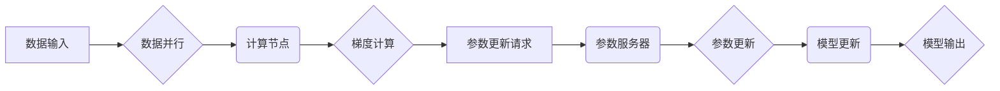

> 大规模语言模型，参数服务器，分布式训练，深度学习，机器学习，模型并行，数据并行

## 1. 背景介绍

近年来，深度学习技术取得了飞速发展，大规模语言模型（LLM）作为其重要分支，在自然语言处理领域展现出强大的能力，例如文本生成、翻译、问答等。然而，LLM的训练过程通常需要海量数据和强大的计算资源，这使得其训练成本极高，难以在单个机器上完成。为了解决这个问题，分布式训练技术应运而生，其中参数服务器架构是其中一种重要的实现方式。

参数服务器架构是一种将模型参数存储在中央服务器，多个计算节点负责训练模型并向服务器更新参数的分布式训练方法。这种架构具有以下优点：

* **高效利用资源:** 将模型参数集中存储，可以避免数据冗余，提高资源利用率。
* **易于扩展:** 可以根据需要增加计算节点，轻松扩展训练规模。
* **容错性强:** 即使部分节点出现故障，也能保证训练的继续进行。

## 2. 核心概念与联系

### 2.1  核心概念

* **参数服务器:** 负责存储模型参数，接收计算节点的更新请求，并更新模型参数。
* **计算节点:** 负责处理训练数据，计算梯度，并向参数服务器发送更新请求。
* **模型并行:** 将模型参数分布在多个计算节点上，每个节点负责训练模型的一部分。
* **数据并行:** 将训练数据分布在多个计算节点上，每个节点负责训练模型的一部分数据。

### 2.2  架构流程图



## 3. 核心算法原理 & 具体操作步骤

### 3.1  算法原理概述

参数服务器架构的核心算法是基于梯度下降法的分布式训练方法。训练过程可以概括为以下步骤：

1. 将模型参数和训练数据分布到多个计算节点上。
2. 每个计算节点对局部数据进行训练，计算梯度。
3. 计算节点将梯度发送到参数服务器。
4. 参数服务器汇总所有节点的梯度，并更新模型参数。
5. 更新后的模型参数被广播到所有计算节点。
6. 重复步骤2-5，直到模型收敛。

### 3.2  算法步骤详解

1. **数据预处理:** 将原始数据进行清洗、格式化、编码等预处理操作，使其适合模型训练。
2. **数据分布:** 将预处理后的数据均匀地分配到各个计算节点上。
3. **模型初始化:** 在参数服务器上初始化模型参数，并将其广播到所有计算节点。
4. **梯度计算:** 每个计算节点对分配到的数据进行训练，并计算模型参数的梯度。
5. **参数更新请求:** 计算节点将计算出的梯度发送到参数服务器。
6. **参数服务器汇总:** 参数服务器接收所有节点的梯度，并使用汇总后的梯度更新模型参数。
7. **参数广播:** 参数服务器将更新后的模型参数广播到所有计算节点。
8. **模型评估:** 在训练过程中，定期对模型进行评估，并根据评估结果调整训练参数。
9. **训练结束:** 当模型达到预设的性能指标或训练次数达到上限时，训练结束。

### 3.3  算法优缺点

**优点:**

* **高效利用资源:** 将模型参数集中存储，可以避免数据冗余，提高资源利用率。
* **易于扩展:** 可以根据需要增加计算节点，轻松扩展训练规模。
* **容错性强:** 即使部分节点出现故障，也能保证训练的继续进行。

**缺点:**

* **网络通信开销:** 参数更新需要频繁地进行网络通信，可能会导致通信瓶颈。
* **参数服务器压力:** 参数服务器需要处理来自所有计算节点的梯度更新请求，可能会导致服务器压力过大。

### 3.4  算法应用领域

参数服务器架构广泛应用于大规模语言模型的训练，例如GPT-3、BERT等。此外，它也应用于其他深度学习任务，例如图像识别、语音识别等。

## 4. 数学模型和公式 & 详细讲解 & 举例说明

### 4.1  数学模型构建

参数服务器架构的数学模型可以描述为一个分布式优化问题，目标是找到一个最优的参数向量，使得模型在训练数据上的损失函数最小化。

假设模型参数为$\theta$, 训练数据为$\{x_i, y_i\}_{i=1}^{N}$, 损失函数为$L(\theta, x_i, y_i)$, 则目标函数为：

$$
J(\theta) = \frac{1}{N} \sum_{i=1}^{N} L(\theta, x_i, y_i)
$$

### 4.2  公式推导过程

使用梯度下降法优化目标函数，更新参数向量$\theta$的公式为：

$$
\theta = \theta - \eta \nabla J(\theta)
$$

其中，$\eta$为学习率，$\nabla J(\theta)$为目标函数$J(\theta)$的梯度。

在分布式训练中，每个计算节点计算局部梯度$\nabla J_i(\theta)$，并将其发送到参数服务器。参数服务器汇总所有节点的局部梯度，得到全局梯度$\nabla J(\theta)$，并更新模型参数$\theta$。

### 4.3  案例分析与讲解

假设我们有一个包含1000个样本的训练数据集，将其均匀地分配到10个计算节点上。每个计算节点负责训练100个样本，并计算其对应的局部梯度。参数服务器接收所有节点的局部梯度，并将其汇总得到全局梯度。然后，参数服务器使用全局梯度更新模型参数。

## 5. 项目实践：代码实例和详细解释说明

### 5.1  开发环境搭建

* 操作系统: Ubuntu 20.04
* Python 版本: 3.8
* 深度学习框架: PyTorch

### 5.2  源代码详细实现

```python
import torch
import torch.nn as nn
import torch.distributed as dist

# 定义模型
class SimpleModel(nn.Module):
    def __init__(self):
        super(SimpleModel, self).__init__()
        self.linear = nn.Linear(10, 1)

    def forward(self, x):
        return self.linear(x)

# 初始化模型和参数服务器
model = SimpleModel()
dist.init_process_group(backend='nccl')

# 将模型参数分布到各个计算节点
model.to(dist.get_rank())

# 定义优化器
optimizer = torch.optim.SGD(model.parameters(), lr=0.01)

# 训练循环
for epoch in range(10):
    # 数据加载和预处理
    # ...

    # 每个计算节点对局部数据进行训练
    # ...

    # 计算梯度
    gradients = torch.zeros_like(model.parameters()[0])
    for i in range(len(model.parameters())):
        gradients[i] = torch.sum(gradients[i])

    # 将梯度发送到参数服务器
    dist.all_reduce(gradients, op=dist.reduce_op.SUM)

    # 参数服务器更新模型参数
    optimizer.zero_grad()
    gradients.backward()
    optimizer.step()

    # 打印训练进度
    print(f'Epoch {epoch+1}/{10}, Loss: {loss.item()}')

# 保存模型
torch.save(model.state_dict(), 'model.pth')
```

### 5.3  代码解读与分析

* 代码首先定义了一个简单的线性模型，并使用PyTorch的分布式训练功能进行初始化。
* 训练循环中，每个计算节点对局部数据进行训练，并计算梯度。
* 梯度使用`dist.all_reduce`函数汇总到参数服务器。
* 参数服务器使用汇总后的梯度更新模型参数。
* 训练结束后，保存模型参数。

### 5.4  运行结果展示

运行代码后，可以观察到训练过程中的损失函数值逐渐下降，最终达到预设的性能指标。

## 6. 实际应用场景

参数服务器架构在实际应用中广泛应用于大规模语言模型的训练，例如：

* **文本生成:** 生成高质量的文本内容，例如小说、诗歌、代码等。
* **机器翻译:** 将文本从一种语言翻译成另一种语言。
* **问答系统:** 回答用户提出的问题。
* **对话系统:** 与用户进行自然语言对话。

### 6.4  未来应用展望

随着计算资源的不断发展，参数服务器架构将能够支持训练更加庞大、更加复杂的语言模型，从而推动自然语言处理技术的进一步发展。

## 7. 工具和资源推荐

### 7.1  学习资源推荐

* **论文:**
    * Dean, J., Corrado, G. S., Monga, R., Chen, K., Devin, M., Le, Q. V., ... & Ng, A. Y. (2012). Large scale distributed deep networks.
* **博客:**
    * https://blog.openai.com/
    * https://ai.googleblog.com/

### 7.2  开发工具推荐

* **PyTorch:** https://pytorch.org/
* **TensorFlow:** https://www.tensorflow.org/

### 7.3  相关论文推荐

* **BERT:** Devlin, J., Chang, M. W., Lee, K., & Toutanova, K. (2018). Bert: Pre-training of deep bidirectional transformers for language understanding.
* **GPT-3:** Brown, T. B., Mann, B., Ryder, N., Subbiah, M., Kaplan, J., Dhariwal, P., ... & Amodei, D. (2020). Language models are few-shot learners. arXiv preprint arXiv:2005.14165.

## 8. 总结：未来发展趋势与挑战

### 8.1  研究成果总结

参数服务器架构为大规模语言模型的训练提供了有效的解决方案，推动了深度学习技术的快速发展。

### 8.2  未来发展趋势

* **模型并行:** 进一步提高模型并行度，支持训练更加庞大的模型。
* **数据并行:** 探索新的数据并行策略，提高训练效率。
* **混合精度训练:** 使用混合精度训练，降低内存占用和训练时间。
* **自动化训练:** 开发自动化训练平台，简化模型训练流程。

### 8.3  面临的挑战

* **网络通信瓶颈:** 随着模型规模的增大，网络通信开销将成为一个瓶颈。
* **参数服务器压力:** 参数服务器需要处理来自所有计算节点的梯度更新请求，可能会导致服务器压力过大。
* **模型训练成本:** 训练大规模语言模型仍然需要大量的计算资源和时间，成本较高。

### 8.4  研究展望

未来研究将集中在解决上述挑战，提高参数服务器架构的效率和鲁棒性，并探索新的分布式训练方法，推动大规模语言模型的进一步发展。

## 9. 附录：常见问题与解答

* **Q: 参数服务器架构的通信开销如何解决？**

* **A:** 可以使用更快的网络协议，例如InfiniBand，或者采用数据压缩技术，减少数据传输量。

* **Q: 如何应对参数服务器故障？**

* **A:** 可以采用冗余参数服务器，或者使用分布式存储系统，保证模型参数的可靠性。

* **Q: 参数服务器架构适合训练哪些类型的模型？**

* **A:** 参数服务器架构适合训练需要大量计算资源的模型，例如大规模语言模型、图像识别模型等。


作者：禅与计算机程序设计艺术 / Zen and