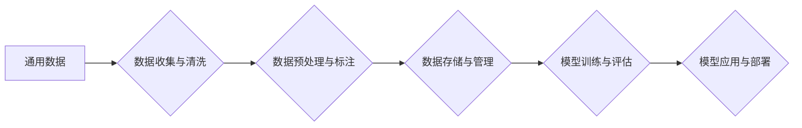

> 大规模语言模型，通用数据，深度学习，Transformer，自然语言处理，文本生成

## 1. 背景介绍

近年来，深度学习技术取得了飞速发展，特别是大规模语言模型（Large Language Models，LLMs）的出现，为自然语言处理（Natural Language Processing，NLP）领域带来了革命性的变革。LLMs 拥有庞大的参数量和海量文本数据训练，能够理解和生成人类语言，展现出强大的文本生成、翻译、问答、摘要等能力。

然而，LLMs 的训练和应用也面临着诸多挑战：

* **数据依赖性:** LLMs 的性能高度依赖于训练数据的质量和规模。高质量、多样化的训练数据对于模型的准确性和泛化能力至关重要。
* **计算资源需求:** 训练大型语言模型需要大量的计算资源和时间，这对于资源有限的机构和个人来说是一个瓶颈。
* **可解释性和安全性:** LLMs 的决策过程往往是黑盒式的，难以解释模型的输出结果，这对于一些安全敏感的应用场景来说是一个风险。

为了解决这些挑战，研究者们正在积极探索新的训练方法、模型架构和应用场景。其中，通用数据（General Data）的概念逐渐成为研究热点。通用数据是指能够用于训练多种不同类型模型的数据，具有广泛的应用场景和价值。

## 2. 核心概念与联系

**2.1 通用数据概念**

通用数据是指能够用于训练多种不同类型模型的数据，具有广泛的应用场景和价值。它不同于特定领域的数据，例如医学图像数据、金融交易数据等，而是涵盖更广泛的主题和领域。

**2.2 通用数据与 LLMs 的关系**

通用数据对于 LLMs 的训练和应用至关重要。

* **数据规模和多样性:** 通用数据可以提供更大的数据规模和更广泛的主题覆盖范围，有助于 LLMs 提升其理解和生成语言的能力。
* **模型泛化能力:** 通过训练于通用数据，LLMs 可以获得更强的泛化能力，能够应用于更广泛的场景和任务。
* **跨领域迁移学习:** 通用数据可以作为基础，进行跨领域迁移学习，将 LLMs 的知识迁移到新的领域。

**2.3 通用数据构建与应用**

构建通用数据需要考虑以下几个方面：

* **数据来源:** 从互联网、书籍、百科全书等多种来源收集数据。
* **数据清洗和预处理:** 去除噪声数据、格式化数据、标注数据等。
* **数据多样性:** 确保数据涵盖不同主题、风格、格式等。
* **数据质量:** 确保数据准确、完整、可靠。

通用数据可以应用于多种场景，例如：

* **文本生成:** 生成小说、诗歌、剧本等创意文本。
* **机器翻译:** 将文本从一种语言翻译成另一种语言。
* **问答系统:** 回答用户提出的问题。
* **对话系统:** 与用户进行自然语言对话。

**2.4 Mermaid 流程图**



## 3. 核心算法原理 & 具体操作步骤

**3.1 算法原理概述**

大规模语言模型的训练主要基于深度学习算法，特别是 Transformer 架构。Transformer 是一种基于注意力机制的神经网络架构，能够有效地捕捉文本序列中的长距离依赖关系。

**3.2 算法步骤详解**

1. **数据预处理:** 将文本数据转换为数字格式，例如词嵌入。
2. **模型训练:** 使用深度学习算法，例如 Transformer，训练语言模型。
3. **模型评估:** 使用测试数据评估模型的性能，例如困惑度、BLEU 等指标。
4. **模型调优:** 根据评估结果，调整模型参数，例如学习率、批处理大小等，以提高模型性能。
5. **模型部署:** 将训练好的模型部署到实际应用场景中。

**3.3 算法优缺点**

**优点:**

* 能够捕捉文本序列中的长距离依赖关系。
* 训练效率高，能够处理海量数据。
* 性能优异，在多种 NLP 任务中取得了突破性进展。

**缺点:**

* 计算资源需求高，训练成本高昂。
* 模型参数量大，难以解释模型的决策过程。
* 容易受到训练数据偏差的影响。

**3.4 算法应用领域**

* 文本生成
* 机器翻译
* 问答系统
* 对话系统
* 文本摘要
* 情感分析
* 代码生成

## 4. 数学模型和公式 & 详细讲解 & 举例说明

**4.1 数学模型构建**

LLMs 通常使用 Transformer 架构，其核心是注意力机制。注意力机制允许模型关注输入序列中与当前任务相关的部分，从而提高模型的理解和生成能力。

**4.2 公式推导过程**

注意力机制的计算公式如下：

$$
\text{Attention}(Q, K, V) = \text{softmax}\left(\frac{Q K^T}{\sqrt{d_k}}\right) V
$$

其中：

* $Q$：查询矩阵
* $K$：键矩阵
* $V$：值矩阵
* $d_k$：键向量的维度
* $\text{softmax}$：softmax 函数

**4.3 案例分析与讲解**

假设我们有一个句子 "The cat sat on the mat"，我们要计算 "sat" 这个词的注意力权重。

* $Q$：包含 "sat" 词的查询向量
* $K$：包含所有词的键向量
* $V$：包含所有词的价值向量

通过计算 $QK^T$，得到每个词与 "sat" 的相似度得分。然后使用 softmax 函数将得分归一化，得到每个词的注意力权重。

## 5. 项目实践：代码实例和详细解释说明

**5.1 开发环境搭建**

* Python 3.7+
* PyTorch 或 TensorFlow
* CUDA 和 cuDNN

**5.2 源代码详细实现**

```python
import torch
import torch.nn as nn

class Transformer(nn.Module):
    def __init__(self, vocab_size, embedding_dim, num_heads, num_layers):
        super(Transformer, self).__init__()
        self.embedding = nn.Embedding(vocab_size, embedding_dim)
        self.transformer_layers = nn.ModuleList([
            nn.TransformerEncoderLayer(embedding_dim, num_heads)
            for _ in range(num_layers)
        ])
        self.linear = nn.Linear(embedding_dim, vocab_size)

    def forward(self, x):
        x = self.embedding(x)
        for layer in self.transformer_layers:
            x = layer(x)
        x = self.linear(x)
        return x
```

**5.3 代码解读与分析**

* `Transformer` 类定义了 Transformer 模型的结构。
* `embedding` 层将词索引转换为词向量。
* `transformer_layers` 是一个列表，包含多个 Transformer Encoder Layer。
* `linear` 层将词向量映射到输出词汇表。

**5.4 运行结果展示**

训练好的 Transformer 模型可以用于各种 NLP 任务，例如文本生成、机器翻译等。

## 6. 实际应用场景

**6.1 文本生成**

LLMs 可以用于生成各种类型的文本，例如小说、诗歌、剧本等。

**6.2 机器翻译**

LLMs 可以用于将文本从一种语言翻译成另一种语言。

**6.3 问答系统**

LLMs 可以用于构建问答系统，回答用户提出的问题。

**6.4 对话系统**

LLMs 可以用于构建对话系统，与用户进行自然语言对话。

**6.5 未来应用展望**

LLMs 的应用场景还在不断扩展，未来可能应用于：

* 教育领域：个性化学习、智能辅导
* 医疗领域：疾病诊断、医疗记录分析
* 法律领域：法律文本分析、合同审查
* 娱乐领域：游戏剧本创作、虚拟角色扮演

## 7. 工具和资源推荐

**7.1 学习资源推荐**

* **书籍:**
    * 《深度学习》
    * 《自然语言处理》
* **在线课程:**
    * Coursera: 自然语言处理
    * edX: 深度学习
* **博客和论坛:**
    * Hugging Face
    * TensorFlow Blog
    * PyTorch Blog

**7.2 开发工具推荐**

* **深度学习框架:**
    * PyTorch
    * TensorFlow
* **自然语言处理库:**
    * NLTK
    * SpaCy
* **文本处理工具:**
    * BeautifulSoup
    * Gensim

**7.3 相关论文推荐**

* 《Attention Is All You Need》
* 《BERT: Pre-training of Deep Bidirectional Transformers for Language Understanding》
* 《GPT-3: Language Models are Few-Shot Learners》

## 8. 总结：未来发展趋势与挑战

**8.1 研究成果总结**

近年来，LLMs 取得了显著进展，在文本生成、机器翻译、问答系统等领域取得了突破性成果。通用数据概念的提出为 LLMs 的训练和应用提供了新的思路。

**8.2 未来发展趋势**

* **模型规模和能力提升:** 研究者们将继续探索更大的模型规模和更强大的模型能力。
* **训练效率提升:** 研究者们将继续探索新的训练方法和算法，提高模型训练效率。
* **可解释性和安全性提升:** 研究者们将继续探索模型的可解释性和安全性，使其能够更好地应用于安全敏感的场景。
* **跨模态学习:** LLMs 将与其他模态数据（例如图像、音频）进行融合，实现跨模态学习。

**8.3 面临的挑战**

* **数据获取和标注:** 构建高质量、多样化的通用数据仍然是一个挑战。
* **计算资源需求:** 训练大型语言模型需要大量的计算资源，这对于资源有限的机构和个人来说是一个瓶颈。
* **模型可解释性和安全性:** LLMs 的决策过程往往是黑盒式的，难以解释模型的输出结果，这对于一些安全敏感的应用场景来说是一个风险。

**8.4 研究展望**

未来，LLMs 将继续朝着更强大、更安全、更可解释的方向发展，并在更多领域发挥重要作用。


## 9. 附录：常见问题与解答

**9.1 如何构建通用数据？**

构建通用数据需要考虑以下几个方面：

* **数据来源:** 从互联网、书籍、百科全书等多种来源收集数据。
* **数据清洗和预处理:** 去除噪声数据、格式化数据、标注数据等。
* **数据多样性:** 确保数据涵盖不同主题、风格、格式等。
* **数据质量:** 确保数据准确、完整、可靠。

**9.2 如何训练大型语言模型？**

训练大型语言模型需要使用深度学习算法，例如 Transformer，并使用大量的计算资源和时间。

**9.3 如何评估大型语言模型的性能？**

可以使用困惑度、BLEU 等指标来评估大型语言模型的性能。

**9.4 如何部署大型语言模型？**

可以使用云平台或本地服务器部署大型语言模型。


作者：禅与计算机程序设计艺术 / Zen and the Art of Computer Programming 
<end_of_turn>