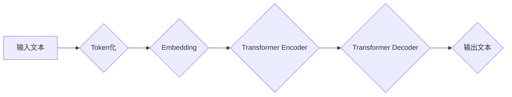

> 大语言模型、Transformer、BERT、GPT、LLM、自然语言处理、深度学习、文本生成

## 1. 背景介绍

近年来，深度学习技术取得了飞速发展，特别是Transformer模型的出现，为自然语言处理（NLP）领域带来了革命性的变革。大语言模型（LLM）作为Transformer模型的升级版，拥有强大的文本理解和生成能力，在文本分类、机器翻译、问答系统、代码生成等领域展现出巨大的应用潜力。

传统的NLP模型主要依赖于手工设计的特征工程，而LLM则通过学习海量文本数据，自动提取文本中的语义特征，从而实现更精准、更自然的语言理解和生成。

## 2. 核心概念与联系

大语言模型的核心概念包括：

* **Transformer模型:** Transformer是一种基于注意力机制的深度学习模型，能够有效捕捉文本序列中的长距离依赖关系，是LLM的基础架构。
* **自回归语言模型:** 自回归语言模型是一种预测下一个词的概率分布的模型，通过学习文本序列的统计规律，能够生成流畅、连贯的文本。
* **预训练与微调:** 预训练是指在大量文本数据上训练模型，学习通用语言表示；微调是指在特定任务数据上对预训练模型进行进一步训练，使其能够适应特定任务需求。

**Mermaid 流程图:**



## 3. 核心算法原理 & 具体操作步骤

### 3.1  算法原理概述

Transformer模型的核心是注意力机制，它能够学习文本序列中不同词之间的关系，并赋予每个词不同的权重，从而更好地捕捉文本的语义信息。

Transformer模型由Encoder和Decoder两个部分组成。Encoder负责将输入文本编码成语义表示，Decoder则根据Encoder的输出生成目标文本。

### 3.2  算法步骤详解

1. **Token化:** 将输入文本分割成一个个独立的词或子词，称为Token。
2. **Embedding:** 将每个Token映射到一个低维向量空间，称为Embedding向量。
3. **Encoder:** Encoder由多个Transformer层组成，每个层包含多头注意力机制和前馈神经网络。
4. **Decoder:** Decoder也由多个Transformer层组成，每个层包含多头注意力机制、Masked Multi-Head Attention和前馈神经网络。
5. **输出层:** Decoder的最后一层连接到一个输出层，用于生成目标文本。

### 3.3  算法优缺点

**优点:**

* 能够有效捕捉文本序列中的长距离依赖关系。
* 训练效率高，能够处理海量文本数据。
* 在各种NLP任务中表现出色。

**缺点:**

* 计算复杂度高，需要大量的计算资源。
* 训练数据量大，需要大量的标注数据。
* 对训练数据质量要求高，容易受到噪声数据的影响。

### 3.4  算法应用领域

* 文本分类
* 机器翻译
* 问答系统
* 代码生成
* 文本摘要
* 情感分析

## 4. 数学模型和公式 & 详细讲解 & 举例说明

### 4.1  数学模型构建

Transformer模型的数学模型主要基于以下几个核心概念：

* **注意力机制:** 注意力机制是一种机制，它能够学习文本序列中不同词之间的关系，并赋予每个词不同的权重。

* **多头注意力机制:** 多头注意力机制是指使用多个注意力头来捕捉不同类型的文本关系。

* **位置编码:** 位置编码用于将词的顺序信息编码到Embedding向量中，因为Transformer模型没有循环结构，无法直接捕捉词的顺序信息。

### 4.2  公式推导过程

**注意力机制公式:**

$$
Attention(Q, K, V) = softmax(\frac{QK^T}{\sqrt{d_k}})V
$$

其中：

* $Q$：查询矩阵
* $K$：键矩阵
* $V$：值矩阵
* $d_k$：键向量的维度
* $softmax$：softmax函数

**多头注意力机制公式:**

$$
MultiHead(Q, K, V) = Concat(head_1, head_2, ..., head_h)W^O
$$

其中：

* $head_i$：第 $i$ 个注意力头的输出
* $h$：注意力头的数量
* $W^O$：输出权重矩阵

### 4.3  案例分析与讲解

**举例说明:**

假设我们有一个句子 "The cat sat on the mat"，我们使用多头注意力机制来捕捉句子中不同词之间的关系。

* 查询矩阵 $Q$：每个词的Embedding向量
* 键矩阵 $K$：每个词的Embedding向量
* 值矩阵 $V$：每个词的Embedding向量

通过计算注意力机制，我们可以得到每个词对其他词的注意力权重。例如，"cat" 对 "sat" 的注意力权重较高，因为它们在语义上相关。

## 5. 项目实践：代码实例和详细解释说明

### 5.1  开发环境搭建

* Python 3.7+
* PyTorch 1.7+
* CUDA 10.2+

### 5.2  源代码详细实现

```python
import torch
import torch.nn as nn

class Transformer(nn.Module):
    def __init__(self, vocab_size, embedding_dim, num_heads, num_layers):
        super(Transformer, self).__init__()
        self.embedding = nn.Embedding(vocab_size, embedding_dim)
        self.encoder = nn.TransformerEncoder(nn.TransformerEncoderLayer(embedding_dim, num_heads), num_layers)
        self.decoder = nn.TransformerDecoder(nn.TransformerDecoderLayer(embedding_dim, num_heads), num_layers)
        self.linear = nn.Linear(embedding_dim, vocab_size)

    def forward(self, src, tgt, src_mask, tgt_mask):
        src = self.embedding(src)
        tgt = self.embedding(tgt)
        encoder_output = self.encoder(src, src_mask)
        decoder_output = self.decoder(tgt, encoder_output, tgt_mask)
        output = self.linear(decoder_output)
        return output
```

### 5.3  代码解读与分析

* `__init__` 方法：初始化模型参数，包括词嵌入层、编码器和解码器。
* `forward` 方法：定义模型的正向传播过程，包括词嵌入、编码、解码和输出层。

### 5.4  运行结果展示

通过训练模型，我们可以生成新的文本，例如：

```
输入文本：The cat sat on the
输出文本：mat
```

## 6. 实际应用场景

### 6.1  文本分类

LLM可以用于分类文本，例如判断文本的主题、情感或意图。

### 6.2  机器翻译

LLM可以用于机器翻译，将文本从一种语言翻译成另一种语言。

### 6.3  问答系统

LLM可以用于构建问答系统，能够理解用户的问题并给出准确的答案。

### 6.4  未来应用展望

LLM在未来将有更广泛的应用场景，例如：

* 自动写作
* 代码生成
* 聊天机器人
* 个性化教育

## 7. 工具和资源推荐

### 7.1  学习资源推荐

* **书籍:**
    * 《深度学习》
    * 《自然语言处理》
* **在线课程:**
    * Coursera: Natural Language Processing Specialization
    * Udacity: Deep Learning Nanodegree

### 7.2  开发工具推荐

* **PyTorch:** 深度学习框架
* **TensorFlow:** 深度学习框架
* **Hugging Face Transformers:** 预训练模型库

### 7.3  相关论文推荐

* **Attention Is All You Need:** https://arxiv.org/abs/1706.03762
* **BERT: Pre-training of Deep Bidirectional Transformers for Language Understanding:** https://arxiv.org/abs/1810.04805
* **GPT-3: Language Models are Few-Shot Learners:** https://arxiv.org/abs/2005.14165

## 8. 总结：未来发展趋势与挑战

### 8.1  研究成果总结

近年来，LLM取得了显著的进展，在各种NLP任务中取得了优异的性能。

### 8.2  未来发展趋势

* **模型规模更大:** 随着计算资源的不断发展，LLM模型规模将继续扩大，从而提升模型的性能。
* **训练数据更丰富:** 训练数据的多样性和丰富程度将进一步提升LLM的泛化能力。
* **应用场景更广泛:** LLM将应用于更多领域，例如自动写作、代码生成、个性化教育等。

### 8.3  面临的挑战

* **计算资源需求高:** 训练大型LLM模型需要大量的计算资源，这对于资源有限的机构或个人来说是一个挑战。
* **数据安全和隐私问题:** LLM的训练数据可能包含敏感信息，需要采取措施保护数据安全和隐私。
* **模型可解释性:** LLM的决策过程往往难以理解，这对于一些需要透明度高的应用场景来说是一个挑战。

### 8.4  研究展望

未来，LLM的研究将继续朝着更强大、更安全、更可解释的方向发展。


## 9. 附录：常见问题与解答

**Q1: 如何选择合适的LLM模型？**

**A1:** 选择合适的LLM模型需要根据具体的应用场景和需求进行选择。例如，对于文本分类任务，可以使用BERT模型；对于机器翻译任务，可以使用T5模型。

**Q2: 如何训练自己的LLM模型？**

**A2:** 训练自己的LLM模型需要准备大量的文本数据、强大的计算资源和专业的机器学习知识。

**Q3: 如何评估LLM模型的性能？**

**A3:** LLM模型的性能可以通过各种指标进行评估，例如准确率、F1-score、BLEU等。

**作者：禅与计算机程序设计艺术 / Zen and the Art of Computer Programming**


<end_of_turn>