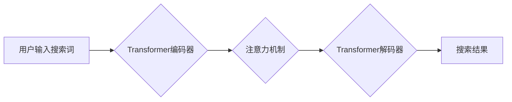

> 大语言模型，Transformer，搜索引擎，自然语言处理，深度学习，BERT，GPT

## 1. 背景介绍

随着互联网信息爆炸式增长，海量文本数据的处理和理解成为人工智能领域的核心挑战。大语言模型 (Large Language Model, LLM) 作为一种强大的深度学习模型，在自然语言处理 (NLP) 领域取得了突破性进展，展现出强大的文本生成、翻译、摘要、问答等能力。

传统的搜索引擎主要依赖于关键词匹配和网页排名算法，难以准确理解用户搜索意图，并提供高质量的搜索结果。而基于 Transformer 架构的 LLMs 能够捕捉文本中的语义关系和上下文信息，更精准地理解用户需求，为用户提供更相关、更丰富的搜索体验。

## 2. 核心概念与联系

**2.1 大语言模型 (LLM)**

大语言模型是指拥有大量参数 (数十亿甚至千亿) 的深度神经网络模型，通过训练海量文本数据，学习语言的语法、语义和知识。

**2.2 Transformer**

Transformer 是一种基于注意力机制的深度学习架构，能够有效处理长序列数据，并捕捉文本中的长距离依赖关系。

**2.3 搜索高效Transformer**

搜索高效Transformer 是将 Transformer 架构应用于搜索引擎，以提升搜索结果的准确性和相关性。

**2.4 流程图**



## 3. 核心算法原理 & 具体操作步骤

**3.1 算法原理概述**

Transformer 模型的核心是注意力机制，它能够学习文本中不同词语之间的关系，并赋予每个词语不同的权重，从而更好地理解文本的语义。

**3.2 算法步骤详解**

1. **词嵌入:** 将输入的文本词语转换为向量表示，每个词语对应一个唯一的向量。
2. **编码器:** 使用多层 Transformer 块对文本进行编码，每个块包含多头注意力机制和前馈神经网络。
3. **解码器:** 使用多层 Transformer 块对编码后的文本进行解码，生成搜索结果。
4. **注意力机制:** 在 Transformer 块中，注意力机制用于计算每个词语与其他词语之间的关系，并赋予每个词语不同的权重。
5. **多头注意力:** 使用多个注意力头，每个头关注不同的文本方面，从而更全面地理解文本语义。

**3.3 算法优缺点**

**优点:**

* 能够捕捉文本中的长距离依赖关系。
* 训练效率高，能够处理海量文本数据。
* 在各种 NLP 任务中表现出色。

**缺点:**

* 参数量大，需要大量的计算资源进行训练。
* 对训练数据的质量要求高。

**3.4 算法应用领域**

* 搜索引擎
* 机器翻译
* 文本摘要
* 问答系统
* 代码生成

## 4. 数学模型和公式 & 详细讲解 & 举例说明

**4.1 数学模型构建**

Transformer 模型的数学模型主要包括以下几个部分:

* 词嵌入层
* 编码器层
* 解码器层
* 注意力机制

**4.2 公式推导过程**

注意力机制的核心公式如下:

$$
Attention(Q, K, V) = softmax(\frac{QK^T}{\sqrt{d_k}})V
$$

其中:

* Q: 查询矩阵
* K: 键矩阵
* V: 值矩阵
* $d_k$: 键向量的维度

**4.3 案例分析与讲解**

假设我们有一个句子 "The cat sat on the mat"，我们需要计算每个词语与其他词语之间的注意力权重。

1. 将每个词语转换为向量表示，形成词嵌入矩阵。
2. 使用注意力机制计算每个词语与其他词语之间的注意力权重。
3. 将注意力权重与值矩阵相乘，得到每个词语的加权和，作为该词语的最终表示。

## 5. 项目实践：代码实例和详细解释说明

**5.1 开发环境搭建**

* Python 3.7+
* PyTorch 1.7+
* CUDA 10.2+

**5.2 源代码详细实现**

```python
import torch
import torch.nn as nn

class Transformer(nn.Module):
    def __init__(self, vocab_size, embedding_dim, num_heads, num_layers):
        super(Transformer, self).__init__()
        self.embedding = nn.Embedding(vocab_size, embedding_dim)
        self.encoder = nn.TransformerEncoder(nn.TransformerEncoderLayer(embedding_dim, num_heads), num_layers)
        self.decoder = nn.TransformerDecoder(nn.TransformerDecoderLayer(embedding_dim, num_heads), num_layers)

    def forward(self, src, tgt):
        src = self.embedding(src)
        tgt = self.embedding(tgt)
        output = self.decoder(tgt, src)
        return output

# 实例化模型
model = Transformer(vocab_size=10000, embedding_dim=512, num_heads=8, num_layers=6)
```

**5.3 代码解读与分析**

* `Transformer` 类定义了 Transformer 模型的结构。
* `embedding` 层将词语转换为向量表示。
* `encoder` 和 `decoder` 层分别负责编码和解码文本。
* `forward` 方法定义了模型的输入和输出。

**5.4 运行结果展示**

使用训练好的模型，可以对文本进行编码和解码，例如生成文本摘要、翻译文本等。

## 6. 实际应用场景

**6.1 搜索引擎**

* 使用 Transformer 模型理解用户搜索意图，提供更精准的搜索结果。
* 生成更相关的搜索建议，提升用户搜索体验。

**6.2 机器翻译**

* 使用 Transformer 模型进行机器翻译，提高翻译质量和效率。

**6.3 文本摘要**

* 使用 Transformer 模型生成文本摘要，提取文本关键信息。

**6.4 问答系统**

* 使用 Transformer 模型构建问答系统，回答用户问题。

**6.5 代码生成**

* 使用 Transformer 模型生成代码，提高开发效率。

**6.6 未来应用展望**

* 更智能的聊天机器人
* 个性化的教育系统
* 更加精准的医疗诊断

## 7. 工具和资源推荐

**7.1 学习资源推荐**

* Transformer 原论文: https://arxiv.org/abs/1706.03762
* Hugging Face Transformers 库: https://huggingface.co/transformers/

**7.2 开发工具推荐**

* PyTorch: https://pytorch.org/
* TensorFlow: https://www.tensorflow.org/

**7.3 相关论文推荐**

* BERT: https://arxiv.org/abs/1810.04805
* GPT-3: https://openai.com/blog/gpt-3/

## 8. 总结：未来发展趋势与挑战

**8.1 研究成果总结**

Transformer 模型在 NLP 领域取得了突破性进展，为搜索引擎、机器翻译、文本摘要等领域带来了新的可能性。

**8.2 未来发展趋势**

* 更大规模的 Transformer 模型
* 更高效的 Transformer 训练方法
* 更广泛的 Transformer 应用场景

**8.3 面临的挑战**

* 模型参数量大，训练成本高
* 对训练数据的质量要求高
* 模型解释性差，难以理解模型决策过程

**8.4 研究展望**

* 研究更小规模、更高效的 Transformer 模型
* 开发新的 Transformer 训练方法
* 提高 Transformer 模型的解释性


## 9. 附录：常见问题与解答

**9.1 如何训练 Transformer 模型？**

训练 Transformer 模型需要大量的文本数据和计算资源。可以使用 PyTorch 或 TensorFlow 等深度学习框架进行训练。

**9.2 如何选择 Transformer 模型的超参数？**

Transformer 模型的超参数包括词嵌入维度、注意力头数、Transformer 层数等。可以通过交叉验证等方法选择最佳超参数。

**9.3 Transformer 模型的应用场景有哪些？**

Transformer 模型在 NLP 领域有广泛的应用场景，例如搜索引擎、机器翻译、文本摘要、问答系统等。


作者：禅与计算机程序设计艺术 / Zen and the Art of Computer Programming 
<end_of_turn>