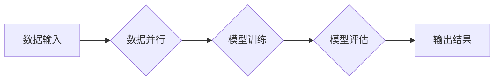

> 大语言模型、数据并行、Transformer、深度学习、自然语言处理、模型训练、分布式计算

## 1. 背景介绍

近年来，深度学习技术取得了飞速发展，特别是大语言模型（Large Language Model，LLM）的出现，为自然语言处理（Natural Language Processing，NLP）领域带来了革命性的变革。LLM 拥有强大的文本生成、理解和翻译能力，在聊天机器人、机器翻译、文本摘要等领域展现出巨大的应用潜力。

然而，训练大型语言模型需要海量数据和强大的计算资源，这给模型训练带来了巨大的挑战。数据并行训练成为解决这一挑战的关键技术之一。数据并行训练通过将训练数据分割到多个计算节点上进行并行处理，可以显著缩短模型训练时间，提高训练效率。

## 2. 核心概念与联系

**2.1 大语言模型 (LLM)**

大语言模型是指参数量巨大、训练数据海量的人工智能模型，能够理解和生成人类语言。它们通常基于 Transformer 架构，并通过大量的文本数据进行预训练，从而掌握丰富的语言知识和语法规则。

**2.2 数据并行训练**

数据并行训练是一种将训练数据分割到多个计算节点上进行并行处理的训练方法。每个节点负责处理一部分数据，并计算相应的梯度。最终，所有节点的梯度信息汇总，更新模型参数。

**2.3 Transformer 架构**

Transformer 架构是一种专门用于处理序列数据的深度学习模型架构。它利用注意力机制，能够捕捉文本序列中长距离依赖关系，从而实现更准确的语言理解和生成。

**2.4 流程图**



## 3. 核心算法原理 & 具体操作步骤

**3.1 算法原理概述**

数据并行训练的核心原理是将训练数据分割到多个计算节点上，并行计算梯度，从而加速模型训练。

**3.2 算法步骤详解**

1. **数据分割:** 将训练数据分割成多个子集，每个子集分配给一个计算节点。
2. **模型复制:** 将模型参数复制到每个计算节点上。
3. **并行训练:** 每个节点使用其分配的数据子集进行模型训练，并计算相应的梯度。
4. **梯度汇总:** 将所有节点计算的梯度信息汇总到主节点上。
5. **参数更新:** 使用汇总的梯度信息更新模型参数。
6. **重复步骤3-5:** 重复上述步骤，直到模型训练完成。

**3.3 算法优缺点**

**优点:**

* 显著提高训练速度。
* 能够训练更大规模的模型。
* 适用于分布式计算环境。

**缺点:**

* 需要复杂的分布式系统架构。
* 存在数据不平衡问题。
* 梯度汇总过程可能带来通信开销。

**3.4 算法应用领域**

数据并行训练广泛应用于各种深度学习任务，例如：

* 自然语言处理：文本分类、机器翻译、文本摘要等。
* computer vision：图像识别、目标检测、图像分割等。
* speech recognition：语音识别、语音合成等。

## 4. 数学模型和公式 & 详细讲解 & 举例说明

**4.1 数学模型构建**

假设我们有一个包含 N 个样本的数据集 D，每个样本由输入特征 x 和标签 y 组成。我们的目标是训练一个模型 f(x) 来预测标签 y。

**4.2 公式推导过程**

我们使用交叉熵损失函数来衡量模型预测结果与真实标签之间的差异。损失函数定义如下：

$$
L(f(x), y) = - \sum_{i=1}^{N} y_i \log(f(x_i))
$$

其中，$y_i$ 是第 i 个样本的真实标签，$f(x_i)$ 是模型预测的第 i 个样本的标签概率。

为了最小化损失函数，我们使用梯度下降算法来更新模型参数。梯度下降算法的更新规则如下：

$$
\theta = \theta - \alpha \nabla L(f(x), y)
$$

其中，$\theta$ 是模型参数，$\alpha$ 是学习率，$\nabla L(f(x), y)$ 是损失函数的梯度。

**4.3 案例分析与讲解**

假设我们训练一个二分类模型，用于判断文本是否属于正向情感。训练数据包含 1000 个样本，每个样本由文本内容和情感标签组成。

使用交叉熵损失函数和梯度下降算法训练模型，并使用验证集评估模型性能。

## 5. 项目实践：代码实例和详细解释说明

**5.1 开发环境搭建**

* 操作系统：Ubuntu 20.04
* Python 版本：3.8
* 深度学习框架：PyTorch 1.8

**5.2 源代码详细实现**

```python
import torch
import torch.nn as nn
import torch.optim as optim

# 定义模型
class SentimentClassifier(nn.Module):
    def __init__(self, vocab_size, embedding_dim, hidden_dim):
        super(SentimentClassifier, self).__init__()
        self.embedding = nn.Embedding(vocab_size, embedding_dim)
        self.lstm = nn.LSTM(embedding_dim, hidden_dim)
        self.fc = nn.Linear(hidden_dim, 2)

    def forward(self, x):
        x = self.embedding(x)
        x, _ = self.lstm(x)
        x = x[:, -1, :]
        x = self.fc(x)
        return x

# 初始化模型参数
vocab_size = 10000
embedding_dim = 128
hidden_dim = 256
model = SentimentClassifier(vocab_size, embedding_dim, hidden_dim)

# 定义损失函数和优化器
criterion = nn.CrossEntropyLoss()
optimizer = optim.Adam(model.parameters(), lr=0.001)

# 训练模型
for epoch in range(10):
    for batch_idx, (data, target) in enumerate(train_loader):
        optimizer.zero_grad()
        output = model(data)
        loss = criterion(output, target)
        loss.backward()
        optimizer.step()

# 评估模型性能
with torch.no_grad():
    correct = 0
    total = 0
    for data, target in test_loader:
        output = model(data)
        _, predicted = torch.max(output.data, 1)
        total += target.size(0)
        correct += (predicted == target).sum().item()

    accuracy = 100 * correct / total
    print(f'Accuracy: {accuracy:.2f}%')
```

**5.3 代码解读与分析**

* 代码首先定义了模型结构，包括嵌入层、LSTM 层和全连接层。
* 然后定义了损失函数和优化器。
* 接着进行模型训练，包括数据加载、模型前向传播、损失计算、反向传播和参数更新。
* 最后评估模型性能，计算准确率。

**5.4 运行结果展示**

运行代码后，会输出模型训练过程中的损失值和准确率，以及最终的模型准确率。

## 6. 实际应用场景

数据并行训练在实际应用场景中具有广泛的应用前景，例如：

* **大型语言模型训练:** 数据并行训练可以加速大型语言模型的训练，例如 GPT-3、BERT 等。
* **图像识别:** 数据并行训练可以提高图像识别模型的精度和速度，例如用于自动驾驶、医疗诊断等领域。
* **语音识别:** 数据并行训练可以提高语音识别模型的准确率，例如用于语音助手、语音搜索等领域。

**6.4 未来应用展望**

随着计算资源的不断发展，数据并行训练技术将更加成熟和完善，在更多领域得到应用。例如：

* **联邦学习:** 数据并行训练可以与联邦学习相结合，实现对敏感数据的安全训练。
* **边缘计算:** 数据并行训练可以应用于边缘计算场景，实现高效的本地模型训练。

## 7. 工具和资源推荐

**7.1 学习资源推荐**

* **书籍:**
    * Deep Learning by Ian Goodfellow, Yoshua Bengio, and Aaron Courville
    * Hands-On Machine Learning with Scikit-Learn, Keras & TensorFlow by Aurélien Géron
* **在线课程:**
    * Stanford CS231n: Convolutional Neural Networks for Visual Recognition
    * Deep Learning Specialization by Andrew Ng

**7.2 开发工具推荐**

* **深度学习框架:** PyTorch, TensorFlow
* **分布式计算框架:** Apache Spark, Ray

**7.3 相关论文推荐**

* **Data Parallelism for Deep Learning** by Dean et al.
* **Distributed Training of Deep Neural Networks** by Li et al.

## 8. 总结：未来发展趋势与挑战

**8.1 研究成果总结**

数据并行训练技术取得了显著的进展，为深度学习模型的训练提供了高效的解决方案。

**8.2 未来发展趋势**

未来数据并行训练技术将朝着以下方向发展：

* **更高效的并行策略:** 研究更有效的并行策略，例如混合并行、模型并行等。
* **更强大的分布式计算框架:** 开发更强大的分布式计算框架，支持更大规模的模型训练。
* **更智能的资源调度:** 研究更智能的资源调度算法，提高资源利用率。

**8.3 面临的挑战**

数据并行训练技术仍然面临一些挑战：

* **数据不平衡问题:** 数据分布不均匀会导致模型训练效果不佳。
* **通信开销:** 梯度汇总过程会带来通信开销，影响训练效率。
* **模型复杂度:** 随着模型规模的增加，训练难度和资源需求也会增加。

**8.4 研究展望**

未来研究将重点关注解决上述挑战，并探索新的数据并行训练方法，以推动深度学习技术的发展。

## 9. 附录：常见问题与解答

**9.1 如何选择合适的并行策略？**

选择合适的并行策略取决于模型结构、数据规模和计算资源等因素。

**9.2 如何解决数据不平衡问题？**

可以使用数据增强、权重调整等方法解决数据不平衡问题。

**9.3 如何降低通信开销？**

可以使用模型并行、参数服务器等方法降低通信开销。


作者：禅与计算机程序设计艺术 / Zen and the Art of Computer Programming 
<end_of_turn>