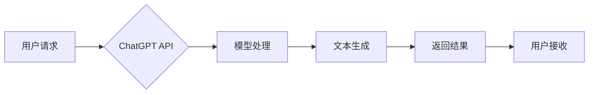

> 大语言模型，ChatGPT，API接口，文本生成，对话系统，自然语言处理，扩展功能，应用场景

## 1. 背景介绍

近年来，人工智能领域取得了令人瞩目的进展，其中大语言模型（LLM）作为一种强大的工具，在自然语言处理（NLP）领域展现出巨大的潜力。ChatGPT，作为其中最具代表性的开源模型之一，凭借其出色的文本生成能力和对话理解能力，迅速成为研究者和开发者的热门选择。

ChatGPT基于Transformer架构，通过大量的文本数据进行训练，能够理解和生成人类语言，并完成各种自然语言处理任务，例如文本摘要、机器翻译、问答系统等。其开放的API接口和丰富的扩展功能，为开发者提供了灵活的应用场景和定制化开发机会。

## 2. 核心概念与联系

### 2.1 大语言模型

大语言模型是指在海量文本数据上训练的深度学习模型，能够理解和生成人类语言。其核心特点包括：

* **规模庞大:** 大语言模型通常拥有数十亿甚至数千亿个参数，拥有强大的学习能力和表达能力。
* **文本理解能力强:** 可以理解复杂的语法结构、语义关系和上下文信息。
* **文本生成能力强:** 可以生成流畅、自然的文本，并完成各种文本创作任务。

### 2.2 ChatGPT

ChatGPT是OpenAI开发的基于GPT（Generative Pre-trained Transformer）架构的大语言模型。其特点包括：

* **对话式交互:**  ChatGPT设计为对话式交互，能够与用户进行自然流畅的对话。
* **文本生成能力强:**  能够生成高质量的文本，包括故事、诗歌、文章等。
* **多语言支持:** 支持多种语言的输入和输出。

### 2.3 API接口

API接口（Application Programming Interface）是软件之间通信的标准接口。ChatGPT提供API接口，允许开发者将ChatGPT集成到自己的应用程序中，并利用其强大的文本处理能力。

**Mermaid 流程图**



## 3. 核心算法原理 & 具体操作步骤

### 3.1 算法原理概述

ChatGPT的核心算法是基于Transformer架构的深度学习模型。Transformer是一种专门用于处理序列数据的网络结构，其特点是能够捕捉长距离依赖关系，并具有并行计算能力。

ChatGPT模型通过训练大量的文本数据，学习语言的语法规则、语义关系和上下文信息。在预测下一个词时，模型会根据之前输入的词语序列，以及其学习到的语言知识，计算出每个词的概率分布，并选择概率最高的词作为输出。

### 3.2 算法步骤详解

1. **数据预处理:** 将原始文本数据进行清洗、分词、标记等预处理操作，使其能够被模型理解。
2. **模型训练:** 使用训练数据训练Transformer模型，通过反向传播算法不断调整模型参数，使其能够准确预测下一个词。
3. **模型评估:** 使用测试数据评估模型的性能，例如准确率、困惑度等指标。
4. **模型部署:** 将训练好的模型部署到服务器上，提供API接口供用户调用。

### 3.3 算法优缺点

**优点:**

* **强大的文本生成能力:** 可以生成高质量、流畅的文本。
* **理解上下文信息:** 可以理解文本中的上下文信息，生成更符合语境的文本。
* **多语言支持:** 支持多种语言的输入和输出。

**缺点:**

* **训练成本高:** 需要大量的计算资源和训练数据。
* **可能生成不准确或有偏见的文本:** 模型的训练数据可能包含偏差，导致模型生成不准确或有偏见的文本。
* **缺乏真实世界知识:** 模型的知识主要来自于训练数据，缺乏对真实世界事件和知识的理解。

### 3.4 算法应用领域

* **聊天机器人:** 开发更智能、更自然的对话机器人。
* **文本摘要:** 自动生成文本摘要，节省时间和精力。
* **机器翻译:** 实现更准确、更流畅的机器翻译。
* **写作辅助:** 帮助用户进行写作，例如生成文章开头、提供写作建议等。
* **代码生成:** 根据自然语言描述生成代码。

## 4. 数学模型和公式 & 详细讲解 & 举例说明

### 4.1 数学模型构建

ChatGPT模型的核心是Transformer架构，其数学模型主要基于以下几个关键组件：

* **词嵌入层:** 将每个词映射到一个低维向量空间，表示词的语义信息。
* **多头注意力机制:** 捕捉词语之间的依赖关系，理解上下文信息。
* **前馈神经网络:** 对每个词的嵌入向量进行非线性变换，提取更深层的语义特征。

### 4.2 公式推导过程

**词嵌入层:**

使用词向量模型（如Word2Vec或GloVe）将每个词映射到一个低维向量空间。

**多头注意力机制:**

注意力机制计算每个词对其他词的“关注度”，并根据关注度加权求和，得到上下文信息。

公式：

$$
Attention(Q, K, V) = softmax(\frac{QK^T}{\sqrt{d_k}})V
$$

其中：

* $Q$：查询矩阵
* $K$：键矩阵
* $V$：值矩阵
* $d_k$：键向量的维度

**前馈神经网络:**

使用多层感知机（MLP）对每个词的嵌入向量进行非线性变换。

公式：

$$
FFN(x) = \sigma(W_1x + b_1)
$$

其中：

* $x$：输入向量
* $W_1$：权重矩阵
* $b_1$：偏置向量
* $\sigma$：激活函数

### 4.3 案例分析与讲解

假设我们想要使用ChatGPT生成一段关于人工智能的文本。

1. 用户输入：“人工智能的未来是什么？”
2. ChatGPT模型将用户输入的文本进行词嵌入，并使用多头注意力机制捕捉上下文信息。
3. 模型根据训练数据和上下文信息，预测下一个词，并生成一段关于人工智能未来的文本。

## 5. 项目实践：代码实例和详细解释说明

### 5.1 开发环境搭建

* Python 3.7+
* OpenAI API密钥
* pip install openai

### 5.2 源代码详细实现

```python
import openai

# 设置OpenAI API密钥
openai.api_key = "YOUR_API_KEY"

# 定义生成文本的函数
def generate_text(prompt):
    response = openai.Completion.create(
        engine="text-davinci-003",
        prompt=prompt,
        max_tokens=100,
        temperature=0.7,
    )
    return response.choices[0].text

# 用户输入
prompt = "人工智能的未来是什么？"

# 调用函数生成文本
generated_text = generate_text(prompt)

# 打印结果
print(generated_text)
```

### 5.3 代码解读与分析

* 该代码首先导入openai库，并设置OpenAI API密钥。
* 然后定义了一个`generate_text`函数，该函数接受用户输入的文本作为参数，并使用OpenAI API调用`Completion.create`接口生成文本。
* `engine`参数指定使用的模型，这里使用的是`text-davinci-003`模型。
* `prompt`参数指定用户输入的文本。
* `max_tokens`参数指定生成的文本长度，这里设置为100个词。
* `temperature`参数控制文本的随机性，值越大，生成的文本越随机。
* 最后，代码打印生成的文本。

### 5.4 运行结果展示

运行该代码后，将输出一段关于人工智能未来的文本。

## 6. 实际应用场景

### 6.1 聊天机器人

ChatGPT可以用于开发更智能、更自然的对话机器人，例如客服机器人、陪伴机器人等。

### 6.2 文本摘要

ChatGPT可以自动生成文本摘要，例如新闻文章、会议记录等，节省时间和精力。

### 6.3 机器翻译

ChatGPT可以实现更准确、更流畅的机器翻译，例如将英文翻译成中文。

### 6.4 写作辅助

ChatGPT可以帮助用户进行写作，例如生成文章开头、提供写作建议等。

### 6.5 代码生成

ChatGPT可以根据自然语言描述生成代码，例如Python代码、JavaScript代码等。

### 6.6 未来应用展望

随着大语言模型技术的不断发展，ChatGPT的应用场景将更加广泛，例如：

* **个性化教育:** 根据学生的学习情况，提供个性化的学习内容和辅导。
* **医疗诊断:** 辅助医生进行疾病诊断，提高诊断准确率。
* **法律服务:** 帮助律师进行法律研究和案件分析。

## 7. 工具和资源推荐

### 7.1 学习资源推荐

* **OpenAI官方文档:** https://platform.openai.com/docs/api-reference
* **HuggingFace Transformers库:** https://huggingface.co/docs/transformers/index
* **DeepLearning.AI课程:** https://www.deeplearning.ai/

### 7.2 开发工具推荐

* **Python:** https://www.python.org/
* **Jupyter Notebook:** https://jupyter.org/

### 7.3 相关论文推荐

* **Attention Is All You Need:** https://arxiv.org/abs/1706.03762
* **Language Models are Few-Shot Learners:** https://arxiv.org/abs/2005.14165

## 8. 总结：未来发展趋势与挑战

### 8.1 研究成果总结

ChatGPT的出现标志着大语言模型技术取得了重大进展，其强大的文本生成能力和对话理解能力为人工智能的应用带来了新的可能性。

### 8.2 未来发展趋势

* **模型规模更大:** 未来的大语言模型将拥有更多的参数，并具备更强的学习能力和表达能力。
* **多模态理解:** 大语言模型将能够理解和生成多种模态数据，例如文本、图像、音频等。
* **更强的推理能力:** 大语言模型将具备更强的逻辑推理能力和常识推理能力。

### 8.3 面临的挑战

* **数据安全和隐私:** 大语言模型的训练需要大量的文本数据，如何保证数据安全和隐私是一个重要的挑战。
* **模型可解释性:** 大语言模型的决策过程往往难以理解，如何提高模型的可解释性是一个重要的研究方向。
* **伦理问题:** 大语言模型可能被用于生成虚假信息或进行恶意攻击，如何解决伦理问题是一个重要的课题。

### 8.4 研究展望

未来，大语言模型技术将继续发展，并应用于更广泛的领域。研究者将继续探索大语言模型的潜力，并解决其面临的挑战，推动人工智能技术的发展。

## 9. 附录：常见问题与解答

**Q1: 如何获取OpenAI API密钥？**

A1: 访问OpenAI官网，注册账号并申请API密钥。

**Q2: ChatGPT模型有哪些不同的版本？**

A2: OpenAI提供多种不同的ChatGPT模型，例如text-davinci-003、gpt-3.5-turbo等，每个模型都有不同的性能和价格。

**Q3: 如何使用ChatGPT生成不同类型的文本？**

A3: 通过调整`prompt`参数，可以引导ChatGPT生成不同类型的文本，例如故事、诗歌、文章等。

**Q4: ChatGPT模型的训练数据是什么？**

A4: OpenAI没有公开ChatGPT模型的训练数据，但据了解，其训练数据包含大量的文本数据，来自互联网、书籍、代码等多种来源。

**Q5: ChatGPT模型是否可以理解中文？**

A5:  ChatGPT模型支持多种语言的输入和输出，包括中文。


作者：禅与计算机程序设计艺术 / Zen and the Art of