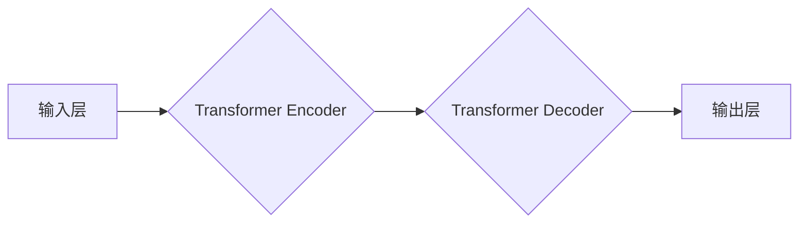

> 大语言模型，Gemini，Transformer，自然语言处理，文本生成，机器学习，深度学习

## 1. 背景介绍

近年来，人工智能领域取得了令人瞩目的进展，其中大语言模型（Large Language Models，LLMs）作为一种重要的代表，展现出强大的文本理解和生成能力。这些模型通过学习海量文本数据，能够完成各种自然语言处理（NLP）任务，例如文本分类、机器翻译、问答系统等。

Gemini作为一款开源的大语言模型，旨在为研究者和开发者提供一个灵活、可定制的平台，推动大语言模型的应用和发展。本文将深入介绍Gemini的架构、核心算法、应用场景以及未来发展趋势，帮助读者更好地理解和应用这一强大的工具。

## 2. 核心概念与联系

Gemini基于Transformer架构，该架构在自然语言处理领域取得了革命性的进展。Transformer的核心在于其自注意力机制（Self-Attention），能够捕捉文本序列中单词之间的长距离依赖关系，从而实现更准确的文本理解和生成。

**Gemini架构图**

**核心概念解释:**

* **输入层:** 将文本序列转换为数字向量，为Transformer模型提供输入。
* **Transformer Encoder:** 负责对输入文本进行编码，提取文本的语义信息。
* **Transformer Decoder:** 负责根据编码后的信息生成目标文本。
* **输出层:** 将生成的数字向量转换为文本序列。

## 3. 核心算法原理 & 具体操作步骤

### 3.1  算法原理概述

Gemini的核心算法是Transformer，其主要特点是自注意力机制和多头注意力机制。

* **自注意力机制:** 允许模型关注文本序列中任意两个单词之间的关系，捕捉长距离依赖关系。
* **多头注意力机制:** 使用多个注意力头，分别关注不同类型的语义信息，提高模型的表达能力。

### 3.2  算法步骤详解

1. **词嵌入:** 将输入文本中的每个单词转换为低维向量，表示单词的语义信息。
2. **位置编码:** 为每个单词添加位置信息，使模型能够理解单词在句子中的顺序。
3. **多头注意力:** 使用多个注意力头，分别关注不同类型的语义信息，并进行加权求和，得到最终的注意力输出。
4. **前馈神经网络:** 对注意力输出进行非线性变换，提取更深层次的语义特征。
5. **残差连接:** 将前馈神经网络的输出与输入进行相加，缓解梯度消失问题。
6. **重复步骤3-5:** 对整个文本序列进行多层Transformer编码，提取更丰富的语义信息。
7. **解码:** 使用Transformer Decoder生成目标文本，并使用自回归机制逐个预测单词。

### 3.3  算法优缺点

**优点:**

* 能够捕捉长距离依赖关系，提高文本理解和生成能力。
* 多头注意力机制提高了模型的表达能力。
* 训练效率高，能够处理海量文本数据。

**缺点:**

* 计算量大，需要强大的计算资源。
* 训练数据量大，需要大量高质量的文本数据。
* 容易出现过拟合问题，需要进行正则化和剪枝等技术。

### 3.4  算法应用领域

Transformer模型在自然语言处理领域有着广泛的应用，例如：

* **机器翻译:** 将一种语言翻译成另一种语言。
* **文本摘要:** 将长篇文本压缩成短篇摘要。
* **问答系统:** 回答用户提出的问题。
* **对话系统:** 与用户进行自然语言对话。
* **文本生成:** 生成各种类型的文本，例如诗歌、小说、新闻等。

## 4. 数学模型和公式 & 详细讲解 & 举例说明

### 4.1  数学模型构建

Transformer模型的核心是自注意力机制，其数学模型可以表示为：

$$
Attention(Q, K, V) = softmax(\frac{QK^T}{\sqrt{d_k}})V
$$

其中：

* $Q$：查询矩阵
* $K$：键矩阵
* $V$：值矩阵
* $d_k$：键向量的维度
* $softmax$：softmax函数

### 4.2  公式推导过程

自注意力机制的目的是计算每个单词与其他单词之间的相关性。

1. 将查询矩阵 $Q$ 与键矩阵 $K$ 进行矩阵乘法，得到一个得分矩阵。
2. 对得分矩阵进行归一化，使用softmax函数将得分转换为概率分布。
3. 将概率分布与值矩阵 $V$ 进行加权求和，得到每个单词的注意力输出。

### 4.3  案例分析与讲解

假设我们有一个句子 "The cat sat on the mat"，其词嵌入矩阵为：

$$
Q = \begin{bmatrix}
q_1 & q_2 & q_3 & q_4 & q_5 & q_6
\end{bmatrix}
$$

$$
K = \begin{bmatrix}
k_1 & k_2 & k_3 & k_4 & k_5 & k_6
\end{bmatrix}
$$

$$
V = \begin{bmatrix}
v_1 & v_2 & v_3 & v_4 & v_5 & v_6
\end{bmatrix}
$$

其中 $q_i$、$k_i$ 和 $v_i$ 分别表示单词 $i$ 的查询向量、键向量和值向量。

通过计算 $QK^T$ 和 softmax 函数，我们可以得到每个单词与其他单词之间的注意力权重。例如，单词 "cat" 的注意力权重会较高，因为它与 "sat" 和 "on" 这些单词有语义上的关联。

## 5. 项目实践：代码实例和详细解释说明

### 5.1  开发环境搭建

Gemini的开发环境需要 Python 3.7 或更高版本，以及一些必要的库，例如 PyTorch、Transformers 等。

### 5.2  源代码详细实现

Gemini的源代码可以在 GitHub 上找到，并提供详细的文档和示例代码。

### 5.3  代码解读与分析

Gemini的代码实现主要包括以下几个部分：

* **数据预处理:** 将文本数据转换为模型可以理解的格式。
* **模型定义:** 定义 Transformer 模型的架构和参数。
* **模型训练:** 使用训练数据训练模型，并评估模型的性能。
* **模型推理:** 使用训练好的模型进行文本生成或其他 NLP 任务。

### 5.4  运行结果展示

Gemini可以生成高质量的文本，并完成各种 NLP 任务，例如机器翻译、文本摘要、问答系统等。

## 6. 实际应用场景

Gemini在各个领域都有着广泛的应用场景，例如：

* **教育:** 自动生成学习材料、批改作业、提供个性化学习建议。
* **医疗:** 分析患者病历、辅助医生诊断、生成医疗报告。
* **客服:** 自动回复客户咨询、提供24小时在线服务。
* **娱乐:** 生成故事、诗歌、剧本等创意内容。

### 6.4  未来应用展望

随着大语言模型技术的不断发展，Gemini的应用场景将会更加广泛，例如：

* **人工智能助手:** Gemini可以成为一个强大的人工智能助手，帮助人们完成各种任务，例如日程安排、信息查询、文档处理等。
* **个性化内容推荐:** Gemini可以根据用户的兴趣爱好，推荐个性化的内容，例如新闻、视频、书籍等。
* **跨语言沟通:** Gemini可以帮助人们跨越语言障碍，进行更便捷的沟通。

## 7. 工具和资源推荐

### 7.1  学习资源推荐

* **Transformers 库:** https://huggingface.co/docs/transformers/index
* **TensorFlow 教程:** https://www.tensorflow.org/tutorials
* **PyTorch 教程:** https://pytorch.org/tutorials/

### 7.2  开发工具推荐

* **Jupyter Notebook:** https://jupyter.org/
* **VS Code:** https://code.visualstudio.com/

### 7.3  相关论文推荐

* **Attention Is All You Need:** https://arxiv.org/abs/1706.03762
* **BERT: Pre-training of Deep Bidirectional Transformers for Language Understanding:** https://arxiv.org/abs/1810.04805

## 8. 总结：未来发展趋势与挑战

### 8.1  研究成果总结

Gemini的开发和应用，标志着大语言模型在自然语言处理领域取得了新的突破。

### 8.2  未来发展趋势

未来，大语言模型将会朝着以下方向发展：

* **模型规模更大:** 模型参数量将会进一步增加，提升模型的表达能力和泛化能力。
* **多模态理解:** 模型将能够理解和生成多种模态数据，例如文本、图像、音频等。
* **更强的推理能力:** 模型将能够进行更复杂的推理和决策，例如解决逻辑问题、进行科学推理等。

### 8.3  面临的挑战

大语言模型的发展也面临着一些挑战，例如：

* **数据安全和隐私:** 大语言模型需要大量的训练数据，如何保证数据安全和隐私是一个重要问题。
* **模型可解释性:** 大语言模型的决策过程往往难以理解，如何提高模型的可解释性是一个重要的研究方向。
* **伦理问题:** 大语言模型可能被用于生成虚假信息、进行恶意攻击等，如何规范大语言模型的应用，避免其带来的负面影响是一个重要的伦理问题。

### 8.4  研究展望

未来，我们将继续致力于大语言模型的研究和应用，推动人工智能技术的发展，造福人类社会。

## 9. 附录：常见问题与解答

**Q1: Gemini 是开源的吗？**

A1: 是的，Gemini 是开源的，其源代码可以在 GitHub 上找到。

**Q2: Gemini 需要哪些硬件资源？**

A2: Gemini 的训练需要强大的计算资源，例如 GPU。

**Q3: 如何使用 Gemini 进行文本生成？**

A3: Gemini 提供了详细的文档和示例代码，可以帮助用户进行文本生成。

**Q4: Gemini 的训练数据是什么？**

A4: Gemini 的训练数据是公开可用的文本数据集，例如 Wikipedia、BookCorpus 等。

**Q5: Gemini 的未来发展方向是什么？**

A5: Gemini 的未来发展方向包括模型规模更大、多模态理解、更强的推理能力等。

作者：禅与计算机程序设计艺术 / Zen and the Art of Computer Programming 
<end_of_turn>